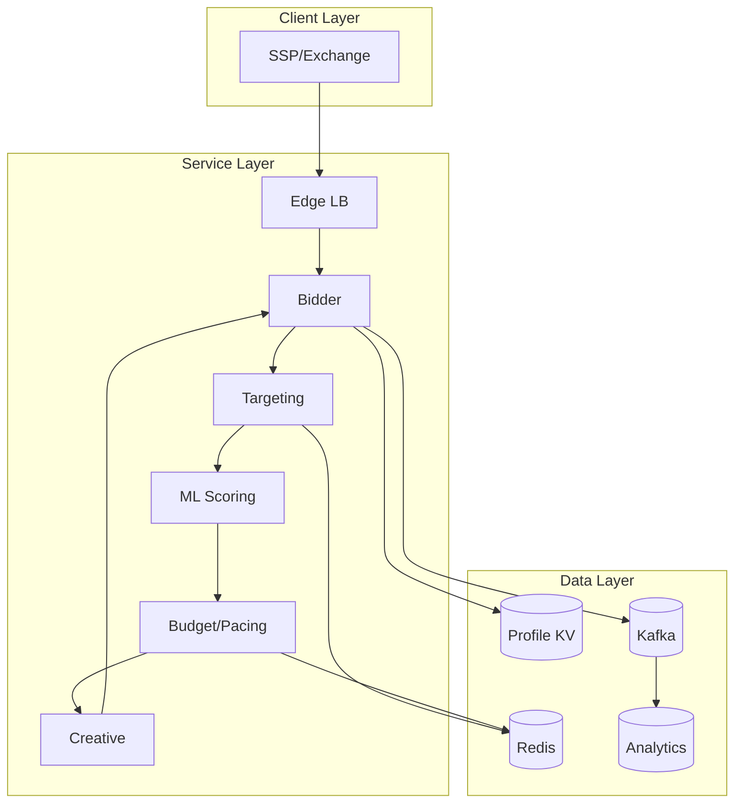
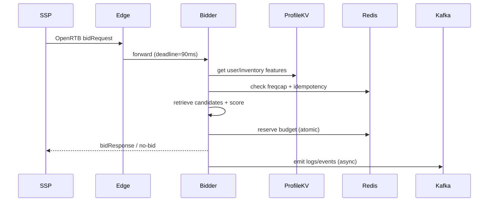

## Overview

Real-time bidding (RTB) ad serving is a latency-critical decision system: given a bid request from an exchange, the platform must select an eligible ad (or submit bids for multiple) using targeting rules, frequency caps, user/context signals, and budget pacing—typically within a hard deadline under 100ms end-to-end. The challenge is not only fast ranking, but *correctness under concurrency*: budgets, caps, and pacing must remain accurate while the system processes hundreds of thousands of requests per second across regions.

The key insight is to split the problem into two planes: a **hot path** optimized for deterministic, bounded-latency decisions (candidate retrieval → eligibility → scoring → budget reservation → response), and a **cold path** that ingests events for billing, reporting, and model training. On the hot path we rely on precomputed data, in-memory/SSD KV stores, and atomic budget primitives (token buckets / reservations) to avoid synchronous writes to analytical systems while preserving budget safety.

## Requirements

### Functional Requirements
- Accept OpenRTB bid requests and return bids (or no-bid) within the exchange deadline.
- Enforce targeting constraints (geo, device, app/site, time-of-day, audience segments, keywords, brand safety).
- Enforce budget constraints (daily/lifetime) and pacing (smooth spend over time; optional accelerated pacing).
- Enforce frequency caps per user/campaign/creative and deduplicate repeated requests.
- Rank eligible ads via rules + ML scoring; support A/B experiments and model versioning.
- Support creative selection and validation (size, format, deal IDs, category blocks).
- Track delivery events (impression, click, win notice) and produce billing/reporting with near-real-time dashboards.
- Provide campaign management APIs for advertisers (create/update campaigns, line items, creatives, targeting, budgets).

### Non-Functional Requirements
- **Scale**: 200K QPS average, 1M QPS peak globally; ~5–20KB per bid request; 5–20B events/day (impressions + clicks + wins) at peak.
- **Latency**:
  - Bid response: P50 15ms, P99 80ms (server-side), hard timeout 90ms to leave network headroom.
  - Feature fetch (p99): 5ms (local KV), candidate retrieval: 3ms, scoring: 10–30ms depending on model.
- **Availability**: 99.99% for bidding endpoint; graceful degradation preferred over downtime.
- **Consistency**:
  - Budget reservation: strongly consistent within a budget shard (no overspend beyond a small bounded margin).
  - Reporting/analytics: eventual consistency (seconds to minutes).
- **Durability**: No loss of billable events beyond RPO 1 minute; bid decisions are ephemeral but must be reconstructable for audits via logs/events.

### Constraints & Assumptions
- Multi-region active-active; traffic steered to nearest region; each region can run independently for short periods.
- Strict latency budget (<100ms) means no cross-region synchronous calls on the hot path.
- Team size ~6–10 engineers; prefer proven components (Redis/Aerospike/ScyllaDB, Kafka, Flink/Spark).
- Compliance: GDPR/CCPA (consent signals), data minimization; PII stored hashed/pseudonymized; retention policies enforced.

## High-Level Architecture

The hot path is centered on the **Bidder** service which orchestrates request validation, feature enrichment, candidate selection, ranking, and budget checks before producing a bid response. To meet tail-latency goals, user/context features come from a **local KV store** (replicated per region), while highly contended mutable state (budgets, pacing counters, frequency caps) uses **atomic primitives in Redis** (clustered, sharded, and kept region-local).

The cold path ingests delivery events through **Kafka**, enabling asynchronous billing/reporting and ML training without adding latency to bidding. This separation allows the bidding fleet to scale on CPU and memory, while analytics/training scale independently on stream/batch compute.

## Component Deep-Dive

### Edge Load Balancer
**Responsibility**: Terminate TLS, enforce deadlines, rate-limit abusive sources, route to nearest region and healthy bidder pool.

**Key Design Decisions**:
- Enforce a hard server-side deadline (e.g., 90ms) and propagate it to downstream calls to prevent tail amplification.
- Use source-aware rate limiting (per SSP seat ID / IP / API key) to protect the bidder under traffic spikes.

**Technology Choice**: Envoy/Nginx + Anycast/GeoDNS; optionally a managed L7 LB.

**Scaling Strategy**: Stateless; scale horizontally; keep per-SSP configs cached locally with periodic refresh.

### Bidder (Orchestrator)
**Responsibility**: Validate OpenRTB request, enrich signals, request candidates, run scoring, apply business rules, assemble response.

**Key Design Decisions**:
- “Fail-open” on non-critical dependencies (e.g., optional features) but “fail-closed” on budget enforcement.
- Deterministic request tracing (request_id) with sampled logs and strict PII redaction.

**Technology Choice**: Rust/Go for predictable latency; gRPC internally; protobuf for compact payloads.

**Scaling Strategy**: Stateless; autoscale by CPU and p99 latency; isolate high-QPS SSPs via dedicated pools if needed.

### Targeting & Candidate Retrieval
**Responsibility**: Produce a small eligible candidate set (e.g., 50–500 ads) from millions of line items using targeting constraints.

**Key Design Decisions**:
- Two-stage retrieval: (1) coarse filtering via inverted indices (geo/app/site/deal) → (2) fine rule evaluation (segments, frequency caps).
- Precompute and cache “context → candidate lists” for hot inventory (top apps/sites) with short TTL to reduce index lookups.

**Technology Choice**: In-memory indices (per bidder shard) built from a config stream; optional dedicated service using RocksDB; segment membership via KV.

**Scaling Strategy**: Partition by inventory key (app/site + adformat) and/or campaign; replicate indices per region; rebuild from Kafka config topic.

### ML Scoring Service (Inline)
**Responsibility**: Score candidate ads (pCTR/pCVR/pRevenue) and produce a rank-ordered list under the deadline.

**Key Design Decisions**:
- Use small, fast models on the hot path (e.g., GBDT/LightGBM or compact DNN with quantization); reserve large models for offline re-ranking.
- Feature availability tiers: required (must-have) vs optional (drop if slow) to cap tail latency.

**Technology Choice**: Embedded model runtime (ONNX Runtime / Treelite) inside bidder to avoid RPC; shared feature encoding library.

**Scaling Strategy**: Scale with bidder fleet; use SIMD-friendly features, model quantization, and early-exit (score top-K only).

### Budget & Pacing Service (Atomic State)
**Responsibility**: Enforce daily/lifetime budgets, spend limits per line item, and pacing to distribute spend over time.

**Key Design Decisions**:
- Use token-bucket style pacing per line item/campaign with atomic `reserve(cost)` to prevent overspend.
- Separate *reservation* (hot path) from *settlement* (cold path): reserve on bid response; finalize on win/impression; reconcile periodically.

**Technology Choice**: Redis Cluster with Lua scripts for atomic reserve/release; optionally Aerospike for higher consistency at scale.

**Scaling Strategy**: Shard by (advertiser_id, campaign_id) to localize contention; use read replicas for dashboards; keep all operations region-local.

## Data Model

### Storage Schema

**Relational (config / source of truth; e.g., Postgres)**
- `advertiser(advertiser_id, status, billing_profile_id, created_at)`
- `campaign(campaign_id, advertiser_id, status, start_ts, end_ts, daily_budget_micros, lifetime_budget_micros, pacing_mode, updated_at)`
- `line_item(line_item_id, campaign_id, bid_cpm_micros, targeting_json, freq_cap_json, priority, status, updated_at)`
- `creative(creative_id, advertiser_id, format, width, height, markup, categories, status, updated_at)`

**Hot KV (serving features; e.g., Aerospike/Scylla)**
- `user_profile(user_key, segments_bitmap, last_seen_ts, consent_flags, device_signals, kv_version)`
- `inventory_profile(inv_key, brand_safety_tier, historical_ctr, floor_price_stats, kv_version)`

**Redis (mutable atomic state)**
- `budget_bucket:{line_item_id}` → `{tokens_remaining, refill_rate_per_sec, last_refill_ts}`
- `daily_spend:{line_item_id}:{yyyymmdd}` → `spent_micros` (for monitoring/backstop)
- `freqcap:{user_key}:{line_item_id}` → rolling counter with TTL aligned to cap window
- `idempotency:{request_id}` → response hash/decision (short TTL, e.g., 5–15 min)

**Streaming/OLAP (events)**
- Kafka topics: `bid_requests`, `bid_responses`, `wins`, `impressions`, `clicks`, `spend_adjustments`, `config_updates`
- OLAP tables (ClickHouse/Druid/BigQuery): partitioned by date/hour, keyed by (campaign_id, line_item_id, creative_id, inventory_key)

### Data Flow

Key operations:
- **Bid decision** reads features from local KV, checks frequency caps and idempotency in Redis, scores candidates, and reserves budget atomically.
- **Settlement** (wins/impressions) updates spend and delivery counters asynchronously; periodic jobs reconcile reservations vs settled spend and correct drift.

## API Design

### External: OpenRTB Bidding
- `POST /openrtb2/bid`
  - Headers: `X-Request-Id` (optional), `X-Seat-Id`, `X-Timeout-Ms` (optional)
  - Request: OpenRTB 2.5 `BidRequest` JSON
  - Response: OpenRTB `BidResponse` JSON or `204 No Content` for no-bid
  - Errors:
    - `400` invalid request (malformed, unsupported)
    - `429` rate limited
    - `503` overloaded (only if cannot safely respond; prefer no-bid)
  - Idempotency:
    - If `request.id` repeats within TTL, return the same response (from `idempotency:{request_id}`) to avoid double-spend or inconsistent auctions.

### Internal: Campaign Config Distribution
- `GET /v1/config/snapshot?version=...` (bootstrap)
- `SUBSCRIBE config_updates` (Kafka topic) for incremental updates
  - Ensures bidders rebuild in-memory indices without querying the DB on the hot path.

### External/Internal: Event Ingestion (if not using exchange win URLs)
- `POST /v1/events`
  - Body: `{event_id, type, ts, request_id, auction_id, campaign_id, line_item_id, creative_id, price_micros, user_key_hash}`
  - Idempotency: `event_id` unique; dedupe in stream processor / storage
  - Errors: `202 Accepted` always for async; validate schema but don’t block pipeline on minor issues.

## Scaling & Performance

### Bottleneck Analysis
- **Candidate retrieval**: large targeting space → mitigate with inverted indices, caching by inventory, and limiting to top-K candidates per segment/deal.
- **Tail latency from KV/Redis**: mitigate with region-local stores, aggressive timeouts (e.g., 3–5ms), circuit breakers, and fallback tiers.
- **Scoring CPU**: mitigate with model compression/quantization, vectorized feature assembly, early stopping, and limiting scored candidates.
- **Hot key contention (budgets)**: mitigate by sharding on advertiser/campaign, hierarchical budgets, and smoothing refill rates to reduce bursty reserves.

### Horizontal Scaling
- **Edge + Bidder**: scale out stateless pods/instances; isolate by SSP if needed; use autoscaling on p99 + CPU.
- **Redis**: cluster sharded by `{line_item_id}`; use Lua scripts to keep operations atomic and single-round-trip.
- **Profile KV**: shard by `user_key`; replicate within region; warm caches for hot users/inventory.
- **Streaming**: Kafka partitions sized for peak throughput; consumers scale horizontally (Flink jobs, ClickHouse ingestion).

### Caching Strategy
- **In-bidder memory**: campaign/line-item configs, inverted indices, hot inventory candidate lists (TTL 30–120s).
- **Redis**: frequency caps, idempotency cache, budget buckets (authoritative for hot mutable state).
- **KV store**: user segments and inventory stats (authoritative for serving features); avoid per-request DB calls.
- **Invalidation**: config changes flow through `config_updates`; bidders apply versioned updates; caches keyed by config version to avoid partial updates.

## Trade-offs & Alternatives

### Key Trade-offs Made
- **Chose atomic reservations in Redis** over “eventual spend only”
  - Sacrificed: extra dependency and operational overhead in the hot path.
  - Why: prevents unbounded overspend and makes pacing predictable under concurrency.
- **Chose embedded scoring in bidder** over remote scoring RPC
  - Sacrificed: larger bidder binary and more frequent deploys for model updates.
  - Why: removes an RPC hop, improves p99, and simplifies deadline management.
- **Chose eventual consistency for reporting**
  - Sacrificed: real-time-perfect dashboards.
  - Why: keeps hot path lean; stream processing provides seconds-to-minutes freshness.

### Alternative Approaches
- **Fully centralized budget service (strong consistency DB)**: simpler accounting but too slow and fragile under 1M QPS; hotspot contention.
- **Per-campaign local counters with periodic sync**: lower latency but risks overspend during partitions; harder to bound.
- **Two-level auction (precomputed winners per inventory)**: extremely fast but less flexible; struggles with dynamic user features and per-user caps.

## Failure Modes & Mitigations

### Failure Scenarios
- **Scenario**: Redis shard unavailable
  - **Impact**: cannot safely enforce budgets/frequency caps; risk overspend.
  - **Detection**: Redis error rate, timeouts, shard health checks.
  - **Mitigation**: fail-closed for affected budgets (no-bid) or use conservative local backstop (strict per-bidder cap) until Redis recovers.
- **Scenario**: Profile KV latency spike
  - **Impact**: increased no-bids or degraded targeting accuracy.
  - **Detection**: p99 KV latency, timeout counters, cache hit rate.
  - **Mitigation**: feature tiering (drop optional features), serve from stale cache (bounded), or fall back to contextual-only targeting.
- **Scenario**: Kafka ingestion lag / consumer slowdown
  - **Impact**: delayed reporting/billing; potential reconciliation drift.
  - **Detection**: consumer lag, end-to-end event freshness SLI.
  - **Mitigation**: scale partitions/consumers, backpressure, temporary sampling of non-billable logs, keep settlement pipeline prioritized.
- **Scenario**: Bad config push (targeting/budget misconfiguration)
  - **Impact**: revenue loss or policy violations.
  - **Detection**: canary config rollout metrics, anomaly detection (spend spike, blocklist violations).
  - **Mitigation**: versioned configs, staged rollout, instant rollback to last-known-good, automated policy validation on publish.

### Disaster Recovery
- **RTO/RPO**: RTO 15 minutes per region; RPO 1 minute for billable events.
- **Backup strategy**: nightly snapshots of config DB; continuous Kafka topic retention (e.g., 7–14 days) + OLAP backups; Redis persistence (AOF) for critical pacing state where feasible.
- **Failover procedures**: GeoDNS/Anycast shifts SSP traffic to healthy region; each region has independent KV/Redis clusters; configs replicated asynchronously; reconciliation resolves cross-region drift post-recovery.

## Operational Considerations

### Monitoring & Alerting
- Key SLIs/SLOs:
  - Bid latency: p50/p95/p99, timeout rate, no-bid rate by SSP and inventory.
  - Budget correctness: overspend incidents, reservation vs settlement delta, token bucket refill anomalies.
  - Feature health: KV/Redis latency, error rate, cache hit rate.
  - Model health: score distribution drift, win-rate/CTR anomalies, A/B experiment guardrails.
- Alert thresholds (examples):
  - p99 bidding latency > 80ms for 5 minutes
  - timeouts > 0.5% for 5 minutes
  - Redis errors > 0.1% or shard unavailable
  - spend anomaly > 3σ vs baseline per campaign

### Deployment Strategy
- Blue/green or canary per region; gradually increase traffic share (1% → 10% → 50% → 100%).
- Feature flags for model versions, targeting rules, and pacing modes; instant rollback path.
- Strict load testing and replay testing (shadow traffic) before enabling new scoring/config logic.
- Rollback procedures: revert deployment + pin config version; disable problematic model via flag; increase no-bid fallback if safety is at risk.

## References & Further Reading
- OpenRTB 2.5 Specification: https://iabtechlab.com/standards/openrtb/
- “Dynamo: Amazon’s Highly Available Key-value Store” (architecture patterns for KV at scale)
- Kafka + stream processing patterns (Flink): https://nightlies.apache.org/flink/
- Redis Lua scripting for atomic operations: https://redis.io/docs/latest/develop/interact/programmability/eval-intro/
- Ad pacing and budget control (token bucket / leaky bucket patterns) and production ad systems (Google/Meta engineering talks)