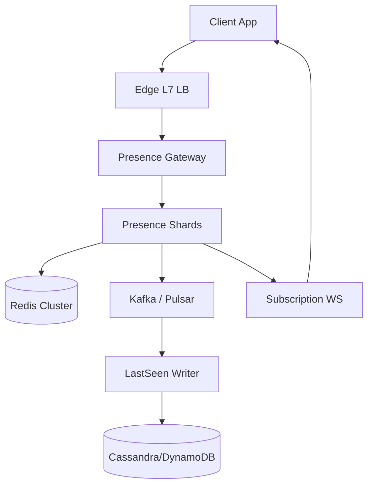
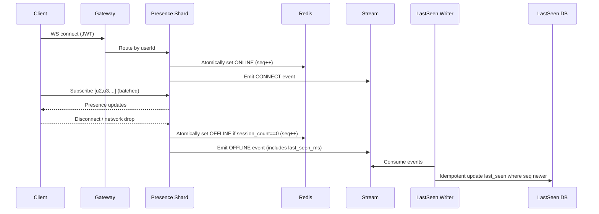

## Overview

A real-time presence service answers two deceptively simple questions at massive scale: “Is user X online right now?” and “When was user X last seen?” The challenge is that “online” is inherently ephemeral (connections flap, mobile networks sleep, servers crash), while “last seen” is durable and user-facing. At millions of concurrent users, naïve heartbeat-to-database designs create extreme write amplification and hot partitions, and they still struggle with correctness during failures.

The key insight is to separate **connection liveness** (best tracked close to where sockets live) from **durable last-seen state** (updated only on meaningful transitions). We treat presence as an event-driven state machine: writes happen primarily on **connect / disconnect / timeout transitions**, not on frequent heartbeats. “Online” is served from an in-memory/Redis-backed ephemeral store; “Last seen” is written to a durable store via an ordered event stream, giving strong operational control and replayability with minimal steady-state writes.

## Requirements

### Functional Requirements
- Show **Online / Offline / Last seen timestamp** for a user.
- Support **millions of concurrent connections** (WebSocket/MQTT-like semantics).
- Allow clients to **subscribe** to presence updates for a set of users (e.g., contacts list) and receive near-real-time updates.
- Support **multi-device presence** (user is online if any active session exists).
- Provide **batch presence lookup** for lists (e.g., 500 contacts) with pagination and rate limits.
- Respect **privacy controls** (e.g., hidden/visible to nobody, contacts-only, blocked users).
- Emit presence events to downstream systems (chat routing, notifications, analytics) with ordering per user.
- Provide administrative tools for debugging (session inspection, forced disconnect, replay).

### Non-Functional Requirements
- **Scale**:
  - 50M MAU, 10M DAU
  - 5M concurrent connected sessions (peak)
  - Presence transitions: ~1–3 per user/day average; peak 200K transitions/sec globally (login storms)
  - Batch reads: 50K req/sec peak, average payload 100–500 userIds
- **Latency**:
  - Presence batch read: P50 20ms, P99 150ms (in-region)
  - Subscription update fanout: P99 500ms from state change to subscriber delivery
- **Availability**:
  - Online status API: 99.99%
  - Subscription delivery: 99.9% (best-effort, reconnectable)
- **Consistency**:
  - “Online” is **eventually consistent** across regions and during failovers (seconds).
  - “Last seen” is **durably consistent** (no backward movement) with per-user ordering guarantees.
- **Durability**:
  - “Last seen” RPO ≤ 1 minute (via replicated log), RTO ≤ 30 minutes.
  - Online presence may be lost during shard crashes (acceptable with fast reconnect).

### Constraints & Assumptions
- Presence is a **best-effort real-time signal**, not a financial ledger.
- Clients maintain a persistent connection and can reconnect within 10–60s.
- Team: ~6–10 engineers; use managed services where it reduces ops load.
- Compliance: GDPR/CCPA (data deletion for durable “last seen”); online state is ephemeral.
- Network partitions and mobile backgrounding are common; we must avoid per-heartbeat durable writes.

## High-Level Architecture



Clients connect through an L7 load balancer that supports **consistent routing** (hash on authenticated `userId`) so a user’s sessions land on a stable **Presence Shard**. Shards own the real-time state machine for users (session counts, transitions) and push updates to subscribers.

Ephemeral state is stored in **Redis** (fast reads, cross-process sharing) but updated primarily on **transitions** (connect/disconnect/timeout), not on periodic heartbeats. Durable “last seen” updates flow through a replicated **event stream** into a **writer** that performs idempotent updates to a durable database, enabling replay, auditability, and controlled backpressure.

## Component Deep-Dive

### Presence Gateway

**Responsibility**: Terminate client TLS, authenticate, and route WebSocket connections and presence APIs to the correct shard.

**Key Design Decisions**:
- **Consistent routing on `userId`**: Stabilizes ownership so most operations are local to one shard and avoids cross-shard coordination.
- **Separate “connection plane” from “query plane”**: WebSocket traffic is long-lived; REST/gRPC queries are bursty and can be served from Redis if the shard is overloaded.

**Technology Choice**: Envoy/NGINX + custom gateway (Go/Java), JWT/OAuth verification, mTLS to internal services.

**Scaling Strategy**: Stateless horizontally scaled pods/VMs; shard routing via Rendezvous hashing; connection limits per instance; autoscale on concurrent connections and CPU.

---

### Presence Shards (State Machine + Fanout)

**Responsibility**: Maintain per-user session state, compute Online/Offline transitions, enforce privacy, and fan out updates to subscribers.

**Key Design Decisions**:
- **Transition-driven persistence**: Only update Redis/durable stores when state changes (connect, disconnect, timeout), minimizing write amplification.
- **Per-user ordering**: Generate a monotonic `presence_seq` per user (stored in Redis) to prevent stale events from overwriting newer state.

**Technology Choice**: Go/Java service with efficient event loops; in-memory maps for active sessions; gRPC for internal calls; Redis Lua for atomic updates.

**Scaling Strategy**: Shard by `hash(userId) % N`; add shards with minimal movement via Rendezvous hashing; graceful draining (stop accepting new conns, wait for disconnect or timeout).

---

### Redis Cluster (Ephemeral Presence Cache)

**Responsibility**: Fast, shared read path for online status and a small amount of metadata (seq, last transition time, privacy hints).

**Key Design Decisions**:
- **Single-key atomic state** per user (hash/document) to avoid multi-key races.
- **Short TTL for “online marker”** only if needed for crash recovery; otherwise rely on explicit disconnect/timeouts from shard.

**Technology Choice**: Redis Cluster (or KeyDB) with persistence tuned for speed (AOF optional depending on durability needs for ephemeral data).

**Scaling Strategy**: Cluster sharding by key; pipelined writes on transitions; dedicated read replicas if needed for batch lookup load.

---

### Event Stream + LastSeen Writer

**Responsibility**: Buffer presence transition events and write durable “last seen” updates idempotently.

**Key Design Decisions**:
- **Log as source of truth for durability**: Even if DB is down, events queue; writer catches up.
- **Idempotent, monotonic updates**: Only advance `last_seen` forward; ignore out-of-order events using `presence_seq` and timestamps.

**Technology Choice**: Kafka/Pulsar with partitions by `userId`; consumer group for writer; Cassandra/ScyllaDB or DynamoDB for durable storage.

**Scaling Strategy**: Partition stream to match peak transitions; scale writers by partitions; backpressure via consumer lag monitoring.

---

### Subscription WS Service (optional separation)

**Responsibility**: Manage client subscriptions to other users’ presence updates and deliver updates efficiently.

**Key Design Decisions**:
- **Shard-aligned subscription registration**: Client subscription lists are grouped by watched-user shard; each shard maintains reverse indices for users it owns.
- **Hot-user protection**: Rate-limit subscriptions, cap per-user subscriber counts, and degrade (polling) for celebrity-scale fanout.

**Technology Choice**: Often co-located within Presence Shards to keep update fanout local; otherwise a dedicated WS fleet with internal pub/sub.

**Scaling Strategy**: Scale with concurrent subscriber connections; memory-based reverse index sharded by watched user.

## Data Model

### Storage Schema

**Redis key**: `presence:{user_id}` (Hash or JSON blob)
- `state`: `"ONLINE" | "OFFLINE"`
- `presence_seq`: integer (monotonic per user)
- `session_count`: integer
- `last_change_ms`: epoch ms (when state last changed)
- `last_seen_ms`: epoch ms (only meaningful when OFFLINE; may mirror durable store)
- `privacy_mode`: small enum/cache hint (optional)

**Durable DB (Cassandra example)**: `user_last_seen`
- `user_id` (PK, text/uuid)
- `last_seen_ms` (bigint)
- `updated_at_ms` (bigint)
- `presence_seq` (bigint)  // last applied transition
- `deleted_at_ms` (bigint, nullable)  // GDPR delete marker

**Event stream message**: `PresenceTransition`
- `user_id`
- `presence_seq`
- `new_state`
- `event_time_ms`
- `reason`: `CONNECT | DISCONNECT | TIMEOUT | ADMIN`
- `session_delta` / `session_count` (optional)
- `region`, `shard_id`

### Data Flow



## API Design

### REST/gRPC Query APIs

**Batch lookup**
- `POST /v1/presence:batch`
- Request:
  ```json
  { "user_ids": ["u1","u2"], "viewer_id": "me", "max_stale_ms": 5000 }
  ```
- Response:
  ```json
  {
    "results": [
      { "user_id": "u1", "state": "ONLINE", "last_seen_ms": null, "last_change_ms": 1730000000000 },
      { "user_id": "u2", "state": "OFFLINE", "last_seen_ms": 1729999000000, "last_change_ms": 1729999000000 }
    ]
  }
  ```
- Errors:
  - `400` invalid ids/too many ids
  - `401/403` auth/privacy
  - `429` rate limited
  - `503` degraded mode (fallback to durable DB only)

**Single lookup (optional)**
- `GET /v1/presence/{user_id}`

**Idempotency**
- For any mutation-like endpoints (admin force disconnect, privacy updates): require `Idempotency-Key` and store short-lived results.

### WebSocket (Subscription) Protocol

- Client sends:
  ```json
  { "type": "subscribe", "request_id": "r1", "user_ids": ["u2","u3"] }
  ```
- Server acks:
  ```json
  { "type": "subscribed", "request_id": "r1" }
  ```
- Updates:
  ```json
  { "type": "presence_update", "user_id": "u2", "state": "ONLINE", "last_change_ms": 1730000000000 }
  ```

**Error handling**
- Close codes for auth failure, oversized subscription set, server overload.
- Client must reconnect with exponential backoff and resubscribe.

## Scaling & Performance

### Bottleneck Analysis
- **Connection fanout**: Millions of WS connections → mitigate with shard routing, efficient event loops, and per-node connection caps.
- **Subscription memory**: Reverse index size grows with contacts → cap subscriptions per client (e.g., 2K) and per target user (e.g., 50K) with degradation.
- **Batch lookups**: Contact list rendering spikes → serve from Redis, pipeline `HMGET`, and coalesce duplicate userIds across requests.
- **Hot users (celebrities)**: Presence updates cause massive fanout → apply “hot key” detection and degrade to polling or coarse-grained updates.

### Horizontal Scaling
- **Gateway**: Stateless scale-out; consistent-hash routing to shards.
- **Shards**: Add partitions; move ownership gradually (new connections go to new shard; old drain).
- **Redis**: Cluster sharding; separate read replicas for batch-heavy traffic.
- **Stream + Writers**: Partition by `userId`; scale consumers with partitions.

**Partitioning strategy**
- Primary: `userId` hashing for shard ownership and stream partitions.
- Avoid secondary “friends-of” partitioning; it causes skew for social graphs.

### Caching Strategy
- **Redis as primary cache** for `presence:{userId}` with 1–5 minute TTL for OFFLINE records (reduces durable DB hits).
- **Client-side cache**: allow UI to reuse presence results for ~5–15s and rely on subscription updates.
- **Invalidation**: event-driven; when shard transitions state, it overwrites Redis atomically and emits update.

## Trade-offs & Alternatives

### Key Trade-offs Made
- **Chosen**: Transition-driven writes (connect/disconnect/timeout)  
  **Sacrificed**: Instant offline detection without timeouts  
  **Why**: Eliminates heartbeat write amplification; offline is still detected via TCP close + keepalive timeouts.

- **Chosen**: Redis for online state, durable DB for last seen  
  **Sacrificed**: Single-store simplicity  
  **Why**: Online state needs speed and can be ephemeral; last seen must survive outages and support compliance.

- **Chosen**: Per-user ordering via `presence_seq`  
  **Sacrificed**: Slightly higher complexity (atomic increments/Lua)  
  **Why**: Prevents stale updates during reconnect storms and stream retries.

### Alternative Approaches
- **Heartbeat TTL keys only (SETEX every N seconds)**: Simple but high write amplification (millions of writes/sec) and hot shards under spikes.
- **Pure in-memory presence (no Redis)**: Lowest latency but poor cross-process queryability and weak behavior during shard restarts.
- **Per-user pub/sub topics**: Clean semantics but operationally expensive at scale (topic explosion, metadata overhead).

## Failure Modes & Mitigations

### Failure Scenarios
- **Scenario**: Presence shard crashes  
  **Impact**: Users on that shard may appear online until timeout/reconnect  
  **Detection**: Crash loops, missing heartbeats at gateway, shard health checks  
  **Mitigation**: Client reconnect; optional shard-level lease and “unknown → offline” after grace; rely on durable last seen for UI fallback.

- **Scenario**: Redis unavailable/partitioned  
  **Impact**: Batch lookups degrade; subscriptions still work for connected users on same shard  
  **Detection**: Redis error rate/latency, cluster failover events  
  **Mitigation**: Serve from shard memory for connected users; fallback to durable DB for last seen; circuit breakers and bulkheads.

- **Scenario**: Stream lag or outage  
  **Impact**: Durable last seen updates delayed; online still correct  
  **Detection**: Consumer lag metrics, partition under-replication  
  **Mitigation**: Retention + replay; scale writers; prioritize OFFLINE events; alert on lag thresholds.

- **Scenario**: Out-of-order or duplicated events  
  **Impact**: Incorrect last seen regression if naïvely applied  
  **Detection**: Monotonicity checks (last_seen decreases)  
  **Mitigation**: Apply only if `presence_seq` newer; enforce `last_seen = max(last_seen, candidate)`.

- **Scenario**: Clock skew across nodes  
  **Impact**: last_seen anomalies  
  **Detection**: NTP drift metrics  
  **Mitigation**: Use server time but clamp monotonic in writer; prefer event time from shard and monotonic seq.

### Disaster Recovery
- **RTO/RPO**: RTO 30 minutes, RPO 1 minute for durable last seen.
- **Backup strategy**: Daily snapshots + incremental backups for Cassandra/DynamoDB; Kafka topic replicated across AZs with adequate retention.
- **Failover procedures**: Regional failover serves “online” from local shards; global UI may show offline/last seen from durable store until users reconnect.

## Operational Considerations

### Monitoring & Alerting
- Connection metrics: concurrent sessions, accept rate, disconnect reasons, reconnect rate.
- Transition metrics: connect/offline/timeouts per second, per shard.
- Redis: ops/sec, p99 latency, evictions, cluster slot imbalance.
- Stream: consumer lag, under-replicated partitions, publish errors.
- SLO alerts:
  - Batch lookup P99 > 150ms (5m)
  - Redis error rate > 0.1%
  - Stream lag > 60s for OFFLINE events
  - Shard crashloop rate spikes

### Deployment Strategy
- **Canary + gradual ramp** for gateway/shards; monitor disconnect/reconnect spikes.
- **Graceful draining** for shards: stop new conns, keep existing until timeout, then terminate.
- **Rollback**: keep protocol backward-compatible; feature flags for subscription/fanout behaviors.

## References & Further Reading
- Redis patterns for ephemeral state and atomic updates: https://redis.io/docs/latest/develop/
- Kafka design and partitioning: https://kafka.apache.org/documentation/
- Presence at scale discussions (conceptual): WhatsApp/Slack/Discord engineering blogs (presence, websockets, fanout)
- “Designing Data-Intensive Applications” (Kleppmann) — event logs, idempotency, ordering, and state machines