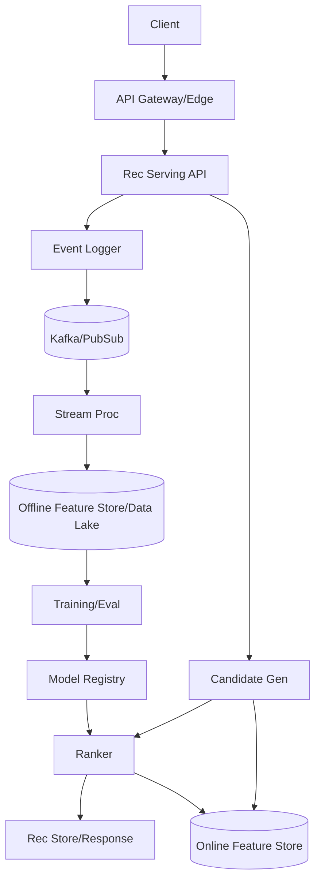
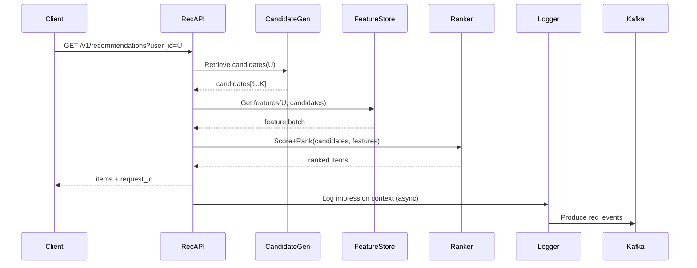

## Overview

A production recommendation system is two systems coupled together: a low-latency online serving stack (candidate generation → scoring → ranking) and a high-throughput offline/streaming learning stack (event logging → feature pipelines → training → evaluation → deployment). The hard part is not a single model, but the infrastructure that keeps features consistent, feedback loops trustworthy, and model rollouts safe while meeting strict latency and availability SLOs.

The key insight is to decouple retrieval from ranking, and to make the feedback loop a first-class product: every impression is logged with enough context (candidates shown, scores, model/version, features snapshot IDs) to enable unbiased evaluation, counterfactual analysis, debugging, and fast retraining. This requires disciplined data contracts, a feature store with online/offline parity, and an experimentation framework that can safely iterate without destabilizing user experience.

## Requirements

### Functional Requirements
- Generate recommendation candidates from multiple sources (graph-based, content-based, trending, embeddings).
- Score candidates using one or more ML models with versioned features.
- Rank and diversify results (dedup, freshness, creator diversity, exploration).
- Support per-request constraints (blocked users/content, language/region, safety filters).
- Log impressions, clicks, dwell time, hides, follows, shares, and negative feedback with full context for training and evaluation.
- Provide online experiments (A/B, multivariate) and safe rollout (canary, shadow).
- Retrain models periodically and on-demand; publish new models with auditability and rollback.
- Detect and mitigate feature drift, data quality issues, and pipeline lag.

### Non-Functional Requirements
- **Scale**: 10M DAU, 100M MAU; home-feed traffic 200K QPS peak; write events 1–3M events/sec peak (impressions dominate); candidate sets 1K–5K per request.
- **Latency** (home feed request, end-to-end): P50 60ms, P99 150ms; budget: retrieval 30ms, scoring 50ms, ranking/post 30ms, network/overhead 40ms.
- **Availability**: 99.99% for serving API; 99.9% for offline pipelines (degraded mode acceptable).
- **Consistency**: Eventual consistency for recommendations and derived features; strong consistency for user actions that affect safety/privacy (blocks, mutes) at serving time.
- **Durability**: No loss of user feedback events beyond 0.01% (at-least-once ingestion); models and training datasets durable (multi-AZ + versioned).

### Constraints & Assumptions
- Multi-region active-active serving; training centralized or dual-region depending on cost.
- Small platform team (6–10 engineers) + data science; prioritize managed services where possible.
- Compliance: GDPR/CCPA (delete/DSAR), data minimization, PII segregation, audit logs.
- Support near-real-time personalization (minutes) plus deeper batch retrains (daily/weekly).
- Safety policy enforcement must apply even if rec infrastructure is degraded.

## High-Level Architecture



This architecture separates the online critical path (Rec Serving API, candidate generation, ranking, online feature store) from the learning path (event bus, stream processing, offline feature store, training). The serving path is optimized for tight latency and graceful degradation; the learning path is optimized for throughput, lineage, and correctness.

Candidate generation is deliberately multi-source and fast, producing a few thousand candidates. Ranking applies heavier models and business constraints to return tens to hundreds of items. A unified feature store provides online low-latency reads and offline training parity, preventing training/serving skew and enabling rapid iteration.

## Component Deep-Dive

### Recommendation Serving API

**Responsibility**: Entry point for recommendation requests; orchestrates retrieval, scoring, ranking; applies policy filters; returns ranked items and logs request context.

**Key Design Decisions**:
- Orchestrate with strict time budgets and partial results: return best-effort ranked list even if one retrieval source times out.
- Treat logging as non-blocking but durable: async write to local buffer + replicated bus, with backpressure and drop policies only for non-critical debug fields.

**Technology Choice**: gRPC/HTTP service (Go/Java), Envoy at edge, circuit breakers (Hystrix-like), tail-latency hedging for critical calls.

**Scaling Strategy**: Stateless autoscaling; request-level concurrency limits; per-user request coalescing; regional affinity to reduce feature-store latency.

### Candidate Generation Service

**Responsibility**: Produce an initial set of candidates from multiple retrieval strategies (graph, content similarity, embeddings ANN, trending, follow-based).

**Key Design Decisions**:
- Multi-stage retrieval: cheap filters first (eligibility, block lists), then ANN/graph retrieval; cap per-source contributions to preserve diversity.
- Precompute where possible: nightly/streaming updates to user embedding, item embedding, and follow graph snapshots.

**Technology Choice**:
- ANN: FAISS/ScaNN/Vector DB (Milvus) with HNSW/IVF; embeddings stored in object store + periodically loaded.
- Graph retrieval: Redis/KeyDB for adjacency hot set + Cassandra/Scylla for durable graph edges.

**Scaling Strategy**: Shard by user ID; replicate ANN indices per region; keep hot users in memory cache; fallback to trending when personalization unavailable.

### Ranking & Scoring Service

**Responsibility**: Compute features, run models (e.g., GBDT + DNN), and produce final ranked list with constraints (diversity, freshness, safety).

**Key Design Decisions**:
- Two-tier scoring: lightweight model for pruning (e.g., 1K → 200), heavier model for final ranking (200 → 50).
- Versioned model + feature contracts: every score tied to `model_id`, `feature_view_version`, and `schema_hash` to ensure reproducibility.

**Technology Choice**:
- Model serving: TensorRT/TorchServe/TF Serving for DNN; ONNX Runtime for portability; XGBoost/LightGBM native for GBDT.
- Feature computation: precomputed aggregates from feature store + minimal on-the-fly features.

**Scaling Strategy**: Batch inference per request; vectorized feature assembly; CPU for GBDT, GPU pool for DNN with admission control; autoscale by p99 latency.

### Event Ingestion & Streaming Features

**Responsibility**: Collect interaction events, enrich them, compute near-real-time aggregates, and publish to offline storage and online feature store.

**Key Design Decisions**:
- At-least-once ingestion + idempotent consumers: tolerate retries without double-counting using event IDs and windowed dedupe.
- Separation of raw vs derived: raw immutable logs for audit/replay; derived features computed in streaming jobs for freshness.

**Technology Choice**: Kafka (or Pub/Sub), Flink/Spark Structured Streaming, schema registry (Protobuf/Avro), object storage (S3/GCS) + table format (Iceberg/Delta).

**Scaling Strategy**: Partition by user ID and item ID; scalable consumer groups; backpressure with lag alerts; replay capability for reprocessing.

### Training, Evaluation, and Model Registry

**Responsibility**: Build datasets, train models, run offline evaluation, manage approvals, and deploy models safely.

**Key Design Decisions**:
- Offline/online feature parity: training pulls from offline feature store using the same feature definitions as serving.
- Continuous evaluation: shadow scoring + online A/B; guardrails on key metrics (CTR, hides, latency) for auto-rollback.

**Technology Choice**: Spark/Ray for training pipelines, MLFlow/Vertex AI/SageMaker for registry + metadata, Airflow/Dagster for orchestration.

**Scaling Strategy**: Distributed training and feature joins; incremental dataset builds; cache expensive joins; schedule heavy jobs off-peak.

## Data Model

### Storage Schema

**Event Log (Kafka topic: `rec_events`)**
- `event_id` (UUID, unique)
- `event_type` (impression|click|dwell|like|hide|follow|share)
- `ts_ms`
- `user_id`
- `session_id`
- `request_id`
- `item_id`
- `position`
- `model_id`
- `experiment_ids` (array)
- `candidate_set_id` (pointer to stored candidates)
- `context` (device, locale, network, surface)
- `privacy_flags` (PII handling, consent)

**Candidate Set Store (KV / Object)**
- Key: `candidate_set_id`
- Value: `{user_id, ts_ms, candidates:[{item_id, source, retrieval_score, filters_applied}]}`
- TTL: 7–30 days (enough for attribution windows)

**Online Feature Store (KV)**
- Key: `(entity_type, entity_id, feature_view_version)`
- Value: feature map (typed)
- Example feature views:
  - `user_agg_v3`: `{ctr_7d, hides_7d, follows_30d, active_hours_hist}`
  - `item_agg_v5`: `{impressions_1h, ctr_24h, freshness_score, creator_id}`
  - `user_item_v2`: `{last_seen_ts, affinity_score, negative_feedback}`

**Offline Feature Store / Lakehouse (Iceberg tables)**
- `events_raw` (append-only)
- `features_user_daily`, `features_item_hourly`, `labels_attribution`
- Partitioning: by date/hour; clustering by `user_id`/`item_id`

**Model Registry**
- `model_id`, `artifact_uri`, `training_data_snapshot`, `feature_view_versions`, `metrics`, `approval_status`, `created_at`

### Data Flow



Online serving logs the full context needed for training and debugging (candidates, scores, versions). Streaming jobs consume the events to update near-real-time aggregates and write durable raw logs for replay.

## API Design

### Get Recommendations
- `GET /v1/recommendations`
- Query: `user_id` (required), `surface` (home|explore|profile), `limit` (default 50), `cursor` (optional), `request_id` (optional)
- Response:
  ```json
  {
    "request_id": "uuid",
    "items": [
      {"item_id":"i123","reason":"similar_to_followed","rank":1,"score":0.91}
    ],
    "next_cursor": "opaque",
    "model_id": "ranker_dnn_v17",
    "experiments": [{"id":"exp_42","variant":"B"}]
  }
  ```
- Errors: `400` invalid input, `401/403` auth/policy, `429` rate limited, `503` degraded (fallback applied, partial results).
- Idempotency: if client supplies `request_id`, server caches response briefly (e.g., 5–30s) to dedupe retries and keep logging consistent.

### Log Interaction
- `POST /v1/recommendations/events`
- Body:
  ```json
  {
    "event_id":"uuid",
    "event_type":"click",
    "ts_ms": 1730000000000,
    "user_id":"u1",
    "request_id":"uuid",
    "item_id":"i123",
    "position": 7,
    "dwell_ms": 12000
  }
  ```
- Errors: `409` duplicate `event_id` (safe), `400` schema, `202` accepted (async ingest).
- Idempotency: `event_id` required; ingestion pipeline dedupes by `(event_id)`.

### Admin: Model Rollout
- `POST /v1/models/{model_id}/deploy`
- Body: `{ "region":"us-east", "mode":"canary", "traffic_pct":1 }`
- Guardrails: automatic rollback on SLO/metric breach; audit log required.

## Scaling & Performance

### Bottleneck Analysis
- **Feature fetch latency**: mitigate with batched reads, locality (same region), and caching of stable aggregates (e.g., user daily features TTL 5–15m).
- **Ranker compute**: use two-tier pruning, batch inference, GPU pools with admission control, and precomputed embeddings.
- **ANN/graph retrieval hotspots**: shard by user, keep hot indices in memory, and fallback to cached/trending.
- **Event ingestion bursts**: buffer at edge, partition Kafka adequately, and enforce payload budgets.

### Horizontal Scaling
- **Edge/RecAPI**: stateless; autoscale on CPU + p99; request coalescing per user/session.
- **CandidateGen**: shard by user ID; replicate per region; independent scaling per retrieval source.
- **Ranker**: scale CPU and GPU separately; isolate heavy models behind their own autoscaler and queues.
- **Kafka/Stream**: increase partitions; scale consumers; isolate critical topics (impressions) from lower-priority telemetry.

**Partitioning strategy**
- Online KV (features): consistent hash on `entity_id`.
- Kafka: partition by `user_id` for user aggregates, by `item_id` for item aggregates (separate topics to avoid conflicting partition keys).

### Caching Strategy
- **Request cache**: cache `GetRecommendations` by `(user_id, surface, cursor, model_id, experiment_variant)` for 5–30s to absorb retries and thundering herds.
- **Feature cache**: L1 in-process cache for immutable/slow-changing features; L2 Redis for hot entities; TTL based on update frequency.
- **Candidate cache**: cache retrieval results for 1–5 minutes for low-activity users; invalidate on major profile changes (follows/blocks) via event-driven invalidation where feasible.

Cache invalidation: event-driven for blocks/mutes (must be strong), TTL-based for aggregates; avoid fine-grained invalidation complexity unless required.

## Trade-offs & Alternatives

### Key Trade-offs Made
- **Chose** multi-stage retrieval + ranking **over** single monolithic model: improves latency and debuggability; sacrifices some optimality by pruning early but enables scale.
- **Chose** at-least-once ingestion with idempotent processing **over** exactly-once end-to-end: simpler and more robust operationally; requires careful dedupe and feature computation design.
- **Chose** unified feature definitions (feature store) **over** ad-hoc training joins: reduces skew and accelerates iteration; adds platform complexity and governance overhead.

### Alternative Approaches
- **End-to-end deep ranking without candidate generation**: not chosen due to compute cost and latency at large catalogs.
- **Fully managed “recs platform” (vendor)**: faster initial delivery but limits customization, increases lock-in, and can be costly at high QPS.
- **Pure batch recommendations (daily static feeds)**: simpler but fails freshness and responsiveness requirements for social discovery.

## Failure Modes & Mitigations

### Failure Scenarios
- **Scenario**: Feature store outage  
  **Impact**: personalization degraded, ranking quality drops  
  **Detection**: feature fetch error rate, p99 spikes, cache hit drop  
  **Mitigation**: fallback to cached/stale features; switch to lightweight heuristic ranker; serve trending/follow-based list.

- **Scenario**: Kafka lag / stream processing backlog  
  **Impact**: stale aggregates, slower learning loop  
  **Detection**: consumer lag metrics, end-to-end freshness SLIs  
  **Mitigation**: autoscale consumers, shed non-critical topics, recompute via batch backfill, keep serving independent.

- **Scenario**: Bad model deployment (metric regression)  
  **Impact**: CTR drop, increased hides, user churn  
  **Detection**: online experiment metrics + guardrails, anomaly detection  
  **Mitigation**: automated rollback, canary stages, shadow mode before full rollout.

- **Scenario**: Training data corruption / schema drift  
  **Impact**: invalid model, skewed learning  
  **Detection**: data quality checks (null rates, distributions), schema registry compatibility gates  
  **Mitigation**: block pipeline on failed checks, replay from raw logs, pin known-good dataset snapshots.

- **Scenario**: Feedback loop bias (position bias, selection bias)  
  **Impact**: model learns wrong signals  
  **Detection**: offline evaluation mismatch, counterfactual diagnostics, exploration rate monitoring  
  **Mitigation**: randomized exploration buckets, IPS/DR estimators, propensity logging, diversity constraints.

### Disaster Recovery
- **RTO/RPO**: Serving RTO 15 minutes, RPO ~0 (stateless); event logs RPO < 1 minute; models RPO 0 (versioned artifacts).
- **Backup strategy**: multi-AZ Kafka replication; lakehouse stored in multi-region bucket with versioning; model registry replicated.
- **Failover procedures**: active-active serving with DNS/traffic manager; feature store multi-region replicas; if a region fails, route to nearest healthy region with degraded personalization if needed.

## Operational Considerations

### Monitoring & Alerting
- Serving SLIs: p50/p99 latency per stage, error rate, timeout rate, fallback rate, cache hit rates.
- Quality SLIs: CTR, long-click/dwell, hides/blocks per impression, diversity metrics, freshness.
- Pipeline SLIs: Kafka lag, event drop rate, stream job checkpoint health, feature freshness lag, training job success.
- Alerts: p99 > 150ms (5m), error rate > 1% (1m), fallback > 10% (5m), Kafka lag > threshold by topic, model guardrail breach.

### Deployment Strategy
- Blue/green for services; canary by traffic percent and by experiment cohorts.
- Shadow evaluation: compute scores for new model without serving, compare distributions and offline metrics.
- Rollback: automatic on guardrail breach; manual “kill switch” to force heuristic ranker/trending.

## References & Further Reading
- “Deep Learning Recommendation Model for Personalization and Recommendation Systems” (Meta/FB DLRM): https://arxiv.org/abs/1906.00091
- “Wide & Deep Learning for Recommender Systems” (Google): https://arxiv.org/abs/1606.07792
- “Bandit Algorithms for Website Optimization” (conceptual grounding for exploration/IPS): https://www.cs.princeton.edu/~rs/banditbook/
- Kafka design and exactly-once semantics (for understanding trade-offs): https://kafka.apache.org/documentation/
- Feature store concepts (Feast): https://feast.dev/