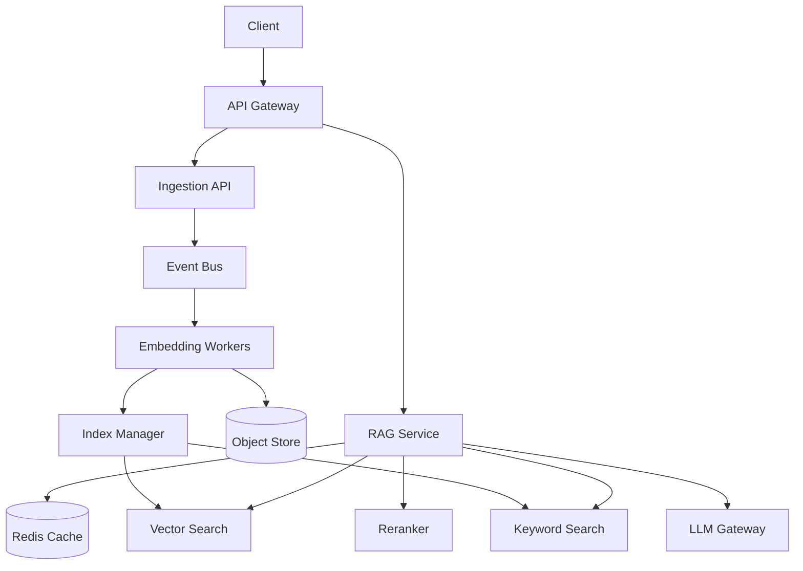
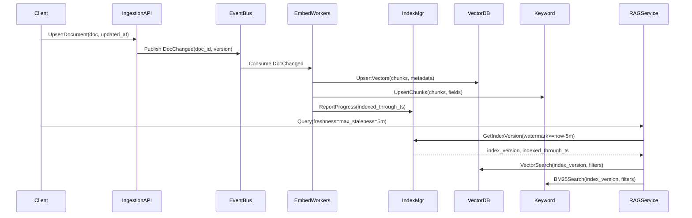

## Overview

Retrieval-Augmented Generation (RAG) systems reduce hallucinations and improve accuracy by grounding LLM outputs in retrieved, domain-specific context (documents, tickets, wikis, logs). The core challenge is not “doing vector search,” but operating it reliably at scale: ingestion throughput, embedding cost, ranking quality, security filtering, and prompt-budget constraints.

“Freshness guarantees” add a second hard problem: you must define and enforce a maximum staleness bound between source-of-truth updates and what retrieval can return. Production RAG needs explicit indexing watermarks, versioned indexes, and query-time policies (e.g., “no older than 5 minutes” or “read-your-writes within 10 seconds”), plus safe fallbacks when the guarantee can’t be met.

## Requirements

### Functional Requirements
- Ingest documents (create/update/delete) with metadata (tenant, ACLs, timestamps, source).
- Chunk documents and generate embeddings; support re-embedding on model upgrades.
- Retrieve relevant context using hybrid search (vector + keyword) with metadata/ACL filtering.
- Rerank candidates and assemble a prompt within a strict token budget.
- Enforce freshness policies per query (e.g., max staleness, minimum indexed watermark).
- Provide explainability/debugging (retrieved chunks, scores, index version, watermark).
- Support multi-tenancy isolation (per-tenant corpora, quotas, and rate limits).
- Audit logging for access to retrieved content and LLM requests.

### Non-Functional Requirements
- **Scale**: 10K QPS retrieval queries peak; 1K QPS RAG generations; 10K docs/min ingestion burst; 1000 tenants; 500M chunks total; 5–20KB average chunk text.
- **Latency** (retrieval path): P50 80ms, P99 250ms for retrieval; end-to-end RAG P50 1.2s, P99 4s (LLM dominates).
- **Availability**: 99.95% for ingestion APIs; 99.99% for retrieval (degraded mode allowed).
- **Consistency**: Strong for document metadata and ACLs; eventual for vector indexes within a bounded staleness window; “read-your-writes” optional via delta index.
- **Durability**: Source-of-truth metadata RPO ≤ 1 minute; embeddings/index rebuildable from stored chunks (no data loss beyond in-flight minutes).

### Constraints & Assumptions
- Team size: 6–10 engineers; prioritize managed services where viable.
- Compliance: support deletion (GDPR), audit logs, tenant isolation, encryption-at-rest/in-transit.
- LLM is accessed via internal gateway; model choice can change; prompts must be reproducible.
- Freshness SLA target: **≤ 5 minutes** for general corpora; **≤ 10 seconds** for read-your-writes on interactive edits (optional tier).

## High-Level Architecture

This architecture separates the **data plane** (retrieval + generation) from the **indexing plane** (ingestion, embeddings, and index publication). The RAG Service is optimized for low-latency reads, while indexing runs asynchronously with clear progress tracking.

Freshness guarantees are enforced by an **Index Manager** that publishes versioned indexes and tracks **watermarks** (the latest source update time fully reflected in each index). Queries declare a freshness policy, and the RAG Service routes to an index version that satisfies it—or returns a controlled error/degraded response when it cannot.

## Component Deep-Dive

### API Gateway
**Responsibility**: AuthN/Z, tenant routing, rate limiting, request signing, audit hooks.

**Key Design Decisions**:
- Enforce tenant and user identity at the edge to simplify downstream ACL filtering.
- Rate-limit separately for ingestion vs retrieval to prevent backpressure coupling.

**Technology Choice**: Envoy / API Gateway (AWS API Gateway / GCP API Gateway) + OIDC (Auth0/Okta/Cognito).

**Scaling Strategy**: Stateless horizontal scaling; per-tenant quotas via shared Redis or gateway-native policies.

### Ingestion & Embedding Pipeline
**Responsibility**: Validate documents, chunking, embedding generation, storing chunks/embeddings, emitting indexing events.

**Key Design Decisions**:
- Use an event bus to decouple ingestion from embedding cost and retries.
- Store canonical chunk text in object storage so indexes can be rebuilt and embeddings recomputed.

**Technology Choice**: Kafka/PubSub + stateless workers (Kubernetes) + object store (S3/GCS) + metadata DB (Postgres).

**Scaling Strategy**: Scale workers by lag; partition events by `tenant_id`; enforce per-tenant ingestion quotas.

### Index Manager (Freshness Control Plane)
**Responsibility**: Build/publish searchable indexes, track indexing progress, manage versions/aliases, enforce watermarks.

**Key Design Decisions**:
- **Versioned indexes + atomic alias swap**: build `index_vN`, then atomically repoint `active` when complete.
- **Watermark tracking**: maintain `indexed_through_ts` per corpus/tenant and per index version.

**Technology Choice**: Orchestrator (Temporal/Airflow) + Postgres for control state; vector DB collections (Milvus/Weaviate/Pinecone) and keyword search (OpenSearch/Elasticsearch).

**Scaling Strategy**: Parallel builds per tenant/corpus; incremental updates with compaction; background reindex for model upgrades.

### Retrieval Service (RAG Service)
**Responsibility**: Query understanding, hybrid retrieval, ACL filtering, freshness enforcement, rerank, context packing.

**Key Design Decisions**:
- Hybrid retrieval (BM25 + vector) improves recall on rare terms, IDs, and fresh entities.
- Two-stage rank (cheap retrieval → rerank top K) maximizes quality within latency budgets.

**Technology Choice**: Stateless service (Go/Java) + Redis cache; reranker via small transformer (e.g., bge-reranker) or LLM-based rerank in low-QPS tier.

**Scaling Strategy**: Stateless autoscaling; cache embeddings and frequent query results; shard vector search by tenant or hash.

### LLM Gateway
**Responsibility**: Unified access to LLM providers, policy enforcement, prompt logging/redaction, retries, circuit breaking.

**Key Design Decisions**:
- Centralize provider failover and cost controls (token limits, model routing).
- Ensure prompt reproducibility by logging: model, temperature, retrieved chunk IDs, index version.

**Technology Choice**: Internal gateway service + vendor SDKs; optional streaming.

**Scaling Strategy**: Stateless; bulkheads per provider; token-based concurrency limits.

## Data Model

### Storage Schema

**Postgres (control + metadata)**
- `documents`
  - `tenant_id` (pk part), `doc_id` (pk part)
  - `source` (string), `uri` (string)
  - `content_hash` (bytes), `version` (int)
  - `updated_at` (timestamp), `deleted_at` (timestamp nullable)
  - `acl_policy_id` (fk), `metadata_json` (jsonb)
- `chunks`
  - `tenant_id`, `doc_id`, `chunk_id` (pk)
  - `chunk_uri` (object store pointer), `token_count` (int)
  - `start_offset`, `end_offset` (int)
  - `updated_at`, `deleted_at`
- `embeddings`
  - `tenant_id`, `doc_id`, `chunk_id`, `embed_model` (pk)
  - `vector_uri` (optional), `dims` (int)
  - `created_at`
- `index_versions`
  - `tenant_id`, `corpus_id`, `index_version` (pk)
  - `vector_collection` (string), `keyword_index` (string)
  - `indexed_through_ts` (timestamp)  <!-- watermark -->
  - `state` (enum: building|active|failed), `created_at`
- `query_audit`
  - `tenant_id`, `user_id`, `request_id` (pk)
  - `query_hash`, `index_version`, `watermark_used`
  - `retrieved_chunk_ids` (jsonb), `created_at`

**Vector DB**
- Point: (`tenant_id`, `chunk_id`, `embed_model`) → `vector`, metadata: `doc_id`, `updated_at`, `deleted_at`, `acl_tags`, `corpus_id`

**Keyword Search (OpenSearch)**
- Document: `chunk_id` with fields: `text`, `doc_id`, `tenant_id`, `acl_tags`, `updated_at`, `deleted_at`

### Data Flow

Freshness is implemented by selecting an index version whose `indexed_through_ts` meets the query’s requirement. For stricter “read-your-writes,” add a small **delta index** (e.g., Redis/pgvector) for the last N minutes of updates and merge results at query time.

## API Design

### Ingestion
`PUT /v1/tenants/{tenantId}/documents/{docId}`
- Request:
  - `content` (string or URI), `contentType`
  - `metadata` (object), `acl` (object)
  - `updatedAt` (RFC3339), `idempotencyKey` (string)
- Response:
  - `docId`, `version`, `status` (`accepted`)
- Errors:
  - `409` version conflict (optional optimistic concurrency)
  - `413` too large, `429` rate limited
- Idempotency:
  - Keyed by `tenantId + docId + idempotencyKey` or `content_hash`; duplicate returns same `version`.

`DELETE /v1/tenants/{tenantId}/documents/{docId}`
- Tombstones metadata immediately (strong), schedules index deletion (eventual within SLA).

### Retrieval / RAG
`POST /v1/tenants/{tenantId}/rag:generate`
- Request:
  - `query` (string)
  - `freshness`: `{ "maxStalenessSeconds": 300, "requireReadYourWrites": false }`
  - `filters` (object): `corpusId`, tags, time range
  - `topK` (int), `contextTokenBudget` (int)
- Response:
  - `answer` (string), `citations` (chunk IDs + snippets)
  - `indexVersion`, `indexedThroughTs`
- Errors:
  - `503` freshness_not_met (cannot satisfy staleness bound)
  - `403` if filters/ACL deny access
- Idempotency:
  - Optional `requestId` to dedupe retries (store result pointer for short TTL).

`POST /v1/tenants/{tenantId}/retrieve`
- Returns retrieved chunks only (debug/inspection workflows).

`GET /v1/tenants/{tenantId}/freshness`
- Response: per `corpusId` watermark and current active `indexVersion`.

## Scaling & Performance

### Bottleneck Analysis
- **Vector search latency/cost**: mitigate via smaller candidate sets, ANN tuning (HNSW/IVF), per-tenant sharding, and caching query embeddings.
- **Embedding throughput**: mitigate with batching, async pipelines, tiered SLAs, and model selection (small embedding models for high volume).
- **Rerank cost**: mitigate by reranking only top 50–200 candidates and using a lightweight cross-encoder.
- **Hot tenants**: mitigate via per-tenant rate limits and dedicated partitions/collections.

### Horizontal Scaling
- **API/RAG services**: stateless autoscale behind L7 LB.
- **Event bus**: partition by `tenant_id` to parallelize ingestion and isolate backpressure.
- **Vector DB**: shard by tenant/corpus; replicate for HA; tune index params per corpus type.
- **Keyword search**: shard by tenant and time; maintain separate indices per corpus for manageable merges.

### Caching Strategy
- **Query embedding cache** (Redis, TTL 1–24h): key = `embed_model + normalized_query`.
- **Retrieval result cache** (TTL 30–300s): key includes `tenant_id`, `filters`, and **indexVersion** to avoid stale mixing.
- **Document/chunk cache** (TTL 5–30m): cache chunk text by `chunk_id` for citation rendering.
- Invalidation:
  - Prefer **versioned keys** (indexVersion) over active invalidation; freshness comes from selecting the right version.

## Trade-offs & Alternatives

### Key Trade-offs Made
- **Async indexing with watermarks**
  - Chosen: bounded eventual consistency + explicit freshness errors.
  - Sacrificed: always-strong read-after-write for retrieval.
  - Why: strong consistency across vector + keyword + rerank at scale is expensive; bounded staleness is practical and measurable.
- **Versioned indexes**
  - Chosen: atomic publish and rollback.
  - Sacrificed: higher storage during rebuilds.
  - Why: avoids partial/dirty reads during reindex, simplifies ops.
- **Hybrid search**
  - Chosen: better recall and robustness.
  - Sacrificed: extra infra and query fanout.
  - Why: real corpora contain IDs, code, and rare terms where BM25 wins.

### Alternative Approaches
- **Single datastore (Postgres + pgvector only)**: simpler ops, but limited ANN performance at 500M chunks and harder multi-tenant isolation.
- **Streaming “always fresh” index updates**: lowest staleness, but operationally complex (hard deletes, compaction, correctness under retries).
- **LLM-only retrieval (no vector DB)**: workable for tiny corpora, but too slow/costly and unreliable for large, frequently changing data.

## Failure Modes & Mitigations

### Failure Scenarios
- **Scenario**: Indexing lags behind SLA (watermark stale)
  - **Impact**: Freshness guarantees violated; queries may fail with `freshness_not_met`.
  - **Detection**: Watermark age metric; Kafka lag; index publish delay SLO burn.
  - **Mitigation**: Autoscale workers; prioritize hot tenants; degrade to delta index for recent updates.
- **Scenario**: Vector DB partial outage / high latency
  - **Impact**: Retrieval timeouts, RAG latency spikes.
  - **Detection**: P99 latency, error rates, circuit breaker trips.
  - **Mitigation**: Fall back to keyword-only retrieval; serve cached results; reduce `topK`.
- **Scenario**: Delete not reflected (compliance risk)
  - **Impact**: Deleted content may be retrieved.
  - **Detection**: Deletion watermark SLO; periodic scan for tombstoned IDs in indexes.
  - **Mitigation**: Strong tombstone in metadata + query-time filter on `deleted_at`; prioritized delete pipeline; legal hold procedures.
- **Scenario**: ACL mismatch / leakage
  - **Impact**: Unauthorized content exposure.
  - **Detection**: Audit log anomaly detection; canary queries; permission test suites.
  - **Mitigation**: Enforce ACL filters in retrieval queries; deny-by-default; sign retrieval filters with gateway claims.
- **Scenario**: Embedding model upgrade breaks relevance
  - **Impact**: Quality regression.
  - **Detection**: Offline eval + online metrics (CTR, citation usefulness, human review).
  - **Mitigation**: Dual-run indexes by model; gradual traffic shift; quick rollback via alias.

### Disaster Recovery
- **RTO/RPO**: RTO 2 hours (full service), 15 minutes (degraded retrieval); RPO 1 minute for metadata, 0 for object store (provider durability).
- **Backup strategy**: Postgres PITR + daily snapshots; export index metadata; object store versioning; rebuild indexes from chunks if needed.
- **Failover procedures**: Multi-AZ for data plane; warm standby in secondary region for control plane; DNS or gateway failover; replay event bus from retained topics.

## Operational Considerations

### Monitoring & Alerting
- Freshness: `watermark_age_seconds` per tenant/corpus (alert at > 300s for 5m SLA).
- Retrieval: P50/P99 latency, timeouts, cache hit rate, vector DB QPS.
- Indexing: bus lag, worker error rate, reprocessing rate, publish failures.
- Quality: click/accept metrics (if applicable), citation coverage, “no result” rate, rerank lift.
- Security: ACL-denied counts, audit volume, delete propagation time.

### Deployment Strategy
- Blue/green or canary for RAG Service and Index Manager; feature flags for retrieval strategies.
- Schema migrations: backward compatible; add-only fields; dual-write during transitions.
- Rollback: instant rollback by switching active index alias; service rollback via deploy orchestration; keep last N index versions.

## References & Further Reading
- Pinecone RAG patterns: https://www.pinecone.io/learn/retrieval-augmented-generation/
- Milvus architecture and indexing: https://milvus.io/docs
- OpenSearch/Elasticsearch BM25 and filtering: https://opensearch.org/docs/
- “Building effective agents” (retrieval + tool patterns applicable to RAG): https://www.anthropic.com/research/building-effective-agents
- Temporal (workflow orchestration for indexing pipelines): https://temporal.io/