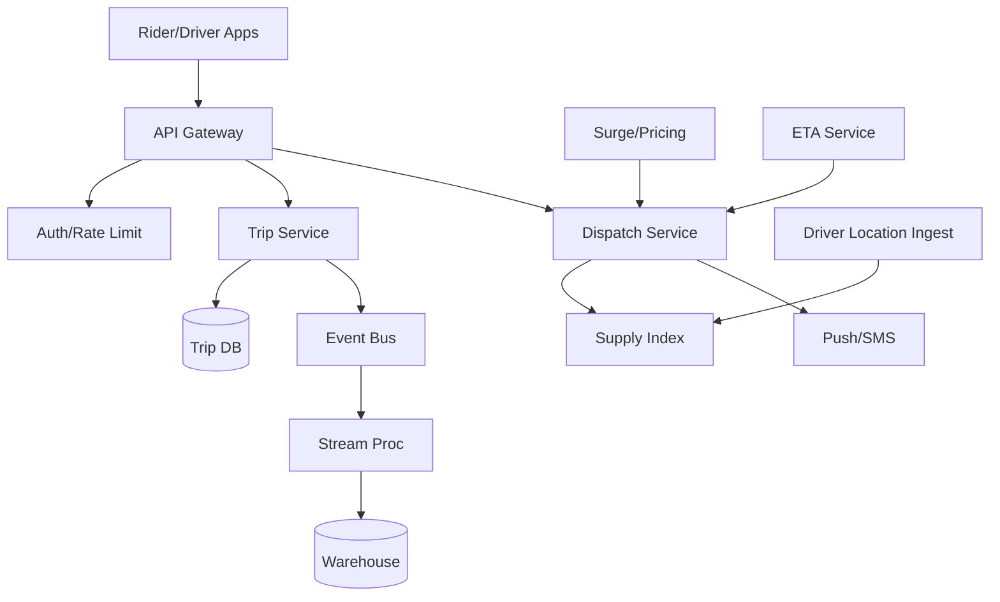
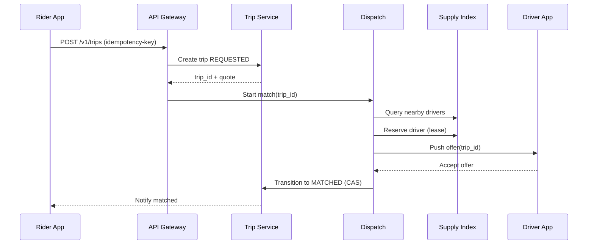

## Overview

Ride-hailing dispatch is a real-time marketplace that continuously matches two moving populations—riders and drivers—under strict latency constraints, adversarial conditions (fraud, GPS noise, churn), and complex state transitions (offers, accepts, cancels, pickups, trips, payments). The core challenge is not just “find nearest driver”, but doing so at high QPS with low P99 latency while keeping the system correct under concurrency, partial failures, and eventual consistency in location data.

The key insight is to separate the problem into (1) a fast, in-memory geospatial supply index for candidate discovery, (2) a durable trip state machine for correctness and auditability, and (3) an asynchronous event pipeline for pricing, ETA, notifications, and analytics. Dispatch becomes a bounded-time, multi-step workflow that uses timeouts, leases, and idempotency to safely coordinate multiple services.

## Requirements

### Functional Requirements
- Rider can request a ride with pickup/dropoff, product (e.g., X/XL), and payment method.
- System matches a rider to an eligible driver based on proximity, ETA, preferences, and constraints (vehicle type, capacity, accessibility).
- Driver receives an offer, can accept/decline; system re-offers on timeout or rejection.
- Trip lifecycle management: requested → matched → driver enroute → arrived → in_trip → completed/canceled, with reason codes.
- Real-time driver location ingestion and rider/driver live trip updates (ETA, route progress).
- Surge/prime pricing: compute dynamic multiplier by geo-region and apply at quote + enforce at trip start.
- Cancellations with fees: rider/driver cancel flows with policy evaluation (grace periods, no-show).
- Basic safety/compliance hooks: audit log of state transitions and immutable trip ledger events.

### Non-Functional Requirements
- **Scale**:
  - 20M DAU, 2M concurrent sessions (global peak)
  - Driver location updates: 1M online drivers * 0.2 Hz avg = 200K updates/sec peak (burstier in cities)
  - Ride requests: 10K requests/sec peak globally, 2K/sec in top metro
  - Trip state transitions: ~5–15 events/trip, ~50K events/sec peak
- **Latency**:
  - Quote (price + ETA): P50 150ms, P99 800ms
  - Match result: P50 300ms, P99 1.5s (including offer round-trip; first offer out <200ms)
  - Driver location ingest to index: P50 100ms, P99 500ms
- **Availability**:
  - Dispatch critical path: 99.99% in-region
  - Trip state machine storage: 99.99% (multi-AZ)
- **Consistency**:
  - Trip state: strongly consistent per trip (linearizable transitions)
  - Driver location and supply index: eventual (stale tolerance 2–5s with TTL)
  - Surge: eventually consistent (regional) with versioned snapshots
- **Durability**:
  - Trip records and financial artifacts: 0 data loss (RPO ~ 0 via synchronous multi-AZ writes)
  - Location pings/telemetry: small loss acceptable (RPO minutes)

### Constraints & Assumptions
- Multi-region active-active for reads; dispatch is “region-local” to reduce cross-region latency.
- Team can operate Kafka/Pulsar + Redis + Postgres/CockroachDB + a stream processor (Flink/Spark).
- Compliance: retain trip events for 7 years (jurisdiction dependent); PII encrypted at rest; GDPR deletion workflows for rider data (except required financial records).
- Mobile networks are unreliable; clients may retry aggressively; system must be idempotent.

## High-Level Architecture



The architecture separates correctness-critical state (Trip Service + Trip DB) from low-latency, high-churn signals (Driver Location Ingest + Supply Index). Dispatch orchestrates matching using the supply index and calls out to pricing/ETA to rank candidates, while the Trip Service owns the authoritative lifecycle and emits immutable events to an event bus.

This split keeps the critical path fast and resilient: the supply index can be rebuilt and is tolerant to staleness, while trip state transitions are strongly consistent and auditable. Asynchronous processing handles heavy computations (demand/supply aggregation, fraud signals, experimentation) without inflating match latency.

## Component Deep-Dive

### Driver Location Ingest

**Responsibility**: Accept high-rate GPS pings from drivers, validate/normalize, and update the real-time supply index.

**Key Design Decisions**:
- Use a lightweight ingest tier with aggressive backpressure and sampling to survive bursts; prefer dropping telemetry over melting down dispatch.
- Normalize GPS (map-matching optional) and apply filters (speed bounds, jitter smoothing) to reduce index churn.

**Technology Choice**: gRPC ingest service + Redis Cluster (or Aerospike) for ephemeral driver state; optional Kafka topic for raw pings.

**Scaling Strategy**:
- Stateless ingest servers behind L7 LB; partition by driver_id hash.
- Write-through to supply index with TTL (e.g., 10–20s) so offline drivers naturally disappear.
- Rate-limit per driver (e.g., max 1 Hz accepted; burst tokens).

### Supply Index (Geospatial)

**Responsibility**: Provide “eligible drivers near pickup” queries with low latency and high write rate.

**Key Design Decisions**:
- Geohash/H3 cell indexing with multi-resolution expansion (start small, expand rings) for bounded query time.
- Store only ephemeral availability + coarse location in the index; authoritative attributes come from driver/profile service or cached snapshots.

**Technology Choice**:
- Redis Cluster with:
  - Key per cell: `cell:{h3}:{product}` → sorted set by last_seen or score
  - Driver hash: `driver:{id}` → last_lat, last_lng, heading, product flags, last_seen
- Alternative: custom in-memory index (e.g., in Dispatch) fed by Kafka; Redis is simpler operationally.

**Scaling Strategy**:
- Partition by cell key across Redis shards.
- Keep hot metros in separate Redis clusters (regional sharding).
- Use TTL + periodic cleanup; cap per-cell members (e.g., keep top 5k freshest).

### Dispatch Service

**Responsibility**: Match riders to drivers via candidate discovery, ranking, offer workflow, and timeouts.

**Key Design Decisions**:
- Implement a “match attempt” workflow with leases: reserve a driver for a short window (e.g., 8–12s) to prevent double-offers.
- Use multi-stage ranking: fast filter (eligibility), then ETA/pricing scoring for top-N only (e.g., N=50).

**Technology Choice**: Stateless service + Redis for short-lived reservations + event bus for offer events; optionally a workflow engine (Temporal) for robustness.

**Scaling Strategy**:
- Partition by city/region and by pickup cell to keep cache locality.
- Concurrency control via atomic Redis scripts (Lua) or single-writer per trip (workflow) to avoid races.
- Degrade gracefully: if ETA service slow, fall back to distance-based ranking.

### Trip Service (State Machine)

**Responsibility**: Own the authoritative trip record, enforce valid state transitions, and provide query APIs.

**Key Design Decisions**:
- Use a per-trip strongly consistent write model (single row + version) with conditional updates to prevent illegal transitions.
- Emit immutable domain events on every transition for audit, replay, and downstream consumers.

**Technology Choice**: Postgres (partitioned) or CockroachDB for strong consistency + Kafka/Pulsar for events.

**Scaling Strategy**:
- Partition trips by region + time (monthly partitions) for write performance and retention.
- Read replicas for history queries; cache “current trip” in Redis (short TTL) to reduce DB reads.

### Pricing/Surge

**Responsibility**: Compute and serve real-time price quotes and surge multipliers per geo-region.

**Key Design Decisions**:
- Compute surge on aggregated supply/demand per “pricing zone” (e.g., H3 resolution 7) with smoothing and guardrails.
- Version surge snapshots; quote responses include `surge_version` to ensure explainability and reconciliation.

**Technology Choice**: Stream processor (Flink) consuming request + availability events; low-latency serving via Redis/Key-Value store.

**Scaling Strategy**:
- Partition by zone id; update intervals 5–15s with exponential smoothing.
- Fallback to last-known snapshot if processor degraded.

## Data Model

### Storage Schema

**Trip DB (relational)**

`trips`
- `trip_id` (UUID, PK)
- `rider_id` (UUID, indexed)
- `driver_id` (UUID, nullable, indexed)
- `status` (enum: REQUESTED, OFFERED, MATCHED, ENROUTE, ARRIVED, IN_TRIP, COMPLETED, CANCELED)
- `pickup_lat` / `pickup_lng` (double)
- `dropoff_lat` / `dropoff_lng` (double)
- `product` (text)
- `requested_at` (timestamp)
- `updated_at` (timestamp)
- `version` (bigint) — optimistic concurrency
- `surge_multiplier` (numeric)
- `surge_version` (text)
- `quote_id` (UUID)
- `cancel_reason` (text, nullable)
- `region` (text, indexed)

`trip_events`
- `event_id` (UUID, PK)
- `trip_id` (UUID, indexed)
- `type` (text) — e.g., TRIP_REQUESTED, DRIVER_OFFERED, DRIVER_ACCEPTED
- `created_at` (timestamp)
- `actor` (text: rider/driver/system)
- `payload` (jsonb) — reason codes, coordinates, pricing snapshot refs
- `idempotency_key` (text, unique per trip+type)

**Redis (ephemeral)**
- `cell:{h3}:{product}` → ZSET members `driver_id`, score = `last_seen_epoch`
- `driver:{id}` → HASH: lat/lng, products, status, last_seen
- `reserve:{driver_id}` → string `trip_id` with TTL 12s (lease)
- `tripmatch:{trip_id}` → HASH: current_attempt, last_driver, backoff

### Data Flow



Key points:
- Trip creation is durable first; matching is an asynchronous workflow referencing `trip_id`.
- Driver reservation is best-effort and time-bound; Trip Service finalizes the match with a conditional update to prevent double-matches.
- All steps are idempotent via `idempotency-key` and per-trip event uniqueness.

## API Design

### Create Trip (Quote + Request)
`POST /v1/trips`
- Headers: `Idempotency-Key: <uuid>`
- Request:
```json
{
  "pickup": {"lat": 37.775, "lng": -122.418},
  "dropoff": {"lat": 37.789, "lng": -122.401},
  "product": "uberx",
  "payment_method_id": "pm_123"
}
```
- Response `201`:
```json
{
  "trip_id": "t_456",
  "status": "REQUESTED",
  "quote": {
    "currency": "USD",
    "estimated_fare_min": 12.30,
    "estimated_fare_max": 15.80,
    "surge_multiplier": 1.3,
    "surge_version": "zone7:2025-12-17T10:20:30Z",
    "eta_seconds": 240
  }
}
```
- Errors:
  - `409` idempotency replay with mismatched body
  - `422` invalid coordinates/product
  - `429` rate limited
- Idempotency: store `(rider_id, idempotency_key) -> trip_id` for 24h.

### Driver Location Update
`POST /v1/drivers/me/location`
- Request:
```json
{"lat": 37.774, "lng": -122.419, "heading": 120, "speed_mps": 8.0, "timestamp_ms": 1734430830000}
```
- Response `202`
- Notes: accept out-of-order with timestamp checks; clamp frequency.

### Driver Offer Response
`POST /v1/offers/{offer_id}/accept` and `/decline`
- Response `200` includes `trip_id` and next state.
- Idempotency: `offer_id` is unique; accepting twice returns same result.

### Trip Status
`GET /v1/trips/{trip_id}`
- Response includes status + matched driver (redacted fields) + ETA.

### Cancel Trip
`POST /v1/trips/{trip_id}/cancel`
- Request: `{"reason":"changed_mind"}`
- Server computes fees based on policy + timestamps.
- Idempotency: `Idempotency-Key` required to avoid double fee assessment.

## Scaling & Performance

### Bottleneck Analysis
- **Location ingest write amplification**: too many updates churn the supply index.
  - Mitigate with sampling, dedupe by cell change, and per-driver token bucket.
- **Hot cells in dense metros**: a few geocells dominate traffic.
  - Mitigate with multi-resolution cells, per-city sharding, and limiting per-cell candidate sets.
- **Offer fanout and timeouts**: push infrastructure and retries can spike.
  - Mitigate with bounded candidate lists, exponential backoff, and circuit breakers.

### Horizontal Scaling
- **Edge/API**: stateless; scale by QPS; WAF and rate limiting at edge.
- **Dispatch**: shard by region + pickup cell; maintain locality to the supply index cluster.
- **Supply Index**: Redis cluster sharded by key; separate clusters per region; add shards to scale.
- **Trip DB**: partition by region and time; use connection pooling; add read replicas; consider CockroachDB for simpler multi-AZ writes.

**Partitioning strategy**:
- Primary: `region` (e.g., `us-west-2`, `eu-central-1`)
- Secondary: `city_id` for operational isolation
- Geospatial: H3/geohash cell id (resolution chosen to balance density; e.g., H3 r8 for ~0.7km edges)

### Caching Strategy
- Cache driver eligibility snapshots (vehicle/product/capabilities) in Dispatch (local LRU) with TTL 5–15 minutes.
- Cache surge snapshot by zone in Redis with TTL 60s; embed `surge_version` in quotes.
- Cache current trip state in Redis (TTL 30–60s) to reduce DB reads for polling clients.
- Invalidation:
  - Driver attribute changes publish event → Dispatch cache bust by driver_id.
  - Surge is versioned; clients accept new versions without explicit invalidation.

## Trade-offs & Alternatives

### Key Trade-offs Made
- **Redis-based supply index**
  - Chosen: fast reads/writes, operational simplicity.
  - Sacrificed: perfect ordering/accuracy under churn; needs careful TTL and caps.
  - Why: dispatch needs speed and staleness tolerance; correctness lives in Trip Service.
- **Strong consistency only for trip state**
  - Chosen: linearizable transitions per trip.
  - Sacrificed: cross-entity transactional guarantees (e.g., “driver cannot be matched to two trips” is enforced via leases + CAS, not a global transaction).
  - Why: global transactions at this scale are expensive; lease+CAS is a common, practical pattern.
- **Asynchronous matching workflow**
  - Chosen: decouples request from offers and retries; resilient to transient failures.
  - Sacrificed: slightly more complexity (timeouts, retries, dead-letter handling).
  - Why: required for production reliability and backpressure.

### Alternative Approaches
- **In-memory dispatch-owned index fed by Kafka**
  - Pros: extremely fast; avoids Redis hot keys.
  - Cons: complexity in rebuild/rebalance; harder operational story.
- **Use specialized geo DB (e.g., Elasticsearch geo, Mongo geospatial)**
  - Pros: richer queries.
  - Cons: write-heavy workload and latency often worse than purpose-built index.
- **Centralized workflow engine (Temporal) for all matches**
  - Pros: strong retry semantics and visibility.
  - Cons: higher operational footprint; careful scaling required at peak.

## Failure Modes & Mitigations

### Failure Scenarios
- **Scenario**: Redis cluster partial outage (supply index unavailable)
  - **Impact**: cannot discover candidates; match latency spikes.
  - **Detection**: Redis error rate, p99 latency, timeouts.
  - **Mitigation**: fallback to last-known candidates cache, broaden to adjacent regions if policy allows, degrade to “try again” UX; auto-failover within region.
- **Scenario**: Driver push notification delays
  - **Impact**: offers time out; fewer matches.
  - **Detection**: offer accept rate drop, push provider latency.
  - **Mitigation**: parallelize offer channels (push + in-app websocket), reduce offer TTL, expand candidate pool temporarily.
- **Scenario**: Duplicate match race (two dispatchers offer same driver)
  - **Impact**: driver confusion; incorrect rider expectations.
  - **Detection**: conflicts on Trip Service CAS; driver app reports multiple offers.
  - **Mitigation**: atomic reservation lease in Redis; Trip Service conditional transition rejects second; dispatch cancels stale offers.
- **Scenario**: Trip DB write degradation
  - **Impact**: state transitions stall; revenue impact.
  - **Detection**: DB replication lag, write p99.
  - **Mitigation**: shed non-critical writes, queue transitions (bounded) with backpressure, failover to standby, prioritize critical transition endpoints.
- **Scenario**: Surge processor lag
  - **Impact**: stale pricing; unfair marketplace.
  - **Detection**: event lag metrics, snapshot age.
  - **Mitigation**: serve last-known surge with max-age; apply guardrails (cap multiplier), alert and auto-restart job.

### Disaster Recovery
- Targets:
  - **RTO**: 30 minutes per region for dispatch; 60 minutes for analytics.
  - **RPO**: ~0 for Trip DB (multi-AZ synchronous); minutes for telemetry streams.
- Backup strategy:
  - Continuous WAL archival + daily snapshots for Trip DB; encrypted and tested restores.
  - Event bus retention 3–7 days to allow replay/rebuild of derived stores.
- Failover procedures:
  - Regional failover is “graceful degradation”: new requests route to nearest healthy region only if within acceptable latency; otherwise, stop accepting new trips while allowing in-progress trips to complete if possible.

## Operational Considerations

### Monitoring & Alerting
- Dispatch:
  - match success rate, time-to-match p50/p99, offer accept rate, reservation conflict rate
- Supply index:
  - Redis ops/sec, keyspace size, hotkey detection, replication health, command latency
- Trip state:
  - transition error rate (CAS failures vs invalid transitions), DB p99 writes, replication lag
- Pricing:
  - snapshot freshness, surge distribution (guardrails), quote-to-complete fare deltas
- Suggested alerts:
  - Match p99 > 2s for 5m
  - Redis error rate > 1% for 1m
  - Trip DB write p99 > 200ms for 5m
  - Surge snapshot age > 60s for 2m

### Deployment Strategy
- Use canary + gradual rollout per city/region; feature flags for ranking/pricing experiments.
- Backward-compatible APIs with versioning; schema migrations with expand/contract.
- Rollback:
  - Quick rollback for stateless services via deployment revert.
  - For DB changes, keep old columns until fully migrated; avoid destructive migrations in peak hours.

## References & Further Reading

- Uber Engineering: H3 hexagonal hierarchical spatial index (https://h3geo.org/)
- Lyft Engineering blog (dispatch, marketplace dynamics, ETA modeling): https://eng.lyft.com/
- “Designing Data-Intensive Applications” (Kleppmann) — consistency, streams, idempotency
- Kafka/Pulsar docs for exactly-once-ish processing patterns and consumer lag management
- Temporal (workflow orchestration) docs for durable retries and timeouts in distributed workflows