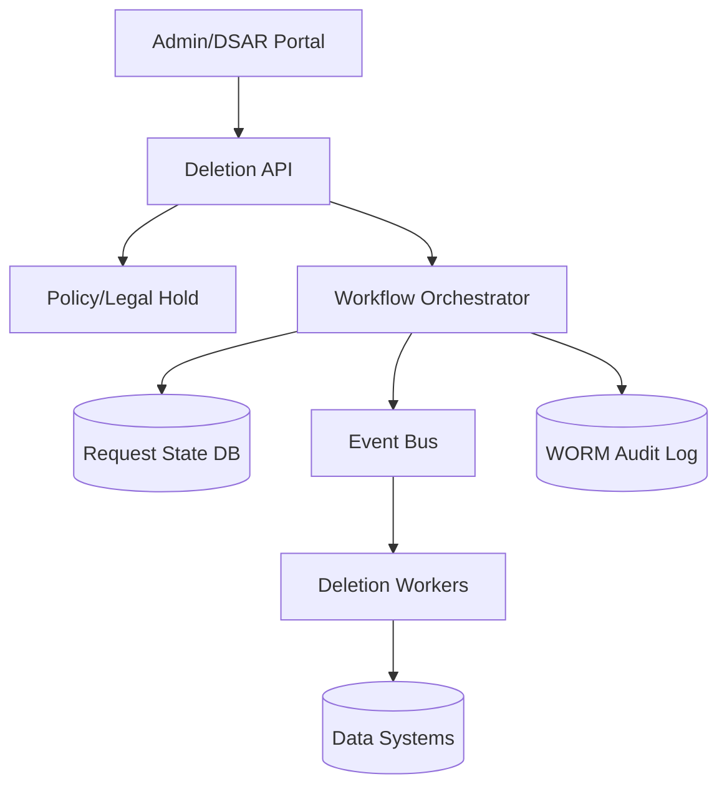
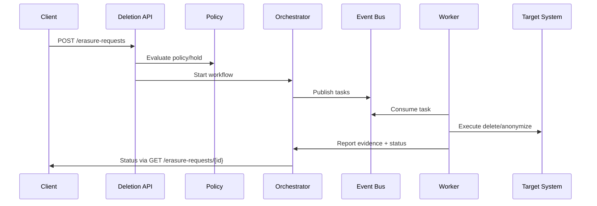

## Overview

“Right to be Forgotten” (RTBF) is deceptively hard because user data rarely lives in one place: it’s copied into caches, search indexes, object storage, backups, and analytical warehouses, then further replicated across regions and downstream teams. A credible solution must delete data comprehensively, prove it happened (auditability), and do so safely without taking critical systems offline.

The key insight is to treat deletion as a first-class, orchestrated workflow driven by a **data inventory** (what systems hold which user data) and executed by **per-system deletion connectors** with strong idempotency, retries, and verifiable evidence. For immutable or slow-to-delete stores (object logs, backups, lakehouses), the design combines *best-effort physical deletion* with *guaranteed irrecoverability* via crypto-shredding, retention controls, and restore-time reapplication.

## Requirements

### Functional Requirements
- Accept RTBF deletion requests for a user (by internal user ID and/or external identifiers) with requester identity and reason.
- Validate eligibility (e.g., account ownership, jurisdiction) and enforce policies (e.g., legal hold, fraud investigations).
- Discover all data locations for the user using a centralized data catalog and dynamic routing to the correct deletion connectors.
- Execute deletion across primary databases, caches, search indexes, object storage, streaming/log systems, and analytical warehouses.
- Provide real-time status tracking (pending/running/blocked/complete) with per-system evidence and timestamps.
- Guarantee idempotent processing (safe retries) and deduplicate repeated requests.
- Produce immutable audit records suitable for compliance review and internal security investigations.
- Support scoped deletion (e.g., “delete profile + activity” but retain invoices for statutory retention) with policy-driven exemptions.

### Non-Functional Requirements
- **Scale**: 100M total users, 20M DAU; 1M deletion requests/day average, 5M/day peak; peak intake 100 RPS; fanout to 20–80 downstream systems per request; analytics footprint 5–20 PB.
- **Latency**:
  - Request acceptance: P50 50ms, P99 250ms.
  - Status read: P50 20ms, P99 100ms.
  - Deletion completion SLO: 99% within 24 hours; 99.9% within 7 days (to accommodate warehouses/backup windows).
- **Availability**: 99.99% for request intake/status APIs; deletion execution is best-effort with durable retry (not “always online”).
- **Consistency**:
  - Strong consistency for request state transitions and audit writes.
  - Eventual consistency for physical deletion across systems, with bounded completion SLOs.
- **Durability**: Zero loss of deletion requests/audit events (RPO ~ 0 for orchestrator state); tolerate reprocessing without double-deleting.

### Constraints & Assumptions
- Compliance regimes may include GDPR/UK GDPR/CCPA; assume mandated response windows (e.g., 30 days) and auditability requirements.
- Some data must be retained (tax, billing, chargebacks) under statutory retention; design includes policy-based exemptions and anonymization.
- Some stores are immutable (append-only logs, certain cold storage); full physical purge may be delayed until compaction/VACUUM.
- Team constraint: small platform team (5–10 engineers) must integrate many product systems incrementally.
- Multi-region active-active for user-facing services; deletion control plane can be active-active with a single-writer state store per request.

## High-Level Architecture



The design separates a **control plane** (request intake, policy checks, orchestration, state, audit) from a **data plane** (connectors that execute deletion in each target system). This keeps user-facing latency low while allowing long-running, retryable deletion work to proceed asynchronously.

A centralized **data catalog** (modeled as part of “Targets” + orchestrator configuration) drives where to delete, in what order, and with what method (hard delete, anonymize, crypto-shred, TTL/compaction). The **audit log** is written in an immutable/WORM store to provide verifiable evidence without being mutable by application operators.

## Component Deep-Dive

### Deletion API
**Responsibility**: Accept requests, authenticate/authorize requesters, validate input, start workflows, serve status.

**Key Design Decisions**:
- Use asynchronous processing: accept quickly and return a request ID; avoids tying API availability to downstream system health.
- Require idempotency keys: prevents duplicate workflows from retries and repeated DSAR submissions.

**Technology Choice**: Stateless service (Go/Java), behind L7 load balancer; Postgres for request metadata; OIDC/SAML for admin/DSAR portals.

**Scaling Strategy**: Horizontal scale; cache hot status reads (short TTL) but never cache “not deleted” as truth for compliance reporting.

### Policy & Legal Hold Service
**Responsibility**: Decide what can be deleted now, what must be retained, and what should be anonymized.

**Key Design Decisions**:
- Centralize retention and legal-hold rules; keep product teams from embedding inconsistent policy.
- Return explicit “exemptions” list (e.g., invoices) with rationale for audit.

**Technology Choice**: Policy engine (OPA) + backing store (Postgres); integrations to case management (fraud, trust & safety).

**Scaling Strategy**: Read-heavy; cache decisions for a request; rules deployed with versioning and audit trail.

### Workflow Orchestrator
**Responsibility**: Expand a request into per-system tasks, manage dependencies, retries, backoff, and completion criteria.

**Key Design Decisions**:
- Durable state machine per request: each task is independently retryable and idempotent.
- Dependency ordering: delete from caches/indexes early (reduce user-visible remnants), then primaries, then derived/analytics.

**Technology Choice**: Temporal/Cadence or a DB-backed orchestrator; Postgres for state; outbox pattern to publish task events reliably.

**Scaling Strategy**: Partition workflows by `request_id` hash; rate-limit per target system to avoid overload.

### Deletion Workers (Connectors)
**Responsibility**: Execute deletion in a specific target system and report evidence (counts, query/job IDs, timestamps).

**Key Design Decisions**:
- Connector-per-system with a common contract: `prepare`, `execute`, `verify`, `evidence`.
- Multiple deletion modes: hard delete, field nulling/anonymization, key deletion (crypto-shred), tombstone+compaction.

**Technology Choice**: Worker pool (Kubernetes jobs or long-running consumers) consuming from Kafka/Pub/Sub; per-system SDKs.

**Scaling Strategy**: Horizontally scale consumers; concurrency caps per connector; dead-letter queue for poisoned tasks.

### Audit & Evidence Store
**Responsibility**: Immutable log of request, policy decision, task execution, and evidence artifacts.

**Key Design Decisions**:
- WORM storage and append-only schema: prevents tampering and supports external audits.
- Store *evidence metadata* (job IDs, checksums, counts) rather than raw user data.

**Technology Choice**: Object storage with WORM/retention lock (S3 Object Lock / GCS Bucket Lock) + signed event chain (hash chaining).

**Scaling Strategy**: Append-only; partition by day/region; lifecycle policies to retain per compliance needs (e.g., 6–7 years).

## Data Model

### Storage Schema

**`erasure_requests` (Postgres)**
- `request_id` (UUID, PK)
- `idempotency_key` (string, unique per requester)
- `subject_user_id` (string, indexed)
- `subject_identifiers` (jsonb: email/phone/device IDs)
- `requested_scope` (jsonb: categories)
- `requester` (jsonb: actor, auth context)
- `policy_version` (string)
- `status` (enum: PENDING|RUNNING|BLOCKED|COMPLETED|FAILED)
- `created_at`, `updated_at`, `deadline_at`

**`erasure_tasks` (Postgres)**
- `task_id` (UUID, PK)
- `request_id` (UUID, FK, indexed)
- `target_system` (string, indexed)
- `operation` (enum: HARD_DELETE|ANONYMIZE|CRYPTO_SHRED|PURGE_CACHE|VACUUM)
- `status` (enum: PENDING|RUNNING|SUCCEEDED|RETRYING|FAILED|SKIPPED)
- `attempt` (int)
- `lease_expires_at` (timestamp)  
- `evidence_ref` (string: pointer to audit object)
- `last_error` (text)

**`data_inventory` (config + metadata)**
- `target_system`
- `data_domains` (e.g., profile, messages, events)
- `identifier_types` supported (user_id, email_hash, device_id)
- `deletion_method` + `verification_method`
- `rate_limits` + `max_concurrency`
- `dependencies` (e.g., “delete sessions cache before profile DB”)

### Data Flow



## API Design

### Create Erasure Request
`POST /v1/erasure-requests`

Headers:
- `Idempotency-Key: <uuid-or-hash>`
- `Authorization: Bearer <token>`

Request:
```json
{
  "subject": {
    "user_id": "u_123",
    "identifiers": {"email": "user@example.com"}
  },
  "scope": ["profile", "sessions", "content", "analytics"],
  "reason": "GDPR_ERASURE",
  "jurisdiction": "EU"
}
```

Response (`202 Accepted`):
```json
{
  "request_id": "6e5f...c2",
  "status": "PENDING",
  "deadline_at": "2026-01-16T12:00:00Z"
}
```

Errors:
- `400` invalid subject/scope
- `401/403` unauthorized
- `409` idempotency conflict (same key, different payload)
- `423` legal hold / policy blocked (returns exemptions and rationale)

Idempotency:
- Same `Idempotency-Key` + requester must return the original `request_id`.
- Payload hash stored to detect conflicting reuse.

### Get Request Status
`GET /v1/erasure-requests/{request_id}`

Response:
```json
{
  "request_id": "6e5f...c2",
  "status": "RUNNING",
  "tasks": [
    {"target_system":"user-db","status":"SUCCEEDED","evidence_ref":"audit/.."},
    {"target_system":"warehouse","status":"RUNNING","eta_hours":12}
  ]
}
```

### Retry Failed Tasks (Privileged)
`POST /v1/erasure-requests/{request_id}/retry`

Behavior:
- Re-enqueues only `FAILED` tasks after validating the request is still eligible and policy has not changed.

## Scaling & Performance

### Bottleneck Analysis
- **Fanout explosion** (80+ systems): mitigate with inventory-driven scoping, batching, and per-system rate limits.
- **Slow analytical deletes** (VACUUM/compaction): mitigate with partitioning by user/time, incremental deletes, and scheduled maintenance windows.
- **Hot shards in state store**: mitigate by sharding `erasure_tasks` by `request_id` and using append-only task events + compacted projections.

### Horizontal Scaling
- **API**: stateless, autoscale on RPS/latency.
- **Orchestrator**: scale by workflow partitions; use durable queues and leases for task dispatch.
- **Workers**: scale per connector; isolate noisy systems with dedicated consumer groups.
- **Targets**: enforce connector-side throttles to protect production DBs.

Sharding/partitioning:
- Prefer **user-centric partitioning** where feasible (e.g., user_id hash partitions in OLTP, lakehouse Z-order/clustering on user_id).
- For warehouses, use tables partitioned by event time and clustered by `user_id` to reduce delete scan cost.

### Caching Strategy
- Cache only **status reads** (e.g., 5–15s TTL) and **data inventory** (minutes TTL).
- Do not rely on caches for deletion correctness; caches must be explicitly purged:
  - Keyspace conventions (`user:{id}:*`) for targeted deletes.
  - For shared caches, use versioned cache keys and bump user “epoch” to invalidate broadly.

Cache invalidation:
- Orchestrator schedules `PURGE_CACHE` tasks early; retries are safe and cheap.

## Trade-offs & Alternatives

### Key Trade-offs Made
- **Chosen**: asynchronous, workflow-based deletion with connectors.  
  **Sacrificed**: immediate global deletion.  
  **Why**: real systems have long-tail stores (warehouses/backups); durable orchestration provides bounded eventual guarantees.

- **Chosen**: centralized policy/legal hold.  
  **Sacrificed**: product team autonomy and local optimizations.  
  **Why**: compliance requires consistent enforcement and explainability.

- **Chosen**: evidence-based verification (job IDs, counts, checks).  
  **Sacrificed**: perfect cryptographic proof of absence.  
  **Why**: “prove a negative” is infeasible; audits rely on tamper-evident logs + process controls.

### Alternative Approaches
- **Synchronous cascaded deletes from primary DB**: simpler for small systems, but fails with derived stores and creates user-facing latency/outages.
- **Global “delete-by-key” service used by all storage**: ideal but unrealistic in heterogeneous environments; high migration cost.
- **Pure crypto-shredding everywhere**: great for object storage and some DB fields, but not always compatible with search/analytics and existing schemas.

## Failure Modes & Mitigations

### Failure Scenarios
- **Scenario**: Worker crashes mid-delete  
  **Impact**: task stuck or partially complete  
  **Detection**: task lease timeout, missing heartbeat  
  **Mitigation**: at-least-once execution with idempotent deletes; retry with exponential backoff

- **Scenario**: Target DB unavailable / rate-limiting  
  **Impact**: delayed completion; backlog growth  
  **Detection**: connector error rates, queue lag  
  **Mitigation**: per-system throttles, circuit breakers, scheduled retries, escalation to owning team

- **Scenario**: Warehouse delete succeeds but compaction not run  
  **Impact**: data not physically removed from old files  
  **Detection**: evidence missing “vacuum/compaction” step  
  **Mitigation**: enforce follow-up `VACUUM` task; enforce retention windows; block “COMPLETED” until compaction SLO met (or mark “logically deleted, pending physical purge” per policy)

- **Scenario**: Backups contain erased data  
  **Impact**: potential reappearance on restore  
  **Detection**: periodic restore drills + restore pipeline checks  
  **Mitigation**: restore-time “reaper” job that replays erasure requests since backup date; crypto-shred per-user keys where possible; short backup retention for user data where legally allowed

- **Scenario**: Malicious operator attempts to alter records  
  **Impact**: compliance fraud  
  **Detection**: WORM audit store, hash-chained events, access logs  
  **Mitigation**: immutable storage with retention lock; separation of duties; break-glass access; periodic external audit exports

### Disaster Recovery
- **RTO/RPO**:
  - Control plane (API/orchestrator): RTO 1 hour, RPO ~ 0 (multi-AZ, synchronous replication for state DB).
  - Workers: RTO 4 hours (recreate from queue).
- **Backup strategy**:
  - State DB: continuous WAL archiving + daily snapshots; backups encrypted with KMS.
  - Audit store: cross-region replication with retention lock.
- **Failover procedures**:
  - Promote standby DB; resume orchestration from durable state; workers continue consuming from replicated bus (or restart with last committed offsets).

## Operational Considerations

### Monitoring & Alerting
- Key metrics:
  - Intake RPS, error rate, P99 latency
  - Queue lag per connector, task age percentiles
  - Completion SLO: % completed within 24h/7d
  - Failure rate by target system, retry counts
  - Audit write failures (page immediately)
- Alert thresholds:
  - P99 intake > 500ms for 5m
  - Any audit write failure > 0 for 1m
  - Queue lag > 30m for critical connectors
  - >1% requests breach 24h completion SLO daily

### Deployment Strategy
- Canary releases for API/workers; connector changes behind feature flags per target system.
- Backward-compatible task contracts; version tasks and support parallel versions during rollout.
- Rollback:
  - API/orchestrator: standard rollback to previous image.
  - Workers: stop new consumers; in-flight tasks expire and retry on old version.
  - Never roll back audit entries; append corrective events.

## References & Further Reading
- GDPR Article 17 (Right to erasure): https://gdpr-info.eu/art-17-gdpr/
- NIST Privacy Framework: https://www.nist.gov/privacy-framework
- Temporal (durable workflows): https://temporal.io/
- Kafka design & semantics: https://kafka.apache.org/documentation/
- Lakehouse deletes/compaction (Delta Lake VACUUM): https://docs.delta.io/latest/delta-utility.html#vacuum
- BigQuery data deletion & lifecycle: https://cloud.google.com/bigquery/docs/managing-tables
- S3 Object Lock (WORM): https://docs.aws.amazon.com/AmazonS3/latest/userguide/object-lock.html