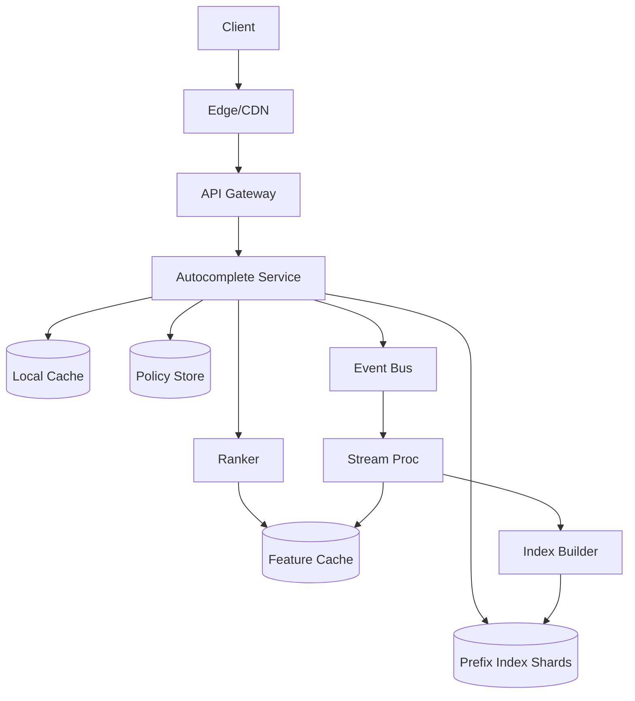
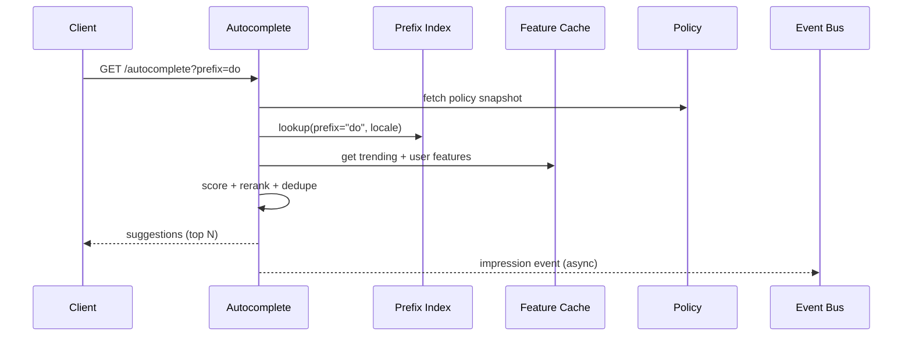

## Overview

Search autocomplete (typeahead) sits on the critical path of discovery: every keystroke can trigger a request, and results must feel instantaneous while staying relevant. The challenge is balancing **very low latency (p99 < 100ms)** with **high QPS**, **high-cardinality prefixes**, and **ranking quality** that blends prefix matching, personalization, and fast-changing trends.

The key insight is to split the problem into two stages: **candidate generation** (fast, deterministic prefix lookup from an in-memory index) and **ranking** (lightweight scoring using cached personalization + trending features). Most requests should be served from **hot prefix caches** and **local in-process indices** to avoid network hops, while offline + streaming pipelines continuously refresh indexes and features without impacting serving latency.

## Requirements

### Functional Requirements
- Provide suggestions for a typed prefix across multiple entity types (e.g., queries, users, hashtags, topics).
- Support prefix matching with typo-tolerance optional (can be phased in) and language/locale awareness.
- Personalize suggestions using user context (history, follows, recency, session intent).
- Boost trending suggestions that change quickly (minutes) without destabilizing relevance.
- Return results within limits (e.g., top 10) with deduping and stable ordering across keystrokes.
- Enforce privacy and policy rules (blocked users, muted topics, restricted content).
- Log impressions/accepts/clicks for analytics, quality, and abuse detection.
- Provide graceful degradation when personalization/trending signals are unavailable.

### Non-Functional Requirements
- **Scale**: 50M DAU, 5M peak concurrent sessions, peak 200K QPS (global) for autocomplete; write/log ingest 5–10x higher (impressions).
- **Latency**: p50 < 30ms, p95 < 60ms, p99 < 100ms (server-side), payload < 20KB typical.
- **Availability**: 99.99% for serving path (autocomplete API).
- **Consistency**: Eventual for trending + personalization features (seconds–minutes); strong for policy/privacy enforcement (latest blocklist).
- **Durability**: No data loss for logs beyond 5 minutes (RPO ≤ 5 min); suggestion serving can tolerate stale indexes for up to ~15 minutes.

### Constraints & Assumptions
- Team can operate Kafka + stream processing + a search/indexing tier.
- Multi-region active-active serving; data pipelines can be active-passive if needed.
- PII must be protected; avoid storing raw queries tied to user identity beyond retention policies.
- Budget favors commodity instances and horizontal scaling; avoid per-request heavy ML inference.

## High-Level Architecture



Serving is optimized for the hot path: the Autocomplete Service first hits **L1 local cache**, then does **prefix candidate generation** against in-memory/sharded prefix indices, applies **policy filters**, and calls a **lightweight ranker** that pulls trending/personalization features from a low-latency feature cache. Logging is asynchronous via an event bus to keep tail latency low.

Index freshness and trends are maintained out-of-band: events flow through stream processing to update **trending aggregates** and trigger **incremental index builds**. This avoids expensive writes on the serving path and allows fast, continuous refreshes.

## Component Deep-Dive

### Autocomplete Service

**Responsibility**: Handle per-keystroke requests, orchestrate caching, candidate lookup, filtering, ranking, and response shaping.

**Key Design Decisions**:
- Use **two-stage retrieval** (candidates then rank) to keep serving deterministic and fast.
- Keep a **local in-process cache** keyed by `(prefix, locale, anon/personalized segment)` to reduce network calls.

**Technology Choice**: Go/Java for low GC latency; Envoy at edge; gRPC internal, REST external.

**Scaling Strategy**: Stateless horizontal scaling behind L7 LB; consistent hashing to route to the same index shard for a prefix; autoscale on QPS and p99.

### Prefix Index Shards

**Responsibility**: Fast prefix matching returning top-K candidates per prefix and entity type.

**Key Design Decisions**:
- Store a **compressed prefix structure** per shard (FST/DAWG) with top-K lists per node (or weighted edges).
- Partition by **prefix hash of first N bytes** (e.g., N=2–3) to balance load while keeping lookups O(length(prefix)).

**Technology Choice**: In-memory FST (Lucene-style) or custom trie backed by mmap/rocksdb; shard as a service (or embedded in Autocomplete Service via sidecar) depending on ops maturity.

**Scaling Strategy**: Add shards to redistribute prefixes; replicate shards (2–3 replicas/region) for availability; warm standby in each AZ.

### Ranker

**Responsibility**: Score and order candidates using personalization, trending boosts, and business rules.

**Key Design Decisions**:
- Prefer a **fast linear/GBDT model** with precomputed features; avoid per-request deep models.
- Enforce **rule-based guardrails** (e.g., policy, diversity, entity-type caps) after scoring.

**Technology Choice**: Lightweight scoring library embedded in service; model served as versioned artifact (S3/GCS) with hot reload.

**Scaling Strategy**: Co-locate with Autocomplete Service to avoid RPC; CPU-bound scaling with request batching disabled (keystroke latency).

### Feature Cache (Trending + Personalization)

**Responsibility**: Provide low-latency feature reads (counts, decay scores, user vectors, recent intents).

**Key Design Decisions**:
- Use **time-decayed counters** for trends (e.g., 5m/1h windows) and **bounded user history** for personalization.
- Store only **derived features**, not raw events, to reduce PII exposure and latency.

**Technology Choice**: Redis Cluster / KeyDB for hot features; optional in-memory L2 (e.g., caffeine) per pod.

**Scaling Strategy**: Partition by key hash; TTL-based eviction; write-heavy updates via stream processors.

### Streaming + Index Builder

**Responsibility**: Consume events, compute trends/features, and build/refresh prefix indexes.

**Key Design Decisions**:
- Separate **real-time trending** (seconds) from **index rebuild** (minutes) so serving can boost trends even if index lags.
- Use **incremental builds** and atomic shard swaps to avoid partial/dirty reads.

**Technology Choice**: Kafka + Flink/Kafka Streams; index artifacts stored in object storage; deployment via shard “pull + swap”.

**Scaling Strategy**: Scale consumers by partition count; backpressure monitoring; replayable pipelines for recovery.

## Data Model

### Storage Schema

**Suggestion Candidate (conceptual)**
- `candidate_id` (string, stable)
- `type` (enum: QUERY|USER|HASHTAG|TOPIC)
- `display_text` (string)
- `normalized_text` (string)
- `locale` (string)
- `base_weight` (float; offline relevance)
- `entity_ref` (string; e.g., user_id)
- `updated_at` (timestamp)

**Prefix Index Node Payload (per shard, per locale)**
- `prefix` (implicit via traversal)
- `topK` (array of `{candidate_id, weight}` size K=50)
- Optional: `type_topK` (per entity type lists)

**Trending Feature Keys (Redis)**
- Key: `trend:{locale}:{candidate_id}:{window}` → value: `{count, decay_score, last_updated}`
- TTL: e.g., 2h

**User Personalization Keys (Redis/Feature Store)**
- Key: `user:{user_id}:recent_queries` → list (bounded, e.g., 50)
- Key: `user:{user_id}:affinity:{type}` → map candidate/category → score
- TTL/retention: e.g., 30d (policy-dependent)

**Event Log (Kafka topics)**
- `autocomplete_impression` (request_id, user_id?, prefix, candidates_shown, ts, locale)
- `autocomplete_accept` (request_id, candidate_id, ts)
- `search_submit` (query, ts, user_id?)
- `content_trend_signal` (entity_id, action, ts)

### Data Flow



## API Design

### Autocomplete
`GET /v1/autocomplete?prefix={string}&limit={int}&locale={string}&types={csv}&session_id={string}`

**Response (200)**
```json
{
  "request_id": "uuid",
  "prefix": "do",
  "suggestions": [
    {
      "candidate_id": "q:donald-trump",
      "type": "QUERY",
      "text": "donald trump",
      "score": 0.87,
      "source": ["prefix", "trend", "personal"]
    }
  ],
  "ttl_ms": 200
}
```

**Errors**
- `400` invalid prefix/limit/locale
- `401/403` auth/policy blocked
- `429` rate limited
- `503` overloaded (with fallback advice to client: increase debounce)

**Idempotency**
- Read-only endpoint; side effects are logging. Use `request_id` generated server-side; client may pass `X-Request-Id` to dedupe impression events.

### Accept/Click (optional explicit signal)
`POST /v1/autocomplete/accept`

**Request**
```json
{ "request_id": "uuid", "candidate_id": "q:donald-trump", "session_id": "..." }
```

**Response**
- `204 No Content`

## Scaling & Performance

### Bottleneck Analysis
- **Hot prefixes** (e.g., “a”, “s”) cause shard hotspots → mitigate with prefix-length gating (don’t serve <2 chars), request coalescing, and shard replication with adaptive routing.
- **Feature cache latency** can dominate p99 → use local L1 feature cache, timeouts (e.g., 10ms budget), and degrade to non-personalized ranking.
- **Index size / memory pressure** → compress with FST, store only top-K per node, and split by locale/type.

### Horizontal Scaling
- **Edge/Gateway**: scale stateless; enable HTTP/2; enforce debounce hints via headers.
- **Autocomplete Service**: scale on CPU and p99; use consistent hashing on `(locale, prefix_bucket)`.
- **Index Shards**: partition by `(locale, bucket(prefix[0..N]))`; replicate each shard 2–3x; rebalance with shard map service.
- **Stream Processing**: scale by Kafka partitions; isolate heavy jobs (index build) from low-latency trend updates.

### Caching Strategy
- **Client-side**: cache last prefix results for ~200ms; reuse for incremental typing when safe.
- **Edge/CDN**: cache only **anonymous** results for popular prefixes with short TTL (1–5s); bypass for personalized requests.
- **Service L1**: in-memory cache for `(prefix, locale, anon/personal_segment)` TTL 100–300ms; negative-cache empty results briefly.
- **Feature cache**: Redis with TTL; local read-through L1 (5–30s) for stable user features; trending uses shorter TTL (1–10s).

Cache invalidation is mostly TTL-based; index swaps are versioned (e.g., `shard_version`) so cached entries include version and are dropped on mismatch.

## Trade-offs & Alternatives

### Key Trade-offs Made
- **In-memory prefix index** chosen over querying a full search engine per keystroke: sacrifices flexibility (complex matching) for predictable latency and cost.
- **Eventual consistency** for trends/personalization: sacrifices immediate correctness for availability and speed; mitigated by fast streaming updates.
- **Lightweight ranking** embedded in service: sacrifices model complexity for tail-latency guarantees and operational simplicity.

### Alternative Approaches
- **Elasticsearch/OpenSearch completion suggester**: simpler initially, but can struggle with high QPS/p99 under heavy personalization and multi-signal ranking without extensive caching.
- **Full search per keystroke (BM25 + rescoring)**: best relevance flexibility, but expensive and typically violates p99 < 100ms at scale.
- **Client-only autocomplete** (downloaded dictionaries): great latency, but weak personalization/trending freshness and hard to enforce policy centrally.

## Failure Modes & Mitigations

### Failure Scenarios
- **Scenario**: Feature cache (Redis) latency spike/outage  
  **Impact**: Personalization/trending missing; relevance degrades  
  **Detection**: Redis p99, timeout rate, fallback rate metrics  
  **Mitigation**: Tight timeouts (e.g., 10ms), local stale cache, degrade to base weights, circuit breaker

- **Scenario**: Index shard unavailable  
  **Impact**: Partial/no suggestions for some prefixes/locales  
  **Detection**: shard error rate, missing-shard alarms  
  **Mitigation**: shard replication + health-based routing; fallback to secondary shard replica; last-known-good shard snapshot

- **Scenario**: Kafka backlog / stream processor down  
  **Impact**: Trends stale; index updates delayed  
  **Detection**: consumer lag, processing latency SLOs  
  **Mitigation**: scale consumers, prioritize trend job, replay from Kafka, serve with stale-but-valid artifacts

- **Scenario**: Hot prefix traffic surge (e.g., breaking news)  
  **Impact**: p99 breach, overload  
  **Detection**: per-prefix QPS heatmap, p99 by shard  
  **Mitigation**: dynamic edge caching for anonymous, prefix-length gating, request coalescing, autoscale, rate-limit abusive clients

- **Scenario**: Policy store inconsistency  
  **Impact**: Serving restricted suggestions (high severity)  
  **Detection**: audit sampling, policy mismatch alerts  
  **Mitigation**: strong consistency for blocklists, frequent snapshot refresh, deny-by-default on uncertainty for sensitive entities

### Disaster Recovery
- **RTO/RPO**: RTO 15 minutes (serving), RPO 5 minutes (logs/features).
- **Backup strategy**: Daily snapshots of index artifacts + feature schema configs; Kafka retained 3–7 days for replay.
- **Failover procedures**: Multi-region active-active for serving; shard map and artifacts stored in cross-region replicated object store; DNS/traffic manager failover with automated health checks.

## Operational Considerations

### Monitoring & Alerting
- Serving: QPS, p50/p95/p99 latency, error rate, timeout rate, cache hit ratios (L1/L2), empty-result rate.
- Ranking quality: accept-rate, reformulation rate, time-to-search, diversity metrics, per-entity-type exposure.
- Pipelines: Kafka lag, stream job latency, index build duration, artifact publish failures.
- Alerts: p99 > 100ms for 5m, error rate > 1% for 5m, Redis timeouts > 0.5%, shard unavailability, Kafka lag thresholds.

### Deployment Strategy
- **Canary** Autocomplete Service + model versions (1–5% traffic), monitor p99 and accept-rate deltas.
- **Shadow ranking**: compute new ranker scores in parallel (no user impact) to validate quality.
- **Index rollout**: publish versioned artifacts; shard pulls and swaps atomically; rollback by pinning previous version.
- Rollback: immediate via config flip (model/version/shard map); circuit breakers to disable personalization/trends quickly.

## References & Further Reading
- Lucene suggesters and Finite State Transducers (FST) concepts: https://lucene.apache.org/core/
- Elasticsearch/OpenSearch completion suggester: https://www.elastic.co/guide/en/elasticsearch/reference/current/search-suggesters.html
- “The Tail at Scale” (latency tail importance): https://research.google/pubs/pub40801/
- Kafka + stream processing patterns (exactly-once, windowed aggregates): https://kafka.apache.org/documentation/
- Practical typeahead discussions (prefix tries, caching, ranking): study implementations in large consumer apps (Twitter/X search suggestions, Google autocomplete behavior, etc.)