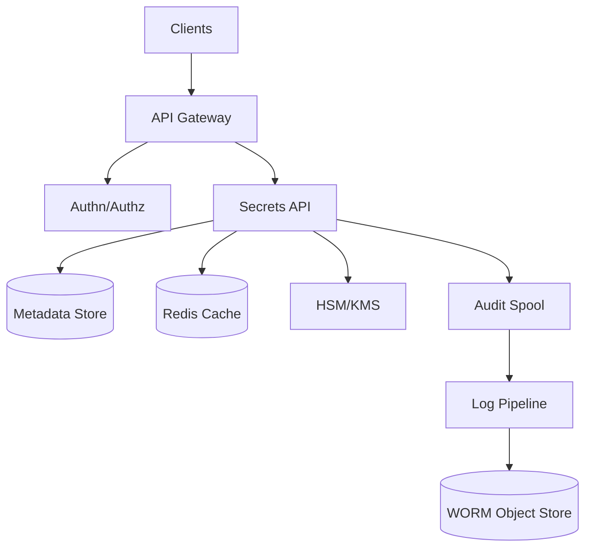
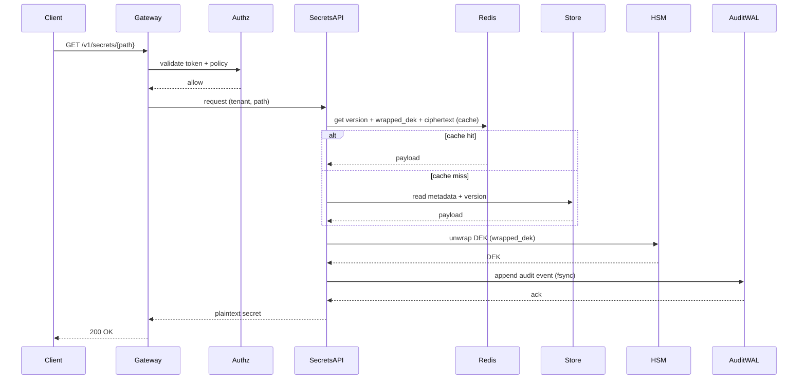

## Overview

A secrets management service (Vault-like) provides a centralized way to store, access, rotate, and audit sensitive material (API keys, DB credentials, certificates, encryption keys). The hard parts are not CRUD APIs—they’re enforcing least privilege at scale, minimizing blast radius under compromise, supporting safe rotation without downtime, and producing tamper-evident audit trails that satisfy compliance.

This design uses envelope encryption with HSM-backed key encryption keys (KEKs), strongly consistent metadata storage for correctness (versions, leases, policies), and an append-only, cryptographically verifiable audit pipeline. It also supports both static secrets (stored values) and dynamic secrets (issued on-demand with leases) to enable rotation and revocation as first-class workflows.

## Requirements

### Functional Requirements
- Store and retrieve versioned secrets with fine-grained access control (path/namespace, actions, conditions).
- Support secret rotation: scheduled rotation, on-demand rotation, and safe rollout (multiple active versions, grace periods).
- Provide dynamic secrets (e.g., database credentials) with leases, renew, and revoke.
- Integrate with HSM for KEK storage/operations (wrap/unwrap, rotate, key attestation where supported).
- Offer a “transit encryption” API: encrypt/decrypt/sign/verify without exposing keys to clients.
- Produce immutable audit logs for all access and administrative actions with query and export capabilities.
- Support multiple authentication methods (OIDC/SAML, Kubernetes, cloud IAM, mTLS) and short-lived tokens.
- Multi-tenant isolation: namespaces, quotas, and per-tenant cryptographic separation.

### Non-Functional Requirements
- **Scale**:
  - 10K tenants, 200K identities (human + workload)
  - Peak 50K QPS reads, 2K QPS writes/rotations
  - Audit volume: 60K events/sec peak, 5–10 TB/day compressed
- **Latency**:
  - Secret read: P50 15ms, P99 80ms (in-region)
  - Secret write/rotate: P50 40ms, P99 200ms
  - Token validation: P99 10ms (local verification) / 30ms (introspection fallback)
- **Availability**: 99.99% for read path; 99.9% for administrative/audit query UI.
- **Consistency**:
  - Strong for secret version/lease state, policy changes, token revocation lists.
  - Eventual for audit indexing/search (but audit *durability* is immediate).
- **Durability**:
  - Secrets metadata + ciphertext: RPO ≤ 5 minutes, RTO ≤ 30 minutes (multi-region DR).
  - Audit logs: no loss tolerated (0 events); accept delayed search/index.

### Constraints & Assumptions
- Operates in a private network with mTLS between clients and service; public internet access via an L7 gateway.
- HSM is available (cloud HSM or on-prem) with defined throughput limits; budget supports HA HSM cluster.
- Compliance targets: SOC2 + audit immutability requirements; optional PCI/HIPAA depending on tenant.
- Team size ~6–10 engineers; prioritize operational simplicity over exotic cryptography.

## High-Level Architecture

The system separates concerns: the Secrets API handles versioning, leases, and policy enforcement; the HSM/KMS provides KEK operations for envelope encryption; the metadata store provides strongly consistent state; and audit logging is durable and tamper-evident without coupling read latency to downstream indexing/search.

A key decision is to treat audit as a first-class durability requirement: every request emits a signed, append-only audit record persisted locally (fsync) before responding, then shipped asynchronously to an immutable object store (WORM) and optionally indexed for search. This preserves performance while meeting strict audit guarantees.

## Component Deep-Dive

### API Gateway
**Responsibility**: Front-door routing, rate limiting, WAF, mTLS termination (or passthrough), request shaping.

**Key Design Decisions**:
- Enforce per-tenant quotas and burst limits at the edge to protect core services.
- Require mTLS for workload identities; support OIDC for humans with step-up auth for privileged operations.

**Technology Choice**: Envoy / NGINX + OPA sidecar (optional) or cloud API Gateway + mTLS.

**Scaling Strategy**: Stateless horizontal scaling; use consistent hashing only if doing sticky sessions for local audit spools (optional).

### Authn/Authz Service
**Responsibility**: Authenticate identities, mint short-lived tokens, evaluate policies (RBAC/ABAC), manage revocation.

**Key Design Decisions**:
- Prefer locally verifiable tokens (JWT/PASETO) for read-path latency; keep “deny lists” for revocations.
- Policy model is path-based with capabilities (`read`, `write`, `list`, `rotate`, `admin`) plus conditions (namespace, identity claims, time, IP, device posture).

**Technology Choice**: OIDC (Keycloak/Okta), Kubernetes auth, AWS/GCP IAM auth; policy evaluation via OPA/Rego or in-service engine.

**Scaling Strategy**: Stateless; cache policy decisions for short TTL (e.g., 30s) keyed by token+path+action; maintain revocation set in Redis.

### Secrets API (Core)
**Responsibility**: CRUD for secrets, versioning, envelope encryption, rotation workflows, dynamic secrets/leases, transit crypto APIs.

**Key Design Decisions**:
- Store only ciphertext + wrapped DEKs; plaintext never persisted and is zeroized in memory after use.
- Separate “static secrets” from “dynamic secrets” engines (DB, cloud creds), each with its own rotation/revocation logic and lease state.

**Technology Choice**: Go/Rust service; AES-256-GCM for data encryption; HKDF for key derivations; gRPC internal + REST external.

**Scaling Strategy**: Stateless; read-heavy path uses Redis for hot metadata and wrapped DEKs; backpressure based on HSM latency and store quorum health.

### Metadata Store (Strong Consistency)
**Responsibility**: Source of truth for secret metadata, versions, leases, policies (or pointers), and cluster coordination.

**Key Design Decisions**:
- Use a consensus-backed KV (Raft/etcd) to guarantee correct version ordering and lease state transitions.
- Use compare-and-swap (CAS) for writes/rotations to prevent lost updates and to enforce idempotency keys.

**Technology Choice**: etcd or integrated Raft storage (Vault-like); encryption at rest enabled; snapshots to object store.

**Scaling Strategy**: Scale by sharding namespaces across clusters; within a cluster, keep write QPS within quorum limits (typically <5–10K ops/sec).

### Audit Spool + Log Pipeline
**Responsibility**: Durable, tamper-evident audit recording; asynchronous shipping, indexing, and retention enforcement.

**Key Design Decisions**:
- Write audit synchronously to a local append-only log with fsync before returning success; ship asynchronously.
- Make audit tamper-evident via hash chaining (Merkle or linear chain) and periodic signed checkpoints stored in WORM.

**Technology Choice**: Local WAL + Kafka/Pulsar for transport; WORM S3/GCS with Object Lock; optional OpenSearch for query.

**Scaling Strategy**: Partition by tenant and time; isolate indexing from durability path; throttle query workloads separately.

## Data Model

### Storage Schema

**Secrets (metadata)**
- `tenant_id` (pk part)
- `path` (pk part)
- `secret_type` (`static`, `dynamic`, `transit_key`)
- `created_at`, `updated_at`
- `current_version` (int)
- `encryption_profile_id` (which KEK/HSM key to use)
- `labels` (map)
- `deleted_at` (nullable, for soft delete)

**SecretVersions**
- `tenant_id` (pk part)
- `path` (pk part)
- `version` (pk part)
- `ciphertext` (bytes)
- `wrapped_dek` (bytes)  // DEK wrapped by KEK in HSM
- `dek_alg` (e.g., `AES256_GCM`)
- `nonce` (bytes)
- `aad` (bytes)          // includes tenant_id, path, version, metadata hash
- `created_at`
- `state` (`active`, `deprecated`, `revoked`)
- `not_before`, `not_after` (for rotation windows)

**Leases (dynamic secrets)**
- `lease_id` (pk)
- `tenant_id`, `path`
- `issued_at`, `expires_at`
- `renewable` (bool), `max_ttl`
- `subject` (identity)
- `backend_ref` (e.g., DB role/user id)
- `state` (`active`, `revoked`, `expired`)

**IdempotencyKeys**
- `tenant_id`, `key` (pk)
- `request_hash`
- `response_blob`
- `expires_at`

**AuditEvents (durability path is append-only WAL; this is optional indexed view)**
- `tenant_id`, `ts_bucket`, `event_id`
- `ts`, `actor`, `action`, `resource`
- `decision` (`allow|deny`)
- `source_ip`, `user_agent`
- `request_id`, `status_code`, `latency_ms`
- `prev_hash`, `event_hash` (for verification)

### Data Flow

**Secret Read (static)**

**Rotation (static)**
- Create new version `v+1`, write ciphertext + wrapped DEK with CAS on `current_version`.
- Mark `v` as `deprecated` with overlap window; clients can request `latest` or pinned versions.
- After overlap, optionally revoke/disable `v` (or retain for rollback per policy).

## API Design

### Auth
- `POST /v1/auth/oidc/login`
  - Req: `{ "code": "...", "redirect_uri": "..." }`
  - Resp: `{ "token": "...", "expires_in": 900, "renewable": true }`
- `POST /v1/auth/k8s/login`
  - Req: `{ "jwt": "...", "role": "..." }`
  - Resp: token as above
- Errors: `401 invalid_credentials`, `403 policy_denied`, `429 rate_limited`

**Idempotency**: Auth endpoints generally non-idempotent; token minting is safe to retry but returns new tokens.

### Secrets (static)
- `PUT /v1/secrets/{path}`
  - Headers: `Idempotency-Key: <uuid>`
  - Req: `{ "value": "<base64|string>", "metadata": { "labels": {...} } }`
  - Resp: `{ "version": 12, "created_at": "...", "state": "active" }`
  - Errors: `409 version_conflict`, `413 too_large`, `400 invalid_path`
- `GET /v1/secrets/{path}?version=latest|<int>`
  - Resp: `{ "value": "...", "version": 12 }`
  - Errors: `404 not_found`, `410 gone` (revoked)
- `POST /v1/secrets/{path}:rotate`
  - Headers: `Idempotency-Key`
  - Req: `{ "strategy": "new_value|rekey_only", "overlap_seconds": 3600 }`
  - Resp: `{ "new_version": 13, "previous_version": 12 }`

**Error handling approach**
- Consistent error envelope: `{ "error": { "code": "...", "message": "...", "request_id": "..." } }`
- Map upstream failures explicitly: `503 hsm_unavailable`, `503 quorum_unavailable`, `500 audit_write_failed` (fail-closed).

### Dynamic Secrets (leases)
- `POST /v1/dynamic/{engine}/{role}:issue`
  - Resp: `{ "lease_id": "...", "expires_at": "...", "credentials": {...} }`
- `POST /v1/leases/{lease_id}:renew`
- `POST /v1/leases/{lease_id}:revoke`

**Idempotency**
- `issue` supports `Idempotency-Key` to avoid double-provisioning accounts.
- `revoke` is idempotent: repeated calls return success if already revoked.

### Transit Crypto
- `POST /v1/transit/{key}:encrypt`
  - Req: `{ "plaintext": "<base64>", "aad": "<base64>" }`
  - Resp: `{ "ciphertext": "vault:v3:..." }`
- `POST /v1/transit/{key}:decrypt`
- `POST /v1/transit/{key}:sign` / `:verify`

## Scaling & Performance

### Bottleneck Analysis
- **HSM unwrap throughput**: Unwrap per read can cap QPS.
  - Mitigation: cache unwrapped DEKs in-memory with very short TTL (e.g., 1–5s) and strict size limits; batch unwrap where supported; use envelope rewrap to keep KEK stable.
- **Consensus store write limits**: rotations/leases generate writes.
  - Mitigation: shard tenants across clusters; minimize write amplification (store ciphertext blobs separately if needed); use leases with coarse renewal intervals.
- **Audit durability**: fsync per request increases tail latency.
  - Mitigation: group commit (fsync every N ms with bounded queue), but only if compliance allows; otherwise provision fast local NVMe and keep WAL small.

### Horizontal Scaling
- **Gateway/Authz**: stateless replicas behind L7.
- **Secrets API**: stateless replicas; scale on CPU + HSM latency; enforce backpressure.
- **Metadata store**: fixed-size quorum per cluster (3–5 nodes); scale by adding clusters and routing by tenant.
- **Audit pipeline**: partition by tenant/time; independent scaling for transport vs indexing.

**Partitioning strategy**
- Route by `tenant_id` to a home cluster (consistent hashing or directory service).
- Within tenant, secrets partition by `path` only for caching; correctness remains in the store.

### Caching Strategy
- **Redis**:
  - Cache secret metadata + latest version pointers (TTL 30–120s).
  - Cache ciphertext + wrapped DEK for hot secrets (TTL 30–300s).
- **In-process**:
  - Cache policy decision results (TTL 5–30s).
  - Cache unwrapped DEKs (TTL 1–5s) with strict eviction; disable for highest-security tenants.
- **Invalidation**
  - On write/rotate: publish invalidation message (Redis pub/sub or Kafka topic) keyed by `(tenant_id,path)`; fall back to TTL expiry.

## Trade-offs & Alternatives

### Key Trade-offs Made
- **Strongly consistent metadata (Raft/etcd)** chosen over eventual DB writes.
  - Sacrificed: higher write latency and operational constraints (quorum management).
  - Why: prevents version/lease correctness bugs that are catastrophic in rotation/revocation.
- **Audit fail-closed (must persist audit WAL)** chosen over best-effort logging.
  - Sacrificed: availability during disk pressure or WAL corruption scenarios.
  - Why: compliance and forensic integrity; otherwise the system becomes an exfiltration tool with no trace.
- **HSM for KEK operations** chosen over software-only KEKs.
  - Sacrificed: cost, latency, vendor operational dependency.
  - Why: reduces key-extraction risk and supports regulated environments.

### Alternative Approaches
- **Cloud KMS only (no dedicated HSM)**: simpler ops, but less control/attestation; may not satisfy strict tenants or on-prem.
- **Database-backed metadata (Postgres) with serializable transactions**: good ergonomics and queryability, but harder to guarantee HA under partitions compared to dedicated consensus KV; still viable for smaller scale.
- **Client-side envelope encryption**: clients manage DEKs and only store ciphertext; reduces server exposure but complicates rotation, access control, and audit completeness.

## Failure Modes & Mitigations

### Failure Scenarios
- **Scenario**: HSM unavailable or high latency  
  **Impact**: reads/writes fail or tail latency spikes  
  **Detection**: HSM error rates, unwrap latency P99, circuit breaker open  
  **Mitigation**: multi-HSM endpoints, per-tenant degradation policy (deny vs allow cached), automatic failover, capacity alarms, emergency “read-only cached” mode only for explicitly opted-in tenants.

- **Scenario**: Metadata store loses quorum  
  **Impact**: no writes; possibly no reads if strict linearizable reads required  
  **Detection**: quorum health checks, leader election churn  
  **Mitigation**: 3–5 node quorum across AZs, strict SLO-based autoscaling limits, snapshot restore runbooks, read-only mode using last-known metadata (explicitly flagged).

- **Scenario**: Audit WAL disk full or corrupted  
  **Impact**: fail-closed blocks API responses  
  **Detection**: disk usage, WAL append failures, checksum mismatch  
  **Mitigation**: dedicated fast volume, disk quotas, WAL rotation/compaction, dual-spool option (two local disks), emergency procedure to divert to alternate node while preserving chain-of-custody.

- **Scenario**: Compromised service node  
  **Impact**: potential secret exposure in memory; token abuse  
  **Detection**: EDR alerts, anomalous audit patterns, integrity checks, node attestation (if available)  
  **Mitigation**: mTLS + least privilege, short-lived tokens, memory hardening, disable DEK caching for high-risk tenants, rapid key rotation/rewrap, node isolation and credential revocation.

### Disaster Recovery
- **RTO/RPO**: RTO 30 minutes, RPO 5 minutes (secrets); audit RPO 0 (durable local + replicated object store).
- **Backup strategy**:
  - Metadata store snapshots every 5 minutes to object store (cross-region replicated).
  - Audit checkpoints and WAL segments shipped continuously to WORM storage with retention policies.
- **Failover procedures**:
  - Warm-standby region with replicated snapshots; promote new quorum; update tenant routing directory.
  - Validate audit chain continuity via last checkpoint hash.

## Operational Considerations

### Monitoring & Alerting
- Key metrics:
  - `read_qps`, `write_qps`, `p99_latency_ms` by endpoint/tenant tier
  - HSM: `unwrap_p99_ms`, `error_rate`, `queue_depth`
  - Store: `leader_changes`, `commit_latency_p99`, `quorum_health`
  - Audit: `wal_fsync_p99`, `ship_lag_seconds`, `dropped_events` (must be zero), `hash_chain_gap`
  - Security: `deny_rate`, `token_revocations`, `anomalous_access_score`
- Alert thresholds:
  - HSM error rate > 0.5% for 5m
  - Store quorum unhealthy > 30s
  - Audit ship lag > 300s (warning), > 900s (critical)
  - Any audit gap/checkpoint mismatch (critical)

### Deployment Strategy
- Blue/green or canary with per-tenant routing; keep backward-compatible storage migrations.
- Rollout order: gateway → authz → secrets API → audit/indexers.
- Rollback: versioned schema with feature flags; keep write paths compatible; never roll back cryptographic formats without dual-read support.

## References & Further Reading
- HashiCorp Vault architecture and audit devices: https://developer.hashicorp.com/vault/docs
- Envelope encryption overview (Google Tink / KMS patterns): https://cloud.google.com/kms/docs/envelope-encryption
- NIST SP 800-57 (Key management guidance): https://csrc.nist.gov/publications/detail/sp/800-57-part-1/rev-5/final
- AWS S3 Object Lock (WORM retention): https://docs.aws.amazon.com/AmazonS3/latest/userguide/object-lock.html
- Certificate transparency / append-only log concepts (for audit verifiability): https://certificate.transparency.dev/