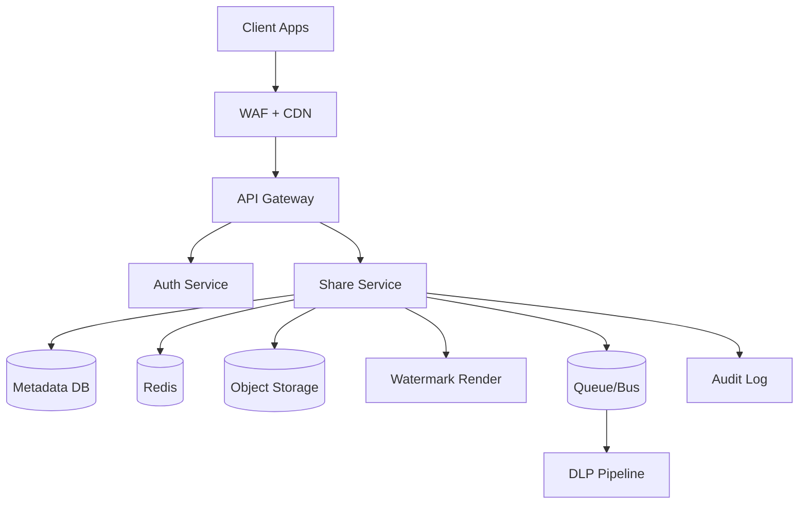
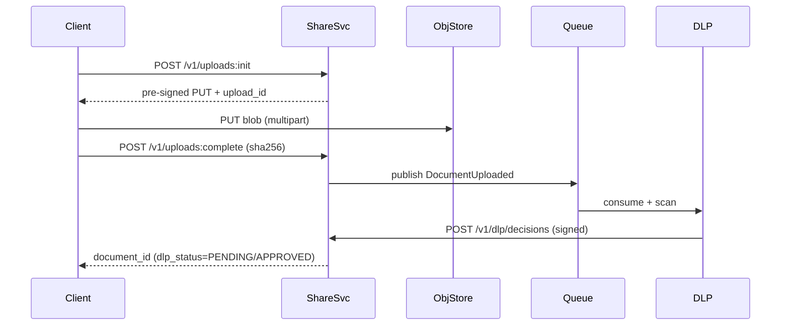

## Overview

Secure file sharing for sensitive documents is deceptively hard because the “happy path” (upload → share link → download) is easy, while the real requirements live in abuse prevention, data leakage controls, and provable auditing. The system must support expiring links that can be revoked instantly, enforce fine-grained access policies, scan content for sensitive data (DLP) before release, and apply dynamic watermarks that tie a leaked copy back to a user and time.

The key insight is to separate *immutable blob storage* from *strongly-consistent control-plane metadata* (permissions, link state, scan status), and to treat downloads as a policy decision + just-in-time derivation (watermarked rendition) rather than direct object access. This creates a clean place to enforce security checks, rate limits, DLP gating, and audit logging—without relying on clients behaving correctly.

## Requirements

### Functional Requirements
- Upload documents (PDF, Office, images) via resumable upload; validate type/size and compute checksums.
- Create share links with expiration, optional password/OTP, and optional recipient allowlist (email/domain).
- Enforce DLP scanning and policy actions (allow, redact, quarantine, block) before any external sharing.
- Download shared documents with dynamic watermarking (viewer identity, timestamp, link ID) applied per request.
- Support link lifecycle: view stats, revoke immediately, extend/shorten expiration, rotate link token.
- Maintain immutable audit logs for admin and compliance (who shared what, who accessed what, policy decisions).
- Admin controls: organization policies (max TTL, external sharing disable, watermark templates, DLP rules).
- Abuse controls: rate limits, token brute-force detection, anomaly detection (impossible travel, high-volume exfiltration).

### Non-Functional Requirements
- **Scale**: 5M uploads/day, avg 5 MB (≈25 TB/day ingest); 20M downloads/day; peak 15K download QPS, 5K upload QPS.
- **Latency**:
  - Create link P99: 150 ms
  - Download authorization P99: 80 ms
  - Watermarked download TTFB P99: 400 ms (first page), full render may stream.
- **Availability**: 99.99% for link auth + audit; 99.9% for watermark rendering pipeline.
- **Consistency**:
  - Strong: link revoke/expire checks, permissions, policy decisions.
  - Eventual: analytics counters, asynchronous DLP scan completion.
- **Durability**: 11 9s object durability (cloud object storage); control-plane metadata RPO ≤ 5 minutes.

### Constraints & Assumptions
- Multi-tenant SaaS with enterprise orgs; some customers require data residency (region pinning).
- Zero trust: treat share links as untrusted input; no implicit trust in client-reported identity.
- Team size ~6–10 engineers; prefer managed services (object store, queue, KMS) over bespoke infra.
- Compliance targets: SOC 2 Type II; optionally HIPAA/PCI depending on customer.

## High-Level Architecture



Clients upload blobs directly to object storage using short-lived pre-signed URLs, while the Share Service owns all metadata: document records, link tokens, access policies, and scan status. Every download request is authorized against strongly-consistent metadata, then either served as a dynamically watermarked rendition (recommended) or blocked/quarantined based on DLP policy.

DLP is an asynchronous pipeline that consumes upload events, extracts text/metadata, classifies sensitive content (PII/PHI/secrets), and writes a signed policy decision back to the metadata DB. This makes the system resilient (uploads don’t block on scanning) while still enforcing “no external access until approved” by gating downloads on scan status.

## Component Deep-Dive

### API Gateway + WAF

**Responsibility**: Edge termination, auth routing, rate limiting, request validation, bot protection.

**Key Design Decisions**:
- Enforce global and per-link rate limits at the edge (token brute force is an edge problem).
- Normalize logs/headers (request IDs) for end-to-end audit correlation.

**Technology Choice**: Managed API Gateway + WAF (AWS API Gateway + WAF / Cloudflare / GCP API Gateway).

**Scaling Strategy**: Fully managed; scale via edge PoPs; isolate tenants via API keys/org IDs and quotas.

### Share Service (Control Plane)

**Responsibility**: Document metadata, link creation/revocation, authorization, download orchestration, policy enforcement.

**Key Design Decisions**:
- Store share tokens only as hashes (treat as secrets); support token rotation without changing document.
- Make download a two-step decision: `authorize` (strong) → `issue_download` (short-lived, scoped).

**Technology Choice**: Stateless service (Go/Java/Kotlin) + Postgres for strong consistency; Redis for hot reads.

**Scaling Strategy**: Horizontal scale behind L7 LB; DB read replicas; partition large tables by org_id and time.

### Object Storage (Data Plane)

**Responsibility**: Durable blob storage for originals and optional cached renditions.

**Key Design Decisions**:
- Envelope encryption per object with KMS-managed keys; separate buckets per region/tenant class if needed.
- Store immutable originals; write derived watermarked renditions to a separate prefix with short TTL.

**Technology Choice**: S3/GCS/Azure Blob with versioning and lifecycle policies; KMS for key management.

**Scaling Strategy**: Object stores scale elastically; limit per-prefix hotspots; multipart upload for large files.

### DLP Pipeline

**Responsibility**: Scan uploads for sensitive data, malware, and policy violations; produce enforceable decisions.

**Key Design Decisions**:
- Asynchronous scan with strict gating: external sharing requires `scan_status=APPROVED`.
- Separate “classification facts” (what was found) from “policy decision” (what to do), enabling policy updates.

**Technology Choice**: Queue/stream (SQS/Kafka/PubSub) + worker fleet; optional vendor DLP (Google DLP, Microsoft Purview) and AV (ClamAV/vendor).

**Scaling Strategy**: Autoscale workers by queue lag; shard by org; prioritize “downloads pending approval” jobs.

### Watermark Render Service

**Responsibility**: Generate per-request watermarked renditions; stream output; optionally cache.

**Key Design Decisions**:
- Dynamic watermark derived from authenticated identity + link + timestamp (strong attribution).
- Render in a sandbox (seccomp/gVisor) to reduce risk from untrusted documents (PDF/Office parsing).

**Technology Choice**: Containerized renderer (e.g., PDFium/LibreOffice headless + image/PDF stamping) behind a job API; optional GPU not required.

**Scaling Strategy**: Stateless render nodes + work queue; cache popular renditions (same user+link+doc) for minutes.

## Data Model

### Storage Schema

**documents**
- `document_id` (UUID, PK)
- `org_id` (UUID, indexed)
- `owner_user_id` (UUID, indexed)
- `object_key` (string)
- `size_bytes` (bigint)
- `sha256` (bytes)
- `mime_type` (string)
- `created_at` (timestamp)
- `dlp_status` (enum: PENDING, APPROVED, QUARANTINED, BLOCKED)
- `dlp_decision_version` (int)
- `retention_policy` (jsonb)

**share_links**
- `link_id` (UUID, PK)
- `org_id` (UUID, indexed)
- `document_id` (UUID, indexed)
- `token_hash` (bytes, unique)
- `created_by` (UUID)
- `expires_at` (timestamp, indexed)
- `revoked_at` (timestamp, nullable)
- `require_auth` (bool)
- `password_hash` (bytes, nullable)
- `allowed_recipients` (jsonb, nullable)  // emails/domains
- `max_downloads` (int, nullable)
- `watermark_policy` (jsonb)
- `created_at` (timestamp)

**access_events** (append-only; also shipped to immutable log)
- `event_id` (UUID, PK)
- `org_id` (UUID, indexed)
- `link_id` (UUID, indexed)
- `document_id` (UUID, indexed)
- `actor_type` (enum: USER, ANON)
- `actor_id` (string) // user_id or hashed identifier
- `ip` (inet)
- `user_agent` (text)
- `action` (enum: LINK_CREATED, DOWNLOAD_AUTH, DOWNLOAD_SERVED, REVOKED, DLP_DECIDED)
- `result` (enum: ALLOW, DENY, ERROR)
- `created_at` (timestamp)

**dlp_findings**
- `document_id` (UUID, indexed)
- `finding_type` (string) // e.g., SSN, API_KEY
- `count` (int)
- `sample_hashes` (jsonb)
- `scanner_version` (string)
- `created_at` (timestamp)

### Data Flow



Download (gated + watermarked) is:
1) resolve token → validate TTL/revocation → enforce DLP status → authenticate (optional) → authorize → render/stream → audit.

## API Design

### Create Upload (resumable)
`POST /v1/uploads:init`
- Request: `{ "org_id": "...", "filename": "...", "mime_type": "...", "size_bytes": 12345 }`
- Response: `{ "upload_id": "...", "document_id": "...", "put_urls": ["..."], "expires_in": 900 }`
- Errors: `400` (invalid type/size), `401/403`, `429`, `500`.

`POST /v1/uploads:complete`
- Request: `{ "upload_id": "...", "sha256": "base64...", "parts": [...] }`
- Response: `{ "document_id": "...", "dlp_status": "PENDING" }`
- Idempotency: require `Idempotency-Key` header; same key returns same result.

### Create Share Link
`POST /v1/documents/{document_id}/share-links`
- Request:
  ```json
  {
    "expires_at": "2025-12-31T00:00:00Z",
    "require_auth": true,
    "allowed_recipients": ["alice@acme.com", "acme.com"],
    "password": null,
    "watermark_policy": { "mode": "DYNAMIC", "fields": ["email","timestamp","link_id"] }
  }
  ```
- Response: `{ "link_id": "...", "share_url": "https://.../s/{token}", "expires_at": "..." }`
- Errors: `409` if org policy forbids external sharing; `412` if DLP not approved and policy requires approval before sharing.

### Authorize + Download
`POST /v1/share-links/{token}/authorize`
- Request: `{ "otp": "...", "password": "...", "client_fingerprint": "..." }`
- Response: `{ "download_token": "...", "expires_in": 60 }`
- Notes: Token is short-lived, audience-bound, and rate-limited; deny on revoked/expired/max_downloads.

`GET /v1/downloads/{download_token}`
- Response: streamed file (watermarked); headers include `Content-Disposition`, `Cache-Control: no-store`.
- Errors: `403` (policy), `410` (expired), `423` (quarantined), `429`.

### Revoke / Rotate
`POST /v1/share-links/{link_id}:revoke` → `204` (strongly consistent)
`POST /v1/share-links/{link_id}:rotate` → returns new URL; old token immediately invalid.

### Error Handling & Idempotency
- Use structured errors: `{ "code": "LINK_EXPIRED", "message": "...", "request_id": "..." }`.
- Mutations require `Idempotency-Key`; store per org + key with TTL (24h) to dedupe retries.
- All auth decisions and denials emit `access_events`.

## Scaling & Performance

### Bottleneck Analysis
- **Watermark rendering CPU**: mitigate via streaming rendering, autoscaling renderers, short-lived caching for repeated downloads by same user/link, and limiting max pages for preview.
- **Metadata DB hot paths** (token resolution, revoke checks): mitigate via Redis cache with very short TTL (e.g., 5–30s) plus cache-busting on revoke via pub/sub invalidation.
- **DLP backlog**: mitigate via priority queues (documents with pending share/download), autoscale workers, and degrade by blocking external downloads until scan completes.

### Horizontal Scaling
- **Edge/Gateway**: scale at edge; enforce per-tenant quotas.
- **Share Service**: stateless replicas; shard by org_id at the app layer if needed.
- **DB**: partition `access_events` by time; read replicas for reporting; keep authorization queries on primary or strongly consistent read path.
- **Queue + workers**: scale consumers; isolate noisy tenants with per-tenant partitions/topics.
- **Renderer**: scale out worker pool; job timeouts; circuit breaker to fail closed (deny) if watermark is mandatory.

### Caching Strategy
- **Token → link metadata** in Redis (TTL 10–30s), keyed by `token_hash`; invalidate on revoke/rotate.
- **Authorization decisions** not cached broadly (security-sensitive); at most cache within request scope.
- **Watermarked renditions** optionally cached for minutes keyed by `(document_id, link_id, viewer_id, watermark_template_version)`; store encrypted; always `no-store` to clients.

## Trade-offs & Alternatives

### Key Trade-offs Made
- **Chosen**: async DLP with download gating. **Sacrificed**: immediate shareability after upload. **Why**: avoids blocking uploads while still preventing leakage.
- **Chosen**: dynamic watermarking at download time. **Sacrificed**: higher latency/compute cost. **Why**: strongest attribution; supports per-viewer watermark without storing many variants.
- **Chosen**: hashed opaque tokens + short-lived download tokens. **Sacrificed**: simplicity of “single URL downloads.” **Why**: reduces token replay window and enables stronger abuse controls.

### Alternative Approaches
- **Pre-generate watermarked copies per recipient**: simpler downloads, but storage explodes and revocation is harder (many derived objects).
- **Inline DLP before upload completion**: stronger immediate guarantees, but poor UX and fragile for large files; scanner becomes a critical path bottleneck.
- **CDN direct serving of originals**: great performance, but complicates dynamic watermarking and tight access control; higher leakage risk.

## Failure Modes & Mitigations

### Failure Scenarios
- **Scenario**: Redis down. **Impact**: higher DB load, slower auth. **Detection**: cache error rate/latency. **Mitigation**: fallback to DB; apply stricter rate limits; keep Redis optional.
- **Scenario**: DLP workers lag/backlog. **Impact**: documents stuck PENDING; external sharing blocked. **Detection**: queue lag, time-in-status. **Mitigation**: autoscale, priority queues, partial scanning (metadata-first), customer-visible status.
- **Scenario**: Renderer overload/timeouts. **Impact**: download failures. **Detection**: render queue depth, timeout rate. **Mitigation**: autoscale, backpressure (429), allow “view-only preview” if policy permits, or fail closed if watermark required.
- **Scenario**: KMS throttling. **Impact**: upload/download encryption failures. **Detection**: KMS latency/throttle metrics. **Mitigation**: envelope encryption with data keys cached briefly in-process; request batching; quota increases.
- **Scenario**: Token brute force / credential stuffing. **Impact**: unauthorized access attempts. **Detection**: WAF signals, high 403/410 rates, entropy checks. **Mitigation**: rate limits per IP/ASN, bot challenges, token length ≥128 bits, anomaly detection, optional OTP.

### Disaster Recovery
- **RTO/RPO**: RTO 30 minutes, RPO 5 minutes for metadata; object storage via cross-region replication.
- **Backup strategy**: DB PITR + daily snapshots; audit logs to immutable storage (WORM) with retention.
- **Failover procedures**: DNS/traffic manager to standby region; promote DB replica; re-point KMS and queues; verify policy enforcement before reopening downloads.

## Operational Considerations

### Monitoring & Alerting
- Key metrics: auth P99, download auth error rate, renderer queue depth, DLP lag, revoke propagation time, KMS latency, 4xx/5xx by endpoint.
- Alerts: revoke latency > 2s, DLP lag > 10m, renderer timeout rate > 1%, token brute-force spikes, audit pipeline ingestion failures.

### Deployment Strategy
- Canary releases for Share Service and Renderer; feature flags for watermark templates and policy enforcement changes.
- Backward-compatible DB migrations (expand/contract); automated rollback on SLO burn.
- Regular game days: revoke correctness, DLP gating validation, region failover drills.

## References & Further Reading

- OWASP ASVS (Application Security Verification Standard): https://owasp.org/www-project-application-security-verification-standard/
- AWS S3 Pre-Signed URLs (pattern for direct-to-object-store uploads): https://docs.aws.amazon.com/AmazonS3/latest/userguide/ShareObjectPreSignedURL.html
- Google Cloud DLP concepts (classification + findings): https://cloud.google.com/sensitive-data-protection/docs
- NIST SP 800-53 (security controls baseline): https://csrc.nist.gov/publications/detail/sp/800-53/rev-5/final
- Audit log immutability/WORM storage concepts (e.g., S3 Object Lock): https://docs.aws.amazon.com/AmazonS3/latest/userguide/object-lock.html