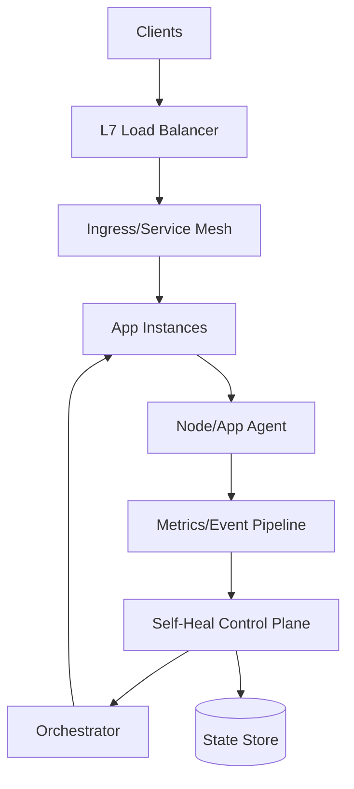
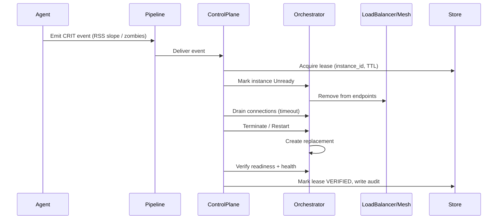

## Overview

Modern services fail in “soft” ways long before they crash: zombie processes accumulate, memory leaks slowly erode headroom, GC thrashes, file descriptors exhaust, or kernel resources degrade. These failure modes often evade simple liveness checks until latency spikes or nodes fall over—by then, you’re already dropping traffic or paging humans.

The core challenge is building a safe, automated control loop that (1) detects degradation early with high signal-to-noise, (2) decides the minimal effective remediation, and (3) replaces or recycles capacity while keeping traffic flowing. The key insight is to separate **detection** (fine-grained, local) from **orchestration** (global, rate-limited), and to make every remediation **traffic-aware** via draining, readiness gating, and surge capacity.

This design describes a production-grade self-healing system that integrates node/app agents, an SRE control plane, and an orchestrator (e.g., Kubernetes or an Auto Scaling Group) to recycle unhealthy instances with zero (or near-zero) user-visible impact.

## Requirements

### Functional Requirements
- Detect zombie processes (e.g., defunct children, unreaped processes) at host/container scope and attribute to owning service/workload.
- Detect memory leaks and memory pressure signals (RSS growth slope, OOM risk, GC/heap growth, cgroup pressure stalls) and classify severity.
- Trigger traffic-safe remediation actions: soft restart, process kill, pod/instance recycle, node drain, and quarantining.
- Ensure no traffic drop during recycling by enforcing readiness gates, connection draining, and graceful shutdown with configurable timeouts.
- Apply guardrails: per-service blast-radius limits, rate limiting, and “circuit breaker” to stop automation on anomalies.
- Provide auditability: record signals, decisions, actions, and outcomes for debugging and compliance.
- Support human override: pause automation globally/per-service, manual remediation triggers, and runbook links.
- Validate effectiveness via post-action verification (error rate/latency recovery, resource normalization) and roll back/ escalate if ineffective.

### Non-Functional Requirements
- **Scale**: 5,000 nodes / 50,000 pods; 2,000 services; peak 200K metrics samples/sec; 5K events/sec; remediation actions up to 50/min with guardrails.
- **Latency**:
  - Detection-to-decision: P50 5s, P99 30s (soft failures).
  - Drain initiation-to-fully-drained: P50 10s, P99 60s (depends on keep-alives/long polls).
  - Replacement readiness: P50 30s, P99 5m (cold start).
- **Availability**: Self-healing control plane 99.99%; service availability target remains 99.99% (automation must not reduce it).
- **Consistency**:
  - Strong consistency for “action leases” (to avoid double-remediation).
  - Eventual consistency acceptable for metrics aggregation and dashboards.
- **Durability**: No loss of remediation/audit records (RPO ~ 0 for actions); metrics can tolerate small loss (RPO minutes).

### Constraints & Assumptions
- Orchestration environment: Kubernetes (preferred) or VM + L7 load balancer + service discovery.
- Instances support graceful shutdown (SIGTERM handling) and expose readiness/liveness endpoints.
- Team size: 6–10 engineers; prefer managed components (hosted metrics, managed Kafka) where possible.
- Budget-conscious but production-grade: avoid always-on deep profiling; enable on-demand eBPF profiling for hotspots.
- Compliance: audit log retention 90 days; least-privilege access for agents and controllers.

## High-Level Architecture

Agents continuously observe process/resource health close to the source (host + cgroup/container), emitting structured signals into a pipeline that can absorb bursts. The Self-Heal Control Plane aggregates signals, correlates with service SLOs, enforces guardrails, and issues remediation requests to the orchestrator.

Traffic safety comes from tight integration with the dataplane: readiness gates prevent new traffic to targets marked for recycling; connection draining and graceful termination minimize impact on in-flight requests. The control plane maintains a strongly consistent view of “who is being remediated” to prevent duplicate actions and to cap blast radius.

## Component Deep-Dive

### Node/App Agent

**Responsibility**: Collect local signals (process table, zombies, cgroup memory/pressure, FD counts), detect early anomalies, and emit normalized events/metrics.

**Key Design Decisions**:
- Use cgroup-aware observation to attribute issues to the correct workload (vs. host-wide noise).
- Combine lightweight periodic sampling (e.g., every 5s) with event-driven triggers (OOM kill events, pressure stall info) to reduce overhead.

**Technology Choice**: eBPF + a small daemon (Go/Rust) for low-overhead process/memory visibility; fallback to `/proc` sampling where eBPF isn’t allowed.

**Scaling Strategy**: Horizontal by nature (one agent per node). Backpressure via local buffering and drop policy for non-critical metrics; critical events (remediation triggers) are prioritized and retried.

### Metrics/Event Pipeline

**Responsibility**: Ingest, buffer, and route signals to consumers (control plane, observability).

**Key Design Decisions**:
- Separate “metrics” (high volume) from “events” (lower volume, higher value) with distinct topics and retention.
- Provide ordering per-instance for events to simplify correlation (e.g., memory leak warning → drain → terminate).

**Technology Choice**: Kafka/PubSub (events) + Prometheus/remote-write or OpenTelemetry Collector (metrics). Events retained 7–14 days; metrics per existing policy.

**Scaling Strategy**: Partition by `cluster_id + node_id` (metrics) and `service_id + instance_id` (events). Consumers scale by partition count.

### Self-Heal Control Plane

**Responsibility**: Decide when/how to remediate, enforce guardrails, coordinate draining, and record outcomes.

**Key Design Decisions**:
- Two-level loop: (1) local anomaly detection at agent, (2) global decisioning with SLO context and rate limits.
- Use action leases with TTL to guarantee single active remediation per instance and prevent loops.

**Technology Choice**: Stateless service (Go/Java) + strongly consistent store (etcd/Consul or Postgres with transactional locks) for leases and policies.

**Scaling Strategy**: Stateless replicas behind a load balancer; leader-election optional (only for periodic “sweeper” jobs). Store is the scaling boundary; keep writes small and bounded.

### Orchestrator Integration

**Responsibility**: Execute safe recycling: mark instance unready, drain, terminate, and replace with surge capacity.

**Key Design Decisions**:
- Prefer “surge then drain” (add capacity before removing) for services near utilization limits.
- Treat long-lived connections explicitly (HTTP keep-alive, WebSockets, gRPC streams) with max connection age and drain timeouts.

**Technology Choice**:
- Kubernetes: patch `readinessGate`, `PodDisruptionBudget`, `preStop` hooks, `terminationGracePeriodSeconds`, and optionally a service mesh drain API.
- VM/ASG: register/deregister targets in target groups + instance lifecycle hooks.

**Scaling Strategy**: Orchestrator handles replacement; control plane throttles requests to avoid thundering herds.

### State Store (Policies + Leases + Audit)

**Responsibility**: Store guardrails, action leases, and immutable audit log of decisions and actions.

**Key Design Decisions**:
- Strong consistency for leases (no double actions).
- Append-only audit events for forensic reconstruction.

**Technology Choice**: Postgres (leases/policies) + object storage (audit blobs) or Postgres partitioned tables; optional Elasticsearch for search.

**Scaling Strategy**: Partition audit by time; keep lease table small with TTL cleanup.

## Data Model

### Storage Schema

**Table: `service_policy`**
- `service_id` (PK)
- `max_concurrent_remediations` (int)
- `max_remediations_per_hour` (int)
- `min_healthy_percent` (int) — e.g., 90
- `drain_timeout_sec` (int) — e.g., 60
- `graceful_shutdown_sec` (int) — e.g., 30
- `leak_slope_threshold_mb_per_min` (float)
- `zombie_threshold` (int)
- `automation_enabled` (bool)
- `updated_at` (ts)

**Table: `instance_lease`**
- `lease_id` (PK)
- `instance_id` (unique)
- `service_id`
- `action_type` (enum: DRAIN_TERMINATE, RESTART, QUARANTINE)
- `state` (enum: ACQUIRED, DRAINING, TERMINATING, VERIFIED, ABORTED)
- `owner` (string) — controller instance
- `expires_at` (ts)
- `created_at` (ts)

**Table: `health_event`** (append-only)
- `event_id` (PK)
- `ts`
- `service_id`
- `instance_id`
- `signal_type` (enum: ZOMBIE_COUNT, RSS_SLOPE, PSI_MEM, FD_UTIL, OOM_KILL, LATENCY_SPIKE)
- `value` (jsonb)
- `severity` (enum: INFO, WARN, CRIT)
- `correlation_id` (string)

**Table: `remediation_audit`** (append-only)
- `audit_id` (PK)
- `ts`
- `service_id`
- `instance_id`
- `action_type`
- `decision_context` (jsonb) — thresholds, SLO state, guardrails
- `result` (enum: SUCCESS, FAILED, SKIPPED)
- `error` (text)

### Data Flow

## API Design

(Internal control-plane APIs; external users are SRE tooling.)

### Report Health Signal (Agent → Control Plane)
- `POST /v1/health-events`
- Request:
  - `cluster_id`, `node_id`, `service_id`, `instance_id`
  - `signals`: array of `{type, value, ts, severity}`
  - `agent_version`
- Response: `202 Accepted` with `ingestion_id`
- Errors:
  - `400` invalid payload
  - `429` rate limited (agent should backoff)
  - `503` temporary unavailable (retry with jitter)
- Idempotency: `Idempotency-Key` = `event_batch_hash` (agent retries safe)

### Trigger Remediation (Control Plane → Orchestrator Adapter)
- `POST /v1/remediations`
- Request:
  - `service_id`, `instance_id`
  - `action_type` (e.g., `DRAIN_TERMINATE`)
  - `drain_timeout_sec`, `graceful_shutdown_sec`
  - `lease_id`
- Response:
  - `200` `{remediation_id, state}`
- Errors:
  - `409` lease mismatch / already remediating
  - `412` violates policy guardrail (min healthy percent)
- Idempotency: key on `{lease_id, action_type}`

### Pause/Resume Automation (SRE → Control Plane)
- `PATCH /v1/service-policies/{service_id}`
- Request: `{automation_enabled: false}` (or true)
- Response: updated policy
- Errors: `403` unauthorized, `409` conflict on version
- Idempotency: optimistic concurrency via `If-Match: <etag>`

## Scaling & Performance

### Bottleneck Analysis
- **Event storms** (e.g., kernel issue triggers many nodes): mitigate with pipeline buffering, per-cluster quotas, and control-plane rate limits.
- **False positives** (aggressive thresholds): mitigate with multi-signal correlation (e.g., RSS slope + PSI memory + error-rate increase) and canarying policies per service.
- **Drain latency** (long-lived connections): mitigate with max connection age, server-side graceful shutdown, and mesh/LB connection draining settings.

### Horizontal Scaling
- **Agent**: scales linearly with nodes; keep CPU <1% and memory <100MB per node via sampling + eBPF.
- **Pipeline**: add partitions/brokers/collectors; shard by cluster/service.
- **Control plane**: stateless replicas; shard decision workers by `service_id` hash; use bounded work queues.
- **Orchestrator**: rely on Kubernetes/ASG scaling; enforce remediation concurrency limits per service and per cluster.

### Caching Strategy
- Cache `service_policy` in control plane with TTL (e.g., 30s) and watch for updates to reduce store reads.
- Cache “current healthy endpoints count” from orchestrator API briefly (5–10s) to avoid hot loops.
- Invalidation: TTL + event-driven updates (policy change events). Leases never cached beyond request scope.

## Trade-offs & Alternatives

### Key Trade-offs Made
- **Chosen**: agent-side early detection + control-plane decisioning  
  **Sacrificed**: simplicity of pure orchestrator health checks  
  **Why**: zombie/memory leak detection needs OS-level signals and attribution that basic liveness probes miss.
- **Chosen**: strong-consistency leases for remediation  
  **Sacrificed**: higher write latency / store dependency  
  **Why**: double-terminations and remediation loops are more damaging than a few ms of coordination overhead.
- **Chosen**: surge-then-drain where possible  
  **Sacrificed**: extra cost (temporary capacity)  
  **Why**: prevents brownouts for services already near saturation.

### Alternative Approaches
- **Kubernetes-only probes (liveness/readiness + OOM restarts)**: simpler but reacts late; doesn’t handle zombies/slow leaks well; can amplify outages via synchronized restarts.
- **Always-on continuous profiling**: excellent leak detection but expensive and operationally heavy; better as an on-demand escalation tool.
- **Centralized anomaly detection without agents**: less host access but loses attribution and timeliness; also depends heavily on metrics fidelity/lag.

## Failure Modes & Mitigations

### Failure Scenarios
- **Scenario**: False positive triggers recycling of healthy instances  
  **Impact**: reduced capacity, potential latency increase  
  **Detection**: remediation success rate drops; error/latency rises post-action  
  **Mitigation**: multi-signal gating, per-service canaries, automation circuit breaker (auto-disable on regression), manual override.
- **Scenario**: Thundering herd remediation (many instances leak similarly)  
  **Impact**: cascading brownout/outage  
  **Detection**: spike in leases/actions; rapid drop in ready endpoints  
  **Mitigation**: global + per-service concurrency caps, min-healthy-percent enforcement, randomized backoff, surge capacity requirement.
- **Scenario**: Control plane outage  
  **Impact**: no new remediation; existing drains may continue via orchestrator  
  **Detection**: heartbeats/SLIs on control plane  
  **Mitigation**: HA replicas across AZs; pipeline buffers; safe defaults (do nothing) when control plane unavailable.
- **Scenario**: Agent compromised/misbehaving (spam/invalid signals)  
  **Impact**: noisy pipeline, potential wrong actions  
  **Detection**: auth failures, schema validation rejects, per-node anomaly score  
  **Mitigation**: mTLS + per-agent identity, rate limits, allowlist signals, quarantine agent/node.
- **Scenario**: Orchestrator drain semantics misconfigured (connections dropped)  
  **Impact**: user-visible errors during recycling  
  **Detection**: increased 5xx/connection resets during drains  
  **Mitigation**: conformance tests for drain behavior, staged rollout, enforce minimum drain timeout, mesh/LB settings validation.

### Disaster Recovery
- **RTO/RPO**: Control plane RTO 30 minutes, RPO 0 for leases/policies; audit RPO minutes (acceptable if replicated).
- **Backup strategy**: daily full + continuous WAL (Postgres) for policies/leases; object storage versioning for audit.
- **Failover procedures**: multi-AZ primary with automated failover; controller redeploy in secondary region with read-only mode until pipeline and store are healthy.

## Operational Considerations

### Monitoring & Alerting
- Key metrics:
  - Remediation rate (`actions/min`), success rate, mean time to recovery (MTTR)
  - False-positive indicators: actions followed by SLO regression
  - Endpoint health: `ready_endpoints/service`, `drain_duration_p99`
  - Agent health: event lag, dropped events, CPU/mem overhead
  - Store: lease contention, txn latency, errors
- Alerts (examples):
  - Remediation success rate < 90% for 10m
  - More than N remediations per service per hour (policy breach)
  - Ready endpoints < min healthy percent for 5m
  - Pipeline consumer lag > 60s for critical events

### Deployment Strategy
- Progressive delivery: deploy agents and control plane with canaries (1% nodes → 10% → 50% → 100%).
- Feature flags per service: start in “observe-only” mode (no actions), then enable automation gradually.
- Rollback: immediate disable automation (`automation_enabled=false`) + revert agent/control-plane version; keep leases TTL short so stuck actions expire safely.

## References & Further Reading

- Kubernetes: Pod Lifecycle, Probes, `preStop`, `terminationGracePeriodSeconds`, PodDisruptionBudgets
- Envoy/Service Mesh draining: connection draining and max connection age patterns
- Linux PSI (Pressure Stall Information) for early memory pressure detection
- eBPF observability toolchains (bcc, libbpf) and real-world profiling approaches
- Google SRE Workbook: safe automation, error budgets, and control loop design