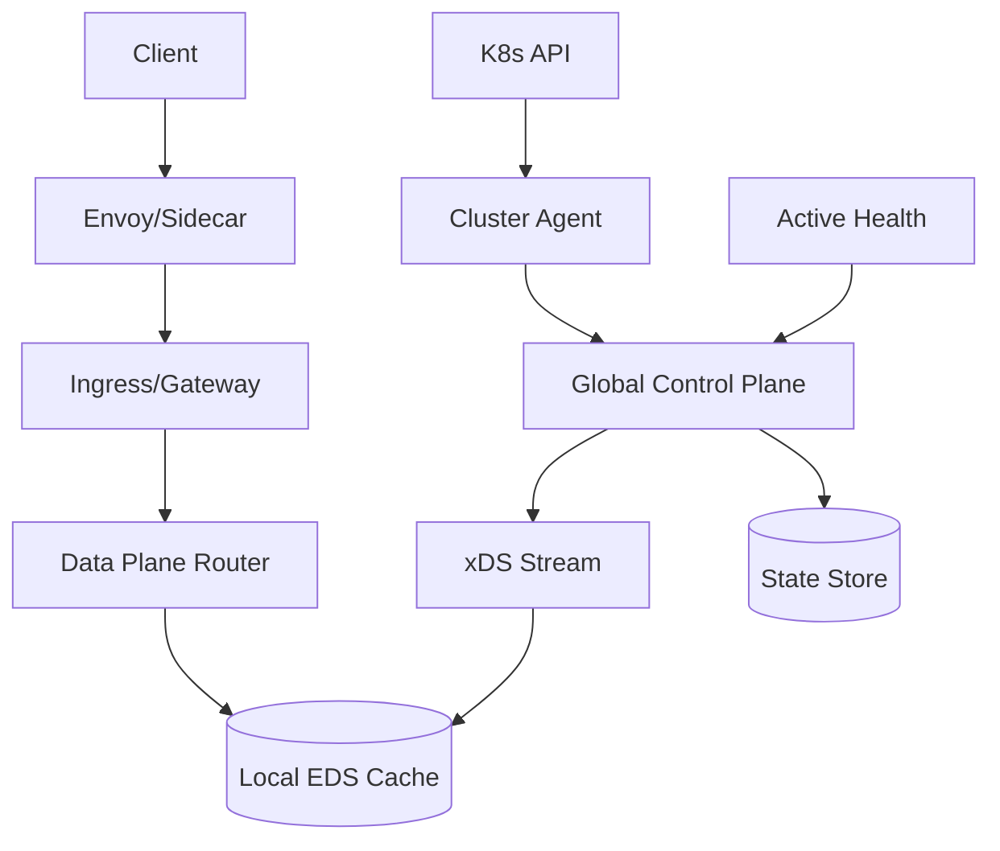
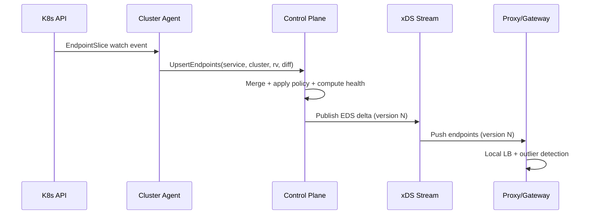

## Overview

Service discovery in a multi-cluster environment is deceptively hard because the “truth” about where a service is running is constantly changing (autoscaling, rollouts, node failures, partitions) while clients expect fast, correct routing. The challenge compounds across clusters: network links are imperfect, cluster health differs by region, and propagation delays make strong consistency across all clusters impractical at scale.

This design separates **control plane** (global intent + state aggregation) from **data plane** (local, low-latency routing decisions). We favor **eventual consistency with bounded staleness** and make routing resilient using **health signals, outlier detection, and fail-open defaults**. The key insight is to treat discovery as a continuously reconciled stream of endpoint state, not a request/response database lookup, and to push updates close to where routing happens (ingress/sidecars) with safe fallback behavior when the global view is stale.

## Requirements

### Functional Requirements
- Register and discover services across multiple Kubernetes clusters (hundreds+).
- Provide health-based routing: avoid unhealthy endpoints, prefer healthy clusters/regions.
- Support multiple discovery consumers: ingress gateways, sidecars, L7 proxies, and internal control-plane clients.
- Propagate endpoint changes (pods/nodes/NEGs) quickly via incremental updates and watches.
- Support traffic policies: locality/zone preference, weighted routing, failover priorities, and circuit breaking.
- Handle eventual consistency: define and enforce staleness bounds and safe degradation behavior.
- Provide multi-tenant isolation (namespaces/projects) with RBAC and policy enforcement.
- Offer operational tooling: debugging (why routed?), audit logs, and “snapshot” export.

### Non-Functional Requirements
- **Scale**:
  - Up to **200 clusters**, **20k services**, **2M endpoints** globally.
  - Discovery update churn: **50k endpoint updates/sec** peak (during incidents/rollouts).
  - Data-plane queries are mostly watch-driven; control-plane API QPS: **5k QPS** sustained.
- **Latency**:
  - Control-plane convergence (endpoint change → global availability): **P50 2s**, **P99 15s**.
  - Data-plane routing decision overhead: **P99 < 2ms** additional latency per request (proxy-local).
- **Availability**:
  - Data plane: **99.99%** (routing must continue during control-plane outages).
  - Control plane: **99.9%** (degraded mode acceptable with bounded staleness).
- **Consistency**:
  - Eventual consistency globally; strong consistency only within a single cluster’s source of truth (K8s API/etcd).
  - Monotonicity per consumer session for config versions (no “time travel” when watching).
- **Durability**:
  - Endpoint state is reconstructable; tolerate **minutes of control-plane data loss** if sources remain.
  - Audit/policy changes: **RPO ≤ 1 minute**, retained **90 days**.

### Constraints & Assumptions
- Kubernetes is the primary substrate (Endpoints/EndpointSlice, Services, Nodes).
- Network between clusters may be partially connected; cross-region links can be lossy and high latency.
- Team size small-to-medium; prefer proven components (Envoy/xDS, etcd/SQL, Kafka/NATS optional).
- Compliance: basic tenant isolation and auditability; no strict financial-grade regulatory constraints assumed.
- No requirement for global strong consistency; correctness is defined by safety rules under staleness.

## High-Level Architecture

The system uses **cluster agents** to watch each cluster’s Kubernetes API and publish incremental endpoint state (and metadata like locality, labels, readiness) to a **global control plane**. The control plane merges state, applies policies, and emits versioned configuration to the data plane via **xDS** (Envoy’s discovery protocol), which is a natural fit for high-churn endpoint distribution.

Routing happens close to traffic: gateways/sidecars consult a **local endpoint cache** populated by the xDS stream. Health-based routing combines (1) Kubernetes readiness/liveness signals, (2) active probing from the control plane (optional), and (3) data-plane passive health (outlier detection). Under partitions, routing continues using the last known good config with explicit staleness handling.

## Component Deep-Dive

### Cluster Agent

**Responsibility**: Continuously observe each cluster’s service/endpoints and publish normalized updates to the global control plane.

**Key Design Decisions**:
- Watch `EndpointSlice` (preferred) rather than legacy `Endpoints` to scale to high endpoint counts and reduce payload size.
- Use at-least-once delivery with idempotent updates (resourceVersion + endpoint hash) to tolerate reconnects and duplicates.

**Technology Choice**: Go controller using Kubernetes informers; gRPC to control plane with mTLS.

**Scaling Strategy**: One agent per cluster (or per namespace set). Horizontal by cluster count; per-agent CPU scales with watch churn and compression/batching.

### Global Control Plane (Discovery + Policy)

**Responsibility**: Aggregate multi-cluster state, compute routing views (clusters/endpoints/weights), enforce policy, and publish versioned discovery snapshots/streams.

**Key Design Decisions**:
- Separate **ingestion** (event stream from agents) from **publication** (xDS stream) to isolate bursty churn from data-plane stability.
- Produce monotonic config versions per resource (EDS/CDS/RDS) to guarantee watchers never regress.

**Technology Choice**: Stateless control-plane service (Go/Java) backed by a strongly consistent store for policy + a fast state store for computed views.

**Scaling Strategy**: Scale horizontally by partitioning resources (e.g., consistent hash on service name). Use leader election per partition for deterministic publication or allow active-active with version coordination.

### Health Signal Processor

**Responsibility**: Compute health at endpoint and cluster levels and provide health-based routing inputs.

**Key Design Decisions**:
- Combine multiple sources: K8s readiness (fast, local), active probes (detect blackholes), and passive outlier detection (data-plane feedback).
- Prefer “fail-open” for minor uncertainty but “fail-closed” for clearly unhealthy endpoints (configurable per service criticality).

**Technology Choice**: Control-plane module plus optional dedicated probing workers; store health as time-decayed scores.

**Scaling Strategy**: Probe fanout controlled via budgets (max probes per service/cluster). Shard probes by target hash; backoff on timeouts.

### Data Plane Router (Gateways/Sidecars)

**Responsibility**: Make per-request routing decisions using local config and runtime health, without depending on the control plane.

**Key Design Decisions**:
- Use EDS via xDS for endpoint updates (incremental); apply locality-aware load balancing (e.g., `LOCALITY_WEIGHTED_LB`).
- Use circuit breaking/outlier detection locally to rapidly eject bad endpoints even before control-plane convergence.

**Technology Choice**: Envoy (or similar proxy) with ADS/xDS; optional service mesh integration (Istio/Linkerd equivalents).

**Scaling Strategy**: Scales with traffic; configuration distribution is O(number of proxies) but incremental and compressible. Use tiered gateways to reduce sidecar fanout if needed.

## Data Model

### Storage Schema

**Policy Store (durable, strongly consistent)** (PostgreSQL or etcd):
- `services`
  - `service_id` (UUID)
  - `name`, `namespace`, `tenant_id`
  - `ports` (JSON)
  - `default_policy_id`
  - `created_at`, `updated_at`
- `routing_policies`
  - `policy_id` (UUID)
  - `service_id`
  - `mode` (e.g., `locality_prefer`, `active_active`, `failover`)
  - `cluster_weights` (JSON map cluster/region → weight)
  - `max_staleness_seconds`
  - `failover_order` (JSON array)
  - `updated_by`, `updated_at`
- `audit_log`
  - `event_id`, `tenant_id`, `actor`, `action`, `resource`, `before`, `after`, `ts`

**State Store (fast, rebuildable)** (Redis / RocksDB / in-memory + periodic snapshots):
- `endpoint_set:{service_key}:{cluster_id}`
  - `version` (monotonic integer)
  - `endpoints` (compressed list: ip, port, zone, health, metadata, expiry)
- `computed_view:{service_key}`
  - `global_version`
  - `clusters` (health/weight)
  - `endpoints_by_cluster` references

### Data Flow

Key operations:
- **Endpoint update**: Agent sends diffs keyed by `resourceVersion`; control plane merges into per-service global view and emits incremental EDS.
- **Health update**: Health processor updates endpoint/cluster health scores; routing weights adjust and are pushed as config deltas.
- **Consumer reconnect**: Proxies resume xDS stream and request the latest version; control plane sends a consistent snapshot then deltas.

## API Design

### Control Plane APIs (gRPC recommended)

#### Agent → Control Plane
- `UpsertEndpoints(UpsertEndpointsRequest) returns (UpsertEndpointsResponse)`
  - Request:
    - `tenant_id`, `cluster_id`, `service_key`
    - `k8s_resource_version`
    - `endpoints_delta` (added/removed/updated)
    - `timestamp`
  - Response:
    - `accepted_version`
    - `retry_after_ms` (for backpressure)

**Idempotency**: `(cluster_id, service_key, k8s_resource_version)` is idempotency key; duplicates are safe.

**Errors**:
- `UNAUTHENTICATED/ PERMISSION_DENIED`: mTLS/RBAC issues
- `RESOURCE_EXHAUSTED`: backpressure (agent should backoff)
- `FAILED_PRECONDITION`: schema/version mismatch (agent upgrade)

#### Admin/Policy API
- `PUT /v1/tenants/{tenantId}/services/{serviceKey}/policy`
  - Body:
    - `maxStalenessSeconds`
    - `clusterWeights`
    - `failoverOrder`
    - `healthMode` (e.g., `k8s_only`, `k8s_plus_active`, `plus_passive`)
  - Response: `policyId`, `updatedAt`

**Error handling**: validation errors are `400` with field-level messages; conflicting updates use `If-Match` with ETag for optimistic concurrency.

### Discovery to Data Plane (xDS)
- Use Envoy ADS (Aggregated Discovery Service) over gRPC:
  - EDS for endpoints
  - CDS/RDS/LDS as needed for cluster and route definitions

**Idempotency & ordering**: xDS uses nonce/version; clients ACK/NACK. Control plane must keep per-connection state to ensure monotonic versions.

## Scaling & Performance

### Bottleneck Analysis
- **High endpoint churn** (deploys/incidents): mitigated by batching deltas, compressing payloads, and avoiding full snapshots.
- **Fanout to many proxies**: mitigated by incremental xDS, connection pooling, and optionally tiered distribution (regional xDS relays).
- **Hot services** (many consumers, frequent changes): mitigate with per-service sharding and priority queues; cap update frequency (coalescing windows like 200–500ms).

### Horizontal Scaling
- **Agents**: scale with clusters; each agent is independent.
- **Control plane**: shard by `hash(service_key)`; each shard owns publication for its partition to keep version monotonic and simplify cache locality.
- **State store**: partition by service_key; keep computed views in-memory with periodic snapshot to disk/object storage.

### Caching Strategy
- **Proxy-local cache**: endpoints and routes; TTL governed by control-plane push cadence plus staleness limit.
- **Control-plane cache**: computed EDS responses per (service, proxy metadata) to avoid recomputing on reconnect storms.
- **Invalidation**: event-driven (agent updates) + periodic reconciliation (e.g., every 60s) to correct missed events.

## Trade-offs & Alternatives

### Key Trade-offs Made
- **Chosen**: event-driven xDS push to proxies  
  **Sacrificed**: simpler pull-based DNS-only discovery  
  **Why**: DNS lacks rich health/policy semantics and reacts slowly under churn; xDS supports incremental updates and richer routing.

- **Chosen**: eventual consistency with bounded staleness  
  **Sacrificed**: global strong consistency  
  **Why**: strong consistency across clusters is costly and brittle; routing must remain available during partitions.

- **Chosen**: multi-signal health (K8s + active + passive)  
  **Sacrificed**: simpler single-source health  
  **Why**: K8s readiness alone misses blackholes; active probes can be expensive; passive health is fastest but local—combining provides robust coverage.

### Alternative Approaches
- **DNS-based (multi-cluster DNS + health checks)**: simpler, but coarse, slow propagation, limited policy expressiveness, and tricky per-endpoint health semantics.
- **Gossip-only registry (Consul-style)**: good for VM-centric environments; in Kubernetes, duplicative of K8s and harder to map to EndpointSlice lifecycle.
- **Fully mesh-managed (Istio multi-primary)**: powerful if you already run a mesh; heavier operational footprint and may exceed “foundational infra” scope if you just need discovery.

## Failure Modes & Mitigations

### Failure Scenarios
- **Scenario**: Control plane outage  
  **Impact**: No new config pushes; routing continues with last known config  
  **Detection**: xDS disconnect rates, control-plane SLO burn, push latency alerts  
  **Mitigation**: Proxies keep serving from cache; enforce `maxStalenessSeconds` with graceful degradation (e.g., restrict to local cluster if stale).

- **Scenario**: Cross-cluster network partition  
  **Impact**: Global view becomes stale; some clusters appear healthy/unhealthy incorrectly  
  **Detection**: agent heartbeat loss, link telemetry, probe failures clustered by region  
  **Mitigation**: Mark cluster “unknown” after threshold; shift traffic using failover order; avoid rapid flapping via hysteresis.

- **Scenario**: Stale endpoints causing blackholes (pod IP reused, firewall changes)  
  **Impact**: elevated errors/timeouts  
  **Detection**: proxy passive health ejections, rising 5xx/timeout SLOs  
  **Mitigation**: fast local outlier detection; active probes for critical services; shorten endpoint TTL and require periodic refresh from agents.

- **Scenario**: Bad policy push (misconfigured weights/failover)  
  **Impact**: traffic imbalance or outage  
  **Detection**: config diff alarms, canary proxies, anomaly detection on per-cluster traffic  
  **Mitigation**: staged rollout (canary xDS), policy validation, automatic rollback on error budget regression.

### Disaster Recovery
- **RTO**: 30 minutes for control plane (data plane continues operating)  
- **RPO**: 1 minute for policy/audit store  
- **Backup strategy**: nightly full + continuous WAL shipping (Postgres) or etcd snapshots; store in object storage with retention  
- **Failover procedures**: bring up control plane in secondary region, restore policy store, agents reconnect and rebuild state store from K8s watches

## Operational Considerations

### Monitoring & Alerting
- Control plane:
  - xDS stream count, connect/disconnect rate
  - publish latency (event → push), queue depth, dropped/coalesced updates
  - per-shard CPU/mem, GC pauses
- Agents:
  - watch lag, relist frequency, heartbeat age
  - rejected updates/backpressure rates
- Data plane (via proxy metrics):
  - upstream 5xx/timeouts, outlier ejections
  - per-cluster traffic distribution vs expected weights
- Suggested alerts:
  - publish P99 > 15s for 5m
  - agent heartbeat missing > 30s for N clusters
  - sudden >X% traffic shift to failover clusters
  - NACK rate spike on xDS (config errors)

### Deployment Strategy
- Use canary control-plane shards and canary proxy pools to validate new computation/policy logic.
- Support rollback by pinning previous config version and reverting policy store changes (ETag-based).
- Perform agent upgrades with skew tolerance (old/new protobuf fields) and feature flags.

## References & Further Reading
- Envoy xDS APIs and ADS: https://www.envoyproxy.io/docs/envoy/latest/api-docs/xds_protocol
- Kubernetes EndpointSlice design: https://kubernetes.io/docs/concepts/services-networking/endpoint-slices/
- Outlier detection (Envoy): https://www.envoyproxy.io/docs/envoy/latest/intro/arch_overview/upstream/outlier
- Google SRE Book (monitoring, SLIs/SLOs): https://sre.google/sre-book/table-of-contents/
- Consul service discovery patterns (for comparison): https://developer.hashicorp.com/consul/docs/discovery