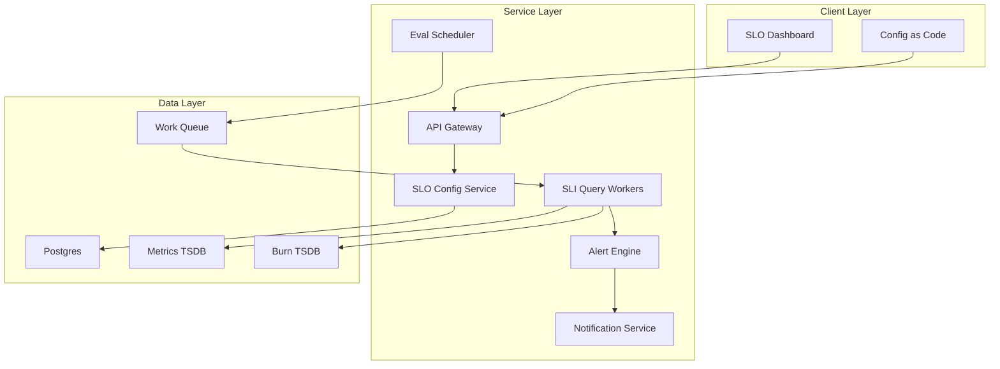
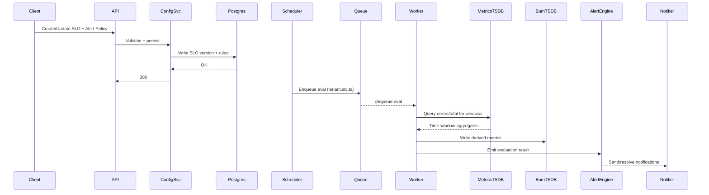

## Overview

SLO/error-budget monitoring turns raw reliability telemetry (requests, errors, latency) into actionable signals: burn rate across multiple time windows, remaining budget, and alerts that page humans only when it matters. The challenge is that “error rate is high” is not the same as “we are in danger of violating the SLO”—and naive alerting either misses fast outages or pages constantly during short blips.

A production-grade solution must (1) support flexible SLI definitions per service/tenant, (2) compute burn rate correctly and efficiently at scale across multiple rolling windows, and (3) trigger multi-window alerts that balance sensitivity (catch fast burn) with robustness (avoid flapping/false positives). The key insight is to normalize errors by the allowed error budget and use multi-window, multi-burn-rate conditions (short + long windows) to represent both “fast burn” and “slow burn” failure modes.

## Requirements

### Functional Requirements
- Create/update/delete SLOs with explicit objectives (e.g., 99.9% over 30 days) and one or more SLI definitions (availability, latency, correctness).
- Compute burn rates across multiple rolling windows (e.g., 5m/1h and 30m/6h) for each SLO.
- Compute remaining error budget over the SLO period and expose it via API and dashboards.
- Trigger alerts based on multi-window burn conditions and/or low remaining budget thresholds, with deduplication and routing (team, service, severity).
- Support multi-tenant isolation (org/project), RBAC, and audit logging for SLO/alert policy changes.
- Provide “exhaustion prediction” (estimated time-to-budget-exhaustion at current burn) and suppress alerts when traffic is too low/noisy.
- Integrate with existing telemetry stacks (Prometheus/Mimir/Thanos, OpenTelemetry metrics, Datadog/New Relic) via adapters.
- Offer drill-down: link alerts to the underlying SLI query results and per-dimension breakdown (region, cluster, endpoint) where safe.

### Non-Functional Requirements
- **Scale**:
  - Tenants: 100–1,000 orgs
  - SLOs: 10,000–100,000 total
  - Evaluation cadence: 30s–60s
  - Effective evaluation throughput: ~2k–50k SLO evals/min (with batching)
  - Incoming metrics: 1M–10M samples/sec into the metrics backend (shared with other observability uses)
- **Latency**:
  - Fast-burn paging detection: P50 < 45s, P99 < 120s from telemetry availability
  - API read (current status): P95 < 200ms (cached), P99 < 1s
  - Dashboard queries: P95 < 2s
- **Availability**:
  - Alerting path (evaluation → notification): 99.99%
  - Control plane (CRUD/config): 99.9%
- **Consistency**:
  - SLO/config writes: strong consistency (single source of truth)
  - Burn-rate/status: eventual consistency (bounded by evaluation cadence + metrics ingestion delay)
- **Durability**:
  - Config/audit: RPO ~ 0, RTO < 1 hour
  - Computed burn time series: acceptable to lose minutes (recomputable), but not hours (SLO history)

### Constraints & Assumptions
- Metrics backend exists (e.g., Prometheus-compatible TSDB such as Mimir/Thanos) and provides query APIs and remote-write ingestion.
- Team size: 4–8 engineers; prioritize simplicity and operational clarity over exotic optimizations.
- Compliance: basic controls (RBAC, audit log, encryption at rest/in transit); no PII required for SLIs.
- Multi-region optional: start single-region active/active for alerting path, expand to multi-region DR.

## High-Level Architecture



The system splits into a **control plane** (SLO definitions, alert policies, RBAC) and a **data plane** (periodic evaluation, burn-rate computation, alert triggering). This separation keeps correctness-critical configuration strongly consistent while allowing computed metrics to be scalable and eventually consistent.

We intentionally reuse an existing metrics TSDB for raw SLIs and store computed burn-rate series in a dedicated “Burn TSDB” (which can be the same backend via a distinct tenant/metric prefix). This enables cheap dashboarding and consistent alert semantics, while avoiding repeated expensive ad-hoc queries over long ranges.

## Component Deep-Dive

### SLO Config Service

**Responsibility**: CRUD for SLOs/SLIs, evaluation windows, alert policies, routing, RBAC, audit logs.

**Key Design Decisions**:
- Store SLO definitions as immutable versions plus an “active” pointer to support safe rollouts and historical reproducibility.
- Represent SLIs as composable templates (PromQL, OTLP metric selectors, vendor queries) with validation and “dry-run” execution against the metrics backend.

**Technology Choice**: Go/Java service + Postgres (strong consistency, relational queries for org/project/team routing, mature tooling).

**Scaling Strategy**: Stateless service behind L7 load balancer; read-heavy paths cached in Redis/ in-memory with short TTL (e.g., 30–60s). Postgres read replicas if needed.

---

### Evaluation Scheduler

**Responsibility**: Decide which SLOs to evaluate when; enqueue work; enforce fairness and rate limits per tenant.

**Key Design Decisions**:
- Use partitioned scheduling by `(tenant_id, slo_id)` hash to ensure deterministic assignment and avoid double-evaluation.
- Track evaluation watermarks (last_success_ts) and lag, enabling catch-up without thundering herds after outages.

**Technology Choice**: Stateless scheduler + durable work queue (Kafka topic or SQS/PubSub; or Redis Streams for smaller setups).

**Scaling Strategy**: Horizontal schedulers with leader election per partition (or use queue partitions); backpressure via queue depth and per-tenant quotas.

---

### SLI Query Workers

**Responsibility**: Execute SLI queries for configured windows, compute burn rate, remaining budget, and persist derived time series.

**Key Design Decisions**:
- Batch queries per tenant and per metrics backend shard (reduce query overhead): evaluate multiple SLOs with shared selectors when possible.
- Normalize burn rate as:
  - `allowed_error_fraction = 1 - objective` (e.g., 0.001 for 99.9%)
  - `error_ratio(W) = errors(W) / total(W)`
  - `burn_rate(W) = error_ratio(W) / allowed_error_fraction`
- Use traffic guards: if `total(W) < min_requests` (e.g., < 100 over window), mark `INSUFFICIENT_DATA` and suppress paging.

**Technology Choice**: Worker pool (Go/Java) with PromQL/metrics adapters; optional local result cache (LRU) to avoid repeated same-window queries.

**Scaling Strategy**: Scale workers horizontally; shard by tenant and SLO hash; cap concurrency per TSDB to protect shared observability platform; use exponential backoff on TSDB errors.

---

### Alert Engine

**Responsibility**: Evaluate alert policies from burn-rate series, dedupe incidents, manage state (firing/resolved), and route to notification channels.

**Key Design Decisions**:
- Multi-window, multi-burn alerting to reduce false positives:
  - **Fast burn**: page if short-window AND long-window burn exceed thresholds.
  - **Slow burn**: page/ticket if medium-window AND long-window burn exceed lower thresholds.
- Incident dedup by `(tenant_id, slo_id, alert_policy_id)` with a stable fingerprint; require a minimum “for” duration (e.g., 2–5 minutes) to avoid flapping.

**Technology Choice**: Stateful alert evaluator (or stateless with state in Redis) + integration with PagerDuty/Slack/Email; optionally leverage Alertmanager semantics.

**Scaling Strategy**: Partition alert evaluations by tenant; store state in Redis with persistence; run N replicas with consistent hashing to minimize cross-talk.

---

### Burn/Derived Metrics Store (Burn TSDB)

**Responsibility**: Store computed time series: burn_rate per window, error_ratio, total_requests, remaining_budget, exhaustion_eta.

**Key Design Decisions**:
- Write derived metrics as time series for cheap dashboarding and re-use in alerts (alerts read derived, not raw).
- Retention tiers:
  - High-resolution (30s/1m) for 7–14 days
  - Downsampled (5m/1h) for 90–180 days

**Technology Choice**: Prometheus-compatible TSDB (Mimir/Thanos/Prometheus remote-write) or ClickHouse for wide analytics; pick TSDB for tight integration with existing metrics/alerting.

**Scaling Strategy**: TSDB scales by sharding + object storage; enforce cardinality limits by controlling labels (avoid per-request labels in derived metrics).

## Data Model

### Storage Schema

**Postgres (control plane)**

- `tenants`
  - `tenant_id (uuid, pk)`, `name`, `created_at`
- `slo`
  - `slo_id (uuid, pk)`, `tenant_id (fk)`, `name`, `service`, `objective (float)`, `period_seconds (int)`, `timezone`, `enabled (bool)`, `created_at`
- `slo_version`
  - `slo_version_id (uuid, pk)`, `slo_id (fk)`, `version (int)`, `sli_type (enum: availability|latency|custom)`, `good_query`, `total_query`, `bad_query`, `min_requests (int)`, `labels_json`, `created_at`
- `alert_policy`
  - `policy_id (uuid, pk)`, `tenant_id (fk)`, `name`, `enabled`, `paging_channels_json`, `created_at`
- `alert_rule`
  - `rule_id (uuid, pk)`, `policy_id (fk)`, `slo_id (fk)`,
  - `rule_type (enum: multi_window_burn|remaining_budget|exhaustion_eta)`,
  - `windows_json` (e.g., `[{"w":"5m","threshold":14.4},{"w":"1h","threshold":6}]`),
  - `for_seconds`, `severity`, `created_at`
- `incident`
  - `incident_id (uuid, pk)`, `tenant_id`, `slo_id`, `rule_id`, `state (firing|resolved)`, `started_at`, `ended_at`, `fingerprint`, `last_evaluated_at`
- `audit_log`
  - `id (bigserial, pk)`, `tenant_id`, `actor`, `action`, `resource_type`, `resource_id`, `before_json`, `after_json`, `created_at`

**Derived time series (Burn TSDB)**

Metric examples (labels: `tenant`, `slo_id`, `service`, optional `region`):
- `slo_burn_rate{window="5m"} = 7.2`
- `slo_error_ratio{window="5m"} = 0.0072`
- `slo_requests{window="5m"} = 120000`
- `slo_budget_remaining = 0.62` (fraction 0..1 over SLO period)
- `slo_exhaustion_eta_seconds = 86400` (optional)

### Data Flow



Key operations:
- **Evaluation**: For each SLO, workers compute `increase(bad_total[W])` and `increase(total[W])` (or `total-good`) for each window `W`, then compute burn and write derived metrics.
- **Alerting**: Alert engine reads derived burn series (or consumes evaluation results directly) to decide firing/resolved; notifications are deduped via incident fingerprint.

## API Design

### Public REST APIs (control + read paths)

**Create SLO**
- `POST /v1/tenants/{tenantId}/slos`
- Headers: `Idempotency-Key: <uuid>`
- Request:
```json
{
  "name": "checkout-availability",
  "service": "checkout",
  "objective": 0.999,
  "periodSeconds": 2592000,
  "sli": {
    "type": "availability",
    "totalQuery": "sum(rate(http_requests_total{service=\"checkout\"}[1m]))",
    "badQuery": "sum(rate(http_requests_total{service=\"checkout\",code=~\"5..\"}[1m]))",
    "minRequests": 100
  }
}
```
- Response `201`:
```json
{ "sloId": "uuid", "version": 3, "status": "enabled" }
```
- Errors:
  - `400` invalid objective/query
  - `409` idempotency conflict (same key, different body)
  - `429` tenant quota exceeded

**Get SLO status (current burn + remaining)**
- `GET /v1/tenants/{tenantId}/slos/{sloId}/status?windows=5m,1h,6h,3d`
- Response `200`:
```json
{
  "sloId": "uuid",
  "objective": 0.999,
  "periodSeconds": 2592000,
  "budgetRemaining": 0.62,
  "burnRates": {
    "5m": 12.1,
    "1h": 5.4,
    "6h": 1.2,
    "3d": 0.9
  },
  "dataQuality": {
    "5m": "OK",
    "1h": "OK",
    "6h": "INSUFFICIENT_DATA",
    "3d": "OK"
  },
  "exhaustionEtaSeconds": 172800
}
```

**Create alert policy/rule**
- `POST /v1/tenants/{tenantId}/alert-policies`
- Request:
```json
{
  "name": "checkout-paging",
  "rules": [
    {
      "type": "multi_window_burn",
      "windows": [
        { "window": "5m", "threshold": 14.4 },
        { "window": "1h", "threshold": 6.0 }
      ],
      "forSeconds": 120,
      "severity": "page"
    },
    {
      "type": "multi_window_burn",
      "windows": [
        { "window": "30m", "threshold": 3.0 },
        { "window": "6h", "threshold": 1.0 }
      ],
      "forSeconds": 600,
      "severity": "ticket"
    }
  ],
  "routing": {
    "pagerdutyServiceKeyRef": "secret://pd/checkout",
    "slackChannel": "#oncall-checkout"
  }
}
```

### Error handling approach
- Consistent error envelope:
```json
{ "error": { "code": "INVALID_QUERY", "message": "...", "details": {} } }
```
- Distinguish:
  - `INSUFFICIENT_DATA` (not an error; suppress paging)
  - `EVAL_DELAYED` (system lag; alert internal SRE)
  - `QUERY_FAILED` (TSDB issues; retry with backoff)

### Idempotency considerations
- Use `Idempotency-Key` for create operations; store request hash + response for 24h.
- `PUT /slos/{id}` is idempotent by definition; internally creates a new `slo_version` and atomically flips “active version”.

## Scaling & Performance

### Bottleneck Analysis
- **Metrics backend query load**: Thousands of SLOs * multiple windows can overwhelm TSDB.
  - Mitigations: batch queries, cache shared aggregations, rate-limit per tenant, precompute recording rules, store derived series and alert off derived series.
- **High cardinality SLIs**: Labels like `user_id` or `path` explode series.
  - Mitigations: enforce label allowlists, require aggregation in queries, provide linting, set tenant cardinality budgets.
- **Alert storms**: One platform outage triggers many SLOs.
  - Mitigations: hierarchical routing (one “platform down” incident), correlation/grouping by service/region, notification rate limits, incident dedupe.

### Horizontal Scaling
- **API/Config**: stateless replicas; Postgres primary + replicas.
- **Scheduler**: shard by tenant; multiple schedulers with partition ownership.
- **Workers**: autoscale by queue depth and TSDB latency; shard by `(tenant_id, slo_id)` hash.
- **Alert Engine**: partition by tenant/rule; store state in Redis for quick failover.

**Partitioning strategy**
- Primary: `tenant_id` (hard isolation)
- Secondary: `hash(slo_id) mod N` (balanced distribution)
- Support “noisy tenant” isolation with per-tenant concurrency and QPS caps.

### Caching Strategy
- **Config cache**: SLO definitions and alert policies in-memory/Redis (TTL 30–60s); invalidate on writes via pub/sub.
- **Query result cache**: short-lived cache for window aggregates (e.g., 30–60s) keyed by `(query, step, range_end)` to avoid redundant evaluation.
- **Derived metrics**: alerts read `slo_burn_rate` instead of recomputing from raw each time.

Cache invalidation:
- Config changes publish an event (`SLO_UPDATED`) consumed by scheduler/workers to refresh cached SLO versions.
- Query cache is time-bucketed (aligned to evaluation cadence) to avoid correctness issues.

## Trade-offs & Alternatives

### Key Trade-offs Made
- **Chosen**: Derived burn-rate series stored in TSDB and used for alerting.
  - **Sacrificed**: Some storage cost and write amplification.
  - **Why**: Dramatically reduces repeated expensive raw queries and standardizes alert semantics across tools.
- **Chosen**: Multi-window burn alerts (short+long) instead of single threshold.
  - **Sacrificed**: More complex policies to explain.
  - **Why**: Real-world reliability needs both fast outage detection and flake resistance; this matches proven SRE practice.
- **Chosen**: Control plane in Postgres with versioned SLOs.
  - **Sacrificed**: Slightly more schema/operational work vs. a document store.
  - **Why**: Strong consistency, auditability, and rich querying for routing/ownership.

### Alternative Approaches
- **Prometheus-only (recording rules + Alertmanager)**:
  - Pros: simplest if already on Prometheus; mature ecosystem (e.g., Sloth generates rules).
  - Cons: large fleets hit query/recording-rule management limits; harder multi-tenant isolation and governance.
- **Stream processing on raw events (Kafka + Flink/Samza)**:
  - Pros: strong control over aggregation; great for very high throughput and custom dimensions.
  - Cons: heavier ops and correctness complexity; often unnecessary if SLIs already exist as metrics.
- **Log-based SLI via centralized log analytics (ELK/ClickHouse)**:
  - Pros: rich slicing/dicing and joins.
  - Cons: expensive for real-time alerting; higher ingestion costs; more moving parts.

## Failure Modes & Mitigations

### Failure Scenarios

- **Scenario**: Metrics TSDB degraded/unavailable
  - **Impact**: Missed/late evaluations; blind to true burn.
  - **Detection**: Worker query error rate, query latency SLOs, eval lag metric.
  - **Mitigation**: Backoff + retry, fail-open to “unknown” (don’t page on SLOs), page internal “monitoring platform down” alert, run multi-zone TSDB.

- **Scenario**: Work queue backlog / scheduler lag
  - **Impact**: Alerts delayed; stale burn rate.
  - **Detection**: Queue depth, oldest message age, per-tenant lag.
  - **Mitigation**: Autoscale workers, shed low-priority tenants, increase cadence temporarily, fast-path for paging rules.

- **Scenario**: Bad SLO query (expensive or wrong)
  - **Impact**: TSDB overload or incorrect alerts.
  - **Detection**: Query cost estimation, dry-run validation, anomaly detection on burn series.
  - **Mitigation**: Query linting, guardrails (max selectors, max range), per-tenant “circuit breaker” disabling offending SLO version.

- **Scenario**: Duplicate alert notifications
  - **Impact**: Oncall fatigue.
  - **Detection**: Incident fingerprint collisions/duplicates, notifier delivery logs.
  - **Mitigation**: Strong dedupe keys, idempotent notifier integrations, “only transition sends” (firing→resolved).

- **Scenario**: Low traffic causes noisy ratios
  - **Impact**: False positives.
  - **Detection**: `total_requests` below threshold, high variance.
  - **Mitigation**: `min_requests` gating, longer windows for low-traffic SLOs, Bayesian/Clopper-Pearson confidence option (advanced).

### Disaster Recovery
- **RTO/RPO**:
  - Control plane: RTO < 1 hour, RPO ~ 0 (WAL shipping / synchronous replication if needed)
  - Derived metrics: RTO < 4 hours, RPO < 15 minutes (recomputable from raw)
- **Backup strategy**:
  - Postgres: continuous WAL + daily snapshots; periodic restore tests.
  - Object storage (TSDB blocks): versioning + lifecycle policies; cross-region replication for DR.
- **Failover procedures**:
  - Active/active alerting across 2 AZs; leader election per partition.
  - If region fails: restore Postgres from replicated standby, point workers to secondary TSDB endpoint, resume scheduler from watermarks.

## Operational Considerations

### Monitoring & Alerting
Key metrics:
- Evaluation:
  - `eval_lag_seconds` (P50/P99), `eval_success_rate`, `query_latency_ms`, `query_error_rate`
  - `queue_oldest_age_seconds`, `worker_utilization`, `tsdb_throttle_events`
- Alerting:
  - `incidents_firing`, `incident_dedupe_rate`, `notification_delivery_success`, `notification_latency_ms`
- Data quality:
  - `%INSUFFICIENT_DATA` per tenant/service, missing series rate, cardinality budget usage

Alert thresholds (examples):
- Page internal SRE if `eval_lag_seconds_p99 > 180` for 10m
- Page internal SRE if `query_error_rate > 5%` for 5m
- Ticket if any tenant exceeds cardinality quota by >10% for 1h

### Deployment Strategy
- Blue/green or canary per component; start with 5% of tenants, then ramp.
- Schema migrations: backward compatible first (add columns/tables), deploy, then enforce constraints.
- Rollback:
  - Config service: versioned APIs + feature flags
  - Workers/alert engine: keep old evaluator running during rollout; compare outputs (shadow mode) before switching

## References & Further Reading

- Google SRE Workbook: SLOs, error budgets, and multi-window multi-burn-rate alerting concepts.
- Google SRE Book (Chapter: Monitoring Distributed Systems; Managing Incidents).
- “Alerting on SLOs” patterns (multi-window burn rate) and common threshold sets.
- Prometheus documentation: `rate()`, `increase()`, recording rules, Alertmanager.
- Sloth (SLO generator for Prometheus): practical examples of burn-rate alert rules.
- Cortex/Mimir/Thanos docs: scalable Prometheus-compatible TSDB architectures.