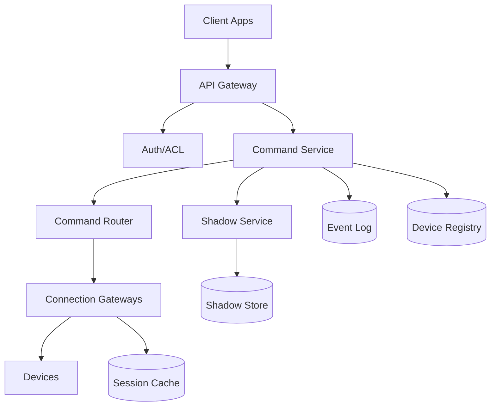
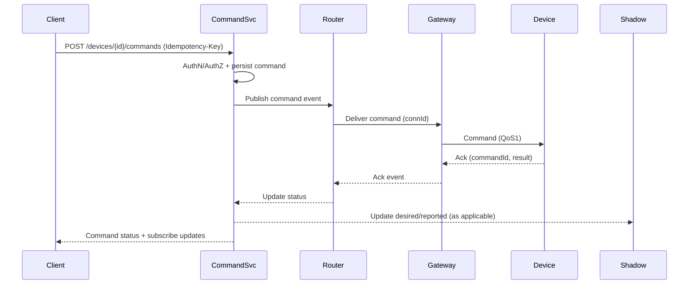

## Overview

A smart home backend must route user commands (e.g., “unlock door”, “turn on lights”) to devices that are frequently behind NATs, carrier-grade NAT, and restrictive firewalls—meaning the backend generally cannot open inbound connections to devices. The core challenge is achieving **low-latency, reliable command delivery** while devices roam networks, drop connections, and intermittently go offline.

The key insight is to invert connectivity: devices maintain **long-lived outbound, authenticated connections** to the cloud (MQTT/WebSocket/HTTP2), and the backend routes commands over those existing sessions. The system needs a fast, scalable **session-to-node lookup** (device → which gateway currently holds its connection), a **durable command pipeline** for offline delivery and retries, and a **device state/shadow model** to present a coherent view to users despite intermittent connectivity.

## Requirements

### Functional Requirements
- Device onboarding and secure provisioning (pairing a device to a home/user).
- Maintain device connectivity through NAT/firewalls via outbound long-lived sessions.
- Send commands to a specific device with delivery acknowledgements and timeouts.
- Support offline devices: queue commands (with TTL) and deliver on reconnect where allowed.
- Report device telemetry and state updates (online/offline, battery, sensor readings).
- Provide “device shadow” (desired/reported state) to allow eventual convergence.
- Push real-time events to clients (command status, device state changes).
- Support multi-tenant isolation: users/homes/devices permissions and auditing.

### Non-Functional Requirements
- **Scale**: 10M registered devices, 1M concurrently connected, 100K command QPS peak, 1M telemetry msgs/sec peak, 1B shadow updates/day.
- **Latency**:
  - Online command end-to-end: P50 50ms, P99 150ms (client → cloud → device).
  - Shadow read: P99 50ms.
  - Telemetry ingest: P99 200ms to durable log.
- **Availability**: 99.99% for command API and connectivity gateways (regional), 99.9% acceptable for analytics.
- **Consistency**:
  - Strong consistency for auth, pairing, ACL checks, command creation.
  - Eventual consistency for shadow convergence and analytics aggregates.
- **Durability**: No loss of accepted commands and shadow history beyond RPO; telemetry may be sampled/dropped under overload with explicit SLOs.

### Constraints & Assumptions
- Devices cannot accept inbound connections; only outbound TCP/QUIC on commonly open ports (443) is reliable.
- Team can operate a multi-region Kubernetes + managed databases stack; budget supports a managed pub/sub or Kafka.
- Compliance: basic security (SOC2-like controls), per-home isolation, audit logs for sensitive commands (locks, alarms).
- Device CPU/RAM are constrained; prefer lightweight protocols (MQTT) and small payloads.

## High-Level Architecture



Devices maintain outbound connections to **Connection Gateways** (MQTT over TLS on 443, or MQTT-over-WebSocket as fallback). When a user issues a command, the **Command Service** authenticates/authorizes, persists the command (durable), and asks the **Command Router** to deliver it over the device’s existing session. The router uses a low-latency **Session Cache** mapping `deviceId -> gateway node/region` to avoid broadcast fanout.

A **Shadow Service** maintains desired/reported state. Commands typically update “desired” state; devices report “reported” state. This decouples UI correctness from transient connectivity while still enabling real-time delivery for online devices.

## Component Deep-Dive

### Connection Gateways
**Responsibility**: Terminate device connections, authenticate devices, keep sessions alive, deliver commands, receive telemetry/acks.

**Key Design Decisions**:
- Use **outbound long-lived connections** (no inbound NAT traversal) with keepalive tuned per network (e.g., 30–60s).
- Provide **protocol fallbacks**: MQTT/TLS on 443, MQTT-over-WebSocket on 443, optionally HTTP/2 streams or QUIC for high-loss networks.

**Technology Choice**: EMQX/HiveMQ (or custom gateway using Netty/Envoy + MQTT library) with mTLS; run regionally close to devices.

**Scaling Strategy**: Stateless frontends + consistent hashing / sticky session on connection establishment; scale by adding gateway nodes. Maintain `deviceId -> nodeId` in Redis cluster (or in-broker session registry) with TTL heartbeats.

### Command Service
**Responsibility**: User-facing command API, authorization, command creation, idempotency, status tracking.

**Key Design Decisions**:
- Persist commands before delivery (“accepted” means durable), then attempt fast-path delivery for online devices.
- Enforce **idempotency** using `Idempotency-Key` per device+user to prevent duplicate actuation on retries.

**Technology Choice**: Stateless service (Go/Java) behind API Gateway; PostgreSQL for registry/ACL and a durable log (Kafka/Pulsar) for command events.

**Scaling Strategy**: Horizontally scale API pods; partition command event topics by `deviceId` for ordering; use read replicas for registry-heavy reads.

### Command Router
**Responsibility**: Low-latency routing from command events to the correct gateway/session; manage retries and offline policy.

**Key Design Decisions**:
- Maintain a **hot session index** in Redis: `deviceId -> {region, node, connId, lastSeen}` for O(1) routing.
- Use **at-least-once delivery** with device-side de-duplication via `commandId` + monotonic versioning.

**Technology Choice**: Stream processor/consumer group (Kafka consumer) + Redis + gateway publish RPC (gRPC).

**Scaling Strategy**: Scale consumers by partitions; consistent partitioning by `deviceId` keeps per-device ordering.

### Shadow Service
**Responsibility**: Store desired/reported state, reconcile versions, provide APIs for UI and automations.

**Key Design Decisions**:
- Store shadow as `{desired, reported, version}`; updates are conditional on expected version to avoid lost updates.
- Treat shadow as **eventually consistent** with a clear “lastUpdated” and “source” metadata.

**Technology Choice**: DynamoDB/Cassandra (keyed by `deviceId`) for high write throughput; optional secondary index for `homeId` device listings.

**Scaling Strategy**: Partition by `deviceId`; cache hot reads in Redis; write-behind from event log for rebuild.

### Device Registry & Auth/ACL
**Responsibility**: Device identity, ownership, home membership, capability model, cert/public key management, policy enforcement.

**Key Design Decisions**:
- Device authentication via **mTLS** with per-device certs; rotate credentials with short-lived tokens for additional layers.
- Fine-grained ACL: `user/home -> device -> allowedActions`, with audit logging for sensitive actions.

**Technology Choice**: PostgreSQL for relational integrity; OIDC for user auth; Vault/HSM-backed CA for device cert issuance.

**Scaling Strategy**: Cache ACL decisions; use read replicas; keep writes low via append-only audit log.

## Data Model

### Storage Schema

**PostgreSQL: `devices`**
- `device_id` (PK, UUID/ULID)
- `home_id` (FK)
- `model`
- `capabilities` (JSONB)
- `status` (enum: active/blocked)
- `created_at`, `updated_at`

**PostgreSQL: `device_credentials`**
- `device_id` (PK/FK)
- `cert_fingerprint`
- `public_key`
- `rotated_at`
- `revoked_at` (nullable)

**PostgreSQL: `device_acl`**
- `home_id`, `user_id`, `device_id` (composite)
- `allowed_actions` (bitset/JSONB)

**Shadow Store (DynamoDB/Cassandra): `device_shadow`**
- `device_id` (PK)
- `version` (int)
- `desired` (map/json)
- `reported` (map/json)
- `updated_at` (timestamp)
- `updated_by` (enum: user/device/automation)

**Redis: `device_sessions`**
- Key: `sess:{device_id}`
- Value: `{region, node_id, conn_id, last_seen, protocol}`
- TTL: 2–3x keepalive interval

**Event Log (Kafka/Pulsar)**
- Topic: `commands` (partition key `device_id`)
- Topic: `telemetry` (partition key `device_id`)
- Topic: `device_presence` (partition key `device_id`)

### Data Flow



## API Design

### Send Command
`POST /v1/homes/{homeId}/devices/{deviceId}/commands`

Headers:
- `Authorization: Bearer <token>`
- `Idempotency-Key: <uuid>` (required)

Request:
```json
{
  "type": "LOCK_SET",
  "parameters": { "locked": true },
  "timeoutMs": 5000,
  "ttlMs": 60000
}
```

Response (accepted):
```json
{
  "commandId": "01J...ULID",
  "status": "ACCEPTED",
  "acceptedAt": "2025-12-17T12:00:00Z"
}
```

Errors:
- `401/403` auth/ACL failure
- `404` device not in home
- `409` idempotency conflict with different payload
- `429` rate limited
- `503` routing/gateway unavailable (command not accepted unless persisted)

Idempotency:
- Store `(deviceId, idempotencyKey) -> commandId + requestHash` for 24h.

### Command Status
`GET /v1/commands/{commandId}`

Response:
```json
{ "commandId":"...", "status":"DELIVERED|ACKED|FAILED|TIMED_OUT", "deviceAck": { "code":"OK" } }
```

### Device Shadow
`GET /v1/homes/{homeId}/devices/{deviceId}/shadow`

`PATCH /v1/homes/{homeId}/devices/{deviceId}/shadow/desired`
- Supports conditional update with `If-Match: <version>` to avoid overwrites.

### Realtime Events
- `GET /v1/events` (SSE) or `wss://.../v1/events` (WebSocket)
- Events: `command.status`, `device.presence`, `shadow.updated`

## Scaling & Performance

### Bottleneck Analysis
- **Connection fan-in** (1M+ sockets): mitigate with gateway fleets, efficient event loops, and regional affinity.
- **Session lookup hot path** (every command): keep in Redis with local cache; update on connect/disconnect.
- **Per-device ordering**: enforce via partitioning by `deviceId` in the command log and router consumers.
- **Shadow write amplification**: batch/coalesce updates; only persist meaningful diffs; apply backpressure.

### Horizontal Scaling
- **API layer**: stateless pods + autoscaling on RPS/latency; cache ACL and device metadata.
- **Router**: scale by log partitions; each consumer owns a set of device partitions.
- **Gateways**: scale by concurrent connections; use load balancer with least-conns; devices reconnect to another node on failure.
- **Data stores**:
  - Registry in Postgres: read replicas + partition large tables by `home_id` if needed.
  - Shadow in Dynamo/Cassandra: partition by `device_id` with predictable throughput.

### Caching Strategy
- **Session cache**: Redis is source of truth for `deviceId -> connection`; local in-process LRU cache with 1–5s TTL to cut Redis QPS.
- **Device metadata/ACL**: cache per `(userId, homeId)` and `(deviceId)` for 30–120s; invalidate on membership changes.
- **Shadow reads**: cache per device for 1–5s; clients rely on event stream for updates.

Cache invalidation:
- Publish membership/ACL changes to an internal topic; services subscribe and evict keys.

## Trade-offs & Alternatives

### Key Trade-offs Made
- **Chosen**: long-lived outbound connections (MQTT/WS)  
  **Sacrificed**: simplicity of pure request/response HTTP to devices  
  **Why**: NAT/firewalls make inbound delivery unreliable; persistent sessions give predictable latency.
- **Chosen**: at-least-once delivery + device de-dup  
  **Sacrificed**: exactly-once semantics  
  **Why**: distributed exactly-once is expensive; deterministic idempotent commands are practical and safer.
- **Chosen**: shadow eventual consistency  
  **Sacrificed**: always-perfect UI truth  
  **Why**: devices are intermittently offline; shadow gives a principled “desired vs reported” model.

### Alternative Approaches
- **Managed IoT platform (AWS IoT Core / Azure IoT Hub)**: faster time-to-market, strong managed scaling; not chosen if avoiding vendor lock-in or needing custom routing/edge behavior.
- **Direct WebSocket to per-device service (no broker)**: simpler mental model; not chosen due to difficult fan-in scaling and session routing across regions.
- **Local-first hub (home gateway) with cloud relay only**: excellent latency inside LAN; not chosen as the primary design because it adds hardware dependency and doesn’t solve direct-to-device cloud control for hub-less homes.

## Failure Modes & Mitigations

### Failure Scenarios
- **Scenario**: Gateway node crashes  
  **Impact**: devices on that node disconnect; commands may temporarily fail  
  **Detection**: connection drop spike, node health checks  
  **Mitigation**: devices reconnect via LB; session cache TTL expires; router retries delivery after reconnect.
- **Scenario**: Redis session cache partition/outage  
  **Impact**: router can’t find sessions; command latency spikes/failures  
  **Detection**: Redis error rate, router fallback rate  
  **Mitigation**: multi-AZ Redis cluster, local cache fallback, “publish to region” fallback (limited fanout) for critical commands.
- **Scenario**: Event log (Kafka/Pulsar) degradation  
  **Impact**: command acceptance or routing stalls  
  **Detection**: consumer lag, broker ISR shrink  
  **Mitigation**: multi-broker cluster, quotas, prioritize command topics, shed telemetry first.
- **Scenario**: Device stuck behind strict proxy blocking MQTT  
  **Impact**: device cannot connect  
  **Detection**: repeated auth/connect failures by network type  
  **Mitigation**: fallback to MQTT-over-WebSocket/HTTPS on 443; optional QUIC; adaptive keepalive; clear diagnostics in device logs.
- **Scenario**: Duplicate command delivery  
  **Impact**: double actuation risk (dangerous for locks)  
  **Detection**: device reports duplicate `commandId` seen  
  **Mitigation**: mandatory idempotency on device; server retries only with same `commandId`; audit sensitive actions.

### Disaster Recovery
- **RTO/RPO**: RTO 15 minutes (regional), RPO 1 minute for commands/registry; telemetry best-effort.
- **Backup strategy**: nightly full + continuous WAL/point-in-time for Postgres; periodic exports/snapshots for shadow store; store configs/secrets in replicated vault/HSM.
- **Failover procedures**: active-active regions for API and routers; devices connect to nearest region via GeoDNS/Anycast and re-resolve on failure; promote secondary DB replicas; replay command log consumers.

## Operational Considerations

### Monitoring & Alerting
- Gateway: concurrent connections, connect success rate, keepalive timeouts, message RTT (gateway↔device), TLS handshake failures.
- Router: command deliver latency (P50/P99), session lookup latency, retry rate, offline queue depth, consumer lag.
- API: auth/ACL latency, 4xx/5xx rates, idempotency conflicts, p99 end-to-end command time.
- Data: Redis hit rate/latency, Postgres replication lag, shadow write throttling, Kafka ISR/lag.
- Suggested alerts: P99 command latency > 300ms (5m), gateway disconnect spike > 3x baseline, consumer lag > 1 minute, Redis error rate > 1%.

### Deployment Strategy
- Blue/green or canary for API/router; gradual rollout by homeId hash.
- Gateways: rolling updates with connection draining (stop accepting new conns, keep existing until timeout).
- Schema changes: backward-compatible, dual-write/read where needed; shadow versioning.
- Rollback: revert deployments; keep command/event schemas compatible; feature flags for protocol toggles.

## References & Further Reading
- MQTT v5 Specification: https://docs.oasis-open.org/mqtt/mqtt/v5.0/mqtt-v5.0.html
- AWS IoT Device Shadow (conceptual model): https://docs.aws.amazon.com/iot/latest/developerguide/iot-device-shadows.html
- “Designing Data-Intensive Applications” (Kleppmann) — logs, consistency, idempotency
- Kafka partitioning and consumer groups: https://kafka.apache.org/documentation/
- NAT/firewall realities for IoT connectivity (vendor docs for MQTT-over-WebSocket and keepalive tuning)