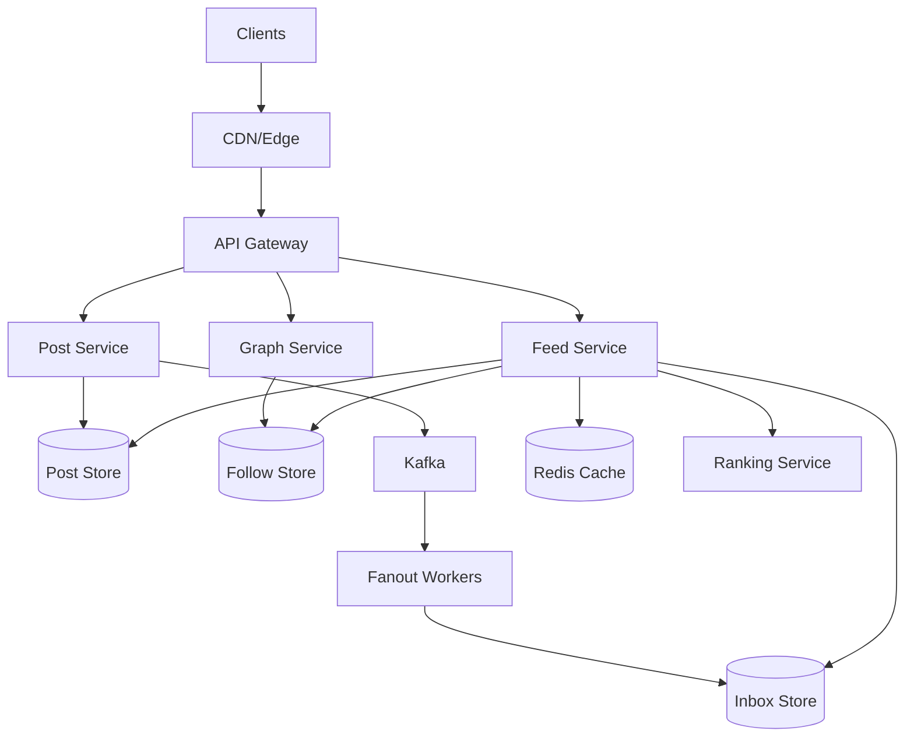
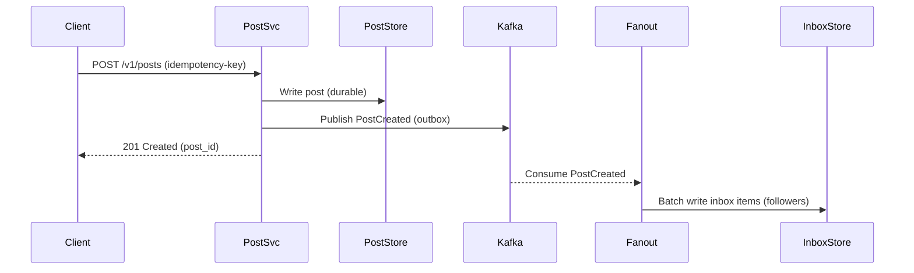
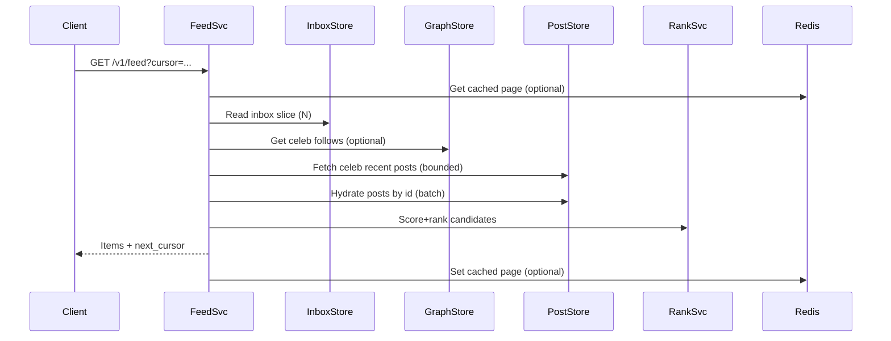

## Overview

A social news feed must feel instant and relevant while handling extreme skew: most users have modest follower graphs, but a small fraction (“celebrities”, brands) can have tens of millions of followers. This skew breaks a one-size-fits-all approach—pure fan-out-on-write (push) becomes prohibitively expensive for high-fanout authors, while pure fan-out-on-read (pull) can’t meet low-latency feed reads at scale.

The key insight is a **hybrid feed**: push (fan-out-on-write) for the long tail of authors and pull (fan-out-on-read) for high-fanout authors, combined into a single timeline via a feed service that merges **precomputed inbox items** with **on-demand candidates**. The system also separates **candidate generation** from **ranking**, letting us iterate on relevance without rewriting the storage/fanout model.

Production readiness requires: (1) asynchronous pipelines (Kafka) with backpressure, (2) tiered storage and caching (Redis + wide-column store), (3) strict idempotency and ordering strategy, and (4) clear fallbacks when fanout lags.

## Requirements

### Functional Requirements
- Users can create posts (text/media) and have them appear in followers’ feeds.
- Users can follow/unfollow, block/mute, and these relationships affect feed visibility.
- Feed reads return a ranked list of items with pagination/cursors (infinite scroll).
- The feed supports freshness and relevance signals (recency, engagement, personalization).
- The system deduplicates items and avoids showing deleted/blocked content.
- Users can mark items as seen; the system can down-rank repeats and maintain session continuity.
- The system supports “celebrity” accounts efficiently without overwhelming infrastructure.
- Admin/moderation can remove content globally and it disappears from feeds quickly.

### Non-Functional Requirements
- **Scale**:
  - 50M DAU, 200M MAU
  - Peak feed reads: 300K QPS (global), average 80K QPS
  - Post writes: 20K QPS peak
  - Follow/unfollow: 10K QPS peak
  - Data: 10B posts, 5T feed impressions/year
- **Latency**:
  - Feed read P50 80ms, P99 250ms (server-side)
  - Post create P50 120ms, P99 400ms (ack after durable write, async fanout)
- **Availability**:
  - Feed read: 99.99%
  - Post create/follow: 99.95%
- **Consistency**:
  - Strong for: post creation durability, follow/unfollow acceptance (authoritative graph)
  - Eventual for: feed propagation, ranking signals, cache invalidation
- **Durability**:
  - Posts: zero acknowledged loss (RPO≈0 for acknowledged writes)
  - Feed inbox materialization: can rebuild (RPO minutes acceptable)

### Constraints & Assumptions
- Single product feed (home timeline), not ads marketplace design (ads can be injected later).
- Small team (6–10 engineers): prefer managed components where possible.
- Compliance: GDPR delete; basic audit logging; region-aware storage optional.
- Ranking iteration is frequent; storage/fanout should not require schema rewrites per model change.

## High-Level Architecture



The system splits into (1) synchronous user-facing APIs (post, graph, feed), (2) an async event bus for propagation, and (3) storage optimized for different access patterns: posts by ID/time, follows by user, inbox timelines by user. For most authors, we “push” post references into follower inboxes asynchronously; for celebrity authors, we avoid pushing to all followers and instead “pull” their recent posts during feed reads.

This hybrid structure keeps feed reads fast (most items come from inbox) while bounding write amplification. It also supports operational safety: if fanout lags, the feed service can temporarily increase pull coverage and still serve fresh content.

## Component Deep-Dive

### Feed Service

**Responsibility**: Serve home timeline by merging push-based inbox items with pull-based candidates, applying ranking, pagination, filtering (blocks/mutes), and dedup.

**Key Design Decisions**:
- Hybrid merge: `InboxItems(user)` + `PulledPosts(celebsFollowedByUser)` with dedup by `post_id`.
- Two-stage pipeline: candidate generation (fast, recall-focused) then ranking (model-driven).

**Technology Choice**: Stateless service (Go/Java), Redis for hot caches, gRPC to ranking service, wide-column inbox store (Cassandra/ScyllaDB/DynamoDB).

**Scaling Strategy**: Horizontal autoscaling on QPS; shard by user_id in inbox store; aggressive caching of first page; degrade ranking to rule-based under load.

### Fanout Workers (Inbox Builder)

**Responsibility**: Consume post events and fan-out-on-write to follower inboxes for non-celebrity authors; manage backpressure and retries.

**Key Design Decisions**:
- Celebrity thresholding: classify authors into tiers by follower count + posting rate; only tiers 0–1 are pushed.
- Idempotent writes: inbox rows keyed by `(user_id, sort_key)` with de-dup token `(author_id, post_id)`.

**Technology Choice**: Kafka consumers + worker fleet; write to Cassandra/ScyllaDB (or DynamoDB) with TTL support for older inbox items.

**Scaling Strategy**: Partition Kafka by `author_id` to preserve per-author ordering; scale workers by lag; apply rate limits per partition to protect inbox store.

### Post Service

**Responsibility**: Handle post creation, edits/deletes, media attachment metadata, and emit immutable post events.

**Key Design Decisions**:
- Append-only post record + separate moderation/deletion state to avoid in-place mutations breaking caches.
- Durable write before publish: write to post store, then produce Kafka event with outbox pattern.

**Technology Choice**: Post metadata in Cassandra/ScyllaDB (time-series friendly) or MySQL + sharding; media in object storage (S3/GCS) with CDN.

**Scaling Strategy**: Partition posts by `author_id`; cache post lookups by ID in Redis; batch hydration in feed reads.

### Graph Service (Follows/Blocks/Mutes)

**Responsibility**: Authoritative follow graph operations and queries for fanout and feed read paths.

**Key Design Decisions**:
- Dual adjacency lists: `followers_of(author)` for fanout; `following_of(user)` for pull candidates.
- Strong-ish semantics for follow/unfollow: linearizable per edge to avoid “phantom” content; eventual propagation to feed is acceptable.

**Technology Choice**: Wide-column store (Cassandra/ScyllaDB/DynamoDB) or a sharded relational store; cache follower counts and “is-celebrity” tier.

**Scaling Strategy**: Shard by `user_id`; paginate follower lists; precompute/maintain follower counts asynchronously.

### Ranking Service

**Responsibility**: Score and order candidate posts using features (recency, affinity, engagement, quality, negative signals).

**Key Design Decisions**:
- Online scoring with bounded feature fetches; fallback to heuristic rank if feature services time out.
- Feature store split: real-time counters (Redis/KeyDB) + batch embeddings (offline store).

**Technology Choice**: gRPC service, model served via ONNX/TensorRT or JVM-based model server; feature store in Redis + column store.

**Scaling Strategy**: Stateless replicas; strict timeouts (e.g., 20–40ms budget); circuit breakers to protect feed latency.

## Data Model

### Storage Schema

**Post Store (Cassandra/ScyllaDB)**
- `posts_by_id`
  - `post_id (PK)`
  - `author_id`
  - `created_at`
  - `content_ref` (text blob pointer / document id)
  - `media_refs[]`
  - `visibility` (public/followers/private)
  - `state` (active/deleted/moderated)
  - `version`
- `posts_by_author_time`
  - `author_id (PK)`
  - `created_at (CK desc)`
  - `post_id`
  - `state`

**Follow Store**
- `following_by_user`
  - `user_id (PK)`
  - `followed_id (CK)`
  - `created_at`
  - `state` (active/muted/blocked)
- `followers_by_user`
  - `user_id (PK)` (this is the author)
  - `follower_id (CK)`
  - `created_at`
  - `state`

**Inbox Store (materialized timeline)**
- `inbox_by_user`
  - `user_id (PK)`
  - `sort_key (CK desc)` (e.g., `event_time + tiebreaker`)
  - `post_id`
  - `author_id`
  - `event_time`
  - `source` (push/pull_backfill)
  - `dedup_key` (author_id:post_id)
  - TTL: optional (e.g., keep 30–90 days)

**Seen/Session State (optional)**
- `seen_by_user_day`
  - `user_id (PK)`
  - `day (CK)`
  - `post_ids_bloom` or compact set (bounded)

### Data Flow

**Post create (write path)**


**Feed read (hybrid merge)**


## API Design

### Create Post
- `POST /v1/posts`
- Headers: `Idempotency-Key: <uuid>`
- Request:
  ```json
  { "text": "string", "media_ids": ["string"], "visibility": "public" }
  ```
- Response `201`:
  ```json
  { "post_id": "p_123", "created_at": "2025-12-17T12:00:00Z" }
  ```
- Errors:
  - `400` invalid payload, `401/403` auth/visibility, `409` idempotency conflict, `429` rate limited
- Idempotency: store `(user_id, idempotency_key) -> post_id` for 24h+

### Follow/Unfollow
- `PUT /v1/users/{user_id}/following/{target_id}`
- `DELETE /v1/users/{user_id}/following/{target_id}`
- Response `204`
- Errors: `404` target missing, `409` blocked, `429` rate limited
- Consistency: follow edge write is authoritative immediately; feed propagation eventual.

### Get Feed
- `GET /v1/feed?cursor=<opaque>&limit=30`
- Response `200`:
  ```json
  {
    "items": [
      { "post_id": "p_123", "author_id": "u_9", "created_at": "…", "text": "…", "media": [] }
    ],
    "next_cursor": "opaque_string",
    "server_time": "…"
  }
  ```
- Error handling:
  - `503` if ranking hard-down (but prefer degraded ranking + `200`)
- Cursor design:
  - Opaque cursor encodes `(last_sort_key, last_post_id, mix_state)` and is HMAC-signed.
- Dedup:
  - Feed service dedups by `post_id` across inbox and pulled candidates within page window.

### Mark Seen (optional)
- `POST /v1/feed/seen`
- Request:
  ```json
  { "post_ids": ["p_1","p_2"], "seen_at": "…" }
  ```
- Response `204`
- Best-effort: eventual updates; used for ranking/UX.

## Scaling & Performance

### Bottleneck Analysis
- **Fanout amplification**: a single post can require millions of inbox writes.
  - Mitigation: celebrity pull tier; batch writes; async workers; backpressure on Kafka lag.
- **Feed hydration** (N posts → N DB reads):
  - Mitigation: batch `posts_by_id` fetch; Redis cache for popular posts; request coalescing.
- **Ranking latency**:
  - Mitigation: strict timeouts; precomputed lightweight features; fallback heuristic (recency + affinity).
- **Hot keys** (celebrity posts / popular users):
  - Mitigation: cache by `post_id`; shard caches; CDN for media; avoid per-follower writes for celebs.

### Horizontal Scaling
- **API layer**: stateless, autoscale; rate limit at gateway.
- **Kafka**: partition by `author_id`; scale partitions to match peak throughput; replicate across AZs.
- **Inbox store**: shard by `user_id`; wide partitions bounded by TTL and page size; compaction tuned for time-series.
- **Graph store**: shard by `user_id`; paginate follower scans; cache counts and celeb tier.
- **Post store**: partition by `author_id` and/or `post_id`; batch reads for feed.

**Partitioning strategy**
- `user_id`-based sharding for inbox and follow adjacency lists.
- `author_id`-based ordering guarantees for post streams, preserving “author timeline” monotonicity.

### Caching Strategy
- **Redis**
  - Cache first feed page per user for 10–30s (short TTL) to absorb refresh storms.
  - Cache `post_id -> hydrated post` for 1–10 minutes (longer for trending).
  - Cache `celebrity_following(user)` for 1–5 minutes.
- **Invalidation**
  - Prefer TTL + soft invalidation; explicit invalidation on delete/moderation events for affected `post_id`.
- **Stale-while-revalidate**
  - Serve cached feed page if ranking is slow; async refresh.

## Trade-offs & Alternatives

### Key Trade-offs Made
- **Hybrid push/pull chosen**
  - Sacrifice: added complexity in merging/dedup and correctness edges
  - Benefit: bounded write amplification + low-latency reads for most users
- **Eventual feed consistency**
  - Sacrifice: a new post may appear with delay (seconds to minutes under load)
  - Benefit: resilient async pipeline; higher availability
- **Materialized inbox with TTL**
  - Sacrifice: storage overhead; rebuild logic required
  - Benefit: fast reads; predictable latency
- **Ranking service with strict timeout**
  - Sacrifice: occasionally less personalized ordering
  - Benefit: protects tail latency and availability

### Alternative Approaches
- **Pure fan-out-on-write for everyone**
  - Not chosen: infeasible for celebrity fanout costs and storage write IOPS.
- **Pure fan-out-on-read**
  - Not chosen: feed reads become expensive (many authors queried), hard to hit P99 under peak.
- **Precomputed personalized feed (offline)**
  - Not chosen: great for relevance, but poor freshness and high operational complexity; still needs online fixes.

## Failure Modes & Mitigations

### Failure Scenarios
- **Kafka lag/backlog**
  - Impact: delayed feed propagation for push tier
  - Detection: consumer lag metrics, inbox write latency
  - Mitigation: autoscale workers, shed low-priority fanout, temporarily expand pull coverage in FeedSvc
- **Inbox store partial outage**
  - Impact: feed reads fail/slow for many users
  - Detection: elevated read errors/latency by shard/AZ
  - Mitigation: multi-AZ replication, fallback to pull-only for recent window, serve cached pages
- **Ranking service outage**
  - Impact: slower feed or errors
  - Detection: gRPC error rate, timeout rate
  - Mitigation: circuit breaker + heuristic ranking, reduce feature fetches
- **Graph inconsistency (follow edge delay)**
  - Impact: user sees/unsees some content temporarily
  - Detection: reconciliation jobs, user reports
  - Mitigation: read-your-writes cache for follow edges; prioritize graph writes; recompute inbox on edge changes for active users
- **Delete/moderation propagation delay**
  - Impact: policy breach if removed content still shows
  - Detection: moderation SLA metrics
  - Mitigation: synchronous check on hydration (`state!=active` filtered), push invalidation event for `post_id` caches

### Disaster Recovery
- **Targets**: RTO 30 minutes, RPO 5 minutes (posts), RPO 30 minutes (inbox)
- **Backups**: daily full + incremental (graph/post stores), Kafka topic retention 3–7 days for replay
- **Failover**: multi-AZ active-active within region; optional warm-standby region with async replication; replay Kafka to rebuild inbox.

## Operational Considerations

### Monitoring & Alerting
- Feed: QPS, P50/P99 latency, error rate, cache hit rate, timeouts to ranking/DB
- Kafka: consumer lag, rebalance rate, produce/consume throughput, under-replicated partitions
- Stores: read/write latency, partition hot-spotting, compaction backlog, disk utilization
- Correctness: dedup rate, missing-content rate (sampled), delete enforcement latency
- Alerts (examples):
  - FeedSvc P99 > 300ms for 5m
  - Kafka lag > 2 minutes for push tier
  - Inbox read error rate > 0.5% for 1m

### Deployment Strategy
- Blue/green or canary per service (5% → 25% → 100%), feature flags for ranking models
- Schema changes: backward-compatible, dual-read/dual-write when needed
- Rollback: fast revert of service + disable new ranking model via flag; Kafka consumers can be paused safely

## References & Further Reading
- Twitter: “Timelines at Scale” (fanout, hybrid timelines)
- Facebook: TAO and feed-related scaling talks (graph + caching patterns)
- Kafka design and exactly-once/outbox patterns: Confluent documentation
- Cassandra/Scylla data modeling for time-series and wide rows: official docs and “DataStax modeling guide”
- “The Tail at Scale” (Jeff Dean) for P99-centric design