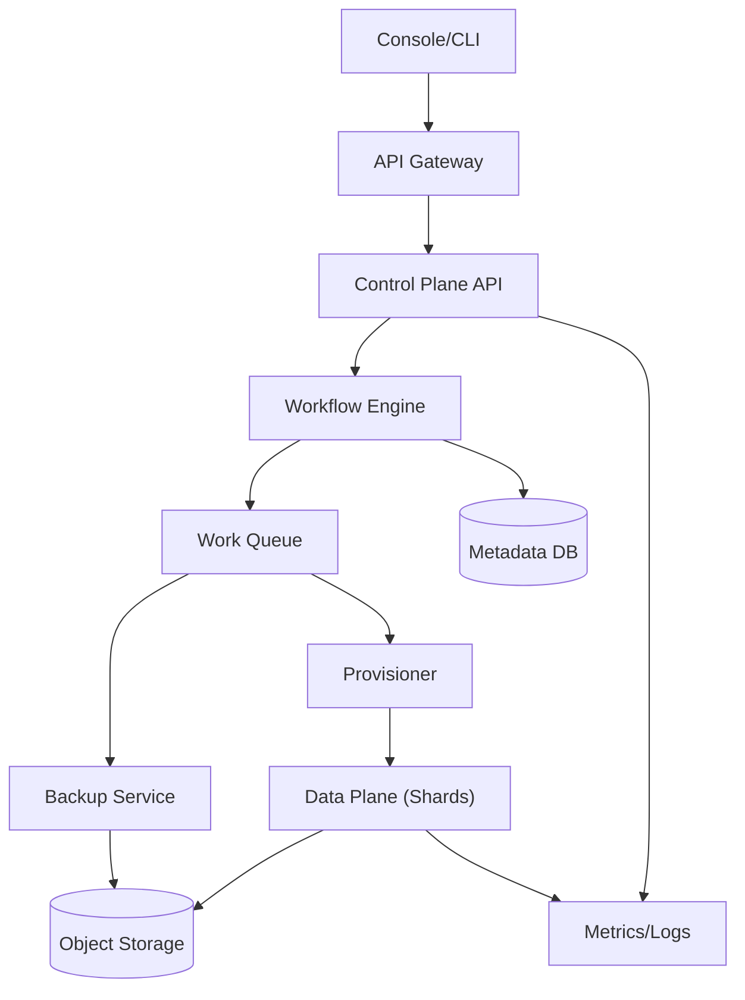
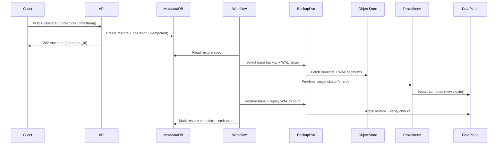

## Overview

A sharded SQL DBaaS control plane must reliably translate high-level intents (“create a 4-shard Postgres cluster with HA and PITR”) into thousands of low-level, failure-prone actions across compute, networking, storage, and orchestration layers—while keeping tenants isolated and operations auditable. The hard part isn’t creating databases; it’s making provisioning, failover, backups, and restores *deterministic, observable, and safe* under partial failures, retries, and concurrent changes.

The key insight is to treat every lifecycle change as a durable, idempotent workflow driven by a strongly consistent metadata model. The control plane becomes a state machine: desired state is recorded once, a workflow engine reconciles it into the data plane, and every step emits events/metrics for operators and users. Backups and point-in-time restore (PITR) are first-class resources with cryptographic integrity checks and explicit retention/immutability policies.

## Requirements

### Functional Requirements
- Provision new sharded SQL clusters for a tenant (configurable shard count, instance sizes, regions/AZs).
- Manage shard topology: add/remove shards, reshard/migrate key ranges, and update routing config with minimal downtime.
- Provide high availability: automatic primary election, replica management, and controlled failover/failback per shard.
- Automate backups: scheduled full backups plus continuous WAL/binlog shipping for PITR within a retention window.
- Support restores: full restore to a new cluster and PITR restore to a specific timestamp/LSN, with validation and cutover tooling.
- Expose cluster lifecycle operations as async tasks (create/scale/backup/restore) with status, progress, and audit history.
- Enforce tenancy isolation: per-tenant quotas, network boundaries, encryption keys, and RBAC.
- Offer observability hooks: health, events, metrics, and configuration drift detection.

### Non-Functional Requirements
- **Scale**:
  - 10k tenants, 50k clusters, 400k shard replicas (avg 4 shards/cluster, 2 replicas/shard).
  - API traffic: ~2k RPS reads (status/list), ~200 RPS writes (ops), bursts to 1k RPS writes during incidents.
  - Backup data: 2–10 PB total in object storage; WAL ingestion 10–100 GB/min fleet-wide.
- **Latency**:
  - Control plane reads (cluster status): P50 50ms, P99 200ms.
  - Operation submission (create/restore request): P50 150ms, P99 500ms.
  - Provisioning completion: minutes (SLO: P95 create < 15 min for median-sized cluster).
- **Availability**:
  - Control plane API: 99.99% (multi-AZ).
  - Workflow execution: 99.9% (degraded mode acceptable; no data loss).
- **Consistency**:
  - Strong consistency for metadata, operation state, and routing/versioned configs.
  - Eventual consistency for metrics/logs and aggregated health rollups.
- **Durability**:
  - Metadata RPO: 0 for committed operations (sync replication).
  - Backups/WAL: no silent corruption; allow up to 5 minutes of restore unavailability if object store is degraded.

### Constraints & Assumptions
- Runs on Kubernetes in each region; data plane nodes are Kubernetes StatefulSets or VM instances.
- Compliance target: SOC2; optional HIPAA/GDPR modes (encryption, audit logs, retention controls).
- Small platform team (6–10 engineers): prefer proven building blocks (Temporal, Postgres, object storage).
- Network access to object storage is reliable but not perfect; restores must handle missing/corrupt segments.
- Tenants are untrusted; all operations require authn/z + quotas + rate limits.

## High-Level Architecture

The control plane is split into an API layer and a workflow layer. The API is responsible for authentication, authorization, validation, quota checks, and *recording intent* (desired state + an operation). The workflow engine executes long-running, retryable state machines (provision, reshard, backup, restore) and writes authoritative state transitions into a strongly consistent metadata store.

The data plane is intentionally treated as “eventually convergent”: agents/provisioners apply changes to shard primaries/replicas, routing/proxy config, and backup pipelines. All data plane actions are idempotent and keyed by operation IDs and config versions, enabling safe retries after crashes, network partitions, or partial completion.

## Component Deep-Dive

### Control Plane API
**Responsibility**: Tenant-facing APIs for cluster lifecycle, topology, backups/restores, and status.

**Key Design Decisions**:
- Use async operations (`operation_id`) for all mutating actions to avoid timeouts and simplify retries.
- Version every config/routing change and require optimistic concurrency (`etag`/`resource_version`) to prevent lost updates.

**Technology Choice**: Go/Java service behind an API gateway; REST + JSON (or gRPC internally); OIDC/JWT for auth.

**Scaling Strategy**: Stateless horizontal scaling; hot-path reads served via read replicas + cache; rate limiting per tenant.

### Workflow Engine (Orchestrator)
**Responsibility**: Durable execution of long-running workflows (create, reshard, failover, backup, restore), with retries and compensation.

**Key Design Decisions**:
- Model operations as explicit state machines with step-level checkpoints and deterministic replays.
- Separate “desired state” writes (API) from “actuation” (workflows) to keep intent durable even if workers are down.

**Technology Choice**: Temporal (or Cadence) for durable workflows; alternatively a custom reconciler with a work queue.

**Scaling Strategy**: Scale workers by task queue (provisioning vs backups vs restores); shard task queues per region and tenant tier.

### Provisioner / Actuator
**Responsibility**: Applies metadata-driven changes to the data plane: node creation, config push, shard bootstrapping, routing updates.

**Key Design Decisions**:
- Use declarative apply (desired spec → actual) and idempotent actions keyed by `(cluster_id, shard_id, config_version)`.
- Require readiness gates before promoting primaries or cutting over routing.

**Technology Choice**: Kubernetes operators/controllers (CRDs) or VM agents + an actuator service; strong preference for controller patterns.

**Scaling Strategy**: Partition by region and cluster; backpressure via queues; concurrency limits per tenant to protect neighbors.

### HA Manager (Per-Shard)
**Responsibility**: Detect failures, coordinate primary election, manage replication topology, and perform controlled failovers.

**Key Design Decisions**:
- Use a single authority for shard primary (e.g., Patroni/etcd, or a DB-native mechanism) to avoid split-brain.
- Rate-limit and dampen failovers (anti-flap) and require replication lag thresholds for promotion.

**Technology Choice**: For Postgres: Patroni + etcd/Consul; for MySQL: Orchestrator/MHA; for sharding/proxy: Vitess.

**Scaling Strategy**: Run per shard group; isolate failure domains by AZ; keep control plane “hands-off” during fast failover.

### Backup & PITR Service
**Responsibility**: Schedule full backups, continuously archive WAL/binlogs, track restore points, and drive restore workflows.

**Key Design Decisions**:
- Store backups as immutable objects with checksums, manifest files, and periodic verification restores.
- Track WAL segments with completeness and continuity checks; enforce retention by policy and legal hold.

**Technology Choice**: Object storage (S3/GCS/Azure Blob) + backup tooling (pgBackRest/WAL-G, xtrabackup); metadata in control plane DB.

**Scaling Strategy**: Separate ingest (WAL) from compaction/verification; per-region workers; prioritize restores during incidents.

## Data Model

### Storage Schema

**`tenants`**
- `tenant_id` (PK), `name`, `plan`, `quota_limits`, `kms_key_ref`, `created_at`

**`clusters`**
- `cluster_id` (PK), `tenant_id` (FK), `name`, `engine` (postgres/mysql), `region`, `status`
- `desired_spec` (JSON), `observed_state` (JSON), `resource_version`, `created_at`, `deleted_at`

**`shards`**
- `shard_id` (PK), `cluster_id` (FK), `key_range`/`hash_slot_range`, `status`, `resource_version`

**`nodes`**
- `node_id` (PK), `shard_id` (FK), `az`, `role` (primary/replica), `endpoint`, `instance_type`
- `replication_lag_ms`, `health`, `last_heartbeat_at`

**`backups`**
- `backup_id` (PK), `cluster_id` (FK), `type` (full/incremental), `base_backup_id`, `started_at`, `completed_at`
- `object_manifest_uri`, `checksum`, `status`, `expires_at`

**`wal_segments`** (or `binlog_segments`)
- `segment_id` (PK), `cluster_id` (FK), `timeline`, `start_lsn`, `end_lsn`, `object_uri`, `checksum`, `created_at`

**`restores`**
- `restore_id` (PK), `source_cluster_id`, `target_cluster_id`, `restore_point` (timestamp/LSN)
- `status`, `started_at`, `completed_at`, `validation_report_uri`

**`operations`**
- `operation_id` (PK), `tenant_id` (FK), `resource_type`, `resource_id`, `type`
- `idempotency_key`, `status`, `error_code`, `error_message`, `started_at`, `updated_at`

**`events`**
- `event_id` (PK), `tenant_id`, `cluster_id`, `severity`, `message`, `actor`, `created_at`

### Data Flow

## API Design

All mutating APIs are async and return an `operation_id`. Clients poll `GET /v1/operations/{operation_id}` or subscribe to events.

### Create Cluster
- `POST /v1/clusters`
- Request:
  - `name`, `engine`, `region`
  - `shards`: `{ count, shard_key, strategy }`
  - `ha`: `{ replicas_per_shard, failover_mode }`
  - `backup`: `{ full_schedule_cron, pitr_retention_hours }`
- Response: `202 { cluster_id, operation_id }`
- Errors:
  - `409` if `idempotency_key` reused with different payload
  - `429` quota/rate limit, `403` RBAC, `400` validation

**Idempotency**: Require `Idempotency-Key` header; store hash of request body in `operations`.

### Get Cluster Status
- `GET /v1/clusters/{cluster_id}`
- Response includes `status`, `endpoint`, `shard_count`, `primary_azs`, `backup_health`, `resource_version`

### Trigger Backup
- `POST /v1/clusters/{cluster_id}/backups`
- Request: `{ type: "full" | "incremental" }`
- Response: `202 { backup_id, operation_id }`

### PITR Restore
- `POST /v1/clusters/{cluster_id}/restores`
- Request:
  - `restore_type`: `"pitr"`
  - `target`: `{ new_cluster_name, region }`
  - `restore_point`: `{ timestamp }` (or `{ lsn }`)
- Response: `202 { target_cluster_id, restore_id, operation_id }`
- Safety:
  - Reject timestamps outside retention window
  - Require explicit confirmation for cross-region restores if data residency applies

### Operation Status
- `GET /v1/operations/{operation_id}`
- Response: `{ status, step, progress_pct, started_at, updated_at, error }`

## Scaling & Performance

### Bottleneck Analysis
- **Metadata DB write contention**: high during incidents (failovers + user ops).
  - Mitigate with batching, reduced write amplification (append-only events), and partitioning by `tenant_id`.
- **Workflow backlog** (provision/restore storms):
  - Mitigate with priority queues (restores > failovers > creates), per-tenant concurrency caps, and autoscaling workers.
- **Object storage throttling** during fleet-wide restores:
  - Mitigate with request shaping, regional fan-out limits, caching hot WAL indices, and parallelism caps per restore.

### Horizontal Scaling
- **API**: stateless; scale behind L7 load balancer; cache cluster status summaries.
- **Workflow workers**: scale per task queue; isolate by region; use separate pools for CPU-heavy verification jobs.
- **Provisioner**: shard by cluster/region; enforce backpressure and tenant fairness.
- **Metadata DB**: primary + read replicas; partition large tables (`events`, `wal_segments`) by time and tenant; plan for multi-region active/passive.

### Caching Strategy
- Cache `GET /clusters/{id}` summaries in Redis for 5–15s; invalidate via pub/sub on `resource_version` changes.
- Cache “restore point availability” indices (latest WAL per cluster) for 30s to reduce object store listing pressure.
- Never cache authz decisions beyond token lifetime; always enforce quotas on write paths.

## Trade-offs & Alternatives

### Key Trade-offs Made
- **Chosen**: Strongly consistent metadata + durable workflows  
  **Sacrificed**: Complexity/operational overhead of a workflow engine  
  **Why**: Makes retries safe and restores deterministic; minimizes human intervention during partial failures.
- **Chosen**: Per-shard HA manager (Patroni/Orchestrator/Vitess patterns)  
  **Sacrificed**: A single unified HA algorithm in the control plane  
  **Why**: Faster failover paths and proven correctness reduce split-brain risk.
- **Chosen**: Immutable backup objects + verification restores  
  **Sacrificed**: Extra storage and compute costs  
  **Why**: PITR without verification is a false promise; integrity is non-negotiable in production.

### Alternative Approaches
- **Distributed SQL (CockroachDB/Yugabyte)**: avoids manual sharding, but changes the product (SQL semantics, cost model, operational profile).
- **Pure Kubernetes Operator control plane (CRDs only)**: simpler surface area, but harder to model async operations, idempotency, and multi-region metadata guarantees without an additional state store.
- **Managed single-tenant RDS-style clusters**: easier HA/backup, but doesn’t satisfy “sharded databases” and limits elasticity for large tenants.

## Failure Modes & Mitigations

### Failure Scenarios
- **Scenario**: Workflow engine outage  
  **Impact**: New operations stall; existing data plane keeps running  
  **Detection**: Queue depth rising, operation age SLO breach  
  **Mitigation**: Multi-AZ deployment; durable task queues; API continues to accept intent if metadata DB is healthy.
- **Scenario**: Metadata DB failover or corruption  
  **Impact**: Control plane unable to safely act; risk of conflicting operations  
  **Detection**: DB health checks, replication lag, checksum/audit anomalies  
  **Mitigation**: Synchronous replication, PITR for metadata DB, write freezes on inconsistency, periodic backups + restore drills.
- **Scenario**: Split-brain primary in a shard  
  **Impact**: Data divergence, potential data loss on reconciliation  
  **Detection**: Dual-primary detection via consensus store/lease, replication topology anomalies  
  **Mitigation**: Lease-based primaries, fencing tokens, forced demotion, and client routing pinned to elected primary.
- **Scenario**: Backup/WAL gaps (missing segments)  
  **Impact**: PITR not possible beyond last continuous segment  
  **Detection**: Continuity checks on ingest; alert on missing LSN ranges  
  **Mitigation**: Multi-destination archiving, retries with exponential backoff, segment quorum policy before acknowledging “PITR healthy”.
- **Scenario**: Restore to wrong timestamp / unsafe cutover  
  **Impact**: User-visible correctness incident  
  **Detection**: Restore validation reports, checksum comparisons, optional app-level verification hooks  
  **Mitigation**: Require explicit restore point confirmation; staged cutover with read-only validation; immutable audit trail.

### Disaster Recovery
- **RTO/RPO**:
  - Control plane: RTO 1 hour, RPO 5 minutes (metadata DB PITR).
  - Data plane: RTO 4 hours for large restores; RPO 0 within region (WAL), cross-region RPO configurable (0–15 min).
- **Backup strategy**:
  - Daily full + frequent incrementals; continuous WAL/binlog archiving; retention tiers (e.g., 7/30/90 days).
  - Quarterly restore drills (random clusters) and monthly integrity scans (manifest + checksum).
- **Failover procedures**:
  - Control plane: promote standby metadata DB, restart workflow workers, reconcile pending operations.
  - Data plane: per-shard HA handles fast failover; control plane reconciles routing and rebalances after stabilization.

## Operational Considerations

### Monitoring & Alerting
- Key metrics:
  - API: RPS, error rate, authz failures, P99 latency
  - Workflows: queue depth, oldest task age, success/failure by step, retry counts
  - Provisioning: time-to-ready, failure reasons by provider/AZ
  - Backups: backup success rate, WAL lag, continuity gaps, restore verification pass rate
  - HA: failovers/hour, replication lag, split-brain detections
- Alert thresholds:
  - Oldest critical workflow task age > 5 min
  - Backup failure rate > 1% over 1 hour or any cluster with PITR unhealthy > 10 min
  - Metadata DB replication lag > 2s sustained, or write errors > 0.1%

### Deployment Strategy
- Blue/green or canary for API and workers; feature flags for new workflow steps.
- Backward-compatible schema migrations (expand/contract) with `resource_version` gating.
- Rollback:
  - API: revert deployment; keep migrations compatible
  - Workflows: version workflows explicitly; never replay incompatible histories without a migration path.

## References & Further Reading
- Vitess (sharding + routing): `https://vitess.io/`
- Temporal (durable workflows): `https://temporal.io/`
- Patroni (Postgres HA): `https://patroni.readthedocs.io/`
- pgBackRest and WAL-G (backup/PITR): `https://pgbackrest.org/`, `https://github.com/wal-g/wal-g`
- AWS RDS/Aurora operational concepts (backups, restores, control planes): `https://docs.aws.amazon.com/rds/`
- Designing data-intensive applications (state machines, consistency trade-offs): Martin Kleppmann