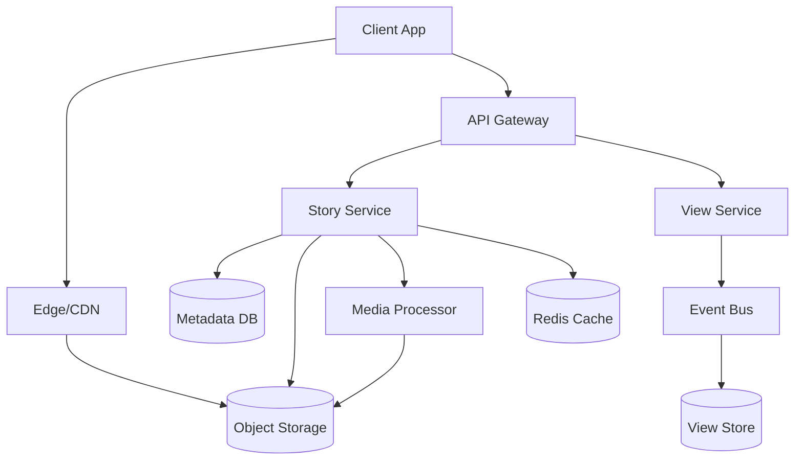
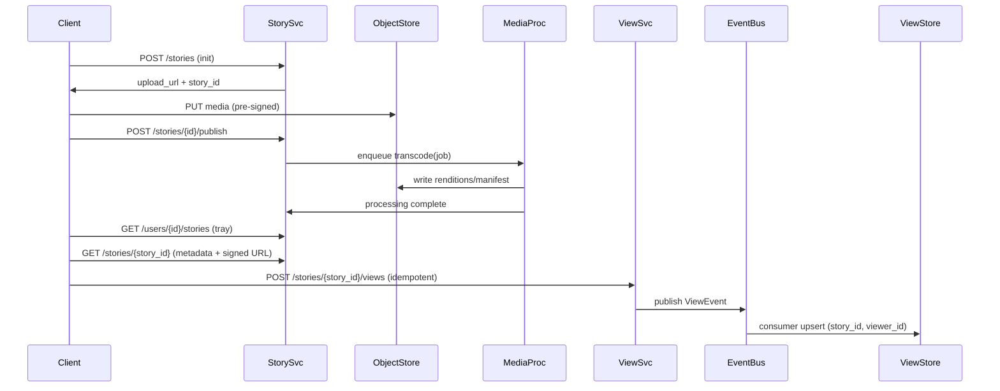

## Overview

Stories are short-lived (24-hour) media posts that sit at the intersection of media delivery (high bandwidth, low latency), social graphs (privacy + relationship-aware access), and event tracking (viewer lists). The core challenge is delivering fast story playback at scale while keeping privacy enforcement correct and keeping viewer lists accurate enough to feel “real-time” without turning every view into a synchronous, strongly-consistent write.

A production-grade design treats Stories as two planes: (1) **media delivery**, optimized for throughput and latency via object storage + CDN and (2) **metadata + events**, optimized for high QPS reads/writes via a low-latency key/value or wide-column store plus an event pipeline. Expiration is best implemented with **TTL/lifecycle policies** at the storage layer (not application cron jobs), with a small “grace window” to handle clock skew and retries.

Key insight: optimize the critical read path (fetch story tray + play media) with caching and precomputation, while making view tracking **asynchronous and idempotent** so the system can absorb spikes and still provide near-real-time viewer lists.

## Requirements

### Functional Requirements
- Users can create a story (photo/video), optionally with captions/stickers, and publish it.
- Stories expire automatically after 24 hours and are no longer viewable after expiration.
- Viewers can watch stories and the author can see a viewer list per story (with timestamps).
- Privacy controls per story: public, followers/friends, close friends, and custom allow/deny lists.
- Users can delete a story early; it becomes unavailable immediately.
- Users can fetch a “story tray” (which followed users have active stories) and then fetch/play each story.
- Basic abuse/report hooks: ability to flag story content and temporarily disable distribution.

### Non-Functional Requirements
- **Scale**:
  - 50M DAU, 10M story creators/day
  - Peak reads (tray + story metadata): 300K QPS
  - Peak media segment requests: 5–20M RPS at CDN edge
  - Peak view events: 1–3M QPS
  - Storage/day: 10–50 TB raw media (before CDN)
- **Latency**:
  - Story tray fetch: P50 50ms, P99 200ms
  - Story metadata fetch: P50 30ms, P99 120ms
  - View event acknowledgment: P50 20ms, P99 80ms (async persistence)
  - Media start time (with CDN): P50 <300ms, P95 <800ms
- **Availability**: 99.99% for read paths, 99.9% for write paths (publishing).
- **Consistency**:
  - Strong consistency for auth (token validation) and story deletion enforcement.
  - Eventual consistency acceptable for viewer lists (seconds-level), counters, tray freshness (up to ~1 minute).
- **Durability**:
  - Media: “11 9s” object storage durability; no data loss for published stories within TTL.
  - Metadata/events: tolerate at most a few seconds of viewer-list lag; avoid losing view events (at-least-once + idempotency).

### Constraints & Assumptions
- Mobile-first clients; web supported.
- Global footprint; multi-region active-active reads, region-local writes preferred.
- Team can operate Kafka (or equivalent), Redis, and a scalable NoSQL store (DynamoDB/Cassandra).
- Compliance: basic audit logs; GDPR delete requests apply to user data beyond story TTL (viewer lists may need shorter retention).

## High-Level Architecture

This architecture separates **media** (object storage + CDN) from **metadata and events** (services + databases). The Story Service owns story lifecycle, privacy policy storage, and read APIs. Media Processor handles transcoding and thumbnail generation asynchronously so publishing can be fast and resilient.

View tracking is handled by a dedicated View Service and an event bus to decouple high-QPS view writes from user-facing reads. Viewer lists are served from a specialized View Store, updated asynchronously but idempotently, allowing the system to handle bursts without degrading playback.

## Component Deep-Dive

### Story Service

**Responsibility**: Create/publish/delete stories; serve tray and story metadata; enforce privacy at read time; generate media URLs.

**Key Design Decisions**:
- Store story metadata in a TTL-capable NoSQL store to make 24-hour expiry automatic and scalable.
- Use pre-signed upload URLs to object storage to keep media bytes off the API tier.

**Technology Choice**: Go/Java service behind API Gateway; DynamoDB (TTL) or Cassandra (TTL) for metadata; Redis for caching.

**Scaling Strategy**: Stateless service with horizontal autoscaling; shard metadata by `author_id` for write locality and by `story_id` for direct reads.

---

### Media Processor

**Responsibility**: Transcode videos to adaptive bitrate (HLS/DASH), generate thumbnails, run lightweight safety checks, and write outputs to object storage.

**Key Design Decisions**:
- Asynchronous processing via queue to avoid coupling publish latency to transcode time.
- Produce multiple renditions to optimize playback on variable networks.

**Technology Choice**: Worker fleet (Kubernetes), FFmpeg-based pipeline, queue (Kafka/SQS/PubSub), object storage (S3/GCS), optional content scanning service.

**Scaling Strategy**: Autoscale workers by queue depth and processing time; isolate “large video” workloads into separate queues.

---

### View Service

**Responsibility**: Accept view events, enforce basic constraints (auth, story existence), deduplicate, and update viewer lists/counters.

**Key Design Decisions**:
- At-least-once ingestion with idempotent writes keyed by `(story_id, viewer_id)` to prevent double-counting.
- Async persistence so the playback path doesn’t block on database writes.

**Technology Choice**: Stateless service; Kafka (or Kinesis/PubSub) for event bus; Redis optional for hot dedupe; View Store in Cassandra/DynamoDB/ScyllaDB.

**Scaling Strategy**: Partition event stream by `story_id` (or `author_id`) to preserve ordering per story if needed; scale consumers independently from API.

---

### Relationship/Privacy (Graph) Service

**Responsibility**: Determine whether a viewer is allowed to see a story given follows/friends, blocks, close friends, and custom lists.

**Key Design Decisions**:
- Evaluate privacy on the server for correctness; cache decisions briefly to reduce graph lookups.
- Store close-friends and blocklists in a dedicated store optimized for membership checks.

**Technology Choice**: Graph store (e.g., RocksDB-backed service, Redis sets for hot paths, or a graph DB depending on existing infra); strong authz checks in service.

**Scaling Strategy**: Cache membership checks (`viewer_id` in `close_friends(author_id)`) with short TTL; batch-check for tray building.

---

### Edge/CDN + Object Storage

**Responsibility**: Serve media segments with low latency globally; delete media automatically after TTL.

**Key Design Decisions**:
- CDN in front of object storage; signed URLs or signed cookies to prevent URL sharing bypassing privacy.
- Use object lifecycle policies for expiry to avoid massive delete storms.

**Technology Choice**: Cloud CDN (CloudFront/Fastly/Cloud CDN) + S3/GCS; optional origin shielding.

**Scaling Strategy**: CDN absorbs most traffic; origin scales via object storage; multi-region buckets for latency and resilience.

## Data Model

### Storage Schema

**Metadata DB (TTL 24h + grace, e.g., 26h)**

- `stories_by_author`
  - `author_id` (PK)
  - `created_bucket` (SK, e.g., hour timestamp)  
  - `story_id`
  - `created_at`
  - `expires_at`
  - `status` (`PENDING|PUBLISHED|DELETED|EXPIRED`)
  - `privacy_type` (`PUBLIC|FOLLOWERS|CLOSE_FRIENDS|CUSTOM`)
  - `allow_list_id` (nullable)
  - `deny_list_id` (nullable)
  - `media_manifest_key` (HLS/DASH)
  - `thumb_key`
  - `processing_state` (`READY|PROCESSING|FAILED`)
  - TTL: `expires_at + grace`

- `story_by_id`
  - `story_id` (PK)
  - `author_id`
  - `created_at`
  - `expires_at`
  - `status`
  - `privacy_type`, `allow_list_id`, `deny_list_id`
  - `media_manifest_key`, `thumb_key`
  - TTL

- `audience_list_members`
  - `list_id` (PK)
  - `member_id` (SK)
  - `added_at`
  - TTL aligned to story expiration (or short-lived lists) to limit retention

**View Store (TTL ~26h, optionally longer for abuse analytics in separate store)**

- `story_viewers`
  - `story_id` (PK)
  - `viewer_id` (SK)
  - `viewed_at`
  - TTL

- `story_view_counts`
  - `story_id` (PK)
  - `count` (approx or exact)
  - `last_updated_at`
  - TTL

**Cache (Redis)**
- `story_tray:user_id` → list of `(author_id, latest_story_id, expires_at)` (TTL 30–60s)
- `authz:story_id:viewer_id` → allow/deny decision (TTL 10–60s)

### Data Flow

## API Design

**Authentication**: OAuth/JWT bearer tokens. All endpoints require auth except public discovery variants (if supported).

### Create & Publish
- `POST /v1/stories`
  - Request: `{ "media_type": "image|video", "privacy": {...}, "client_request_id": "uuid" }`
  - Response: `{ "story_id": "st_...", "upload_url": "...", "expires_at": "...", "upload_headers": {...} }`
  - Errors: `401`, `429`, `409` (replay with same id), `400`

- `POST /v1/stories/{story_id}/publish`
  - Request: `{ "caption": "...", "client_request_id": "uuid" }`
  - Response: `{ "status": "PROCESSING|PUBLISHED" }`
  - Idempotency: `client_request_id` per story publish.

### Fetch Tray & Story
- `GET /v1/users/{user_id}/story-tray?limit=50&cursor=...`
  - Response: `{ "items": [{ "author_id": "...", "latest_story_id": "...", "expires_at": "...", "has_unseen": true }], "next_cursor": "..." }`
  - Errors: `401`, `403` (blocked), `429`

- `GET /v1/stories/{story_id}`
  - Response: `{ "story_id":"...", "author_id":"...", "expires_at":"...", "media": { "manifest_url":"...", "thumb_url":"..." }, "privacy":"...", "processing_state":"READY" }`
  - Notes: return signed CDN URL (short TTL, e.g., 1–5 minutes) or signed cookies.

### View Tracking & Viewer List
- `POST /v1/stories/{story_id}/views`
  - Request: `{ "viewer_session_id":"...", "client_request_id":"uuid", "viewed_at":"(client time optional)" }`
  - Response: `{ "accepted": true }`
  - Idempotency: `(story_id, viewer_id)` unique; ignore duplicates. Use `client_request_id` to mitigate retries before identity resolved.
  - Errors: `404` (not found/expired), `403` (not allowed), `409` (deleted), `429`

- `GET /v1/stories/{story_id}/viewers?limit=50&cursor=...`
  - Response: `{ "total": 1234, "viewers": [{ "viewer_id":"...", "viewed_at":"..." }], "next_cursor":"..." }`
  - Authorization: only the author (or admins/moderation) can access.
  - Consistency: eventual; document “may lag by a few seconds”.

### Delete
- `DELETE /v1/stories/{story_id}`
  - Response: `{ "status":"DELETED" }`
  - Behavior: immediate metadata tombstone; CDN/object deletion best-effort (or let lifecycle expire) but access must be blocked by authz + status.

## Scaling & Performance

### Bottleneck Analysis
- **Tray reads** can dominate QPS during peak sessions.
  - Mitigate with Redis caching per user and/or precomputed “active story” index for followed accounts.
- **View writes** can spike during viral stories.
  - Mitigate with async event bus + write-optimized View Store; avoid synchronous fanout.
- **Graph/privacy checks** can be expensive for tray building.
  - Mitigate with batch membership checks, short-lived authz caches, and precomputed close-friends sets.

### Horizontal Scaling
- **API/Services**: stateless, autoscaled behind L7 load balancer.
- **Metadata DB**:
  - Partition by `author_id` for listing an author’s stories.
  - Direct lookup by `story_id` for playback.
  - Use time-buckets (`created_bucket`) to keep partitions bounded.
- **View Store**:
  - Partition by `story_id` to efficiently fetch viewer lists.
  - For very large viewer lists, store viewers in time-sorted clustering keys and paginate.
- **Event Bus**:
  - Partition by `story_id` (or `author_id`) to scale consumers; add partitions as throughput grows.

### Caching Strategy
- **Tray cache** (`story_tray:user_id`): TTL 30–60s; invalidate on follow/unfollow or new story publish via lightweight events (best-effort).
- **Story metadata cache** (`story_by_id`): TTL 10–30s; safe because deletion must be enforced via status checks (cache should cache tombstones too).
- **Authz decision cache**: TTL 10–60s; include block/close-friends version stamps to reduce stale allows.
- **CDN**: cache media segments aggressively (minutes to hours); signed access prevents privacy bypass.

Cache invalidation approach: primarily TTL-based + event-driven best-effort invalidations for tray freshness; correctness relies on server-side status/privacy enforcement.

## Trade-offs & Alternatives

### Key Trade-offs Made
- **Async view processing**
  - Chosen: event bus + eventual viewer list.
  - Sacrificed: immediate viewer list accuracy.
  - Why: view QPS can be enormous; synchronous writes would harm playback and increase tail latency.
- **TTL/lifecycle expiry**
  - Chosen: DB TTL + object lifecycle.
  - Sacrificed: precise-to-the-second deletion (small grace window).
  - Why: operational simplicity and scalability; avoids delete storms and cron reliance.
- **Server-side privacy enforcement + signed media**
  - Chosen: generate short-lived signed URLs/cookies.
  - Sacrificed: some CDN cache efficiency (per-user signatures) unless using signed cookies scoped to path.
  - Why: prevents URL sharing from bypassing privacy controls.

### Alternative Approaches
- **Fan-out-on-write trays**: push “author has story” into each follower’s inbox at publish time.
  - Not chosen due to massive write amplification for large accounts.
- **Strongly consistent viewer list**: transactional writes to a relational DB.
  - Not chosen due to cost and latency at high QPS; doesn’t scale well for hot stories.
- **Fully client-side privacy**: rely on obscurity of media URLs.
  - Not chosen; insecure and easily bypassed.

## Failure Modes & Mitigations

### Failure Scenarios
- **Scenario**: Event bus backlog / consumer lag  
  **Impact**: Viewer lists lag; counts stale  
  **Detection**: Kafka lag metrics, consumer latency, dead-letter rate  
  **Mitigation**: Autoscale consumers, backpressure on view API (accept but degrade), prioritize “hot partitions”, use DLQ + replay.

- **Scenario**: Metadata DB partial outage  
  **Impact**: Tray/story metadata fetch failures; publish failures  
  **Detection**: elevated 5xx, read/write latency, error budgets  
  **Mitigation**: Multi-region reads, failover, aggressive caching for reads, degrade tray freshness, circuit breakers.

- **Scenario**: CDN/origin issues  
  **Impact**: Slow playback, increased rebuffering  
  **Detection**: CDN 5xx/4xx, origin latency, client QoE metrics  
  **Mitigation**: Multi-CDN or regional failover, origin shielding, pre-warm for large creators, serve lower bitrate fallback.

- **Scenario**: Privacy regression (over-sharing)  
  **Impact**: Severe data leak  
  **Detection**: canary checks, policy audits, anomaly detection on access patterns  
  **Mitigation**: default-deny on errors, feature flags, rapid rollback, automated tests for privacy matrix, signed URL scope tightening.

- **Scenario**: TTL/lifecycle misconfiguration  
  **Impact**: stories persist too long or disappear early  
  **Detection**: audits comparing `expires_at` vs accessibility, lifecycle rule monitors  
  **Mitigation**: safe grace windows, staged rollout of lifecycle rules, periodic verification jobs.

### Disaster Recovery
- **RTO/RPO**: RTO 30 minutes for core reads; RPO <5 minutes for metadata; view events can tolerate partial loss but aim for RPO <1 minute via replicated event bus.
- **Backup strategy**: periodic snapshots of metadata and relationship stores; event bus retention 3–7 days for replay; infra-as-code for rebuild.
- **Failover procedures**: regional failover for API + DB; CDN origin failover; replay view events from retained log after recovery.

## Operational Considerations

### Monitoring & Alerting
- Key metrics:
  - Tray API: QPS, P50/P99 latency, cache hit rate, 4xx/5xx
  - Story playback: manifest fetch latency, CDN hit rate, rebuffer rate, start time
  - Publish pipeline: transcode queue depth, success rate, processing time
  - View pipeline: ingestion QPS, dedupe rate, consumer lag, write latency to View Store
  - Privacy: authz error rate, default-deny triggers, anomalous access patterns
- Alert thresholds (examples):
  - Tray P99 > 300ms for 5 min
  - CDN 5xx > 0.5% for 5 min
  - Kafka consumer lag > 2 minutes sustained
  - Publish failures > 1% for 10 min

### Deployment Strategy
- Progressive delivery: canary (1% → 10% → 50% → 100%), per-region rollouts.
- Backward-compatible schema changes (additive fields, dual-read/dual-write when needed).
- Rollback: feature flags for new privacy logic, rapid revert for authz; keep old consumers compatible with event schema via versioning.

## References & Further Reading

- AWS S3 Lifecycle Policies (object expiration) and CloudFront Signed URLs/Cookies
- DynamoDB TTL / Cassandra TTL patterns for expiring datasets
- “The Log” / event sourcing concepts (Kafka as durable event log)
- Instagram/Meta engineering talks on media pipelines, CDN, and large-scale fanout (high-level patterns)
- Designing Data-Intensive Applications (Kleppmann) — caching, consistency, and stream processing
