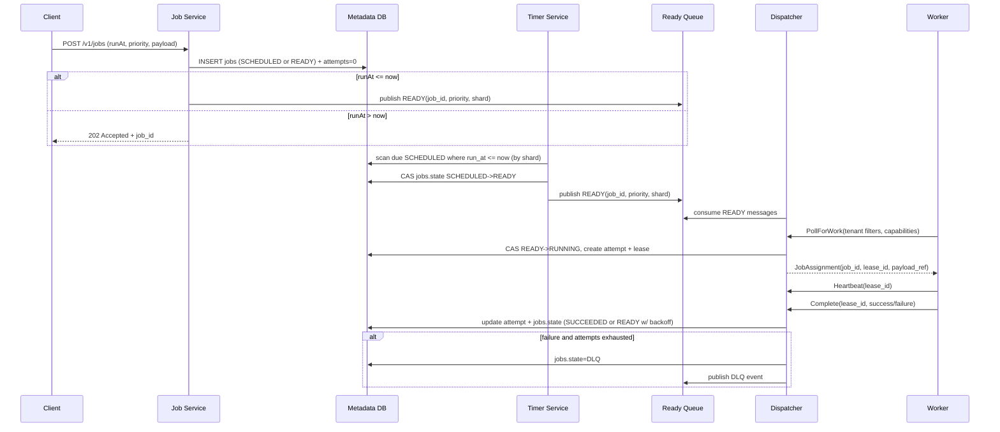

## Overview

A distributed batch task scheduler must reliably accept large volumes of jobs, run them at (or after) a specified time, honor priorities, and retry on failure—while preventing any single tenant from monopolizing capacity. The hard parts are correctness under failures (no “lost” jobs, bounded duplicates), efficient delayed scheduling at scale (time-based ordering is expensive), and fairness/isolation across tenants and queues.

This design uses a durable metadata store for job state, a dedicated “timer” path for delayed execution, and a high-throughput ready-queue for dispatch to workers. The key insight is separating *durable scheduling decisions* (persisted state transitions with leases) from *fast delivery* (partitioned ready topics/queues), enabling at-least-once execution with strong operational control (quotas, per-tenant routing, DLQs).

## Requirements

### Functional Requirements
- Submit jobs with tenant, queue, priority, payload, and optional `runAt` (delayed execution).
- Support multiple priority levels per tenant/queue (e.g., P0–P3) with deterministic ordering rules.
- Dispatch ready jobs to workers with acknowledgements, heartbeats, and lease timeouts.
- Retry failed jobs with configurable policy (max attempts, backoff, jitter) and dead-letter routing.
- Allow canceling jobs (best-effort if already running) and pausing/resuming queues.
- Provide job status tracking (queued, scheduled, running, succeeded, failed, canceled) and attempt history.
- Enforce multi-tenant isolation (quotas, rate limits, concurrency caps, and fair scheduling).
- Provide administrative APIs for tenant config, queue config, and observability/debug tooling.

### Non-Functional Requirements
- **Scale**:
  - 10K tenants, 200K active queues total
  - 50K QPS job submissions (bursts to 200K QPS)
  - 5K QPS cancels/updates
  - 1M jobs/min dispatch peak
  - Metadata: 5B jobs retained 30 days (TTL/archival), 50B attempts (cold storage)
- **Latency**:
  - Enqueue API: P50 20ms, P99 100ms
  - Due-to-dispatch: P50 200ms, P99 2s (for `runAt <= now`)
  - Worker lease renewal: P99 200ms
- **Availability**: 99.99% for enqueue/status APIs; 99.9% for dispatch (graceful degradation).
- **Consistency**:
  - Strong consistency for job state transitions and idempotent submission (per job key).
  - Eventual consistency for aggregated metrics, dashboards, and log-based views.
- **Durability**: No job loss on acknowledged enqueue (RPO≈0). Duplicates tolerated (at-least-once) with idempotency support.

### Constraints & Assumptions
- Tenants are untrusted; strict isolation and abuse protection required.
- Workers may be ephemeral and run in multiple regions/AZs.
- Budget-conscious operations: prefer managed primitives (Kafka/PubSub, Postgres/CockroachDB, Redis) but design supports self-hosting.
- Compliance: tenant-level encryption keys (KMS), audit logs for admin actions.

## High-Level Architecture

```mermaid
graph TB
    subgraph "Client Layer"
        C1[CLI/SDK]
        C2[Worker Agents]
        C3[Admin Console]
    end

    subgraph "Service Layer"
        GW[API Gateway + AuthN/Z]
        JS[Job Service (CRUD + Idempotency)]
        TS[Timer Service (Delayed -> Ready)]
        DS[Dispatcher (Ready -> Lease)]
        RS[Rate Limiter/Quota Service]
    end

    subgraph "Data Layer"
        MDB[(Metadata DB<br/>Jobs/Attempts/Queues)]
        RQ[(Ready Queue Bus<br/>Kafka/PubSub Topics)]
        DLQ[(Dead Letter Queue)]
        RED[(Redis<br/>hot quotas/locks)]
        OBJ[(Object Storage<br/>payloads/logs)]
        OBS[(Metrics/Logs/Traces)]
    end

    C1 --> GW --> JS --> MDB
    JS --> OBJ
    JS --> RS --> RED

    TS --> MDB
    TS --> RQ

    DS --> RQ
    DS --> MDB
    DS --> RS

    C2 --> DS
    DS --> C2
    DS --> OBS
    JS --> OBS
    TS --> OBS
    DLQ --> OBS
    RQ --> DLQ
```

The system is split into (1) a strongly consistent control plane (Job Service + Metadata DB) and (2) a high-throughput data plane for dispatch (Ready Queue Bus + Dispatcher). Delayed execution is handled by a Timer Service that scans due jobs efficiently and publishes them into priority-partitioned ready topics.

Multi-tenant isolation is enforced at admission (rate limits), at scheduling (per-tenant concurrency and fairness), and at execution (worker routing by tenant/queue with hard caps). This combination prevents noisy neighbors while keeping the hot path for dispatch simple and scalable.

## Component Deep-Dive

### Job Service
**Responsibility**: Accept job submissions, validate/auth, enforce idempotency, persist job records, expose status/cancel APIs.

**Key Design Decisions**:
- Idempotent enqueue via `(tenantId, idempotencyKey)` unique constraint to prevent duplicates on retries.
- Store large payloads in object storage; keep only pointers + hashes in DB to reduce DB bloat.

**Technology Choice**: Go/Java service; Metadata DB as CockroachDB/Postgres (strong transactions, unique constraints); S3/GCS for payloads.

**Scaling Strategy**: Stateless horizontal scaling behind L7 load balancer; DB connection pooling; per-tenant admission control via Redis-backed quotas.

### Timer Service (Delayed Scheduler)
**Responsibility**: Move jobs from `SCHEDULED` (future `runAt`) to `READY` by publishing to ready topics when due.

**Key Design Decisions**:
- Time-bucketed scanning: partition jobs by `(shard, runAtBucket)` to avoid global index hotspots.
- Lease-based claiming of due buckets so multiple timer instances can cooperate without double-publishing.

**Technology Choice**: Same language as Job Service; DB supports indexed queries on `(shard, runAt)`; optional “timing wheel” in-memory with periodic reconciliation.

**Scaling Strategy**: Scale by number of shards/buckets; each instance processes a subset via consistent hashing; backpressure if ready-queue or DB slows.

### Dispatcher
**Responsibility**: Serve workers, assign jobs fairly by tenant/queue/priority, manage leases/heartbeats, finalize attempts.

**Key Design Decisions**:
- At-least-once execution with leases: a job attempt is “owned” by a worker for a bounded time; on timeout it is retried.
- Priority + fairness: weighted fair scheduling across tenants, then within tenant by queue weights, then by priority (P0 before P1…).

**Technology Choice**: Ready Queue Bus as Kafka/PubSub; dispatcher consumes and assigns; Redis for fast counters; DB for authoritative state.

**Scaling Strategy**: Shard dispatchers by ready-topic partitions; workers connect to their shard; autoscale on partition lag and active leases.

### Metadata DB (Jobs/Attempts)
**Responsibility**: Source of truth for job lifecycle, attempts, configuration, and audit.

**Key Design Decisions**:
- Immutable attempt records for audit/debug; job row is the mutable “current state”.
- State transitions are conditional (CAS) to prevent races (e.g., only `READY -> RUNNING` if version matches).

**Technology Choice**: CockroachDB (global consistency + failover) or Postgres with read replicas; partitioning by `(tenantId, jobIdHash)` and TTL/archival jobs.

**Scaling Strategy**: Partition/shard by tenant hash; keep hot indexes minimal; archive old attempts to object storage/warehouse.

### Quota/Isolation Service
**Responsibility**: Enforce per-tenant limits: submit QPS, max queued jobs, max concurrent running, CPU-time budgets, queue-level caps.

**Key Design Decisions**:
- Token-bucket rate limits for admission + dispatch.
- Hard concurrency caps enforced at dispatch time (don’t assign if tenant at limit), with optional “burst” windows.

**Technology Choice**: Redis (atomic increments/expiries) + periodic reconciliation with DB; config stored in DB.

**Scaling Strategy**: Redis clustered; cache configs locally with short TTL; isolate hot tenants via dedicated Redis shards if needed.

## Data Model

### Storage Schema

**Table: `tenants`**
- `tenant_id` (PK)
- `status` (ACTIVE/SUSPENDED)
- `limits` (jsonb: submit_qps, max_running, max_queued, etc.)
- `created_at`, `updated_at`

**Table: `queues`**
- `tenant_id` (PK part)
- `queue_id` (PK part)
- `weight` (int)
- `paused` (bool)
- `max_running` (int, optional override)
- `created_at`, `updated_at`

**Table: `jobs`**
- `tenant_id` (PK part)
- `job_id` (PK part, ULID)
- `idempotency_key` (unique with tenant_id)
- `queue_id`
- `priority` (smallint, 0 highest)
- `state` (SCHEDULED/READY/RUNNING/SUCCEEDED/FAILED/CANCELED/DLQ)
- `run_at` (timestamp)
- `deadline_at` (timestamp, optional)
- `payload_ref` (uri) + `payload_sha256`
- `attempt` (int current attempt number)
- `max_attempts` (int)
- `backoff_policy` (jsonb)
- `last_error` (text)
- `version` (bigint for CAS)
- `created_at`, `updated_at`

**Table: `attempts`**
- `tenant_id` (PK part)
- `job_id` (PK part)
- `attempt_no` (PK part)
- `worker_id`
- `lease_id` (uuid)
- `started_at`, `heartbeat_at`, `finished_at`
- `result` (SUCCEEDED/FAILED/TIMED_OUT/CANCELED)
- `error_code`, `error_message`
- `runtime_ms`

**Table: `ready_publications`** (optional dedupe)
- `tenant_id`, `job_id`, `attempt_no` (PK)
- `published_at`

### Data Flow



## API Design

### Enqueue Job
`POST /v1/tenants/{tenantId}/jobs`
- Headers: `Idempotency-Key: <string>`
- Request:
  ```json
  {
    "queueId": "email",
    "priority": 1,
    "runAt": "2025-12-17T12:00:00Z",
    "payload": { "template": "welcome", "userId": "123" },
    "maxAttempts": 10,
    "backoff": { "type": "exponential", "baseMs": 5000, "maxMs": 900000, "jitter": true }
  }
  ```
- Response `202`:
  ```json
  { "jobId": "01JFK...ULID", "state": "SCHEDULED" }
  ```
- Errors:
  - `409` idempotency conflict with mismatched body hash
  - `429` rate-limited / quota exceeded
  - `400` invalid `runAt`/policy
- Idempotency: keyed by `(tenantId, Idempotency-Key)`; store request hash to detect misuse.

### Get Job Status
`GET /v1/tenants/{tenantId}/jobs/{jobId}`
- Response includes state, attempt, timestamps, last error, next run time.

### Cancel Job
`POST /v1/tenants/{tenantId}/jobs/{jobId}:cancel`
- Behavior:
  - If `SCHEDULED/READY`: transition to `CANCELED`.
  - If `RUNNING`: mark `cancel_requested=true`; worker cooperatively stops; if not, lease expiry will requeue unless canceled is authoritative.
- Idempotent: repeated cancel returns current state.

### Worker Poll
`POST /v1/worker:poll`
- Request:
  ```json
  { "workerId": "w-123", "capabilities": ["email"], "maxJobs": 5, "tenantHints": ["t1","t2"] }
  ```
- Response:
  ```json
  { "assignments": [{ "jobId": "...", "leaseId": "...", "deadline": "...", "payloadRef": "s3://..." }] }
  ```
- Error handling: `429` if worker exceeds poll rate; `503` if dispatcher overloaded (client backs off with jitter).

### Worker Heartbeat / Complete
`POST /v1/worker:heartbeat` and `POST /v1/worker:complete`
- Idempotency: `complete` is idempotent by `(leaseId, completionToken)`; duplicates ignored.

## Scaling & Performance

### Bottleneck Analysis
- **Delayed scheduling scans**: mitigate with sharded time buckets, bounded scans, and backpressure.
- **Metadata DB write amplification** (attempts, heartbeats): batch heartbeats, store last heartbeat in Redis with periodic DB flush, write only on state changes.
- **Hot tenants/queues**: enforce quotas and isolate via dedicated partitions and per-tenant concurrency caps.
- **Ready-queue lag**: autoscale dispatcher consumers; increase partitions; use compact ready messages (IDs only).

### Horizontal Scaling
- **API layer**: stateless; scale on CPU/QPS.
- **Timer Service**: scale by shard count (e.g., 1024 shards); each shard owns a time-bucket range.
- **Ready Queue**: partition by `(tenantShard, priority)` to parallelize consumption.
- **Dispatcher**: scale with queue partitions; each dispatcher group owns a subset of partitions.
- **Workers**: elastic; can be tenant-dedicated pools for strict isolation.

**Partitioning strategy**:
- `tenantShard = hash(tenantId) % N`
- Topics: `ready.p0.<shard>`, `ready.p1.<shard>`… (or a single topic with priority + consumer-side prioritization if supported)
- DB partitions aligned to `tenantShard` to reduce cross-shard contention.

### Caching Strategy
- **Config cache**: tenant/queue limits in-process with 30–60s TTL; source of truth in DB.
- **Quota counters**: Redis token buckets and running-job counters with expiries.
- **Payload caching**: workers cache payloads by `payload_sha256` for short TTL; CDN/object-store caching for large blobs.
- Invalidation: config updates publish an event to a small “config” topic; services invalidate local caches immediately (fallback to TTL).

## Trade-offs & Alternatives

### Key Trade-offs Made
- **Chosen**: at-least-once execution with leases + idempotency keys  
  **Sacrificed**: strict exactly-once semantics  
  **Why**: exactly-once across distributed workers is costly; interviews and real systems (Celery, SQS, Kafka consumers) typically rely on idempotent handlers.
- **Chosen**: separate Timer Service for delayed jobs  
  **Sacrificed**: simplicity of “single queue does everything”  
  **Why**: delayed ordering at scale is a specialized workload; separating it avoids slowing down ready dispatch.
- **Chosen**: fairness + quotas at dispatch time  
  **Sacrificed**: maximum throughput for a single tenant  
  **Why**: multi-tenant safety is a primary requirement; predictable isolation beats peak single-tenant performance.

### Alternative Approaches
- **Redis-only (sorted sets for delay + lists for ready)**: simple and fast, but harder to guarantee durability and multi-AZ correctness at large scale.
- **DB-only scheduler (SELECT … FOR UPDATE SKIP LOCKED)**: strong correctness and fewer moving parts, but limited dispatch throughput and expensive polling at high QPS.
- **Kubernetes CronJobs/Argo Workflows**: great for workflow orchestration, but less suited for high-QPS multi-tenant priority queues and fine-grained retries/leases.

## Failure Modes & Mitigations

### Failure Scenarios
- **Scenario**: Dispatcher crashes mid-assignment  
  **Impact**: jobs stuck in RUNNING until lease expires  
  **Detection**: lease timeout metrics; rising “stuck running” gauge  
  **Mitigation**: lease TTL + worker heartbeats; requeue on timeout; dispatcher stateless restart.
- **Scenario**: Timer Service publishes READY but DB update fails (or vice versa)  
  **Impact**: potential duplicates or missed dispatch  
  **Detection**: reconciliation job compares DB `READY` vs ready-queue lag; dedupe table/metrics  
  **Mitigation**: transactional outbox pattern (DB outbox -> bus), or `ready_publications` dedupe + periodic re-publish for `READY` not seen.
- **Scenario**: Metadata DB partial outage / high latency  
  **Impact**: enqueue slows; dispatch can’t transition states  
  **Detection**: DB latency/error SLO alerts  
  **Mitigation**: shed load (429), queue submissions in short-lived ingress buffer (optional), prioritize state transitions over reads, degrade dashboards.
- **Scenario**: Hot tenant attempts to overwhelm system  
  **Impact**: noisy neighbor, increased latencies  
  **Detection**: per-tenant QPS/running/queued alarms  
  **Mitigation**: admission rate limits, per-tenant concurrency caps, separate partitions/pools, automated tenant throttling.
- **Scenario**: Worker loses network after receiving job  
  **Impact**: job times out, retries, duplicates possible  
  **Detection**: missed heartbeats; rising timeout rate  
  **Mitigation**: retries with backoff + jitter; require idempotent job handlers; optional exactly-once for specific job types via dedupe keys in downstream systems.

### Disaster Recovery
- **RTO/RPO**: RTO 30 minutes (regional failover), RPO ~0 for accepted jobs (multi-AZ synchronous replication).
- **Backup strategy**: continuous DB backups + PITR; object storage versioning; Kafka/PubSub retention sized for worst-case outage window (e.g., 24–72h).
- **Failover procedures**: promote standby region DB (or use globally consistent DB), restart stateless services, drain/rewire workers to new dispatch endpoints, run reconciliation to republish `READY` jobs.

## Operational Considerations

### Monitoring & Alerting
- Key metrics:
  - Enqueue QPS, P99 latency, 4xx/5xx rates
  - Ready-queue lag per partition/priority
  - Due-to-dispatch latency (SLO), timer scan lag
  - Running jobs per tenant/queue, throttle counts (429)
  - Retry rate, DLQ rate, timeout rate, duplicate-complete rate
  - DB transaction latency, lock/contention, connection pool saturation
- Alert thresholds (examples):
  - Due-to-dispatch P99 > 5s for 10m
  - Ready-queue lag > 1M messages or > 5m behind
  - DLQ rate > 0.5% of completions for 15m
  - DB P99 write latency > 200ms for 10m

### Deployment Strategy
- Blue/green or canary for stateless services; feature flags for scheduling policy changes.
- Backward-compatible schema migrations (expand/contract), dual-write if needed for outbox adoption.
- Rollback: keep old consumers compatible with topic schema; version ready messages; fast rollback via traffic shift.

## References & Further Reading
- Celery architecture and at-least-once task delivery: https://docs.celeryq.dev/
- Kafka consumer groups and delivery semantics: https://kafka.apache.org/documentation/
- Transactional outbox pattern (reliable DB->bus publishing): https://microservices.io/patterns/data/transactional-outbox.html
- SQS visibility timeout model (leases): https://docs.aws.amazon.com/AWSSimpleQueueService/latest/SQSDeveloperGuide/sqs-visibility-timeout.html
- Google Cloud Tasks (delayed execution, retries): https://cloud.google.com/tasks/docs/overview