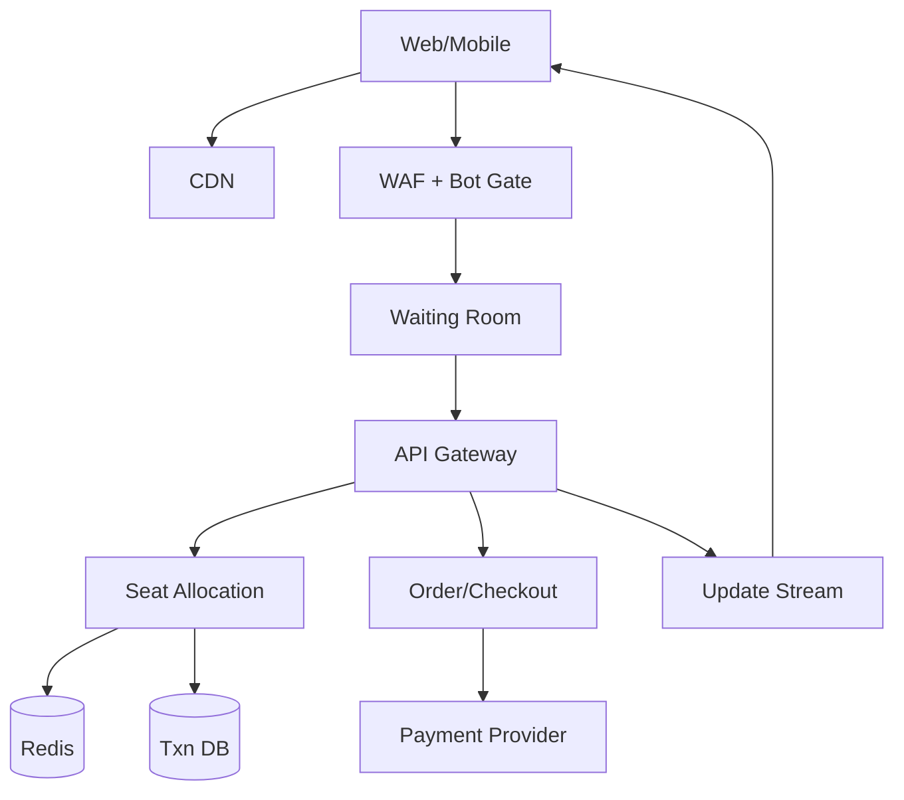
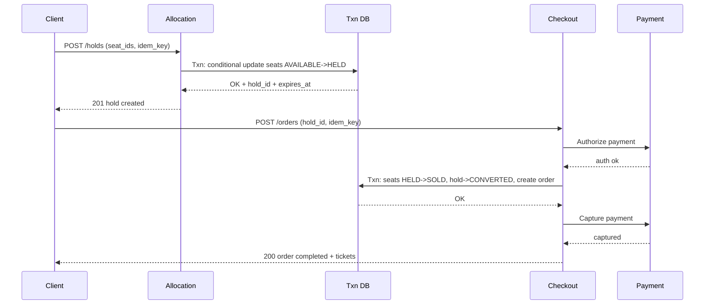

## Overview

A high-demand ticketing system is primarily a contention problem: millions of users (and bots) compete for a finite set of seats within minutes. The core challenge is guaranteeing correct seat allocation (no double-sell) while still delivering a fast, interactive seat-map experience with real-time availability updates.

The key insight is to treat seat inventory as a strongly consistent, event-partitioned resource with explicit lifecycle states (`AVAILABLE → HELD → SOLD`) and a time-bounded hold mechanism. We combine (1) a strict, atomic seat allocation/hold operation, (2) a controlled “waiting room” to flatten bursts, and (3) layered bot/scalper defenses that preserve fairness without degrading legitimate customers.

## Requirements

### Functional Requirements
- Browse events and view seat maps (sections/rows/seats) with prices and restrictions.
- Show near-real-time seat availability updates while users are viewing the map.
- Create a temporary seat hold (cart) with expiration (e.g., 2–5 minutes).
- Support selection constraints: contiguous seats, accessibility seats, per-account limits, restricted views.
- Checkout flow that finalizes purchase: payment authorization/capture, ticket issuance, and receipt.
- Release holds on expiry or user cancellation, returning seats to availability.
- Prevent/mitigate bots and scalpers: rate limits, device/account risk scoring, CAPTCHA challenges, purchase limits.
- Provide operator tooling: event setup, price tiers, seat blocks, and audit logs.

### Non-Functional Requirements
- **Scale**: Peak 200K QPS (browse), 20K QPS (hold attempts), 5K QPS (checkout); 5M concurrent viewers during on-sale; up to 100K seats/event; 50K events/year.
- **Latency**:
  - Seat map fetch: P50 80ms, P99 300ms (CDN + cached).
  - Hold attempt: P50 60ms, P99 200ms.
  - Checkout confirm: P50 400ms, P99 2s (payment-dependent).
- **Availability**: 99.99% for browse; 99.95% for hold/checkout during on-sale windows.
- **Consistency**:
  - Strong consistency for seat state transitions and order finalization (no double-sell).
  - Eventual consistency acceptable for analytics, search indexing, and recommendation.
- **Durability**: No lost completed orders; seat state must be recoverable after failure; RPO ≤ 1 minute for transactional data.

### Constraints & Assumptions
- Global audience; on-sale traffic is bursty and predictable (scheduled drops).
- PCI handled by payment provider; store only tokens/ids (no raw PAN).
- Small team constraint: prefer managed DB/streaming where possible.
- Legal/compliance: auditability of seat ownership changes; abuse investigation support.

## High-Level Architecture



Clients fetch mostly static assets (seat map tiles, event pages) via CDN. All dynamic requests pass through a WAF/bot gate and a waiting room that meters entry to the “hot path” during drops, protecting core services from overload and keeping latency predictable. The API tier fans out to a strongly consistent Seat Allocation service for holds and a Checkout service for purchase finalization.

Seat state is managed with a transactional database (source of truth) plus Redis for low-latency availability reads and atomic allocation helpers. A lightweight update stream (SSE/WebSocket via pub/sub) pushes seat availability deltas to clients to keep the map fresh without constant polling.

## Component Deep-Dive

### Waiting Room & Edge Protection

**Responsibility**: Absorb bursts, enforce fairness, block obvious abuse before it hits core services.

**Key Design Decisions**:
- Token-based admission (signed, short-lived) to control entry rate per event and per region.
- Multi-step bot friction (rate limits → proof-of-work/CAPTCHA → hard block) to minimize user impact.

**Technology Choice**: CDN + WAF (Cloudflare/Akamai), server-side waiting room (Envoy + Redis), CAPTCHA provider.

**Scaling Strategy**: Fully edge-scaled; per-event admission configured ahead of on-sale; regional fail-open for browse-only traffic.

### Seat Allocation Service

**Responsibility**: Provide atomic seat holds and releases; enforce seat lifecycle and constraints.

**Key Design Decisions**:
- **Event-partitioned consistency**: all seat state transitions are serialized per `event_id` partition (logical sharding), preventing cross-event contention.
- **Explicit hold TTL**: holds expire automatically, preventing “dead inventory” from abandoned carts.

**Technology Choice**:
- Transactional DB: Postgres (read replicas) or Spanner/CockroachDB for multi-region; row-level constraints for correctness.
- Redis for cached availability + atomic helpers (Lua) and hold-expiry scheduling.

**Scaling Strategy**:
- Shard by `event_id` (consistent hashing) so hot events scale horizontally.
- Use cached seat availability bitmaps per section for fast “what’s open” queries; DB remains authoritative for transitions.

### Order & Checkout Service

**Responsibility**: Convert holds into orders; orchestrate payment; issue tickets; ensure idempotency.

**Key Design Decisions**:
- Saga with idempotency keys: payment and seat finalization handled with compensating actions.
- “Finalize seats before capture” (authorize → finalize seats → capture) to reduce paid-but-no-seat risk.

**Technology Choice**: Stateless service (Go/Java), transactional outbox to emit order events, payment PSP (Stripe/Adyen).

**Scaling Strategy**: Horizontally scale stateless instances; isolate payment calls; circuit breakers and retries with jitter.

### Realtime Availability Updates

**Responsibility**: Deliver low-latency seat availability deltas to many viewers.

**Key Design Decisions**:
- Push deltas (held/sold/released) per event/section instead of full map refresh.
- Backpressure-friendly transport: SSE for simplicity; WebSocket if bi-directional signals are needed.

**Technology Choice**: Kafka/PubSub/Redis Streams + fanout gateway (SSE/WebSocket).

**Scaling Strategy**: Partition topics by `event_id`; scale fanout gateways separately; client-side coalescing of bursts.

## Data Model

### Storage Schema

**events**
- `event_id (PK)`, `venue_id`, `name`, `start_time`, `onsale_time`, `status`, `version`

**seats**
- `event_id (PK part)`, `seat_id (PK part)`, `section`, `row`, `number`
- `price_tier_id`, `attributes (json)` (e.g., accessibility)
- `state` ENUM(`AVAILABLE`,`HELD`,`SOLD`)
- `hold_id (nullable)`, `order_id (nullable)`
- `state_version` (monotonic int for optimistic concurrency)

**holds**
- `hold_id (PK)`, `event_id`, `user_id`, `device_id`
- `status` ENUM(`ACTIVE`,`EXPIRED`,`CANCELLED`,`CONVERTED`)
- `expires_at`, `created_at`
- `idempotency_key` (unique per user/event)

**hold_items**
- `hold_id (PK part)`, `seat_id (PK part)`

**orders**
- `order_id (PK)`, `event_id`, `user_id`
- `status` ENUM(`PENDING`,`AUTHORIZED`,`COMPLETED`,`CANCELLED`,`FAILED`)
- `total_amount`, `currency`, `created_at`, `idempotency_key` (unique)

**payments**
- `payment_id (PK)`, `order_id`, `provider`, `provider_ref`
- `status` ENUM(`INIT`,`AUTHORIZED`,`CAPTURED`,`FAILED`,`REFUNDED`)
- `amount`, `created_at`

**tickets**
- `ticket_id (PK)`, `order_id`, `event_id`, `seat_id`
- `barcode_token`, `status` ENUM(`ISSUED`,`VOIDED`)

**audit_log**
- `audit_id (PK)`, `event_id`, `actor_type`, `actor_id`, `action`, `payload`, `created_at`

**Indexes/constraints (critical)**
- Unique seat ownership: `(event_id, seat_id)` is PK; enforce `state` transitions via conditional updates on `state_version`.
- Uniqueness for idempotency: `holds(idempotency_key, user_id, event_id)` and `orders(idempotency_key, user_id)`.

### Data Flow



Notes:
- If capture fails after seats are sold, automatically refund/void tickets (compensating action) and return seats only if policy allows; otherwise keep order failed but seats sold is avoided by ordering “finalize then capture” only if provider supports short capture window, or “capture then finalize” with strict timeouts and automatic reallocation rules.

## API Design

### Browse & Seat Map
- `GET /v1/events?query=&date=&city=` → event list (cached, eventual consistency)
- `GET /v1/events/{event_id}/seatmap?section_id=` → seat map tiles + current availability snapshot
- `GET /v1/events/{event_id}/availability/stream` (SSE) → seat delta events `{seat_id, state, ts}`

**Errors**: `429` rate limited, `503` waiting room active, `404` invalid event, `409` stale client snapshot (optional).

### Holds
- `POST /v1/events/{event_id}/holds`
  - Request:
    ```json
    { "seat_ids": ["S1","S2"], "idempotency_key": "uuid", "client_version": 123 }
    ```
  - Response:
    ```json
    { "hold_id": "H123", "expires_at": "2025-12-17T12:00:00Z", "seats": ["S1","S2"] }
    ```
- `DELETE /v1/holds/{hold_id}` → cancel hold (idempotent)

**Idempotency**:
- Require `Idempotency-Key` header (or body field) for `POST /holds` and `POST /orders`.
- On retry, return the original result for the same key/user/event.

**Seat contention handling**:
- If any seat unavailable: return `409 CONFLICT` with `unavailable_seat_ids`; optionally offer “best available” suggestion.

### Checkout
- `POST /v1/orders`
  - Request:
    ```json
    { "hold_id": "H123", "payment_token": "tok_x", "idempotency_key": "uuid" }
    ```
  - Response:
    ```json
    { "order_id": "O123", "status": "COMPLETED", "tickets": [{ "seat_id": "S1", "barcode": "..." }] }
    ```

**Error handling**:
- `402` payment required/failed with provider error code mapping.
- `409` hold expired/converted.
- `422` purchase limit exceeded / policy violations.

## Scaling & Performance

### Bottleneck Analysis
- **Hold hot-spot**: many writes to the same event’s seats.
  - Mitigation: shard by `event_id`, keep allocation in-memory per shard (stateless workers) but commit via DB; use fast conditional updates and batch seat updates.
- **Seat map churn**: massive read load + frequent deltas.
  - Mitigation: CDN for map tiles; Redis for availability snapshots; push deltas via SSE; coalesce updates per section every 100–250ms.
- **Payment latency**: external dependency.
  - Mitigation: async-safe saga, timeouts, retries, circuit breakers; keep user-visible states clear (“processing”).

### Horizontal Scaling
- **Edge/WAF/Waiting room**: scales at CDN/edge; admission tokens per event.
- **API**: stateless autoscaling on CPU + request rate; separate pools for browse vs transactional.
- **Allocation**: consistent-hash routing by `event_id` to a shard set; scale shards horizontally; hot events can be temporarily pinned to more capacity.
- **DB**: partition/shard by `event_id`; read replicas for browse; strict capacity planning for peak on-sale.
- **Stream/fanout**: partition by `event_id`; scale fanout gateways independently.

### Caching Strategy
- CDN: event pages, seatmap tiles, static pricing rules (TTL minutes-hours).
- Redis:
  - `availability:{event_id}:{section}` bitmap/set + short TTL refresh on writes.
  - `hold:{hold_id}` metadata with TTL to drive expiry.
- Invalidation:
  - On seat state change, publish delta event and update Redis atomically (same request path).
  - Periodic reconciliation job compares Redis snapshots to DB for drift and repairs.

## Trade-offs & Alternatives

### Key Trade-offs Made
- **Chosen**: Strongly consistent seat transitions in a transactional DB.
  - **Sacrificed**: Higher write latency vs fully in-memory inventory.
  - **Why**: Correctness and auditability outweigh marginal latency during on-sale.
- **Chosen**: Waiting room admission control.
  - **Sacrificed**: Some users experience queueing.
  - **Why**: Prevents total meltdown and improves fairness under extreme bursts.
- **Chosen**: Push deltas (SSE) for availability.
  - **Sacrificed**: More infra than simple polling.
  - **Why**: Lower bandwidth/QPS and better UX during high churn.

### Alternative Approaches
- **Single Redis inventory (bitmaps) as source of truth**: very fast, but durability/audit and recovery are harder; riskier for financial-grade correctness.
- **Strict serial allocator per event (single writer)**: simplest correctness model, but can bottleneck for very large events unless carefully sharded by section.
- **Full event sourcing for seat state**: excellent auditability and replay, but increases complexity; often overkill unless you need deep replay/forensics.

## Failure Modes & Mitigations

### Failure Scenarios
- **Scenario**: Allocation worker crashes mid-hold.
  - **Impact**: Some holds not created; no double-sell if DB txn boundaries are correct.
  - **Detection**: Elevated 5xx/timeout rate; missing ack logs.
  - **Mitigation**: Client retries with idempotency key; stateless workers; DB rollback ensures no partial state.
- **Scenario**: Redis unavailable.
  - **Impact**: Slower map loads, potential loss of fast availability cache.
  - **Detection**: Redis error rate, cache hit drop.
  - **Mitigation**: Degrade to DB reads for critical actions; disable realtime deltas; rebuild cache from DB asynchronously.
- **Scenario**: Payment provider outage.
  - **Impact**: Checkout failures; holds expire.
  - **Detection**: Payment timeout/error spikes, provider status page.
  - **Mitigation**: Circuit breaker + fail fast; extend hold TTL selectively for users in checkout; offer alternative provider if configured.
- **Scenario**: Network partition between regions.
  - **Impact**: Conflicting seat updates if multi-writer.
  - **Detection**: Cross-region replication lag, consensus alarms.
  - **Mitigation**: Single-writer per `event_id` (regional affinity) with failover; fence via leasing to prevent split-brain.
- **Scenario**: Bot surge overwhelms edge.
  - **Impact**: Legitimate users blocked or slowed.
  - **Detection**: WAF anomaly scores, unusual ASN/device patterns.
  - **Mitigation**: Tighten rate limits, increase challenges, require logged-in state earlier, throttle suspicious ASNs.

### Disaster Recovery
- **RTO/RPO**: RTO 30 minutes for transactional paths; RPO ≤ 1 minute.
- **Backups**: Continuous WAL/binlog shipping + daily full backups; periodic restore drills.
- **Failover**: Promote warm standby region; re-route via DNS/anycast; enforce allocator lease fencing to avoid dual writers.

## Operational Considerations

### Monitoring & Alerting
- Key metrics:
  - Allocation: hold success rate, `409` contention rate, DB txn latency, seat state transition rate.
  - Checkout: authorization/capture success, payment latency, order completion time.
  - Fairness/abuse: per-ASN and per-device request rates, challenge pass rate, purchase limit violations.
  - Realtime: stream fanout connections, dropped events, client lag.
- Alerts (examples):
  - P99 hold latency > 300ms for 5 min.
  - Double-sell invariant breach detector (should be zero): seats with multiple `SOLD` orders (query-based canary).
  - Payment failure rate > 5% for 3 min (by provider/region).

### Deployment Strategy
- Blue/green or canary by percentage of traffic; isolate on-sale windows with change freeze for allocation/checkout.
- Schema migrations: backwards-compatible, expand/contract, with feature flags.
- Rollback: instant traffic shift + disable new holds if invariants at risk (“safe mode”: browse-only).

## References & Further Reading
- Stripe: Idempotency keys and retries (payment best practices).
- “Transactional Outbox” pattern (reliable event publishing from DB).
- Kafka partitioning strategies (keyed by `event_id`).
- Redis Lua scripting + key expiration patterns for hold TTLs.
- Cloudflare/Akamai bot management and rate limiting guides.
- CockroachDB/Spanner docs on serializable transactions and multi-region primitives.