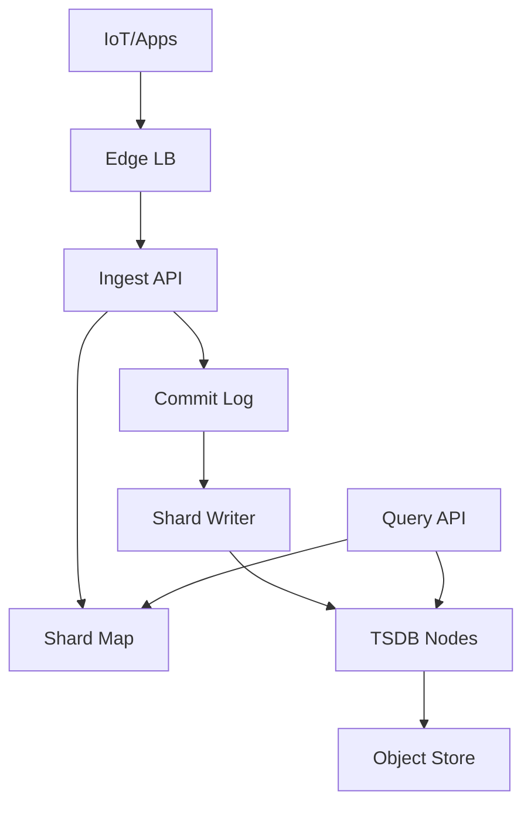
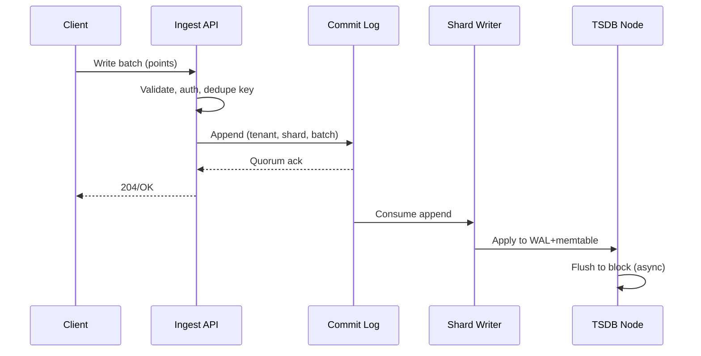
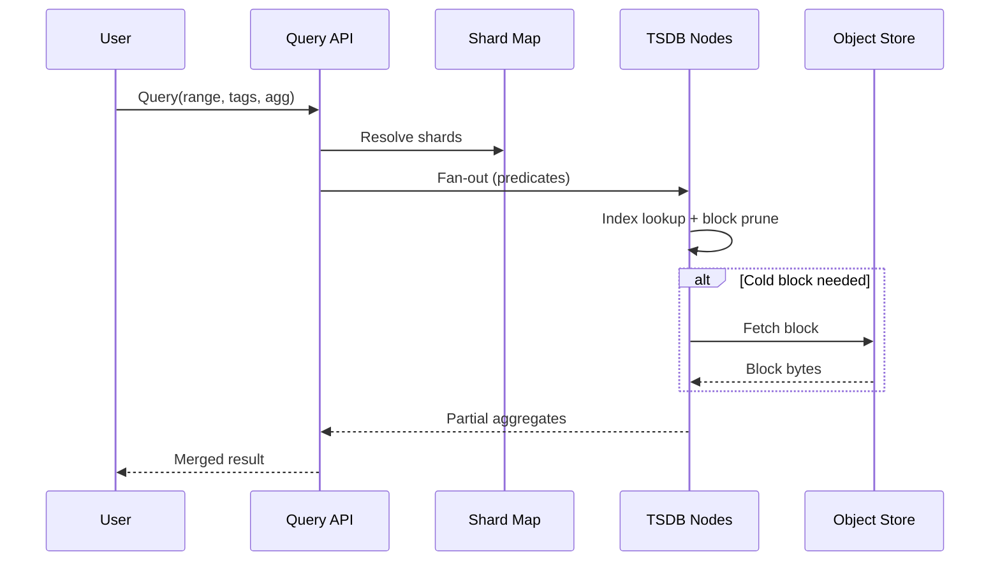

## Overview

A time-series database (TSDB) for IoT telemetry/metrics must ingest very high write rates (often append-only), store efficiently (compression + indexing), and serve low-latency queries over recent data while still supporting long-range analytics via downsampling and retention tiers. The hard parts are not “writing points to disk” but sustaining predictable performance under high-cardinality tags, hot partitions, out-of-order data, and compaction/rollups running concurrently with ingestion.

The key insight is to separate concerns by time and by workload: (1) write-optimized ingest path with WAL + memtables and immutable time-partitioned segments; (2) query path that leverages an inverted tag index plus block-level metadata to minimize reads; (3) background pipeline for compaction, downsampling rollups, and tiering (hot/warm/cold) with strict resource isolation. This yields stable ingestion, bounded query latency, and controllable storage cost.

## Requirements

### Functional Requirements
- Ingest telemetry points for a metric with tags/labels, timestamp, and numeric fields (counter/gauge) at high throughput.
- Support idempotent writes and de-duplication for retries; tolerate out-of-order arrivals within a configurable window (e.g., 2 hours).
- Query by time range with tag filters (e.g., `device_id=...`, `region=...`) and aggregations (sum/avg/min/max, rate, percentile approximations).
- Provide downsampling rollups (e.g., raw → 1m → 10m → 1h) with configurable aggregations per metric.
- Enforce retention policies per tenant/namespace (e.g., raw 7d, 1m 90d, 1h 2y) and tier data across hot/warm/cold storage.
- Support multi-tenancy: per-tenant quotas (ingest rate, series cardinality), isolation, and authn/authz.
- Expose operational APIs: health, shard status, backpressure signals, and compaction/rollup progress.
- Support backfill imports (bounded) and safe deletes (tombstones) for GDPR/tenant offboarding.

### Non-Functional Requirements
- **Scale**:
  - 1M connected IoT devices, 200K concurrently active.
  - Peak ingest: 2M points/sec cluster-wide (≈ 20K requests/sec if batching 100 points/request).
  - Cardinality: up to 2B active series globally; typical tenant 1M–50M series.
  - Storage: raw 7d at 2M pps ≈ 1.2T points/day; compressed ~1–3 bytes/value + metadata → ~2–6 TB/day.
- **Latency**:
  - Write: P50 10ms, P99 50ms (ack after WAL + replication quorum).
  - Query (last 1h): P50 30ms, P99 200ms; long-range (30d, downsampled): P99 2s.
- **Availability**: 99.99% for reads/writes (zone failures handled; region failover supported with degraded semantics).
- **Consistency**:
  - Writes: quorum durability (e.g., RF=3, write quorum=2); read-your-writes within a shard when querying the same coordinator.
  - Queries: eventual across shards/regions during failover; strong consistency for metadata (schema, retention configs).
- **Durability**: No acknowledged write loss within a region; RPO 5 minutes cross-region (async replication), RTO 30 minutes.

### Constraints & Assumptions
- Team: ~6–10 engineers; prefer proven building blocks (Raft KV for metadata, object storage for cold tier).
- Environment: Kubernetes; NVMe for hot tier; object storage (S3/GCS) available but cross-region bandwidth is expensive.
- Compliance: TLS everywhere; per-tenant encryption-at-rest keys (KMS); audit logs for admin actions.
- Query model: metrics-style (PromQL-like filters + aggregations) rather than arbitrary SQL joins.

## High-Level Architecture



The ingest path is optimized for sequential appends and fast acknowledgements: requests are validated, routed via a shard map, appended to a replicated commit log, and applied by shard writers into the TSDB nodes (WAL + memtable + immutable segments). This decouples ingestion spikes from disk layout and compaction.

The query path is metadata-driven: the shard map resolves which shards hold the relevant time ranges; TSDB nodes use tag index + block metadata to prune reads, pulling colder blocks from object storage when needed. Cold tier offloads cost while keeping long-range queries possible through downsampled rollups.

## Component Deep-Dive

### Ingest API
**Responsibility**: Auth, validation, batching, routing, idempotency, backpressure.

**Key Design Decisions**:
- Use per-tenant rate limiting + series-cardinality guards to prevent index explosions and noisy-neighbor impact.
- Ack writes after commit-log quorum append (not after compaction), ensuring durability while keeping latency low.

**Technology Choice**: Stateless service in Go/Java; gRPC for high-throughput internal RPC; optional HTTP for client simplicity.

**Scaling Strategy**: Horizontal scale behind L7 LB; shard-aware routing cache; autoscale on CPU + request queue depth.

### Commit Log (Write-Ahead Buffer)
**Responsibility**: Durable, ordered replication of incoming samples before they’re applied to storage files.

**Key Design Decisions**:
- Partition log by `tenant + shard` to preserve order and simplify consumer (writer) state.
- Keep retention short (hours–days) and rely on TSDB segments for long-term; the log is a buffer, not the database.

**Technology Choice**: Kafka/Pulsar, or a built-in replicated log (Raft per shard group). Kafka is pragmatic at scale.

**Scaling Strategy**: Increase partitions with shards; enforce per-partition throughput limits; isolate tenants via partition assignment.

### TSDB Nodes (Storage Engine)
**Responsibility**: Persist samples, maintain tag index, serve scans/aggregations, run compaction.

**Key Design Decisions**:
- LSM-like design: WAL → memtable → immutable segment (“block”) files, plus leveled/tiered compaction to bound read amplification.
- Time-partitioned blocks (e.g., 2h windows) with per-block metadata (min/max time, series bitmap, tag postings stats) for pruning.

**Technology Choice**: Custom engine in Go/Rust/C++; compression (Gorilla/XOR for floats), delta-of-delta for timestamps; mmap + direct I/O on NVMe.

**Scaling Strategy**: Shard by `tenant` and `series hash`; add nodes and rebalance shards; isolate compaction CPU/IO via cgroups/IO throttling.

### Query API
**Responsibility**: Parse queries, shard fan-out, partial aggregation, caching, pagination/streaming results.

**Key Design Decisions**:
- Push down predicates (time range, tag filters) to TSDB nodes; do distributed aggregation in two stages (per-shard then merge).
- Use bounded concurrency + hedged requests for tail latency; return partial results with warnings under overload (configurable).

**Technology Choice**: Stateless service; PromQL-like engine or a simpler expression DSL; gRPC streaming for large responses.

**Scaling Strategy**: Horizontal scale; shard fan-out concurrency limits; query admission control by tenant and cost model.

### Rollup & Retention Manager
**Responsibility**: Downsampling, tiering hot→warm→cold, deletion/tombstones, backfill coordination.

**Key Design Decisions**:
- Materialize rollups as separate “resolution namespaces” (raw, 1m, 10m, 1h) to avoid mixing disparate granularities in one block.
- Tier by block age: recent blocks stay on NVMe; older blocks are compacted and uploaded to object storage with an index manifest.

**Technology Choice**: Background workers reading blocks; object store for cold; manifest store (metadata KV) for block location.

**Scaling Strategy**: Scale workers by shard count; schedule with per-node resource budgets; prioritize retention/tiering to prevent disk-full events.

## Data Model

### Storage Schema

**Concepts**
- **Tenant**: isolation boundary.
- **Series**: unique `(metric_name, sorted tags)` mapped to `series_id`.
- **Sample**: `(series_id, timestamp, value[, field])`.

**Metadata (strongly consistent, small)**
- `tenants(tenant_id, limits, retention_policy, created_at)`
- `series_dict(tenant_id, series_id, metric, tags_hash, tags_kv, created_at, last_seen_at)`
- `tag_index(tenant_id, tag_key, tag_value, postings_list_ref, cardinality_estimate)`

**Block/Segment Layout (per shard, immutable)**
- Block window: e.g., 2h; filename: `{shard}/{resolution}/{start_time}-{ulid}.block`
- Block metadata:
  - `min_time`, `max_time`
  - `series_count`
  - `tag_stats` (optional summaries)
  - `bloom` (series_id presence)
  - `chunk_index` (offsets for series chunks)
- Series chunks:
  - timestamps: delta-of-delta + varint
  - values: Gorilla XOR (float) or delta (int)
  - optional per-chunk min/max for pruning in aggregations

**Retention Tiers**
- Hot: last 24–72h on NVMe
- Warm: up to raw retention (e.g., 7d) on cheaper disk
- Cold: downsampled blocks (>= 1m) in object store, with local cache

### Data Flow



Query flow (pruning + aggregation):


## API Design

### Write API
- `POST /v1/write`
  - Headers: `Authorization`, `X-Tenant-Id`, `Idempotency-Key` (optional but recommended)
  - Body (protobuf or JSON/line protocol):
    ```json
    {
      "points": [
        {"metric":"temp_c","tags":{"device_id":"d1","region":"us"}, "ts_ms":1734390000123, "value":21.4}
      ],
      "accept_out_of_order_ms": 7200000
    }
    ```
  - Responses:
    - `204 No Content` on success
    - `400` invalid metric/tags/timestamp
    - `401/403` auth
    - `409` duplicate with conflicting payload (idempotency violation)
    - `413` too large
    - `429` throttled (rate or cardinality)
    - `503` overload/backpressure (retry with jitter)
- **Idempotency**:
  - Prefer client-provided `Idempotency-Key` scoped to `(tenant, key)` with a short server-side cache (e.g., 24h).
  - Additionally de-dup at storage by `(series_id, timestamp)` within an out-of-order window; last-write-wins or reject duplicates per metric config.

### Query API
- `POST /v1/query`
  - Body:
    ```json
    {
      "start_ms": 1734386400000,
      "end_ms": 1734390000000,
      "filter": {"metric":"temp_c","tags":{"region":"us"}},
      "downsample": {"resolution":"1m","agg":"avg"},
      "group_by": ["device_id"],
      "limit_series": 10000
    }
    ```
  - Response:
    ```json
    {"series":[{"tags":{"device_id":"d1"},"points":[[1734386460000,21.1]]}],"warnings":[]}
    ```
  - Errors: `400` invalid query, `413` too expensive, `429` query throttled, `504` shard timeout (optional partials).

### Discovery APIs
- `GET /v1/labels?tenant=...` → list tag keys
- `GET /v1/label/{key}/values` → list values (paginated)
- `POST /v1/series` → match series by filter, returns series IDs/tags (paginated)

### Admin APIs
- `GET /v1/health`, `GET /v1/shards`
- `PUT /v1/tenants/{id}/retention` (audited, RBAC)

## Scaling & Performance

### Bottleneck Analysis
- **High cardinality tagsets**: index memory and postings explode.
  - Mitigate with per-tenant cardinality limits, tag allow/deny lists, and approximate cardinality estimation (HLL) to preempt.
- **Hot shards/partitions** (e.g., one tenant dominates writes):
  - Use shard hashing by series; dynamic shard splitting for large tenants; adaptive ingest throttling.
- **Compaction debt** causing read/write amplification spikes:
  - Separate compaction IO budget; prioritize level compactions; expose “compaction debt” metric for autoscaling.
- **Query fan-out latency**:
  - Two-level aggregation; shard pruning by time; hedged requests; query result caching for dashboards.

### Horizontal Scaling
- **Ingest API**: scale statelessly; shard routing via cached ring; batch points to reduce per-request overhead.
- **Commit Log**: scale partitions with shard count; ensure brokers have sufficient disk/network; enforce quotas.
- **TSDB Nodes**:
  - Shard ownership via consistent hashing ring stored in metadata store.
  - Rebalancing moves shard ranges (blocks + WAL checkpoints) with throttled transfer.
- **Partitioning/Sharding Strategy**:
  - Primary: `tenant_id`
  - Secondary: `hash(series_id) % N_shards`
  - Time: block windows inside each shard; cold tier by block age

### Caching Strategy
- **Index cache**: hot tag postings + series dictionary in RAM (per-node); TTL + size bound.
- **Block metadata cache**: keep block headers and sparse indices in memory for fast pruning.
- **Chunk cache**: LRU for recently-read chunks (dashboards).
- **Query result cache**: short TTL (5–30s) for repeated dashboard queries; key includes tenant, query, time bucket.
- **Invalidation**: mostly TTL-based since time-series is append-heavy; for “recent” ranges, include a moving watermark (last_ingested_ts) in cache key.

## Trade-offs & Alternatives

### Key Trade-offs Made
- **Chose** WAL+immutable blocks with compaction; **sacrificed** immediate read of every just-written point everywhere.
  - Rationale: stable high ingest throughput; bounded amplification; eventual visibility is acceptable for metrics.
- **Chose** inverted tag index; **sacrificed** simplicity and some write overhead.
  - Rationale: tag filtering is the core query pattern; scanning raw blocks is too expensive at scale.
- **Chose** multi-tier storage with object store; **sacrificed** cold-query latency.
  - Rationale: cost control dominates long retention; downsampling keeps cold queries practical.
- **Chose** commit log decoupling; **sacrificed** operational complexity.
  - Rationale: isolates ingest spikes and enables replay/recovery without blocking clients.

### Alternative Approaches
- **Cassandra/Scylla wide-row schema**: simple ops at first, but expensive for high-cardinality tag queries and rollups; compaction and tombstones can be painful.
- **Prometheus + remote write + Thanos/Cortex/Mimir**: excellent for metrics ecosystem, but IoT ingest patterns (device churn, high series counts) may require heavy guardrails; also less suited to arbitrary multi-field telemetry.
- **Columnar lakehouse (Parquet on S3 + Trino/Spark)**: great for batch analytics, but hard to meet low-latency dashboarding and high ingest without a hot serving layer.

## Failure Modes & Mitigations

### Failure Scenarios
- **Scenario**: TSDB node crash (disk OK)
  - **Impact**: shard unavailable, write acks at risk if quorum not met
  - **Detection**: heartbeat loss, rising error rate
  - **Mitigation**: shard failover to replica; replay commit log from last checkpoint; rebuild memtable from WAL
- **Scenario**: Broker/commit-log partition unavailable
  - **Impact**: ingest stalls for affected shards
  - **Detection**: producer timeouts, under-replicated partitions
  - **Mitigation**: RF>=3, rack-aware; producer acks=all; reroute shards to healthy partitions if supported
- **Scenario**: Compaction falls behind (debt grows)
  - **Impact**: read amplification, disk pressure, latency spikes
  - **Detection**: compaction queue length, block count per shard
  - **Mitigation**: throttle ingestion per tenant; autoscale storage nodes; prioritize critical compactions; isolate IO
- **Scenario**: Disk full on hot tier
  - **Impact**: write failures, possible corruption risk
  - **Detection**: disk usage > 85%, rising flush failures
  - **Mitigation**: emergency tiering to object store; stop accepting new series; enforce retention deletion; add capacity
- **Scenario**: Clock skew/out-of-order beyond window
  - **Impact**: samples dropped or mis-ordered, query artifacts
  - **Detection**: invalid timestamp counters, skew histograms
  - **Mitigation**: server-side timestamp option; configurable accept window; per-tenant alerts to fix device clocks
- **Scenario**: Metadata store outage
  - **Impact**: shard map updates blocked, but reads/writes may continue with cached routing
  - **Detection**: metadata RPC failures
  - **Mitigation**: cached ring with TTL; multi-node Raft; controlled degradation (no rebalancing, but serving continues)

### Disaster Recovery
- **Targets**: RPO 5 minutes, RTO 30 minutes (region-level).
- **Backups**:
  - Block manifests + metadata KV snapshots every 15 minutes.
  - Object store is source-of-truth for cold blocks; versioned buckets.
- **Failover**:
  - Warm-standby region rehydrates shard ownership from latest metadata snapshot + replicated manifests.
  - Commit log replication cross-region (async) or dual-write per tenant (optional) with conflict policy (single active writer per tenant recommended).

## Operational Considerations

### Monitoring & Alerting
- Key metrics:
  - Ingest: points/sec, request errors, throttles, p99 latency, queue depths
  - Storage: WAL fsync latency, memtable flush time, compaction debt, disk usage, block read amplification
  - Index: postings size, cache hit rate, series cardinality per tenant
  - Query: fan-out count, p99 latency, timeouts, bytes scanned, cache hit rate
- Alerts (examples):
  - Write error rate > 1% for 5m
  - Disk usage > 85% (warn), > 92% (critical)
  - Compaction debt increasing for 30m
  - Under-replicated log partitions > 0 for 5m
  - Cardinality growth anomaly per tenant

### Deployment Strategy
- Rolling upgrades with compatibility gates:
  - Block format versioning + read-compat for N-1
  - Canary on a subset of shards/tenants
- Safe rollbacks:
  - Feature flags for new compaction/rollup behavior
  - Keep old writers able to read new manifests (or dual-write manifests during migration)
- Data migrations:
  - Background re-compaction to new block format; throttle to protect p99 latencies

## References & Further Reading
- Facebook Gorilla: A Fast, Scalable, In-Memory Time Series Database (compression ideas)
- InfluxDB / TSM storage engine concepts (WAL, compaction, TSM files)
- Prometheus TSDB design docs (blocks, postings index)
- Uber M3DB architecture (distributed TSDB, placement, commit logs)
- Thanos/Cortex/Mimir (object storage + query federation patterns)