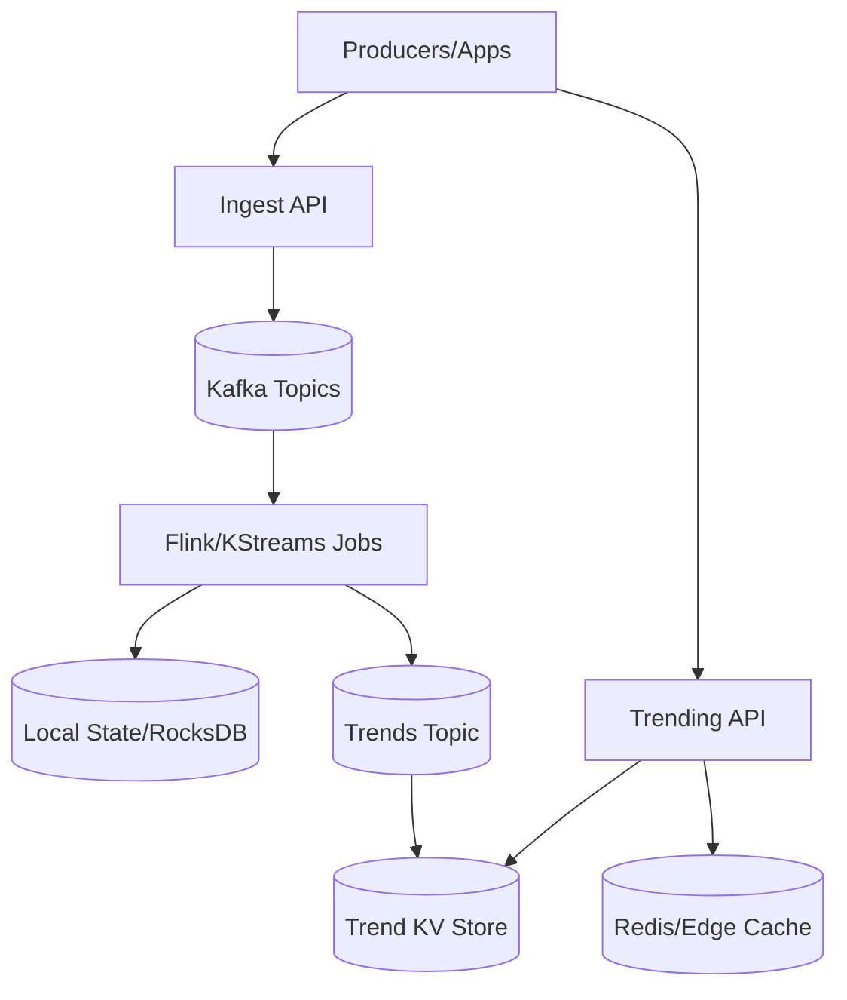
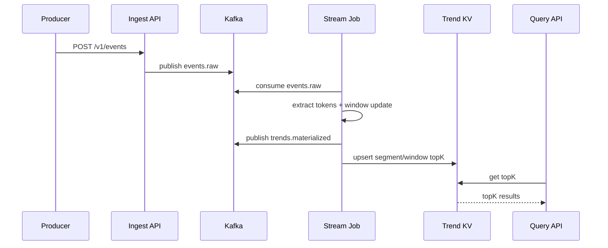

## Overview

A Trending Topics Engine identifies keywords (or hashtags/entities) whose popularity is *surging* right now, not merely those with the highest absolute volume. The challenge is that the system must process a high-throughput event stream (posts, searches, clicks), continuously compute statistics over **sliding windows**, and return results with low latency while remaining robust to spam, duplication, and “always popular” terms.

The key insight is to split the problem into two layers: (1) **stream-time counting** that maintains approximate heavy-hitter candidates per segment (region/language/topic) using bounded-memory algorithms, and (2) **trend scoring** that compares short-term rates to longer-term baselines to detect bursts. This enables near-real-time updates (seconds) with predictable compute and memory, while allowing replay/backfill and operational safety.

## Requirements

### Functional Requirements
- Ingest high-volume events (e.g., post created, search query, hashtag used) with timestamps and metadata (region, language, source).
- Normalize raw text into tokens/keywords (lowercasing, stemming, hashtag parsing, entity extraction) and apply stopword/blocked-term filtering.
- Compute trending keywords using **sliding windows** (e.g., last 1m/5m/15m) and rank by a burst/trend score, not raw count.
- Support segmentation: per region, language, and optional topic/category (sports, finance) with configurable granularity.
- Provide query APIs to fetch top-N trending keywords per segment and window with pagination and freshness indicators.
- Apply anti-abuse controls: deduplication, rate limits, bot/spam detection hooks, and allowlist/blocklist management.
- Support replay/backfill from an event log to recover state or recompute with new logic.
- Provide explainability metadata for each trend (counts, baseline, score components, sample sources if allowed).

### Non-Functional Requirements
- **Scale**:
  - Ingest: 1M events/sec peak globally (posts/searches aggregated), average 200K/sec.
  - Unique tokens: up to 50M/day; heavy tail distribution.
  - Read QPS: 20K QPS global for “get trending” (fanout via caching/CDN).
- **Latency**:
  - Ingest acknowledgment: P99 < 100ms.
  - Trend updates: P50 < 2s, P99 < 10s from event time to availability.
  - Query API: P50 < 30ms, P99 < 150ms (cache hit), < 400ms (cache miss).
- **Availability**: 99.99% for query APIs; 99.9% for ingestion pipeline.
- **Consistency**:
  - Event ingestion: at-least-once delivery; dedup for idempotency.
  - Trend results: eventual consistency within the update SLA (seconds).
- **Durability**:
  - Event log: durable for 7–30 days (replayable).
  - Trend materializations: rebuildable from event log; tolerate loss of < 1 minute of in-flight state (RPO).

### Constraints & Assumptions
- Team can operate Kafka + a stream processor (Flink/Kafka Streams) and a low-latency key-value store.
- Results must be computed in **event time** (not processing time) to handle out-of-order events.
- Compliance: PII must not be stored in trend indices; raw content access is restricted and audited.
- Budget favors bounded-memory approximate algorithms over exact global counting of all tokens.

## High-Level Architecture



Producers send events to an ingestion API that validates, enriches, and writes them to Kafka. Stream processing jobs consume the event stream, perform tokenization/normalization, maintain windowed heavy-hitter structures in local state, compute trend scores, and publish materialized results to a compact “trends” topic. A serving index (low-latency KV) stores the latest top-N lists per segment/window; the query API reads from cache first, then from the index.

This design cleanly separates **durable ingestion (Kafka)** from **stateful computation (stream processor)** and **low-latency serving (KV + cache)**. It supports replay/backfill, scales horizontally via partitioning, and keeps memory bounded by using approximate heavy-hitter algorithms instead of storing counts for every token.

## Component Deep-Dive

### Ingest API & Normalization

**Responsibility**: Accept events, validate schema, enforce rate limits, normalize metadata, and publish to Kafka with stable keys/partitions.

**Key Design Decisions**:
- Use **at-least-once** ingestion with idempotency keys to avoid data loss while enabling dedup downstream.
- Keep ingestion lightweight; push expensive NLP/entity extraction to stream processing (or an async enrichment topic) to protect tail latency.

**Technology Choice**: Envoy/NGINX + stateless Go/Java service; Kafka producer with idempotent producer enabled; schema registry (Protobuf/Avro).

**Scaling Strategy**: Scale stateless pods behind L7 LB; partition Kafka by `(segment_id, time_bucket)` to balance load and preserve locality.

---

### Stream Processing (Windowing + Heavy Hitters)

**Responsibility**: Compute windowed counts and trend scores in event time, maintain approximate top-K, and emit materialized results.

**Key Design Decisions**:
- Use **event-time sliding windows** with watermarks (e.g., allowed lateness 30s–2m) to handle out-of-order events.
- Use bounded-memory **heavy-hitter algorithms**:
  - **SpaceSaving** (a.k.a. Frequent algorithm) for accurate top-K candidates per partition/segment.
  - Optional **Count-Min Sketch (CMS)** for approximate frequency estimation when candidate space is large; pair with a small heap for top-K.

**Technology Choice**: Apache Flink (stateful operators, RocksDB state backend, exactly-once sinks if needed) or Kafka Streams (simpler ops, good for Kafka-native deployments).

**Scaling Strategy**:
- Partition by `segment_id` (e.g., region+language+topic) and further by `hash(token)` for hot segments.
- Use **two-stage aggregation**: shard-level top-K → merge-stage top-K per segment to reduce shuffle and state size.
- Autoscale based on consumer lag, state size, and processing time per record.

---

### Trend Scoring & Baselines

**Responsibility**: Convert counts into “surge” scores that demote always-popular tokens and highlight sudden increases.

**Key Design Decisions**:
- Compute both:
  - **Short-term rate**: counts in sliding window (e.g., 5m).
  - **Baseline**: longer window (e.g., 1h/24h) or exponentially weighted moving average (EWMA).
- Use robust burst metrics per token:
  - `score = (short_rate - baseline_rate) / sqrt(baseline_rate + k)` (Poisson-like normalization)
  - Apply minimum support thresholds (e.g., short_count ≥ 200) to reduce noise.

**Technology Choice**: Implement scoring in the stream job; maintain baseline state via tumbling-window aggregates or EWMA in keyed state.

**Scaling Strategy**: Baseline state is heavier than short windows; keep only for candidate tokens (from heavy-hitter sets) rather than all tokens.

---

### Serving Index & Cache

**Responsibility**: Store and serve the latest top-N trends per `(segment, window)` quickly and cheaply.

**Key Design Decisions**:
- Write **materialized top-N lists** (not raw events) to a KV store keyed by segment+window for O(1) reads.
- Use aggressive caching (Redis + CDN/edge cache) with short TTL (2–10s) and soft-staleness indicators.

**Technology Choice**: Redis Cluster for hot results + ScyllaDB/Cassandra/DynamoDB for durable serving store (optional); Kafka compacted topic as a recovery source.

**Scaling Strategy**: Read-heavy scaling via cache; shard KV by segment_id; multi-region replication for read locality.

---

### Operations & Governance

**Responsibility**: Observability, abuse controls, configuration management, and safe deployments.

**Key Design Decisions**:
- Treat stopwords/allowlists and scoring parameters as **dynamic config** (versioned, audited) broadcast to stream jobs.
- Provide “kill switches” per segment to prevent abusive trends from being served.

**Technology Choice**: Prometheus/Grafana, OpenTelemetry tracing, config via Consul/ZooKeeper/etcd or a config service.

**Scaling Strategy**: Control plane is low QPS; prioritize correctness and auditability over throughput.

## Data Model

### Storage Schema

**Kafka Topics**
- `events.raw` (partitioned): `{event_id, event_time, source, region, language, text, user_hash, metadata}`
- `tokens.extracted` (optional): `{event_id, event_time, segment_id, token, weight}`
- `trends.materialized` (compacted): `{segment_id, window, as_of_time, topk:[{token, score, short_count, baseline, rank}]}`

**Serving KV (example)**
- Key: `segment_id|window|as_of_bucket`
- Value:
  - `as_of_time` (ms)
  - `topk` array (token, score, counts, optional annotations)
  - `watermark` (event-time watermark for freshness)

**Config Store**
- `stopwords:{lang}` set
- `blocked_tokens:{segment}` set
- `scoring_params:{segment}` document (thresholds, windows, smoothing)

### Data Flow



Key operations:
- **Ingestion**: Validate + enrich → append to Kafka.
- **Processing**: Tokenize → update sliding window structures → compute score → emit top-N per segment/window.
- **Serving**: Query reads precomputed top-N lists; avoids scanning large datasets at read time.

## API Design

### Ingestion API (REST)

**POST** `/v1/events`
- Request:
  ```json
  {
    "event_id": "uuid",
    "event_time_ms": 1734370000123,
    "source": "post|search|click",
    "region": "us",
    "language": "en",
    "text": "Some text with #hashtag",
    "user_hash": "opaque",
    "metadata": { "topic": "sports" }
  }
  ```
- Response:
  ```json
  { "status": "accepted" }
  ```
- Errors:
  - `400` invalid schema/timestamp
  - `429` rate limit
  - `503` cannot enqueue
- Idempotency:
  - `event_id` is required; ingestion is idempotent per `(source,event_id)` for a retention window (e.g., 24h).

### Trending Query API (REST)

**GET** `/v1/trending`
- Query params: `region`, `language`, `topic?`, `window=1m|5m|15m`, `limit` (<= 100)
- Response:
  ```json
  {
    "segment": {"region":"us","language":"en","topic":"sports"},
    "window":"5m",
    "as_of_time_ms": 1734370009000,
    "watermark_ms": 1734370007000,
    "results":[
      {"token":"worldcup","score":12.4,"short_count":18200,"baseline_rate":9000.0,"rank":1}
    ]
  }
  ```
- Errors:
  - `400` invalid params
  - `404` unknown segment (optional)
  - `503` backend unavailable
- Idempotency: GET is naturally idempotent; include `as_of_time_ms` to support client-side caching.

### Admin APIs

**POST** `/v1/admin/blocked-tokens`
- Body: `{ "segment": "...", "tokens": ["..."], "reason": "..." }`
- Audited, permissioned; changes versioned and propagated to stream jobs within seconds.

## Scaling & Performance

### Bottleneck Analysis
- **Hot segments** (e.g., `us-en`) causing skew: mitigate with sub-sharding (`segment_id + shard`) and two-stage aggregation.
- **Token explosion** from spam/garbage: mitigate with normalization, stopwords, min-length rules, per-user/token rate limits, and candidate-only baseline tracking.
- **State size growth**: bounded via SpaceSaving/CMS + keeping baselines only for candidates; use TTL on keyed state.
- **Kafka lag during spikes**: autoscale consumers, increase partitions, and apply backpressure; degrade by increasing update interval (e.g., emit every 5s instead of every 1s).

### Horizontal Scaling
- **Ingest**: stateless scaling; Kafka partitions sized for peak (e.g., 2–5K msgs/sec/partition → 500 partitions for 1M/sec).
- **Stream processing**:
  - Key by `segment_id` then shard for hotspots.
  - Operator parallelism tuned to keep P99 processing < watermark slack.
- **Serving**:
  - Cache-first; KV store sharded by `segment_id`.
  - Multi-region read replicas; route users to nearest region.

### Caching Strategy
- **Edge/Redis cache** keyed by `(segment, window)` with TTL 2–10s.
- **Stale-while-revalidate**: serve slightly stale results (e.g., up to 30s) if KV is degraded, flagged via `as_of_time_ms`.
- Invalidation:
  - Prefer TTL over explicit invalidation (updates are frequent).
  - Optionally push cache refresh on new materialization events for top segments.

## Trade-offs & Alternatives

### Key Trade-offs Made
- **Approximate heavy hitters (SpaceSaving/CMS)** chosen over exact counts:
  - Sacrifice: exactness for long-tail tokens and strict determinism.
  - Benefit: bounded memory, predictable compute, feasible at high throughput.
- **Precomputed top-N materialization** chosen over on-demand aggregation:
  - Sacrifice: less flexible ad-hoc queries.
  - Benefit: low-latency reads at scale and simpler caching.
- **Event-time processing with watermarks** chosen over processing-time:
  - Sacrifice: added complexity and late-event handling.
  - Benefit: correctness under out-of-order delivery and regional clock skew.

### Alternative Approaches
- **Batch + micro-batch (Spark Structured Streaming)**: simpler for some teams, but often higher latency and heavier ops for second-level freshness.
- **Search-index-centric (Elasticsearch aggregations)**: good for exploration, but expensive at high ingest and difficult to do precise sliding-window burst scoring at sub-second cadence.
- **Pure sketching without candidate sets**: smallest memory footprint, but ranking/top-K extraction and explainability become harder and less accurate.

## Failure Modes & Mitigations

### Failure Scenarios
- **Scenario**: Kafka partition outage or under-replication  
  **Impact**: ingestion backpressure; delayed trends  
  **Detection**: ISR shrink, producer errors, consumer lag alerts  
  **Mitigation**: RF=3, rack-aware placement, throttled producers, failover brokers, load shedding

- **Scenario**: Stream job crash / state corruption  
  **Impact**: trend gaps or resets for segments  
  **Detection**: job health, checkpoint failures, anomalous score drops  
  **Mitigation**: periodic checkpoints, RocksDB state backups, replay from Kafka, blue/green job deployment

- **Scenario**: Hotkey skew (major event causes a single segment to dominate)  
  **Impact**: lag increases, missed SLAs  
  **Detection**: per-key processing time, partition-level lag  
  **Mitigation**: shard hot segments, adaptive repartitioning, two-stage aggregation, cap per-token updates per second

- **Scenario**: Spam/bot attack generating artificial trends  
  **Impact**: corrupted results, trust loss  
  **Detection**: anomaly detectors on user diversity, source mix, token entropy  
  **Mitigation**: per-user rate limits, dedup, reputation scores, require diversity thresholds, manual blocklists

- **Scenario**: KV store partial outage  
  **Impact**: query failures or stale results  
  **Detection**: elevated P99/5xx, replica lag  
  **Mitigation**: cache TTL + stale serving, multi-AZ replicas, fallback to reading compacted `trends.materialized`

### Disaster Recovery
- **RTO/RPO**: RTO 15 minutes, RPO 1 minute (trends), RPO 0 (event log with RF=3).
- **Backup strategy**:
  - Kafka: cross-cluster replication (MirrorMaker 2 / Cluster Linking).
  - Stream state: checkpoint storage in durable object store; periodic verification restores.
  - Serving KV: snapshots + incremental backups; multi-region replication if required.
- **Failover procedures**:
  - Promote secondary Kafka/compute cluster; restart stream jobs from replicated topics/checkpoints.
  - Switch query API to secondary region; warm caches from latest materializations.

## Operational Considerations

### Monitoring & Alerting
- Ingest: request rate, P99 latency, 4xx/5xx, producer error rate.
- Kafka: consumer lag per group/partition, ISR, under-replicated partitions.
- Stream jobs: watermark delay, checkpoint duration/failures, state size, backpressure time.
- Serving: cache hit rate, KV P99, stale-serve rate, top segment read QPS.
- Data quality: tokenization rate, dropped-event counts, trend volatility, “always-trending” token list.

Suggested alerts:
- Consumer lag > 60s for top segments (page)
- Watermark delay > 30s sustained (page)
- Query P99 > 400ms or 5xx > 1% (page)
- Checkpoint failures > 3 in 10 minutes (page)

### Deployment Strategy
- Use blue/green for stream jobs (new consumer group) and dual-write materializations until validated.
- Canary scoring/config changes per segment; rollback by reverting config version.
- Schema evolution via schema registry compatibility rules; avoid breaking changes in event payloads.

## References & Further Reading
- SpaceSaving / Frequent algorithm: “Efficient Computation of Frequent and Top-k Elements in Data Streams”
- Count-Min Sketch: “An Improved Data Stream Summary: The Count-Min Sketch and its Applications”
- Apache Flink docs: event time, watermarks, state backends, checkpoints
- Kafka design: partitions, compaction, idempotent producers
- Real-world analogs: Twitter Trends, Google Trends (burst detection + baselines), Reddit r/popular ranking patterns