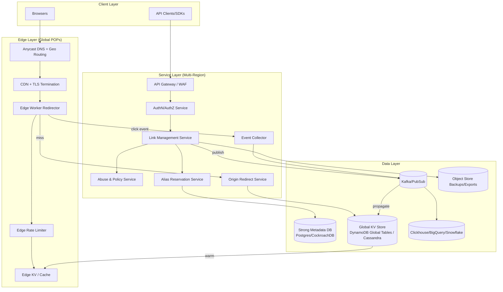
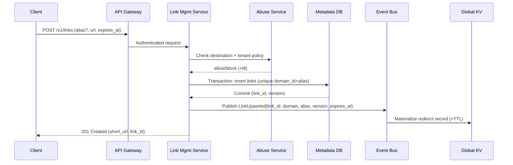
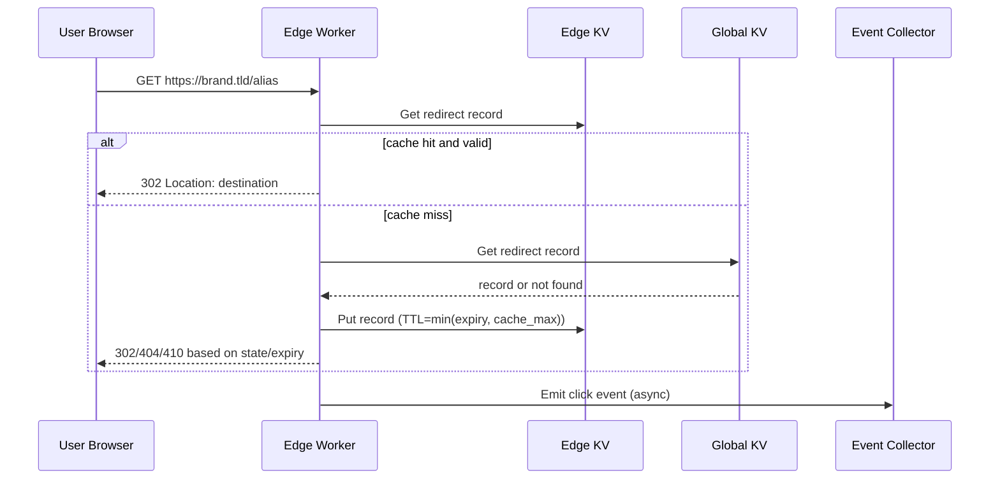

## Overview

A modern URL shortener is deceptively simple: create a short code that redirects to a long URL. In production, the hard parts are (1) extremely read-heavy traffic with global latency expectations, (2) custom aliases with collision control and predictable behavior, (3) aggressive expiration policies that must be enforced at the edge, and (4) abuse prevention (phishing, malware, spam, open-redirect laundering) without breaking legitimate high-volume use cases.

The key insight is to split the system into two planes: a **global read/redirect plane** optimized for low-latency lookups at the edge, and a **write/management plane** optimized for correctness, policy enforcement, and operational controls. Redirects are served from an edge KV/cache with TTL-enforced entries, while writes go through a strongly consistent metadata store that fans out to edge storage asynchronously but quickly.

## Requirements

### Functional Requirements
- Create short links with system-generated codes and user-provided **custom aliases** (case policy configurable).
- Support **aggressive expiration**: per-link TTL, absolute expiration timestamp, and max-age policies (e.g., “expire 24h after creation”).
- Redirect with correct semantics: 301/302/307/308, preserve query params optionally, add UTM parameters optionally.
- Link management: retrieve/update destination URL, disable/enable, rotate destination, set password or access policy (optional), manage tags/notes.
- Branded domains: map `brand.example` to a tenant, enforce per-domain alias namespaces.
- Abuse prevention: real-time checks at create time and at redirect time; rate limits; block/allow lists; takedown workflow.
- Analytics: near-real-time click events (geo, device, referrer), aggregated reporting, export API.
- Bulk operations: batch create, bulk disable/expire, import/export.

### Non-Functional Requirements
- **Scale**:
  - Redirects: 50K QPS average, 300K QPS peak globally (e.g., campaigns), 5–10B redirects/day.
  - Writes (create/update): 1K QPS average, 5K QPS peak.
  - Stored links: 5B total, with heavy TTL churn (e.g., 30–70% expire within 7 days).
  - Analytics events: same order as redirects (billions/day).
- **Latency**:
  - Redirect lookup P50 < 10ms, P99 < 40ms at edge POP (excluding client network).
  - Create link P50 < 150ms, P99 < 500ms.
- **Availability**:
  - Redirect path: 99.99% (multi-region + edge failover).
  - Management APIs: 99.9% acceptable.
- **Consistency**:
  - Strong consistency for alias reservation and link updates (avoid alias hijack / lost updates).
  - Eventual consistency for analytics, edge propagation, and reporting dashboards.
- **Durability**:
  - Link metadata: RPO ≈ 0 (no acknowledged write loss), RTO < 30 minutes.
  - Analytics: tolerate small loss/duplication (at-least-once), correctness via aggregation idempotency.

### Constraints & Assumptions
- Multi-tenant product (teams/organizations), each can own multiple branded domains.
- “Aggressive expiration” means TTL is a first-class attribute enforced on every redirect; expired links must stop redirecting within minutes globally.
- Network egress to external reputation services may be rate-limited/expensive; cache results aggressively.
- Compliance: store minimal PII; IP addresses truncated or hashed; configurable retention (e.g., 30/90/365 days).
- Team size ~6–10 engineers; prefer managed services where reasonable.

## High-Level Architecture



The redirect path is optimized for global reads: an edge worker checks rate limits, reads from edge KV/cache, and redirects immediately. On cache miss (or certain policy checks), it falls back to an origin redirect service backed by a globally replicated KV store, then warms the edge cache.

The management path is strongly consistent: alias reservation and link updates commit to a transactional metadata database, then publish changes to an event bus to update the global KV and invalidate/warm edge caches. Abuse controls are applied at creation time and continuously at redirect time with fast-path cached decisions.

## Component Deep-Dive

### Edge Worker Redirector

**Responsibility**: Serve global low-latency redirects, enforce TTL/disable flags, do lightweight abuse checks, emit click events.

**Key Design Decisions**:
- Cache link records in **edge KV** with TTL mirroring link expiration to ensure expired links naturally disappear.
- Use **stale-while-revalidate** for non-expired entries to survive brief origin/KV issues while preserving correctness for takedowns via fast invalidation.

**Technology Choice**: Cloudflare Workers + KV / Fastly Compute@Edge + KV, or AWS CloudFront Functions + Lambda@Edge + DynamoDB DAX (depending on platform).

**Scaling Strategy**: Horizontally scales with POP footprint; per-POP rate limiting and caching reduce origin load by >95%.

### Link Management Service

**Responsibility**: Create/update/delete links, manage domains, policies, bulk ops, authz, and publish propagation events.

**Key Design Decisions**:
- Separate **alias reservation** from link metadata updates to guarantee uniqueness and prevent races.
- Enforce a strict **policy engine** (expiration defaults, max TTL per tenant, prohibited destinations/domains).

**Technology Choice**: Stateless service (Go/Java) behind API Gateway; PostgreSQL or CockroachDB for transactional metadata.

**Scaling Strategy**: Scale out behind load balancer; shard-heavy operations (bulk) via async jobs and work queues.

### Alias Reservation Service

**Responsibility**: Ensure custom aliases and generated codes are unique within a namespace (global or per branded domain).

**Key Design Decisions**:
- Use **conditional writes/CAS** (e.g., `INSERT ... ON CONFLICT` or DynamoDB `ConditionExpression`) to atomically claim an alias.
- Support **soft-delete with tombstones** to prevent immediate reuse (anti-abuse, avoid “resurrecting” old links).

**Technology Choice**: If using SQL: unique index on `(domain_id, alias)` with transactional semantics. If using KV: DynamoDB conditional put.

**Scaling Strategy**: Partition by hash(alias) and/or domain; keep operations O(1). Hot aliases are naturally limited by uniqueness.

### Global KV Store (Redirect Record Store)

**Responsibility**: Provide fast, globally replicated read model for redirects (`alias -> redirect record`) with TTL support.

**Key Design Decisions**:
- Store a denormalized **redirect record** (destination, status code, flags, expiry, version) optimized for the redirect path.
- Multi-region replication for low-latency reads; tolerate eventual replication but maintain correctness via **versioning** and **takedown priority**.

**Technology Choice**: DynamoDB Global Tables, Cassandra multi-DC, or FoundationDB (if operating your own). Must support high read QPS and TTL.

**Scaling Strategy**: Partition by alias hash; autoscale RCUs; use adaptive capacity/hot partition detection.

### Abuse & Policy Service

**Responsibility**: Prevent malicious links and abusive traffic; integrate reputation sources; run takedowns and throttling.

**Key Design Decisions**:
- Two-stage checks: **create-time** (blocking) and **redirect-time** (fast allow/deny with cached verdicts).
- Store verdicts with TTL and provenance (source + confidence) to avoid repeated expensive lookups.

**Technology Choice**: Internal service + Redis for verdict cache; optional integrations: Google Safe Browsing, OpenPhish, Spamhaus, internal ML model.

**Scaling Strategy**: Cache-first; batch background rescans; isolate external dependency failures with circuit breakers.

## Data Model

### Storage Schema

**Metadata DB (SQL)**

- `tenants`
  - `tenant_id (pk)`, `name`, `plan`, `created_at`
- `domains`
  - `domain_id (pk)`, `tenant_id (fk)`, `hostname (unique)`, `status`, `created_at`
- `links`
  - `link_id (pk, ULID)`, `tenant_id (fk)`, `domain_id (fk)`
  - `alias (varchar)`, `destination_url (text)`
  - `http_status (int)`, `created_at`, `updated_at`
  - `expires_at (timestamp, nullable)`, `max_clicks (nullable)`
  - `state (enum: active|disabled|expired|takedown)`
  - `version (bigint)` (optimistic concurrency)
  - Unique index: `(domain_id, alias)`
- `alias_tombstones`
  - `domain_id`, `alias`, `tombstone_until`, `reason`, unique `(domain_id, alias)`
- `abuse_verdicts`
  - `subject_type (link|domain|destination_host)`, `subject_id/hash`
  - `verdict (allow|block|challenge)`, `reason`, `source`, `expires_at`

**Redirect KV Record (denormalized)**
- Key: `{domain_hostname}:{alias}`
- Value:
  - `destination_url`
  - `http_status`
  - `state`
  - `expires_at` (epoch ms)
  - `version`
  - `tenant_id`
  - `policy_flags` (e.g., `preserve_query`, `utm_append`, `requires_password`)
- TTL: set to `expires_at` (or shorter if state becomes disabled/takedown)

**Analytics**
- Raw events (stream): `{timestamp, key, link_id, tenant_id, pop, country, ua_hash, referrer_hash, outcome}`
- Aggregates (OLAP): rollups by minute/hour/day keyed by `tenant_id, link_id, dimensions...`

### Data Flow





## API Design

### Create Link
- `POST /v1/links`
- Headers: `Authorization: Bearer ...`, `Idempotency-Key: <uuid>`
- Request:
  ```json
  {
    "domain": "brand.example",
    "alias": "spring-sale", 
    "destination_url": "https://shop.example/products?x=1",
    "http_status": 302,
    "expires_at": "2026-01-01T00:00:00Z",
    "preserve_query": true
  }
  ```
- Response `201`:
  ```json
  {
    "link_id": "01J9...ULID",
    "short_url": "https://brand.example/spring-sale",
    "version": 1,
    "expires_at": "2026-01-01T00:00:00Z"
  }
  ```
- Errors:
  - `409 ALIAS_TAKEN` (custom alias collision)
  - `400 INVALID_URL` / `400 INVALID_EXPIRES_AT`
  - `403 POLICY_VIOLATION` (e.g., max TTL exceeded)
  - `429 RATE_LIMITED`
  - `451 BLOCKED` (abuse verdict)

**Idempotency**: store `Idempotency-Key` per tenant for 24h in Redis/DB; return the original result on retry.

### Update Link
- `PATCH /v1/links/{link_id}`
- Request supports partial updates: `destination_url`, `expires_at`, `state`, `http_status`.
- Concurrency: `If-Match: "<version>"` or `version` field; return `409 VERSION_CONFLICT` on mismatch.
- Side effects: publish `LinkUpserted` to propagate to KV/edge.

### Resolve (Debug/Programmatic)
- `GET /v1/resolve/{domain}/{alias}`
- Returns redirect record and state (no redirect), useful for SDKs and debugging.

### Redirect Endpoint
- `GET /{alias}` on branded domain.
- Responses:
  - `302/301/307/308` with `Location`.
  - `404` for unknown alias (optionally `410` for expired to reduce enumeration ambiguity based on policy).
  - `451` or `403` for takedown/block (configurable “safe landing page” instead of raw status).

## Scaling & Performance

### Bottleneck Analysis
- **Redirect QPS dominates**: origin DB cannot be on the hot path. Mitigation: edge cache + global KV + high cache hit ratio.
- **Hot aliases (viral links)**: single key read amplification. Mitigation: edge caching, per-POP caching, request coalescing, and optional “shield” POP.
- **Analytics ingestion**: billions of events/day. Mitigation: asynchronous event pipeline, sampling for free tiers, aggregation rollups.
- **Abuse checks**: external lookups can be slow/unreliable. Mitigation: cached verdicts + circuit breakers + async rescans.

### Horizontal Scaling
- **Edge layer**: scales by POP; rate limiting local to POP; global coordination only for extreme abuse cases.
- **Services**: stateless; autoscale on CPU/QPS; separate read/write pools.
- **Metadata DB**:
  - If Postgres: primary + read replicas; partition `links` by `tenant_id` or time if needed; move to CockroachDB if multi-region strong writes are required.
  - Keep redirects off SQL hot path.
- **KV**: shard by `hash(domain+alias)`; enable adaptive capacity; pre-warm for campaigns via batch writes.

### Caching Strategy
- **Edge KV/cache**:
  - Cache redirect records keyed by `{host}:{alias}`.
  - TTL = min(link expiry, cache cap e.g. 24h); store `expires_at` in value for correctness.
  - Negative caching: cache “not found” for short TTL (e.g., 30–120s) to dampen scans.
- **Verdict cache** (Redis/edge):
  - Cache abuse verdicts for destination host and full URL hash (e.g., 1–24h depending on confidence/source).
- **Invalidation**:
  - On disable/takedown: publish high-priority invalidation event; edge workers check a small “takedown bloom/filter list” periodically or consult a tiny “hot blocklist” KV with very short TTL.
  - For normal updates: rely on versioning; if cached version < KV version, refresh.

## Trade-offs & Alternatives

### Key Trade-offs Made
- **Chosen**: Edge-first redirects with KV read model  
  - **Sacrificed**: Immediate global strong consistency for updates  
  - **Why**: Redirect latency and availability matter more; propagation delays are acceptable with versioning and fast takedown paths.
- **Chosen**: Strong alias uniqueness via SQL unique index / conditional put  
  - **Sacrificed**: Slightly higher write latency  
  - **Why**: Alias collisions are correctness bugs and security risks; writes are low QPS relative to reads.
- **Chosen**: Asynchronous analytics pipeline  
  - **Sacrificed**: Perfect real-time accuracy and exactly-once ingestion  
  - **Why**: Cost and scalability; aggregates can be made correct via idempotent rollups.

### Alternative Approaches
- **Single global SQL as source for redirects**: simpler, but cannot meet global P99 without massive caching and risks DB overload.
- **Pure CDN cache without KV**: cheap and fast, but hard to invalidate/update reliably and to enforce aggressive TTL/state changes.
- **Per-region independent short codes**: scales writes well but complicates custom aliases and portability; increases collision/UX issues.

## Failure Modes & Mitigations

### Failure Scenarios
- **Scenario**: Global KV region replication lag  
  - **Impact**: Some POPs serve stale redirects briefly  
  - **Detection**: Version skew metrics, replication lag alarms  
  - **Mitigation**: Embed `version`; edge refresh on mismatch; route origin reads to nearest healthy region; fast takedown path bypasses lag.
- **Scenario**: Edge cache poisoning / malformed destination injection  
  - **Impact**: Incorrect redirects, security issues  
  - **Detection**: Signature/validation failures, anomaly detection on destination host changes  
  - **Mitigation**: Only accept redirect records produced by trusted pipeline; validate URL scheme/host; sign records (HMAC) if stored in untrusted caches.
- **Scenario**: Abuse traffic spikes (enumeration, credential stuffing on management APIs)  
  - **Impact**: Elevated costs, degraded latency  
  - **Detection**: WAF/rate limit metrics, 4xx/5xx spikes, unique alias scan patterns  
  - **Mitigation**: Multi-layer rate limits (edge + gateway), bot detection, progressive challenges (CAPTCHA), negative caching.
- **Scenario**: Metadata DB outage  
  - **Impact**: Cannot create/update links; redirects still work  
  - **Detection**: DB health checks, error budgets  
  - **Mitigation**: Redirect plane decoupled; fail management APIs gracefully; use multi-AZ DB, PITR, read-only mode for dashboards.
- **Scenario**: Clock skew affects expiration enforcement  
  - **Impact**: Early/late expiry at some POPs  
  - **Detection**: NTP drift monitoring, expiry mismatch audits  
  - **Mitigation**: Use server-side epoch times; keep POP time synchronized; treat `expires_at` with small safety window (e.g., expire if now > expires_at - 2s).

### Disaster Recovery
- **Targets**: Redirect RTO < 15 minutes, RPO ~ 0 for metadata; analytics RPO up to 15 minutes acceptable.
- **Backup strategy**:
  - Metadata DB: continuous PITR + daily snapshots to object store, tested restores weekly.
  - KV: treat as derived; rebuild from metadata + event log if needed.
  - Event bus: retain 3–7 days to allow replays.
- **Failover procedures**:
  - Anycast DNS + health-based routing to shift traffic away from failing regions/POPs.
  - Runbook for “global takedown mode”: serve safe landing page for blocked keys via hot blocklist.

## Operational Considerations

### Monitoring & Alerting
- Redirect SLOs: P50/P95/P99 latency per POP, cache hit ratio, origin fallback rate, 3xx/4xx/5xx rates.
- Management: create/update latency, 409 collision rate, DB connections, queue lag.
- Abuse: block/challenge rates, false positive appeals, external reputation API error rate.
- Analytics: ingestion lag, dropped events, OLAP query latency, rollup completeness.
- Alerts (examples):
  - P99 redirect > 60ms for 5 minutes in any top-10 POP.
  - Origin fallback rate > 5% globally.
  - Queue lag > 2 minutes for propagation topic.
  - Sudden spike in unknown-alias requests from an ASN / prefix.

### Deployment Strategy
- Progressive delivery: canary by region/POP, then ramp; separate deploys for edge and origin services.
- Backward-compatible schemas: expand/contract; versioned redirect records.
- Rollback: instant edge worker rollback (previous version), service rollback via blue/green; feature flags for new policies.

## References & Further Reading
- DynamoDB Global Tables: https://docs.aws.amazon.com/amazondynamodb/latest/developerguide/GlobalTables.html
- Cloudflare Workers & KV: https://developers.cloudflare.com/workers/ and https://developers.cloudflare.com/kv/
- Google Safe Browsing API: https://developers.google.com/safe-browsing
- Rate limiting patterns (token/leaky bucket): https://cloud.google.com/architecture/rate-limiting-strategies-techniques
- Bitly engineering/blog posts (for practical URL shortener considerations): https://bitly.com/blog/