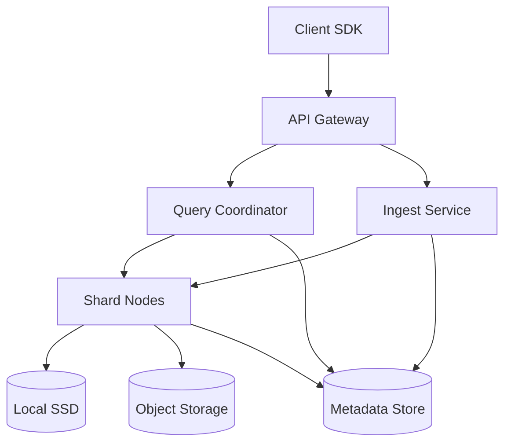
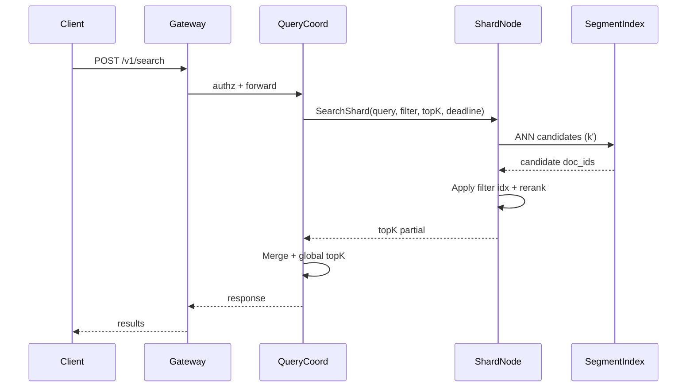

## Overview

A vector database stores high-dimensional embeddings (e.g., 384–3072 dimensions) and answers “nearest neighbor” queries efficiently, often with metadata filters (tenant, language, time range, access policy). The challenge is that exact k-NN is too slow at scale, so the system must use approximate nearest neighbor (ANN) indexes while still supporting updates, deletes, filtering, replication, and predictable latency under load.

The key insight is to separate concerns into (1) a **control plane** that manages schemas, shard placement, and cluster safety, and (2) a **data plane** that stores vectors in immutable **segments** with per-segment ANN + filter indexes. Queries fan out to shards, execute fast candidate retrieval using ANN, apply filters with bitmap/range indexes, then merge results. Writes are durable via WAL + segment flush, and indexes are built incrementally in the background to keep ingest throughput high.

## Requirements

### Functional Requirements
- Create/manage collections (dimension, distance metric, index policy, replication, TTL).
- Upsert vectors by ID with optional metadata and per-record versioning.
- Delete vectors (hard/soft) and support tombstone-aware search.
- ANN search: `topK` nearest for a query vector with optional metadata filters and scoring options.
- Batch operations (bulk upsert/delete) with backpressure and progress reporting.
- Consistent point reads by ID (get vector + metadata) for validation/debug.
- Multi-tenancy: per-tenant quotas, isolation, and access control.
- Background maintenance: compaction, index rebuild, rebalancing, snapshot/restore.

### Non-Functional Requirements
- **Scale**: 50M vectors/collection typical; up to 10B vectors cluster-wide; 10–50K QPS search; 50–200K vectors/sec sustained ingest (bulk).
- **Latency**: Search P50 30–60ms, P99 150–250ms (topK=20, filter moderate selectivity, 10–50 shards fanout).
- **Availability**: 99.99% for reads, 99.9% for writes (planned maintenance allowed).
- **Consistency**: Strong for control-plane metadata; read-your-writes optional per-collection; eventual for ANN index visibility (configurable).
- **Durability**: No acknowledged write loss (RPO ~0 for committed writes); tolerate loss of in-flight/uncommitted batches only.

### Constraints & Assumptions
- Embeddings are float32/float16; storage optimized for float16 and PQ.
- Filter predicates cover common types: equality/in-set, numeric ranges, boolean, prefix (limited).
- Typical query uses `topK<=100` and filter selectivity 1–50%.
- Team budget favors proven components (Raft KV, object storage) over fully custom storage engines.
- Compliance: encryption at rest/in transit; per-tenant data isolation; audit logs.

## High-Level Architecture



The API Gateway terminates TLS, authenticates/authorizes, and routes requests. The Query Coordinator plans searches (which shards/segments to scan), fans out to Shard Nodes, and merges partial topK results. The Ingest Service validates schema, applies quotas, and writes to shard leaders.

Shard Nodes store vectors in segment files on local SSD (hot) and/or object storage (warm/cold). A strongly consistent Metadata Store (Raft-backed) tracks collections, shard maps, segment manifests, and replica membership so query routing and recovery are deterministic.

## Component Deep-Dive

### API Gateway
**Responsibility**: AuthN/Z, rate limiting, request validation, routing, multi-tenant quotas.

**Key Design Decisions**:
- Use tenant-scoped API keys/JWT with per-collection ACLs to prevent cross-tenant leakage.
- Enforce request budgets (max dims, max batch size, max filter complexity) to protect tail latency.

**Technology Choice**: Envoy + external authz (OPA) or a Go/Rust gateway service.

**Scaling Strategy**: Stateless; horizontal autoscaling; token-bucket rate limits per tenant.

### Query Coordinator
**Responsibility**: Query planning, shard fanout, partial result merge, timeout budgeting.

**Key Design Decisions**:
- Time-sliced execution: coordinator sets per-shard deadlines and returns best-effort under soft timeouts (optional), protecting P99.
- Two-phase filtering: choose pre-filter (bitmaps/range index) vs post-filter depending on selectivity to reduce wasted ANN work.

**Technology Choice**: Go/Rust service; gRPC for shard RPC; heap-based topK merge.

**Scaling Strategy**: Stateless; consistent hashing for sticky routing to improve cache hit rate; scale by replicas behind L7.

### Shard Node (Data Plane)
**Responsibility**: Store segments, serve ANN+filter queries, accept writes, replicate, run compaction and GC.

**Key Design Decisions**:
- Segment-based storage: append to WAL + memtable; flush immutable segments with vector column + metadata column + per-segment indexes.
- Pluggable ANN per segment (HNSW for low-latency; IVF-PQ for high compression at large scale) with per-collection policy.

**Technology Choice**: Rust/C++ core for ANN; RocksDB/LSM for small metadata + WAL; custom segment files for vector blocks; SIMD-optimized distance kernels.

**Scaling Strategy**: Shard by `(tenant_id, collection_id, vector_id hash)`; add shards by splitting; each shard replicated (e.g., RF=3).

### Index Builder / Compactor
**Responsibility**: Build/merge ANN indexes, maintain PQ codebooks, compact segments, purge tombstones, tier data.

**Key Design Decisions**:
- Async indexing: writes become query-visible immediately via “delta” structure (small HNSW or brute-force buffer) while large ANN index builds in background.
- Compaction policy balances write amp vs query performance (e.g., size-tiered for ingest-heavy, leveled for stable workloads).

**Technology Choice**: Background workers on shard nodes; object storage for merged segment artifacts; optional GPU acceleration for training PQ/IVF centroids.

**Scaling Strategy**: Rate-limit compaction; isolate CPU cores; schedule by shard heat; move cold segments to object storage.

### Metadata Store (Control Plane)
**Responsibility**: Cluster membership, collection configs, shard map, segment manifests, leases/leadership, schema.

**Key Design Decisions**:
- Strong consistency via Raft so routing/placement is correct during failures.
- Immutable segment manifests with versioning to make shard recovery and query planning idempotent.

**Technology Choice**: Etcd/Consul or embedded Raft KV; Postgres for analytics/audit optional.

**Scaling Strategy**: Small, strongly consistent; partition by cluster; cache read-mostly metadata at coordinators.

## Data Model

### Storage Schema

**Control plane (strongly consistent)**
- `collections`
  - `collection_id` (uuid, pk)
  - `tenant_id` (uuid, indexed)
  - `dims` (int)
  - `distance` (enum: cosine|dot|l2)
  - `index_policy` (json: hnsw/ivf_pq params)
  - `replication_factor` (int)
  - `created_at`, `updated_at`
- `shards`
  - `shard_id` (uuid, pk)
  - `collection_id` (uuid, indexed)
  - `range_start`, `range_end` (hash range)
  - `leader_node_id` (string)
  - `replica_node_ids` (string[])
- `segments`
  - `segment_id` (uuid, pk)
  - `shard_id` (uuid, indexed)
  - `state` (enum: building|ready|deleting)
  - `vector_count` (bigint)
  - `min_version`, `max_version` (bigint)
  - `location` (enum: ssd|object)
  - `manifest` (json: file paths, checksums)

**Data plane (per shard)**
- WAL: append-only log of upserts/deletes with `(vector_id, version, embedding, metadata, op)`.
- Segments (immutable files):
  - `vectors.col`: block-compressed vector payloads (float16 or PQ codes) keyed by internal `doc_id`.
  - `id.map`: mapping `vector_id -> doc_id` for the segment (plus bloom filter).
  - `meta.col`: encoded metadata values for filterable fields.
  - `filter.idx`: per-field bitmap indexes (Roaring) for categorical/boolean; range index (BKD/segment tree) for numeric/date.
  - `ann.idx`: per-segment ANN structure (HNSW graph or IVF lists + PQ codes).
- Mutable “delta” store:
  - in-memory HNSW / brute-force buffer for recent writes not yet compacted.

### Data Flow



Write path (not diagrammed): `Gateway -> Ingest -> shard leader (WAL append + memtable) -> replicate -> ack -> async flush to segment -> async index build -> update segment manifest`.

## API Design

### Collections
- `POST /v1/collections`
  - Request: `{ "name": "...", "dims": 768, "distance": "cosine", "indexPolicy": {...}, "rf": 3 }`
  - Response: `{ "collectionId": "uuid" }`
  - Errors: `400` invalid params, `409` name conflict, `403` quota.
- `GET /v1/collections/{collectionId}`
- `PATCH /v1/collections/{collectionId}` (index policy changes are async + versioned)

### Upsert / Delete
- `POST /v1/collections/{collectionId}/vectors:upsert`
  - Headers: `Idempotency-Key: <uuid>`
  - Request:
    ```json
    {
      "vectors": [
        { "id": "user:123", "embedding": [..], "metadata": { "lang": "en", "ts": 1734390000 } }
      ],
      "consistency": "read_your_writes|eventual"
    }
    ```
  - Response: `{ "accepted": 1, "failed": [] , "writeToken": "opaque(optional)" }`
  - Errors: `413` too large, `422` dims mismatch, `429` throttled, `503` shard unavailable.
- `POST /v1/collections/{collectionId}/vectors:delete`
  - Request: `{ "ids": ["user:123"], "mode": "soft|hard" }`
  - Response: `{ "deleted": 1 }`

**Idempotency**: `Idempotency-Key` deduped per tenant+endpoint for a TTL (e.g., 24h), storing hash of request body and final outcome.

### Search
- `POST /v1/collections/{collectionId}/search`
  - Request:
    ```json
    {
      "query": { "embedding": [..] },
      "topK": 20,
      "filter": { "and": [ { "eq": ["lang", "en"] }, { "range": ["ts", 1734300000, 1734399999] } ] },
      "include": ["metadata"],
      "efSearch": 64,
      "timeoutMs": 200
    }
    ```
  - Response:
    ```json
    {
      "results": [ { "id": "user:123", "score": 0.83, "metadata": { "lang": "en" } } ],
      "tookMs": 41,
      "partial": false
    }
    ```
  - Errors: `400` invalid filter, `408` timeout, `412` requires stronger consistency (if client asked for RYW without token), `503` degraded.

### Point Read
- `GET /v1/collections/{collectionId}/vectors/{id}`
  - Response: `{ "id": "...", "embedding": [..], "metadata": {...}, "version": 42 }`

## Scaling & Performance

### Bottleneck Analysis
- **ANN CPU cost** (distance calcs, graph traversal): mitigate with SIMD kernels, float16/PQ, tuned `efSearch`, and shard-level caching of hot query vectors.
- **Fanout overhead** (many shards/replicas): mitigate with shard pruning (tenant/collection routing, filter-based pruning), replica hedging (send to 2 replicas, take first), and hierarchical coordinators if needed.
- **Write amplification** (segment compaction/index builds): mitigate with async builds, rate-limited compaction, and tiered storage.
- **Filter cost** (complex predicates): mitigate with normalized schema, bitmap indexes, predicate simplification, and caps on filter complexity.

### Horizontal Scaling
- **Gateway/Coordinator**: stateless, scale out behind L7; consistent hashing for sticky routing.
- **Shard Nodes**: shard-by-hash; split shards when vector_count or QPS crosses thresholds; replicate shards (RF=3) across failure domains (AZs).
- **Partitioning strategy**:
  - Primary: `hash(vector_id)` for uniform distribution.
  - Optional: “routing keys” (e.g., tenant subspaces) to co-locate related vectors if filters frequently constrain to that key.

### Caching Strategy
- **Coordinator**: cache shard maps/segment manifests (watch-based invalidation from metadata store).
- **Shard node**:
  - cache hottest `ann.idx` pages in memory (mmap + OS page cache).
  - cache filter bitmaps for frequently used predicates (e.g., `tenant_id`, `lang`) with small TTL and LRU.
- **Invalidation**: segment manifests are immutable; new segments = new version pointer, so caches update via version change rather than in-place invalidation.

## Trade-offs & Alternatives

### Key Trade-offs Made
- **Segmented immutable storage**
  - Chosen: predictable query performance, easy recovery, safe concurrency.
  - Sacrificed: more background compaction complexity and storage overhead.
  - Why: proven pattern (LSM/segment stores) for write-heavy + read-heavy systems.
- **Async index visibility (delta + background build)**
  - Chosen: high ingest throughput without blocking on ANN builds.
  - Sacrificed: freshly written vectors may have slightly worse recall until merged.
  - Why: keeps P99 and write throughput stable.
- **Bitmap/range filter indexes per segment**
  - Chosen: fast pre-filtering, reduces ANN work.
  - Sacrificed: extra storage and build time for indexes.
  - Why: filtering is a first-class requirement; post-filter-only often explodes latency.

### Alternative Approaches
- **Global HNSW per shard (fully mutable)**
  - Pros: great latency/recall for medium sizes.
  - Cons: expensive deletes/updates, fragmentation, hard to persist atomically.
  - Not chosen: operational complexity at very large scale.
- **Pure IVF-PQ without a delta store**
  - Pros: compact, scalable, good for billion-scale.
  - Cons: poor freshness; rebuild/training heavy; weaker recall for some distributions.
  - Not chosen: many workloads need fast read-your-writes and low-latency.
- **Use general-purpose search engine (Elasticsearch/OpenSearch kNN)**
  - Pros: mature ops, hybrid text+vector.
  - Cons: less control over memory/index layout; multi-tenant cost; ANN+filters can be less predictable.
  - Not chosen: goal is specialized production-grade vector store.

## Failure Modes & Mitigations

### Failure Scenarios
- **Scenario**: Shard leader crashes during upsert
  - **Impact**: write unavailability for that shard; potential retry storms.
  - **Detection**: missed heartbeats/lease expiry in metadata store; elevated 5xx.
  - **Mitigation**: Raft/lease-based leader election; client retries with idempotency keys; fast replica promotion (seconds).
- **Scenario**: Corrupted segment/index file on disk
  - **Impact**: shard degraded; wrong answers if undetected.
  - **Detection**: checksum verification on load; background scrubbing; query anomaly alerts (recall regression).
  - **Mitigation**: fetch segment from object storage/peer replica; mark replica unhealthy; rebuild index from vectors if needed.
- **Scenario**: Compaction or index build saturates CPU/IO causing latency spikes
  - **Impact**: P99 search degradation.
  - **Detection**: node-level CPU steal/IO wait, queue depth, tail latency alarms.
  - **Mitigation**: cgroup/priority scheduling, dynamic throttling, maintenance windows, isolate builders to dedicated nodes.
- **Scenario**: Metadata store quorum loss
  - **Impact**: control-plane freeze; routing changes blocked; reads may continue with cached routing for a bounded time.
  - **Detection**: etcd/raft quorum alerts, coordinator watch failures.
  - **Mitigation**: 3–5 node quorum across AZs; snapshot restore; coordinators operate in “read-only cached mode” with TTL before failing closed.

### Disaster Recovery
- **RTO/RPO**: RTO 30–60 minutes (region restore); RPO 0–5 minutes depending on async replication to object storage.
- **Backup strategy**: periodic metadata snapshots; segment manifests stored durably; segment files replicated/cross-region copied (async) for critical tenants.
- **Failover procedures**: promote secondary region metadata store from backups; rehydrate shard nodes by pulling manifests + segment files from object storage; gradually enable traffic with rate limits.

## Operational Considerations

### Monitoring & Alerting
- Key metrics:
  - Search latency (P50/P95/P99), QPS, error rate, partial response rate
  - Recall proxies (canary query sets), topK merge time, shard fanout counts
  - WAL lag, flush latency, compaction backlog, index build backlog
  - CPU, RSS, page faults (mmap), SSD IO wait, object store read latency
- Alerts (examples):
  - P99 search > 250ms for 5m; 5xx > 0.5% for 5m
  - WAL lag > 10s; compaction backlog > N segments; metadata quorum degraded

### Deployment Strategy
- Rolling deploy shard nodes with shard draining (stop accepting writes, transfer leadership, then restart).
- Coordinators/gateways are safe to roll quickly; shard nodes require canary + capacity headroom.
- Rollback: keep previous binaries; segment formats versioned; write path supports downgrade window (or blocks incompatible upgrades).

## References & Further Reading
- HNSW: “Efficient and robust approximate nearest neighbor search using Hierarchical Navigable Small World graphs” (Malkov & Yashunin).
- FAISS (IVF/PQ implementations and trade-offs): https://github.com/facebookresearch/faiss
- ScaNN (Google): https://github.com/google-research/google-research/tree/master/scann
- Roaring Bitmaps: https://roaringbitmap.org/
- LSM design principles (RocksDB/LevelDB): RocksDB wiki + “The Log-Structured Merge-Tree (LSM-Tree)” (O’Neil et al.).
- Production systems to study: Milvus, Weaviate, Qdrant, Pinecone (architecture blogs/whitepapers).