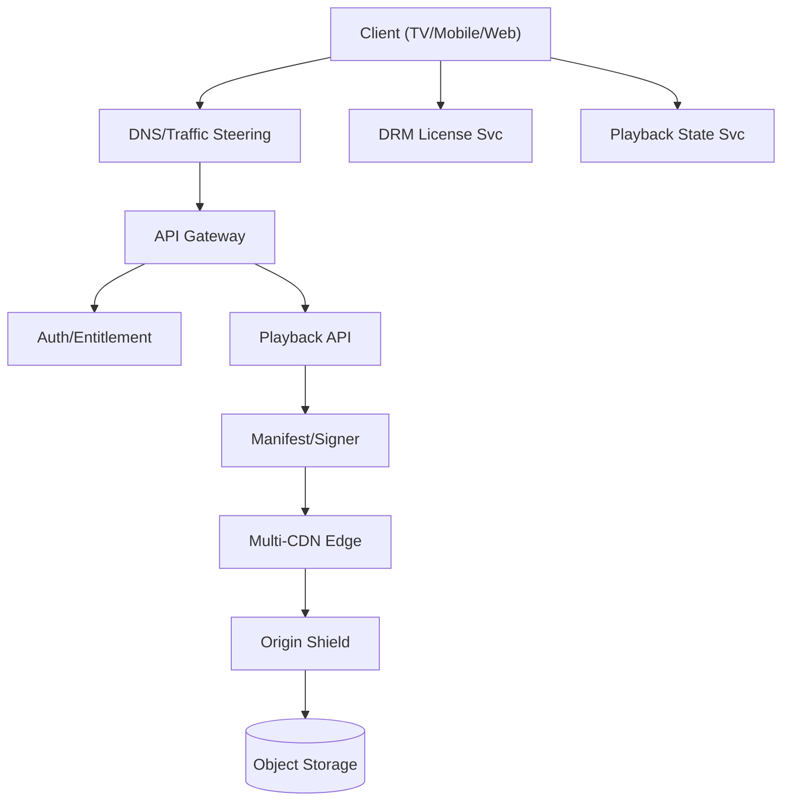
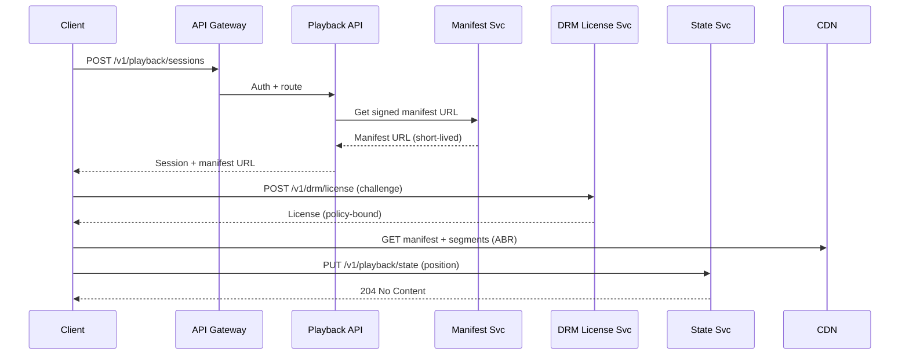

## Overview

A global Video-on-Demand (VoD) platform must reliably deliver high-bitrate video to millions of heterogeneous devices over unpredictable networks while enforcing content rights (DRM, geo/licensing windows) and providing a seamless UX (fast start, minimal rebuffering, resume playback). The hard part is that the “data plane” (segments delivered via CDN) is bandwidth-heavy and latency-sensitive, while the “control plane” (auth, entitlement, manifests, licenses, telemetry) must be highly available and consistent enough to enforce rights.

The key insight is to separate concerns: push almost all bytes to a multi-CDN edge delivery layer using HTTP-based streaming (HLS/DASH) with adaptive bitrate (ABR), and keep APIs lean, globally distributed, and cache-friendly. DRM is treated as a first-class service (keys, license issuance, policy) with strong auditing. Resume playback is handled via a small, durable, low-latency state store keyed by (profile, title, device) and synced opportunistically.

## Requirements

### Functional Requirements
- Browse/search catalog and view title metadata (availability, languages, subtitles).
- Start playback by fetching a signed manifest (HLS/DASH) and segment URLs.
- Adaptive bitrate streaming with smooth quality switches and low rebuffering.
- DRM-protected playback (Widevine/PlayReady/FairPlay) with license acquisition.
- Multi-language audio/subtitles and forced narratives by locale.
- Resume playback across devices with “continue watching” row and per-profile state.
- Support offline downloads (optional extension) with DRM and expiry.
- Collect playback QoE telemetry (startup time, rebuffer ratio, bitrate, errors).

### Non-Functional Requirements
- **Scale**:
  - 50M DAU, 10M peak concurrent streams globally.
  - Control plane: 300K peak QPS (catalog, playback, DRM, state, telemetry ingest).
  - Data plane: 200–500 Tbps peak egress across CDNs (region-dependent).
  - Library: 200K titles, 10M encoded renditions, petabytes of media objects.
- **Latency**:
  - Playback start path (excluding download of first segments): P50 < 150ms, P99 < 500ms (API).
  - DRM license issuance: P50 < 100ms, P99 < 300ms (regional).
  - Resume state read/write: P99 < 50ms (regional).
- **Availability**:
  - Control plane: 99.99% (multi-region active-active).
  - Data plane (CDN delivery): 99.995% via multi-CDN failover.
- **Consistency**:
  - Strong consistency for entitlement checks, license policy decisions, and key management.
  - Eventual consistency acceptable for recommendations, continue-watching aggregation, and analytics.
- **Durability**:
  - Media assets: 11 9’s object durability (multi-AZ, cross-region replication).
  - Resume state: RPO ≤ 1 minute, acceptable to lose last few seconds of progress.

### Constraints & Assumptions
- Licensed content requires studio-grade DRM, auditability, and geo/window enforcement.
- Global footprint: ~10–20 primary regions, edge presence via multiple CDN vendors.
- Team constraints: separate platform teams for ingest/encoding, playback services, DRM/security, and data/analytics.
- Cost constraint: egress dominates; optimize cache hit ratio and origin shielding; use per-title popularity aware pre-warming.

## High-Level Architecture



Clients use the control plane (API Gateway → Playback/Manifest) to obtain a short-lived, signed manifest pointing to CDN-hosted segments. Video bytes flow almost entirely through CDNs with an origin-shield tier to protect object storage. DRM license requests go directly to a regional license service to minimize latency and isolate failures. Resume state is maintained by a dedicated service with a low-latency store, independent of analytics pipelines.

This structure is chosen because it scales the expensive path (segment delivery) via CDN caching while keeping the control plane stateless and horizontally scalable. It also cleanly supports multi-CDN failover, per-device DRM requirements, and “resume anywhere” with minimal coupling.

## Component Deep-Dive

### Playback API (Control Plane)

**Responsibility**: Provide playback session initiation, title selection validation, ABR configuration hints, and return signed manifest URLs + playback session metadata.

**Key Design Decisions**:
- Session token + short-lived signed URLs to avoid per-segment authorization calls at origin.
- Cache-friendly responses (per-title renditions) with per-user overlays (entitlement, geo, profile maturity) computed at request time.

**Technology Choice**: Stateless services in Go/Java behind an L7 gateway; Redis/KeyDB for hot caches; OpenTelemetry for traces.

**Scaling Strategy**: Horizontal autoscaling by QPS; aggressive caching of catalog/rendition maps; regional active-active with traffic steering.

### Manifest Service (Packaging/Signing)

**Responsibility**: Generate or serve pre-generated HLS/DASH manifests, apply DRM signaling (CENC), insert CDN URLs, and sign with tokens (JWT or URL signatures).

**Key Design Decisions**:
- Use HLS + DASH with CMAF fMP4 segments to maximize device compatibility and cache reuse.
- Embed multiple CDN base URLs or provide CDN failover via DNS steering and a stable hostname.

**Technology Choice**: NGINX/Envoy edge for manifest caching; custom manifest signer; KMS-backed signing keys with rotation.

**Scaling Strategy**: Treat manifests as mostly static; cache at CDN and regional edge; compute user-specific policies minimally (e.g., max resolution).

### CDN & Origin Shield (Data Plane)

**Responsibility**: Deliver segments with high cache hit ratio, low latency, and resilience to regional/CDN outages.

**Key Design Decisions**:
- Multi-CDN with real-time steering (latency/availability/cost) and fast failover.
- Origin shield (regional) to collapse misses and protect object storage from thundering herds.

**Technology Choice**: Two or more major CDN providers + optional private CDN for top markets; shield via regional cache (Varnish/NGINX) + Anycast routing.

**Scaling Strategy**: CDNs scale inherently; optimize cache keys, segment duration (2–6s), and prefetch/warm for top titles; rate-limit origin by token bucket.

### DRM & Key Management

**Responsibility**: Encrypt content, manage keys, and issue licenses with studio-required policies (HDCP, device security level, output protection, offline rules).

**Key Design Decisions**:
- Use Common Encryption (CENC) with per-title or per-period keys; rotate keys by time window for long-form content.
- Separate key management (KMS/HSM, audited) from license issuance (high-QPS, regional).

**Technology Choice**: Widevine Modular, PlayReady, FairPlay; keys in HSM/KMS; license service in regional clusters; policy engine (OPA-like) for rules.

**Scaling Strategy**: Stateless license servers; cache non-sensitive policy lookups; isolate by region; strict rate limiting and bot protection.

### Playback State Service (Resume/Continue Watching)

**Responsibility**: Store and serve last-known position, watched progress, and device/session markers for “resume playback” and continue-watching UX.

**Key Design Decisions**:
- Store small, append-lite records keyed by (profile_id, title_id) with optional device dimension.
- Use optimistic writes with idempotency keys to avoid duplication during flaky networks.

**Technology Choice**: DynamoDB/Cassandra for low-latency global tables (or Spanner if strong global consistency is required); Redis for hot reads.

**Scaling Strategy**: Partition by profile_id; TTL old session details; async fanout to analytics for aggregates.

## Data Model

### Storage Schema

**Catalog (metadata store, e.g., PostgreSQL/Spanner + search index)**
- `titles`:
  - `title_id (PK)`, `type (movie|episode)`, `series_id`, `season`, `episode`
  - `name`, `synopsis`, `genres[]`, `release_year`
  - `age_rating`, `artwork_urls`, `availability_windows[]`, `geo_allowlist[]`
- `renditions`:
  - `rendition_id (PK)`, `title_id`, `codec (h264|h265|av1)`, `container (cmaf)`
  - `resolution`, `bitrate_kbps`, `audio_lang`, `subtitle_langs[]`
  - `manifest_path`, `segment_path_prefix`, `drm_scheme (cenc)`

**Playback State (NoSQL)**
- `playback_state` (PK: `profile_id`, SK: `title_id`)
  - `position_ms`, `duration_ms`, `updated_at`
  - `completed (bool)`, `last_device_id`, `last_session_id`
  - `version` (monotonic) / `etag` for conflict detection

**DRM (secure stores + audit logs)**
- `content_keys` (in KMS/HSM; metadata in DB)
  - `key_id`, `title_id`, `kid`, `created_at`, `rotation_epoch`
- `license_audit` (append-only)
  - `request_id`, `profile_id`, `device_fingerprint_hash`, `title_id`, `policy_applied`, `issued_at`, `region`

### Data Flow



## API Design

### Start Playback Session
- `POST /v1/playback/sessions`
- Request:
  ```json
  {
    "profile_id": "p_123",
    "title_id": "t_987",
    "device": {"id":"d_1","type":"tv","drm":["widevine"],"max_resolution":"4k"},
    "network": {"country":"DE"},
    "resume": {"preferred": true}
  }
  ```
- Response:
  ```json
  {
    "session_id": "s_456",
    "manifest_url": "https://v.example.com/m/t_987/master.m3u8?sig=...",
    "drm": {"scheme":"cenc","license_url":"https://drm.example.com/v1/drm/license"},
    "resume": {"position_ms": 532000}
  }
  ```
- Errors: `401` (unauth), `403` (geo/entitlement), `404` (title), `429` (rate limit), `503` (region degraded).
- Idempotency: `Idempotency-Key` header; server stores key→response for 24h.

### Fetch Continue Watching
- `GET /v1/profiles/{profile_id}/continue-watching?limit=50`
- Response includes title cards + `position_ms`, `updated_at`.
- Cache: private, short TTL (e.g., 30s) due to per-profile nature.

### Update Playback State (Resume)
- `PUT /v1/playback/state`
- Request:
  ```json
  {
    "profile_id":"p_123",
    "title_id":"t_987",
    "session_id":"s_456",
    "position_ms": 540000,
    "duration_ms": 3600000,
    "completed": false,
    "client_time_ms": 1730000000000
  }
  ```
- Response: `204 No Content` or `409 Conflict` if `etag/version` stale (optional).
- Idempotency: support `Idempotency-Key` to dedupe retries.

### DRM License
- `POST /v1/drm/license`
- Request: DRM-specific challenge blob + session context token (JWT).
- Response: license blob; no caching; strict rate limiting.
- Security: mTLS optional for server-to-server, device attestation where supported.

## Scaling & Performance

### Bottleneck Analysis
- **Manifest hot-spots** (new releases): mitigate with CDN caching of manifests, pre-generation, and regional signer replicas.
- **Origin miss storms**: mitigate with origin shield, request coalescing, and segment pre-warming for top N titles.
- **DRM license spikes** at playback start: mitigate with regional license servers, autoscaling, and minimizing policy dependencies.
- **State write amplification** (frequent position updates): client-side batching (every 10–15s), delta writes, and TTL session heartbeats.

### Horizontal Scaling
- **API Gateway/Playback**: stateless pods/instances; autoscale on CPU/QPS; regional active-active.
- **State store**: partition by `profile_id`; provisioned capacity with burst; multi-region replication.
- **DRM**: stateless; shard by region; isolate keys in KMS/HSM; separate audit pipeline.
- **CDN/Origin**: multi-CDN + shields; object storage scales; keep origin QPS bounded.

### Caching Strategy
- **CDN edge**: cache segments and (mostly) manifests; long TTL for immutable versioned paths; cache keys include rendition + segment index.
- **Regional edge cache**: catalog/rendition maps; token validation JWKS; feature flags.
- **Client-side**: buffer and ABR ladder caching; persist last-known state offline then sync.
- Invalidation: versioned object paths for media; catalog changes via cache busting + event-driven invalidation.

## Trade-offs & Alternatives

### Key Trade-offs Made
- **HTTP ABR (HLS/DASH) over custom streaming**: sacrifices ultra-low latency (not needed for VoD) for massive CDN compatibility and simpler ops.
- **Short-lived signed URLs vs per-request auth**: sacrifices fine-grained mid-stream revocation for scale and low origin load; revocation handled by short TTL + session checks.
- **Eventual consistency for continue-watching aggregation**: sacrifices perfect real-time UI for simpler scaling; resume position remains strongly written per profile/title.

### Alternative Approaches
- **Single-CDN**: simpler contracts but worse resilience and less cost leverage; not chosen due to global availability requirements.
- **Per-segment authorization at origin**: strongest enforcement but too expensive and risks origin overload; not chosen for scale.
- **Full global strong consistency DB for all state**: simplifies semantics but increases tail latency and cost; not needed for most state.

## Failure Modes & Mitigations

### Failure Scenarios
- **Scenario**: One CDN provider outage  
  **Impact**: Playback failures in affected regions  
  **Detection**: Elevated 5xx, increased startup time, reduced segment success rate per CDN  
  **Mitigation**: Real-time steering to alternate CDN; clients retry with alternate base URL; pre-established warm capacity.

- **Scenario**: Origin shield overload  
  **Impact**: Cache misses amplify, increased 503s  
  **Detection**: Shield QPS spikes, object store 4xx/5xx, rising TTFB  
  **Mitigation**: Request coalescing, stricter rate limits, pre-warm popular segments, temporarily increase segment TTL.

- **Scenario**: DRM license service partial outage  
  **Impact**: Playback cannot start for DRM devices  
  **Detection**: License error rate, P99 latency, KMS/HSM errors  
  **Mitigation**: Multi-region license endpoints with client failover; degraded mode for free trailers (non-DRM) if allowed.

- **Scenario**: Playback state DB partition/regional failure  
  **Impact**: Resume/continue-watching stale or unavailable  
  **Detection**: State read/write error rates, replication lag  
  **Mitigation**: Use last-known client checkpoint; fail over reads to replica region; asynchronous backfill once recovered.

### Disaster Recovery
- RTO: 15 minutes for control plane region loss; near-zero for CDN failover.  
- RPO: ≤ 1 minute for playback state; near-zero for media objects (replicated).  
- Backups: daily full + continuous PITR for metadata; immutable object storage versioning; audit logs to WORM storage.  
- Failover: automated DNS/traffic steering; runbooks for key services; quarterly DR game days.

## Operational Considerations

### Monitoring & Alerting
- Playback QoE: startup time, rebuffer ratio, average bitrate, ABR switch frequency, error codes.
- CDN: cache hit ratio, segment 4xx/5xx, TTFB, egress per POP, origin offload.
- DRM: license success rate, P99, policy deny rate, KMS/HSM latency/errors.
- State: P99 read/write latency, conflict rate, replication lag.
- Suggested alerts: license success < 99.5% (5m), startup P99 > 2s (5m), segment 5xx > 0.5% (5m), origin QPS anomaly.

### Deployment Strategy
- Separate control-plane and DRM deploys; canary by region + % traffic, then ramp.
- Backward-compatible manifests and API versioning (`/v1`, `/v2`).
- Rollback: automated on SLO burn (error budget) and key QoE regressions; keep last-known-good signer keys and config.

## References & Further Reading
- HTTP Live Streaming (HLS): https://developer.apple.com/streaming/
- MPEG-DASH and CMAF overview: https://dashif.org/ and https://www.iso.org/standard/71975.html
- Common Encryption (CENC): https://www.iso.org/standard/68042.html
- Widevine / PlayReady / FairPlay DRM docs (vendor documentation)
- Netflix Tech Blog (CDN, encoding, QoE): https://netflixtechblog.com/
- Open Connect (Netflix CDN architecture): https://openconnect.netflix.com/