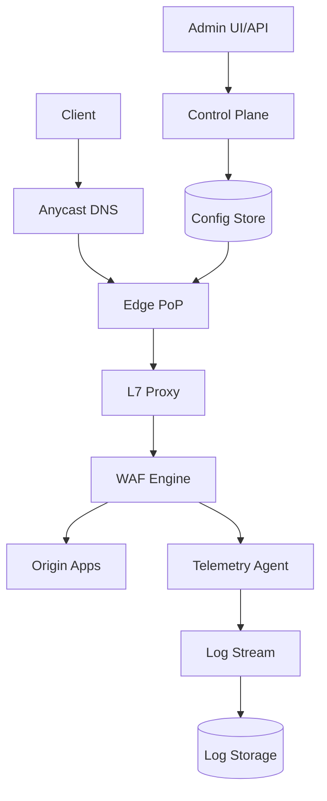
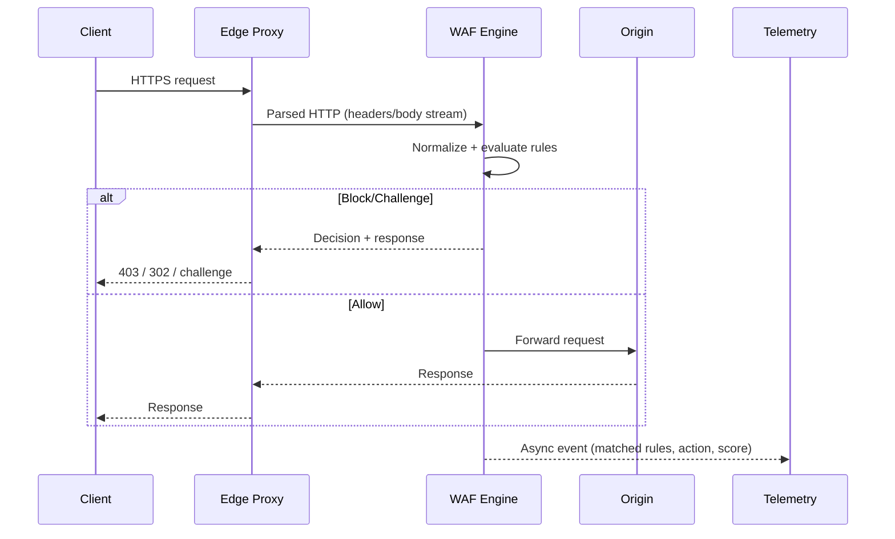

## Overview

A Web Application Firewall (WAF) is an edge security layer that inspects HTTP(S) traffic to block common application attacks (SQL injection, XSS, malicious payloads, protocol abuses) before they reach origin services. The challenge is achieving *high detection quality* while preserving *line-rate performance* and *low latency*, under adversarial traffic patterns designed to maximize CPU, memory, and state pressure.

The key insight is to split the system into a **fast, deterministic data plane** (stateless per-request evaluation with tight CPU/memory budgets) and a **safe, strongly-consistent control plane** (policy authoring, validation, staged rollout, and rollback). Detection quality comes from a layered pipeline: canonicalization/normalization, cheap allow/deny gates, signature/rule matching, optional anomaly scoring, and carefully bounded expensive work (body parsing, regex) with strict limits.

## Requirements

### Functional Requirements
- Inspect inbound HTTP(S) requests and block SQLi, XSS, path traversal, SSRF patterns, protocol evasion, and malformed payloads.
- Support per-tenant policies: allow/deny lists, managed rule sets, custom rules, and per-route overrides (e.g., `/login`, `/checkout`).
- Provide actions: allow, block (403), redirect, rate-limit, and challenge (e.g., CAPTCHA / device proof) with configurable responses.
- Normalize traffic before inspection: URL decoding, header canonicalization, content-type aware parsing, and multi-encoding detection.
- Offer logging and forensics: request metadata, matched rules, sampled payload snippets (with redaction), and correlation IDs.
- Provide safe rollout: dry-run/monitor mode, canary policies, staged global deployment, and instant rollback to prior versions.
- Expose APIs/UI for policy management, rule testing, and audit history.
- Update managed signatures (threat intel / CVE patterns) continuously without downtime.

### Non-Functional Requirements
- **Scale**: 1,000 tenants; 10M daily active end-users; peak 1M HTTP requests/sec globally; 100–400 Gbps aggregate ingress across PoPs.
- **Latency**: Added overhead ≤ 0.5 ms P50 and ≤ 2 ms P99 at the edge for typical requests; hard time budget per request (e.g., 200–500 µs CPU).
- **Availability**: 99.99% for data plane; 99.9% for control plane (config authoring) with “last known good” config at PoPs.
- **Consistency**: Strong consistency for policy versioning/audit in control plane; eventual consistency for config propagation to PoPs (target <60s), with explicit version pinning per request at a PoP.
- **Durability**: No loss of policy/audit data (RPO ~0); security logs can be best-effort with bounded loss during extreme overload (RPO minutes) depending on tier.

### Constraints & Assumptions
- Edge runs in multiple PoPs (cloud regions or CDN points); Anycast or geo-DNS routes clients to nearest healthy PoP.
- WAF must work with TLS: either terminate TLS at edge or integrate with L7 proxy where decrypted traffic is available.
- Budgeted compute per request is limited; rule evaluation must be mostly O(n) over bounded input sizes.
- Compliance: support data minimization, redaction, encryption at rest, and configurable log retention (e.g., 7–90 days).
- Team can operate a control plane + distributed fleet (Kubernetes or VM-based) and a streaming/log platform.

## High-Level Architecture

Clients hit an edge PoP via Anycast/geo routing. Traffic is decrypted (at the proxy) and passed through the WAF engine, which applies tenant-specific policies to allow/block/challenge requests before forwarding to origin. The WAF emits structured security events asynchronously to avoid adding tail latency on the critical path.

A separate control plane manages versioned policies, validation, staged rollouts, and managed rule updates. PoPs continuously fetch and atomically swap to new policy bundles, keeping a “last known good” version for resilience.

## Component Deep-Dive

### Edge PoP (Routing + L7 Proxy)

**Responsibility**: Terminate connections, enforce basic L3/L4/L7 limits, route to WAF, and forward allowed traffic to origin.

**Key Design Decisions**:
- Use an L7 proxy (e.g., Envoy/NGINX/HAProxy) to provide stable HTTP parsing, TLS termination, and connection reuse; avoids bespoke parsing bugs.
- Apply coarse protections before deep inspection (max header size, max body size, request rate caps) to prevent CPU/memory exhaustion.

**Technology Choice**: Envoy (rich filters, xDS), or NGINX (mature, performant). Anycast via CDN or global load balancer.

**Scaling Strategy**: Stateless horizontal scaling per PoP; autoscale on CPU, conn count, and p99 latency; use connection pooling and HTTP/2/3 to reduce overhead.

---

### WAF Engine (Data Plane)

**Responsibility**: Normalize requests, evaluate rules/signatures, compute anomaly scores, and execute actions (allow/block/challenge/rate-limit).

**Key Design Decisions**:
- Two-tier evaluation: (1) cheap deterministic checks (IP/ASN/geo allow/deny, method/path constraints, size limits), (2) deep inspection with bounded work (regex/signature scanning, parsers).
- Use precompiled pattern matchers (Aho–Corasick / Hyperscan / RE2) and strict input budgets (e.g., inspect first N KB per section) to maintain line speed.

**Technology Choice**: Native module in Rust/C++ for performance and memory safety; Hyperscan for multi-regex; RE2 for safe regex; JSON/XML form parsers with streaming.

**Scaling Strategy**: Per-request stateless; per-worker caches for compiled rule sets; shard tenants by policy bundle; avoid shared locks; optionally isolate “heavy” policies to separate pools.

---

### Rate Limiter & Bot/Abuse Controls

**Responsibility**: Enforce per-tenant and per-route rate limits; detect credential stuffing, scraping, and abusive automation.

**Key Design Decisions**:
- Use token-bucket/leaky-bucket with approximate counters at edge (local) plus optional global synchronization for strict limits.
- Separate “challenge” actions from “block” to reduce false positives; escalate from monitor → challenge → block.

**Technology Choice**: Local in-memory counters + Redis/KeyDB for regional aggregation; optional probabilistic structures (Count-Min Sketch) for hot keys.

**Scaling Strategy**: Keep hot-path decisions local; async replication for global views; degrade gracefully (prefer challenges) if limiter backend is unavailable.

---

### Control Plane (Policy, Validation, Rollouts)

**Responsibility**: Tenant onboarding, policy editing, rule testing, versioning, audit, and safe deployment to PoPs.

**Key Design Decisions**:
- Versioned immutable policy bundles with strong audit trails; rollouts are “promote version X” rather than “mutate live config”.
- Pre-deployment validation: compile regex, enforce limits, run test corpus, and estimate worst-case cost (regex complexity, match counts).

**Technology Choice**: Microservice + Postgres for metadata/audit; object storage for bundles; gRPC/REST for APIs; CI-style policy validation workers.

**Scaling Strategy**: Scale independently from data plane; read-heavy; cache policy views; batch distribution; use signed bundles and ETags for efficient PoP updates.

---

### Telemetry Pipeline (Logs, Metrics, Forensics)

**Responsibility**: Collect WAF events, support search/analytics, and drive detections (top attackers, false positives, rule tuning).

**Key Design Decisions**:
- Asynchronous logging with backpressure; never block request path on log delivery.
- Store structured events with redaction (PII/credentials), sampling controls, and tenant-configurable retention.

**Technology Choice**: Kafka/PubSub + stream processing (Flink/Spark) + ClickHouse/Elastic for search; object storage for long-term archive.

**Scaling Strategy**: Partition by tenant and time; compression; tiered storage; rate-limit verbose fields and store payload hashes/snippets only.

## Data Model

### Storage Schema

**Policy metadata (Postgres)**
- `tenants(id, name, plan, created_at)`
- `policies(id, tenant_id, name, mode, created_at)` where `mode ∈ {enforce, monitor}`
- `policy_versions(id, policy_id, version, status, created_at, created_by, changelog)`
- `policy_bindings(id, tenant_id, hostname, path_prefix, policy_version_id, priority)`
- `rollouts(id, policy_version_id, state, canary_percent, started_at, finished_at)`

**Rule bundles (Object Storage)**
- `bundles/{tenant_id}/{policy_id}/{version}.tar.zst`
  - compiled matchers, rule AST, limits, response templates, allow/deny sets, checksum/signature

**Security events (Log Storage)**
- `waf_events(tenant_id, ts, request_id, client_ip, method, host, path, status, action, matched_rule_ids, score, pop, origin, user_agent_hash, sample_payload_redacted)`
- Indexes: `(tenant_id, ts)`, `(tenant_id, matched_rule_ids)`, `(tenant_id, client_ip_hash, ts)`

### Data Flow

Key operations:
- **Request inspection**: streaming body parsing with early exits; stop after first decisive rule or after anomaly score threshold.
- **Policy updates**: control plane publishes a signed bundle; PoPs fetch, verify signature, compile/load, then atomic swap on worker boundaries.

## API Design

### Policy Management (REST)
- `POST /v1/tenants/{tenantId}/policies`
  - Request: `{ "name": "prod-waf", "mode": "monitor" }`
  - Response: `{ "policyId": "...", "createdAt": "..." }`
- `POST /v1/policies/{policyId}/versions`
  - Request: `{ "baseVersion": 12, "rules": [...], "limits": {...}, "changelog": "Tighten login rules" }`
  - Response: `{ "versionId": "...", "version": 13, "status": "validated" }`
  - Errors: `400` invalid rule/regex; `409` version conflict; `422` exceeds cost/limits.
- `POST /v1/policy-versions/{versionId}/rollouts`
  - Request: `{ "canaryPercent": 5, "steps": [5, 25, 100], "stepMinutes": 10 }`
  - Response: `{ "rolloutId": "...", "state": "running" }`

**Idempotency**: Support `Idempotency-Key` on create endpoints; store `(tenantId, key) -> response` for 24h to prevent duplicates on retries.

### Rule Testing
- `POST /v1/policies/{policyId}/test`
  - Request: `{ "version": 13, "request": { "method": "POST", "url": "...", "headers": {...}, "bodyBase64": "..." } }`
  - Response: `{ "action": "block", "matchedRuleIds": ["942100"], "score": 10, "explanations": [...] }`

### Event Query (Read API)
- `GET /v1/tenants/{tenantId}/events?from=...&to=...&action=block&ruleId=...`
  - Response: paginated list; payload fields redacted by default; require elevated permission for any payload snippet fields.

**Error handling**: standard JSON problem format with stable error codes (`RULE_REGEX_TOO_COMPLEX`, `BUNDLE_SIGNATURE_INVALID`, `ROLL_OUT_IN_PROGRESS`).

## Scaling & Performance

### Bottleneck Analysis
- **Regex/signature CPU**: mitigate via precompiled automata (Hyperscan/AC), safe regex engines (RE2), and strict per-request budgets.
- **Request body size/parsing**: cap inspectable bytes per section (e.g., 16–64 KB), stream parse, and short-circuit on decision.
- **Hot attackers causing state pressure**: rate-limit by IP / fingerprint; use approximate counters; isolate heavy tenants/policies.
- **Logging overhead**: async, sampled, and bounded; batch + compression; drop non-critical fields under backpressure.

### Horizontal Scaling
- **Edge PoPs**: scale out by adding more proxies/WAF workers; Anycast/geo load balancing shifts traffic.
- **Control plane**: stateless services behind LB; Postgres read replicas; background workers for validation/compilation.
- **Telemetry**: partitioned streams by tenant/time; scale consumers independently; separate hot-query store (ClickHouse/Elastic) from archive.

**Partitioning strategy**:
- Tenant is the primary partition key for policies, bundles, and logs.
- Within a tenant, partition logs by time (hour/day) and optionally by PoP for high-volume customers.

### Caching Strategy
- **At PoP**: cache compiled policy bundles keyed by `(tenantId, version)`; keep N recent versions for instant rollback.
- **Control plane**: cache policy reads and validation results; ETag-based bundle distribution to reduce bandwidth.
- **Threat intel**: cache signature feeds; publish diff updates; PoPs apply incremental updates if supported.

**Invalidation**: versioned immutable bundles avoid complex invalidation; “latest” pointers are updated atomically.

## Trade-offs & Alternatives

### Key Trade-offs Made
- **Chose deterministic + bounded evaluation** over “inspect everything”:
  - Sacrifice: may miss deeply buried payloads beyond inspect limits.
  - Why: preserves latency and prevents attacker-driven worst-case CPU.
- **Eventual config propagation** to PoPs (target <60s) instead of global strong consistency:
  - Sacrifice: brief windows where PoPs run different versions.
  - Why: edge fleets require availability; versioning + audit makes this safe and observable.
- **Challenge escalation** instead of immediate blocking for anomaly-based detections:
  - Sacrifice: extra client friction for some legitimate users.
  - Why: reduces false-positive blast radius while still throttling attackers.

### Alternative Approaches
- **Origin-side WAF only** (e.g., in app gateway):
  - Not chosen: higher latency, less capacity, and origin becomes DoS target.
- **Pure ML anomaly detection**:
  - Not chosen: hard to explain in audits, higher false positives, and costly inference at line rate.
- **Inline deep packet inspection for all traffic**:
  - Not chosen: expensive and fragile; HTTP semantics and encodings make “full” inspection unbounded.

## Failure Modes & Mitigations

### Failure Scenarios
- **Scenario**: Bad rule update causes high false positives  
  **Impact**: Legit traffic blocked for a tenant (or globally for managed rules)  
  **Detection**: Spike in blocks, drop in origin success rate, customer alerts, canary metrics regression  
  **Mitigation**: Canary rollouts; automatic halt on SLO breach; one-click rollback to last known good; per-route bypass.

- **Scenario**: Regex worst-case CPU (ReDoS) or pathological payloads  
  **Impact**: Increased p99 latency, worker saturation  
  **Detection**: CPU spikes correlated with specific rule IDs/paths; watchdog timeouts  
  **Mitigation**: Safe regex (RE2), cost estimation at validation, strict time/byte budgets, early exits, tenant isolation pools.

- **Scenario**: Telemetry pipeline outage  
  **Impact**: Loss of forensic logs/visibility; data plane should continue  
  **Detection**: Stream lag, sink errors, agent queue growth  
  **Mitigation**: Async buffers with caps; sampling; drop-to-metrics mode; store minimal counters locally for short windows.

- **Scenario**: PoP loses control-plane connectivity  
  **Impact**: No policy updates; traffic still served  
  **Detection**: Heartbeats/last-update age alarms  
  **Mitigation**: Cache bundles locally; continue with last known good; retry with exponential backoff.

- **Scenario**: PoP outage or regional failure  
  **Impact**: Increased latency; partial unavailability  
  **Detection**: Health checks, Anycast withdrawal, regional error rates  
  **Mitigation**: Anycast/geo failover to nearest PoP; multi-region capacity buffers; automated traffic steering.

### Disaster Recovery
- **RTO/RPO**: Control plane RTO 1 hour, RPO ~0 (multi-AZ Postgres + WAL archiving). Telemetry RTO 4 hours, RPO minutes (buffered streams).
- **Backup strategy**: Daily full + continuous WAL for Postgres; immutable bundle copies in multi-region object storage; periodic restore tests.
- **Failover procedures**: Promote standby DB; repoint control plane; PoPs continue serving with cached bundles during control plane failover.

## Operational Considerations

### Monitoring & Alerting
- Data plane: request rate, allow/block/challenge rates, p50/p99 added latency, CPU per request, rule match counts, body truncation counts.
- Security: top attacking IPs/ASNs, rule hit anomalies, bypass usage, sudden policy changes, WAF “monitor vs enforce” deltas.
- Control plane: rollout state, bundle fetch success, version skew across PoPs, validation failures.
- Alerts (examples): p99 added latency > 2 ms for 5m; block rate +3σ vs baseline; config skew > 10% PoPs on old version after 10m.

### Deployment Strategy
- Data plane: blue/green or canary per PoP; keep binary compatibility with bundle format; rapid rollback.
- Policy rollouts: staged canary (e.g., 1% → 5% → 25% → 100%) with automatic stop on SLO/false-positive signals.
- Rollback: atomic version revert at control plane; PoPs switch bundles without restarts; maintain N previous bundles locally.

## References & Further Reading
- OWASP Core Rule Set (CRS): https://coreruleset.org/
- ModSecurity WAF engine: https://github.com/owasp-modsecurity/ModSecurity
- Google RE2 (safe regex): https://github.com/google/re2
- Hyperscan (high-performance regex matching): https://github.com/intel/hyperscan
- Envoy Proxy & ext_authz/filter architecture: https://www.envoyproxy.io/
- Cloudflare security products (for study of edge patterns): https://developers.cloudflare.com/