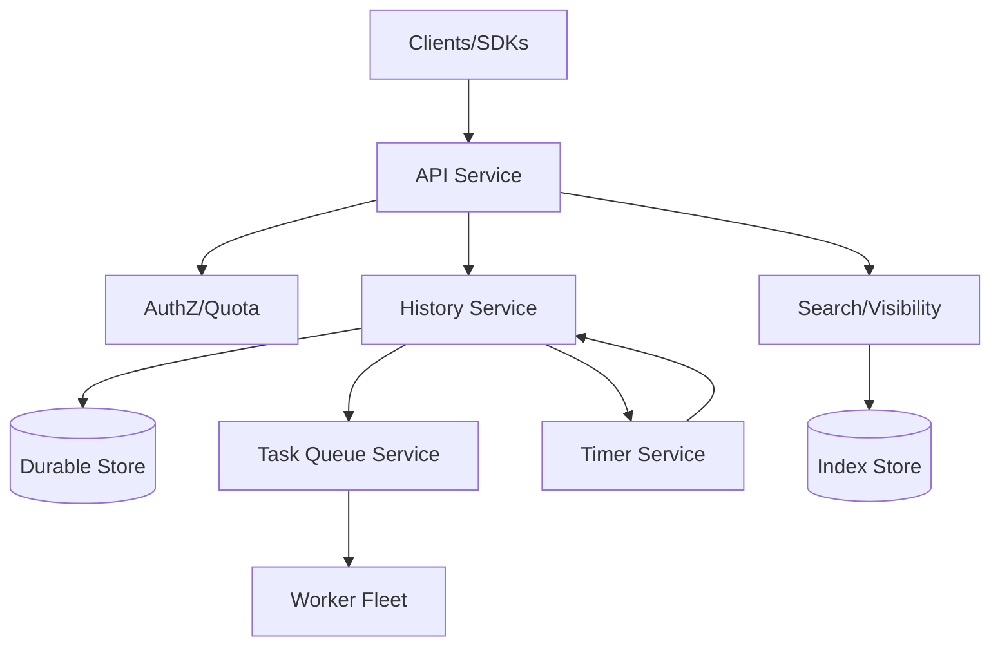
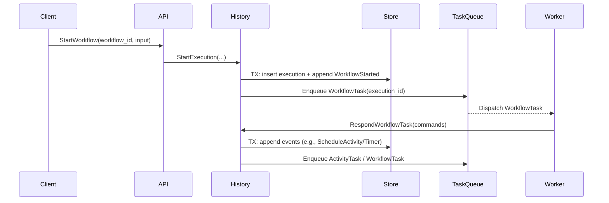

## Overview

A workflow orchestration engine coordinates long-running, multi-step business processes across unreliable services and worker fleets while preserving correctness under retries, crashes, deploys, and partial outages. The hard part is not “running steps” but making progress *durable* and *deterministic* when execution spans minutes to weeks, involves timers and external calls, and must survive any single component failure without losing state or executing steps twice.

The key insight is to treat a workflow execution as a deterministic state machine driven by an **append-only event history** (event sourcing). The engine persists every state transition as an immutable event and derives current state by replay. “Exactly-once step execution” is achieved by combining (1) **at-least-once task delivery**, (2) **idempotent step completion with attempt tokens**, and (3) **atomic state transitions** in the history store so duplicate completions are rejected while allowing safe retries.

This design is broadly similar to Temporal’s model: separate control-plane services (API, history, matching/task-queues, timers) from data-plane workers (user code), and make the history store the source of truth.

## Requirements

### Functional Requirements
- Create, start, signal, query, cancel, and terminate workflow executions.
- Execute workflows that can run for days/weeks with durable progress and resumability.
- Support step primitives: activities (external work), timers/sleeps, child workflows, and retries with backoff.
- Guarantee **exactly-once state transitions** for steps (no double-commit) despite retries and duplicate deliveries.
- Provide task queues and worker polling with routing by queue, namespace/tenant, and optional priority.
- Support versioned workflow definitions and safe rolling upgrades (deterministic replay + compatibility).
- Expose visibility: list/search executions, status, history, and metrics per namespace/queue.
- Enforce multi-tenancy (namespaces), quotas, and authn/authz.

### Non-Functional Requirements
- **Scale**:
  - 5K–20K QPS control-plane (start/signal/query), bursty.
  - 200K–1M concurrent active executions; 10–50M total executions/day.
  - 50K–300K task dispatches/sec (activities + workflow tasks) depending on workload.
  - History growth: ~1–20 KB/event, 100–10K events/execution → TBs/day at high end.
- **Latency** (control-plane in-region):
  - Start workflow: P50 30ms, P99 150ms.
  - Signal workflow: P50 20ms, P99 120ms.
  - Task poll to dispatch: P50 50ms, P99 250ms.
- **Availability**: 99.99% for API + task dispatch within a region; graceful degradation for visibility queries.
- **Consistency**:
  - Strong consistency for workflow history and step completion (must reject duplicates).
  - Eventual consistency acceptable for visibility/search indexes and metrics rollups.
- **Durability**: RPO ≤ 1 minute (async replicated) or 0 (sync quorum) depending on tier; no history loss.

### Constraints & Assumptions
- Workers are untrusted and may crash, retry, or run duplicated code; engine must remain correct.
- “Exactly-once” applies to **engine’s commit of step results**; external side effects still require idempotency keys or transactional outbox in the called service.
- Multi-tenant SaaS friendly: per-namespace isolation, quotas, and noisy-neighbor controls.
- Team size ~6–10 engineers; prefer proven components (Postgres/CockroachDB + Kafka optional + Redis) over bespoke storage.
- Compliance: audit logs for control-plane operations; optional encryption-at-rest and KMS.

## High-Level Architecture



The system is split into a **control plane** (API/Auth, History, Task Queue, Timers, Visibility) and a **data plane** (workers running user code via SDKs). The **History Service** is the authority for workflow state: it appends events, enforces the workflow state machine, and emits tasks. The Task Queue service provides scalable matching between worker polls and pending tasks, and the Timer service materializes durable timers without relying on in-memory scheduling.

This decomposition isolates the “correctness core” (history + durable store) from throughput-heavy but simpler subsystems (matching, visibility). It also enables horizontal scaling and independent failure domains: task queue overload does not corrupt state, and visibility outages do not block workflow progress.

## Component Deep-Dive

### API Service
**Responsibility**: Public-facing control-plane endpoints (start/signal/query/cancel), request validation, authn/authz, quotas, and routing to the correct history shard.

**Key Design Decisions**:
- Route by `(namespace, workflow_id)` to a stable shard to preserve locality and reduce cross-shard coordination.
- Treat API as stateless; all correctness enforced by History + Store.

**Technology Choice**: Go/Java service with gRPC + REST gateway; Envoy for L7, OIDC/JWT for auth.

**Scaling Strategy**: Horizontally scale behind L7 LB; apply per-namespace rate limits; cache namespace config and shard maps.

---

### History Service (Execution Core)
**Responsibility**: Owns workflow state machine; appends immutable events; produces workflow tasks and activity tasks; applies dedupe/attempt tokens; handles replay, versioning, retries, and mutable state.

**Key Design Decisions**:
- **Event-sourced history** as source of truth; current state derived via replay + cached “mutable state”.
- **Atomic transitions**: step completion is a conditional write (CAS) against expected state/attempt token to prevent double-commit.

**Technology Choice**:
- Durable store: CockroachDB (strong consistency + horizontal scale) or Postgres + partitioning (smaller scale).
- Optional cache: Redis for hot mutable-state snapshots (write-through) to reduce replay cost.

**Scaling Strategy**:
- Shard by hash of workflow execution; each shard maps to a history partition.
- Stateless history workers with optimistic concurrency; rely on store transactions/CAS.
- Backpressure via task queue depth and per-shard concurrency limits.

---

### Task Queue Service (Matching)
**Responsibility**: Manages named queues; stores pending tasks (workflow tasks, activity tasks); matches tasks to worker pollers; supports long-poll, sticky execution (optional), and priority.

**Key Design Decisions**:
- Separate matching from history to scale poll traffic independently.
- At-least-once delivery with **lease/ack**; redelivery on lease expiry.

**Technology Choice**:
- Redis Streams / Kafka / internal log + in-memory matchers with persistent backing.
- For simplicity: Redis for “ready” queues + store-backed task records for durability.

**Scaling Strategy**:
- Partition by `(namespace, queue)`; consistent-hash to matcher nodes.
- Use long-poll to reduce QPS; batch dispatch; per-queue concurrency limits.

---

### Timer Service
**Responsibility**: Durable scheduling of timers (sleep, retry backoff, cron) and emission of timer-fired events to History.

**Key Design Decisions**:
- Persist timers in the durable store; never rely solely on in-memory heaps.
- Use time-bucket scanning + per-bucket leases to scale and avoid duplicates.

**Technology Choice**: Store-backed timer table + scanning workers; optional Redis for near-future wheel.

**Scaling Strategy**:
- Time buckets (e.g., 1s/10s buckets) partitioned by shard; lease each bucket for processing.
- Idempotent “fire” via conditional insert of `TimerFired` event.

---

### Visibility/Search Service
**Responsibility**: Lists, filters, and aggregates executions; powers UI and operational queries; not on the correctness path.

**Key Design Decisions**:
- Eventual consistency via async indexing from history events (outbox/CDC).
- Separate index schema from source-of-truth schema for query flexibility.

**Technology Choice**: Elasticsearch/OpenSearch or ClickHouse for analytics-style queries.

**Scaling Strategy**:
- Async ingestion (Kafka/CDC); bulk indexing; ILM/retention policies; per-namespace index routing.

## Data Model

### Storage Schema

Core tables (relational representation; can map to KV as well):

**`namespaces`**
- `namespace_id (pk)`
- `name (unique)`
- `config_json`
- `quotas_json`
- `created_at`

**`workflow_executions`**
- `execution_id (pk)` (ULID/UUID)
- `namespace_id`
- `workflow_id` (user-visible stable id)
- `run_id` (unique per execution attempt)
- `state` (RUNNING|COMPLETED|FAILED|CANCELED|TERMINATED)
- `shard_id`
- `history_version` (monotonic int)
- `current_task_token` (nullable)
- `created_at`, `updated_at`

**`workflow_history_events`** (append-only)
- `namespace_id`
- `execution_id`
- `event_id` (monotonic per execution)
- `event_type`
- `event_time`
- `payload_json` (or protobuf bytes)
- Primary key: `(namespace_id, execution_id, event_id)`

**`activity_tasks`**
- `task_id (pk)`
- `namespace_id`
- `execution_id`
- `activity_id` (monotonic within workflow)
- `queue`
- `attempt` (int)
- `lease_owner` (nullable)
- `lease_expires_at` (nullable)
- `status` (PENDING|LEASED|COMPLETED|CANCELED)
- `request_payload`
- `idempotency_key` (derived from execution_id+activity_id+attempt)
- Index: `(namespace_id, queue, status)`

**`timers`**
- `timer_id (pk)`
- `namespace_id`
- `execution_id`
- `fire_at`
- `timer_type` (SLEEP|RETRY|CRON)
- `status` (PENDING|FIRED|CANCELED)
- Index: `(fire_at, status)`

**`visibility_executions`** (derived)
- `namespace_id`
- `workflow_id`
- `run_id`
- `state`
- `start_time`, `close_time`
- `search_attrs_json`

### Data Flow

Workflow start → history append → task enqueue → worker executes deterministic code → activities dispatched → completions appended.



Exactly-once step completion is enforced when appending completion events with a conditional check on expected state/attempt token (e.g., only accept `ActivityCompleted` if the activity is currently `LEASED` for that attempt).

## API Design

Primary interface: gRPC (preferred for streaming/long-poll) with REST gateway for convenience.

### Start Workflow
`POST /v1/namespaces/{namespace}/workflows:start`

Request:
```json
{
  "workflow_id": "order-123",
  "workflow_type": "OrderFulfillment",
  "task_queue": "orders",
  "input": { "orderId": "123" },
  "idempotency_key": "client-key-abc",
  "retry_policy": { "max_attempts": 3 }
}
```

Response:
```json
{ "run_id": "01J..." }
```

Errors:
- `409 CONFLICT` if `workflow_id` already running (unless “allow_reuse” configured)
- `429` quota exceeded
- `400` validation

Idempotency:
- `idempotency_key` maps to `(namespace, workflow_id)` + request hash; Start is safe to retry.

### Signal Workflow
`POST /v1/namespaces/{namespace}/workflows/{workflow_id}/signals/{signal_name}`

Request:
```json
{ "run_id": "01J...", "payload": { "approved": true }, "request_id": "sig-uuid" }
```

Idempotency:
- Deduplicate by `(execution_id, request_id)` to avoid double-signal.

### Query Workflow (Strong-ish Read)
`POST /v1/namespaces/{namespace}/workflows/{workflow_id}:query`

Request:
```json
{ "run_id": "01J...", "query_type": "GetState", "args": {} }
```

Behavior:
- Prefer answering from cached mutable state; fall back to replay if needed.
- Return `503` if execution shard unavailable (caller can retry).

### Worker Poll for Tasks (Long Poll)
`POST /v1/namespaces/{namespace}/task-queues/{queue}:poll`

Request:
```json
{ "worker_id": "w-17", "task_type": "ACTIVITY", "max_wait_ms": 30000 }
```

Response:
```json
{
  "task": {
    "task_id": "t-1",
    "execution_id": "e-1",
    "activity_id": 42,
    "attempt": 1,
    "lease_expires_at": "2025-12-17T12:00:00Z",
    "completion_token": "opaque"
  }
}
```

### Complete Activity (Exactly-Once Commit)
`POST /v1/activities:complete`

Request:
```json
{
  "completion_token": "opaque",
  "result": { "ok": true },
  "request_id": "complete-uuid"
}
```

Handling:
- History verifies token → maps to `(execution_id, activity_id, attempt)` and expected state.
- Transactionally appends `ActivityCompleted` if and only if attempt is current; otherwise returns:
  - `409` already completed (safe to ignore)
  - `410` token expired (worker must stop; task likely retried)

## Scaling & Performance

### Bottleneck Analysis
- **History write amplification** (many events): mitigate with batching, payload compression, and snapshotting mutable state every N events.
- **Task queue hot spots** (popular queues): mitigate with queue partitioning, per-queue sharding, and worker-side concurrency controls.
- **Replay cost** for long histories: mitigate with snapshots, cached mutable state, and “continue-as-new” to bound history length.
- **Timer scanning overhead**: mitigate with time buckets + leases and limiting scan horizons.

### Horizontal Scaling
- **API**: stateless replicas; shard routing via consistent hash ring cached in memory.
- **History**: stateless workers; scale by increasing shard count and store throughput; per-shard concurrency caps.
- **Task Queue**: partition by `(namespace, queue, partition)`; add partitions to scale dispatch.
- **Timers**: scale timer processors by bucket partition; use leader/lease per bucket.
- **Visibility**: scale independently; accept lag.

Partitioning strategy:
- Primary key routing: `shard_id = hash(namespace_id + workflow_id) % N`.
- Keep `(execution_id)` locality for history events to make replay sequential and cache-friendly.

### Caching Strategy
- **Mutable state cache** (Redis or in-process): cache derived execution state keyed by `execution_id` with short TTL (e.g., 1–5 minutes) and version checks (`history_version`).
- **Namespace config/shard map**: in API/History with TTL + watch/refresh.
- Invalidation:
  - Write-through on history commits (update cache after successful append).
  - Versioned reads: if cache version < store version, replay delta or refresh.

## Trade-offs & Alternatives

### Key Trade-offs Made
- **Event sourcing + replay** chosen for durability and correctness; sacrificed simplicity and introduced replay/snapshot complexity.
- **At-least-once task delivery** chosen for availability and scalability; sacrificed “exactly-once delivery” and required attempt tokens + idempotent commits.
- **Separate visibility index** chosen for query power and isolation; sacrificed strong consistency for list/search (eventual).
- **Store-backed timers** chosen for correctness; sacrificed some latency/efficiency vs purely in-memory wheels.

### Alternative Approaches
- **Kafka-first orchestration (log as the system)**: store workflow events in Kafka and compute state with stream processors. Great throughput; harder strong consistency per key, tricky compaction/retention, and operationally complex for per-execution random access.
- **Database workflow engine (BPMN-style)**: easier ad-hoc modeling; often struggles at high scale with long-polling and exactly-once semantics across heterogeneous workers.
- **Serverless step functions model**: great managed experience; less flexible worker code and can be expensive at high state-transition volumes.

## Failure Modes & Mitigations

### Failure Scenarios
- **Worker crashes mid-activity**
  - Impact: activity not completed; workflow may stall.
  - Detection: lease expiry / missed heartbeat.
  - Mitigation: re-lease task; increment attempt; enforce max attempts; require idempotency keys for external side effects.
- **Duplicate task delivery**
  - Impact: same activity executed twice.
  - Detection: completion CAS fails (already completed or attempt mismatch).
  - Mitigation: only first completion commits; duplicates get `409` and are ignored.
- **History service instance crash**
  - Impact: in-flight requests fail.
  - Detection: client retries; health checks fail.
  - Mitigation: stateless replicas; retry with idempotency keys; store is source of truth.
- **Durable store partial outage / partition**
  - Impact: cannot append events → workflows pause.
  - Detection: increased commit latency, error rates.
  - Mitigation: quorum-based DB, circuit breakers, admission control; optionally degrade non-critical paths (visibility).
- **Timer processor duplication**
  - Impact: same timer may “fire” twice.
  - Detection: conditional insert of `TimerFired` event fails on second attempt.
  - Mitigation: idempotent fire via CAS + unique constraint.
- **Poison pill workflow (non-deterministic code)**
  - Impact: replay fails; workflow stuck.
  - Detection: deterministic check failure on workflow task.
  - Mitigation: versioning APIs in SDK (patch markers); fail execution with clear diagnostics; allow operator-driven reset/continue-as-new.

### Disaster Recovery
- **Targets**: RTO 30 minutes (regional), RPO 0–60 seconds depending on replication mode.
- **Backup strategy**:
  - Continuous backups (PITR) for primary store.
  - Periodic snapshots of visibility index (or rebuild from history if history retained).
- **Failover procedures**:
  - Promote replica region store (or switch to surviving quorum).
  - Repoint API/History to new primary; rebuild caches; resume timers and matching.
  - Validate shard ownership and resume processing from durable timers/tasks.

## Operational Considerations

### Monitoring & Alerting
- Key metrics:
  - Store commit latency (P50/P99), transaction conflicts, replication lag.
  - History append rate, replay time, snapshot hit rate.
  - Queue depth per task queue/partition, poll QPS, dispatch latency.
  - Timer lag (now - earliest pending `fire_at`), fired/sec, duplicate-fire rejects.
  - Workflow stuck rate (no progress for N minutes), failure/retry rates by type.
- Alerts:
  - P99 start/signal latency > SLO for 5m.
  - Queue depth growing + dispatch latency increasing.
  - Timer lag > 30s (or workload-specific).
  - Store error rate > 1% or replication lag > RPO target.

### Deployment Strategy
- Rolling deploy stateless services (API/Queue/Timer) with canaries and automatic rollback.
- History changes require strict backward compatibility of event schemas; use versioned protobufs and feature flags.
- Worker SDK supports safe upgrades via deterministic versioning (e.g., patch markers) and controlled rollout.
- Rollback:
  - Control-plane: revert binaries; schemas are forward/back compatible.
  - Visibility/index: rebuild from source if needed.

## References & Further Reading
- Temporal Architecture (concepts: histories, task queues, deterministic workflows): https://docs.temporal.io/
- “Outbox Pattern” for exactly-once side effects: https://microservices.io/patterns/data/transactional-outbox.html
- Event Sourcing pattern: https://martinfowler.com/eaaDev/EventSourcing.html
- “The Log” (data-centric architecture): https://engineering.linkedin.com/distributed-systems/log-what-every-software-engineer-should-know-about-real-time-datas-unifying
- Workflow saga patterns (long-running transactions): https://microservices.io/patterns/data/saga.html