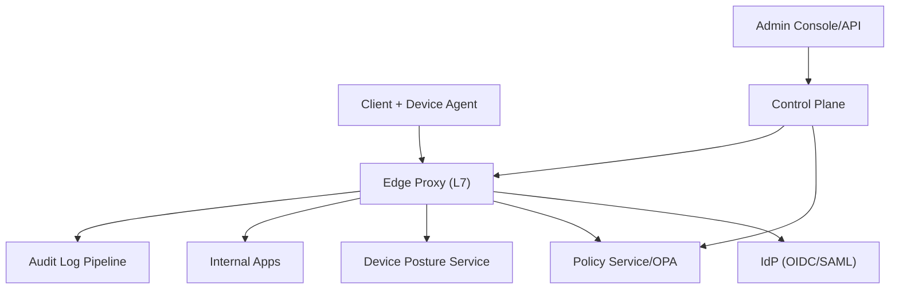
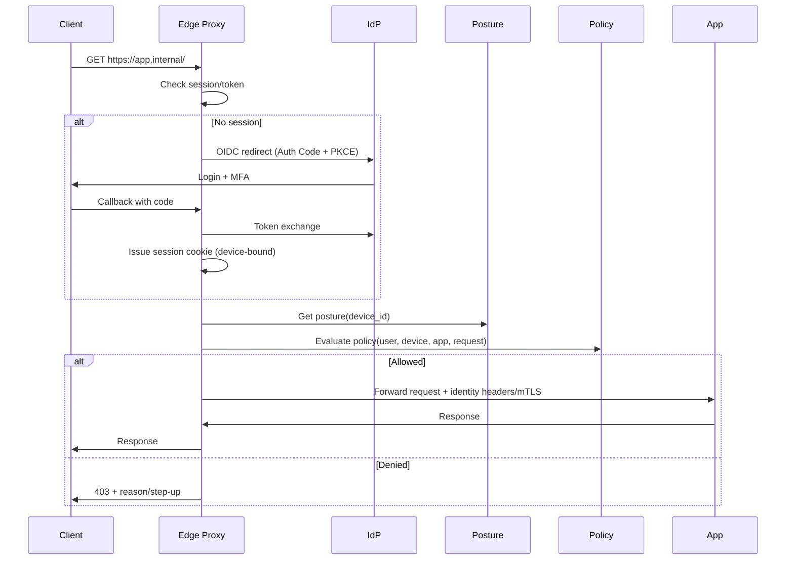

## Overview

A Zero-Trust Access Proxy replaces network-level trust (VPN “inside” access) with request-level trust: every request to every internal app is authenticated and authorized based on **who** the user is, **what** device they’re using, and **whether** that device meets security posture requirements. The core challenge is achieving strong security (phishing resistance, device binding, least privilege, continuous evaluation) without breaking existing internal apps or degrading latency and reliability at enterprise scale.

The key insight is to treat access as an **L7 identity-aware reverse proxy**: terminate TLS, perform OIDC/SAML authentication, enforce fine-grained policies via a centralized policy engine, validate device health via attestations/MDM/EDR signals, and then forward traffic to apps with a verifiable identity context (headers + mTLS). To scale, keep the data plane stateless and fast (local JWT verification, cached policy/device decisions) while the control plane manages policy, keys, connectors, and audit.

This design is similar in spirit to Google BeyondCorp, Cloudflare Access, and Zscaler Private Access: identity and device context become the new perimeter, and the proxy becomes the enforcement point.

## Requirements

### Functional Requirements
- Authenticate users for internal app access using enterprise IdP (OIDC/SAML) with MFA and conditional access.
- Enforce per-request authorization policies using identity attributes (groups/roles), app metadata, and device posture.
- Validate device health (managed/enrolled, OS version, disk encryption, EDR running, jailbreak/root, compliance state) before granting access.
- Route authorized requests to the correct internal application (HTTP/S), supporting multiple apps/tenants and per-app configs.
- Support short-lived access tokens and session management (SSO-like UX) with step-up auth for sensitive apps.
- Provide an admin console/API to onboard apps, define policies, manage connectors, and view audit logs.
- Produce immutable audit trails for access decisions (allow/deny), policy versions, and admin actions for compliance.
- Provide safe rollout and emergency controls (deny-by-default, break-glass access, policy staging, canary).

### Non-Functional Requirements
- **Scale**: 100k employees, 10k contractors; 5k internal apps; peak 50k QPS across regions; 5–20 GB/day audit logs; 1–5M registered devices.
- **Latency**: For authorized requests, proxy overhead P50 < 10ms, P99 < 50ms (excluding app time); login redirect flows P99 < 2s.
- **Availability**: 99.99% for proxy data plane (regional), 99.9% for admin/control plane; graceful degradation when posture systems degrade.
- **Consistency**: Strong consistency for policy publish/versioning; eventual consistency acceptable for telemetry/analytics; device posture cached with bounded staleness (e.g., 1–5 minutes).
- **Durability**: RPO ≤ 5 minutes for policy/config; audit logs durable with at-least-once ingestion; no loss of allow/deny events.

### Constraints & Assumptions
- Enterprise already has an IdP (Okta/Azure AD/Ping) and a device management source (Intune/Jamf) plus EDR (CrowdStrike/SentinelOne).
- Primary target is web apps over HTTPS; SSH/RDP can be added later via specialized gateways.
- Some legacy apps cannot be modified; the proxy must work without app changes via header injection and/or upstream mTLS.
- Team size ~6–10 engineers; prefer managed building blocks where possible; compliance: SOC2/ISO27001, optional HIPAA/PCI depending on tenant.

## High-Level Architecture

The system is split into a **data plane** (Edge Proxy) and a **control plane** (policy/config distribution, key management, onboarding). The Edge Proxy terminates TLS, authenticates/authorizes requests, and routes to internal apps. It integrates with the IdP for user identity and with the posture service for device compliance, then evaluates policies (locally via embedded OPA or via a low-latency policy service) before forwarding.

To keep latency low and availability high, the Edge Proxy is horizontally scalable and mostly stateless: JWT verification is done locally using cached JWKS keys; policy and posture decisions are cached with short TTLs; audit is emitted asynchronously. The control plane provides safe policy rollout, key rotation, and configuration distribution to all edge instances.

## Component Deep-Dive

### Edge Proxy (Data Plane)

**Responsibility**: Terminate TLS, authenticate users, validate tokens, evaluate authorization, enforce posture, route to apps, emit audit.

**Key Design Decisions**:
- Embed policy evaluation close to the proxy (OPA/WASM) to keep P99 low and avoid dependency fan-out on every request.
- Use short-lived, signed JWT access tokens validated locally (JWKS cache) to avoid introspection on hot path.

**Technology Choice**: Envoy Proxy (or NGINX Plus) with external authz filter + OPA (WASM) + mTLS upstream.

**Scaling Strategy**: Stateless horizontal scaling behind global/regional L7 load balancers; autoscale by CPU/RPS; shard by region; warm caches via config push.

---

### Identity & Session Service

**Responsibility**: Manage OIDC/SAML integrations, session cookies, token exchange, step-up authentication orchestration.

**Key Design Decisions**:
- Prefer OIDC Authorization Code + PKCE for browser clients; support SAML for legacy IdPs via broker.
- Bind sessions to device signals (device ID/attestation) to reduce token replay (device-bound sessions).

**Technology Choice**: Custom lightweight service + standard OIDC libs; store session metadata in Redis; keys in KMS/HSM.

**Scaling Strategy**: Stateless app servers; Redis cluster for session store; multi-region active-active with regional session affinity or replicated session tokens.

---

### Device Posture Service

**Responsibility**: Compute and serve device health decisions (compliant/non-compliant + reasons) using MDM/EDR signals and optional device attestation.

**Key Design Decisions**:
- Separate **signal ingestion** (from Intune/Jamf/EDR) from **decision serving** to isolate third-party variability.
- Cache posture decisions with bounded staleness (e.g., TTL 60–300s) and include “last_updated” to support risk-based policies.

**Technology Choice**: Kafka for ingestion, stream processor (Flink/Kafka Streams), Postgres for device inventory, Redis for hot posture cache.

**Scaling Strategy**: Partition by device_id; horizontally scale consumers; cache at edge and in Redis; degrade to “deny” or “step-up” based on policy.

---

### Control Plane (Policy/Config/Keys)

**Responsibility**: Admin APIs/UI, policy authoring and versioning, app onboarding, connector management, key rotation, config distribution.

**Key Design Decisions**:
- Treat policy as versioned artifacts with staged rollout (draft → review → canary → full) and instant rollback.
- Distribute configs to edges via push (xDS/gRPC) rather than polling to reduce propagation delay.

**Technology Choice**: Postgres for source of truth, OPA bundle server or custom config service, KMS for signing keys, GitOps optional.

**Scaling Strategy**: Moderate QPS; scale via read replicas; strong consistency for publish path; multi-region with leader/follower for writes.

---

### Audit & Telemetry Pipeline

**Responsibility**: Durable, queryable record of access decisions and admin changes; security analytics; compliance exports.

**Key Design Decisions**:
- Emit audit events asynchronously on the data plane to avoid tail-latency impact; persist with at-least-once delivery.
- Store raw immutable logs + indexed hot store for investigations.

**Technology Choice**: Kafka/PubSub + object storage (S3/GCS) + OpenSearch/ClickHouse for querying; SIEM export (Splunk).

**Scaling Strategy**: Partition by time/tenant; batch indexing; backpressure handling with local edge buffers and circuit breakers.

## Data Model

### Storage Schema

**Postgres (Control Plane)**
- `apps`
  - `app_id (uuid, pk)`, `name`, `hostname_patterns[]`, `upstream_url`, `risk_level`, `owner_team`, `created_at`
- `policies`
  - `policy_id (uuid, pk)`, `name`, `app_id (fk)`, `version`, `rego_bundle_uri`, `status (draft|canary|active|rolled_back)`, `created_by`, `created_at`
- `policy_bindings`
  - `binding_id`, `policy_id`, `subjects (groups/roles)`, `conditions (jsonb)`, `effect (allow|deny)`

**Postgres (Device Inventory)**
- `devices`
  - `device_id (uuid, pk)`, `user_id`, `platform`, `os_version`, `managed (bool)`, `encryption (bool)`, `edr (bool)`, `last_seen_at`
- `device_signals`
  - `device_id`, `source (mdm|edr|attestation)`, `signal (jsonb)`, `observed_at`

**Redis (Hot Decisions)**
- `posture:{device_id}` → `{compliance, reasons[], last_updated, expires_at}`
- `policycache:{app_id}:{subject_hash}` → `{decision, ttl}`

**Audit (Append-Only)**
- `AuditEvent`
  - `event_id`, `timestamp`, `tenant`, `user`, `device`, `app`, `decision`, `policy_id`, `policy_version`, `reason_codes[]`, `request_meta (ip, ua, trace_id)`

### Data Flow

## API Design

### User-Facing (Proxy)
- `GET /` (per app host)
  - **Behavior**: If unauthenticated, redirect to IdP; if authenticated, authorize then proxy upstream.
  - **Errors**:
    - `401` unauthenticated (non-browser API clients) or redirect for browsers
    - `403` not authorized / non-compliant device
    - `429` rate limited
    - `503` posture/policy dependency unavailable (depending on fail-open/closed policy)

### Control Plane (Admin)
- `POST /v1/apps`
  - Request: `{name, hostname_patterns, upstream_url, risk_level, owner_team}`
  - Response: `{app_id, ...}`
  - Idempotency: `Idempotency-Key` header required; safe retries.
- `POST /v1/policies`
  - Request: `{app_id, name, rego_bundle, status_target (draft)}`
  - Response: `{policy_id, version}`
- `POST /v1/policies/{policy_id}/publish`
  - Request: `{rollout: canary|full, canary_percent?}`
  - Response: `{policy_id, version, status}`
- `GET /v1/audit?app_id=&user_id=&from=&to=`
  - Response: paginated events; export jobs for large ranges.

### Device Posture
- `POST /v1/device_signals`
  - Used by ingestion connectors (MDM/EDR webhooks) or agent.
  - Request: `{device_id, source, signal, observed_at}`
  - Response: `202 Accepted`
  - Idempotency: dedupe via `(device_id, source, observed_at, signal_hash)`.
- `GET /v1/posture/{device_id}`
  - Response: `{compliant, reasons[], last_updated, ttl_seconds}`

## Scaling & Performance

### Bottleneck Analysis
- **Token validation & policy checks**: mitigate via local JWT verification, cached JWKS, OPA/WASM local eval, and decision caching keyed by `(app, user_groups_hash, device_posture_hash)`.
- **Posture lookup**: mitigate via edge cache + Redis hot cache; asynchronous signal ingestion; avoid calling MDM/EDR synchronously.
- **Audit throughput**: mitigate via buffered async publish, partitioned Kafka topics, and separate indexing from raw retention.

### Horizontal Scaling
- **Edge Proxy**: scale out statelessly; global DNS/anycast to nearest region; per-region autoscaling; connection draining on deploy.
- **Policy/Control Plane**: scale reads with replicas; write path via single leader per tenant/region; push bundles/config via CDN/gRPC streams.
- **Data partitioning**:
  - Devices: partition by `device_id` hash.
  - Audit: partition by time + tenant; store raw in object storage and index recent windows.

### Caching Strategy
- **JWKS keys**: cache 5–15 minutes; prefetch on rotation; support overlapping keys.
- **Policy bundles**: edge caches latest active version; rollout via version pinning and canary cohorts.
- **Posture**: cache 60–300s (risk-based); include “stale” flag; policies can require freshness for high-risk apps.
- **Decision cache**: cache allow/deny for 10–60s for high-QPS apps; invalidate on policy publish or posture change via versioning (policy_version + posture_epoch).

## Trade-offs & Alternatives

### Key Trade-offs Made
- **Stateless JWT vs token introspection**
  - Chosen: local JWT verification for latency/availability.
  - Sacrificed: immediate revocation without additional mechanisms.
  - Mitigation: short TTL (5–10 min), session revocation lists for high-risk, step-up for sensitive apps.
- **Local policy eval (OPA/WASM) vs centralized PDP**
  - Chosen: local eval for P99 and resiliency.
  - Sacrificed: easier centralized debugging and single point of policy truth at runtime.
  - Mitigation: strict versioned bundle distribution + audit includes policy version + decision reasons.
- **Fail-closed posture dependencies**
  - Chosen: default deny for posture unknown on high-risk apps.
  - Sacrificed: availability during MDM/EDR outages.
  - Mitigation: per-app risk-based modes (fail-open for low-risk), grace windows, and step-up auth fallback.

### Alternative Approaches
- **Client-based ZTNA overlay (agent creates private mesh/VPN-like tunnels)**
  - Better for non-HTTP protocols; heavier client footprint and operational complexity.
- **Centralized PDP with per-request calls**
  - Simpler policy updates but increases latency and creates a hard dependency for every request.
- **Service-mesh-only (sidecars enforce identity inside cluster)**
  - Great east-west security but doesn’t solve ingress identity/device posture for end users without an edge component.

## Failure Modes & Mitigations

### Failure Scenarios
- **IdP unavailable**
  - Impact: new sessions can’t authenticate; existing sessions may continue until expiry.
  - Detection: elevated auth redirect failures, token exchange errors.
  - Mitigation: short “authentication grace” for already-issued sessions, multi-IdP failover (optional), clear runbooks.
- **Posture pipeline delayed/outage**
  - Impact: posture becomes stale; access may be denied for high-risk apps.
  - Detection: lag metrics (consumer lag), posture freshness SLO alerts.
  - Mitigation: edge uses cached posture with max-staleness; policy can require freshness only for sensitive apps; step-up as fallback.
- **Bad policy publish**
  - Impact: widespread deny or unintended allow.
  - Detection: anomaly detection on allow/deny rates; canary comparison; policy linting tests.
  - Mitigation: staged rollout, automatic rollback on error budget breach, “break-glass” admin policy.
- **Key compromise or rotation bugs**
  - Impact: token forgery or mass auth failures.
  - Detection: signature verification anomalies; KMS alerts; audit anomalies.
  - Mitigation: KMS/HSM, dual-key overlap, rapid revocation/rotation, denylist `kid` support.
- **Edge region failure**
  - Impact: regional outage.
  - Detection: health checks, SLO burn alerts.
  - Mitigation: multi-region active-active, DNS/anycast failover, config replicated, rate-limit during re-convergence.

### Disaster Recovery
- **Targets**: RTO 30 minutes (regional), RPO 5 minutes (policy/config), RPO 0 for raw audit once accepted by pipeline.
- **Backups**: Postgres PITR + daily snapshots; policy artifacts stored in versioned object storage; KMS-managed keys with audit.
- **Failover**: promote read replica/secondary region; edges fetch latest policy bundles from replicated storage/CDN; validate with synthetic checks.

## Operational Considerations

### Monitoring & Alerting
- **Proxy metrics**: RPS, P50/P99 latency overhead, 401/403/5xx rates, upstream error rates, cache hit ratios, auth redirect failures.
- **Security metrics**: denied by posture, denied by policy, suspicious IP/user agent, token validation failures, replay signals.
- **Posture pipeline**: ingestion lag, signal freshness, decision cache hit rate.
- **Alerts**: SLO burn (fast/slow), sudden deny spikes, publish rollback triggers, Kafka lag thresholds, JWKS fetch failures.

### Deployment Strategy
- Blue/green or canary for edge proxies with connection draining.
- Policy rollouts: draft → automated tests (lint + unit tests + replay audit samples) → canary cohort → full deploy.
- Rollback: instant policy version rollback; edge config supports pinning to prior bundle; break-glass policy stored locally for emergencies.

## References & Further Reading

- BeyondCorp: A New Approach to Enterprise Security (Google)
- Envoy External Authorization Filter docs
- Open Policy Agent (OPA) + Rego + OPA bundles
- OAuth 2.0 / OpenID Connect (Authorization Code + PKCE)
- NIST Zero Trust Architecture (SP 800-207)
- Cloudflare Access / Zscaler Private Access architecture overviews