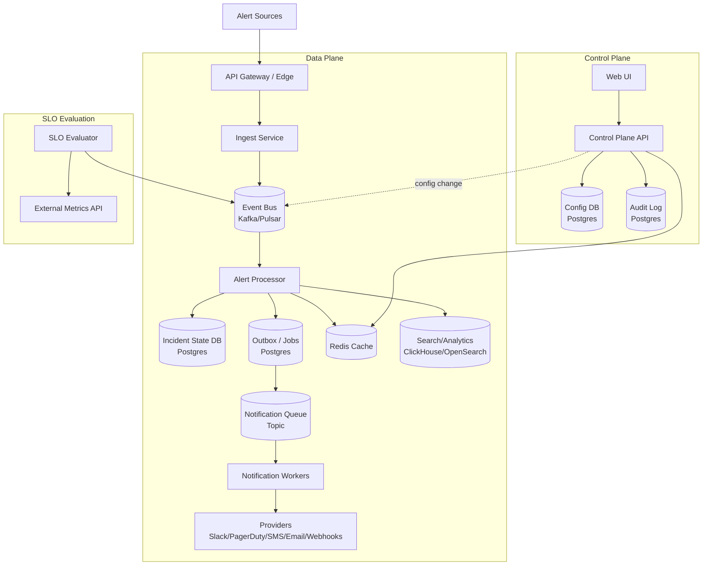
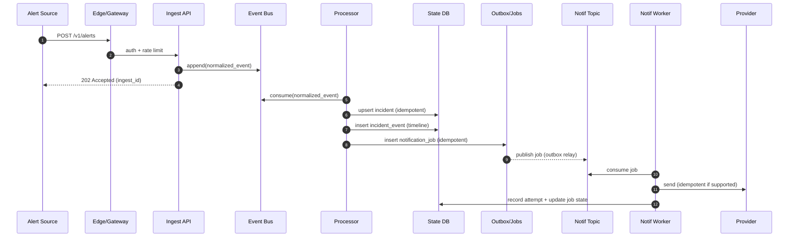

## Overview

Alerting platforms fail in two opposite ways: they either overwhelm humans with noisy, duplicative signals, or they miss the few critical signals that require immediate action. The hard part isn’t “send a notification when a threshold is crossed” — it’s continuously turning high-volume, imperfect telemetry and detector outputs into a small number of actionable incidents, routed to the right people, with the right urgency, with guardrails that prevent alert storms.

This design is a production-grade, multi-tenant SaaS alerting and incident-routing system with:
- High-throughput ingestion (at-least-once) and idempotent processing
- Deduplication, grouping, silencing, and inhibition (root-cause suppression)
- Escalation policies and on-call schedules (time-zone aware)
- SLO-based alerting using multi-window, multi-burn-rate detectors
- A durable incident lifecycle (open/ack/resolve), audit trail, and integrations

Key insights:
1. **Treat alert events as an at-least-once stream** and make *all* side effects idempotent.
2. **Separate data plane from control plane**: real-time processing must remain stable under storms; configuration must be strongly consistent and auditable.
3. **Design for overload**: rate limits, batching, backpressure, and graceful degradation are first-class features.

---

## Requirements

### Functional Requirements
- Ingest alert events from multiple sources (Prometheus/Alertmanager, CloudWatch, custom webhooks) with authentication and multi-tenancy.
- Normalize events into a canonical schema; validate required fields; reject malformed payloads with actionable errors.
- Deduplicate and group alert events into incidents using stable fingerprinting and configurable grouping keys.
- Apply **silences** (time-bounded muting) and **inhibition** (suppress symptom alerts when a root-cause alert is firing).
- Route incidents via escalation policies (on-call schedules, rotations, time-based rules) to targets (Slack, PagerDuty, SMS, email, webhook).
- Support SLO alerting:
  - Store SLO definitions (objective, window, SLI query/source, alerting policy).
  - Evaluate burn-rate detectors and emit alert events into the same pipeline.
- Provide incident lifecycle and collaboration: open/ack/resolve, ownership, notes, timeline, attachments/links, and audit trail.
- Provide UI and APIs to manage rules, silences, policies, schedules, SLOs, and to search incidents/history.
- Provide outbound webhooks/events for incident automation (ticketing, auto-remediation, ChatOps).

### Non-Functional Requirements (Targets)
#### Scale (per region)
- Tenants: **up to 10,000**
- Monitored services: **~200,000**
- Alert events ingest:
  - Typical average: **~600 events/sec** (~50M/day)
  - Typical peak: **10,000 events/sec** (regional incident peaks)
  - Extreme burst: **50,000 events/sec for 10 minutes** (major outage / detector misfire)
- Incidents:
  - Typical: **~50,000/day**
  - Severe storm (misconfiguration): **up to 5,000,000/day** (requires storm protection and hard quotas)

#### Latency
- Ingest ACK (durable acceptance): **P50 < 50ms, P99 < 250ms**
- End-to-end routing (ingest → first notification attempt):
  - **Critical**: **P50 < 2s, P99 < 8s**
  - **Non-critical**: **P50 < 10s, P99 < 60s** (can be deprioritized during storms)
- UI reads (incident list/search): **P50 < 200ms, P99 < 1s** with pagination

#### Availability & Durability
- Data-plane ingest + routing: **99.99%** (regional)
- UI/search: **99.9%**
- Durability:
  - **No loss of accepted alert events** (RPO ≈ 0 for events once ACKed)
  - Incident state transitions are durable and ordered (no “ACK lost”)

#### Consistency Model
- Control-plane config writes: **strong consistency** (transactional, audited, versioned)
- Data-plane stream: **at-least-once** delivery; processors must be idempotent
- Search/analytics: **eventual consistency** (minutes acceptable)

### Constraints & Assumptions
- Multi-tenant SaaS with strict tenant isolation (authz, quotas, rate limits).
- Team size: ~6–10 engineers; prefer managed services where possible.
- Compliance: encryption in transit and at rest; audit logging required; optional data residency per region.
- Notification providers and customer webhooks are unreliable; system must tolerate partial outage.
- Metrics backend is external (Prometheus/Mimir/Thanos/etc). SLO evaluation queries are remote and must be rate-limited and cached.

---

## Architecture

### High-Level (Data Plane vs Control Plane)



**Separation of concerns**
- **Data plane** is optimized for throughput, backpressure, and idempotency. It can shed low-priority work under overload while keeping “critical pages” flowing.
- **Control plane** is optimized for correctness: strong consistency, auditability, versioning, and safe rollouts of configuration.

### Core Invariants (Correctness)
- Every mutation and notification is derived from an **idempotency key**; duplicates from at-least-once delivery cannot create duplicate pages.
- Incident state is authoritative in the **State DB**. Caches accelerate reads but never become the source of truth.
- Config changes are versioned per tenant; processors can safely apply a consistent snapshot.

---

## Components

### Edge / API Gateway
**Responsibilities**
- Authn/authz (tenant identity derived from auth, not user-supplied fields)
- Per-tenant rate limits and quotas (events/sec, notifications/min, active incidents)
- Request shaping (max payload size), WAF, TLS termination, trace propagation

**Key decisions**
- Separate ingress endpoints and limits for **/alerts** (data-plane) vs **/config** (control-plane).
- Prefer **429** (rate limited) over **503** for controlled shedding; include `Retry-After`.

---

### Ingest Service
**Responsibilities**
- Validate, authenticate, and normalize inbound alert events
- Compute stable fingerprints and canonical fields
- Durably append to the event bus and quickly ACK

**ACK semantics**
- ACK only after a durable write to the event bus succeeds (replicated), not after processing.

**Event normalization**
- Normalize to a canonical schema:
  - timestamps (`starts_at`, optional `ends_at`)
  - labels/tags and annotations
  - source identity and integration metadata
  - computed `fingerprint` and `dedupe_key` inputs

**Partitioning**
- Partition by `(tenant_id, dedupe_key_hash)` so a given incident’s events are ordered without distributed locks.

---

### Alert Processor (Dedupe, Grouping, Silences, Inhibition, Routing)
**Responsibilities**
- Consume events; apply dedupe and grouping into incidents
- Evaluate silences and inhibition rules
- Compute routing targets and emit notification jobs
- Persist incident timeline entries and state transitions

**Idempotency model**
- **Incident upsert** is idempotent via a unique constraint (e.g., `(tenant_id, dedupe_key)`).
- **Notification job creation** is idempotent via a unique constraint on a derived key (e.g., `(tenant_id, incident_id, action_key)`).

**Performance strategy**
- Keep hot config and active silences in Redis, keyed by `config_version`.
- Use bounded concurrency and strict time budgets per event under overload; degrade expensive enrichment first.

**Storm protection**
- Hard per-tenant caps:
  - maximum new incidents/minute
  - maximum notification fanout/minute
  - maximum open incidents
- “Safe mode” routing:
  - notify only critical severity
  - suppress repeats (notify-on-change only)
  - disable expensive grouping/enrichment temporarily

---

### Control Plane API (Rules, Policies, Schedules, Silences, SLOs)
**Responsibilities**
- CRUD for:
  - routing rules and grouping keys
  - escalation policies and steps
  - schedules and overrides
  - silences and inhibition rules
  - SLO definitions and alerting configs
  - RBAC and audit logs

**Consistency & versioning**
- Every tenant has a monotonic `config_version`.
- All config writes happen transactionally:
  - write config rows
  - write audit log entry
  - bump `config_version`
  - publish a config-changelog event

**Safe rollout**
- Validate and optionally simulate rules (“dry run”) against a sample of recent incidents/events before activation.
- Keep version history for rollback.

---

### SLO Evaluator
**Responsibilities**
- Evaluate SLO burn-rate detectors against an external metrics system and emit alert events into the bus.

**Why separate**
- SLO evaluation is query-heavy and has different scaling characteristics than event routing.
- Allows strict rate limits and caching for metrics queries.

**Evaluation cadence**
- Typical: 30s–60s cadence per SLO (configurable).
- Multi-window, multi-burn-rate detectors reduce flapping and catch fast burns quickly.

---

### Notification Service (Workers + Provider Adapters)
**Responsibilities**
- Execute notification jobs (Slack, PagerDuty, SMS, email, customer webhooks)
- Retries with exponential backoff + jitter
- Provider-specific idempotency (when supported)
- Delivery tracking, logs, and dead-letter handling

**Reliability controls**
- Circuit breakers per provider and per tenant
- Priority queueing (critical first-notify > repeats/reminders)
- Dedupe windows to prevent notification storms

---

### Search & Analytics Sink
**Responsibilities**
- Provide fast, flexible querying for UI and reporting without impacting routing.
- Store denormalized incident documents and selected event fields.

**Consistency**
- Eventual. The UI should display a “recent updates may take up to N seconds” indicator during heavy load.

---

## Data Model

### Canonical Alert Event (Conceptual)
Minimal fields needed for correctness and routing:

- `event_id` (UUID, generated at ingest for traceability)
- `tenant_id`
- `source` (e.g., `prometheus`, `cloudwatch`, `webhook`)
- `starts_at`, `ends_at` (nullable)
- `labels` (map), `annotations` (map)
- `fingerprint` (stable hash of normalized identity fields)
- `dedupe_key` (derived; stable across repeats for the same underlying condition)
- `severity` (normalized enum)
- `service` / `team` / `environment` (derived from labels via mapping rules)
- `raw` (optional: original payload reference or stored blob pointer)

**Fingerprinting rule of thumb**
- Fingerprint uses stable identity fields (e.g., `alertname`, `service`, `cluster`, `namespace`, relevant labels).
- Exclude known high-cardinality and volatile labels (e.g., `pod`, `instance`, `request_id`) unless explicitly configured.

---

### Storage Schema (Authoritative State & Control Plane: Postgres)

**Tenancy & RBAC**
- `tenants(tenant_id, name, plan, region, created_at)`
- `users(user_id, tenant_id, email, role, created_at)`
- `api_keys(key_id, tenant_id, name, hashed_secret, scopes, created_at, last_used_at)`

**Config**
- `routing_rules(rule_id, tenant_id, name, match_expr, group_by_json, policy_id, enabled, version, updated_at)`
- `inhibition_rules(inhibit_id, tenant_id, name, source_match_expr, target_match_expr, equal_labels_json, enabled, version, updated_at)`
- `escalation_policies(policy_id, tenant_id, name, steps_json, repeat_interval_sec, version, updated_at)`
- `schedules(schedule_id, tenant_id, name, timezone, rotation_json, overrides_json, version, updated_at)`
- `silences(silence_id, tenant_id, name, match_expr, starts_at, ends_at, created_by, created_at, status)`
- `slos(slo_id, tenant_id, name, service, sli_query, objective, window_days, alerting_config_json, version, updated_at)`
- `tenant_config(tenant_id, config_version, updated_at)`

**Incident state**
- `incidents(incident_id, tenant_id, dedupe_key, status, severity, title, policy_id, owner, created_at, updated_at, last_event_at, config_version)`
- `incident_events(event_id, tenant_id, incident_id, type, payload_json, created_at)` (timeline/audit-style events)

**Notification execution**
- `notification_jobs(job_id, tenant_id, incident_id, action_key, channel, target, payload_json, run_at, status, attempt, created_at, updated_at)`
- `notification_attempts(attempt_id, tenant_id, job_id, provider, provider_msg_id, status, error, started_at, finished_at)`

**Audit**
- `audit_log(audit_id, tenant_id, actor, action, object_type, object_id, diff_json, created_at)`

**Recommended constraints (for idempotency)**
- Unique: `incidents(tenant_id, dedupe_key)`
- Unique: `notification_jobs(tenant_id, incident_id, action_key)` where `action_key` encodes “first notify step N” or “reminder window W”
- Foreign keys with `tenant_id` included to prevent cross-tenant references

---

### Caches (Redis)
- `tenant:{id}:config_version -> int`
- `tenant:{id}:routing_snapshot:{version} -> blob`
- `tenant:{id}:active_silences -> hash/set` (with key TTL at `ends_at`)
- `tenant:{id}:active_inhibitions -> hash/set`
- `tenant:{id}:incident_hot:{dedupe_key} -> (incident_id, status, last_update, last_notified_at)`

Redis is an accelerator only; processors must remain correct if Redis is unavailable (with degraded performance/features).

---

## Data Flow

### Event → Incident → Notification



**Why an outbox**
- Ensures the “incident updated” and “notification enqueued” happen atomically with the same transaction boundary, avoiding lost pages during partial failures.

---

## API Design

### Authentication & Tenant Identity
- Tenant identity is derived from auth (API key / OAuth / mTLS). Do not trust `tenant_id` in request bodies.
- Use scopes for least privilege:
  - `alerts:write`, `config:write`, `incidents:write`, `incidents:read`, etc.

---

### Ingest APIs

**POST `/v1/alerts`** (bulk supported)

Headers:
- `Authorization: Bearer <token>`
- `Idempotency-Key: <uuid>` (recommended; applies to the entire request body)
- `Content-Encoding: gzip` (recommended for bulk)

Request:
```json
{
  "source": "prometheus",
  "events": [
    {
      "starts_at": "2025-12-17T12:00:00Z",
      "ends_at": null,
      "labels": {"service":"checkout","severity":"critical","alertname":"HighErrorRate"},
      "annotations": {"summary":"5xx > 2%"},
      "generator_url": "https://..."
    }
  ]
}
```

Response (`202 Accepted`):
```json
{
  "ingest_id": "ing_01JFD...",
  "accepted": 1,
  "rejected": 0,
  "errors": []
}
```

Error handling:
- `400` invalid schema (include JSON pointer paths)
- `401/403` authn/authz
- `409` tenant disabled/suspended
- `413` payload too large
- `429` rate limited (`Retry-After`)
- `503` only for true dependency failure where `429` is not appropriate (e.g., bus unavailable)

Idempotency notes:
- Downstream is at-least-once even if the client retries; routing must be idempotent regardless.
- Optional per-event `event_id` can be supported for sources that can generate stable IDs.

---

### Control Plane APIs (Selected)

**Silences**
- `POST /v1/silences`
- `GET /v1/silences?status=active&limit=50&cursor=...`
- `DELETE /v1/silences/{silence_id}`

Silence validation:
- `starts_at < ends_at`
- maximum duration by plan (e.g., 30 days)
- match expression complexity limits to prevent expensive evaluation

**Routing rules**
- `POST /v1/routing-rules`
- `PUT /v1/routing-rules/{rule_id}`

Concurrency:
- Use `ETag` on reads and `If-Match` on writes to prevent lost updates.

**Incidents**
- `GET /v1/incidents?status=open&severity=critical&limit=50&cursor=...`
- `GET /v1/incidents/{incident_id}`
- `POST /v1/incidents/{incident_id}:ack`
- `POST /v1/incidents/{incident_id}:resolve`
- `POST /v1/incidents/{incident_id}:note`

State transitions:
- Enforced server-side (e.g., cannot resolve a closed incident, cannot ack resolved unless reopened policy exists).
- All actions write `incident_events` and `audit_log`.

---

### Outbound Webhooks
**POST `<customer_webhook_url>`** with signed payload:
- Signature header (e.g., `X-Signature: v1=<hmac>`)
- Include delivery idempotency key:
  - `delivery_id` and `attempt` number
- Retries with exponential backoff + jitter
- Dead-letter after max attempts; expose delivery logs and allow replay

---

## Scaling & Performance

### Capacity Planning (Order-of-Magnitude)
- **Event bus throughput**: 50k events/sec bursts; keep payloads small (normalize and store large blobs elsewhere).
- **Processor CPU**: dominated by match evaluation + grouping + DB writes; keep hot-path allocations low.
- **State DB writes**: incident upserts + timeline inserts + job inserts; batch where safe (e.g., timeline inserts) but keep incident transitions strongly ordered.

Rule of thumb targets:
- Kafka/Pulsar partitions sized for expected parallelism (e.g., 200–500 partitions per region for 50k/sec bursts, depending on payload size and consumer throughput).
- Processor per-partition ordering preserved; scale via consumer group size.

### Bottlenecks & Mitigations
- **State contention (same incident updated concurrently)**  
  Mitigation: partition stream by dedupe key to preserve ordering; avoid cross-partition distributed locking.
- **Config lookups on the hot path**  
  Mitigation: versioned per-tenant snapshots in Redis + changelog to refresh; immutable snapshots keyed by `config_version`.
- **Notification fanout storms**  
  Mitigation: notify-on-change, dedupe windows, escalation pacing, per-tenant/per-channel rate limits, and hard caps with safe-mode behavior.
- **Remote metrics queries (SLO evaluation)**  
  Mitigation: separate SLO evaluator; cache query results; limit concurrent queries per tenant; backoff during metrics backend incidents.

### Caching Strategy
- Cache routing snapshot keyed by `(tenant_id, config_version)` with TTL 5–15 minutes plus explicit invalidation.
- Cache active silences/inhibitions with expiry at `ends_at`; refresh periodically to handle clock drift.
- Cache incident hot state to short-circuit repeated DB reads; write-through on incident mutation.

### Multi-Region Strategy (Practical)
- **Ingest**: active-active per region with tenant affinity (e.g., DNS or routing policy chooses “home region”).
- **Routing correctness**: keep an incident’s processing in one region to avoid split-brain (tenant home region or per-incident sticky routing).
- **DR**:
  - Replicate config and incident state via managed Postgres replication or logical replication.
  - Event bus mirrored for disaster recovery only if required; otherwise accept regional loss for unacked events (but never for acked).

---

## Trade-offs & Alternatives

### Key Trade-offs
1. **Event bus + async processing**  
   - Benefit: stable ingest SLOs under storms; durable buffering and backpressure  
   - Cost: “ingest accepted” ≠ “notification sent”; requires idempotent consumers and good visibility

2. **Strongly consistent relational DB for config + incident state**  
   - Benefit: transactional integrity, audits, easy correctness for lifecycle + concurrency control  
   - Cost: write scalability limits; may require sharding by tenant at very large scale

3. **Outbox pattern for notification enqueue**  
   - Benefit: eliminates lost notifications due to partial failures  
   - Cost: added moving parts (outbox relay / CDC), operational overhead

4. **Partition-by-dedupe-key ordering**  
   - Benefit: correctness without distributed locks; simpler incident state machine  
   - Cost: potential hot partitions (very noisy incidents) requiring storm controls and/or dynamic partitioning strategies

5. **SLO evaluator separated from routing**  
   - Benefit: isolates query-heavy workloads; better blast-radius control  
   - Cost: more services, more operational surfaces

### Alternatives
- **Use Prometheus Alertmanager as the core engine**: excellent baseline for grouping/silencing, but limited for SaaS multi-tenancy, versioned config, audits, advanced escalation workflows, and incident lifecycle.
- **Stream-native state (Kafka Streams/Flink)**: great for massive scale; harder to model transactional incident lifecycle + audits; higher operational complexity.
- **Distributed KV for state (DynamoDB/Cassandra/CockroachDB)**: can scale writes; complexity shifts to modeling transactions, secondary indexes, and strict audit requirements.

---

## Failure Modes & Mitigations

### Failure Scenarios (Examples)
1. **Event bus partition outage / broker degradation**  
   - Impact: delayed routing for impacted partitions; rising “time-to-first-notify”  
   - Detection: consumer lag, broker health, append latency, end-to-end latency SLO  
   - Mitigation: RF=3, rack-aware placement, automated leader election, throttled catch-up with critical-first prioritization

2. **Processor crash-loop during alert storm**  
   - Impact: lag growth; delayed notifications; potential DB overload  
   - Detection: restart rate, lag, processor latency, DB saturation indicators  
   - Mitigation: strict quotas and safe-mode routing; shed low-severity and repeats; backpressure; isolate tenants via per-tenant limits

3. **Redis outage**  
   - Impact: higher DB load; slower routing; potential latency regression  
   - Detection: Redis health, hit rate drop, DB QPS spike, processor latency  
   - Mitigation: degrade to DB reads with circuit breakers; temporarily disable expensive match features while preserving correctness

4. **State DB primary failure / failover**  
   - Impact: incident mutations stall; notifications may pause; ingest may continue buffering  
   - Detection: DB health checks, transaction error rate, outbox relay lag  
   - Mitigation: managed HA with fast failover; keep ingest decoupled via bus; clear operator playbook for failover and catch-up

5. **Notification provider outage (Slack/PagerDuty/SMS) or API throttling**  
   - Impact: failed/delayed pages; retries can amplify load  
   - Detection: provider error rates/timeouts, queue depth, delivery SLO violation  
   - Mitigation: circuit breakers, provider-specific concurrency limits, reroute to secondary channels, degrade repeats, surface “delivery degraded” in UI

6. **Bad config push (e.g., silences everything, wrong routing rule)**  
   - Impact: missed pages or misrouted incidents  
   - Detection: audit trail + anomaly detection (incident creation vs notification rate), config change correlation  
   - Mitigation: validation + simulation, staged rollout/canary tenants, fast rollback via version history, break-glass “default route” for critical

### Disaster Recovery Targets
- **RTO**: 30 minutes
- **RPO**:
  - Control plane / incident state: 5 minutes
  - Accepted ingest events: ~0 (once ACKed, events are durably replicated in the bus)

Backups:
- Postgres: daily full + continuous WAL archiving (PITR)
- Config exports: periodic snapshots to object storage for independent recovery

---

## Operations

### Platform SLOs (What the team runs)
- **Ingest availability** (accept or explicit 429): 99.99%
- **Critical time-to-first-notify**: P99 < 8s
- **Duplicate notification rate**: < 0.1% of notifications
- **Incident state correctness**: no illegal transitions; monotonic timeline ordering per incident

### Monitoring (Golden Signals)
- Ingest: RPS, P99 latency, 429 rate, payload errors, bus append latency, accepted/sec by tenant
- Bus/Processor: consumer lag, processing time, DB latency, Redis hit rate, dedupe ratio, incidents created/sec, inhibition/silence match rate
- Notifications: time-to-first-notify, send success rate, provider error rate, retry depth, DLQ size, stuck jobs, per-tenant send rate
- Control plane: config write latency, config_version propagation lag, audit log write errors
- Cost levers: notifications sent/day, storage growth, search ingestion rate, metrics query volume

### Runbooks (Minimum Set)
- “Bus lag rising”: identify hot partitions/tenants, enable safe mode, apply tenant throttles, scale consumers
- “Provider outage”: enable circuit breaker, reroute critical, pause repeats, communicate status
- “DB failover”: verify failover, pause risky writes if needed, monitor outbox recovery
- “Storm/misconfiguration”: detect via anomaly, enforce caps, provide customer-visible diagnostics, guide remediation

### Deployment & Change Management
- Canary releases for data plane; feature flags for routing and SLO evaluation logic
- Backward-compatible schema changes; migrations with clear rollback strategy
- Config schema versioning and validation to prevent rollout of unsupported expressions

### Data Retention (Typical)
- Incident state and timeline: 90–365 days (plan-based)
- Raw alert events: 7–30 days (optional; store pointers to object storage if needed)
- Notification attempts: 14–90 days
- Audit logs: 1–7 years (compliance-driven)

---

## References & Further Reading
- Google SRE Workbook: SLOs and multi-window, multi-burn-rate alerting
- Google SRE Book: Monitoring distributed systems, alerting philosophy
- Prometheus Alertmanager: grouping, inhibition, silences, routing
- PagerDuty: event dedup keys and escalation policy patterns
- Transactional outbox pattern (reliable side effects with DB transactions)
- Kafka/Pulsar patterns: partitioning for ordering, idempotent consumers, backpressure