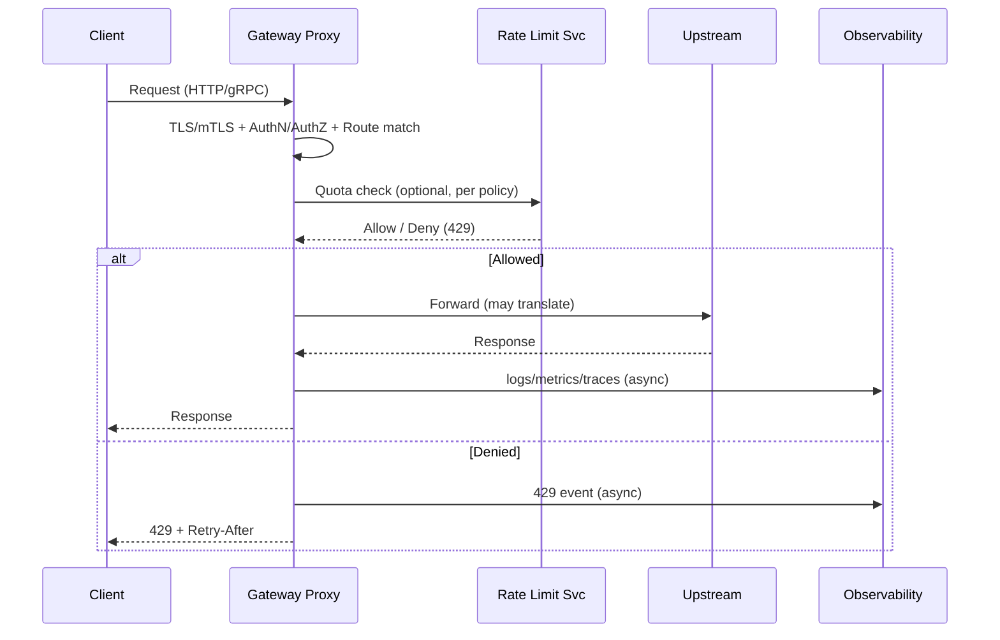
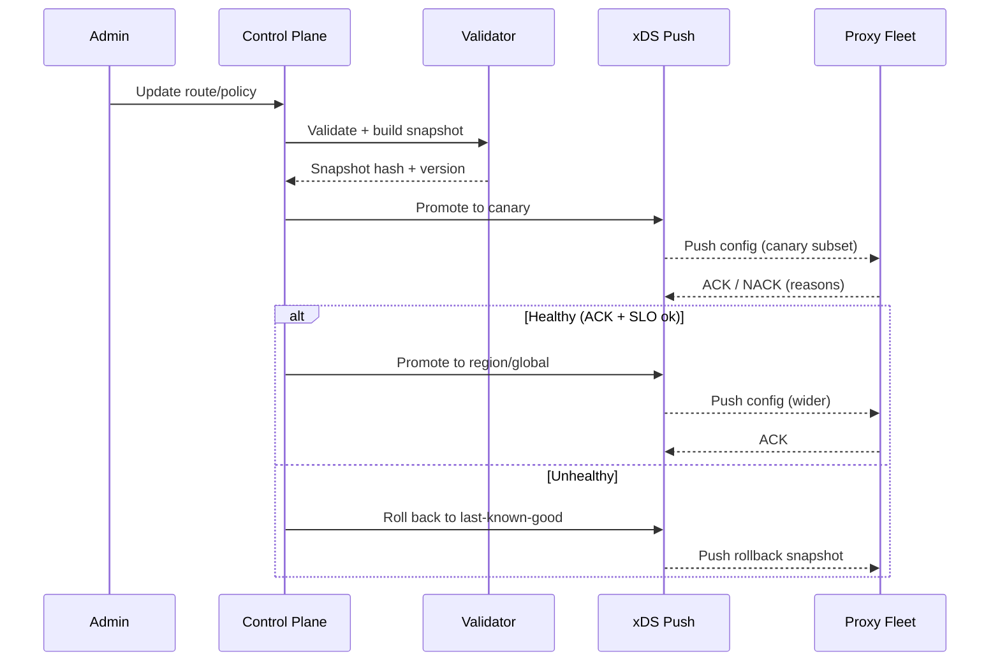

## Overview

An **API Gateway** is the unified entry point for external clients—IoT devices, mobile/web apps, and partners—into a fleet of backend services. It terminates connections, authenticates and authorizes requests, applies traffic policy (rate limits/quotas), performs routing and protocol translation (e.g., gRPC ↔ JSON/HTTP), and protects upstreams with resilience controls (timeouts, retries, circuit breaking).

The core challenge is that the gateway sits on the **fault line** between the public internet and internal systems:

- Traffic is **bursty** and often adversarial (DDoS, credential stuffing, abusive tenants).
- Identities are **high-cardinality** (millions of device certs/API keys).
- Networks are **heterogeneous** (cellular, intermittent connectivity, NATs, proxies).
- Configuration changes are frequent and potentially dangerous (“bad config” outages).

A production-ready design separates the system into:
- **Data plane**: high-performance, horizontally scaled proxies that handle requests.
- **Control plane**: configuration, policy, credentials, validation, and rollout orchestration.

This decoupling lets you scale traffic handling independently from policy management and enables safe, auditable configuration changes.

---

## Requirements

### Functional Requirements

- Terminate TLS, optionally enforce **mTLS** for devices/partners.
- Authenticate requests (API keys, OAuth2/JWT, device certificates) and authorize based on tenant, identity, and route policy.
- Route requests based on host/path/method/headers; support **weighted traffic splitting** (canary/blue-green).
- Protocol translation where required:
  - JSON/HTTP ↔ gRPC (including status/error mapping and schema validation).
  - Optional WebSocket/MQTT pass-through for IoT-specific ingress (if in scope).
- Enforce **rate limits and quotas** per tenant/device/API key/route, including burst handling.
- Apply upstream protection: timeouts, bounded retries, circuit breaking, outlier detection.
- Perform safe request/response transformations: header normalization, request IDs, limited body transforms, CORS.
- Emit observability signals: structured logs, metrics, distributed traces with correlation IDs.
- Provide an admin surface for managing routes, policies, credentials, and rollouts with **auditability**.

### Non-Functional Requirements (with Concrete Targets)

**Traffic & Scale (illustrative but realistic)**
- Registered devices: **5 million**
- Concurrent connections:
  - Global: **300k–600k** (depends heavily on long-lived connections/keep-alives)
  - Per region: **100k–250k**
- Request rate (HTTP/gRPC):
  - Sustained: **50k RPS global**
  - Peak: **150k RPS global** (multi-tenant bursts and incident-driven spikes)
- Configuration size:
  - Routes: **10k–50k** (multi-tenant, per-partner routes can inflate this)
  - Identities/credentials: **0.5M–5M**
  - Policy objects: **10k–100k**

**Latency**
- Gateway-added overhead (excluding upstream):
  - P50: **≤ 5 ms**
  - P99: **≤ 25 ms**
- Rate-limit decision:
  - Local-only (per-proxy): P99 **≤ 1 ms**
  - With centralized quota check: P99 **≤ 8 ms** (regional, same-AZ preferred)

**Availability**
- Data plane (per region): **99.99%**
- Global (multi-region active-active): **99.995%**
- Control plane: **99.9%** is acceptable if the data plane can operate on last-known-good config.

**Consistency**
- Strong consistency for credential issuance, revocation, and admin writes.
- Eventual consistency acceptable for route/policy propagation to edges (**target ≤ 30s**, typical ≤ 5s).
- Rate limiting is **best-effort under partitions** with bounded error and explicit fail-open/fail-closed policy.

**Durability**
- Admin configuration and audit log: **RPO ~ 0**
- Runtime counters and caches: best-effort (loss acceptable)

### Constraints & Assumptions

- Multi-region edge presence (≥ 3 regions/PoPs) for latency and resilience.
- Team can operate Kubernetes or managed equivalents.
- Compliance requires audit trails and secure secret storage (KMS/HSM-backed secret manager).
- Edge-to-control-plane connectivity can be impaired; data plane must continue serving using **last-known-good** config.

---

## Architecture

### High-Level Architecture Diagram

```mermaid
flowchart LR
  %% Clients and ingress
  C[Clients<br/>IoT / Mobile / Web / Partners] --> DNS[Anycast DNS / Geo Routing]
  DNS --> DDoS[DDoS Protection / L3-L4 Filtering]
  DDoS --> WAF[WAF / Bot Protection<br/>(optional)]
  WAF --> ELB[Regional Edge LB]

  %% Data plane
  subgraph DP[Data Plane (per region)]
    direction LR
    G[Gateway Proxies<br/>(Envoy/Kong/NGINX)]
    RL[Rate Limit Service]
    RC[(Redis / KV for quotas)]
    OTel[OTel Collector / Log Agent]
    G --> RL
    RL --> RC
    G --> OTel
  end

  ELB --> G
  G --> U[Upstream Services<br/>(microservices / monolith)]
  G --> IDP[Auth Providers<br/>(OIDC/JWKS, CA/PKI)]

  %% Control plane
  subgraph CP[Control Plane]
    direction LR
    Admin[Admin UI/API]
    Validator[Config Validation + Linting]
    Rollout[Staged Rollout Orchestrator]
    XDS[xDS / Config Push Service]
    PG[(Postgres: config + audit)]
    KMS[KMS / Secret Manager]
    Admin --> Validator --> Rollout --> XDS
    Admin --> PG
    Admin --> KMS
    Validator --> PG
  end

  XDS -. streaming push/ACK-NACK .-> G
  OTel --> Obs[Metrics/Logs/Traces Backend<br/>(Prometheus/ELK/Loki/Tempo)]
```

### Key Architectural Principles

- **Stateless data plane**: scale horizontally; store only caches and small local state.
- **Validated, versioned configuration**: immutable snapshots; safe rollout with automatic rollback.
- **Regionalized dependencies**: keep rate limiting and auth verification regional to meet latency targets.
- **Policy-driven degradation**: explicit fail modes for rate limits and auth dependencies.

---

## Components

## Gateway Proxy (Data Plane)

**Responsibilities**
- TLS termination (and optional mTLS) and connection management (HTTP/1.1, HTTP/2, gRPC).
- Request authentication and authorization integration (JWT validation, API key lookup, mTLS identity).
- Routing and traffic splitting (weighted clusters, header-based routing).
- Resilience features: timeouts, bounded retries, circuit breaking, outlier detection.
- Request normalization and safety controls (max body size, header sanitization, request ID injection).
- Telemetry emission (logs/metrics/traces).

**Recommended Implementation**
- **Envoy Proxy** (strong for xDS, gRPC, outlier detection, extensibility)
  - Alternatives: Kong Gateway, NGINX Plus, HAProxy (feature parity varies for gRPC/xDS)

**Performance Notes**
- Use session reuse and TLS tuning (keep-alives, HTTP/2) to reduce handshake cost.
- Cache JWKS and validate JWT locally to avoid per-request auth calls.
- Prefer **per-route timeouts** and **retry budgets** (bounded retries) to prevent retry storms.

**State Management**
- In-memory route tables from xDS snapshots.
- JWKS cache (TTL 5–15 minutes) with background refresh.
- Optional small local token buckets for fast, approximate rate limiting.

---

## Control Plane (Config, Policy, Credentials)

**Responsibilities**
- CRUD for routes, upstream clusters, auth policies, rate limit policies, and transformation rules.
- Validate configuration (schema + semantic checks) and produce **immutable snapshots**.
- Distribute snapshots to proxies via streaming push (xDS-like) with ACK/NACK.
- Orchestrate staged rollouts (canary → region → global) with automated gates.
- Manage credentials lifecycle (issuance, rotation, revocation) and audit all admin actions.

**Config Safety (Production Requirement)**
- **Pre-commit validation**: schema validation + semantic checks (e.g., unreachable clusters, invalid regex, conflicting routes).
- **Canary rollout**: push to a small proxy subset; gate on:
  - xDS ACK rate and NACK reasons
  - synthetic probes (critical routes)
  - SLO burn (5xx/latency/circuit-open)
- **Automatic rollback** on NACK spike or error budget burn.

**Control Plane Availability**
- Control plane outages must not take down traffic; proxies continue on last-known-good config.
- Prefer regional control planes with a global source-of-truth for admin writes.

---

## Rate Limiting & Quotas

**Goal**
- Prevent abuse and enforce tenant fairness while keeping latency low and avoiding single points of failure.

**Model**
- **Two-tier enforcement**:
  1. **Local (per-proxy)** token buckets for ultra-fast shaping and burst absorption.
  2. **Centralized (per-region)** quotas for strict tenant caps and global fairness within a region.

**Why two tiers?**
- Purely centralized checks increase latency and create a hard dependency.
- Purely local checks allow “N× burst” when scaling out proxies and can be bypassed during reschedules.

**Central Store**
- Redis Cluster (or Aerospike) in-region for counters/token state
  - Use hashing/sharding by `(tenant_id, policy_id)` to distribute load.
  - Protect against hot keys (hierarchical limits, per-tenant sub-shards, or sliding-window approximations).

**Failure Policy**
- Explicit per-policy `fail_mode`:
  - **fail-closed** for untrusted/public traffic (safer)
  - **fail-open** for trusted internal traffic (availability)
- Always apply conservative local shaping if centralized checks are unavailable.

---

## Observability Pipeline

**Signals**
- Metrics: RPS, latency (P50/P95/P99), error codes, upstream health, circuit open counts, retry counts.
- Logs: structured access logs with stable fields (`request_id`, `tenant_id`, `identity_id`, `route_id`, `upstream_cluster`, `status`, `duration_ms`).
- Traces: propagate W3C `traceparent`; record key spans (auth, rate limit, upstream).

**Sampling**
- Head sampling for baseline (e.g., 0.1%–1%).
- Tail-based sampling rules:
  - 100% for 5xx/429/timeouts (bounded with caps during incidents)
  - Higher sampling for specific tenants/routes during investigations

---

## Data Model

### Control Plane Storage (Postgres)

**Key tables (illustrative)**
- `routes`
  - `route_id` (PK), `tenant_id`, `host`, `path_pattern`, `methods[]`, `match_headers` (jsonb),
    `upstream_cluster`, `rewrite_rules` (jsonb), `timeout_ms`, `retry_policy` (jsonb),
    `auth_policy_id`, `rate_limit_policy_id`, `priority`, `version`, `created_at`
- `upstreams`
  - `cluster_id` (PK), `tenant_id`, `endpoints` (jsonb), `healthcheck` (jsonb),
    `circuit_breaker` (jsonb), `tls_policy` (jsonb), `version`
- `identities`
  - `identity_id` (PK), `tenant_id`, `type` (device|partner|app), `status`, `metadata` (jsonb)
- `credentials`
  - `credential_id` (PK), `identity_id` (FK), `kind` (api_key|oidc_client|mtls_cert),
    `secret_ref`, `expires_at`, `revoked_at`, `rotated_at`
- `auth_policies`
  - `auth_policy_id` (PK), `tenant_id`, `mode` (api_key|jwt|mtls|mixed),
    `jwks_issuers` (jsonb), `required_scopes` (text[]), `version`
- `rate_limit_policies`
  - `policy_id` (PK), `tenant_id`, `scope` (tenant|identity|route),
    `limit_rps`, `burst`, `window_ms`, `key_strategy` (jsonb), `fail_mode`, `version`
- `config_snapshots`
  - `snapshot_id` (PK), `hash`, `status` (staged|active|rolled_back),
    `scope` (canary|region|global), `created_by`, `created_at`
- `audit_log`
  - `event_id` (PK), `actor`, `action`, `resource_type`, `resource_id`,
    `before` (jsonb), `after` (jsonb), `created_at`

**Notes**
- Multi-tenancy is explicit (`tenant_id`) to support isolation, per-tenant quotas, and audit.
- Snapshots should be **immutable** and content-addressed by `hash` for integrity.

### Runtime Storage (Redis / KV)

- Rate limiting:
  - `rl:{tenant_id}:{policy_id}:{bucket}` → token/counter state (sharded)
- Optional caches:
  - `jwk:{issuer}` → JWKS JSON (TTL)
  - Prefer proxy-local caching for JWKS; Redis caching is optional and usually unnecessary.

---

## API

### Data Plane (Client-Facing)

The data plane typically exposes a small surface; routes define behavior.

- `ANY /{path...}`
  - Route match: `Host` + `path` + `method` + optional headers
  - Auth: API key/JWT/mTLS per route policy
  - Rate limit: per-tenant/identity/route
  - Errors:
    - `401` unauthenticated, `403` unauthorized
    - `404` no route match
    - `429` rate limited (include `Retry-After`)
    - `503` circuit open/upstream unavailable
    - `504` upstream timeout

**Protocol Translation (HTTP/JSON ↔ gRPC)**
- Map HTTP paths to gRPC methods using `google.api.http` annotations or explicit gateway mapping.
- Validate JSON payload against protobuf schema (reject invalid fields if configured).
- Map gRPC status to HTTP status consistently (e.g., `UNAVAILABLE → 503`, `DEADLINE_EXCEEDED → 504`).

**Idempotency**
- Prefer end-to-end idempotency:
  - Gateway forwards `Idempotency-Key` to upstreams that implement deduplication.
- If the gateway must dedupe, use an external store (e.g., Redis) with TTL and clearly document limits; avoid embedding long-lived state in proxies.

### Control Plane (Admin)

- `POST /v1/snapshots`
  - Creates a validated snapshot from staged resources.
  - Response: `{ "snapshot_id": "...", "hash": "...", "status": "staged" }`
- `POST /v1/snapshots/{snapshot_id}:promote`
  - Request: `{ "scope": "canary|region|global", "percent": 5 }`
- `PUT /v1/routes/{route_id}`
  - Request: `{ "tenant_id": "...", "host": "...", "path_pattern": "...", "methods": ["GET"], "upstream_cluster": "...", "timeout_ms": 800, "retry_policy": { ... } }`
- `PUT /v1/rate-limit-policies/{policy_id}`
  - Request: `{ "tenant_id": "...", "scope": "route", "limit_rps": 200, "burst": 50, "window_ms": 1000, "fail_mode": "fail-closed" }`
- `POST /v1/credentials:issue`
  - Request: `{ "identity_id": "...", "kind": "api_key", "ttl_seconds": 2592000 }`
  - Response: `{ "credential_id": "...", "secret_ref": "...", "expires_at": "..." }`

**Admin Error Model**
- `{ "code": "INVALID_ARGUMENT", "message": "...", "details": {...}, "request_id": "..." }`
- Use `409` for optimistic concurrency/version conflicts.

---

## Data Flows

### Request Path (Runtime)



### Config Rollout (Control → Data Plane)



---

## Scaling & Performance

### Capacity Planning (Back-of-the-Envelope)

Assumptions (adjust for your product):
- Peak: **150k RPS global**, average request/response payload **2 KB** each.
- Bandwidth (rough): 150k * 4 KB ≈ **600 MB/s** global (~4.8 Gbps), excluding TLS overhead.
- If you need 250k concurrent connections/region, ensure:
  - high file descriptor limits
  - tuned keep-alives/idle timeouts
  - sufficient memory for connection state and HTTP/2 streams

### Likely Bottlenecks & Mitigations

- **TLS and crypto**:
  - Mitigation: session reuse, HTTP/2, modern ciphers, hardware acceleration where available
- **JWT verification**:
  - Mitigation: proxy-local JWKS caching + background refresh; avoid synchronous issuer fetches
- **Central rate limiting calls**:
  - Mitigation: local shaping + only call centralized quotas for specific policies/routes; keep Redis in same region/AZ; use pooling/batching
- **Retry storms**:
  - Mitigation: bounded retries, per-try timeouts, retry budgets, circuit breaking, outlier detection
- **Config propagation storms**:
  - Mitigation: snapshotting, staged rollout, rate-limited pushes, proxy warm-up

### Horizontal Scaling

- **Gateway proxies**:
  - Autoscale on CPU, active connections, and queueing/latency signals (not just RPS).
  - Spread across zones; use connection draining on rollout.
- **Rate limit service**:
  - Stateless; scale behind internal LB; co-locate with Redis to reduce tail latency.
- **Redis/KV**:
  - Scale via sharding; monitor hot keys and eviction; consider separate clusters per environment/tenant tier.

### Caching Strategy

- JWKS: proxy-local cache, TTL 5–15 minutes; prefetch on config rollout.
- Config: in-memory; persist last-known-good snapshot to disk for fast restart.
- Rate limiting:
  - Local token bucket per `(tenant, route)` for burst smoothing (e.g., burst 10–50).
  - Central quotas for per-minute/hour enforcement; accept bounded inaccuracy during partitions.

---

## Trade-offs & Alternatives

### Key Trade-offs

1. **Separate data plane + control plane**
   - Pros: safe rollouts, independent scaling, blast-radius reduction
   - Cons: more moving parts, requires strong tooling and operational maturity

2. **Hybrid rate limiting (local + centralized)**
   - Pros: low latency on happy path, resilience to RL dependency failures
   - Cons: not perfectly precise under partitions; requires clear policy semantics

3. **Eventual config propagation**
   - Pros: control plane outages don’t drop traffic; supports disconnected operation
   - Cons: short window where new policies aren’t everywhere; must design revocation carefully (see below)

### Important Security Note: Revocation Semantics

Credentials and revocations often need **faster-than-30s** enforcement for high-risk keys. Options:
- Push revocations with higher priority than general config.
- Maintain a small “denylist” stream (or short TTL cache) for emergency revocations.
- For mTLS, use short-lived certs + frequent rotation to limit exposure.

### Alternatives

- **Managed API Gateway (cloud)** (AWS API Gateway, Apigee, Cloud Endpoints)
  - Pros: faster time-to-market, less ops burden
  - Cons: cost at high scale, limited deep customization (IoT/mTLS nuances), harder multi-cloud portability

- **Service mesh only**
  - Pros: strong east-west traffic control
  - Cons: does not fully replace north-south needs (WAF, device identity, partner quotas, DDoS posture)

- **Custom monolithic gateway**
  - Pros: maximal flexibility
  - Cons: high security and protocol correctness risk; long-term maintenance burden; reinvents battle-tested features

---

## Failure Modes & Mitigations

### Failure Scenarios (at least 3)

1. **Redis / rate limit service outage**
   - Impact: over-throttling or under-enforcement
   - Detection: RL error rate, Redis health, increased 429/5xx, RL latency spikes
   - Mitigation: policy-based fail-open/closed; local shaping; global “circuit breaker” caps per tenant

2. **Bad config rollout (route conflicts, invalid clusters, too-aggressive retries)**
   - Impact: partial or total outage; retry storms; cascading failures
   - Detection: xDS NACKs, 404/503 spikes, synthetic failures, error budget burn
   - Mitigation: validation + canary rollout + automated rollback; config lint rules (timeouts/retries limits)

3. **Upstream latency spike / partial upstream failure**
   - Impact: gateway thread/connection exhaustion; cascading failures; elevated 504
   - Detection: upstream P99, queue depth, circuit-open counts, retry amplification signals
   - Mitigation: tight timeouts; bounded retries; circuit breaking/outlier detection; per-upstream bulkheads

4. **Region/PoP failure**
   - Impact: loss of edge capacity; increased latency and error rates
   - Detection: health checks, BGP/DNS signals, region-level SLO alerts
   - Mitigation: active-active multi-region; Anycast/DNS failover; warm capacity; regional dependency isolation

### Disaster Recovery

- Targets:
  - Control plane RTO: **≤ 30 minutes**
  - Config/audit RPO: **~ 0**
- Backups:
  - Postgres PITR + WAL archiving; periodic restore drills
- Failover:
  - Promote Postgres standby; control plane redeploy; proxies continue on last-known-good config until reconnected

---

## Operations

### SLOs, SLIs, and Alerting

**Primary SLOs**
- Availability: 99.99% per region (data plane)
- Latency: P99 gateway-added latency ≤ 25 ms
- Correctness: config rollout success rate; auth failure rates within expected bounds

**Key SLIs**
- Request success rate by route/tenant (excluding intended 4xx)
- Added latency distributions (proxy internal time)
- Upstream error/timeout rates; circuit breaker opens
- Rate limit decision latency and error rate
- xDS ACK/NACK rate and median propagation time

**Alert Examples**
- P99 added latency > 25 ms for 5 minutes (regional)
- 5xx > 1% over 5 minutes for critical routes
- Sudden 429 anomaly for a tenant (possible abuse or misconfigured policy)
- xDS NACKs > 0.1% of proxies during rollout stage

### Deployment & Change Management

- Data plane:
  - rolling updates with connection draining
  - canary by region/PoP; fast rollback
- Control plane:
  - canary/blue-green with strict backwards compatibility for config schema
- Config changes:
  - immutable snapshots
  - staged promotion with automated gates (synthetics + NACK + SLO burn)

### Security Practices (Gateway-Specific)

- Secrets never stored in plaintext in databases; use KMS-backed secret manager (`secret_ref` indirection).
- mTLS:
  - short-lived certs; automated rotation; explicit certificate revocation strategy
- Request hardening:
  - limits for headers/body; sanitize hop-by-hop headers; enforce allowed methods/content-types
- Audit:
  - every admin change recorded with actor, before/after, and request_id correlation

---

## References & Further Reading

- Envoy Proxy (xDS, outlier detection, circuit breakers): https://www.envoyproxy.io/
- Envoy Rate Limit Service (reference implementation concepts): https://www.envoyproxy.io/docs/envoy/latest/intro/arch_overview/other_features/global_rate_limiting
- gRPC JSON Transcoding (google.api.http patterns): https://cloud.google.com/endpoints/docs/grpc/transcoding
- Resilience patterns (timeouts, retries, circuit breakers): https://martinfowler.com/articles/microservice-resilience.html
- Rate limiting strategies: https://cloud.google.com/architecture/rate-limiting-strategies-techniques
- Google SRE Book (SLOs, error budgets): https://sre.google/sre-book/table-of-contents/
- OWASP API Security Top 10: https://owasp.org/www-project-api-security/