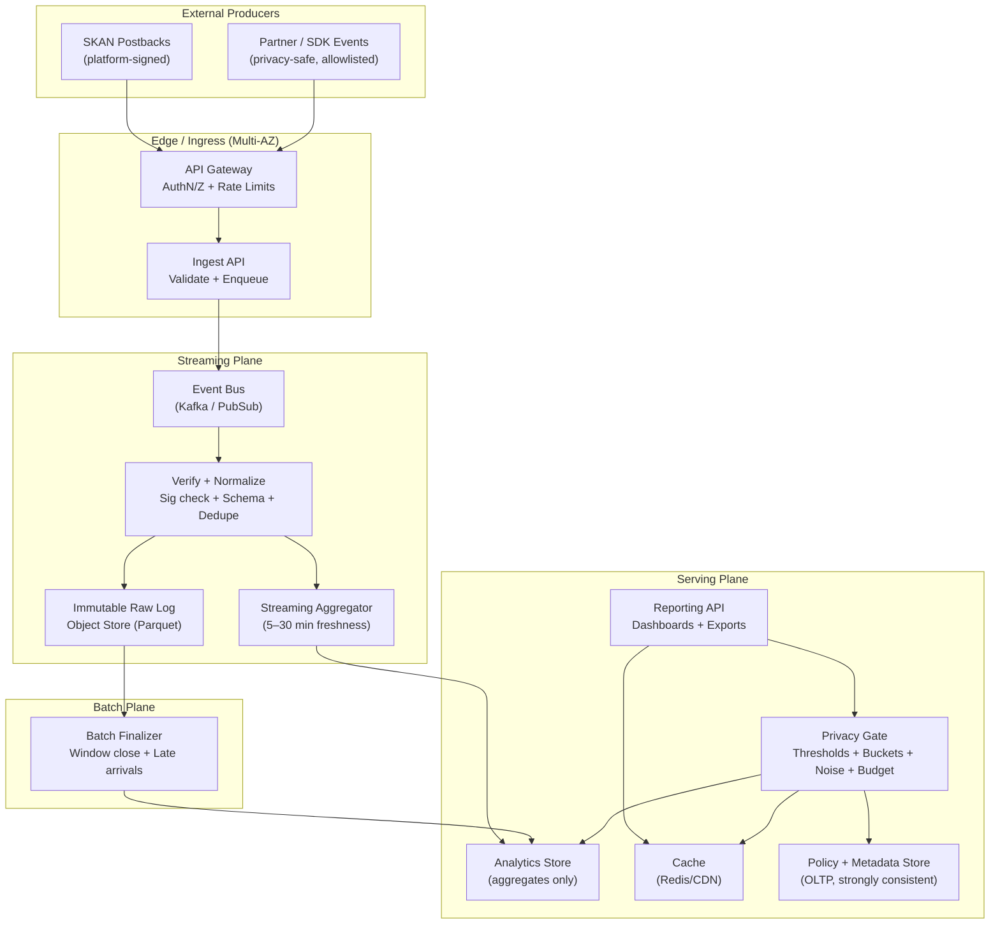

## Overview

Attribution measurement answers a deceptively hard question: “Which ads caused which conversions?” In modern ecosystems, that question must be answered under strict privacy constraints (e.g., Apple SKAdNetwork (SKAN), Private Click Measurement (PCM), Android Privacy Sandbox APIs), where user-level identifiers are unavailable or restricted, reporting is delayed, and only coarse or aggregated signals are permitted.

This document designs a production-ready, privacy-preserving attribution system that:

- Ingests signed, privacy-constrained signals (e.g., SKAN postbacks) and privacy-safe partner/server events where allowed.
- Produces marketing reports (installs, purchases, revenue, ROAS) at campaign/cohort granularity.
- Enforces privacy rules as a hard boundary, preventing “small cohort” inference and repeated slicing leakage.
- Remains robust to retries, delayed delivery, late arrivals, and fraud/gaming attempts.

**Core idea: two planes + a hard privacy boundary**

1. **Collection plane (write path)**: accepts events, authenticates the sender, validates schema, verifies signatures where applicable, deduplicates, and writes an immutable raw log.
2. **Aggregation & reporting plane (compute + read path)**: computes versioned aggregates (stream + batch finalization) and serves only privacy-compliant outputs through a dedicated **Privacy Gate**.

Correlation is performed at **campaign/cohort level** (not per user). We optimize for correctness over time via window finalization + versioning, not read-after-write semantics.

---

## Requirements

### Functional Requirements

- Ingest privacy-constrained attribution signals:
  - **SKAN postbacks** (signed, delayed, coarse/fine conversion values, multi-postback sequences).
  - Optional: **PCM-style** web signals and **privacy-safe server-to-server events** (strict allowlist, no stable user IDs).
- Authenticate partners/tenants; enforce tenant isolation.
- Verify authenticity/integrity:
  - SKAN signature verification (platform-provided public keys).
  - Partner events via mTLS and/or HMAC/JWS with key rotation.
- Replay protection and idempotent deduplication across retries.
- Produce standard marketing reports:
  - installs, conversions, revenue, ROAS, funnels
  - breakdowns by day/week, campaign/adgroup/creative, country/region (coarse), and source (skan/sdk/partner) subject to policy
- Support SKAN-like semantics:
  - delayed reporting windows
  - conversion value updates (fine/coarse)
  - multiple postbacks per install (sequence index)
  - crowd anonymity effects (null/limited fields)
- Backfills and reprocessing:
  - versioned aggregates by `logic_version` and `privacy_policy_version`
  - reproducible from immutable raw log
- Fraud detection and mitigation:
  - anomaly detection and partner quality scoring
  - filtered vs unfiltered views (with strict governance)

### Non-Functional Requirements (Concrete Targets)

**Scale (baseline, realistic interview numbers)**
- **Ingest**: 10K sustained QPS, burst to 80K QPS for short spikes (minutes).
- **Events/day**:
  - Signed postbacks: 50M–300M/day (delayed, relatively low QPS but spiky)
  - Optional raw interaction logs (clicks/impressions/conversions where allowed): up to 1B/day
  - Total raw records stored: **0.3B–1.3B/day**
- **Tenancy**: 10K tenants, 200K active campaigns, 1M creatives.
- **Reporting**: 5K–20K queries/min peak (≈ 80–330 QPS), with strong caching for “top dashboards”.

**Latency**
- Ingest acknowledgement (write-path only): **P99 < 200ms**
- Stream “directional” aggregates availability: **P50 ~ 5 minutes, P99 < 30 minutes**
- Finalized aggregates (after attribution window close): available within **2–6 hours** of expected close
- Reporting API: **P50 < 300ms, P99 < 2s** for common pre-aggregated breakdowns

**Availability**
- Ingest APIs: **99.95%** (multi-AZ, degrade to buffering)
- Reporting APIs: **99.9%** (degrade to cached finalized aggregates)

**Durability**
- Accepted events: **RPO ≈ 0** (immutable raw log replicated)
- Derived aggregates: rebuildable (RPO < 24h acceptable if raw is intact)

**Consistency**
- Ingestion and stream compute: **at-least-once**
- Aggregates: **eventually consistent**, correctness via **finalization + versioning**
- Reporting: “directional” vs “finalized” explicitly labeled; no implied read-after-write

### Constraints & Assumptions

- Privacy constraints prohibit stable user identifiers in the primary SKAN path.
- Outputs must prevent small-cohort inference: default **k-anonymity threshold** (e.g., `k >= 50`) and **minimum time bucket** (e.g., day or week) for sensitive cuts.
- Multi-tenant isolation: per-tenant access control, per-tenant encryption and quotas.
- Prefer managed components to reduce operational burden.
- Limited ability to pull from third parties; assume partner push to ingest endpoints.

---

## Architecture

### High-Level System Diagram



### Key Architectural Choices (and why)

- **Immutable raw log**: provides auditability, reprocessing, and safe rollouts for logic/policy changes.
- **Dual compute paths (stream + batch)**:
  - Stream gives fast directional visibility.
  - Batch finalizer provides correctness once attribution windows close and late arrivals are accounted for.
- **Aggregates-only serving store**: reduces privacy risk and cost, and matches platform constraints.
- **Privacy Gate as a hard boundary**: all reporting outputs go through it; it can “fail closed” (suppress) to avoid accidental leakage.

---

## Components

### 1) API Gateway + Ingest API

**Responsibilities**
- Authenticate and authorize callers (tenant + partner).
- Apply rate limiting and quotas (per tenant, per partner, per endpoint).
- Validate schema (strict, versioned), normalize timestamps, and enqueue events.
- Return fast `202 Accepted` after durable enqueue.

**Design notes**
- Keep ingest thin: avoid heavy crypto on the synchronous path.
- Require idempotency for partner/S2S endpoints.
- Support bulk ingestion for partners to reduce overhead (e.g., up to 1K events/request).

**Typical tech**
- API Gateway (Envoy / managed gateway) + stateless services (Go/Java) + Kafka/PubSub.

---

### 2) Verify + Dedup + Normalize

**Responsibilities**
- Verify integrity/authenticity:
  - SKAN: validate signature with platform public keys; validate required fields and schema version.
  - Partner events: validate mTLS client cert and/or HMAC/JWS signature with rotated keys.
- Detect replay and duplicates; enforce idempotency.
- Normalize into an internal canonical event format.
- Write both valid and invalid (redacted) samples to raw log for debugging and partner feedback.

**Dedup strategy**
- Maintain a TTL “seen set” keyed by a deterministic hash:
  - SKAN: hash of the signed payload (or stable platform-provided identifiers), plus tenant/source.
  - Partner: `idempotency_key` + tenant + endpoint.
- TTL aligned to maximum late arrival / dispute window: typically **90 days**.

**Implementation**
- Stream processor (Flink / Kafka Streams) + a low-latency key store (Redis Cluster / Cassandra / DynamoDB).
- If dedupe store is degraded: degrade to “best-effort” dedupe and reconcile in batch finalization.

---

### 3) Raw Log Store (Immutable)

**Responsibilities**
- Durable, append-only storage of normalized inputs and verification outcomes.
- Primary source of truth for reprocessing and audits.

**Implementation**
- Object store (S3/GCS) + Parquet/ORC, partitioned by `day/tenant/source`.
- Encryption at rest; tightly scoped access (no direct analyst access to raw by default).

---

### 4) Streaming Aggregator (Directional Metrics)

**Responsibilities**
- Produce rolling aggregates for dashboards with controlled freshness.
- Handle at-least-once delivery and idempotent updates (by event hash).

**Design**
- Time-bucketed aggregates (e.g., 5 min and 1 day), keyed by allowed dimensions (tenant, source, campaign, country, etc.).
- Store results as “directional” and label clearly; never claim finality.

---

### 5) Batch Finalizer (Correctness + Window Close)

**Responsibilities**
- Finalize windows after expected attribution delays.
- Recompute aggregates for late arrivals and logic changes.
- Publish a new `aggregate_version` for a given day/window and mark it finalized.

**Design**
- “Finalization schedule” per source:
  - Example: for day D, finalize D once D+N days have passed (N depends on SKAN/partner semantics).
- Batch jobs are partitioned by `tenant_id` and `day` to limit blast radius and allow targeted reprocessing.

---

### 6) Analytics Store (Serving Aggregates)

**Responsibilities**
- Serve pre-aggregated metrics at low latency and high concurrency.
- Support common group-bys efficiently.

**Design**
- Store **only aggregates** (no per-user rows).
- Materialize common cubes (e.g., day × campaign × country × source).
- Keep long-tail queries constrained by policy and “allowlisted dimensions”.

**Typical tech**
- ClickHouse / Druid / BigQuery (depending on ops model and query patterns), with Redis for hot caching.

---

### 7) Policy + Metadata Store (OLTP)

**Responsibilities**
- Store tenant configuration and privacy policy:
  - thresholds, allowed dimensions, minimum bucket sizes, noise mode, query limits
- Store mapping metadata:
  - campaign/adgroup/creative mappings, naming, ownership
- Provide strongly consistent reads for policy enforcement.

**Typical tech**
- Postgres (multi-AZ) + migrations + audit log.

---

### 8) Privacy Gate (Hard Boundary)

**Responsibilities**
- Enforce privacy constraints on every report:
  - k-anonymity thresholds / small-cell suppression
  - minimum time bucketing (day/week)
  - dimension allowlists
  - optional noise (bounded, configurable)
  - query auditing and rate limiting to reduce “repeated slicing” leakage
- Fail closed on policy uncertainty (e.g., policy store outage).

**Important nuance**
- “k-anonymity on installs” is a pragmatic industry control, not a formal DP guarantee.
- If you claim differential privacy, you must implement bounded contributions, calibrated noise, and privacy budgeting end-to-end. This design supports an optional DP mode but does not require it for baseline operation.

---

## Data Model

### Canonical Event (Internal)

All ingested signals are normalized into a canonical record before storage/compute.

- `tenant_id` (string)
- `source` (enum: `skan`, `sdk`, `partner`, `pcm`)
- `received_at` (timestamp)
- `event_time` (timestamp; nullable)
- `event_type` (enum: `postback`, `conversion`, `click` (if allowed))
- `event_hash` (string; deterministic, used for dedupe/idempotency)
- `verify_status` (enum: `valid`, `invalid_sig`, `invalid_schema`, `unauthorized`, `replay_suspected`)
- `payload_envelope`:
  - `schema_version` (int)
  - `payload` (json/binary; encrypted at rest)
  - `redaction_level` (enum)

### Raw Immutable Log (Object Store, Parquet)

Partitioning:
- `day` (derived from `received_at` in UTC)
- `tenant_id`
- `source`

Recommended columns:
- canonical fields above
- selected extracted fields needed for aggregation (to avoid decrypting full payload at compute time), e.g.:
  - `campaign_id` (nullable; SKAN crowd anonymity may null)
  - `country` (nullable/coarse)
  - `postback_sequence_index` (nullable)
  - `coarse_cv` / `fine_cv` (nullable)
  - `conversion_value_version` (nullable)
  - `revenue_micros` (nullable)

### Dedupe Store

Key:
- `(tenant_id, event_hash) -> first_seen_at`

TTL:
- **90 days** (tunable per source)

### Aggregates (OLAP)

Grain (example “daily campaign cube”):
- Dimensions:
  - `tenant_id`, `day`, `source`, `campaign_id`, `country` (optional), `cv_bucket` (optional)
- Metrics:
  - `installs`, `conversions`, `revenue_micros`, `postbacks`, `unique_event_hashes`
- Versioning:
  - `logic_version` (int)
  - `privacy_policy_version` (int)
  - `aggregate_version` (string; e.g., `2025-12-17T02:00Z`)
  - `finalized` (bool)
  - `finalized_at` (timestamp)

### Policy Config (OLTP)

- `tenant_id`
- `privacy_policy_version`
- `min_k_installs` (int; e.g., 50)
- `min_time_bucket` (enum: `day`, `week`)
- `allowed_dimensions` (json array, e.g., `["day","campaign_id","country"]`)
- `max_group_bys` (int)
- `noise_mode` (enum: `none`, `laplace`, `gaussian`)
- `noise_parameters` (json; if enabled)
- `query_rate_limit` (int; per minute)
- `updated_at`

---

## API

### Authentication & Authorization (applies to all endpoints)

- Tenant-scoped auth via OAuth2/JWT (service accounts) and optional mTLS for partners.
- Every request must include `X-Tenant-Id`.
- Partner endpoints require `X-Partner-Id` and signature (HMAC/JWS) or mTLS client cert mapping.

### Ingest APIs

**POST `/v1/ingest/skan/postbacks`**
- Purpose: ingest SKAN postbacks (platform-signed payload).
- Headers:
  - `X-Tenant-Id: ...`
  - `Idempotency-Key: ...` (recommended even if payload-hash dedupe exists)
- Body: opaque SKAN postback envelope (versioned schema).
- Response:
  - `202 Accepted` `{ "accepted": true, "request_id": "...", "deduped": false }`
- Errors:
  - `400` invalid schema
  - `401/403` unauthorized
  - `413` too large
  - `429` rate limited

**POST `/v1/ingest/conversions`** (privacy-safe S2S)
- Purpose: ingest server-side conversion events where allowed.
- Requirements:
  - No stable user identifiers.
  - Strict allowlist of fields (e.g., `campaign_id`, `value_micros`, `currency`, `event_time`).
- Headers:
  - `X-Tenant-Id`, `Idempotency-Key`, plus partner auth.
- Response:
  - `202 Accepted` `{ "accepted": true, "request_id": "...", "deduped": false }`

**POST `/v1/ingest/bulk`**
- Purpose: reduce overhead for partners; batch up to N events.
- Response includes per-item acceptance and reasons for rejection (redacted).

### Reporting APIs

**GET `/v1/reports/attribution`**
- Query params:
  - `from` (date, inclusive), `to` (date, inclusive)
  - `source` (`skan`/`sdk`/`partner`)
  - `group_by` (comma list; validated against policy)
  - `finalized_only` (bool; default `true` for exports, `false` for dashboards)
- Response:
  ```json
  {
    "data": [
      {
        "day": "2025-12-01",
        "campaign_id": "123",
        "country": "US",
        "installs": 1200,
        "conversions": 87,
        "revenue_micros": 123450000
      }
    ],
    "suppressed_cells": 42,
    "result_version": "W/\"tenant:1:policy:7:logic:12:agg:2025-12-02T06:00Z\"",
    "privacy_policy_version": 7,
    "logic_version": 12,
    "finalized": true
  }
  ```
- Errors:
  - `400` invalid `group_by` / invalid date range
  - `403` tenant access denied
  - `422` query violates privacy constraints (fail closed) or returns empty-with-reason

**POST `/v1/reports/attribution:query`** (optional advanced)
- Allows more complex filters while still policy-constrained (recommended for internal UI).
- Supports async mode for large exports (`202` + job id).

---

## Scaling

### Back-of-the-Envelope Capacity

Assume 1B raw records/day average:
- Avg QPS ≈ `1,000,000,000 / 86,400 ≈ 11,600 QPS` (fits 10K sustained with headroom and bursts)
- If average record size after normalization is ~500 bytes (compressed Parquet is smaller), raw ingress is:
  - ~500 GB/day uncompressed equivalent; often far less on disk due to columnar compression.

OLAP aggregates are typically orders of magnitude smaller than raw:
- Daily campaign cube row count ≈ tenants × campaigns × countries × days (but sparse)
- With strong pre-aggregation, OLAP storage is usually manageable (< a few TB for months of history for mid-size workloads).

### Hotspots and Mitigations

- **Burst ingest**: buffer in event bus; autoscale ingest and verify consumers; apply per-tenant throttles.
- **Dedupe store hot keys**: consistent hashing + sharding; avoid per-campaign keys on the dedupe path.
- **OLAP query fanout**: materialized views + strict dimension allowlists; cache common dashboards.
- **Backfills**: partitioned batch jobs (by day/tenant) and versioned publishing; isolate noisy tenants.

### Caching Strategy

- Cache common finalized dashboards (e.g., last 7/30 days by campaign) in Redis/CDN:
  - TTL: 5–30 minutes
  - Key includes `(tenant, query, aggregate_version, policy_version, logic_version)`
- “Directional” cache should be short-lived and clearly labeled.
- Invalidation via version bumps; otherwise time-based expiry.

---

## Trade-offs

### Trade-offs Made

1. **Aggregates-only serving store**
   - Pros: dramatically reduces privacy exposure and cost; aligns with SKAN constraints.
   - Cons: limited debugging and ad-hoc slicing; requires careful cube design.

2. **Stream + batch finalization**
   - Pros: freshness + correctness, handles late arrivals, supports reprocessing.
   - Cons: higher complexity, dual pipelines, more operational surface area.

3. **Query-time Privacy Gate (fail closed)**
   - Pros: privacy is enforceable and centralized; avoids accidental leakage from downstream consumers.
   - Cons: can suppress “small campaign” results; adds latency and policy dependency.

4. **Idempotency via dedupe store**
   - Pros: protects against retries and replay; stabilizes aggregates.
   - Cons: introduces a stateful dependency; requires careful TTL sizing and sharding.

### Alternatives (when you might choose them)

- **Batch-only pipeline**: cheaper/simpler; acceptable if freshness is not required.
- **Warehouse-only serving (BigQuery/Snowflake)**: simplifies stack; may struggle with high QPS interactive dashboards without heavy caching/materialization.
- **Clean room / MPC**: appropriate for cross-party joins (publisher + advertiser) where neither party can reveal raw data; cost and latency are higher.
- **Formal differential privacy end-to-end**: strongest privacy, but requires strict contribution bounding, calibrated noise, privacy accounting, and careful product expectations.

---

## Failure Modes

### Common Failure Scenarios and Mitigations

1. **Event bus partition outage / severe lag**
   - Impact: delayed processing; dashboards stale.
   - Detect: consumer lag, enqueue depth, end-to-end delay SLI.
   - Mitigate: multi-AZ bus, autoscale consumers, backpressure at gateway, replay after recovery.

2. **Signature verification regression (rejecting valid postbacks)**
   - Impact: undercounting and customer trust loss.
   - Detect: spike in `invalid_sig`, partner/platform discrepancy checks.
   - Mitigate: canary verification changes, support multiple active verification keysets, quarantine + reprocess from raw.

3. **Dedupe store degradation**
   - Impact: overcount risk due to retries and replay.
   - Detect: dedupe latency/errors; rising duplicate ratios.
   - Mitigate: degrade to best-effort dedupe; mark “dedupe uncertain” and reconcile in batch finalization.

4. **Policy store outage or stale policy reads**
   - Impact: privacy enforcement uncertainty.
   - Detect: policy read failures/latency; mismatch in policy version.
   - Mitigate: Privacy Gate fails closed (suppress); cache last-known-good policies with short TTL; multi-AZ OLTP.

5. **OLAP hotspot from expensive breakdowns**
   - Impact: latency spikes, partial outage.
   - Detect: slow query logs, CPU saturation, P99 report latency.
   - Mitigate: strict dimension allowlists, query quotas, require pre-aggregated endpoints, aggressive caching.

6. **Fraud wave / partner abuse (bot conversions, spam)**
   - Impact: inflated metrics; trust damage.
   - Detect: anomaly detection (conversion rate spikes, geo outliers), partner scoring, sudden distribution shifts.
   - Mitigate: throttle partners, filtered views, rule-based blocks, manual review workflow with audit logs.

### Disaster Recovery Targets

- **RTO**: 1 hour for ingest (degraded acceptable), 4 hours for reporting.
- **RPO**: ~0 for raw log (cross-region replication); aggregates rebuildable (RPO < 24h acceptable).
- **Failover**:
  - Active-active ingest endpoints with DNS/LB failover.
  - Consumers can replay from bus or rebuild from raw log.
  - OLAP restored from snapshots or rebuilt from raw depending on SLA/cost.

---

## Operations

### SLOs (What you measure and defend)

- Ingest availability: **99.95%**
- Ingest P99 latency: **< 200ms**
- Stream freshness: **P99 < 30 min** lag from accept → available directional aggregates
- Reporting availability: **99.9%**
- Reporting P99 latency: **< 2s** for common dashboards
- Data quality: finalized aggregates within **2–6 hours** of window close; discrepancy checks within defined tolerance

### Monitoring & Alerting

- Ingest: QPS, P99 latency, 4xx/5xx, auth failures, throttles.
- Verify: valid/invalid ratios, dedupe hit rate, replay detections, consumer lag.
- Stream: watermark delay, checkpoint failures, restart frequency, output rate.
- Batch: job duration, late-arrival rate, finalized row counts, version publish success.
- Reporting: latency percentiles, cache hit rate, suppressed cell rate, error rate.
- Privacy: number of blocked queries, budget consumption (if enabled), policy version mismatches.
- Data quality:
  - day-over-day deltas by tenant/campaign
  - invariants (finalized numbers should not change except by controlled re-finalization)
  - reconciliation (stream vs finalized within bounds)

### Deployment & Change Management

- Canary and feature flags for:
  - `logic_version` (attribution logic)
  - `privacy_policy_version` (privacy controls)
- Backward-compatible schemas with explicit `schema_version`.
- Rollback plan:
  - keep prior aggregate versions queryable
  - ability to re-run batch finalization from raw log
- Runbooks:
  - bus lag, dedupe degradation, verification regression, OLAP overload, policy store outage

### Security & Compliance (Minimum Bar)

- Encryption in transit (TLS) and at rest; key management via KMS.
- Strict IAM:
  - raw log access restricted to pipeline services
  - analysts and reporting consumers access aggregates only
- Audit logs for:
  - policy changes
  - report queries (especially high-cardinality slicing attempts)
  - partner ingestion anomalies
- Data retention:
  - raw logs retained per compliance (e.g., 90–180 days), aggregates longer (e.g., 2 years) if allowed
- Tenant isolation:
  - per-tenant quotas, per-tenant encryption context, and authorization checks at every boundary

---

## References & Further Reading

- Apple SKAdNetwork (SKAN) documentation (including SKAN 4 concepts: multi-postback, coarse/fine CV, crowd anonymity)
- Apple Private Click Measurement (PCM) for web attribution
- Android Privacy Sandbox attribution APIs
- Kafka/Flink operational patterns: checkpointing, exactly-once semantics (where applicable), idempotent sinks
- ClickHouse/Druid best practices for time-series aggregates and materialized views
- Practical privacy controls in analytics: k-anonymity suppression, query auditing, and (optional) differential privacy fundamentals