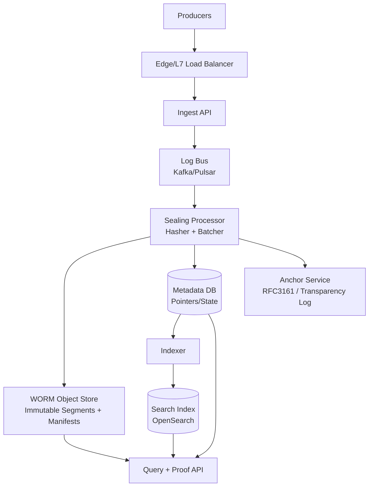
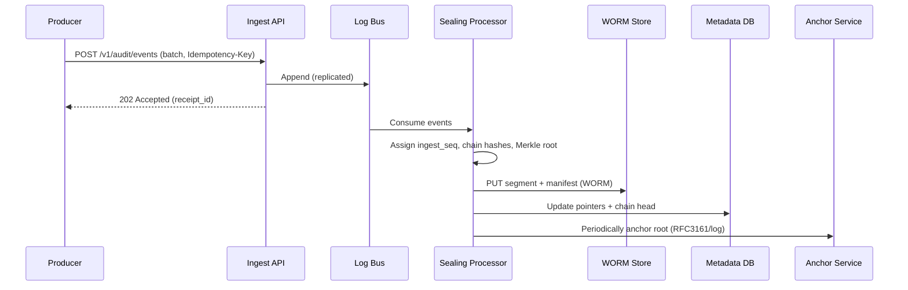
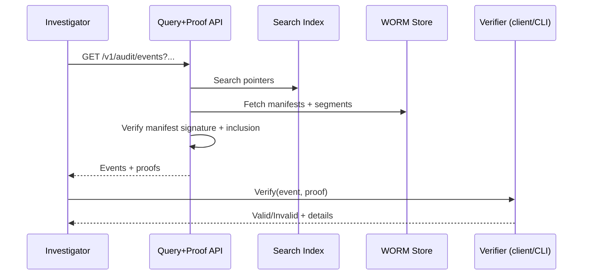

## Overview

An audit trail system is the backbone of compliance (SOX, HIPAA, PCI DSS, SOC 2) and incident forensics: it must reliably record security-relevant events (authentication, authorization, data access, admin actions) and preserve them for years. The hard part is not “logging,” but ensuring **immutability and evidentiary integrity** despite insider threats, compromised credentials, and operational mistakes.

A production-grade design combines three layers:

1. **Storage-enforced immutability (WORM)**: retention + legal hold at the storage layer (e.g., S3 Object Lock Compliance mode).
2. **Cryptographic tamper-evidence**: per-tenant ordering via hash chaining, plus Merkle trees for compact inclusion proofs.
3. **Independent anchoring**: periodically timestamp/sign roots via an external authority (e.g., RFC 3161 TSA) or a transparency log, reducing reliance on any single admin domain.

The result is a system where:
- You can prove an event existed **no later than** an anchored timestamp.
- Any modification/reordering/deletion attempt is **detectable**, and (with WORM) generally **prevented**.

---

## Requirements

### Functional Requirements
- Ingest audit events from services (REST/gRPC) with strong authentication, authorization, and tenant isolation.
- Enforce immutable retention policies (e.g., 1–7 years) and legal holds; prevent deletion/modification.
- Provide searchable queries by tenant, actor, action, resource, time range, and correlation/request ID.
- Provide cryptographic proofs (Merkle inclusion + signed roots + anchor evidence) for events and batches.
- Support compliance exports (e.g., daily signed bundles) and forensic investigations.
- Detect and alert on gaps, reordering, duplicates, and integrity violations.
- Provide administrative APIs for policy management, access control, key management, and audit-reader permissions.
- Support multi-region durability and disaster recovery without weakening immutability guarantees.

### Non-Functional Requirements (Concrete Targets)

#### Scale (Example Sizing)
Assume:
- Peak ingest: **10,000 events/s**
- Average ingest: **2,000 events/s**
- Avg event size (post-normalization, pre-compression): **2 KB**
- Retention: **5 years**
- Tenants: **10,000**; largest tenant up to **30%** of traffic

Derived:
- Peak ingress: `10k/s * 2KB ≈ 20 MB/s` (uncompressed)
- Average daily volume: `2k/s * 2KB * 86400 ≈ 345 GB/day` (uncompressed)
- 5-year raw volume: `~345 GB/day * 1825 ≈ 630 TB` (uncompressed)
- With compression (3–5× typical for structured JSON/Protobuf): **125–210 TB**
- With cross-region replication + overhead (2×): **250–420 TB**
- Search index overhead (depends on fields): often **10–30% of raw** in hot tier; cold tier can be snapshots.

These numbers are intentionally conservative; a “3 PB” outcome becomes plausible with higher average rate, larger payload caps, more regions, or longer retention.

#### Latency
Two ingest semantics are supported (choose per endpoint/tenant policy):

- **Durable Accept (default)**: acknowledged once durably committed to a replicated log bus (not yet sealed into WORM).
  - Ingest ack: **P50 30–80 ms**, **P99 200–500 ms**
- **Sealed Commit (strict)**: acknowledged only after the event is sealed into an immutable WORM segment and manifest.
  - Ingest ack: **P50 300–800 ms**, **P99 2–5 s** (micro-batching + object-store write)

Search:
- Query: **P50 200 ms**, **P99 2 s** (selective filters; wide scans are slower)
- Proof retrieval: **P50 20–80 ms**, **P99 300 ms** (precomputed roots and cached metadata)

#### Availability
- Ingest (Durable Accept): **99.99% monthly**
- Ingest (Sealed Commit): **99.9–99.95% monthly** (more dependencies)
- Query: **99.9% monthly** (degraded search acceptable if direct segment retrieval works)

#### Consistency
- Accepted writes (Durable Accept): **durable and ordered within a tenant partition**; eventual sealing (seconds to a few minutes).
- Sealed writes (strict): acknowledged only after immutable commit; stronger semantics at higher latency/cost.
- Search index: **eventual consistency** (seconds to minutes).
- Source of truth for returned data: **WORM segments + signed manifests**.

#### Durability & Integrity
- **RPO**:
  - Durable Accept: no loss of acknowledged bus commits (requires multi-AZ replicated bus).
  - Sealed Commit: no loss of acknowledged immutable writes.
- **Immutability**: enforced by WORM; **detectability** via proofs even if intermediate systems are compromised.

### Constraints & Assumptions
- Cloud-first (AWS/GCP/Azure); on-prem maps to immutable object storage + HSM.
- Retention enforcement must be at the storage layer (not only application logic).
- A small team (6–10 engineers) operates the system; prefer proven components and standard cryptography.
- PII may appear in payloads; encrypt at rest, strict access control, configurable redaction/tokenization.
- Service identity (mTLS/OIDC), network policy, and centralized IAM are available.
- Producers may retry; ingestion must be idempotent and safe under at-least-once delivery.

---

## Architecture

### High-Level Diagram



### Write Path (Durable Accept)
1. Producer submits a batch with an idempotency key.
2. Ingest API authenticates, authorizes, validates schema/size, rate-limits, and writes to the log bus with replication.
3. Ingest API returns a receipt (`202 Accepted`) that can later be queried for sealing status.
4. Sealing processor consumes events, assigns monotonically increasing `ingest_seq` per tenant stream, builds cryptographic structures, writes sealed segments to WORM, and emits signed manifests.
5. Metadata DB is updated with pointers (object URIs, hashes, signatures) and sealing progress.
6. Indexer updates the search index asynchronously.

### Write Path (Sealed Commit, Strict)
- Ingest API still writes to the bus, but additionally waits for the sealing processor to seal the batch (micro-batches like 1–5 seconds) before returning `201 Created`.
- This mode increases latency and introduces more coupled dependencies; it is best reserved for tenants/regimes that explicitly require “accepted == immutable.”

### Read/Proof Path
- Query uses the search index for discovery, but retrieves authoritative payloads from WORM segments.
- Proofs are returned alongside events and are verifiable without trusting the query service.

---

## Component Deep-Dive

### 1) Ingest API
**Responsibilities**
- Authenticate producer identity (mTLS + OIDC/JWT).
- Authorize actions (producer-to-tenant mapping, allowed event types).
- Validate schema and enforce quotas (tenant, producer, burst).
- Enforce idempotency for retries.
- Provide receipt tracking for sealing and exports.

**Key Design Decisions**
- **Idempotency**:
  - Require `Idempotency-Key` per batch and `event_id` per event.
  - Store `(tenant_id, idempotency_key) -> request_hash, receipt_id, status` for 24–72h.
  - If the same key is reused with a different body hash: return `409 Conflict`.
- **Canonical encoding**:
  - Normalize events (field ordering, type normalization, bounded payload) before hashing.
  - Prefer Protobuf (stable encoding) or JSON with strict canonicalization rules.

**Security**
- Enforce “producer can only write for tenant X.”
- Separate “write identity” from “read identity” (no producer should have query permissions by default).

---

### 2) Log Bus (Kafka/Pulsar)
**Responsibilities**
- Absorb spikes, decouple ingest from sealing/indexing, and provide replay for recovery.

**Design**
- Delivery: **at-least-once** with idempotent processing downstream.
- Replication: RF≥3 across AZs; require `acks=all` and min ISR.
- Partitioning:
  - Default: `partition_key = tenant_id` to preserve tenant-local ordering.
  - Large tenants: allocate dedicated partitions; if a single tenant exceeds one partition’s throughput, use *substreams* (see “Hot tenants” below).

---

### 3) Sealing Processor (Hasher + Batcher)
**Responsibilities**
- Convert event streams into immutable segments.
- Assign server-side ordering and produce tamper-evident structures.
- Write sealed segments + manifests to WORM.
- Emit signed roots and anchor them periodically.

**Segmenting**
- Segment per tenant (or tenant-substream) with:
  - **Time window**: 1–5 minutes (default), smaller for strict mode.
  - **Size target**: 64–256 MB compressed to balance object count and retrieval efficiency.

**Cryptographic Model (Per Tenant Stream)**
- Canonical event hash:
  - `event_hash = SHA-256(canonical_event_bytes)`
- Chain hash (ordering + gap detection):
  - `chain_hash_i = SHA-256(chain_hash_{i-1} || event_hash || ingest_seq_i || received_ts_ms)`
- Merkle tree for inclusion proofs:
  - Leaves: `leaf_i = SHA-256(event_hash || ingest_seq_i)`
  - Segment root: `segment_root = MerkleRoot(leaf_1..leaf_n)`
- Signed manifest:
  - `manifest_sig = Sign(private_key, SHA-256(manifest_bytes))`

**Anchoring**
- Every N minutes and/or daily:
  - Build a higher-level root over segment roots (e.g., per-tenant-per-day Merkle root or global “batch root”).
  - Obtain an RFC 3161 timestamp token or publish to a transparency log.
  - Store anchor artifacts in immutable storage.

**Why both chain and Merkle?**
- Chain: cheap ordering guarantee and easy gap detection.
- Merkle: compact proof that a specific event was included without revealing all events.

---

### 4) WORM Object Store (Immutable Storage)
**Responsibilities**
- Store sealed segments and signed manifests immutably for retention duration.
- Provide high durability and geo-replication.

**Immutability Controls**
- Use storage-native WORM:
  - AWS S3 Object Lock (Compliance mode), Azure Immutable Blob, GCS Bucket Lock.
- Enforce:
  - Minimum retention by policy
  - Legal hold
  - Separate admin roles for retention configuration changes (where allowed)
  - Alerts on configuration drift

**Encryption**
- Envelope encryption per object:
  - Data encrypted with DEK (AES-256-GCM).
  - DEK encrypted with KMS key (per-tenant optional).
- Store integrity checksums (object store checksum + stored hash) to detect corruption.

**Object Layout**
- `segments/<tenant_id>/yyyy/mm/dd/hh/mm/<segment_id>.bin`
- `manifests/<tenant_id>/yyyy/mm/dd/hh/mm/<segment_id>.manifest.json`
- `anchors/yyyy/mm/dd/<anchor_id>.json` (+ TSA tokens / inclusion proofs)

---

### 5) Metadata DB
**Responsibilities**
- Fast lookup for segment locations, sealing status, chain heads, and idempotency receipts.
- Not the source of truth for integrity (WORM + signatures are).

**Design Principles**
- Treat the DB as a **mutable index/cache** over immutable artifacts:
  - Query responses must validate manifest signatures and segment hashes from WORM.
- Prefer strongly-consistent relational storage for correctness:
  - PostgreSQL (with synchronous replication), Cloud Spanner, or CockroachDB depending on scale/regions.

---

### 6) Search Index (OpenSearch/Elasticsearch)
**Responsibilities**
- Fast filtering for investigations and exports.

**Design**
- Asynchronous indexing pipeline with bulk ingestion.
- Index by time (daily/weekly indices) and tenant routing.
- Store only fields needed for search; keep payload minimal or pointer-only for sensitive data.

---

### 7) Query + Proof API
**Responsibilities**
- Provide search, retrieval, exports, and proof generation.
- Return verifiable proofs with every returned event.

**Key Rule**
- The API must **reconstruct/validate** results against WORM artifacts:
  - Verify manifest signature.
  - Verify event hashes/Merkle inclusion and (optionally) chain linkage.

---

## Data Model

### Canonical Event (Logical)
Required fields (example):
- `tenant_id` (string)
- `event_id` (ULID/UUID; producer-generated, unique per tenant)
- `producer_id` (string)
- `producer_ts_ms` (int64)
- `received_ts_ms` (int64; server timestamp)
- `ingest_seq` (int64; assigned by sealing processor per tenant stream)
- `actor` (object): `type`, `id`, `ip`, `user_agent`
- `action` (string enum-like)
- `resource` (object): `type`, `id`, `attributes` (bounded)
- `result` (enum): `ALLOW|DENY|ERROR`
- `request_id` / `correlation_id` (string)
- `payload` (object; bounded, e.g., max 16 KB before compression)
- `event_hash` (bytes32)
- `chain_hash` (bytes32)

Notes:
- Store both producer and server timestamps to handle clock skew disputes.
- `ingest_seq` enables strict ordering and gap detection independent of producer behavior.

### Segment Format (Immutable)
Each segment contains:
- Header: schema version, tenant_id, time range, count, compression/encryption metadata
- Encrypted/compressed event records (canonical form)
- Merkle proof material (enough to reconstruct proofs efficiently, or store the full tree for small segments)
- Segment root hash
- Optional chain head (first/last chain hash)
- Manifest pointer (or embed manifest)

### Signed Manifest (Immutable)
A manifest ties the segment to its integrity claims:
- `segment_id`, `tenant_id`, `start_ts`, `end_ts`
- `object_uri`, `object_checksum`, `compressed_size`
- `segment_root`, `first_chain_hash`, `last_chain_hash`
- `signing_key_id`, `manifest_sig`
- `anchor_refs` (optional immediate refs; often attached at daily rollup)

### Metadata Tables (Example)
- `idempotency_receipts(tenant_id, idempotency_key, request_hash, receipt_id, status, created_at, expires_at)`
- `segments(segment_id PK, tenant_id, start_ts, end_ts, manifest_uri, segment_uri, segment_root, last_chain_hash, sealed_at)`
- `chain_heads(tenant_id PK, last_chain_hash, last_ingest_seq, last_segment_id, updated_at)`
- `anchors(anchor_id PK, scope, root_hash, tsa_token_uri, published_at)`

---

## Data Flow Diagrams

### Ingest + Sealing



### Query + Proof Verification (Conceptual)



---

## API Design

### Authentication & Authorization (All Endpoints)
- Prefer mTLS for service-to-service, plus JWT (OIDC) for claims.
- Authorization model:
  - Producer tokens: `aud=ingest`, `tenant_id`, `producer_id`, allowed `action` set.
  - Reader tokens: `aud=query`, `tenant_id` scope, role-based permissions (e.g., `AUDIT_READER`, `COMPLIANCE_EXPORTER`).
- Enforce per-tenant isolation in every query and export.

---

### Ingest (Durable Accept)

`POST /v1/audit/events`
- Headers:
  - `Authorization: Bearer <token>`
  - `Idempotency-Key: <uuid>`
- Request:
  ```json
  {
    "tenant_id": "t_123",
    "producer_id": "svc_billing",
    "events": [
      {
        "event_id": "01J0Z9Y0Q0J9W6Q6J8Z5QW6B8G",
        "producer_ts_ms": 1734372000123,
        "actor": {"type":"user","id":"u_9","ip":"203.0.113.5","user_agent":"Mozilla/5.0"},
        "action": "READ_OBJECT",
        "resource": {"type":"file","id":"f_77"},
        "result": "ALLOW",
        "request_id": "req_abc",
        "payload": {"path":"/finance/q4.pdf"}
      }
    ]
  }
  ```
- Response (`202 Accepted`):
  ```json
  {
    "receipt_id": "r_01J0Z9Y2K3J2C1W1N0QGZC8Z7D",
    "accepted_count": 1,
    "status": "ACCEPTED"
  }
  ```
- Errors:
  - `400` invalid schema/size
  - `401/403` auth/authz
  - `409` idempotency conflict
  - `413` payload too large
  - `429` quota exceeded
  - `503` temporary (bus unavailable)

---

### Receipt Status (Sealing Progress)

`GET /v1/audit/receipts/{receipt_id}?tenant_id=...`
- Response:
  ```json
  {
    "receipt_id": "r_01J0Z9Y2K3J2C1W1N0QGZC8Z7D",
    "status": "SEALED",
    "sealed_at_ms": 1734372001456,
    "segment_ids": ["seg_01J0Z9Y3QH6T2H0X8E6ZV4B2Q1"]
  }
  ```

Statuses: `ACCEPTED | SEALED | FAILED` (failures include retry guidance and incident IDs; no silent drops).

---

### Ingest (Sealed Commit, Strict)

`POST /v1/audit/events:seal`
- Same request as `/events`
- Response (`201 Created`) only after WORM segment + manifest commit:
  ```json
  {
    "receipt_id": "r_01J0Z9Y2K3J2C1W1N0QGZC8Z7D",
    "accepted_count": 1,
    "status": "SEALED",
    "segment_ids": ["seg_01J0Z9Y3QH6T2H0X8E6ZV4B2Q1"]
  }
  ```

---

### Query/Search

`GET /v1/audit/events?tenant_id=...&start_ts_ms=...&end_ts_ms=...&actor_id=...&action=...&cursor=...&limit=...`

- Response:
  ```json
  {
    "events": [
      {
        "event": { "tenant_id":"t_123", "event_id":"01J0Z9Y0Q0J9W6Q6J8Z5QW6B8G", "action":"READ_OBJECT" },
        "proof": {
          "segment_id": "seg_01J0Z9Y3QH6T2H0X8E6ZV4B2Q1",
          "manifest_uri": "manifests/t_123/2025/12/17/10/05/seg_...manifest.json",
          "merkle_path": ["..."],
          "segment_root": "...",
          "manifest_sig": "...",
          "anchor": { "type":"RFC3161", "tsa_token_uri":"anchors/2025/12/17/tsa_...tsp" }
        }
      }
    ],
    "next_cursor": "eyJwYWdlIjoyfQ=="
  }
  ```

**Consistency**
- Search may lag; returned events are always fetched/validated against WORM artifacts before returning.

---

### Proof Retrieval

`GET /v1/audit/proofs/{event_id}?tenant_id=...`
- Returns the proof bundle needed for independent verification.

---

### Offline/Third-Party Verification

`POST /v1/audit/verify`
- Request:
  ```json
  { "event": { "...": "..." }, "proof": { "...": "..." } }
  ```
- Response:
  ```json
  { "valid": true, "checks": { "manifest_signature": true, "merkle_inclusion": true, "anchor_timestamp": true } }
  ```

Recommendation: also provide an open-source verifier CLI/library to avoid “trust the service” verification.

---

### Admin/Policy

`POST /v1/audit/policies`
- Configure:
  - retention duration (increase-only in Compliance mode)
  - legal hold rules
  - quotas
  - allowed producers and schemas
  - reader roles and export permissions
- Enforce a “two-person rule” (four-eyes) for actions like enabling/disabling legal hold (where permitted) and changing encryption key policies.

---

## Scaling & Performance

### Primary Bottlenecks
- **Search indexing** can lag at peak ingest.
  - Mitigation: async pipeline, bulk indexing, tiered indices (hot/warm/cold), backpressure that protects sealing.
- **Hot tenants** can exceed single-partition throughput.
  - Mitigation options (in increasing complexity):
    1. Dedicated partitions per large tenant.
    2. Tenant substreams (`tenant_id + shard_id`) with independent chains, plus a higher-level Merkle root that commits substream heads at fixed intervals.
    3. Strict mode only for hot tenants that need it; others use durable accept.
- **Proof generation CPU** if computed on demand.
  - Mitigation: store proof material per segment; cache manifest + frequently requested paths; precompute daily rollups.

### Partitioning Strategy
- Default ordering boundary: **tenant stream**.
- If substreaming is required:
  - Preserve verifiability by anchoring a periodic “commit record” that includes all substream heads (hashes + last seq) in a Merkle root, signed and anchored.

### Backpressure & Admission Control
- Rate-limit per tenant and producer.
- Prefer dropping/limiting at the edge with clear `429` responses over accepting data you cannot seal within policy windows.
- Maintain SLOs with priority queues for security-critical tenants.

### Storage Efficiency
- Use compression (Zstd) on canonical records.
- Keep segment objects reasonably large (64–256 MB compressed) to reduce object count and per-request overhead.
- Use lifecycle policies to tier older segments to cheaper storage classes while preserving WORM semantics.

---

## Trade-offs & Alternatives

### Key Trade-offs
- **WORM + proofs vs DB-only**: stronger immutability guarantees and audit posture, at the cost of more components and operational rigor.
- **Durable Accept vs Sealed Commit**: lower latency and higher availability vs stronger “accepted == immutable” semantics; strict mode is slower and more coupled.
- **Eventual search vs synchronous indexing**: protects ingestion durability and cost, but adds delay for immediate investigation.
- **Tenant-ordered streams vs maximal parallelism**: simpler verification and gap detection vs throughput limits for extremely large tenants.
- **Store full payload vs pointer-only indexing**: richer query responses vs privacy risk and index cost; pointer-only is safer and cheaper.

### Alternatives
- **Ledger databases (AWS QLDB, Azure Confidential Ledger)**: built-in verification, but vendor-specific and can be expensive at PB scale; often still paired with WORM exports for retention.
- **Per-event anchoring (blockchain or TSA)**: strongest per-record external evidence, but cost/latency are typically prohibitive; batching is the pragmatic compromise.
- **On-prem WORM appliances**: viable for regulated environments, but less elastic and higher operational burden.

---

## Failure Modes & Mitigations

### Failure Scenarios (Examples)

| Scenario | Impact | Detection | Mitigation |
|---|---|---|---|
| Log bus partition outage / ISR shrink | Ingest errors or throttling for affected tenants | ISR alarms, produce latency, `503` spikes | Multi-AZ RF≥3, strict `min.insync.replicas`, automated failover, per-tenant retry with idempotency |
| WORM region outage | Sealing stalls; strict ingest degrades | PUT failures/latency, sealing lag | Multi-region replication, failover sealing to secondary region, continue Durable Accept and catch up when storage recovers |
| KMS/HSM outage or throttling | Cannot encrypt/sign; sealing backlog | KMS error rate, signing latency | Multi-region keys, quotas/capacity reservations, short-lived DEK cache with strict controls, circuit breakers |
| Search index outage | Discovery degraded; raw retrieval still possible | Index health/red status | Serve “direct segment retrieval” flows by receipt/segment ID; rebuild from WORM; keep index as non-authoritative |
| Insider attempts deletion/modification | Evidence tampering attempt | WORM denies deletes; signature/hash verification fails; configuration drift alarms | Compliance-mode locks, separation of duties, break-glass controls with alerts, external anchoring, periodic independent verification jobs |
| Clock skew / timestamp manipulation | Disputed timelines | NTP drift, producer-vs-received skew metrics | Store both timestamps, enforce max skew policy, anchor trusted timestamps, alert on skew outliers |

### Disaster Recovery
Targets (example):
- Durable Accept: **RPO ~ 0 for acknowledged bus commits**, **RTO 1 hour** for ingest.
- Sealed Commit: **RPO = 0 for sealed acknowledgements**, **RTO 1–4 hours** depending on region failover complexity.

Strategy:
- WORM segments/manifests replicated cross-region with immutable policies.
- Metadata DB:
  - Continuous backups + PITR.
  - Cross-region replication if required for strict mode.
- Search:
  - Snapshot to object storage; rebuildable from WORM + manifests.

---

## Operations

### SLIs/SLOs (Examples)
- Ingest:
  - Availability, P99 latency, accepted throughput, error rate by tenant
- Sealing:
  - “Time to seal” (P50/P99), sealing backlog, failed seals
- Integrity:
  - Verification failures (must be zero), manifest signature failures, unexpected chain gaps
- Query:
  - P99 latency, index lag, export completion time

### Monitoring & Alerting
- Ingest: QPS, `429` rates, idempotency conflicts, authz failures
- Bus: lag, ISR/URP, disk/network, partition skew
- Sealing: checkpoint success, lag to sealed, segment write failures, KMS throttling
- WORM: Object Lock drift, replication status, retention/hold changes, PUT/GET error rate
- Security: anomalous reader behavior (large exports), policy changes, break-glass usage, key events

### Runbooks (Minimum Set)
- “Bus degraded” (throttle + protect durability)
- “Sealing lag increasing” (scale processors, investigate KMS/storage)
- “Index unhealthy” (switch to degraded mode, rebuild from WORM)
- “Integrity verification failed” (incident severity high; isolate, preserve artifacts, rotate keys if needed)
- “Retention/legal hold change request” (four-eyes workflow)

### Deployment & Evolution
- Canary/blue-green for stateless APIs.
- Versioned schemas with backward-compatible evolution rules.
- Sealing processor upgrades must preserve state compatibility; use staged rollouts and dual-run if needed.
- Periodic “audit the auditor” jobs:
  - Re-verify random samples of events/proofs.
  - Recompute roots from segments and compare to anchored roots.

---

## References & Further Reading
- AWS S3 Object Lock (WORM) Compliance mode: https://docs.aws.amazon.com/AmazonS3/latest/userguide/object-lock.html
- Azure Immutable Blob Storage: https://learn.microsoft.com/azure/storage/blobs/immutable-storage-overview
- Google Cloud Bucket Lock: https://cloud.google.com/storage/docs/bucket-lock
- RFC 3161 Time-Stamp Protocol (TSP): https://www.rfc-editor.org/rfc/rfc3161
- Transparency logs (concept): https://certificate.transparency.dev/
- Trillian (transparency log framework): https://github.com/google/trillian
- Kafka reliability and idempotent producers: https://kafka.apache.org/documentation/
- Real-world analogs:
  - AWS CloudTrail (audit event collection): https://docs.aws.amazon.com/awscloudtrail/latest/userguide/cloudtrail-user-guide.html
  - Google Cloud Audit Logs: https://cloud.google.com/logging/docs/audit
