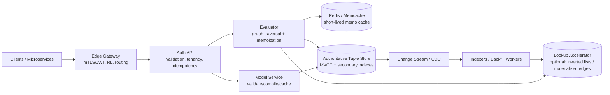
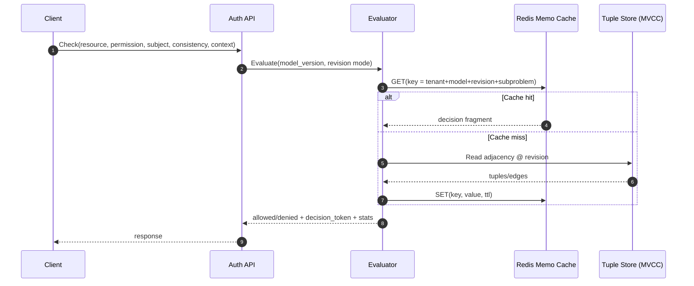
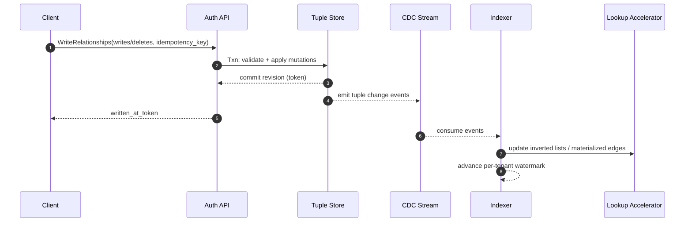

## Overview

A global relationship-based access control (ReBAC) service answers questions like “Can subject **S** perform permission **P** on resource **R**?” by evaluating a graph of relationships (tuples) under a tenant-defined authorization model. Zanzibar-style systems make this practical at scale by treating authorization as a **versioned data + query** problem:

- **Tuples** are the source of truth (who relates to what).
- **Models** define how permissions are derived from tuples (and other relations).
- **Consistency tokens** make freshness explicit and allow safe caching without privilege escalation.

This document designs a production-ready, multi-tenant authorization service that provides low-latency `Check`, explainability (`Expand`), and graph-powered “list” endpoints (`LookupResources`, `LookupSubjects`) with clear consistency semantics.

### Goals
- Low-latency, high-QPS `Check` suitable for synchronous request paths.
- Correctness guarantees that prevent stale caches from granting access.
- Multi-tenant isolation (data, performance, and security boundaries).
- Support model evolution with rollouts and fast rollback.
- Provide explainability and list endpoints without collapsing under worst-case graphs.

### Non-goals
- A full policy engine with arbitrary external calls (e.g., “call HR system” during evaluation).
- Fine-grained, per-decision audit logs for every call by default (supported optionally; expensive).
- Full-text search over resources (out of scope of authorization; integrate separately).

### Core Concepts

**Relationship tuple**
- Canonical form: `resource_type:resource_id#relation@subject_type:subject_id[#subject_relation]`
- Examples:
  - `document:123#viewer@user:alice`
  - `document:123#viewer@group:eng#member` (subject set)

**Authorization model**
- Defines resource types, relations, and permissions (computed usersets).
- Example intuition: `document.viewer` includes direct viewers + `document.parent->viewer` + `document.shared_with_group->member`.

**Consistency token**
- Encodes a per-tenant (or per-shard) **revision** representing an MVCC snapshot.
- Returned on reads/writes and accepted by subsequent reads to guarantee monotonicity:
  - “at least as fresh as token T” → no older snapshot than T.

**Caveats (conditional relationships)**
- Tuples may be guarded by a caveat evaluated using request-provided context (pure, deterministic expression).
- Example: “viewer if `request.time < expires_at`”.

---

## Requirements

### Functional Requirements
- Relationship tuple APIs:
  - Write (create/delete) tuples with idempotency and optional caveats.
  - Read tuples for debugging and backfills (scoped, paginated).
- Model APIs:
  - Create/validate/version models per tenant.
  - Activate a model version and support rollback.
- Authorization APIs:
  - `Check`: boolean decision + decision metadata + consistency token.
  - `Expand`: bounded explanation tree/DAG of why a permission holds/doesn’t.
  - `LookupResources`: list resources a subject can access for a permission.
  - `LookupSubjects`: list subjects that have a permission on a resource.
- Observability:
  - Trace IDs, decision metadata (tenant, model version, revision, evaluation stats).
  - Optional decision log stream (sampling and/or per-tenant enablement).

### Non-Functional Requirements (Concrete Targets)

**Scale (global)**
- `Check`: **50k QPS peak**, **5k QPS sustained** typical.
- Relationship writes: **5k QPS peak** (bursty; e.g., bulk sharing).
- Tuple cardinality: **10B total tuples** across all tenants.
- Principals: **up to 200M** total subjects (users/service accounts/groups).
- Tenants: **up to 100k** (hard isolation, per-tenant rate limits).  
  (If you truly have millions of tenants, you’ll need a stronger control-plane/data-plane split and aggressive per-tenant metadata caching.)

**Latency (same region)**
- `Check`: **P50 5–8ms**, **P99 30ms** (with warm caches and local reads).
- `WriteRelationships`: **P99 150–250ms** (transactional commit + token issuance).
- `Lookup*`: **P99 500ms–2s** depending on fanout and pagination (explicitly non-SLA for synchronous request paths).

**Availability**
- `Check`: **99.99%** monthly.
- Writes and `Lookup*`: **99.9%** monthly (degraded modes allowed).

**Consistency**
- Writes: externally consistent per tenant (or per shard) with monotonic revision issuance.
- Reads:
  - `FULLY_CONSISTENT`: read at the latest committed revision (may cost latency).
  - `AT_LEAST_AS_FRESH(token)`: read at a revision ≥ token’s revision (monotonic reads).
  - `BEST_EFFORT`: may read from replicas/caches with bounded staleness; must never **grant** based on unverifiable stale data.

**Durability & Recovery**
- RPO: **≤ 1 minute** for tuples/models.
- RTO: **≤ 30 minutes** for a regional incident (global service continues).

### Constraints & Assumptions
- Typical graph depth is small (median 2–4 edges), but worst-case exists; enforce strict evaluation limits.
- Tenants require strong isolation and compliance controls (SOC2-like), encryption at rest/in transit, and optional data residency (EU/US).
- Small platform team → prefer managed databases and proven patterns.

---

## Architecture

### High-Level Design



Key idea: `Check` is optimized for **fast point evaluation** using the authoritative store and safe memoization. `Lookup*` is optimized by **reverse indexes** (often in the tuple store itself via secondary indexes) and optionally an accelerator for high-fanout tenants or hot permissions.

### Read vs Write Paths
- **Write path**: Validate → transactional write to tuple store → commit revision → emit CDC → async index updates.
- **Check path**: Evaluate at a chosen revision (token) using store reads + per-request memoization + short-lived caches keyed by revision.
- **Lookup path**: Prefer reverse index / accelerator; if requested consistency isn’t satisfied, either wait (bounded) or fall back to online traversal with stricter limits.

---

## Components

### Edge Gateway
**Responsibilities**
- TLS termination, JWT/mTLS authentication, per-tenant rate limiting, request routing to nearest healthy region.
- Enforce request size limits and endpoint-specific quotas (`Expand`/`Lookup*` are expensive).

**Key decisions**
- Per-tenant rate limits at the edge (protects core store).
- Regional routing:
  - Reads → nearest region by default.
  - Writes → tenant “home” region (or a globally-consistent DB) to preserve clear revision semantics.

**Implementation**
- Envoy + External Authorization (ExtAuthz) or managed API gateway.
- Rate limit service keyed by `tenant_id` + endpoint.

---

### Auth API
**Responsibilities**
- Public API surface, input validation/canonicalization, tenancy isolation, idempotency, and consistency-mode handling.
- Attach decision metadata and propagate trace context.

**Key decisions**
- **Canonicalization** of tuples and object identifiers to prevent cache misses and ambiguity.
- **Idempotency** for writes via `(tenant_id, idempotency_key)` with stored outcome and token.
- **Explicit consistency modes** so callers choose latency vs freshness intentionally.

---

### Model Service
**Responsibilities**
- Validate, version, and activate authorization models per tenant.
- Compile DSL into a deterministic IR used by the evaluator.

**Key decisions**
- Compile and cache by `(tenant_id, model_id, model_version)` with long TTL.
- Strong validation on activation:
  - Type correctness, relation existence, caveat references.
  - Static cycle checks where possible.
  - Complexity limits (e.g., maximum dispatch fanout).
- Rollout controls: canary tenants, percentage rollout, instant rollback.

---

### Evaluator
**Responsibilities**
- Execute `Check` and `Expand` by traversing relationships and applying model rules at a chosen revision.

**Evaluation model (typical Zanzibar-style operators)**
- **Union**: `viewer = direct_viewer OR inherited_viewer`
- **Intersection**: `can_edit = editor AND not_suspended`
- **Tuple-to-userset**: `viewer from parent` (follow resource relation)
- **Userset-to-userset**: `group#member` (follow subject set)

**Key decisions**
- **Revision-scoped evaluation**: every store read is at the same snapshot to avoid “split-brain” decisions.
- **Safe memoization**:
  - Per-request memo table to avoid repeated subchecks.
  - Optional shared cache keyed by `(tenant, model_version, revision, subproblem)` so stale decisions cannot be reused across revisions.
- **Strict budgets** (example defaults; configurable per tenant):
  - Max depth: `10`
  - Max dispatches: `5,000`
  - Max visited nodes: `50,000`
  - Per-request deadline: `20–40ms` for `Check`, higher for `Expand`
- **Fail closed by default**: timeouts/errors return `UNAVAILABLE` (caller decides) rather than “allow”.

---

### Tuple Store (Authoritative)
**Responsibilities**
- Store tuples and models durably with MVCC.
- Provide snapshot reads at a revision and efficient adjacency queries.

**Key decisions**
- Use a database that supports:
  - Transactional writes
  - MVCC snapshot reads
  - A monotonically ordered commit timestamp/revision
  - Secondary indexes for:
    - Forward edges: `(tenant, resource_type, resource_id, relation, ...)`
    - Reverse edges: `(tenant, subject_type, subject_id, subject_relation, relation, resource_type, resource_id, ...)`

**Technology options**
- **Spanner** (managed, global, strong consistency, TrueTime-based external consistency)
- **CockroachDB** (strong consistency, geo-partitioning; careful tuning for tail latency)
- **YugabyteDB** (geo-distributed, tunable consistency; operational complexity varies)

---

### Lookup Accelerator (Optional)
**When needed**
- High-fanout tenants where `LookupResources` and `LookupSubjects` become too expensive even with secondary indexes.
- Use cases requiring predictable pagination performance.

**What to accelerate**
- Prefer accelerating **edge lookups** (inverted lists of tuples/adjacency), not “fully computed permissions for all resources” (often explodes combinatorially).
- Optionally materialize common paths (e.g., group membership closure) if tenants heavily nest groups.

**Consistency**
- Track per-tenant watermark (indexed revision). For `AT_LEAST_AS_FRESH`, only serve from the accelerator when watermark ≥ requested revision; otherwise fall back or wait briefly.

---

## Data Model

### Canonical Identifiers
- `tenant_id`: stable opaque string.
- Resource: `{type, id}`
- Subject: `{type, id, optional_relation}`

### Tables (Logical)

**Relationship Tuples (authoritative)**
- `relationship_tuples`
  - PK (example): `(tenant_id, resource_type, resource_id, relation, subject_type, subject_id, subject_relation)`
  - `caveat_name` (nullable)
  - `caveat_context` (JSON/BYTES, nullable)
  - `created_at` (TIMESTAMP)
  - `deleted_at` (TIMESTAMP, nullable) — optional tombstones for audit/backfills

**Reverse Index (if not using DB secondary indexes)**
- `relationship_tuples_by_subject`
  - PK (example): `(tenant_id, subject_type, subject_id, subject_relation, relation, resource_type, resource_id)`
  - Points to the canonical tuple row (or duplicates minimal fields)

**Authorization Models**
- `auth_models`
  - PK: `(tenant_id, model_id, version)`
  - `dsl` (TEXT/BYTES)
  - `compiled_ir` (BYTES)
  - `created_at` (TIMESTAMP)
  - `state` (`active`, `inactive`, `deprecated`)
- `auth_model_active`
  - PK: `(tenant_id, model_id)`
  - `active_version`

**Idempotency**
- `idempotency_keys`
  - PK: `(tenant_id, key)`
  - `request_hash`
  - `response_blob`
  - `written_at_revision`
  - TTL/retention (e.g., 24–72h)

### Consistency Token Format
Token encodes:
- `tenant_id`
- `revision` (commit timestamp / hybrid logical clock)
- `model_id`, `model_version` (optional but recommended to detect mismatches)
- Integrity protection: HMAC/signature to prevent forgery

---

## Data Flow

### `Check` (revision-scoped, cache-safe)



### `WriteRelationships` + indexing



---

## API Design

### Resource Naming
- Resources: `{type: string, id: string}`
- Subjects: `{type: string, id: string, optional relation: string}`

### Consistency Modes (Semantics)
- `FULLY_CONSISTENT`: evaluate at the latest committed revision (highest freshness, highest tail latency).
- `AT_LEAST_AS_FRESH(token)`: evaluate at a revision ≥ token revision (monotonic reads; enables session consistency).
- `BEST_EFFORT`: may use replica reads and/or cached fragments; must never return “allow” unless the underlying evidence is valid for the evaluated revision.

### gRPC Sketch (Syntactically Valid)

```proto
syntax = "proto3";

package authz.v1;

message ObjectRef { string type = 1; string id = 2; }
message SubjectRef { string type = 1; string id = 2; string relation = 3; }

message Consistency {
  oneof mode {
    bool fully_consistent = 1;
    string at_least_as_fresh_token = 2;
    bool best_effort = 3;
  }
}

message CheckRequest {
  string tenant_id = 1;
  string model_id = 2;
  ObjectRef resource = 3;
  string permission = 4;
  SubjectRef subject = 5;
  Consistency consistency = 6;
  bytes context = 7; // JSON or structured Any
}

message CheckResponse {
  bool allowed = 1;
  string decision_token = 2;
  int64 evaluated_model_version = 3;
  string trace_id = 4;
}

service AuthorizationService {
  rpc Check(CheckRequest) returns (CheckResponse);
}
```

### Endpoint Notes & Limits (Recommended Defaults)
- `WriteRelationships`
  - Max mutations per request: `1,000`
  - Idempotency required for clients that retry automatically.
  - Atomic: apply all writes/deletes or none.
- `Check`
  - Default deadline: `50ms` (caller-controlled; evaluator enforces internal budgets).
- `Expand`
  - Must return truncation markers when limits are hit (never unbounded).
- `LookupResources` / `LookupSubjects`
  - Paginated; default `page_size` 100–1,000 depending on tenant tier.
  - Explicitly document that results may be delayed under `AT_LEAST_AS_FRESH` if the accelerator watermark lags.

---

## Scaling & Performance

### Capacity Back-of-the-Envelope
At 50k QPS `Check`, if the median evaluation touches:
- 2–4 adjacency reads (due to memoization and bounded depth),
- then store read load is ~100k–200k reads/sec globally.

This is feasible with:
- Aggressive per-request memoization,
- Co-locating evaluators with storage replicas,
- Redis for short-lived shared memo fragments (revision-scoped),
- Strict limits for adversarial graphs.

### Key Bottlenecks and Mitigations
- **Read amplification (graph traversal)**: memoization, batching, parallel dispatch, adjacency-friendly schema.
- **High fanout groups**: subject sets + optional membership materialization for common paths; enforce max fanout per edge in `Expand`.
- **Hot tenants / hot resources**: hash-prefix keys, per-tenant quotas, cache partitioning, dedicated pools for top tenants.
- **Tail latency in global databases**: route `FULLY_CONSISTENT` to the tenant home region; use `AT_LEAST_AS_FRESH` with local replica reads when supported.

### Caching Strategy (Correctness-Safe)
- Per-request memoization: always on, unbounded only by evaluator budgets.
- Shared memo cache (Redis):
  - Key includes `(tenant_id, model_version, revision, subproblem_hash)`
  - TTL 5–30s
  - Safe because revision prevents stale “allow” reuse after writes.
- Negative caching:
  - TTL 1–5s (reduces repeated denies; minimizes “newly granted access appears late”).
- Model cache:
  - Cache compiled IR; invalidate on activation and on evaluator deploys.

### Multi-Region Strategy
- Prefer a design where revision issuance is unambiguous:
  - **Option A (simplest)**: globally-consistent DB (e.g., Spanner) with per-tenant placement; evaluators read locally when possible.
  - **Option B (tenant home region)**: single-writer per tenant; replicate read-only to other regions; tokens are per-tenant and map to that region’s revision space.
- Degraded modes:
  - Allow `BEST_EFFORT` checks from local caches if the store is impaired, but avoid “fail open” defaults.

---

## Trade-offs & Alternatives

### Key Trade-offs
1. **Consistency tokens over hidden staleness**
   - Pros: explicit semantics, safe caching, monotonic reads.
   - Cons: client complexity (store and forward tokens), harder debugging if ignored.
2. **Online `Check` evaluation vs precomputing permissions**
   - Pros: avoids combinatorial explosion; supports dynamic graphs and caveats.
   - Cons: requires tight evaluator budgets and efficient adjacency reads.
3. **Secondary indexes / inverted lists for `Lookup*`**
   - Pros: makes “list accessible resources” viable at scale.
   - Cons: operational complexity and eventual consistency if using an external accelerator.
4. **Strict limits on `Expand`**
   - Pros: prevents adversarial graphs from taking down the service.
   - Cons: explanations can be truncated; clients must handle partial proofs.

### Alternatives
- **RBAC-only**: simpler but insufficient for hierarchies, delegation, sharing, and cross-resource inheritance.
- **Inline ACLs per resource**: fast checks for a single object, but poor for lookups and group nesting; update fanout can be huge.
- **OPA/ABAC-only**: expressive, but expensive for joins and graph problems; explainability and low tail latency are harder.
- **Adopt an existing Zanzibar-inspired system**
  - SpiceDB / OpenFGA can reduce time-to-value and provide proven semantics; evaluate integration and operational constraints.

---

## Failure Modes & Mitigations

### Scenarios (At Least 3; Expanded)
1. **Tuple store tail latency spike / partial outage**
   - Impact: `Check` timeouts, rising P99; potential cascading retries.
   - Mitigation: circuit breakers, request hedging (careful), shed `Expand/Lookup*`, serve `BEST_EFFORT` from cache when explicitly allowed, protect store via strict rate limiting.
2. **Cache correctness bug granting access**
   - Impact: privilege escalation (highest severity).
   - Mitigation: revision-scoped cache keys, short TTLs, token integrity (HMAC), deny-on-ambiguity, canary sampling (recompute and compare), formal property tests on evaluator.
3. **Indexer/accelerator lag**
   - Impact: `Lookup*` misses newly granted access; inconsistent UX.
   - Mitigation: watermark checks; for `AT_LEAST_AS_FRESH`, fall back to online traversal (bounded) or wait up to a tenant-configured max (e.g., 1–2s) before returning a retriable error.
4. **Bad model rollout**
   - Impact: widespread incorrect allow/deny.
   - Mitigation: canary tenants, shadow evaluation against previous model, automated model tests, instant rollback by switching active version.
5. **Cycles / explosive traversal**
   - Impact: CPU spikes, timeouts, degraded availability.
   - Mitigation: cycle detection during evaluation, per-request budgets, static validation to block dangerous constructs, isolate expensive endpoints and tenants.

### Disaster Recovery
- Backups: continuous PITR + daily snapshots; regular restore drills with verification queries.
- Regional failover:
  - Reads fail over automatically.
  - Writes fail over with fencing to avoid split-brain (single-writer per tenant or strongly consistent multi-writer DB).
- Runbooks include:
  - “Store latency incident”
  - “Model rollback”
  - “Indexer backlog / watermark lag”
  - “Cache corruption / flush strategy”

---

## Operations

### SLOs (Recommended)
- `Check` availability: **99.99%**
- `Check` latency: **P99 ≤ 30ms** (same region), **P99 ≤ 80ms** (cross-region) for `BEST_EFFORT`/token-based reads
- Error budget policies: freeze risky rollouts on burn, prioritize stability over features

### Monitoring & Alerting
- Golden signals by endpoint: QPS, P50/P95/P99, error rate, saturation (CPU/mem), timeout rate.
- Evaluator-specific:
  - dispatch count distribution, max depth hit rate, budget-exceeded rate, per-operator timings.
- Store and cache:
  - store read/write latency, contention/transaction retries, replica lag (if applicable),
  - cache hit ratio, memory pressure, evictions.
- Lookup/indexing:
  - per-tenant watermark lag, stream backlog, reprocessing rate.

### Security & Compliance
- Tenant isolation:
  - Strong authn (mTLS/JWT), per-tenant authz for API callers, scoped credentials for internal services.
  - Encrypt at rest; use per-tenant encryption keys where required.
- Audit:
  - Administrative changes (model activation, bulk writes) always logged.
  - Optional decision logs with sampling and PII minimization.
- Data residency:
  - Place tenant data in-region and restrict cross-region reads where required; tokens must respect residency boundaries.

### Deployment Strategy
- Progressive delivery for evaluator and model changes:
  - canary → 10% → 50% → 100% (by tenant and region)
- Compatibility:
  - Version APIs; ensure model compilation is deterministic and backward-compatible.
- Rollback:
  - Instant model rollback by switching active version.
  - Evaluator rollback via traffic shifting.

---

## References & Further Reading
- Zanzibar paper (USENIX ATC 2019): https://www.usenix.org/conference/atc19/presentation/pang
- SpiceDB (Zanzibar-inspired, open source): https://github.com/authzed/spicedb
- OpenFGA (Zanzibar-inspired): https://openfga.dev/
- Open Policy Agent (ABAC/caveats inspiration): https://www.openpolicyagent.org/
- Spanner TrueTime / external consistency: https://cloud.google.com/spanner/docs/true-time-external-consistency