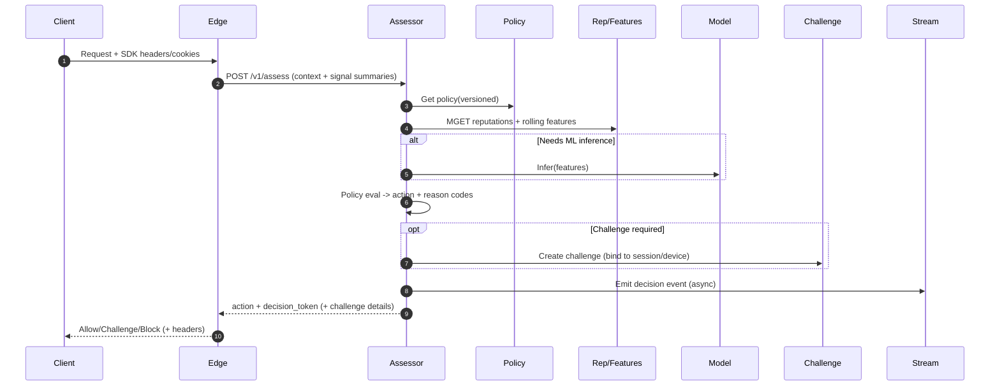

## Overview

Modern automated attacks rarely look like “obvious” bots: they rotate IPs via residential proxies, replay real browser fingerprints, mimic human pacing, and target high-value endpoints (login, signup, checkout, inventory, scraping). A production bot detection system must make high-confidence decisions under tight latency budgets while minimizing false positives that harm legitimate users and revenue.

The core idea is to treat bot defense as a **real-time risk assessment pipeline**:

1. **Collect signals** (edge + client + server) and normalize them.
2. **Resolve identities** (device/session/account/network) with confidence.
3. **Compute features** (real-time + precomputed rolling windows).
4. **Decide** via **reputation + rules + ML scoring**.
5. **Enforce graduated actions** (allow, allow+monitor, rate-limit, step-up challenge, block).
6. **Learn from outcomes** (fraud confirmation, ATO, chargebacks, challenge results, user complaints) to adapt to evolving attacker strategies.

This document describes a multi-tenant SaaS bot detection platform that can be embedded at a CDN/WAF edge and/or API gateway.

---

## Requirements

### Functional Requirements

- **Request-time assessment** for protected endpoints (e.g., `/login`, `/signup`, `/checkout`, `/api/*`) returning:
  - `ALLOW`, `ALLOW_MONITOR`, `RATE_LIMIT`, `CHALLENGE`, `BLOCK`
- **Device fingerprinting** (web JS + mobile SDK + server-side hints) producing a stable `device_id` and `fp_confidence`.
- **Behavioral analysis**: session velocity, navigation/request graph patterns, anomaly detection; optional high-signal inputs (typing/mouse/touch) where available and consented.
- **Reputation** for `ip`, `asn`, `cidr`, `device_id`, `account_id`, `session_id`, `token_id`, with decay and explainability.
- **Policy management**:
  - Rules per tenant/app, endpoint group, geo, client type, risk band.
  - Allowlists/blocklists and emergency “lockdown” toggles.
  - Shadow mode (score-only), canary enforcement, versioning and rollback.
- **Step-up challenges** (CAPTCHA, WebAuthn/passkeys, email/SMS OTP where appropriate), with verification and binding to session/device.
- **Investigation & analytics**:
  - Searchable decision logs, reason codes, and replay (deterministic given the same inputs and policy version).
  - Cohorts (by endpoint, ASN, country, device tag, model version).
- **Feedback ingestion** from downstream systems (fraud confirmed, ATO, chargeback, false-positive report, successful login, chargeback reversal) to close the loop.

### Non-Functional Requirements

#### Scale (Example Target)

- **Decisioning QPS**: 50k sustained; 200k burst (5–15 minutes during attack spikes).
- **Telemetry ingest**: up to 300k events/sec burst; 80k–150k events/sec average.
- **Event volume**: 5–10B events/day.
  - If average event payload is ~400–800 bytes uncompressed, that is ~2–8 TB/day uncompressed.
  - With 3–6× compression, ~0.5–2.5 TB/day stored (excluding replication).
- **Tenancy**: 1k–10k tenants; noisy-neighbor isolation required.

#### Latency (Critical Path = Request-Time Decision)

Target budgets assume the Assessor and its dependencies are **co-located in-region** with low tail latency and hard timeouts.

- **P50**: 10–20 ms end-to-end decision latency (from edge to Assessor response).
- **P95**: ≤ 40 ms.
- **P99**: ≤ 75 ms (excluding challenge render/solve).
- **Suggested internal budget (P99)**:
  - Edge → Assessor RTT: 10–20 ms (depends on PoP-to-region topology)
  - Assessor compute + policy eval: 5–10 ms
  - Reputation/feature fetch: 10–20 ms (cached/batched)
  - Optional model inference: 10–25 ms (including hop to model server)
  - Margin for retries/timeouts: 5–10 ms (prefer no retries on critical path)

#### Availability & Durability

- **Decisioning SLO**: 99.99% monthly availability (per region pair).
- **Telemetry ingest SLO**: 99.9% (best-effort; may shed load under attack).
- **Policy durability**: ≥ 99.999% (must not lose policy/history).
- **Decision log durability**: ≥ 99.99% (audit and debugging value).
- **Graceful degradation**:
  - Fail-open for low-risk endpoints (assets, browse) if configured.
  - Fail-closed or challenge-first for high-risk endpoints (login/checkout) if configured.

#### Consistency Model

- **Policy**: strongly consistent writes and versioned reads (seconds-level propagation acceptable).
- **Reputation/features**: eventual consistency; minutes-level acceptable for long-window aggregates.
- **Decision tokens**: time-bounded validity (short TTL) with key rotation; revocation primarily via short TTL + updated reputations/policies.

### Constraints & Assumptions

- Multi-tenant SaaS with isolated policy namespaces and per-tenant quotas.
- Privacy/compliance (GDPR/CCPA): minimize PII; configurable retention; no raw biometrics.
- Adversarial environment: attackers can execute JavaScript, use headless browsers, rotate IPs, and outsource challenge solving.
- Small platform team (5–10 engineers): prefer managed primitives where possible; operational simplicity matters.

### Threat Model (What We Defend Against)

- Credential stuffing, password spraying, and ATO attempts.
- Fake account creation, promo abuse, card testing.
- Inventory scalping, scraping, and API abuse.
- Distributed low-and-slow automation via residential proxy networks.
- Evasion attempts: fingerprint spoofing, replay, challenge farming, poisoning feedback loops.

---

## Architecture

The system is split into a **synchronous decision path** and an **asynchronous learning path**. The synchronous path must be low-latency and highly available; the asynchronous path handles aggregation, long-window features, analytics, and training data generation.

### High-Level Component Diagram

```mermaid
flowchart TB
  subgraph EdgeLayer[Edge Layer]
    C[Client + SDK] --> E[CDN/WAF / API Gateway]
    E -->|Assessment request| A[Risk Assessor]
    E -->|Enforce action| E2[Block / Rate Limit / Challenge / Allow]
  end

  subgraph Online[Online Decisioning (Low Latency)]
    A --> P[Policy Service]
    A --> RC[(Online Cache: Redis)]
    A --> RS[(Reputation + Feature KV)]
    A --> MS[Model Serving]
    A --> CH[Challenge Service]
    A --> KM[KMS / Key Service]
  end

  subgraph Async[Async Pipeline (Learning + Analytics)]
    A -->|Decision + signals| K[(Event Stream)]
    CH -->|Challenge outcome| K
    FB[Feedback API] --> K
    K --> SP[Stream Processing]
    SP --> RS
    SP --> OLAP[(Analytics Store)]
    SP --> OBJ[(Object Storage / Data Lake)]
    OBJ --> TR[Model Training]
    TR --> REG[Model Registry]
    REG --> MS
  end
```

### Request-Time Data Flow



---

## Components

### Client SDK (Web/Mobile)

**Responsibilities**
- Collect device and behavior signals in first-party context.
- Attach signal summaries to requests (headers/cookies) and send richer telemetry asynchronously.
- Maintain a stable per-install identifier where permitted (mobile) and a session identifier (web).

**Key design choices**
- Prefer **first-party hosting** for web SDK (CNAME to customer domain) to reduce adblock/cross-site constraints.
- Use **progressive collection**:
  - Synchronous: minimal fields needed for decisioning (fast, low overhead).
  - Asynchronous: richer behavioral and environmental signals (batched).
- **Tamper resistance**:
  - Signed/attested SDK payloads where feasible (mobile attestation).
  - Server-side validation of impossible combinations (e.g., UA vs platform hints).

**Privacy**
- Hash stable identifiers client-side where possible; rotate salts/peppers server-side.
- Provide tenant-configurable collection toggles and retention.

### Edge Enforcement (CDN/WAF + Gateway Plugin)

**Responsibilities**
- Fast pre-filtering: known-bad lists, volumetric rate limiting, protocol sanity checks.
- Normalize request metadata (canonical IP, headers, geo).
- Enforce Assessor actions (block, challenge, rate-limit) with minimal origin impact.

**Key design choices**
- **Cheap checks first**: stop obvious abuse before calling the Assessor.
- **Decision tokens** to avoid re-assessing every request in a short window:
  - Signed token validated at the edge.
  - Short TTL (e.g., 30–120 seconds) plus tenant-configurable scope (endpoint group / session).
- **Tenant isolation**: quotas and rate-limit keys include `tenant_id`.

### Risk Assessor (Decision Service)

**Responsibilities**
- Combine real-time signals + reputations + features + policy to produce `action`, `risk_score`, and `reason_codes`.
- Generate decision tokens and challenge bindings.
- Emit audit events asynchronously.

**Decision pipeline**
1. Validate schema, authenticate tenant, enforce quotas.
2. Normalize context (IP/UA parsing, geo, endpoint classification).
3. Fetch policy (versioned).
4. Fetch reputations/features (batched).
5. Apply **rules/reputation gating** (fast path).
6. If needed, call model inference (slow path).
7. Evaluate policy to decide action and TTL.
8. Emit event and return decision.

**Latency controls**
- Strict per-dependency timeouts; no retries on critical path.
- Circuit breakers around model serving and caches; fallback strategies described in Failure Modes.

### Policy Service

**Responsibilities**
- Store and serve tenant policies with versioning, validation, and rollout controls.
- Provide “compile-time” optimizations: endpoint grouping, precomputed rule DAGs, and safe defaults.

**Recommended implementation**
- Authoritative store: relational DB (e.g., Postgres) with migrations, audit history, and RBAC.
- Distribution: push via pub/sub (or polling with ETag) to Assessor caches.
- Consistency: reads are versioned; Assessor includes `policy_version` in decision logs.

### Reputation & Feature Stores

**Responsibilities**
- Low-latency lookups for identity reputations and rolling-window aggregates used in decisioning.
- Accept asynchronous updates from streaming jobs.

**Key design choices**
- Separate:
  - **Online KV** (predictable low latency, high QPS): reputations and hot rolling features.
  - **Analytics OLAP** (scan-heavy): investigations and cohort analysis.
- **Time-decayed scores** with confidence and evidence counters to prevent permanent poisoning.
- **Versioned features** to maintain online/offline parity during model rollouts.

**Technology options**
- Online cache: Redis Cluster (with replication) or Aerospike.
- Durable KV: ScyllaDB/Cassandra (wide-column) for reputations/identities.
- OLAP: ClickHouse/Druid/BigQuery depending on ops preference.

### Model Serving

**Responsibilities**
- Serve low-latency inference for “hard” traffic that passes gating.
- Support canary/shadow inference and fast rollback.

**Recommended patterns**
- Export models to a stable serving format (e.g., ONNX) and serve via a dedicated inference service.
- Per-request inference budget with fallback behavior.
- Include `model_version` in decisions for debugging.

### Challenge Service

**Responsibilities**
- Issue challenges and verify results.
- Bind successful completions to a session/device via a short-lived proof token.
- Emit outcomes to the stream for learning.

**Key design choices**
- Bind challenge to: `{tenant_id, session_id, device_id, risk_context_hash}` to limit replay.
- Prefer step-up options by risk and user segment:
  - CAPTCHA for medium risk
  - WebAuthn/passkey for high-value accounts
  - OTP as last resort (cost and SIM-swap risk)

### Streaming + Detection Pipeline

**Responsibilities**
- Ingest decisions, telemetry, and feedback.
- Compute rolling features (1m/5m/1h/24h), reputations, and cohorts.
- Produce training datasets and monitoring signals.

**Key design choices**
- Use **event-time windows** with watermarks for late arrivals.
- Apply per-tenant quotas and dead-letter queues for malformed events.
- Maintain a **feature registry** (schema + versioning) to avoid online/offline skew.

---

## Data Model

### Core Entities (Logical Schema)

#### 1) Device Identity (`device_identity`)

- `tenant_id` (partition key)
- `device_id` (primary key; ULID/UUID)
- `fp_hash` (salted hash of normalized fingerprint bundle)
- `fp_confidence` (0.0–1.0)
- `first_seen_at`, `last_seen_at`
- `attributes` (JSON: platform, os, browser, locale, tz, hardware hints)
- `risk_tags` (set: `headless_suspected`, `emulator_suspected`, `automation_framework_detected`)
- Retention/TTL: 90–180 days configurable

#### 2) Reputation (`reputation_entity`)

- `tenant_id` (partition key)
- `entity_type` (`ip|cidr|asn|device|account|session|token`)
- `entity_id` (clustering key; e.g., `ip:203.0.113.4`)
- `score` (float, e.g., -100..+100)
- `confidence` (0.0–1.0)
- `evidence_counts` (map: `reason_code -> count`)
- `last_evidence_at`, `updated_at`
- TTL: type-specific (IP shorter, device longer)

#### 3) Decision Log (`decision_log`) (OLAP)

- `tenant_id`
- `request_id`
- `ts`
- `endpoint_group`, `http_method`
- `ip`, `asn`, `country`
- `device_id`, `session_id`, `account_id` (nullable)
- `risk_score` (0–100), `action`
- `reason_codes` (array)
- `policy_version`, `model_version`
- `challenge_id` (nullable), `challenge_result` (nullable)
- `latency_ms`, `degraded_mode` (bool)
- Retention: 30–90 days typical (tenant-configurable)

#### 4) Feedback (`outcome_event`)

- `tenant_id`
- `event_id`
- `ts`
- `type` (`fraud_confirmed|ato|chargeback|user_report|false_positive|challenge_pass|challenge_fail`)
- `links` (request_id, device_id, account_id, ip)
- `source` (trust tier / system of record)
- `metadata` (JSON)
- Deduplication: `event_id`

#### 5) Policy (`policy_versioned`) (Authoritative DB)

- `tenant_id`
- `policy_id`
- `version`
- `state` (`draft|shadow|enforcing|rolled_back`)
- `compiled_blob` (validated/compiled rules)
- `created_by`, `created_at`
- `notes` (optional)

### Partitioning & Hot-Key Avoidance

- Include `tenant_id` in all partition keys.
- Avoid single hot entities (e.g., shared public resolver IPs) by:
  - Capping per-entity write amplification.
  - Using sketches (HLL/count-min) for some aggregates.
  - Separating “high-write” counters from “read-hot” reputations if needed.

---

## API

### Authentication & Security

- **Server-to-server**: mTLS or signed JWT with short TTL; per-tenant API keys are acceptable for bootstrap but rotate frequently.
- **At edge**: validate decision tokens using rotating public keys; key distribution via KMS-backed key service.
- **Data in transit**: TLS everywhere; strict timeouts.
- **Data at rest**: encryption; access audited; tenant isolation enforced at the application layer and storage layer.

### `POST /v1/assess`

Assess a single request.

**Request**
```json
{
  "tenant_id": "t_123",
  "request_id": "req_01JABCDEF1234567890",
  "timestamp": 1734400000,
  "endpoint": "/login",
  "http": { "method": "POST", "path": "/login" },
  "network": { "ip": "203.0.113.4", "user_agent": "Mozilla/5.0 ..." },
  "session": { "session_id": "s_01J...", "account_id": "u_123" },
  "signals": {
    "sdk_token": "sdk_...",
    "fp_hint": "h_...",
    "behavior_hint": "b_..."
  }
}
```

**Response**
```json
{
  "action": "CHALLENGE",
  "risk_score": 87,
  "decision_ttl_ms": 60000,
  "reason_codes": ["NET_IP_REP_BAD", "BEH_VELOCITY_HIGH"],
  "policy_version": 42,
  "model_version": "bot-v7.3.1",
  "decision_token": "eyJ...",
  "challenge": { "type": "CAPTCHA", "challenge_id": "ch_01J..." }
}
```

**Idempotency**
- Use `Idempotency-Key` header or `request_id`.
- Duplicate requests within `decision_ttl_ms` should return the same decision (unless policy version changes and the tenant opts into “re-evaluate on policy change”).

**Errors**
- `400`: invalid schema
- `401/403`: auth/tenant mismatch
- `429`: throttled (tenant quota or global protection)
- `503`: degraded mode (dependency failure or overload)

**Degraded-mode behavior**
- Tenant-configurable per endpoint group:
  - Low risk: fail-open + monitor
  - High risk: challenge-first or fail-closed
- Always emit a decision log with `degraded_mode=true` for auditability.

### `POST /v1/telemetry`

Async ingest of client-side signals.

- Accept batched events; returns `202 Accepted`.
- Validate and sample server-side; drop on overload with counters and per-tenant observability.

### `POST /v1/feedback`

Outcome ingestion for learning.

- Requires signed server-to-server auth.
- Deduplicate by `event_id`.
- Support late arrivals (days) and store `source` trust tier for weighting.

### `POST /v1/challenge/verify`

Verify challenge completion and issue a short-lived proof token bound to session/device.

**Response**
```json
{
  "result": "PASS",
  "proof_token": "pt_...",
  "ttl_ms": 3600000
}
```

---

## Scaling & Performance

### Capacity Planning (Back-of-the-Envelope)

- Peak decisioning: 200k QPS burst.
- If 60% of traffic is served from **edge decision-token cache**, Assessor peak is ~80k QPS.
- If ML inference is gated to ~5–15% of assessed requests, inference peak is ~4k–12k QPS.
- Online KV reads per assessment:
  - Batched MGET: 10–30 keys typical (ip, asn, device, session, account, rolling counters).
  - Design for >1M key reads/sec in bursts with predictable P99.

### Caching Strategy

- **Edge decision-token cache**: TTL 30–120s; scope by endpoint group and session; include “risk context hash” to reduce replay.
- **Assessor in-process cache**:
  - Very short TTL (1–5s) for reputations/features to smooth spikes.
  - Cache policy compiled blobs by `(tenant_id, policy_version)`.
- **Policy distribution**:
  - Prefer push (pub/sub) + ETag; fallback to polling.
  - Safe default policy if stale.

### Multi-Region

- Active-active Assessors across ≥2 regions per major geography.
- Read-local online KV; async replication for reputations/features (eventual consistency).
- Edge routes to nearest healthy region; maintain per-tenant overrides for regulatory routing.

### Tenant Isolation

- Per-tenant quotas at edge and Assessor.
- Separate Kafka partitions or namespaces for large tenants.
- Optional dedicated clusters for “elephant” tenants.

---

## Trade-offs & Alternatives

### Key Trade-offs

- **Two-stage gating (rules/reputation then ML)**  
  Sacrifice: some nuanced detection for low-risk traffic  
  Why: protects P99 latency and cost under volumetric attacks; keeps model from becoming a choke point.

- **Decision tokens validated at edge**  
  Sacrifice: immediate token revocation  
  Why: large QPS reduction; revocation achieved via short TTL + updated reputations/policies.

- **Split online KV vs OLAP analytics**  
  Sacrifice: single-store simplicity  
  Why: online path needs predictable latency; investigations need scan-heavy queries and flexible indexing.

- **Privacy minimization vs detection strength**  
  Sacrifice: fewer stable identifiers and less cross-session linkage  
  Why: reduces compliance risk and user harm; compensate with short-window behavioral features and server-side signals.

- **Fail-open vs fail-closed**  
  Sacrifice: either security (fail-open) or UX/conversion (fail-closed) during outages  
  Why: must be tenant- and endpoint-specific; provide explicit, reviewed defaults.

### Alternative Approaches

- **Edge-only bot detection (WAF rules + fingerprints)**: simpler, but weaker behavioral context, limited learning loops, and harder tenant-specific tuning.
- **ML on every request**: potentially higher accuracy but expensive and fragile at peak; tail latency and model dependency dominate reliability.
- **Centralized identity graph database**: powerful relationships and investigations, but high operational complexity and often unnecessary for request-time decisions.

---

## Failure Modes & Mitigations

### 1) Model Serving Outage or High Latency
- Impact: reduced accuracy, P99 blowups if not controlled
- Detection: inference error rate, model P99, breaker open metrics
- Mitigation: strict timeouts; fallback to rules/reputation; challenge-first for high-risk endpoints; autoscale warm pools; canary rollback.

### 2) Online Cache/KV Degradation (Redis/Aerospike)
- Impact: slower decisions, more load on durable stores
- Detection: hit-rate drop, KV P99 increase, connection saturation
- Mitigation: in-process cache; feature subsets; hard timeouts; load shed telemetry first; degrade policies temporarily.

### 3) Policy Propagation Bug or Bad Rollout
- Impact: widespread false positives/negatives
- Detection: action-rate drift, challenge pass-rate shift, conversion/login success anomalies
- Mitigation: versioned policies; canary by tenant/endpoint; instant rollback; “shadow mode” for changes; automated diff checks.

### 4) Stream Processing Lag/Backlog
- Impact: stale reputations/features, slower adaptation
- Detection: consumer lag, watermark delay, freshness SLI
- Mitigation: prioritize high-risk feature jobs; scale consumers; drop low-value telemetry; degrade to shorter-window features; backpressure.

### 5) Reputation Poisoning via Untrusted Feedback
- Impact: false positives/negatives
- Detection: drift in complaint rate, source anomalies, sudden score shifts
- Mitigation: trust-tier weighting; corroboration requirements; caps per source; faster decay for low-confidence evidence; human review workflows for high-impact rules.

### 6) Key Rotation / Token Validation Mismatch
- Impact: valid tokens rejected (UX impact) or invalid tokens accepted (security impact)
- Detection: token validation failure spikes by key id; edge error logs
- Mitigation: overlap keys during rotation; publish keys with explicit activation times; emergency revert; short TTLs.

### Disaster Recovery

- **RTO/RPO** (example):
  - Decision service: RTO 30 minutes (regional failover), RPO 0 (stateless)
  - Policy: RPO 0 (transactional)
  - Reputations/features: RPO ≤ 5 minutes (async replication)
- **Backups**:
  - Policy DB point-in-time recovery + audit log retention.
  - KV snapshots where applicable; OLAP partition backups daily.
- **Emergency mode**:
  - “Edge-only mode” using last-known blocklists + conservative rate limits.
  - Tenant-configurable lockdown policies.

---

## Operations

### Observability (SLIs/SLOs)

Track by tenant, endpoint group, and region.

- **Latency**: P50/P95/P99 for `/v1/assess`, plus dependency breakdown.
- **Correctness proxies**:
  - Challenge pass rate
  - Login success/conversion deltas
  - False-positive reports and support tickets
- **Reliability**:
  - `5xx` rate, timeouts, breaker-open rate
  - KV hit rate and P99
  - Stream lag and feature freshness
- **Security effectiveness**:
  - Blocks/challenges on known attack campaigns
  - ATO/fraud rate reduction vs baseline (where measurable)

### Deployment & Rollouts

- Canary by tenant and endpoint group; support shadow evaluation and “observe-only” mode.
- Log `policy_version` and `model_version` in every decision for fast rollback and incident analysis.
- Feature schema/versioning to prevent online/offline skew.

### Data Retention & Compliance

- Tenant-configurable retention (e.g., decisions 30–90 days, device identities 90–180 days).
- Store fingerprints as salted hashes; avoid raw keystrokes and sensitive payloads.
- Support DSAR deletion workflows keyed by tenant-scoped user identifiers.

### Cost Controls

- Gate ML inference; prefer smaller models and quantization where acceptable.
- Sampling for low-risk telemetry; batch writes; tiered storage for OLAP and lake.
- Per-tenant quotas and burst pricing to discourage abuse of the platform itself.

---

## References & Further Reading

- OWASP Automated Threat Handbook: https://owasp.org/www-project-automated-threats/
- Cloudflare Bot Management (industry patterns): https://www.cloudflare.com/products/bot-management/
- Google reCAPTCHA (trade-offs and deployment): https://developers.google.com/recaptcha
- Zinkevich’s “Rules of ML” (serving and monitoring): https://martin.zinkevich.org/rules_of_ml/
- Resilience patterns (timeouts, bulkheads, circuit breakers): https://netflixtechblog.com/