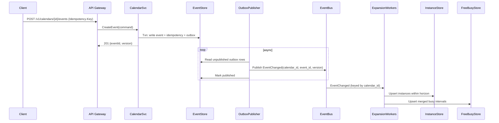
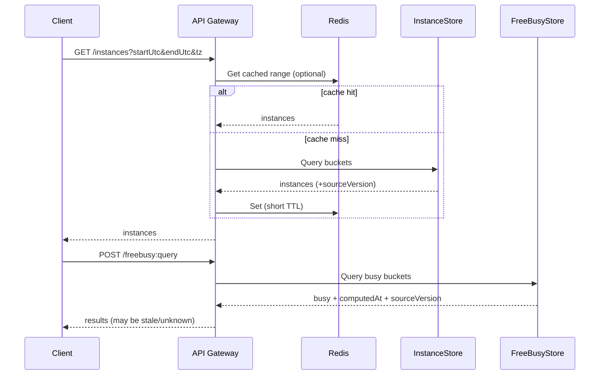

## Overview

A calendar system looks simple (“create an event”), but becomes hard at production scale because **time is not a stable coordinate system**: time zones change, DST creates gaps/overlaps, and recurrence rules define effectively infinite schedules that must remain editable retroactively (“edit only this instance”, “this and following”). Add free/busy and conflict detection across many calendars and you need to balance correctness, latency, and cost under constant mutation.

The core design principle is to separate:
- **Authoritative intent**: small, strongly consistent event definitions (including recurrence, exceptions, attendee state, permissions)
- **Derived views**: expanded instances, merged busy intervals, and reminder schedules optimized for read latency and fan-out

Authoritative data must be correct and auditable; derived data must be fast and rebuildable. This separation is what makes recurrence + time zone semantics manageable and keeps tail latency predictable.

---

## Requirements

### Functional Requirements
- Create, update, and delete one-time and recurring events (RFC 5545 RRULE/RDATE/EXDATE; “only this instance”, “this and following”, “all”).
- Support all-day and timed events; handle time zone rules (IANA TZ IDs), DST gaps/overlaps, and historical offset changes.
- List event instances for a calendar over a time range in a requested display time zone.
- Provide free/busy for up to N calendars (e.g., 50) over a bounded range (e.g., 4 weeks).
- Detect conflicts for organizer calendars and bookable resources/rooms; attendee conflicts are warn-by-default (configurable).
- Invite attendees, track RSVP state, and support organizer/attendee permissions and delegated access.
- Deliver notifications and webhooks (invite, update, cancel, reminders) with retry + deduplication.
- Provide audit logging and GDPR deletion semantics.

### Non-Functional Requirements
- **Scale**
  - Users: 50M MAU, 10M DAU
  - Authoritative objects: ~1B event definitions (multi-year retention, shared calendars)
  - Traffic (global peaks): ~50K QPS reads (instances + free/busy), ~10K QPS writes (create/update/RSVP) with strong local-time diurnal peaks (e.g., Monday 9am)
  - Derived horizon: materialize 2–8 weeks for “active” calendars; far-future expanded on-demand and cached
- **Latency**
  - List instances (range ≤ 4 weeks): P50 30–60ms, P99 200ms (cache + read-optimized store)
  - Free/busy (≤ 50 calendars, ≤ 4 weeks): P50 80–120ms, P99 400ms
  - Create/update event (single calendar, conflict check enabled): P50 80–150ms, P99 500ms
- **Availability**
  - Reads: 99.99% (multi-AZ, regional failover for read paths)
  - Writes: 99.9% (strong per-calendar writes; graceful degradation allowed for derived views)
- **Consistency**
  - Strong per-calendar for event definitions, ACLs, and idempotency records
  - Eventual for expansions, free/busy materialization, and notifications (bounded staleness with explicit “computedAt/sourceVersion”)
- **Durability**
  - Authoritative store: no loss of committed event definitions (RPO ~0 within a region; async cross-region replication)
  - Derived stores: rebuildable; tolerate up to 15 minutes lag under incidents

### Constraints & Assumptions
- All time zones are IANA TZ IDs (e.g., `America/Los_Angeles`); offsets are derived at expansion time.
- Recurrence rules follow RFC 5545 with server-side validation and safety limits (e.g., max expansion density).
- “Correctness” for conflict detection is enforced within the **materialization horizon** (e.g., next 8 weeks); beyond that the system returns warnings/unknown unless explicitly requested.
- Team can operate Kafka/Pulsar, Redis, and a workflow runner (Temporal/Cadence).
- Compliance: encrypted at rest, audit log required, GDPR delete supported (tombstone + key revocation + derived rebuild).

---

## Architecture

### High-Level Architecture

```mermaid
flowchart TB
  %% Layers
  subgraph CL["Client Layer"]
    Web[Web]
    Mobile[Mobile]
    CalDAV[CalDAV/Partners]
  end

  subgraph EL["Edge Layer"]
    CDN[CDN/Edge Cache]
    GW[API Gateway]
  end

  subgraph SL["Service Layer"]
    Auth[Auth & ACL]
    CalSvc[Calendar Service<br/>(authoritative writes)]
    Sched[Scheduling Service<br/>(invites/RSVP fan-out)]
    Notif[Notification/Webhook Service]
    OutboxPub[Outbox Publisher]
    Expand[Expansion Workers]
  end

  subgraph DL["Data Layer"]
    EventStore[(Event Store<br/>strong per-calendar)]
    ACLDB[(ACL Store)]
    Bus[(Event Bus)]
    InstStore[(Instance Store<br/>derived)]
    BusyStore[(Free/Busy Store<br/>derived)]
    Cache[(Redis Cache)]
    Audit[(Audit Log)]
    Idem[(Idempotency Store)]
  end

  Web --> CDN --> GW
  Mobile --> CDN
  CalDAV --> GW

  GW --> Auth
  GW --> Cache
  GW --> CalSvc
  GW --> Sched

  Auth --> ACLDB
  CalSvc --> EventStore
  CalSvc --> Audit
  CalSvc --> Idem
  CalSvc --> Cache

  CalSvc --> OutboxPub
  OutboxPub --> EventStore
  OutboxPub --> Bus

  Bus --> Expand
  Expand --> InstStore
  Expand --> BusyStore

  Bus --> Notif
  Notif --> Bus
  Sched --> Bus

  GW --> InstStore
  GW --> BusyStore
```

**Why this works**
- The Calendar Service commits the only source of truth (intent) with strong per-calendar ordering and concurrency control.
- Derived stores (instances/free-busy) are updated asynchronously via an event bus and can be rebuilt; they serve latency-sensitive read paths and high fan-out queries.
- Scheduling (invites/RSVP) is handled as a saga: organizer writes are strongly consistent; attendee side effects are delivered asynchronously with idempotency and retries.

---

## Component Deep-Dive

### API Gateway (Edge + Gateway)

**Responsibility**: Request routing, token validation, rate limiting, request shaping (batch), and cache-control for edge friendliness.

**Key Design Decisions**:
- Prefer batch APIs (e.g., free/busy) to avoid N+1 patterns.
- Use `stale-while-revalidate` for read endpoints where bounded staleness is acceptable (instances/free-busy), improving tail latency during bursts.
- Enforce request budgets (max calendars, max range, max payload size) to protect expansion and derived stores.

**Technology Choice**: CDN + Envoy/NGINX + managed gateway features (WAF, quotas).

**Scaling Strategy**: Stateless; global edge POPs; per-tenant/user/app-key quotas; circuit breakers to shed load on derived services.

### Auth & ACL Service

**Responsibility**: Validate identity, compute permissions (owner/editor/reader), delegated access, and share links.

**Key Design Decisions**:
- Treat ACL changes as first-class events so derived caches can be invalidated quickly.
- Cache authorization decisions with short TTL (e.g., 30–60s) keyed by `(principal, calendar_id, permission)` plus an ACL version.

**Technology Choice**: Postgres for relational constraints or Spanner for global serving; OAuth2/JWT for authN; Zanzibar-style relation model if requirements grow.

**Scaling Strategy**: Read-heavy caching; shard by tenant; precompute membership sets for large shared calendars.

### Calendar Service (Authoritative)

**Responsibility**: CRUD event intent, recurrence rules, exceptions/overrides, and organizer-owned state transitions.

**Key Design Decisions**:
- **Store local time intent**, not just UTC. For recurring events, the “meaning” is typically “9am local every Monday”, so we persist:
  - `dtstart_local` + `tzid` + an explicit disambiguation policy for DST overlaps
  - derived `dtstart_utc` for indexing and conflict checks within the horizon
- Use optimistic concurrency (`version`) and idempotency keys to make retries safe.
- Publish changes via a transactional outbox to guarantee “committed write ⇒ eventually published event”.

**Technology Choice**: Spanner/CockroachDB (transactions + changefeeds) or DynamoDB with conditional writes + an outbox table; gRPC internal, REST externally.

**Scaling Strategy**: Partition by `(tenant_id, calendar_id)` so each write is single-shard; keep event + overrides in the same partition to support atomic updates.

### Scheduling Service (Invites & RSVP Saga)

**Responsibility**: Deliver invitations, handle RSVP updates, and manage cross-calendar side effects without global transactions.

**Key Design Decisions**:
- Represent attendee visibility as a **projection** (“inbox item / meeting request”) rather than a strongly-coupled copy of the organizer event.
- Use idempotent commands keyed by `(organizer_event_id, organizer_version, attendee_id, action)`; tolerate at-least-once delivery.
- Resource calendars are modeled as special principals with auto-accept rules and stronger conflict enforcement.

**Technology Choice**: Consumers on the event bus + a small state store for scheduling messages; optionally Temporal for reliable multi-step flows.

**Scaling Strategy**: Partition by organizer calendar for ordering; parallelize by attendee fan-out; apply rate limits for large distribution lists.

### Expansion Workers (Recurrence + Materialization)

**Responsibility**: Expand recurrence to instances within a bounded horizon, compute merged busy intervals, and schedule reminders.

**Key Design Decisions**:
- Maintain a rolling window per active calendar (e.g., `now - 1 day` to `now + 8 weeks`).
- Process events **keyed by calendar** to avoid races (e.g., update followed by delete).
- Version the TZ database and the expansion engine; re-expand when TZDB or parsing rules change.

**Technology Choice**: Kafka/Pulsar + autoscaled consumers; Temporal/Cadence for backfills and long-running rebuilds; DLQ for poisoned events.

**Scaling Strategy**: Bus partitions keyed by `calendar_id`; autoscale by consumer lag; prioritize “recently accessed calendars” to keep UX fresh.

### Free/Busy Service (Read-Optimized)

**Responsibility**: Serve availability queries with predictable latency.

**Key Design Decisions**:
- Store pre-merged busy intervals per `(calendar_id, day)` in UTC for fast range union.
- Include `computedAt` and `sourceVersion` so callers can detect staleness and choose to retry, accept stale, or fall back to on-demand checks.

**Technology Choice**: DynamoDB/Cassandra/Scylla for wide rows by day; Redis for hot ranges; optional compression (delta encoding).

**Scaling Strategy**: Partition by `(calendar_id, bucket_day_utc)`; cache common windows (work week); use request coalescing to avoid thundering herds on cache miss.

---

## Data Model

### Authoritative Schema (Event Store)

The authoritative model must preserve “what the user meant” (local time + TZ + recurrence intent) and support atomic edits.

- `calendars`
  - `calendar_id (PK)`, `tenant_id`, `owner_principal_id`
  - `default_tzid`
  - `created_at`, `updated_at`

- `events`
  - `event_id (PK)`, `calendar_id (FK)`, `uid` (external stable UID)
  - `title`, `description`, `location`, `status` (confirmed/canceled/tentative)
  - `organizer_principal_id`
  - `is_all_day` (bool)
  - Timed event fields:
    - `dtstart_local` (e.g., `2026-03-08T09:00:00`)
    - `tzid` (IANA)
    - `dst_disambiguation` (`EARLIER|LATER|REJECT`) for overlaps
    - `duration_ms`
  - All-day fields:
    - `start_date_local` (inclusive)
    - `end_date_local` (exclusive)
  - Recurrence:
    - `rrule` (nullable RFC 5545 string)
    - `rdate_local[]` (nullable)
    - `exdate_local[]` (nullable)
  - `version` (monotonic), `created_at`, `updated_at`

- `event_overrides` (instance-level edits)
  - `event_id (PK part)`
  - `recurrence_key` (PK part; stable instance identifier, see below)
  - `override_payload` (patch: dtstart_local/tzid/duration/title/etc.)
  - `tombstone` (bool)
  - `version`

- `attendees`
  - `event_id (PK part)`, `attendee_principal_id (PK part)`
  - `role` (required/optional/resource)
  - `response` (needsAction/accepted/declined/tentative)
  - `updated_at`

- `idempotency_keys`
  - `calendar_id (PK part)`, `idempotency_key (PK part)`
  - `result_event_id`, `result_version`, `expires_at`

- `outbox`
  - `outbox_id (PK)`, `calendar_id`, `event_id`, `event_version`
  - `type` (event.changed/acl.changed/attendee.changed)
  - `payload`, `created_at`, `published_at`

- `audit_log` (append-only)
  - `audit_id (PK)`, `tenant_id`, `principal_id`, `action`, `target`, `metadata`, `created_at`

**Recurrence key**
- For most instances, a UTC timestamp is enough.
- For DST overlaps (same local time occurs twice), you need a stable identifier. A practical approach is:
  - `recurrence_key = (event_id, local_datetime, tzid, resolved_utc_offset_seconds)`
  - The resolved offset is determined by `dst_disambiguation` at expansion time and persisted per generated instance within the horizon.

### Derived Schemas

**Instance Store (bounded horizon)**
- `instances_by_calendar`
  - `calendar_id (PK part)`
  - `bucket_start_day_utc (PK part)` (UTC day)
  - `instance_start_utc (CK)`
  - `instance_end_utc`
  - `event_id`
  - `recurrence_key`
  - `title_snapshot` (optional, for fast list views)
  - `source_version` (authoritative version used)

**Free/Busy Store**
- `busy_by_calendar_day`
  - `calendar_id (PK part)`
  - `bucket_day_utc (PK part)`
  - `busy_intervals` (encoded `[start,end)` UTC list)
  - `computed_at`
  - `source_version`

---

## Data Flow

### Write Path (Create/Update)



### Conflict Detection (Write-Time)

Conflict detection needs to be correct under concurrency, especially for resources/rooms. The design uses a tiered approach:

1. **Normalize** the requested event into a set of UTC intervals to check (single interval for one-time events; multiple for recurring events within the horizon).
2. **Fast path (derived index)**: query `busy_by_calendar_day` for the organizer calendar and any resource calendars for the affected days; if the returned `sourceVersion` is “fresh enough” (or within an allowed bounded-staleness window), check overlaps against the requested intervals.
3. **Safe fallback (authoritative on-demand)**: if busy data is missing/stale, expand authoritative definitions on-demand for just the affected calendars and just the affected range, then check overlaps.
4. **Resource correctness**: for bookable rooms, optionally perform a **synchronous reservation write** on the resource calendar shard (a short-lived “hold” row keyed by `(resource_calendar_id, start_utc, end_utc)` with TTL). This makes concurrent bookings serialize on the resource’s partition without requiring global transactions. If the organizer write later fails, the hold is released (or expires).

This keeps the common case fast while ensuring the system never returns “no conflict” based on unknown/stale data.

### Read Path (Instances + Free/Busy)



---

## API Design

### Create Event

`POST /v1/calendars/{calendar_id}/events`  
Headers: `Idempotency-Key: <uuid>`

Request:
```json
{
  "title": "Team Sync",
  "isAllDay": false,
  "tzid": "America/Los_Angeles",
  "dtstartLocal": "2026-03-08T09:00:00",
  "dstDisambiguation": "REJECT",
  "durationMinutes": 30,
  "rrule": "FREQ=WEEKLY;BYDAY=MO",
  "exdatesLocal": ["2026-04-06T09:00:00"],
  "attendees": [
    { "principalId": "u123", "role": "required" },
    { "principalId": "room_9a", "role": "resource" }
  ],
  "conflictPolicy": {
    "organizer": "ENFORCE",
    "resources": "ENFORCE",
    "attendees": "WARN"
  }
}
```

Response `201`:
```json
{ "eventId": "e_abc", "version": 1 }
```

Error handling:
- `400` invalid RRULE, invalid TZID, or invalid local time (DST gap) with structured details
- `403` insufficient permissions
- `409` conflict detected (organizer/resource) or optimistic concurrency conflict (on update)
- `429` request budget exceeded (range too large, too many attendees/calendars)

Idempotency:
- Store `(calendar_id, idempotency_key) -> {event_id, version}` for ~24h (or per tenant policy).

### Update Event (Optimistic Concurrency + Recurrence Edit Modes)

`PATCH /v1/calendars/{calendar_id}/events/{event_id}?mode=THIS|THIS_AND_FOLLOWING|ALL`  
Headers: `If-Match: "v{version}"`

Request:
```json
{ "dtstartLocal": "2026-03-08T10:00:00", "durationMinutes": 45 }
```

Response `200`:
```json
{ "eventId": "e_abc", "version": 2 }
```

### List Instances (Range View)

`GET /v1/calendars/{calendar_id}/instances?startUtc=...&endUtc=...&tzid=America/New_York`

Response `200`:
```json
{
  "items": [
    {
      "eventId": "e_abc",
      "recurrenceKey": "rk_...",
      "startUtc": "2026-03-09T13:00:00Z",
      "endUtc": "2026-03-09T13:30:00Z",
      "title": "Team Sync"
    }
  ],
  "sourceVersion": 42
}
```

### Free/Busy Query (Batch)

`POST /v1/freebusy:query`

Request:
```json
{
  "calendarIds": ["c1", "c2", "c3"],
  "startUtc": "2026-03-01T00:00:00Z",
  "endUtc": "2026-03-29T00:00:00Z"
}
```

Response `200`:
```json
{
  "results": [
    {
      "calendarId": "c1",
      "busy": [["2026-03-03T17:00:00Z", "2026-03-03T18:00:00Z"]],
      "computedAt": "2026-03-01T00:00:05Z",
      "sourceVersion": 42,
      "stale": false
    }
  ]
}
```

---

## Scaling & Performance

### Capacity Planning (Order of Magnitude)

- Authoritative storage: 1B events × ~1–2KB average payload (metadata, recurrence, attendees pointers) ⇒ 1–2TB raw plus indexes/replication.
- Derived instance storage (example): 3M “active” calendars × ~300 instances (8-week horizon × ~5/day average) ⇒ ~900M instance rows; wide-column storage is feasible with TTL + compaction.
- Free/busy: per calendar per day store ~5–30 merged intervals; strongly compressible (delta encoding).

### Bottlenecks & Mitigations

- **Recurrence expansion explosions** (e.g., minutely rules): enforce server-side limits:
  - max occurrences per day/week within the horizon
  - max total instances per expansion job
  - reject or force “on-demand only” for pathological rules
- **Free/busy fan-out** (many calendars): batch endpoints, parallel bucket reads, and caching merged “work week” windows.
- **Hot shared calendars** (company holidays): separate caching policy and optionally a dedicated read model (e.g., CDN-cached immutable ranges).
- **Thundering herds** on derived rebuild: request coalescing in Redis, worker backpressure, and priority queues.

### Horizontal Scaling

- **Event Store**: shard/partition by `(tenant_id, calendar_id)`; keep event + overrides + idempotency in one shard to preserve atomicity.
- **Event Bus**: partition by `calendar_id` to ensure ordered expansion; use DLQ for malformed events.
- **Derived stores**: partition by `(calendar_id, bucket_day_utc)`; TTL rows outside the horizon; compaction tuned for time-series access patterns.
- **Workers**: autoscale by consumer lag and CPU; separate pools for “foreground freshness” (recently accessed calendars) vs “background backfills”.

### Caching Strategy

- **Edge**: cache safe GETs with short TTL (5–30s) plus `stale-while-revalidate` for instances/free-busy.
- **Redis**:
  - ACL decisions (TTL 30–60s, keyed by ACL version)
  - Instances ranges (TTL 10–30s; include `sourceVersion` in cache key)
  - Free/busy common windows (TTL 30–120s)
- **Invalidation**: versioned keys (`calendar_id:sourceVersion:range`) to avoid delete storms; derived stores include `sourceVersion` to detect staleness.

---

## Trade-offs & Alternatives

### Key Trade-offs Made

- **Authoritative intent + derived views**
  - **Benefit**: fast reads and scalable fan-out
  - **Cost**: free/busy and instances can be stale; requires staleness signaling and backfill tooling
- **Bounded materialization horizon**
  - **Benefit**: bounded CPU/storage; predictable costs
  - **Cost**: far-future listing/conflict checks require on-demand expansion; semantics must be explicit to clients
- **Strong per-calendar consistency (not global)**
  - **Benefit**: scalable writes without global transactions
  - **Cost**: organizer + attendee calendars are eventually consistent; requires saga + idempotency + user-visible states (“pending invite delivery”)
- **Store local intent explicitly**
  - **Benefit**: correct recurrence semantics across DST and TZDB changes
  - **Cost**: expansion and conflict logic are more complex; instance identifiers must handle overlaps

### Alternative Approaches

- **Fully on-demand expansion** (no instance store): simpler storage, but unpredictable latency and high CPU on range reads and free/busy.
- **Full materialization** (expand everything indefinitely): fast reads, but infeasible cost for long-running rules and edits (“this and following” backfills).
- **Global transaction per meeting**: simpler “all calendars update atomically”, but operationally expensive and often unnecessary for UX; still needs retries and offline clients.

---

## Failure Modes & Mitigations

### Failure Scenarios

- **TZDB update changes historical offsets**
  - **Impact**: expanded instance times shift for some locales
  - **Detection**: canary diff of expansions for sampled calendars; spike in “instance changed” metrics
  - **Mitigation**: version TZDB in expansion; re-expand within horizon; store local intent; provide UI warnings for affected events when needed

- **Worker lag/backlog**
  - **Impact**: stale free/busy; delayed reminders; instance lists may be behind
  - **Detection**: consumer lag, `computedAt age` SLO violations, backlog growth rate
  - **Mitigation**: prioritize active calendars; autoscale; fallback for write-time conflict checks to on-demand expansion of just the affected range; degrade to “unknown” rather than incorrect “free”

- **Hot partition (large shared calendar or abusive client)**
  - **Impact**: elevated latency and throttling; cache churn
  - **Detection**: per-partition QPS/latency heatmaps; WAF signals; cache miss spikes
  - **Mitigation**: stricter quotas; dedicated caching policy for public calendars; request coalescing; optionally split derived read models for public vs private calendars

- **Duplicate notifications / webhook retries**
  - **Impact**: user trust erosion; downstream partner confusion
  - **Detection**: dedupe-hit ratio; webhook receiver complaints
  - **Mitigation**: idempotency key `(event_id, version, recipient, type)`; at-least-once delivery with dedupe; include monotonic `version` so receivers can ignore older updates

- **Partial regional outage**
  - **Impact**: writes may fail; reads should continue (possibly stale)
  - **Detection**: regional health checks, error budget burn, replication lag
  - **Mitigation**: regionalized ownership for calendars (home region); cross-region read failover for derived stores; controlled failover for writes with clear client errors during unsafe windows

### Disaster Recovery

- **Targets**: RTO 30 minutes; authoritative RPO 0–5 minutes (depending on replication); derived stores rebuildable.
- **Backups**: continuous PITR for event store; immutable offsite snapshots; tested restore drills.
- **Failover**: promote replica, re-point gateway routing; restart outbox publisher and workers from committed offsets; rebuild derived horizon for the most active calendars first.

---

## Operations

### Monitoring & Alerting

- **SLOs**
  - Reads: 99.99% success, latency P99 within target
  - Writes: 99.9% success, bounded conflict-check latency
  - Freshness: `computedAt age` (free/busy and instances) within budget for top active calendars
- **Key metrics**
  - API: P50/P99 latency, error rates, rate-limit drops, payload/range rejection counts
  - Event store: txn latency, conditional-write conflicts, replication lag, outbox backlog
  - Bus/workers: consumer lag, DLQ rate, expansion duration and output size distribution
  - Derived: bucket read latency, cache hit rate, stale-response rate
- **Alerts**
  - SLO burn alerts (multi-window)
  - Worker lag sustained > threshold (e.g., 2–5 minutes)
  - Sudden rise in RRULE validation errors (client regression) or TZID errors

### Deployment & Migrations

- Canary/blue-green for Calendar Service and expansion logic; feature flags for parsing and disambiguation behavior.
- Expand/contract schema migrations; dual-write for derived schema changes; rebuild derived stores from authoritative events when needed.
- Rollback strategy: keep previous parser/TZDB versions available; pause backfills; replay from outbox to rebuild derived views.

### Security & Privacy

- Encrypt PII at rest (envelope encryption); rotate keys; restrict access via least privilege and audited break-glass.
- Audit log for all writes and permission changes; protect logs from tampering (append-only storage).
- GDPR delete: tombstone event definitions, revoke/decrypt keys, and purge derived/cached representations; ensure webhooks honor deletions.

---

## References & Further Reading

- RFC 5545 (iCalendar): https://www.rfc-editor.org/rfc/rfc5545
- CalDAV Scheduling (RFC 6638): https://www.rfc-editor.org/rfc/rfc6638
- “Falsehoods programmers believe about time”: https://gist.github.com/kdeldycke/58940d0f0c8d2f9b0b89b1a53f87
- Transactional outbox pattern: https://microservices.io/patterns/data/transactional-outbox.html
- Google SRE Workbook (SLOs, error budgets): https://sre.google/workbook/