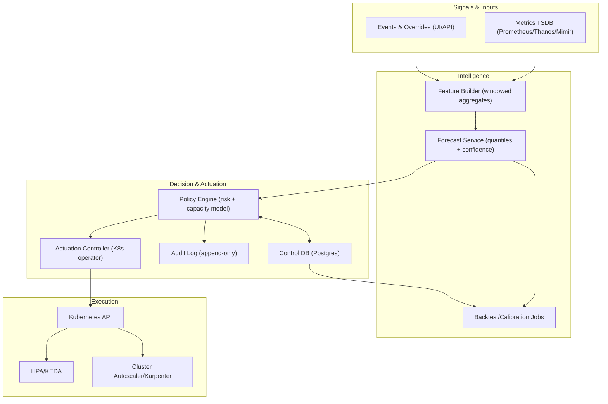
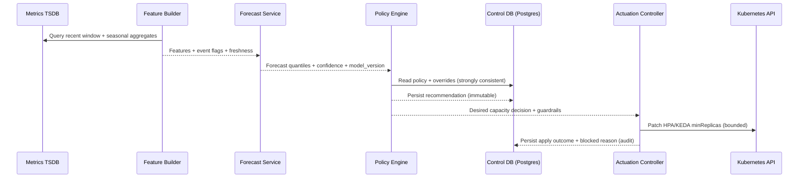

## Overview

Predictive autoscaling provisions compute capacity **ahead of demand** using historical signals, scheduled events, and explicit safety margins. Unlike reactive autoscaling (e.g., CPU-based HPA), predictive scaling must (1) forecast near-future load, (2) translate that load into resource needs using a capacity model, and (3) actuate early enough to cover **ramp-up time** (pod scheduling, image pulls, node provisioning, JVM warmup, cache warming).

The key insight is to treat predictive scaling as a **closed-loop control system** with strong safety rails:

1. **Multi-signal forecasting with uncertainty** (quantiles, not single numbers).
2. **Risk-aware capacity decisions** (quantile selection + headroom + warmup buffers).
3. **Staged actuation** (pods first, nodes second) with strict rate limits.
4. **Continuous backtesting + drift detection**, with safe fallback to reactive autoscaling when confidence is low.

This design targets Kubernetes (HPA/KEDA + Cluster Autoscaler/Karpenter) but generalizes to VM/ASG environments. Forecasting and actuation are intentionally decoupled to minimize blast radius: a degraded model must not destabilize clusters.

---

## Requirements

### Functional Requirements
- Forecast service demand **5–60 minutes ahead** at multiple horizons (e.g., 5, 10, 30, 60).
- Support multiple demand signals (choose per service):
  - **QPS/RPS** (per service, optionally per route class).
  - **Concurrency** (in-flight requests, queue depth).
  - **Work backlog** (Kafka lag, task queue depth).
  - Supporting signals for context: CPU, memory, latency, error rate, saturation indicators.
- Convert forecast demand into target capacity using a per-service **capacity model**, such as:
  - QPS-per-pod-at-SLO.
  - Concurrency-per-pod-at-SLO (Little’s Law–based).
  - Queue consumption rate per worker.
- Apply safety margins based on:
  - Forecast uncertainty (quantiles, calibration health).
  - Warmup time (pods, nodes, caches).
  - Business risk tolerance (error budget / cost budget).
- Support scheduled events and overrides (marketing campaigns, batch jobs, known cron spikes).
- Provide “what-if” simulation and backtesting; publish accuracy, calibration, and cost impact.
- Enforce safe actuation guardrails:
  - Max scale rate, min/max bounds, cooldowns, and circuit breakers.
  - Idempotent writes and conflict handling with existing autoscalers.
  - Fallback modes: **observe-only**, **apply**, **freeze**, **reactive-only**.
- Provide explainability and auditability: “why did we scale?” including signals, chosen quantile, headroom, warmup assumptions, and confidence.

### Non-Functional Requirements

#### Scale (Example Target)
- Fleet: **5,000 services** across **200 clusters** (average 25 services/cluster; real distributions skewed).
- Metrics inputs (post-aggregation): **~100 series/service** at **10s–60s** resolution.
  - At 10s: `5,000 * 100 * 6 = 3.0M samples/min`
  - At 60s: `5,000 * 100 * 1 = 0.5M samples/min`
  - Expect higher upstream cardinality in Prometheus; this system should consume **aggregated per-service signals**, not raw per-pod/per-path cardinality unless explicitly modeled.
- Forecast cadence: every **1 minute** for all services → **5,000 forecast sets/min** (each set includes multiple horizons + quantiles).

#### Latency (Control Plane)
- Recommendation freshness SLO: **P99 < 90s** from “minute boundary” to a persisted recommendation.
- Forecast compute (batchable): target **P50 < 150ms/service**, **P99 < 1s/service** within a worker pool.
- Actuation decisioning: **P99 < 2s** from recommendation to “ready-to-apply” decision (excluding Kubernetes/node provisioning).
- Kubernetes patch propagation is best-effort; the system should measure and alert on **time-to-effective-capacity** separately.

#### Availability & Safety
- Control-plane API availability: **99.95%** (multi-AZ).
- Safety requirement: on partial failure, the system must **fail closed** (stop proactive changes) and preserve reactive scaling.
- Target steady-state headroom: **10–20% average**, configurable per service (error-budget-aware).

#### Consistency & Durability
- **Strong consistency** for policies, overrides, and audit logs (authoritative source of truth).
- **Eventual consistency** acceptable for time-series ingestion and derived features.
- Durability:
  - Policies/overrides/audit: **RPO ~ 0** (WAL + replication).
  - Metrics/features: tolerate **1–5 minutes** delay; no silent drops.

### Constraints & Assumptions
- Kubernetes is primary; integrates with **HPA/KEDA** and **Cluster Autoscaler/Karpenter**.
- Metrics source: Prometheus-compatible TSDB (Prometheus/Thanos/Mimir) or vendor equivalent.
- Platform team size: **5–10 engineers**; design must be operable with low on-call burden.
- Multi-tenancy: teams own services; platform owns the scaling system. Per-team isolation via policy and RBAC.
- Compliance: full audit trail for overrides and automated actuation.

---

## Architecture

### High-Level Diagram



### Control Loop (Mental Model)

1. **Sense**: Read aggregated service metrics and event flags; validate freshness.
2. **Predict**: Produce multi-horizon demand quantiles and a confidence score.
3. **Decide**: Convert demand into capacity using a service capacity model, then apply risk/headroom/warmup rules.
4. **Act**: Apply bounded, rate-limited changes through Kubernetes primitives.
5. **Verify**: Measure outcomes (SLO burn, throttling, pending pods, time-to-effective-capacity); backtest and detect drift.

---

## Components

### 1) Signal Layer (Metrics + Events)

**Responsibility**
- Provide stable, low-cardinality, per-service signals suitable for forecasting and capacity modeling.

**Key Practices**
- Prefer pre-aggregated metrics like:
  - `service:rps_1m` (sum across pods).
  - `service:latency_p99_1m` (via histogram quantiles).
  - `service:error_rate_1m`.
  - `service:inflight` / `service:queue_depth`.
- Treat missingness explicitly:
  - Distinguish “no traffic” from “no data”.
  - Use freshness SLIs (e.g., last sample age) as first-class inputs to safety logic.

**Anti-pattern to avoid**
- Forecasting directly off high-cardinality label sets (per pod, per path, per user) unless the system is explicitly designed for it.

---

### 2) Feature Builder

**Responsibility**
- Build model-ready features from recent windows and longer-term seasonality.

**Design Decisions**
- Multi-resolution features (common set):
  - 1m buckets for recent dynamics, 5m for smoothing, daily/weekly seasonal indicators.
- Incremental computation:
  - Maintain rolling aggregates rather than querying “8 weeks” per minute per service.
- TSDB fanout control:
  - Jittered schedules, per-cluster query concurrency caps, and caching of recent windows.

**Technology**
- Typically stateless workers pulling from TSDB query APIs and writing features to an OLAP store (ClickHouse/BigQuery) or a compact feature store table.

---

### 3) Forecast Service

**Responsibility**
- Produce demand forecasts and uncertainty bounds for each service and horizon.

**Modeling Guidance (Production-First)**
- Start with robust baselines:
  - “yesterday same time”, “last week same time”, exponentially weighted moving average with seasonality.
- Move to quantile-capable models once baselines are stable:
  - Quantile regression, gradient-boosted trees with quantile loss, or classical seasonal models with prediction intervals.
- Always output:
  - `forecast_p50`, `forecast_p90`, `forecast_p99` (or policy-defined set)
  - `confidence_score` (data freshness, residual error, calibration health)
  - `model_version`

**Why quantiles**
- Predictive scaling failures are asymmetric: under-provisioning hurts SLOs; over-provisioning costs money. Quantiles make the trade explicit.

---

### 4) Policy Engine (Capacity & Risk)

**Responsibility**
- Convert forecasts into desired capacity while enforcing SLO, cost, and safety constraints.

**Capacity Models (Choose Per Service)**
- **QPS-per-pod-at-SLO**
  - `desired_replicas = ceil(demand_qps / qps_per_pod_slo)`
  - `qps_per_pod_slo` comes from load tests and is periodically re-estimated.
- **Concurrency-per-pod-at-SLO**
  - Use Little’s Law: `concurrency ≈ arrival_rate * latency`
  - If you can forecast QPS and have latency targets, you can compute concurrency needs more directly for bursty workloads.
- **Queue consumer model**
  - `desired_workers = ceil(backlog / (target_drain_time * work_rate_per_worker))`

**Risk & Headroom**
- Select a quantile based on policy and confidence:
  - Normal: P90
  - Event windows: P95/P99
  - Low confidence: freeze or degrade to conservative baseline (not “trust P99 blindly”).
- Add explicit buffers:
  - Warmup buffer (time-to-effective-capacity).
  - Fixed headroom floor (e.g., +N replicas) for critical services.

**Guardrails**
- Hard bounds: min/max replicas, max node count hints.
- Rate limits: e.g., max **2× per 5 minutes** scale-up; scale-down slower (e.g., 0.5× per 10 minutes).
- Cooldowns: prevent oscillation and HPA “fighting”.

---

### 5) Actuation Controller (Kubernetes Operator)

**Responsibility**
- Apply desired state to Kubernetes safely and observe execution outcomes.

**Two-Stage Actuation**
1. **Pods first**:
   - Prefer updating **HPA minReplicas** (or KEDA min) rather than directly setting Deployment replicas, so reactive scaling still handles fast spikes.
2. **Nodes second**:
   - If pods remain pending beyond a threshold (e.g., **>60–120s**) and the forecast indicates sustained demand, issue node scaling hints via:
     - Cluster Autoscaler signals (indirectly via pending pods), or
     - Karpenter provisioning constraints, or
     - A cluster-level “provisioning request” mechanism (implementation-dependent).

**Safety Modes**
- Observe-only: write recommendations but do not patch Kubernetes.
- Apply: patch within bounds.
- Freeze: stop proactive changes; maintain last safe minima; rely on HPA.
- Reactive-only: explicitly disable predictive inputs when confidence/health is bad.

**Implementation Notes**
- Run **one controller per cluster** (or per small cluster group) for API locality and failure isolation.
- Use leader election; reconcile desired state idempotently; back off on `429`/timeouts.

---

### 6) Backtest, Calibration & Reporting

**Responsibility**
- Prove the system works and stays safe over time.

**Must-have Metrics**
- Accuracy: MAPE/SMAPE (with caveats), but also:
  - Under-forecast rate during SLO burn.
  - Over-forecast cost impact.
- Calibration: “P90 contains actual ~90% of the time” (per service tier).
- Actuation effectiveness: time-to-effective-capacity, pending pod duration, scale oscillations.
- Business outcomes: error budget burn reduction vs baseline, cost per request.

**Gating**
- Do not promote a new model unless it beats baselines on:
  - Calibration stability
  - “SLO harm” metrics (under-provision episodes)
  - Cost impact within policy thresholds

---

## Data Model

### Control Plane Storage (Postgres)

**Core tables**
- `services`
  - `service_id (pk)`, `cluster_id`, `namespace`, `workload_ref`, `owner_team`, `tier`
- `scaling_policies`
  - `policy_id (pk)`, `service_id (fk)`, `min_replicas`, `max_replicas`
  - `warmup_seconds`, `cooldown_seconds`
  - `scale_up_rate_limit`, `scale_down_rate_limit`
  - `risk_quantile_default`, `base_headroom_pct`
  - `capacity_model_type` (`QPS_PER_POD`, `CONCURRENCY_PER_POD`, `QUEUE_WORKERS`)
  - model params (e.g., `qps_per_pod_slo`, `concurrency_per_pod_slo`, `work_rate_per_worker`)
  - `created_at`, `updated_at`, `version`
- `overrides`
  - `override_id (pk)`, `service_id (fk)`, `start_time`, `end_time`
  - `forced_min_replicas`, `risk_quantile`, `reason`, `created_by`, `created_at`
- `recommendations` (immutable, time-stamped)
  - `rec_id (pk)`, `service_id (fk)`, `generated_at`, `horizon_minutes`
  - `forecast_p50`, `forecast_p90`, `forecast_p99`, `chosen_quantile`
  - `desired_replicas`, `desired_nodes_hint`
  - `confidence_score`, `model_version`, `inputs_freshness_seconds`
- `audit_log` (append-only)
  - `audit_id (pk)`, `service_id (fk)`, `timestamp`
  - `action`, `old_value`, `new_value`, `reason`, `actor`, `request_id`

**Retention**
- Policies/overrides/audit: retain per compliance needs (commonly 1–7 years).
- Recommendations: retain 30–90 days for debugging; aggregate older data into OLAP.

### Time-Series Storage
- Source-of-truth metrics remain in TSDB.
- The predictive system should write only:
  - Its own health/SLIs (recommendation freshness, apply success rate, blocked reasons).
  - Optional derived “capacity gap” metrics for dashboards.

### OLAP Storage (ClickHouse/BigQuery/Snowflake)
- `features_1m` keyed by `(service_id, ts_bucket)`
- `backtest_results` keyed by `(service_id, date, model_version, horizon)`
- `calibration_metrics` keyed by `(service_id, date, quantile)`

---

## Data Flow



---

## API Design

### Control Plane REST APIs

**Upsert scaling policy**
- `PUT /v1/services/{serviceId}/policy`
- Concurrency: `If-Match: {version}` (or a `version` field in body) to prevent lost updates.

Request:
```json
{
  "minReplicas": 10,
  "maxReplicas": 500,
  "warmupSeconds": 180,
  "cooldownSeconds": 120,
  "scaleUpRateLimit": 2.0,
  "scaleDownRateLimit": 0.5,
  "riskQuantileDefault": 0.9,
  "baseHeadroomPct": 0.15,
  "capacityModel": { "type": "QPS_PER_POD", "qpsPerPodSlo": 120 }
}
```

Errors:
- `400` validation (e.g., min > max, quantile out of range)
- `404` unknown service
- `409` version conflict

**Create override (scheduled event)**
- `POST /v1/services/{serviceId}/overrides`
- Idempotency: `Idempotency-Key` header stored with `(serviceId, key)`.

Request:
```json
{
  "startTime": "2025-12-20T18:00:00Z",
  "endTime": "2025-12-20T22:00:00Z",
  "forcedMinReplicas": 200,
  "riskQuantile": 0.99,
  "reason": "Marketing campaign"
}
```

**Get recommendations**
- `GET /v1/services/{serviceId}/recommendations?from=...&to=...`
- Returns time series of forecasts, chosen quantile, desired replicas, confidence, model version, and apply status.

**Audit query**
- `GET /v1/services/{serviceId}/audit?from=...&to=...`

### In-Cluster Kubernetes CRDs

- `PredictiveScalingPolicy`
  - Spec mirrors policy; status includes last evaluation, health, and last applied recommendation.
- `PredictiveRecommendation`
  - Time-stamped desired capacity + metadata; optionally used as the handoff from control plane to actuator.

**Error handling**
- Prefer explicit `Blocked`/`Frozen` states with machine-readable reason codes:
  - `STALE_METRICS`, `LOW_CONFIDENCE`, `RATE_LIMIT`, `MAX_BOUND`, `CLUSTER_UNHEALTHY`, `K8S_THROTTLED`

---

## Scaling & Performance

### Primary Bottlenecks and Mitigations

**1) TSDB query pressure**
- Risk: fanout overwhelms TSDB and increases query latency.
- Mitigations:
  - Consume aggregated metrics (recording rules) rather than raw series.
  - Incremental features; avoid repeated multi-week scans.
  - Cache recent windows; enforce per-cluster query concurrency caps; add jitter.

**2) Kubernetes API write pressure**
- Risk: throttling and reconciliation lag.
- Mitigations:
  - Apply only material changes (e.g., `max(5%, 2 replicas)` threshold).
  - Batch and rate-limit per namespace/cluster; exponential backoff on `429`.
  - Prioritize scale-up patches over scale-down.

**3) “Too-late” horizons**
- Risk: 5-minute forecast doesn’t help if node provisioning + warmup is 10 minutes.
- Mitigations:
  - Map horizons to actuators:
    - 5–10m: pod minima and fast buffers.
    - 30–60m: sustained demand and node readiness.
  - Model warmup explicitly in policy.

### Horizontal Scaling
- Feature/forecast workers: partition by `service_id`, process via queue; scale workers on queue lag.
- Policy engine: stateless, scales with forecast volume.
- Actuation: one controller per cluster (or shard) with leader election.

### Caching
- Policies: local cache + watch/ETag invalidation.
- Metrics: short TTL cache for recent windows (avoid repeated TSDB reads within a minute).
- Features: store last N buckets to compute rolling features incrementally.

---

## Trade-offs & Alternatives

### Key Trade-offs
- **Quantile forecasts vs point forecasts**
  - Choose quantiles to support risk-aware decisions.
  - Costs: more evaluation complexity (calibration), slightly heavier modeling.
- **Policy engine separated from actuator**
  - Choose separation for safety and independent evolution.
  - Costs: extra components and interfaces; must avoid split-brain via clear ownership of “desired state”.
- **Update HPA minima vs setting Deployment replicas directly**
  - Choose HPA/KEDA integration to preserve reactive response and avoid controller fights.
  - Costs: less precise direct control; requires careful configuration of HPA behavior and stabilization windows.
- **Conservative scale-down**
  - Choose slower scale-down to reduce oscillation and protect caches.
  - Costs: potentially higher steady-state cost after transient spikes.

### Alternative Approaches
- **Reactive-only autoscaling (HPA/KEDA)**
  - Simpler; often sufficient when warmup is small and spikes are random.
  - Fails for predictable surges + slow provisioning without constant headroom.
- **Admission control + load shedding**
  - Complements scaling by enforcing SLOs under overload (protects system even when scaling lags).
  - Adds complexity and product-level behavior changes; often implemented at gateways.
- **End-to-end RL/controller**
  - Potentially cost-optimal, but hard to validate, explain, and keep safe under distribution shift.

---

## Failure Modes & Mitigations

### Core Scenarios

**1) Metrics delay / TSDB partial outage**
- Impact: stale or missing inputs → unsafe recommendations.
- Detection: freshness SLI (last sample age), TSDB error rate/latency.
- Mitigation:
  - Freeze predictive actuation on stale inputs.
  - Fall back to reactive autoscaling; optionally enforce a conservative min headroom for critical tiers.

**2) Model drift (traffic pattern change)**
- Impact: systematic under/over-provisioning.
- Detection: backtest regressions, calibration failures, increased SLO burn correlated with recommendations.
- Mitigation:
  - Auto-downgrade to baseline model.
  - Require promotion gates for new versions; temporarily increase risk quantile only when confidence signals justify it.

**3) Bad capacity model / misconfiguration**
- Impact: runaway scaling or persistent SLO misses (e.g., wrong `qps_per_pod_slo`).
- Detection: anomaly alerts on scale rate and cost, “max bound hit + SLO burn” correlation.
- Mitigation:
  - Hard global caps and tier-based maxima.
  - Two-person review for high-impact overrides; fast rollback via versioned policies.

**4) Kubernetes API throttling or controller degradation**
- Impact: recommendations can’t be applied in time.
- Detection: `429` rate, reconcile lag, apply failure ratio.
- Mitigation:
  - Backoff + retry with prioritization (scale-up first).
  - Persist desired state and reapply later; degrade to reactive-only if apply success drops below threshold.

### Disaster Recovery
- Targets: **RTO 30 minutes**, **RPO ~ 0** for policy/audit.
- Postgres: multi-AZ + WAL archiving + tested restore.
- Model artifacts: versioned object storage.
- Safe behavior during control-plane outage: per-cluster actuator continues last known safe behavior and relies on reactive scaling.

---

## Operations

### Monitoring (What to Page On)
- Recommendation freshness (e.g., **>5 minutes** for **>10%** of services).
- Apply success rate drop (cluster-wide) and sustained K8s API throttling.
- “Scale-up blocked by max bound” while SLO burn is high for critical tiers.
- Calibration regressions for promoted model versions.

### Observability (Dashboards)
- Control plane: queue lag, forecast throughput, model version distribution, data freshness.
- Actuation: applied vs blocked by reason code, scale deltas, reconcile latency, pending pod durations.
- Outcomes: SLO burn rate, p99 latency, error rate, cost/headroom (% idle), time-to-effective-capacity.

### Deployment & Rollout
- Modes: observe-only → apply (tiered canary).
- Canary strategy:
  - Start with low-tier services; compare against a control group (cost + SLO).
  - Gate promotion on calibration + “no SLO harm” metrics, not just forecast accuracy.
- Rollback:
  - Pin to previous model version; disable predictive apply globally while keeping recommendations/audit.

### Security & Access Control
- AuthN/Z:
  - Policies and overrides require strong auth; RBAC by owner/team and service tier.
- Cluster access:
  - Actuator uses least-privilege Kubernetes RBAC; separate service accounts per cluster.
- Audit:
  - Append-only log for all overrides and automated actions; include request IDs and actors.

---

## References & Further Reading

- Kubernetes autoscaling
  - https://kubernetes.io/docs/tasks/run-application/horizontal-pod-autoscale/
  - https://kubernetes.io/docs/concepts/workloads/autoscaling/
- Karpenter
  - https://karpenter.sh/
- SRE principles (error budgets, safe automation)
  - https://sre.google/books/
- Forecasting & uncertainty
  - https://otexts.com/fpp3/
  - https://facebook.github.io/prophet/
- Industry patterns (for inspiration; validate details in your environment)
  - AWS Auto Scaling predictive scaling concepts
  - Large-scale SRE/autoscaling talks from Netflix and peers