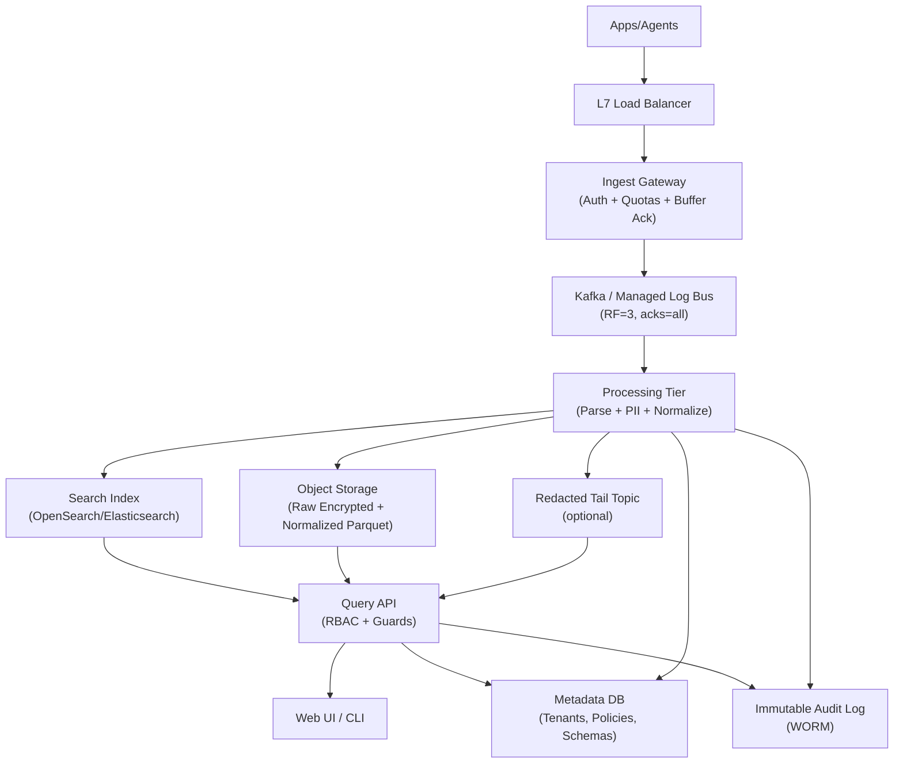
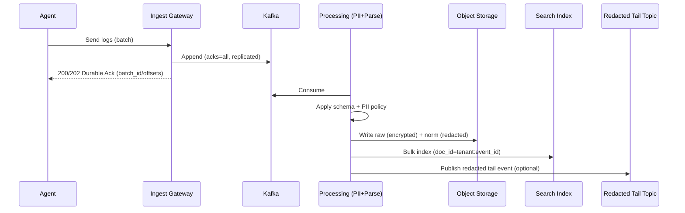
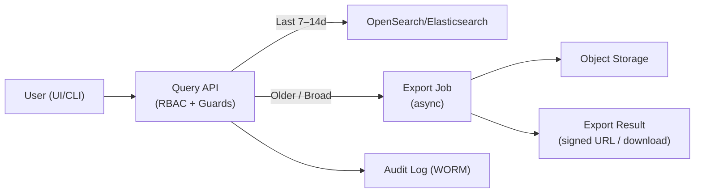

## Overview

A centralized logging platform ingests high-volume, high-cardinality events from many producers, enforces privacy controls (PII redaction/masking), supports schema evolution, and provides fast search for incident response.

The core design is a **buffer-first, policy-driven pipeline**:
- **Durable ingestion buffer** to absorb spikes, provide backpressure, and enable replay.
- **Deterministic, auditable transformation** (parsing + PII policies) before logs become queryable.
- **Dual storage**: low-cost immutable storage for long retention and reprocessing, plus a search index for low-latency queries over the “hot” window.

This architecture prioritizes durability and operational safety (no data loss for acknowledged writes; controlled blast radius under failures) while keeping search costs bounded via lifecycle tiers.

---

## Requirements

### Functional Requirements
- Ingest logs from agents/services via HTTP and gRPC (including OpenTelemetry Logs), supporting JSON and text.
- Multi-tenancy: tenant isolation, authentication, authorization, quotas, and per-tenant retention.
- Apply centrally managed **PII policies** so data is **redacted/masked before it is searchable by default**.
- Support schema evolution: new fields, changing types, and parser updates without downtime or data loss.
- Search and filtering: time range, service/host, severity, free-text, and selected structured fields; cursor pagination and streaming.
- “Tail -f” for recent streams with low latency (showing **redacted** output).
- Export raw logs for forensics/compliance with strict access controls, break-glass workflow, and immutable audit trails.
- Operational tooling: ingestion health, pipeline lag, index status, and usage/cost by tenant.

### Non-Functional Requirements (Targets)
**Scale assumptions (planning numbers)**
- Producers: 50k services, 500k agents.
- Throughput: 100k events/sec avg, 300k events/sec peak.
- Event size: ~0.5–1.5 KB uncompressed typical; ~0.2–0.6 KB compressed typical (high variance).
- Daily volume: ~2–6 TB/day compressed typical; plan headroom for ~10 TB/day on incident-heavy days.
- Retention: hot indexed 7–14 days; warm indexed optional 0–30 days; cold archive 30–180 days (object storage).

**Latency SLOs**
- Ingest durable ack (buffered): P50 20 ms, P99 200 ms (within a region).
- “Tail” (redacted stream): P50 < 500 ms end-to-end under nominal load.
- Search (last 15 minutes, common queries): P50 200 ms, P99 1 s.
- Search (24h range, complex text): P99 5 s (with query guards).

**Availability**
- Ingestion: 99.99% (buffer-first; degrade by rejecting rather than accepting without durability).
- Search API/UI: 99.9% (degrade gracefully if index lags; exports remain available).

**Consistency**
- Durability: acknowledged writes are durable in-region (replicated).
- Search visibility: eventual (seconds to minutes), bounded by indexing lag and refresh settings.

**Durability & DR**
- No data loss for acknowledged events within a region.
- Regional disaster: RPO up to 5 minutes if using asynchronous cross-region replication; RTO 60 minutes.

### Constraints & Assumptions
- Cloud object storage (S3/GCS) and managed KMS available.
- Untrusted networks: ingestion uses mTLS and/or short-lived signed tokens.
- Team size 6–10: prefer managed Kafka/OpenSearch equivalents where it reduces ops.
- Compliance: GDPR/CCPA; redaction before queryability; break-glass access requires approval + full audit.
- Cost constraint: cannot index everything forever; must tier storage and constrain query patterns.

### Out of Scope (Explicit)
- Metrics and traces storage (though logs may include trace/span IDs for correlation).
- Long-running ad-hoc analytics over cold data as an interactive experience (handled via export jobs / batch engines).

---

## Architecture

### High-Level Diagram



### Why This Layout Works
- **Gateway stays fast and reliable**: it only authenticates, validates, and durably buffers.
- **Processing is the policy boundary**: redaction/masking happens before indexing or tail streaming.
- **Dual storage optimizes cost**: object storage keeps long retention cheap; search indexes stay “hot and small.”
- **Replay is a first-class feature**: reprocess when schemas/policies change, and backfill indexes safely.

---

## Component Deep-Dive

## 1) Ingest Gateway

**Responsibility**
- Authenticate producers, enforce quotas, validate envelopes, and write to the durable bus.
- Return a response only after the event batch is durably replicated (in-region).

**Key Decisions**
- **Durable ack semantics**: acknowledge only after Kafka `acks=all` with `min.insync.replicas=2` (or managed equivalent).
- **Minimal parsing at the edge**: extract only routing fields (`tenant_id`, timestamps, source identifiers) and preserve original payload bytes.
- **Multi-tenant fairness**: token-bucket rate limits per tenant and per source; global overload protection.

**Implementation Notes**
- Prefer gRPC/HTTP2 for agent efficiency; support HTTP/1.1 for compatibility.
- Validate timestamp skew and enforce max batch size and max uncompressed bytes per request.
- Use short-lived credentials (OIDC/JWT) or mTLS SPIFFE/SPIRE identities.

---

## 2) Durable Event Bus (Kafka / Managed Equivalent)

**Responsibility**
- Absorb bursts, decouple ingestion from processing, and provide replay for reprocessing/backfills.

**Topic Strategy**
- `logs_raw_v1`: primary immutable event stream.
- `logs_deadletter_v1`: unprocessable events with reason codes and minimal payload.
- `meta_updates_v1`: invalidation stream for policy/schema changes.
- `logs_tail_redacted_v1` (optional): redacted events for low-latency tail.

**Partitioning**
- Default: partition by `hash(tenant_id, source)` to spread load and isolate noisy neighbors.
- For very large tenants: dedicated topics (or clusters) to prevent shared fate.

**Operational Guardrails**
- Enforce retention sized for backpressure (e.g., 12–72 hours depending on worst-case recovery).
- Monitor ISR shrink and reject ingest if durability guarantees cannot be met.

---

## 3) Processing Tier (PII + Parsing + Schema Normalization)

**Responsibility**
- Apply PII policies, parse/normalize, and write:
  - **Raw encrypted** bundles (immutable) + **normalized redacted** output (Parquet)
  - **Search index documents** for the hot window
  - Optionally, **redacted tail stream** for near-real-time viewing

**PII Handling (Policy Boundary)**
- **Default posture**: only allow explicitly whitelisted fields into indexed/searchable form; unknown fields go to normalized storage as redacted/opaque or dropped from index.
- **Deterministic tokenization** (for specific PII types where exact match is useful): `token = HMAC-SHA256(tenant_key, normalized_value)`.
  - Enables exact-match searches on tokens without exposing originals.
  - Per-tenant keys stored in KMS; rotation supported via versioned keys and reprocessing.

**Schema Evolution**
- Versioned parsers and schemas per tenant (or per integration).
- Compatibility modes: `backward`, `forward`, `none`; processing can emit warnings and route to dead-letter when constraints are violated.
- Keep **raw always** to enable reprocessing after parser/policy changes.

**Delivery Semantics**
- End-to-end is **at-least-once**; correctness achieved via idempotency:
  - OpenSearch document `_id = tenant_id + ":" + event_id` (overwrite-safe).
  - Object store writes are append-only; duplicates are tolerated (and can be deduped during export if required).

---

## 4) Storage (Object Storage)

**Responsibility**
- Low-cost, durable retention for compliance, forensics, and reprocessing.

**Layout**
- Raw encrypted bundles (append-only):
  - `.../raw/tenant=t123/dt=YYYY-MM-DD/hour=HH/part-<uuid>.zst`
- Normalized redacted columnar:
  - `.../norm/tenant=t123/dt=YYYY-MM-DD/hour=HH/part-<uuid>.parquet`

**Format Choices**
- Raw: compressed bundles (e.g., zstd) to preserve exact bytes and reduce cost.
- Normalized: Parquet for efficient scans/exports; optionally managed tables (Iceberg/Delta) for partition evolution and compaction.

**Security**
- Encrypt at rest (SSE-KMS) and in transit.
- Separate buckets/prefixes and IAM policies for raw vs normalized.
- Raw access requires break-glass (see Operations & Security).

---

## 5) Search Index (OpenSearch / Elasticsearch)

**Responsibility**
- Fast full-text search and filtering for recent (“hot”) logs.

**Index Strategy**
- Time-based indices per tenant (or tenant group): `logs-t123-YYYY.MM.DD`.
- ILM:
  - Hot: 7–14 days on fast storage.
  - Warm (optional): 0–30 days on cheaper nodes or searchable snapshots.
  - Cold: removed from index; still in object storage.

**Mapping Controls (Prevent Mapping Explosion)**
- Promote only a small set of common fields to first-class indexed fields: `service`, `host`, `level`, `env`, `region`, `trace_id`, `span_id`.
- Store arbitrary attributes under `attrs` as a `flattened` type (or equivalent), with:
  - allowlist of keys to be `keyword`
  - limits on key count per document and value length
- Disable dynamic mapping for uncontrolled paths.

**Query Guardrails**
- Require time range; enforce sensible defaults (e.g., last 15 minutes).
- Cap query complexity: max wildcard/regex cost, max disjunctions, max returned hits.
- Rate limit by tenant and by user role; isolate heavy queries with dedicated coordinator nodes if needed.

---

## 6) Query API + UI/CLI

**Responsibility**
- Enforce authZ, field-level security, and audit logging.
- Route queries to the index (hot) or object storage export (cold).

**Read Paths**
- Hot interactive: OpenSearch query + cursor pagination.
- Tail: consume from `logs_tail_redacted_v1` (or near-real-time OpenSearch) for low-latency streaming.
- Cold retrieval: asynchronous export job from object storage (and optional batch compute).

---

## 7) Metadata & Control Plane

**Responsibility**
- Tenant configuration, policy and schema registry, parser configuration, and audit metadata.

**Key Practices**
- Strong versioning: every policy/schema/parser change creates a new version.
- Safe rollouts: staged activation and canary tenants/sources.
- Push invalidations via `meta_updates_v1` to refresh caches in gateways/processors/query API.

---

## Data Model

### Kafka Message Envelope (Logical)
- `event_id` (ULID/UUID; required for idempotency)
- `tenant_id` (string)
- `source` (service/agent identifier)
- `timestamp_ms` (int64)
- `format` (`json|text|otlp`)
- `raw_bytes` (bytes; optionally compressed at agent)
- `attributes` (map; routing hints like `level`, `env`, `region`)
- `schema_hint` (optional: parser name/version)
- `ingest_received_ms` (gateway timestamp, for skew detection and SLI computation)

### Object Storage (Normalized Parquet Columns)
- `tenant_id` (string)
- `timestamp` (timestamp)
- `source` (string)
- `service` (string, optional)
- `host` (string, optional)
- `level` (string)
- `message` (string, redacted)
- `trace_id`, `span_id` (string, optional)
- `attrs` (map/string or struct; redacted/controlled)
- `pii_tokens` (map<string,string>; deterministic tokens)
- `raw_ref` (string; pointer to encrypted raw bundle + offset)

### Search Document (Indexed)
Recommended mapping (conceptual):
- `tenant_id` (keyword)
- `@timestamp` (date)
- `service`, `host`, `source`, `env`, `region`, `level` (keyword)
- `message` (text with analyzer; optional `message.keyword` for exact match)
- `trace_id`, `span_id` (keyword)
- `attrs` (flattened / controlled)
- `pii_tokens.*` (keyword)
- `raw_ref` (keyword, not exposed to all roles)

### Metadata DB (Relational)
- `tenants(tenant_id, name, plan, hot_days, warm_days, cold_days, created_at)`
- `pii_policies(policy_id, tenant_id, version, rules_json, created_at, active)`
- `schemas(schema_id, tenant_id, name, version, json_schema, compatibility_mode, created_at, active)`
- `parsers(parser_id, tenant_id, name, version, config_json, created_at, active)`
- `audit_log(audit_id, tenant_id, actor, action, resource, reason, created_at, immutable_ref)`

---

## Data Flow

### Ingest + Process + Index



### Query Path (Hot vs Cold)



---

## API Design

### Ingestion

`POST /v1/logs:ingest`
- Headers: `Authorization`, `X-Tenant-Id`, optional `Idempotency-Key`
- Request body:
  ```json
  {
    "source": "payments-api",
    "events": [
      {
        "event_id": "01J...ULID",
        "timestamp_ms": 1734372000123,
        "format": "json",
        "payload": {"msg":"timeout contacting bank","user_email":"a@b.com","level":"ERROR"},
        "attrs": {"env":"prod","region":"us-east-1","host":"ip-10-0-1-2"}
      }
    ]
  }
  ```
- Response (durably buffered):
  ```json
  {
    "accepted": 500,
    "batch_id": "b_01J...",
    "kafka_offsets": [{"partition": 12, "offset": 918273}]
  }
  ```
- Errors:
  - `401/403`: auth/authZ failure
  - `413`: batch too large
  - `429`: tenant throttled
  - `400`: invalid timestamps/envelope
  - `503`: durability cannot be met (e.g., ISR below minimum)

Idempotency and retries:
- Clients must retry on network failures; platform guarantees **at-least-once**.
- Require `event_id`; downstream uses `(tenant_id, event_id)` for idempotent indexing and optional dedupe during export.

`POST /v1/otlp/logs`
- Accept OpenTelemetry Logs over HTTP/gRPC; translate into the common envelope.

### Search

`POST /v1/logs:search`
- Request:
  ```json
  {
    "time_range": {"from": "2025-12-17T00:00:00Z", "to": "2025-12-17T01:00:00Z"},
    "query": "error AND timeout",
    "filters": {"service": ["payments-api"], "level": ["ERROR"], "env": ["prod"]},
    "page": {"size": 200, "cursor": null},
    "fields": ["@timestamp","service","level","message","attrs"]
  }
  ```
- Response:
  ```json
  {
    "hits": [
      {"@timestamp":"2025-12-17T00:12:03Z","service":"payments-api","level":"ERROR","message":"...","attrs":{"region":"us-east-1"}}
    ],
    "next_cursor": "opaque"
  }
  ```
- Errors:
  - `400`: invalid query
  - `403`: forbidden fields or PII access denied
  - `413`: query too broad (time range / cardinality limits)
  - `429`: protected due to cluster load

Notes:
- Cursor pagination is required; deep paging is disallowed.
- Query guards enforce time range, complexity limits, and role-based field visibility.

### Tail (Redacted)

`GET /v1/logs:tail?service=payments-api&since=2025-12-17T00:59:00Z`
- Server-Sent Events (SSE) or WebSocket.
- Source: redacted tail topic (preferred) or near-real-time index with short polling.
- Always returns redacted data under standard roles.

### Export (Compliance / Forensics)

`POST /v1/logs:export`
- Request:
  ```json
  {
    "time_range": {"from": "2025-12-01T00:00:00Z", "to": "2025-12-02T00:00:00Z"},
    "filters": {"service": ["payments-api"]},
    "format": "jsonl.gz",
    "include_raw": false
  }
  ```
- Response:
  ```json
  {"export_id":"x_01J...","status":"queued"}
  ```

`GET /v1/logs:export/{export_id}`
- Returns status and signed URLs when ready.

Break-glass for raw:
- `include_raw=true` requires elevated role + justification; every access is written to immutable audit logs.

### Admin (Policies & Schemas)

`PUT /v1/tenants/{tenant_id}/pii-policies/{policy_id}`
- Versioned policy updates; validation and staged rollout required.

`PUT /v1/tenants/{tenant_id}/schemas/{schema_name}`
- Upload JSON Schema; supports compatibility mode and versioning.

---

## Scaling & Performance

### Capacity Planning (Order-of-Magnitude)
At 300k events/sec peak:
- If compressed size averages ~300 B/event, ingest is ~90 MB/s; if ~600 B/event, ~180 MB/s.
- Kafka write amplification with RF=3 means brokers handle ~3× replication traffic; plan for sustained hundreds of MB/s aggregate throughput with headroom.
- Indexing: keep bulk indexing and refresh intervals tuned to maintain acceptable lag; treat “index lag” as a primary SLI.

### Partitioning & Sharding
- Kafka: enough partitions to match processing parallelism (often 5–10× the number of consumers you expect at peak, then scale consumers).
- OpenSearch: target 30–50 GB per shard; rollover by size/time; route by tenant to reduce cross-tenant shard fanout.

### Backpressure
- Gateways reject (`429`/`503`) rather than accept without durability.
- Processing pauses consumption when downstream (indexing) slows; Kafka absorbs.
- If object storage is impaired, prioritize buffering and stop indexing/tailing to maintain durability.

### Cost Controls
- Hot window limits + ILM reduce index size.
- Attribute allowlists and `flattened` mappings prevent mapping explosion and index bloat.
- Export jobs for cold data avoid forcing expensive interactive queries on archives.

---

## Consistency, Correctness, and Security Model

### Consistency & Visibility
- **Ingest ack**: durable in-region replication.
- **Search visibility**: eventual; bounded by processor lag + index refresh.
- **Tail**: near-real-time redacted stream (not raw).

### Idempotency & Duplicates
- At-least-once delivery is assumed across retries and consumer restarts.
- Use `event_id` as the stable identity:
  - Search index: deterministic `_id` overwrites duplicates.
  - Exports: optional dedupe by `(tenant_id, event_id)` if strict uniqueness is required.

### Multi-Tenant Isolation
- Network: mTLS, short-lived tokens, and per-tenant rate limits.
- Data plane: tenant-based partitioning and index routing.
- Control plane: per-tenant configs and strict RBAC/ABAC.
- Field-level security: prevent access to raw references and restricted fields by default roles.

### Privacy & Compliance
- Redaction before queryability is enforced centrally.
- Raw data is encrypted, access-controlled, and only accessible via break-glass with immutable audit logging.
- Deterministic tokens enable exact match without revealing originals; token scopes are tenant-bound.

---

## Trade-offs & Alternatives

### Key Trade-offs
- **Durable buffer + eventual search**: improves ingestion reliability and absorbs spikes, but introduces indexing lag and eventual consistency.
- **Dual storage (object + search)**: enables cheap long retention and replay, but increases system complexity and requires clear “hot vs cold” UX.
- **Centralized PII enforcement**: improves compliance and auditability, but adds CPU cost and requires strong operational discipline for policy management.
- **Strict mapping controls**: protects search cluster health, but limits ad-hoc querying of arbitrary fields (exports fill the gap).

### Alternatives
- **OpenSearch-only retention**: simplest read path, but expensive and operationally risky at long retention and high cardinality.
- **Loki-style index + chunk store**: can lower index costs, but changes query capabilities and requires careful label cardinality management.
- **ClickHouse-centric design**: excellent for structured analytics and cost-per-query, but full-text search relevance and UX often require additional tooling.
- **Agent-side redaction**: reduces central CPU, but weakens enforcement consistency and auditability; still useful as a defense-in-depth layer, not the primary control.

---

## Failure Modes & Mitigations

### 1) Search Cluster Degraded/Red
- Impact: indexing slows; hot search partially/unavailable.
- Detection: cluster health, bulk indexing errors, rising processor lag, P99 search latency.
- Mitigation: Kafka buffers; reduce refresh rate; increase bulk size; shed expensive queries; degrade UI; rehydrate via snapshots if needed.

### 2) Kafka ISR Shrink / Broker Outage
- Impact: ingest slow or rejected; durability risk if misconfigured.
- Detection: under-replicated partitions, produce latency timeouts, ISR metrics.
- Mitigation: RF=3 and `min.insync.replicas=2`; gateway returns `503` if durability cannot be met; automate broker replacement.

### 3) PII Policy Bug (Under-redaction)
- Impact: sensitive data becomes searchable (critical incident).
- Detection: canary sampling with independent DLP scanner; policy unit tests; anomaly alerts.
- Mitigation: “search block” switch per tenant; stop indexing and tail; reprocess from raw with fixed policy; audit, notify, and postmortem.

### 4) Object Storage Partial Outage
- Impact: long-retention writes delayed; export jobs fail; replay impeded.
- Detection: storage error rate and write latency.
- Mitigation: prioritize buffering in Kafka; temporarily suspend non-essential indexing; retry with exponential backoff; ensure storage multi-AZ configuration.

### 5) Metadata DB Outage / Stale Policies
- Impact: processors can’t fetch latest schemas/policies; risk of incorrect redaction if not handled safely.
- Detection: metadata DB availability, cache staleness metrics, policy fetch failures.
- Mitigation: versioned cached policies with TTL; **fail closed** for indexing on policy uncertainty (write raw only; block searchable output until policy is confirmed); read replicas and PITR.

### 6) Noisy Neighbor Tenant (Skew)
- Impact: higher latency/drops for others; shard/partition hotspots.
- Detection: per-tenant QPS/bytes, consumer lag skew, shard CPU skew.
- Mitigation: per-tenant quotas; dedicated topics/indices; routing; plan-based limits; optional dedicated clusters for largest tenants.

---

## Operations

### SLIs to Track
- Ingest: durable-ack latency, reject rate (`429/503`), bytes/sec per tenant.
- Bus: ISR health, produce latency, consumer lag (seconds behind).
- Processing: end-to-end lag (ingest → searchable), DLQ rate, redaction error rate.
- Search: P50/P99 query latency, slow query counts, heap/GC, merge pressure, shard imbalance.
- Data quality: parse success %, schema drift, PII leakage sampling signals.
- Security: break-glass usage rate, denied access attempts, audit log integrity checks.

### Deployment & Rollouts
- Progressive delivery: canary gateways/processors; shadow processing for new parsers/policies; per-tenant feature flags.
- Safe index migrations: versioned templates, write aliases, rollover without downtime.
- Rollback: immutable policy/schema versions; revert active pointers; reprocess if necessary.

### Disaster Recovery
- Cross-region replication: MirrorMaker/managed replication for Kafka (async); object storage cross-region replication; metadata DB replicas + PITR.
- OpenSearch: snapshots to object storage; restore into DR region as needed.
- RTO/RPO: RTO 60 minutes; RPO up to 5 minutes (async replication).

### Security & Audit
- End-to-end encryption (mTLS, TLS).
- KMS-backed encryption for raw data and tokenization keys; key rotation with versions.
- Immutable audit logs (WORM) for exports, role changes, break-glass actions, and policy updates.

---

## References & Further Reading
- OpenTelemetry Logs: https://opentelemetry.io/docs/specs/otel/logs/
- Kafka Producer Semantics (Idempotence/Transactions): https://kafka.apache.org/documentation/
- OpenSearch Docs (Index templates, ILM, security): https://opensearch.org/docs/
- Loki architecture (chunk store + index): https://grafana.com/docs/loki/latest/
- Kappa/Lambda and stream reprocessing patterns: https://martinfowler.com/bliki/LambdaArchitecture.html
- Google DLP concepts (transferable patterns): https://cloud.google.com/dlp/docs/concepts