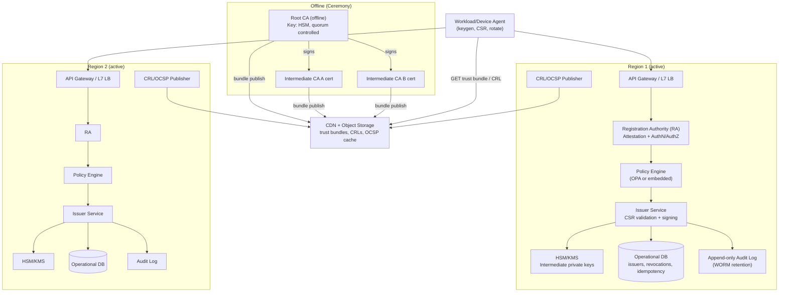
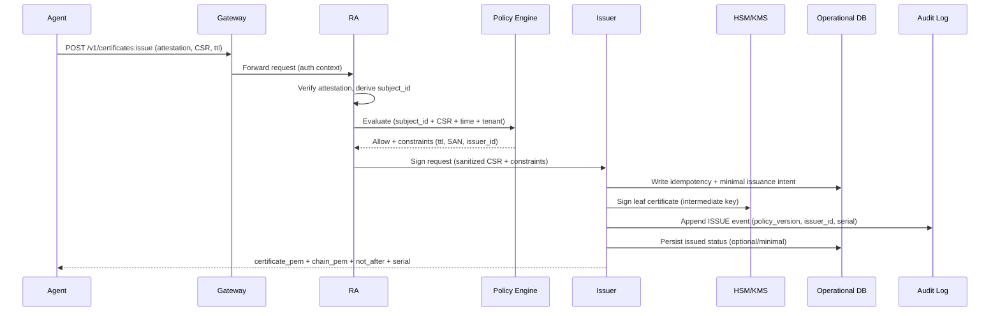
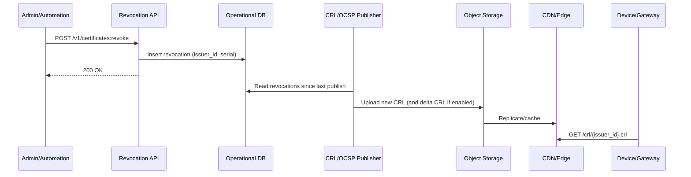

## Overview

An internal Certificate Authority (CA) for mTLS at “millions of workloads and tens of millions of devices” is primarily an **identity and availability** problem, not a cryptography problem. The system must:

1. **Bind identities to keys** reliably (workload/device attestation → stable identity).
2. **Issue and rotate certificates** at high volume with low operational toil.
3. **Limit blast radius** when something goes wrong (key compromise, policy bugs, outages).

This design treats certificate issuance as an automated **control plane**:
- An **offline Root CA** anchors trust and is used only for signing/rolling intermediates.
- Multiple **online Intermediate CAs** (scoped by region/env/tenant) perform day-to-day issuance using **HSM/KMS-backed keys**.
- A **Registration Authority (RA)** performs policy-driven **attestation** and authorization, then delegates signing to the Issuer.
- A **status plane** (CRL/OCSP) is optimized for clients that need revocation semantics (typically devices), while microservices rely heavily on **short-lived certificates** to reduce dependence on revocation availability.

The result is production-ready: multi-region issuance, predictable rotation behavior, strong auditability, abuse controls, and explicit operational procedures (ceremonies, rollovers, incident response, and disaster recovery).

---

## Requirements

### Functional Requirements
- Automatically enroll workloads/devices using strong attestation and map them to a stable identity (e.g., SPIFFE ID like `spiffe://prod/ns/payments/sa/api`, or a device identity).
- Issue X.509 leaf certificates for mTLS (including the certificate chain) from policy-approved Intermediate CAs.
- Support automated renewal/rotation with **zero downtime** and jittered renewal to avoid thundering herds.
- Support revocation workflows and publish status artifacts (CRL and optionally OCSP).
- Distribute trust bundles (roots/intermediates) and status artifacts to heterogeneous clients (sidecars/agents, gateways, constrained devices).
- Enforce multi-tenant policies: allowed identities, SAN constraints, key algorithm requirements, max TTL, allowed issuers, and rate limits.
- Provide tamper-evident audit logs for all security-sensitive operations: issuance, revocation, policy changes, and key lifecycle events.
- Provide admin workflows: intermediate lifecycle (create, activate, drain, retire), root ceremony integration, bundle distribution, emergency response.

### Non-Functional Requirements

#### Scale (Concrete Targets)
Assume:
- **5M workload identities** (Kubernetes + VMs) using short-lived certs.
- **50M device identities** (IoT/mobile/edge), mix of online/offline behavior.

Issuance volume:
- Workloads: TTL **24h**, renew at ~60% TTL with jitter ⇒ ~**5M certs/day** steady-state (~**58 QPS** average).
- Devices: TTL **90 days** (example) ⇒ ~**555k certs/day** (~**6.4 QPS** average), but **bursty** during fleet rollouts and incident rotations.
- Burst capacity: design for **10k QPS** sustained for 10–30 minutes for workloads (deploy storms/region failover), and **1k–5k QPS** for device enrollment waves (gateway-fronted).

Status traffic (if used):
- OCSP: up to **100k QPS** aggregate (edge cached), primarily for devices and gateways that can staple.
- CRLs: aim to keep any single CRL artifact **< 50 MB**; use **sharding** and optional **delta CRLs** if revocation volume is high.

#### Latency (Achievable Targets)
Issuance (in-region, excluding client network variability):
- Workload renewals: **P50 100 ms**, **P99 500 ms** (attestation + policy + one HSM/KMS sign + minimal durable writes).
- Device issuance: **P99 1–3 s** (stronger attestation, rate-limits, potentially slower networks).

Status:
- OCSP responder: **P99 < 50 ms** at the edge for cached responses; origin response may be higher but should be rare.

#### Availability & SLOs
- Issuance control plane (RA + Issuer): **99.99%** per region, **multi-region active/active** with failover.
- Trust bundle + CRL distribution: **99.999%** via object storage + CDN (versioned artifacts, long cache lifetimes).
- Fail-safe posture: if policy/audit durability cannot be guaranteed, **fail closed** (deny issuance) and rely on existing certificate TTL and renewal retry.

#### Consistency Model
- **Strong consistency required** for:
  - Revocation state transitions (once revoked, never “unrevoke” without explicit administrative action).
  - Policy version used for an issuance decision (must be auditable and reproducible).
  - Key lifecycle state (which intermediates are active/draining/retired).
- **Eventual consistency acceptable** for:
  - CRL propagation through CDN.
  - Monitoring dashboards and analytics.
  - Derived metadata indexes (as long as issuance correctness/auditability is preserved).

#### Security & Compliance
- CA keys protected by **FIPS 140-2/140-3 validated** crypto modules (HSM/KMS).
- Default algorithms: **ECDSA P-256** (FIPS-friendly) or **RSA-2048/3072** if required by legacy clients.
- Private trust only; clients control trust via internal bundle distribution.
- Least-privilege administrative access, strong change control, and immutable audit retention (SOC2-style auditability).

---

## Architecture

### High-Level Diagram



### Key Architectural Principles
- **Separate responsibilities**:
  - RA: *Who are you?* (attestation) and *What may you request?* (policy).
  - Issuer: *Is the CSR well-formed and compliant?* then *Sign and record*.
- **Minimize blast radius** with scoped intermediates:
  - Separate intermediates by **environment** (prod/stage/dev) at minimum.
  - Optionally split by **region** and **tenant** to reduce impact of compromise or operational incidents.
- **Make status distribution independent** of issuance:
  - Trust bundles, CRLs, and (cached) OCSP are served from **CDN/object storage** so clients can continue to validate even if issuance is impaired.

---

## Components

### 1) Registration Authority (RA)
**Responsibilities**
- Verify attestation and authenticate the requester.
- Map attestation claims to a stable identity (SPIFFE ID, device ID).
- Enforce request-level authorization (requested SANs/URIs, TTL bounds, key algorithm requirements, issuer selection constraints).
- Apply abuse controls (rate limits, anomaly checks, allow/deny lists).

**Attestation options**
- Workloads (Kubernetes): validate projected service account JWT + bind to namespace/service account + node identity signal (e.g., node attestation, SPIRE node agent, or cloud instance identity).
- VMs: cloud instance identity documents (AWS/GCP/Azure) or TPM-based attestation.
- Devices: TPM/TEE attestation, platform keystore proofs, or manufacturer provisioning (with tight scoping).

**Why RA exists**
It prevents the signing tier from becoming a generic “sign anything” service and keeps identity proofing logic centralized, testable, and auditable.

---

### 2) Policy Engine
**Responsibilities**
- Deterministically evaluate: `(identity claims, request, time, policy_version) -> allow/deny + constraints`.
- Enforce:
  - Allowed SANs/URIs (e.g., only `spiffe://prod/ns/X/sa/Y` for that workload).
  - Max TTL per tenant/type.
  - Allowed key algorithms and sizes.
  - Which intermediate(s) may sign for a given identity/tenant/region.

**Implementation**
- OPA (Rego) or a small embedded rules engine for simpler needs.
- Policies stored and shipped as **signed bundles** (GitOps), versioned and rolled out canary-first.

**Auditability**
Log the **policy version**, inputs (hashed where sensitive), and decision outcome for every request.

---

### 3) Issuer Service (Online Intermediate CAs)
**Responsibilities**
- Validate CSR structure (allowed extensions, key algorithm, public key size/curve).
- Construct the final certificate profile (Subject/SAN/EKU/TTL/NameConstraints usage).
- Generate a standards-compliant serial number and sign via HSM/KMS.
- Perform durable writes: idempotency record, issuance metadata, and audit event.

**X.509 profile guidance**
- Key usage / EKU: `DigitalSignature` + `KeyEncipherment` (RSA) and `ServerAuth`/`ClientAuth` for mTLS as needed.
- Prefer **URI SAN** (SPIFFE) for workloads; avoid overloading DNS SAN for service identity.
- Serial numbers: use **cryptographically random 16–20 byte** serials (RFC 5280 recommends uniqueness; randomness avoids global counters and reduces coordination).
- Backdating: keep `notBefore` slightly in the past (e.g., 1–2 minutes) to tolerate clock skew.

**HSM/KMS throughput**
HSM signing is commonly the bottleneck. Scale by:
- Multiple intermediates (“issuer shards”).
- Multiple HSM partitions/clusters per region.
- Early rejection before HSM call (cheap CSR/policy validation first).

---

### 4) Certificate Status: Revocation + CRL/OCSP
**Responsibilities**
- Persist revocation decisions.
- Publish CRLs (and optionally OCSP responses) with predictable freshness.

**Workloads vs Devices**
- Workloads: rely primarily on **short-lived certs**; revocation is an emergency tool.
- Devices: require revocation semantics due to longer TTL and intermittent connectivity:
  - Primary: **CRL** distribution via CDN/object storage.
  - Optional: **OCSP** for online devices/gateways (often with edge caching and/or stapling).

**Sharding strategy**
- CRLs are generated per `issuer_id`.
- If revocation volume is high, further shard by cohort (e.g., `issuer_id + shard`) to keep artifacts small and update cadence manageable.

---

### 5) Trust Bundle Distribution
**Responsibilities**
- Publish a versioned trust bundle (root + active intermediates).
- Enable safe rotation: add new intermediate, roll clients, then retire old intermediate.

**Best practices**
- Version bundles (e.g., `bundle-2026-01-01.json`) and serve with long cache TTL.
- Sign bundles (e.g., CMS/PKCS#7, COSE, or a TUF-like approach) to protect integrity even if distribution is compromised.

---

### 6) Audit & Observability Plane
**Responsibilities**
- Produce immutable records for issuance, revocation, policy changes, and key lifecycle events.
- Provide SRE visibility: latency, error rates, capacity, and approaching-expiry risk.

**Design requirements**
- Audit writes must be **durable** and preferably **append-only** with immutable retention (WORM).
- If the audit pipeline is unavailable, issuance should **fail closed** (or route to a pre-approved emergency mode with explicit, auditable activation).

---

## Data Model

### Operational Database (Strong Consistency)
Use a strongly consistent SQL store per region (e.g., Postgres with HA, CockroachDB, Spanner) to back critical state.

**issuers**
- `issuer_id` (PK, string)
- `region` (string)
- `env` (string)
- `intermediate_cert_pem` (text)
- `chain_pem` (text)
- `key_ref` (string; HSM/KMS handle)
- `status` (enum: `ACTIVE`, `DRAINING`, `RETIRED`)
- `created_at`, `activated_at`, `retired_at`

**idempotency**
- `idempotency_key` (PK)
- `subject_id` (string)
- `request_hash` (bytes; hash of CSR+constraints)
- `issuer_id` (string)
- `result_cert_fingerprint` (bytes)
- `created_at`
- `expires_at`

**issued_certs** (optional OLTP; can be minimized if audit is authoritative)
- `issuer_id` (string)
- `serial_number` (bytes/string)
- `subject_id` (string)
- `public_key_fingerprint` (bytes)
- `not_before` (timestamp)
- `not_after` (timestamp)
- `status` (enum: `ISSUED`, `REVOKED`, `EXPIRED`)
- `issued_at` (timestamp)
- PK: (`issuer_id`, `serial_number`)
- Index: (`subject_id`, `not_after`)

**revocations**
- `issuer_id`
- `serial_number`
- `revoked_at`
- `reason` (enum)
- `revoked_by` (principal)
- PK: (`issuer_id`, `serial_number`)

### Audit Log (Append-Only, Immutable Retention)
**audit_events**
- `event_id`
- `event_type` (ISSUE, REVOKE, POLICY_CHANGE, KEY_OP, BREAK_GLASS)
- `principal`
- `policy_version`
- `request_hash`
- `decision` (ALLOW/DENY + reason)
- `timestamp`
- `payload` (structured; avoid storing secrets)

---

## Data Flows

### Issuance Flow



### Revocation + Publishing Flow



---

## API Design

Use **gRPC** for internal control-plane traffic (mesh-native) and **REST** for device-facing environments. All endpoints require authentication via attestation-derived identity or privileged admin auth.

### REST: Issue Certificate
`POST /v1/certificates:issue`

Request:
```json
{
  "attestation": { "type": "k8s_jwt", "token": "..." },
  "csr_pem": "-----BEGIN CERTIFICATE REQUEST-----...",
  "requested_ttl_seconds": 86400,
  "tenant_id": "payments"
}
```

Response:
```json
{
  "certificate_pem": "-----BEGIN CERTIFICATE-----...",
  "chain_pem": ["-----BEGIN CERTIFICATE-----..."],
  "issuer_id": "prod-us-east-1-3",
  "serial_number": "0x12ab...",
  "not_before": "2026-01-01T00:00:00Z",
  "not_after": "2026-01-02T00:00:00Z"
}
```

Errors:
- `400` invalid CSR (unsupported key type, forbidden extensions)
- `401/403` attestation failed / policy denied
- `409` idempotency conflict (same key, different constraints)
- `429` rate limited (per identity/tenant/global)
- `503` signing capacity unavailable (HSM/KMS or dependency degraded)

Idempotency:
- Require `Idempotency-Key` header.
- Server binds the key to `(subject_id, request_hash)` and returns the same result for retries until `expires_at`.

### REST: Revoke Certificate (Admin/Automation)
`POST /v1/certificates:revoke`

Request:
```json
{
  "issuer_id": "prod-us-east-1-3",
  "serial_number": "0x12ab...",
  "reason": "KEY_COMPROMISE"
}
```

Response: `200 OK`

Notes:
- Privileged auth only (break-glass or automated detection principal).
- Must write audit and revocation state durably.

### REST: Fetch Trust Bundle
`GET /v1/trust-bundle`

Response:
```json
{
  "roots_pem": ["..."],
  "intermediates_pem": ["..."],
  "version": "2026-01-01",
  "signature": "..."
}
```

Caching:
- Versioned bundles with immutable URLs; CDN cache with long TTL.
- Clients refresh on a schedule (e.g., 1–6 hours) and validate bundle signature.

### CRL
`GET /crl/{issuer_id}.crl`
- Served from CDN/object storage.
- Use `ETag` and `If-Modified-Since`.

### OCSP (Optional)
`POST /ocsp`
- Standard RFC 6960 OCSP request/response.
- Prefer edge caching and short `nextUpdate` (minutes to hours) based on risk profile.

### gRPC (Internal) Sketch
```proto
syntax = "proto3";

package pki.v1;

service IssuanceService {
  rpc IssueCertificate(IssueCertificateRequest) returns (IssueCertificateResponse);
}

message IssueCertificateRequest {
  string subject_id = 1;
  bytes csr_der = 2;
  uint32 requested_ttl_seconds = 3;
  string tenant_id = 4;
  string policy_version = 5;
  string idempotency_key = 6;
}

message IssueCertificateResponse {
  bytes cert_der = 1;
  repeated bytes chain_der = 2;
  string issuer_id = 3;
  bytes serial_number = 4;
  int64 not_after_unix_seconds = 5;
}
```

---

## Scaling & Performance

### Capacity Planning (Back-of-the-Envelope)
- Average workload issuance: ~58 QPS.
- Burst planning: 10k QPS for 10–30 minutes implies:
  - Multiple issuer shards and HSM partitions.
  - Aggressive client-side jitter and exponential backoff.
  - Admission control to avoid cascading failures.

HSM/KMS sizing:
- Assume one HSM partition sustains on the order of **hundreds to low-thousands** ECDSA signs/sec (vendor-dependent).
- To reach 10k QPS, plan multiple shards across partitions and/or multiple intermediates, and enforce **fairness** across tenants.

### Common Bottlenecks and Mitigations
- **HSM/KMS throughput**
  - Shard by `issuer_id` (multiple intermediates).
  - Keep signing calls minimal (no unnecessary HSM round trips).
  - Use circuit breakers and queue limits to prevent overload.
- **Deploy storms / synchronized renewals**
  - Renew at 50–70% of TTL with random jitter (e.g., ±20%).
  - Backoff on `429/503` and keep serving with existing cert until close to expiry.
- **Dependency amplification**
  - Keep the issuance critical path small: attestation verify + policy + idempotency + sign + audit.
  - Make non-critical metadata asynchronous when possible (while preserving correctness and audit).
- **OCSP origin overload**
  - Prefer CRLs for devices at scale and cache aggressively.
  - For OCSP, use edge caches and keep `nextUpdate` tuned to avoid stampedes.

### Sharding Strategy
- Natural shard key: `issuer_id` (each corresponds to a specific intermediate key and certificate).
- Large tenants get multiple issuers (e.g., `prod-us-east-1-1..N`) to spread load and isolate incidents.
- Keep regional intermediates region-local to avoid replicating private keys across regions.

---

## Trade-offs & Alternatives

### Trade-offs Made (At Least 3)
- **Short-lived workload certs (12–24h)**:
  - Pros: reduces reliance on revocation infrastructure and improves resilience during status-plane outages.
  - Cons: increases issuance volume and requires robust renewal behavior.
- **Offline root + multiple scoped intermediates**:
  - Pros: strong blast-radius reduction; compromise of one intermediate does not compromise global trust.
  - Cons: operational overhead (ceremonies, rollover planning, bundle distribution).
- **Policy-driven, deny-by-default issuance**:
  - Pros: prevents privilege creep and “anyone can mint a cert” failures; makes issuance intent auditable.
  - Cons: requires governance and careful policy rollout to avoid outages.
- **CRL-first for devices, limited OCSP**:
  - Pros: predictable scalability, better offline tolerance, decouples validation from an always-on responder.
  - Cons: revocation freshness is bounded by CRL update cadence and cache TTL.

### Alternatives (When They Fit)
- **Managed Private CA** (cloud provider):
  - Pros: reduces operational burden; integrates with provider IAM/HSM.
  - Cons: portability concerns, cost at very high issuance volume, feature constraints.
- **Service mesh identity system (e.g., SPIRE) with upstream CA**:
  - Pros: strong workload identity primitives and attestation ecosystem.
  - Cons: still need CA lifecycle, bundle distribution, and device strategy.
- **Vault PKI / step-ca**:
  - Pros: faster time-to-value for smaller deployments.
  - Cons: may require significant hardening and scaling work for very large fleets.

---

## Failure Modes & Mitigations

### 1) HSM/KMS Partition Outage
- **Impact**: issuance degraded for affected issuer shard; renewals may fail if outage persists.
- **Detection**: signing latency spikes, error rates, queue depth, HSM health probes.
- **Mitigation**: multiple issuer shards; capacity in alternate partitions; regional failover; prioritize near-expiry renewals; temporary policy to issue slightly longer TTL (pre-approved, auditable emergency mode).

### 2) RA Attestation Bug or Policy Misconfiguration
- **Impact**: unauthorized issuance (security incident) or widespread denies (availability incident).
- **Detection**: policy-change alerts, canary tenants, anomaly detection (unexpected SAN/URI patterns), audit review.
- **Mitigation**: signed policy bundles, staged rollout, rapid rollback; freeze issuance per tenant/issuer; incident revocation and intermediate retirement if unauthorized issuance occurred.

### 3) Intermediate CA Key Compromise
- **Impact**: attacker can mint valid certificates under that intermediate.
- **Detection**: HSM tamper alerts, abnormal issuance patterns, SIEM correlation, unexpected cert sightings.
- **Mitigation**: immediately set issuer to `RETIRED`, revoke intermediate if supported by clients, publish updated trust bundle removing it, rotate affected workloads/devices to a new intermediate, post-incident tighten policies and controls.

### 4) Operational DB Outage / Partition
- **Impact**: inability to record idempotency/revocations; risk of correctness gaps.
- **Detection**: DB errors/latency, failed writes, replica divergence alerts.
- **Mitigation**: multi-AZ HA per region; bounded queues; fail closed for issuance if critical writes (idempotency/revocation/audit pointers) cannot be guaranteed; rely on existing cert TTL and retry.

### 5) CDN/Object Storage Outage (Bundles/CRLs)
- **Impact**: delayed trust updates; devices may fail revocation checks if CRLs expire.
- **Detection**: synthetic probes, elevated 5xx/timeout rates.
- **Mitigation**: multi-region buckets and/or multi-CDN; long-lived versioned bundles; clients keep last-known-good bundle/CRL until next refresh window; ensure CRL `nextUpdate` provides operational buffer.

### 6) Time Skew on Clients/Servers
- **Impact**: certs appear “not yet valid” or “expired”, causing outages.
- **Detection**: validation failures correlated with specific nodes/fleets; NTP health.
- **Mitigation**: small `notBefore` backdating; strict NTP enforcement; monitor skew and block enrollment of severely skewed devices.

---

## Operations

### Key Management & Ceremonies
- Root CA stored offline with quorum-controlled access; used only for signing/rolling intermediates.
- Intermediates generated and stored in HSM/KMS; keys are non-exportable where possible.
- Documented ceremony: participants, approvals, artifact handling, and post-ceremony verification.

### Intermediate Lifecycle (Rollover)
- Create new intermediate → publish bundle with both old+new → issuers start signing new leaf certs → allow fleet rotation → retire old intermediate → publish bundle removing old.
- Keep clear states: `ACTIVE`, `DRAINING`, `RETIRED`, enforced in issuance.

### Monitoring & Alerting (Minimal Set)
- Issuance: QPS, P50/P99 latency, error rate by reason (auth, policy, HSM, DB), queue depth.
- Renewal health: % of identities with cert expiring in `<2h`, `<24h`, renewal success rate by population.
- Status: CRL publish lag, OCSP origin health, CDN hit rate.
- Audit: append success rate, lag, and immutable storage health.
- Security: anomalous issuance patterns, admin actions, policy changes, HSM alerts.

### SRE Runbooks (Must-Have)
- Region degradation: traffic shift, capacity adjustments, issuance prioritization.
- Intermediate compromise: retire issuer, publish bundle update, trigger fleet rotation.
- Policy rollback: revert to last known good signed bundle, validate canary.
- Emergency TTL extension mode: explicit activation, bounded duration, auditable.

### Disaster Recovery
- **RTO**: 30 minutes to restore issuance capacity for a region (via failover or standby shard activation).
- **RPO**: ~0 for audit events (replicated append-only storage); operational DB uses continuous backups + PITR.
- CA private keys are protected in HSM/KMS; recovery uses vendor-supported quorum workflows.

---

## References & Further Reading
- RFC 5280: Internet X.509 Public Key Infrastructure Certificate and CRL Profile — https://datatracker.ietf.org/doc/html/rfc5280
- RFC 6960: Online Certificate Status Protocol (OCSP) — https://datatracker.ietf.org/doc/html/rfc6960
- RFC 8555: ACME — https://datatracker.ietf.org/doc/html/rfc8555
- SPIFFE/SPIRE (workload identity) — https://spiffe.io/ and https://spiffe.io/spire/
- Google BeyondCorp / Zero Trust — https://cloud.google.com/beyondcorp
- “Massive certificate rotation” operational patterns (industry talks/blogs): search vendor and large-scale platform engineering posts on internal PKI and rotation.