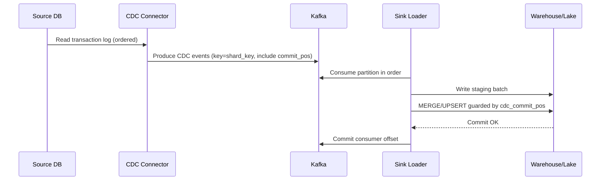

## Overview

A Change Data Capture (CDC) platform streams row-level changes (insert/update/delete) from OLTP databases into analytical destinations (data warehouses and lakehouse tables) with low latency and high reliability. The core challenge is *correctness under failure*: preserving ordering and transaction boundaries, handling schema evolution, avoiding missed changes, tolerating duplicates, supporting snapshots/backfills, and enabling replay.

The central design principle is to treat the database transaction log as the source of truth and model changes as an immutable, replayable event stream. Delivery is typically **at-least-once**, while the destination achieves **exactly-once *effects*** through idempotent upserts guarded by a **monotonic source position** (e.g., Postgres LSN, MySQL GTID/binlog position, SQL Server LSN).

---

## Requirements

### Functional Requirements
- Capture row-level changes from multiple OLTP engines (Postgres, MySQL, SQL Server) using log-based CDC (WAL/binlog/transaction log).
- Preserve a deterministic order of events within a defined scope and preserve transaction boundaries (begin/commit metadata).
- Support initial snapshot/backfill + continuous streaming with no missed committed rows and tolerable duplicates.
- Deliver changes to multiple destinations:
  - Warehouses: Snowflake, BigQuery, Redshift.
  - Lakehouse tables: Iceberg, Delta Lake, Hudi.
- Handle schema evolution (add/drop columns, type changes, renames) with explicit compatibility rules and versioning.
- Provide a control plane for provisioning/configuration, health monitoring, pausing/resuming, safe restarts, and auditing.
- Support filtering/routing (db/schema/table) and basic transformations (PII masking, column selection).
- Enable replay from a point in time (log position or timestamp) into isolated destinations for recovery and reprocessing.

### Non-Functional Requirements (Concrete Targets)

| Dimension | Target |
|---|---|
| Source count | ~200 DB instances |
| Throughput | 50k row changes/s sustained, 200k/s peak (aggregate) |
| Egress volume | ~5–20 TB/day (depends on row size + metadata + compression) |
| Latency (steady state) | P50 `< 2s` source→bus; P99 `< 10s` source→destination for upsert mode on “normal” tables |
| Availability | Control plane `99.99%`; data plane `99.9%` (degraded allowed per-connector/table) |
| Durability | No loss of committed source transactions within configured retention; duplicates allowed |
| Recovery | RPO `≤ 1 min` (bounded by log retention + bus durability), RTO `≤ 30 min` |
| Security | TLS in transit, encryption at rest, RBAC, audit logs, secrets management |
| Consistency model | Total order per **(source DB, table, shard/partition key)**; eventual consistency across tables |

### Constraints & Assumptions
- Ordering is **not global across all tables**. The strongest guarantee is within a table stream partitioned by a chosen shard key.
- Source databases allow replication/log access and sufficient log retention for worst-case downstream lag.
- Team size 4–8 engineers; prefer managed services where they reduce toil without sacrificing correctness controls.
- Compliance may require masking, retention policies, and auditable access controls.

---

## High-Level Architecture

```mermaid
flowchart TB
  subgraph Sources
    DB1[(Postgres/MySQL/SQLServer)]
    DBN[(...)]
  end

  subgraph DataPlane[Data Plane]
    CDC[CDC Connectors]
    BUS[(Kafka / Pulsar)]
    SR[Schema Registry]
    PROC[Stream Processor<br/>(optional)]
    SINK[Sink Loaders]
    DEST[(Warehouse / Lakehouse)]
    DLQ[(Dead Letter Queue)]
  end

  subgraph ControlPlane[Control Plane]
    API[Control Plane API]
    META[(Metadata DB)]
    UI[Admin UI]
    POLICY[Policy Engine<br/>(RBAC/Approvals)]
  end

  subgraph Obs[Observability]
    METRICS[Metrics]
    LOGS[Logs]
    TRACES[Tracing]
  end

  DB1 --> CDC
  DBN --> CDC
  CDC --> BUS
  CDC --> SR
  BUS --> PROC
  PROC --> SINK
  BUS --> SINK
  SINK --> DEST
  CDC --> DLQ
  PROC --> DLQ
  SINK --> DLQ

  API <--> META
  UI --> API
  POLICY --> API
  API --> CDC
  API --> PROC
  API --> SINK

  CDC --> METRICS
  PROC --> METRICS
  SINK --> METRICS
  CDC --> LOGS
  PROC --> LOGS
  SINK --> LOGS
  CDC --> TRACES
  PROC --> TRACES
  SINK --> TRACES
```

**Why this split works**
- The **event bus** is the durability and replay boundary.
- The **data plane** scales with throughput and isolates destination-specific loading mechanics.
- The **control plane** enforces safety rails (schema compatibility, quotas, approvals), provides visibility (lag/health), and orchestrates safe operations (pause/resume/restart/replay).

---

## Correctness Model (Ordering, Transactions, Snapshots)

### Ordering Guarantees
- **Guaranteed**: Total order within a stream partition (Kafka/Pulsar partition).
- **Not guaranteed**: Global order across all tables; cross-table ordering in a multi-table transaction cannot be atomically reflected in most warehouses.
- **Rule of thumb**: Pick a shard key that balances:
  - ordering needs (rows with same key must be ordered),
  - write hot-spot avoidance,
  - downstream merge parallelism.

### Transaction Boundaries
Connectors emit transaction metadata (when available), e.g.:
- `tx.begin` / `tx.commit` markers, or
- per-row `txid` + `commit_ts` + `commit_pos`.

Downstream consumers:
- preserve in-partition order,
- optionally buffer until commit markers if strict “no uncommitted visibility” is required for append-only audit topics,
- for upsert sinks, apply based on `commit_pos` (monotonic) and commit time rather than arrival time.

### Snapshot + Incremental Streaming (No Missed Rows)
A production snapshot strategy is “snapshot-then-stream from a cut”:
1. Establish a **consistent cut** (e.g., Postgres `REPEATABLE READ` + export snapshot, or engine-specific snapshot mechanisms).
2. Record the corresponding **start position** in the transaction log (`snapshot_pos`).
3. Emit snapshot rows as CDC events marked `snapshot=true` with a synthetic position `<= snapshot_pos`.
4. Start streaming changes from `snapshot_pos` onward.
5. Sink-side dedupe prevents duplicates between late snapshot rows and early streaming rows.

---

## Component Deep-Dive

### Control Plane
**Responsibility**: Provision connectors/streams, validate configs, enforce policies, manage lifecycle operations, and provide auditability.

**Key responsibilities**
- Connector orchestration: create/pause/resume/restart, rollout/canary, version pinning.
- Policy enforcement: RBAC, approvals for risky operations (replay to prod, schema breaking changes).
- Metadata: stream definitions, destination bindings, checkpoint visibility, run histories.

**Recommended implementation**
- Stateless API service + relational metadata DB (Postgres/MySQL).
- Background workers for long-running actions (snapshot, replay orchestration).
- Secrets integration (KMS/Vault/Secret Manager).

---

### CDC Connectors
**Responsibility**: Read database logs, translate to a canonical event format, publish ordered events to the bus.

**Key design decisions**
- Prefer **log-based CDC** over triggers to minimize write-path overhead and preserve native ordering.
- Emit:
  - a monotonic position (`commit_pos`),
  - PK fields,
  - schema version,
  - transaction metadata (when available),
  - optional `before` images (privacy/size-dependent).

**Technology choice**
- Debezium (Kafka Connect) for Postgres/MySQL/SQL Server is a strong default due to ecosystem maturity.
- Alternatives: managed CDC services (Datastream/DMS/Fivetran) when time-to-value outweighs deep correctness control.

**Operational notes**
- Each source requires careful sizing of log retention and replication privileges.
- Backpressure is not “free”: if sinks lag past source log retention, you must snapshot/rebuild.

---

### Event Bus (Kafka/Pulsar)
**Responsibility**: Durable, replayable ordered streams with retention and consumer groups.

**Key design decisions**
- Topic strategy: typically **one topic per table** (or per table family), e.g. `{env}.{db}.{schema}.{table}`.
- Partitioning: partition key = selected shard key (e.g., `tenant_id` if present, else hash of PK).
- Retention:
  - time-based retention sized for recovery/replay (commonly 7–14 days),
  - optional tiered storage for longer replay windows.

**Kafka defaults for reliability (illustrative)**
- Replication factor `3`, `min.insync.replicas=2`, `acks=all`.
- Enable idempotent producers where applicable.
- Use ACLs per topic and segregate environments (prod vs replay).

---

### Schema Registry & Data Contracts
**Responsibility**: Version schemas, enforce compatibility, and prevent silent downstream corruption.

**Key design decisions**
- Use Avro/Protobuf with a registry; include `schema_version` in each event.
- Compatibility policy:
  - **BACKWARD** for most pipelines (old consumers can read new data) when feasible,
  - **FULL** only when you can enforce both producer and consumer compatibility rigorously.
- Handle DDL events explicitly:
  - treat renames/type changes as versioned migrations,
  - route incompatible events to DLQ rather than corrupting sinks.

---

### Stream Processor (Optional)
**Responsibility**: Normalize, mask/filter, route, and optionally micro-batch for sink efficiency.

**Guidance**
- Keep in-stream transformations minimal to preserve auditability.
- Perform heavy joins/derivations in the warehouse/lake unless there is a strong real-time requirement.

**Technology choice**
- Kafka Streams for simpler per-key/stateful workflows.
- Flink when you need more advanced state management, windows, or complex routing at scale.

---

### Sink Loaders (Warehouse/Lakehouse)
**Responsibility**: Load CDC events into the destination with exactly-once effects and checkpointed progress.

**Core correctness pattern**
- Consume events in partition order.
- Write to a staging area (files/table).
- Apply idempotent upsert:
  - For each PK, only apply the event with the greatest `(commit_pos, op_order)`.
- Only after the destination commit succeeds, commit the consumer offset.

**Destination patterns**
- **Snowflake**: staged files → `COPY INTO` staging table → `MERGE` into target.
- **BigQuery**: write to staging → `MERGE`; for high throughput, batch via Storage Write API plus downstream merge/dedupe.
- **Iceberg/Delta/Hudi**: upserts keyed by PK with `commit_pos` as the sequence/ordering column; periodic compaction to control file counts.

---

### Dead Letter Queue (DLQ) & Quarantine
**Responsibility**: Capture events that cannot be processed safely.

**Examples of DLQ causes**
- Schema incompatibility/deserialization errors
- Destination constraint failures (bad types, invalid UTF-8, oversized rows)
- Missing PK for an upsert-configured stream

DLQ events must include enough context for reprocessing: source, topic/partition/offset, schema version, error class, and a stable fingerprint.

---

## Data Model

### Canonical CDC Event (Envelope)
A practical envelope (serialization via Avro/Protobuf recommended):

- `source`: `{db, schema, table}`
- `op`: `"c" | "u" | "d"`
- `pk`: object containing PK fields (required for upsert mode)
- `before`: previous row (nullable; often omitted for privacy/size)
- `after`: new row (nullable for deletes)
- `ts_ms`: source event time (best-effort)
- `tx`: `{txid, commit_ts}` (optional per engine)
- `commit_pos`: engine-specific monotonic position (e.g., Postgres LSN, MySQL GTID/binlog pos)
- `schema_version`: integer/uuid
- `snapshot`: boolean
- `headers`: optional `{tenant, masking_policy, trace_id}`

### Destination Table Contract (Upsert Mode)
Each destination table should include:
- The business columns.
- A required `cdc_commit_pos` (or equivalent) column.
- Optional `cdc_op` and `cdc_commit_ts` columns for auditing/debugging.

**Apply rule**: update/delete only if `incoming.cdc_commit_pos > existing.cdc_commit_pos` (or tie-break with `op_order`).

### Control Plane Metadata (Relational DB)
Illustrative schema:
- `connectors(id, name, source_type, config_ref, state, created_at, updated_at)`
- `streams(id, connector_id, db, schema, table, topic, shard_key, mode, status)`
- `destinations(id, type, config_ref, created_at)`
- `bindings(stream_id, destination_id, options, created_at)`
- `checkpoints(stream_id, consumer_group, last_committed_pos, updated_at)`
- `schema_versions(subject, version, fingerprint, compatibility, created_at)`
- `load_jobs(id, stream_id, batch_id, status, started_at, finished_at, error_class, error_detail)`

---

## Data Flow



---

## API Design (Control Plane)

All control-plane writes are audited and should support idempotency. Data plane is represented by bus topics and destination bindings.

### Manage Connectors
- `POST /v1/connectors`
  - Request: `{name, sourceType, connectionRef, includeTables, options}`
  - Response: `{connectorId, status}`
  - Errors: `400` invalid config, `409` duplicate, `422` missing privileges, `503` capacity
- `GET /v1/connectors/{id}` → status, lag summary, tasks, lastError
- `POST /v1/connectors/{id}:pause` / `:resume` / `:restart`

Idempotency:
- `POST` supports `Idempotency-Key`; server stores results keyed by `(caller, key)` for a bounded TTL.

### Configure Streams and Destinations
- `POST /v1/streams`
  - Request: `{connectorId, db, schema, table, shardKey, mode: "append"|"upsert", pkFields}`
  - Response: `{streamId, topic}`
- `POST /v1/destinations`
  - Request: `{type, configRef}`
  - Response: `{destinationId}`
- `POST /v1/bindings`
  - Request: `{streamId, destinationId, destinationSpec}`
  - Response: `{bindingId}`

### Lag and Health
- `GET /v1/streams/{id}/lag` → `{sourceCommitPos, busLagMessages, sinkLagSeconds, lastSuccessfulLoadAt}`
- `GET /v1/streams/{id}/health` → `{status, recentErrors, dlqRate}`

### Snapshot / Replay
- `POST /v1/streams/{id}:snapshot`
  - Request: `{mode: "initial"|"rebuild", consistentCut: true}`
- `POST /v1/streams/{id}:replay`
  - Request: `{fromPos | fromTimestamp, destinationOverrideRef, dryRun}`

Safety:
- Replays to production destinations should require elevated approval and default to isolated staging targets.

---

## Scaling & Performance

### Partitioning and Parallelism
- **Per-table topics** preserve independent scaling and simplify ownership.
- Partitions per table are chosen by:
  - peak changes/sec for that table,
  - acceptable merge batch size,
  - key skew (hot tenants/keys),
  - warehouse concurrency limits.

**Rule of thumb sizing**
- If peak is `200k events/s` aggregate and average event is `~1 KB` compressed on wire, that is `~200 MB/s`.
- If you target `~5–10 MB/s` per partition sustained, plan for `20–40` “hot” partitions across the hottest topics (and more if skewed).

### Latency Budget (Feasibility)
A typical steady-state P99 budget (illustrative):
- Connector read + encode: `100–500ms`
- Produce + replication: `10–200ms`
- Consumer batching window: `500ms–2s`
- Destination write + merge: `1–7s` (high variance by table size/cluster load)
Meeting P99 `< 10s` usually requires:
- bounded micro-batch windows,
- careful merge strategy (partition pruning/clustering),
- concurrency limits to avoid warehouse overload.

### Warehouse Merge Cost Controls
- Micro-batch by partition with adaptive sizing (target commit time).
- Cluster/sort keys aligned with PK and partitioning strategy.
- Consider “insert-only raw + periodic compaction/merge” for very high-throughput tables where real-time upsert is too expensive.
- Track per-table cost/latency and enforce quotas (noisy neighbor controls).

---

## Trade-offs & Alternatives

### Key Trade-offs
- **Per-partition ordering vs global ordering**
  - Chosen: total order per table shard/partition.
  - Sacrificed: global ordering and cross-table atomic visibility.
  - Why: global ordering collapses throughput and creates single-partition bottlenecks.
- **Exactly-once effects vs end-to-end exactly-once delivery**
  - Chosen: at-least-once transport + idempotent destination apply using `commit_pos`.
  - Sacrificed: simpler sink logic.
  - Why: most warehouses cannot atomically couple Kafka offsets with warehouse transactions.
- **Minimal in-flight transformation**
  - Chosen: filtering/masking/routing only.
  - Sacrificed: convenience of doing all ETL in-stream.
  - Why: improves auditability and reduces operational complexity and state explosion.

### Alternatives
- **Managed CDC (AWS DMS, Datastream, Fivetran)**: faster adoption; less control over event contracts, replay semantics, and per-table tuning; higher long-run cost at scale.
- **Trigger-based CDC**: simpler conceptually but increases OLTP write latency, risks drift/missed changes, and complicates transaction correctness.
- **Direct-to-warehouse (no bus)**: fewer components, but weaker replayability and isolation; outages shift buffering burden to sources or cause data loss.

---

## Failure Modes & Mitigations

### Failure Scenarios (At Least 3)
- **Connector crash/restart**
  - Impact: lag; duplicates after restart.
  - Detection: task health + lag + heartbeat gap.
  - Mitigation: resume from last committed `commit_pos`; downstream idempotent apply; automated restart with backoff.
- **Source log retention exceeded (WAL/binlog truncated)**
  - Impact: irreversible gap; connector cannot catch up.
  - Detection: source metrics (slot lag, binlog age) + alerting on “retention headroom”.
  - Mitigation: enforce sink lag SLOs, throttle heavy streams, scale sinks; if exceeded, trigger rebuild snapshot and mark gap explicitly in audits.
- **Kafka partition/broker unavailability**
  - Impact: stalled partitions; increased lag.
  - Detection: under-replicated partitions, produce/consume errors.
  - Mitigation: RF=3, rack awareness, `min.insync.replicas`, well-tested rolling upgrades; replay after recovery.
- **Warehouse throttling / merge failures**
  - Impact: sink lag growth; partial loads if not transactional.
  - Detection: load job failures, increased commit latency, quota errors.
  - Mitigation: transactional staging + atomic merge where possible; retries with jitter; circuit breaker per table; adaptive batch sizing; per-destination concurrency controls.
- **Schema breaking change**
  - Impact: deserialization failures or wrong columns in sinks.
  - Detection: schema registry rejections, DLQ spikes.
  - Mitigation: compatibility gates; quarantine incompatible events; coordinated migration playbooks; controlled rollout/canary.

### Disaster Recovery
- **Multi-region strategy**: mirror topics (e.g., MirrorMaker 2) or use geo-replicated storage/tiered storage; maintain warm standby control plane.
- **Backups**: control-plane DB PITR; bus replication/tiered storage; destination-native backups/snapshots.
- **Failover**: promote standby control plane; restart connectors/sinks pointing to the active bus/region; validate checkpoints and lag before resuming commits.

---

## Operations

### Observability (SLIs/SLOs)
Track and alert on:
- End-to-end lag per stream: `now - last_applied_commit_ts`
- Source headroom: time until log truncation at current lag rate
- Bus health: produce/consume latency, under-replicated partitions, partition skew
- Sink health: batch commit latency, merge duration, retries, DLQ rate
- Correctness signals: out-of-order detect (should be zero per partition), duplicate rate, schema error rate

Example alerts:
- P99 end-to-end latency `> 30s` for `10m`
- Consumer lag `> 15m` or rising fast
- Source retention headroom `< 6h`
- DLQ rate `> 0.1%` sustained for `10m`

### Deployment and Change Management
- Rolling upgrades for stateless services; draining-aware upgrades for processors/sinks.
- Versioned schemas with registry enforcement; canary by table/tenant.
- Safe rollback: pin connector/sink versions; pause committing offsets if destination commits are suspect; replay from last known-good checkpoint.

### Security & Compliance
- TLS everywhere; encryption at rest for bus, metadata DB, and destinations.
- Least-privilege source credentials (replication-only where possible).
- Secrets stored in a dedicated secrets manager; short-lived tokens preferred.
- RBAC for control plane; audit every configuration change, replay, and connector privilege escalation.
- PII handling:
  - mask/tokenize in-stream for mandatory fields,
  - or enforce policy via destination views for analytics users,
  - retain raw topics only as long as policy allows.

### Operational Runbooks (Examples)
- **Connector falling behind**: check source retention headroom → scale sinks → reduce merge concurrency hot tables → consider temporary “append-only raw” mode → if headroom breached, rebuild snapshot.
- **Destination incidents**: pause affected bindings (not connectors), keep bus as buffer, resume once destination stabilizes.
- **Replay for corruption**: isolate to new destination tables/staging, validate counts/checksums, then swap/rename atomically where supported.

---

## References & Further Reading
- Debezium documentation: https://debezium.io/documentation/
- Kafka documentation (ordering, delivery semantics): https://kafka.apache.org/documentation/
- *Designing Data-Intensive Applications* (Kleppmann): logs, replication, stream processing
- Apache Iceberg / Delta Lake / Apache Hudi docs (upserts, compaction, snapshot isolation)
- Snowflake ingestion + `MERGE` best practices (staging, clustering, cost controls)