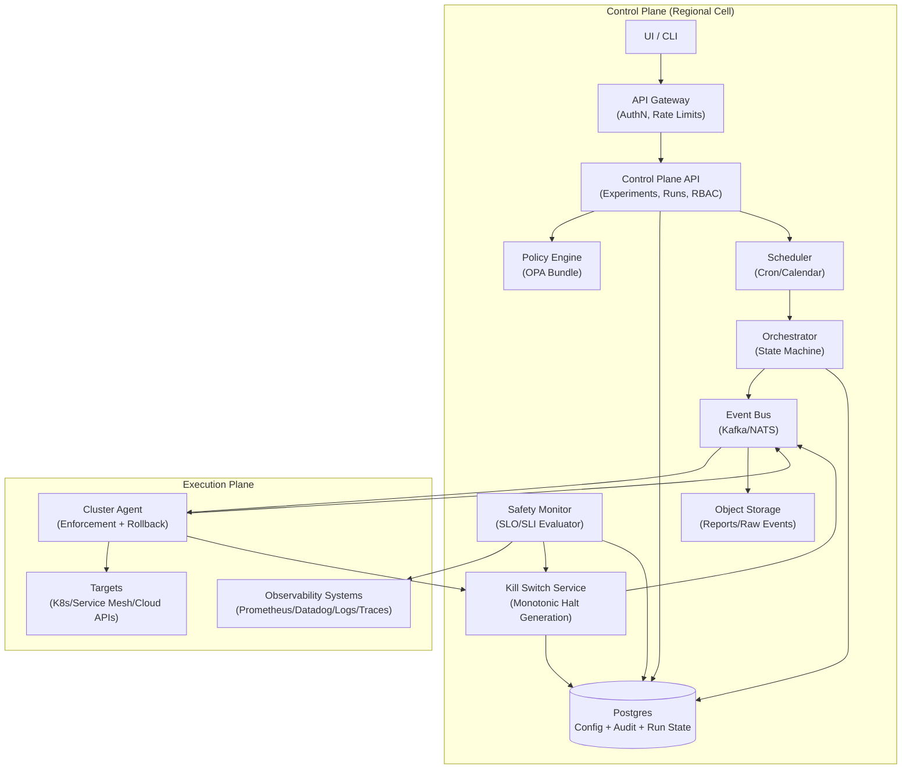
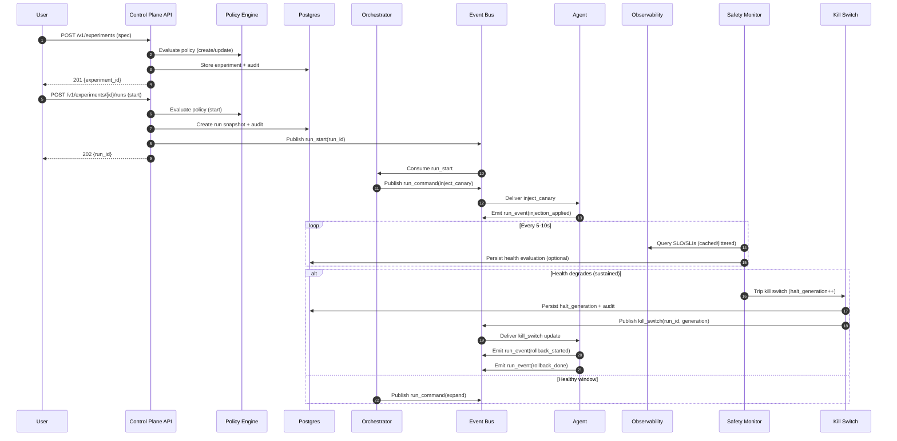

## Overview

A chaos engineering platform lets teams inject **controlled faults** (latency, packet loss, instance termination, dependency blackholes, resource pressure) to validate resilience, reduce unknown failure modes, and continuously improve incident readiness.

The defining challenge is **safety**. In production, fault injection must have:
- strict **blast-radius controls**
- explicit **approvals and auditability**
- a **fast, independent kill switch** that halts and rolls back experiments even if the orchestrator is unhealthy

This design uses a **policy-driven control plane** (authoring, approvals, scheduling, audit) and an **execution plane** (cluster agents applying faults close to workloads). A dedicated **Safety Monitor** evaluates health signals (SLO burn-rate, error rates, saturation) and triggers a **Kill Switch** enforced independently by agents.

## Goals & Non-Goals

### Goals
- Safe, repeatable chaos experiments in dev/stage/prod with progressive rollout and automatic rollback.
- Strong guardrails (policy-as-code + hard limits) and tamper-evident audit trails.
- Integrates with existing observability (Prometheus/Datadog) and incident tooling (PagerDuty/Slack).
- Supports Kubernetes-first environments, with optional service-mesh integration.

### Non-Goals
- Replacing incident management systems or observability stacks.
- Arbitrary “power user” remote execution on clusters (no generic shell/exec).
- Guaranteed zero customer impact (chaos is intentionally disruptive; the goal is bounded, learnable impact).

## Requirements

### Functional Requirements
- Author, validate (dry-run), approve, schedule, and run experiments (templates + parameters).
- Target selection by service, environment, region/AZ, cluster, namespace, labels, and traffic percentage (where applicable).
- Guardrails: max targets, max % traffic, max zones/regions, allowlists/denylists, time-of-day windows, per-service concurrency caps.
- Fault types (extensible):
  - Kubernetes: pod kill, node drain (optional), CPU/memory stress, disk fill (careful), DNS failure (controlled)
  - Network: latency/loss/jitter, bandwidth shaping, connection resets (via mesh or `tc/netem` where allowed)
  - Dependency: HTTP abort/delay, blackhole to upstream (mesh/L7 proxy)
- Progressive rollout: canary → expand, with health gates and timeboxed steps.
- Real-time run timeline: actions taken, targets affected (aggregated + sampled), health checks, stop/rollback reasons.
- Immutable audit log: who/what/when/why, including policy version and resolved targets.
- Post-experiment report: hypothesis, observed impact, SLO burn, rollback success, and links to dashboards/traces.

### Non-Functional Requirements (Concrete Targets)

**Scale (steady-state)**
- ~2,000 services across ~200 clusters and ~50,000 nodes
- ~5,000–20,000 workloads eligible for targeting (pods/VMs/endpoints)
- Up to **100 concurrent runs** globally (configurable), typically <20
- Peak **200 run starts/hour** (bursty), **2,000 run events/sec** (typical), **200,000 events/sec** worst-case if per-target events are unaggregated

**Latency**
- `POST /start` acceptance (auth + policy + DB commit): P50 **100–200ms**, P99 **500ms**
- Kill switch trip to agent begin-rollback:
  - P50 **<1s**, P99 **<5s** (within a region)
- UI timeline freshness: **<5s** behind real time (via stream or polling)

**Availability**
- Control plane (create/start/stop/status): **99.95%** monthly
- Kill switch propagation path (trip + agent enforcement): **99.99%** monthly (designed to function in degraded mode)

**Consistency**
- Strong consistency for experiment specs, approvals, policy bundles, and run state.
- At-least-once delivery for commands/events; idempotency required at orchestrator and agent.
- Eventual consistency acceptable for dashboards, derived reports, and long-term analytics.

**Durability**
- Config + audit: RPO **≤ 5 minutes**
- Run timeline events: best-effort acceptable, but **stop/kill events must be durable** (persisted/replicated)

### Constraints & Assumptions
- Kubernetes is the primary runtime; service mesh (Istio/Linkerd) present in many clusters but not assumed everywhere.
- Small platform team (3–6 engineers): prefer managed Postgres, managed Kafka/NATS, and object storage.
- Compliance: environment segregation (dev/stage/prod), least privilege, audit retention, and change control on policies.

## Architecture

### High-Level Diagram



### Key Ideas
- **Cell-based regional control plane**: experiments are executed in the region where targets run to keep kill switch latency low and reduce blast radius of outages.
- **Event-driven execution**: orchestrator emits commands; agents emit events. This isolates the control plane from transient cluster failures and supports retries/backpressure.
- **Independent safety path**: Safety Monitor + Kill Switch are designed to stop runs even if the orchestrator is stuck or the UI is down.

### Terminology (Interview-Friendly)
- **SLO**: Service Level Objective (e.g., “99.9% of requests < 300ms”)
- **SLI**: Service Level Indicator (the measured metric behind an SLO)
- **Burn-rate**: how fast you are consuming the error budget; commonly evaluated over fast+slow windows to catch sudden and sustained regressions
- **Blast radius**: the maximum scope of impact (targets, % traffic, zones, time)

## Execution Model (How a Run Works)

Each run is a state machine with explicit checkpoints:

1. **Resolve targets** (with snapshot): query inventory (K8s API/mesh) and lock the resolved target set for this run.
2. **Canary step**: apply fault to a small subset (e.g., 1–5% traffic or N targets).
3. **Observe window**: Safety Monitor evaluates signals with hysteresis.
4. **Expand**: increase blast radius step-by-step until max or completion.
5. **Rollback**: revert injections, verify rollback success, finalize run report.

Stop conditions:
- User stop request
- Safety kill switch tripped
- Step timeout exceeded
- Loss of safety heartbeat (fail-safe halt)
- Agent local TTL exceeded (fail-safe rollback)

## Components

### API Gateway + Control Plane API
**Responsibilities**
- AuthN (OIDC/SAML), AuthZ (RBAC), rate limiting, and request validation
- CRUD for experiments, templates, approvals
- Run lifecycle: start/stop/status/events access
- Writes audit records for every state change and policy evaluation result

**Guardrails**
- Enforce idempotency on state-changing endpoints.
- Enforce environment boundaries (prod actions require explicit privileges + approvals).

**Tech**
- Go/Java service behind L7 load balancer
- Postgres for transactional state; optional read replicas for heavy reads

### Policy Engine (OPA)
**Responsibilities**
- Evaluate policy-as-code on:
  - experiment creation/update
  - dry-run validation
  - run start (final enforcement)
- Provide explanations: which rule blocked or warned

**Best Practices**
- Versioned policy bundles (immutable artifact per deployment).
- Unit tests for policy rules and golden test cases for common experiments.

### Scheduler
**Responsibilities**
- Trigger scheduled runs (cron/calendar windows) with the same approval + policy checks as manual runs.
- Enforce “quiet hours” and maintenance windows.

**Design**
- Scheduler enqueues a `run_start` request; orchestrator performs execution (no direct execution from scheduler).

### Orchestrator (State Machine)
**Responsibilities**
- Deterministic execution plan: canary/observe/expand/rollback
- Idempotent step execution with persisted checkpoints
- Backpressure and bounded fan-out

**Reliability**
- At-least-once consumption from the bus; steps must be idempotent.
- If orchestrator restarts, it resumes from the last persisted checkpoint.

**Tech**
- Worker pool consuming from Kafka/NATS
- Optional workflow engine (e.g., Temporal) if step retries/compensation logic becomes complex

### Event Bus (Commands + Events)
**Responsibilities**
- Decouple control plane from agents
- Provide buffering, retries, and ordering per run

**Recommended Topics/Streams**
- `run_commands` (key=`run_id`): inject/rollback/verify commands
- `run_events` (key=`run_id`): applied/rolled_back/verification/heartbeat
- `kill_switch` (compacted, key=`run_id`): latest halt generation + status

### Safety Monitor
**Responsibilities**
- Continuously evaluate health signals for active runs
- Trip kill switch on sustained degradation

**Signal Strategy (Practical Defaults)**
- Primary: SLO burn-rate (fast window 1–5m + slow window 30–60m)
- Secondary: error rate, latency (p95/p99), saturation (CPU, queue depth), dependency health
- Require sustained breach + multi-signal confirmation (configurable) to reduce false positives

**Protecting Observability Systems**
- Use recording rules / pre-aggregations.
- Cache queries per run (5–10s) with jitter.
- Enforce query budgets and circuit-break on repeated query failures.

### Kill Switch Service (Independent Stop Path)
**Responsibilities**
- Store and publish the authoritative “halt” state per run using a **monotonic generation/version**.
- Provide a fast read path for agents (watch/subscribe + periodic poll fallback).

**Semantics**
- `halt_generation` increments on each stop request or safety trip.
- Agents track the latest generation; if it increases, they halt and rollback idempotently.

**Implementation Options**
- **Kafka/NATS compacted stream** + periodic DB reconciliation (durable + fan-out)
- A small replicated KV store (Redis with AOF + HA) can be used for fast reads, but the durable source of truth should remain replicated and auditable (Postgres + bus events)

### Cluster Agent
**Responsibilities**
- Apply/rollback injections on targets
- Enforce local safety limits and namespace allowlists
- Publish events and rollup status
- Halt on kill switch immediately; fail-safe rollback on TTL/heartbeat loss

**Safety by Design**
- Deny-by-default capabilities: only enabled fault types per cluster/namespace.
- Bounded concurrency per node/namespace to avoid resource storms.
- Every injection has:
  - a unique `injection_id`
  - a TTL (hard max)
  - a deterministic rollback plan
- Rollback-on-disconnect: if the agent cannot refresh its control lease/heartbeat, it rolls back.

**Fault Mechanisms**
- Mesh-first for L7 faults (abort/delay) where available.
- `tc/netem` or CNI features for network shaping where permitted.
- Kubernetes API for pod kill/eviction (with strict caps).

### Telemetry & Reporting
**Responsibilities**
- Append-only run event log for audit/debug/replay
- Real-time timeline views and post-run reports
- Long-term retention in object storage

**Hot vs Cold**
- Hot: recent runs (e.g., 7–30 days) queryable in Postgres/OLAP store
- Cold: raw events + reports in object storage with lifecycle policies

## Data Model

### Postgres Tables (Core)
**`experiments`**
- `experiment_id` (UUID, PK)
- `name` (text, unique per org/environment)
- `owner_team` (text)
- `environment` (enum: `dev`, `stage`, `prod`)
- `spec` (jsonb) — normalized experiment spec (targets, fault, parameters)
- `spec_version` (int) — increments on update
- `created_at`, `updated_at`

**`approvals`**
- `approval_id` (UUID, PK)
- `experiment_id` (UUID, FK)
- `environment` (enum)
- `required` (bool)
- `approved_by` (text)
- `approved_at` (timestamptz)
- `expires_at` (timestamptz)
- `notes` (text)

**`runs`**
- `run_id` (UUID, PK)
- `experiment_id` (UUID, FK)
- `state` (enum: `pending`, `running`, `halting`, `halted`, `completed`, `failed`)
- `snapshot` (jsonb) — immutable: spec + resolved policy bundle version + resolved targets summary
- `started_by` (text)
- `started_at`, `ended_at` (timestamptz)
- `current_step` (text)
- `stop_reason` (text)
- `halt_generation` (bigint, default 0)
- `safety_status` (enum: `unknown`, `healthy`, `degraded`, `tripped`)

**`audit_log`** (append-only)
- `audit_id` (UUID, PK)
- `ts` (timestamptz)
- `actor` (text)
- `action` (text) — create/update/approve/start/stop/policy_denied/kill_tripped
- `resource_type` (text), `resource_id` (UUID)
- `details` (jsonb)
- Optional: `prev_hash`, `hash` for tamper-evident chaining; periodic export to immutable object storage

**`idempotency_keys`**
- `scope` (text) — e.g., `experiment_id`
- `key` (text)
- `request_hash` (text)
- `response` (jsonb)
- `created_at`
- Unique index on (`scope`, `key`)

### Event Log (Bus + Storage)
**Topic/Stream: `run_events`**
- Key: `run_id`
- Value (example):
  - `ts`, `type` (`step_started`, `injection_applied`, `health_check`, `rollback_started`, `rollback_done`)
  - `actor` (`orchestrator`, `agent`, `safety`)
  - `details` (json)

Retention strategy:
- Keep high-value structured events indefinitely (or per compliance).
- Sample or aggregate per-target events to control cardinality; store raw per-target details in cold storage with TTL.

### Kill Switch State
- Durable source of truth:
  - `runs.halt_generation` + `runs.state` (transactional) and `kill_switch` stream event for fan-out
- Agents:
  - subscribe to `kill_switch` stream
  - periodically poll `GET /v1/runs/{run_id}/kill` (or equivalent) as a recovery path

## Data Flow



## API Design

### AuthN/AuthZ
- AuthN: OIDC (SSO), short-lived JWTs for UI/CLI
- AuthZ: RBAC with environment scoping (prod requires elevated role)
- Service-to-service: mTLS + workload identity (Kubernetes service accounts + cloud IAM)

### Core Endpoints (REST)

**Create experiment**
- `POST /v1/experiments`
- Request (example):
  ```json
  {
    "name": "checkout-latency-canary",
    "environment": "prod",
    "spec": {
      "targets": {"service": "checkout", "selector": {"namespace": "payments"}},
      "fault": {"type": "net_latency", "params": {"latency_ms": 200, "jitter_ms": 50}},
      "blast_radius": {"max_targets": 10, "max_percent": 5, "max_az": 1},
      "timebox_seconds": 900
    }
  }
  ```
- Responses: `201 { "experiment_id": "..." }`
- Errors: `400` invalid, `403` policy denied, `409` conflict

**Dry-run / validation**
- `POST /v1/experiments/{experiment_id}:validate`
- Response:
  ```json
  {
    "resolved_targets_estimate": {"clusters": 3, "namespaces": 2, "targets": 8},
    "policy": {"decision": "allow", "warnings": ["max_percent reduced to 5 for prod"]},
    "safety_checks": {"signals": ["slo_burn_rate", "5xx_rate", "p99_latency"]}
  }
  ```

**Start run**
- `POST /v1/experiments/{experiment_id}/runs`
- Request:
  ```json
  { "idempotency_key": "3f8d...", "schedule_at": null, "rationale": "validate rollback path" }
  ```
- Response: `202 { "run_id": "...", "state": "pending" }`
- Errors: `409` approval missing/expired, `403` policy denied, `429` rate limited

**Stop run (user-initiated)**
- `POST /v1/runs/{run_id}:stop`
- Request: `{ "reason": "customer impact suspected", "idempotency_key": "a12b..." }`
- Response: `202 { "state": "halting" }`
- Semantics: trips kill switch immediately; orchestrator cleanup follows asynchronously.

**Get run**
- `GET /v1/runs/{run_id}`
- Response:
  ```json
  {
    "run_id": "...",
    "state": "running",
    "current_step": "observe_canary",
    "blast_radius_current": {"targets": 2, "percent": 1},
    "started_at": "2025-01-01T12:00:00Z"
  }
  ```

**Stream run events**
- `GET /v1/runs/{run_id}/events:stream` (SSE/WebSocket)
- Fallback: `GET /v1/runs/{run_id}/events?since=...` (polling)

### Error Model
- Structured errors:
  ```json
  { "code": "POLICY_DENIED", "message": "prod requires approval", "details": {...}, "retryable": false }
  ```
- Idempotency keys required for start/stop to ensure safe retries.

## Scaling & Performance

### Capacity Planning Notes
- The primary scaling risk is **cardinality** (per-target events, per-run metric queries).
- Baseline assumptions:
  - Most runs affect a small subset (≤10 targets or ≤5% traffic).
  - Progressive rollout keeps concurrent large runs rare.

### Bottlenecks & Mitigations
- **Safety metric query load**
  - Use recording rules, query caching (5–10s), and budgets per run.
  - Hard fail-safe: if safety cannot query metrics reliably, trip kill switch for prod runs after a grace period.

- **Event explosion**
  - Emit per-step aggregates by default.
  - Sample per-target events (e.g., first N targets per step + errors).
  - Store raw high-volume events in cold storage with TTL.

- **Agent fan-out**
  - Orchestrator enforces global and per-cluster concurrency limits.
  - Commands are partitioned by `run_id` and optionally by `cluster_id`.

### Consistency, Ordering, and Delivery Guarantees
- Commands/events are **at-least-once**; duplicates must be safe.
- Idempotency keys:
  - API: prevent duplicate run creation/stop requests
  - Orchestrator: step execution keyed by (`run_id`, `step_id`)
  - Agent: injection keyed by `injection_id`; re-applying is a no-op; rollback is idempotent
- Ordering:
  - Preserve ordering per `run_id` via bus key partitioning.
  - Agents accept out-of-order events by comparing `halt_generation` and step sequence numbers.

## Trade-offs & Alternatives

### Trade-offs (Explicit)
1. **Event-driven orchestration vs synchronous RPC**
   - Pros: resilience to partitions, natural retries/backpressure, better decoupling
   - Cons: harder tracing/debugging; requires idempotency everywhere

2. **Independent kill switch path vs “single control plane service”**
   - Pros: materially safer; halt works even when orchestrator is degraded
   - Cons: additional component complexity and operational surface area

3. **Progressive rollout gates vs full-scope experiments**
   - Pros: safer in prod; catches regressions early with minimal blast radius
   - Cons: slower experiments; more orchestration steps and longer time-to-learning

### Alternatives (When You Might Choose Them)
- **Mesh-only fault injection**
  - Great for HTTP abort/delay and traffic shaping; insufficient for host/node-level failures and non-mesh workloads.
- **In-app chaos libraries**
  - Better fidelity for dependency errors and feature-level chaos; higher adoption friction and easier to bypass centralized guardrails.
- **Per-team self-hosted chaos tools**
  - Faster local iteration; loses global guardrails, audit, and consistent production safety posture.

## Failure Modes & Mitigations

### Core Failure Scenarios (Minimum Set)
1. **Safety Monitor unavailable during a run**
   - Impact: degraded detection; risk of extended impact
   - Mitigation: fail-safe halt for prod if safety heartbeat/query success is missing beyond threshold (e.g., 30–60s); agent TTL ensures eventual rollback

2. **Orchestrator crashes mid-run**
   - Impact: run stalls; fault may remain applied
   - Mitigation: agent TTL + rollback-on-disconnect; orchestrator resumes from checkpoints; kill switch remains available

3. **Agent loses connectivity to control plane/bus**
   - Impact: may miss stop commands
   - Mitigation: agent periodically polls kill switch state; rollback-on-lease-expiry; local TTL for every injection

### Additional Scenarios (Recommended)
- **False positive health trip**
  - Mitigation: hysteresis + fast/slow burn-rate windows + multi-signal requirements; staging “observe-only” mode; post-run classification
- **Policy misconfiguration allows excessive blast radius**
  - Mitigation: policy PR reviews + tests; hard-coded absolute maxima in agent; separate break-glass role with mandatory audit + alerting
- **Rollback fails (stuck iptables/tc rules, mesh config drift)**
  - Mitigation: preflight checks, verification step, agent self-checks, node quarantine workflow, and on-call paging for rollback failures

## Disaster Recovery & Multi-Region

- **Cell model**: each region has its own control plane cell; experiments are executed in-cell.
- **RTO/RPO**
  - Control plane: RTO **≤ 30 minutes**, RPO **≤ 5 minutes** (Postgres WAL + standby)
  - Kill switch: must remain functional in-region; if the cell is fully down, agents fail safe by TTL and lease expiry.
- **Backups**
  - Postgres: continuous WAL archiving + daily snapshots
  - Audit exports + reports: immutable object storage with retention policies
- **Failover**
  - Promote Postgres standby, redeploy API/orchestrator/safety in region, agents reconnect automatically.
  - Active experiments: default to halt if control plane outage exceeds threshold.

## Operations

### Monitoring & Alerting (Platform)
Key metrics:
- Runs: starts/hour, concurrent runs, completion rate, mean time to rollback, rollback failure rate
- Safety: evaluator lag, query error rate, kill switch trip rate, kill propagation latency (agent observed)
- Agents: heartbeat freshness, injection failures, rollback failures, capability denials
- Bus/DB: consumer lag, publish errors, DB tx latency, lock/deadlock rates

Suggested alerts (prod):
- Kill switch propagation P99 > **5s** for **5m**
- Any rollback failure rate > **0.1%/day** or any single rollback stuck > **2m**
- Safety query success < **99%** over **5m** for active prod runs
- Agent heartbeat missing > **2m** for clusters with active runs

### Runbooks (Minimum)
- Trip global “disable new runs” toggle
- Force-stop a run (kill switch generation bump)
- Diagnose rollback failures (agent logs + verification checks)
- Quarantine a node/namespace from chaos capabilities
- Restore from backup / regional failover procedure

### Deployment Strategy
- Control plane: canary releases + feature flags for new fault types
- Agents: staged cluster rollout; automatic rollback on elevated injection/rollback error rate
- Compatibility: versioned schemas in `snapshot`; agents reject unknown fault types by default

### Security & Compliance
- Least privilege IAM for agents (scoped cloud APIs; namespace-scoped Kubernetes RBAC).
- Separate prod environment with stricter policies and mandatory approvals.
- Audit log is append-only and exported to immutable storage; alerts on break-glass actions.
- Secrets stored in managed KMS + secret manager; no long-lived credentials on agents.

## References & Further Reading
- Netflix: Chaos Monkey / Simian Army (guardrails and operating principles)
- Google SRE Book: error budgets and burn-rate alerting
- LitmusChaos: Kubernetes-native chaos patterns
- Gremlin: industry reference for blast radius and safety controls
- Open Policy Agent (OPA): policy-as-code patterns
- Istio/Linkerd docs: fault injection and traffic shaping