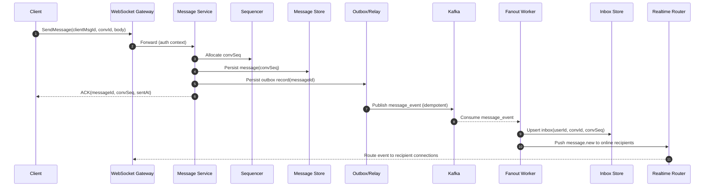

## Overview

A production chat system is deceptively complex: beyond “send and receive messages,” it must deliver low-latency real-time experiences while supporting offline devices, multi-device sync, receipts, presence/typing, media, abuse controls, and reliability under partial failure (retries, duplicates, regional outages).

A scalable design separates the system into two planes:

- **Real-time plane**: WebSocket gateways + ephemeral routing/presence optimized for connection scale and low latency. This plane can degrade (e.g., typing disabled) without compromising durability.
- **Durable event plane**: message persistence + delivery events optimized for durability, replay, and backpressure.

For **group delivery**, avoid “N×M amplification” by using **hybrid fan-out**:
- **Small groups**: fan-out-on-write into per-user inboxes (fast sync, cheap unread counts).
- **Large groups/channels**: store once; deliver via cursors + “pull” semantics (bounded write amplification). Real-time push becomes “new watermark available,” not “push every message to every user.”

The document assumes a WhatsApp/Slack-like experience with server-assigned ordering and at-least-once delivery (client dedup required).

---

## Requirements

### Functional Requirements
- 1:1 and group messaging across web/mobile; multi-device per user.
- Real-time delivery to online devices (WebSocket); offline via sync + optional push notifications.
- Offline sync that reconciles device state and fills gaps after reconnects.
- Delivery/read receipts (monotonic “read up to” semantics); typing indicators; presence (online/last seen).
- Group management: create, invite/kick, roles, membership changes.
- Media: secure upload/download, thumbnails, virus scanning hooks.
- Abuse controls: rate limits, spam detection, reporting hooks, admin/audit logs.

### Non-Functional Requirements (Concrete Targets)
**Scale (example sizing)**
- **DAU**: 20M
- **Peak concurrent connections**: 2M (10% of DAU)
- **Messages ingested**: 10B/day (avg ~116k msgs/s), **peak** 300k msgs/s (bursty)
- **Typical payload**: 0.2–2 KB text + metadata; media handled out-of-band
- **Group sizes**: median < 10; long tail up to 100k+ (channels)

**Latency SLOs (per region, steady state)**
- **Send ACK** (client → server ACK after durable commit): P50 < 50 ms, P99 < 200 ms
- **Online delivery** (sender ACK → recipient sees event): P50 < 100 ms, P99 < 400 ms
- **Sync fetch**: P99 < 1 s for 500 messages (excluding media download)

**Availability**
- **Send/receive APIs**: 99.99% monthly
- **Presence/typing**: 99.9% monthly (allowed to degrade)

**Consistency**
- **Messages**: durable; **total order within a conversation** (server-assigned `convSeq`)
- **Authorization / membership**: strongly consistent for access decisions
- **Presence/typing**: best-effort/eventual

**Durability / DR**
- No silent message loss (at-least-once delivery; duplicates possible).
- Regional disaster recovery: **RPO ≤ 1 minute**, **RTO ≤ 30 minutes**.

### Constraints & Assumptions
- Multi-region deployment; clients connect to nearest region.
- Encryption in transit and at rest; audit logs for admin actions.
- Optional end-to-end encryption (E2EE) described as an extension, not baseline.
- Prefer managed infrastructure where possible; design remains portable.

---

## Architecture

### High-Level Diagram

```mermaid
flowchart TB
  C[Client (Web/Mobile)] --> E[Edge LB + WAF]
  E --> AGW[HTTP API Gateway]
  E --> WSGW[WebSocket Gateway]

  subgraph Durable["Durable Event Plane"]
    MS[Message Service]
    SEQ[Sequencer / Order Allocator]
    MDB[(Message Store\nCassandra/Scylla)]
    OUT[Outbox / Publish Relay]
    K[(Kafka / Event Log)]
    F[Fanout Workers]
    INB[(Inbox Index\nKV: DynamoDB/Scylla)]
    RDB[(Metadata DB\nPostgres / Spanner-like)]
  end

  subgraph Realtime["Real-Time Plane"]
    RR[Realtime Router]
    PRES[(Presence Store\nRedis/Aerospike TTL)]
  end

  subgraph Media["Media Plane"]
    MED[Media Service]
    OBJ[(Object Storage\nS3/GCS)]
    CDN[CDN]
  end

  AGW --> MS
  AGW --> MED
  WSGW <--> RR
  RR <--> PRES

  MS --> RDB
  MS --> SEQ
  MS --> MDB
  MS --> OUT
  OUT --> K
  K --> F
  F --> INB
  F --> RR

  MED --> OBJ
  OBJ --> CDN
  CDN --> C
```

### Key Principles
- **Durable commit before ACK**: sender gets ACK only after the message is durably committed (and is guaranteed to be eventually fanned out via replayable events).
- **At-least-once end-to-end**: the system tolerates retries; clients deduplicate by `messageId`.
- **Separation of concerns**: gateways route; durable services decide correctness; ephemeral services can fail without losing messages.
- **Hybrid group delivery**: bounded cost for large groups and fast sync for small groups.

---

## Components

### WebSocket Gateway
**Responsibility**
- Maintain persistent connections; authenticate; multiplex events (messages, receipts, typing, presence).
- Apply backpressure and fairness (prevent a single user/group from saturating outbound queues).

**Design**
- Stateless gateway nodes; connection state held in-process; minimal shared state.
- Authentication via short-lived access token; refresh via HTTP; enforce per-connection quotas.
- Backpressure strategy:
  - Prioritize message notifications over typing/presence.
  - Drop or coalesce low-value signals (typing bursts, repeated presence).
  - Bound per-connection outbound queue; disconnect “stuck” clients.

**Scaling**
- Horizontal scaling; shard connections by `userId` (consistent hashing) to reduce cross-node routing.
- Typical sizing: 50–150 KB RAM per connection (buffers + metadata) → 2M conns implies ~100–300 GB aggregate memory across fleet.

---

### Realtime Router (Presence/Typing/Event Push)
**Responsibility**
- Route events to the correct gateway node(s) for a given user/device.
- Maintain ephemeral presence/typing state.

**Design**
- Presence via TTL heartbeats (e.g., 30s TTL, heartbeat every 10s); “online” = heartbeat exists.
- For large groups/channels, push **watermark notifications** (e.g., “new messages up to seq=123”) rather than per-recipient per-message pushes.
- Multi-device: route to all active device sessions for a user; apply per-user/device limits.

**Storage/Tech**
- Redis Cluster / Aerospike for TTL keys (presence) + lightweight routing index.
- Pub/sub or streaming for intra-plane routing (Redis pub/sub, NATS, or Kafka topic depending on latency/scale).

---

### Message Service (Send Path + History)
**Responsibility**
- Validate, authorize membership, enforce rate limits.
- Assign `messageId` and **conversation-local order** `convSeq`.
- Persist message; ensure reliable publishing to the event log.
- Serve history reads (paged by `convSeq`).

**Ordering (`convSeq`)**
- Allocate a strictly increasing sequence per conversation:
  - Use a **Sequencer** that hands out ranges (leases) per conversation shard to amortize coordination.
  - The message service assigns `convSeq` from its leased range; on lease exhaustion, it renews via CAS/transaction in the sequencer store.
- This preserves total order within a conversation even under retries.

**Reliable publish**
- Use a **publish relay / outbox** so the system never “ACKs but fails to publish”:
  - Persist message + an outbox record together in the same durability boundary (implementation options below).
  - A relay reads the outbox and publishes to Kafka; publishing is idempotent.

**Implementation options (choose one)**
- **Option A (common)**: Message persisted in Cassandra; outbox persisted in Postgres (same request) is not truly atomic across stores—mitigate by treating Cassandra as source of truth and running a periodic “message-to-event” reconciler.
- **Option B (stronger)**: Use Kafka as the durable append log (ACK after Kafka `acks=all`), then materialize to Cassandra/inbox asynchronously. (More moving parts on reads, but very replayable.)
- **Option C (managed distributed DB)**: Use a single strongly consistent DB for message+outbox (Spanner/Cockroach/FoundationDB) if the scale/cost trade-off is acceptable.

This document assumes **Option A** with a reconciler for production hardening.

---

### Fanout Workers (Delivery Expansion)
**Responsibility**
- Consume message events; update delivery indexes; trigger realtime and push notifications.

**Hybrid fan-out strategy**
- **Small groups (≤ ~200 members, tunable)**:
  - Write inbox entries per recipient for fast offline sync and easy unread counts.
  - Push per-message realtime events to online devices.
- **Large groups/channels**:
  - Avoid per-recipient inbox writes.
  - Update a conversation “high watermark” (implicitly the newest `convSeq`).
  - Push a compact notification (conversationId + newestSeq) to online members; clients pull messages.
  - Unread counts computed from `(latestSeq - lastReadSeq)` with per-user cursors.

**Processing semantics**
- At-least-once consumption from Kafka.
- Idempotency at recipient update boundary:
  - For small groups: idempotent `(userId, conversationId, convSeq)` inbox insert.
  - For large groups: idempotent updates to per-user cursor/watermark notifications.

---

### Inbox & Sync Service
**Responsibility**
- “What did I miss since cursor X?” across devices.
- Efficient unread counters and reconciliation.

**Design**
- Maintain per user per conversation:
  - `lastDeliveredSeq` (what server believes has been delivered to any device)
  - `lastReadSeq` (what user has read, monotonic)
- Sync uses:
  - **Inbox index** for small groups: fetch recent `(conversationId, convSeq)` references, then hydrate messages.
  - **History scan** for large groups: fetch messages by `convSeq` range since `lastDeliveredSeq`.

**Retention**
- Inbox entries TTL (e.g., 30–90 days) to bound storage cost; message history retention is independent (e.g., 1–5 years, policy-driven).
- If inbox entries expire, sync falls back to message store using `lastDeliveredSeq`.

---

### Media Service
**Responsibility**
- Upload initiation and authorization; generate pre-signed URLs; store metadata; deliver via CDN.

**Design**
- Upload flow:
  - Client requests upload session → server returns pre-signed PUT + constraints (size/type).
  - Client uploads to object store directly.
  - Client sends message referencing `mediaId`.
- Security:
  - Enforce per-conversation ACLs on download (signed URLs or tokenized proxy).
  - Optional malware scanning pipeline for files before making them downloadable.
- Thumbnails:
  - Async thumbnail generation; store derivative keys; CDN-cacheable.

---

## Data Model

### Core Entities
- **Conversation**: `conversationId`, type (1:1/group/channel), metadata.
- **Message**: immutable event with edits/deletes represented as new events referencing prior message.
- **Cursor**: opaque client sync token mapping to server-side position (per device/user).

### Storage Schema (Illustrative)

**Strongly consistent metadata (Postgres / Spanner-like)**
- `users(user_id, created_at, status, ...)`
- `conversations(conversation_id, type, created_at, created_by, home_region, fanout_mode)`
- `conversation_members(conversation_id, user_id, role, joined_at, left_at, membership_version, notification_settings)`
- `devices(device_id, user_id, platform, push_token, last_seen_at)`
- `conversation_seq_leases(conversation_id, shard_id, lease_owner, seq_hi, lease_expires_at)` (if using lease-based sequencing)

**Message store (Cassandra/Scylla)**
- `messages_by_conversation`
  - Partition key: `(conversation_id, time_bucket)` (e.g., day/week) to avoid unbounded partitions
  - Clustering: `conv_seq ASC`
  - Columns: `conv_seq, message_id, sender_id, sent_at, kind, payload, media_refs, edit_of, deleted_at`
- `message_dedup_by_sender`
  - Key: `(sender_id, client_msg_id)` → `message_id, conversation_id, conv_seq, sent_at` (TTL 7–30 days)

**Inbox index (KV: DynamoDB/Scylla KV) for small-group fanout**
- `inbox_by_user`
  - Partition key: `user_id`
  - Sort key: `(bucket_ts, conversation_id, conv_seq)` (append-only, query by cursor)
  - Attributes: `message_id, sent_at`
- `user_conversation_state`
  - Key: `(user_id, conversation_id)` → `last_delivered_seq, last_read_seq, muted, updated_at`

**Receipts**
- Prefer aggregated receipts for groups:
  - `user_conversation_state.last_read_seq` = “read up to”
- Optional per-message receipts for 1:1/small groups:
  - `delivery_receipts(message_id, user_id) -> delivered_at, device_id` (bounded by group size thresholds)

**Presence (ephemeral)**
- `presence:user:{userId}` → `{gatewayId, lastHeartbeat}` (TTL)

**Media**
- Object store: `media/{mediaId}` and `thumb/{mediaId}`
- Metadata: `media(media_id, owner_id, content_type, size, checksum, created_at, object_key, thumbnail_key, scan_status)`

---

## Data Flow

### Send + Deliver (Small Group)



### Large Group/Channel (Bounded Fan-out)
- Fanout worker **does not** write per-recipient inbox entries.
- Fanout worker pushes a compact realtime event: `conversation.updated {conversationId, latestSeq}` to online members (or only to members currently online in that region).
- Clients pull via `GET /messages?fromSeq=...`.

This trades write amplification for slightly more client pull traffic and more complex unread calculations.

---

## API

All endpoints require authentication (Bearer token). Use consistent error envelopes, request IDs, and idempotency.

### Authentication
- `POST /v1/auth/token`
  - Returns short-lived access token + refresh token (or session cookie).
  - Errors: `401` invalid credentials, `429` throttled.

### Messaging
- `POST /v1/conversations/{conversationId}/messages`
  - Headers: `Idempotency-Key: <uuid>`
  - Request:
    ```json
    { "clientMsgId":"uuid", "kind":"text", "body":"hi", "mediaIds":["..."] }
    ```
  - Response:
    ```json
    { "messageId":"snowflake-or-uuid", "convSeq":12345, "sentAt":"2025-01-01T00:00:00Z" }
    ```
  - Semantics:
    - Idempotent on `(senderId, conversationId, clientMsgId)` or `Idempotency-Key`.
    - ACK after durable commit; delivery is asynchronous.
  - Errors: `403` not a member, `409` membership changed (stale version), `413` payload too large, `429` rate limited.

- `GET /v1/conversations/{conversationId}/messages?fromSeq=12000&limit=200`
  - Returns ordered messages (ascending by `convSeq`); pagination via `fromSeq` or `beforeSeq`.

### Sync
- `POST /v1/sync/inbox`
  - Request:
    ```json
    { "deviceId":"...", "cursor":"opaque", "limit":1000 }
    ```
  - Response:
    ```json
    { "nextCursor":"opaque", "entries":[{"conversationId":"...","convSeq":12345,"messageId":"...","sentAt":"..."}] }
    ```
  - Notes:
    - Cursor encodes `(bucket_ts, last_sort_key)`; stable and idempotent.
    - For large groups, entries may contain only conversation watermark updates.

- `GET /v1/conversations/{conversationId}/state`
  - Response includes `lastReadSeq`, `lastDeliveredSeq`, `latestSeq`, `fanoutMode` to support efficient client reconciliation.

### Receipts
- `POST /v1/conversations/{conversationId}/read`
  - Request:
    ```json
    { "convSeq":12345, "deviceId":"..." }
    ```
  - Semantics: monotonic; server persists `last_read_seq = max(last_read_seq, convSeq)` and emits a receipt event.

### WebSocket
- Connect: `wss://.../v1/ws?token=...`
- Frames (versioned envelope):
  - `message.new` (small groups: may include message payload; large groups: may include only watermark)
  - `conversation.updated` (watermark-based)
  - `receipt.read`, `receipt.delivered`
  - `typing.start`, `typing.stop`, `presence.update`
- Reliability:
  - Client retries with exponential backoff + jitter.
  - Server may request resync if it detects gaps (e.g., via last seen sequence hints).

### Groups
- `POST /v1/groups`
  - Request: `{ "name":"...", "members":[{"userId":"...","role":"member"}] }`
- `POST /v1/groups/{groupId}/members`
  - Request: `{ "userId":"...", "role":"member" }`
- Membership is versioned (`membership_version`) so caches can safely detect staleness.

### Media
- `POST /v1/media/uploads`
  - Request: `{ "contentType":"image/png", "size":123456, "checksum":"sha256:..." }`
  - Response: `{ "mediaId":"...", "uploadUrl":"...", "headers":{...} }`
- `GET /v1/media/{mediaId}/download`
  - Returns a short-lived signed URL (or streams via proxy).

---

## Scaling & Performance

### Bottlenecks and Mitigations

**1) WebSocket connection fleet**
- Costs: TLS CPU, memory per connection, outbound queueing.
- Mitigations:
  - Efficient binary framing (protobuf), compression for large payloads (careful with CPU).
  - Connection autoscaling based on open conns and egress.
  - Hard bounds on per-connection outbound buffers.

**2) Fan-out amplification**
- Large groups can turn one send into 100k writes.
- Mitigations:
  - Hybrid fan-out threshold (start with ~200; tune with production data).
  - Watermark-based push for large groups; client pull.
  - Batch writes for inbox inserts; per-group rate limits.

**3) Hot conversations**
- Very active conversations can hotspot partitions.
- Mitigations:
  - Partition messages by `(conversationId, timeBucket)` and keep `convSeq` for ordering.
  - Cache recent pages; keep metadata hot in Redis with version validation.

**4) Receipt storms**
- Per-message read receipts do not scale for large groups.
- Mitigations:
  - Use “read up to seq” per user per conversation for groups.
  - Rate limit receipt writes; coalesce multiple updates.

### Partitioning Strategy
- **Kafka**: partition key = `conversationId` to preserve per-conversation event order.
- **Message store**: partition by `(conversationId, timeBucket)`; clustering by `convSeq`.
- **Inbox store**: partition by `userId`, sort by time/seq for efficient cursor scans.

### Caching
- Redis:
  - Presence/typing (seconds TTL).
  - Hot membership and conversation metadata (minutes TTL) validated by `membership_version`.
  - Recent message pages for hot conversations (10–60s TTL).
- Client:
  - Local DB (SQLite) to store messages and allow fast offline UI; sync is incremental.

### Multi-Region Considerations (Ordering vs Latency)
Active-active writes with strict per-conversation ordering is hard if every region can assign order independently. A practical production approach:
- Assign each conversation a **home region/shard** responsible for `convSeq` allocation.
- Clients connect to nearest region; if not in home region:
  - The edge proxies the send to the home region (or uses an anycast layer).
- Reads and sync are served locally from replicated stores when possible.

This preserves ordering and simplifies correctness at the cost of occasional cross-region write latency for conversations whose home region is far from a sender. Re-homing (optional) can mitigate long-term skew.

---

## Trade-offs & Alternatives

### Key Trade-offs
- **Durable event log + async fanout** vs synchronous “push to everyone before ACK”
  - Cost: more components, eventual delivery to offline inbox.
  - Benefit: backpressure, replayability, decoupled scaling, resilience to downstream outages.

- **Hybrid fan-out** vs fan-out-on-write for all groups
  - Cost: more complex client/server sync for large groups; watermark/pull path.
  - Benefit: bounded write amplification and predictable cost for large channels.

- **Strict per-conversation sequencing (`convSeq`)** vs timestamp-based ordering
  - Cost: sequencing coordination and operational complexity.
  - Benefit: stable ordering semantics under clock skew and retries; simpler client reconciliation.

### Alternatives (When to Choose Them)
- **Pure fan-out-on-read** (store once; everyone pulls)
  - Good for extremely large broadcast channels; worse for typical small-group chat due to read amplification and expensive unread counts.

- **Single datastore (e.g., all DynamoDB)**
  - Simpler ops, but strong consistency for membership + high-throughput ordered message history often benefits from specialized stores and access patterns.

- **CRDT-based messaging**
  - Useful for fully offline-first collaboration; higher complexity and different UX expectations than typical chat.

- **E2EE-first architecture**
  - Strong privacy but impacts server-side features (search, moderation, previews). Often introduced incrementally per conversation type.

---

## Failure Modes

### Failure Scenarios & Mitigations

**Kafka outage / severe consumer lag**
- Impact: messages can be durably committed but delivery is delayed.
- Detection: consumer lag, under-replicated partitions, end-to-end “send→delivered” SLO burn.
- Mitigation:
  - Multi-AZ Kafka, aggressive monitoring, autoscale consumers.
  - Replay after recovery; prioritize watermark pushes to online users.
  - Optional: temporary “direct push to online only” fast path (still rely on replay for correctness).

**Message store partial unavailability**
- Impact: send fails (if commit requires it) and/or history reads degrade.
- Detection: elevated write/read latency, quorum failures.
- Mitigation:
  - Multi-AZ replication with `LOCAL_QUORUM`.
  - Fail fast with client retry; allow client to queue unsent messages locally.
  - If using Kafka-as-log (Option B), send may still succeed while materialization lags.

**Duplicates from retries (client or internal)**
- Impact: user-visible duplicates if not deduped.
- Detection: dedup hit rate changes, user reports, anomaly detection on duplicate `clientMsgId`.
- Mitigation:
  - Idempotency keys; `message_dedup_by_sender` table; idempotent inbox inserts.
  - Client dedupe by `messageId` (and reconcile via `convSeq`).

**Presence/typing store failure**
- Impact: incorrect/absent presence and typing indicators; messaging remains correct.
- Detection: Redis/Aerospike error rates, TTL miss spikes.
- Mitigation: degrade gracefully (disable typing/presence), keep messaging independent.

**Large group receipt storm**
- Impact: write QPS spike; increased p99 latencies.
- Detection: receipt QPS, hot keys, p99 spikes.
- Mitigation: aggregated “read up to seq” only; rate limit; batch/coalesce.

### Disaster Recovery
- Targets: **RPO ≤ 1 minute**, **RTO ≤ 30 minutes** (regional).
- Backups:
  - Cassandra/Scylla snapshots + incremental backups; validated restores.
  - Postgres PITR.
  - Kafka replication + mirror topics to secondary region if required by RPO.
- Failover:
  - Route clients to healthy region via DNS/anycast; reconnect on client side.
  - Replay from Kafka offsets; rebuild caches and derived indexes from durable stores.

---

## Operations

### Observability (Golden Signals + Domain Metrics)
- **Gateway**: open conns, reconnect rate, handshake failures, outbound queue depth, egress, CPU/mem per node.
- **Message service**: send QPS, auth failures, idempotency hit rate, `convSeq` allocation errors, persist p99, per-conversation rate limiting.
- **Event plane**: Kafka produce latency, consumer lag, partition skew, DLQ volume.
- **Stores**:
  - Cassandra p99 read/write, compaction backlog, tombstones, partition sizes.
  - Redis evictions/latency for presence.
- **User-perceived SLOs**:
  - “send→ACK”, “ACK→delivered”, “sync duration”, “duplicate rate”, “gap rate”.

### Deployment & Evolution
- Progressive delivery (canary by region + % of users); feature flags for:
  - fanout thresholds/modes, watermark vs full push, receipt behavior.
- Backward-compatible schemas:
  - Versioned WebSocket envelope and protobuf/JSON evolution (reserved fields).
- Safe rollbacks:
  - Keep previous Kafka consumer groups available; use dual-write/dual-read only when necessary.

### Security & Abuse
- Rate limits per user/device/conversation; adaptive throttling for spam bursts.
- Content moderation hooks (server-side for non-E2EE); reporting pipeline; audit logging.
- Media scanning and quarantine; signed URL expirations; least-privilege IAM.
- Data privacy: retention policies, GDPR deletion workflow, encryption key management.

### Capacity Planning (Rule-of-Thumb)
- Start with measured baselines:
  - Connection memory per gateway, CPU per message send, Kafka partition throughput, inbox write cost.
- Plan for burst:
  - 300k msgs/s peak implies absorbing spikes via Kafka and backpressure; avoid synchronous fanout coupling.

---

## References & Further Reading
- Kafka documentation (idempotent producers, consumer lag): https://kafka.apache.org/documentation/
- Cassandra/Scylla data modeling (wide rows, time buckets): https://cassandra.apache.org/doc/latest/
- Transactional outbox pattern: https://microservices.io/patterns/data/transactional-outbox.html
- WhatsApp scalability patterns (high-level): https://www.infoq.com/presentations/whatsapp-scalability/
- Redis patterns for ephemeral state: https://redis.io/docs/latest/