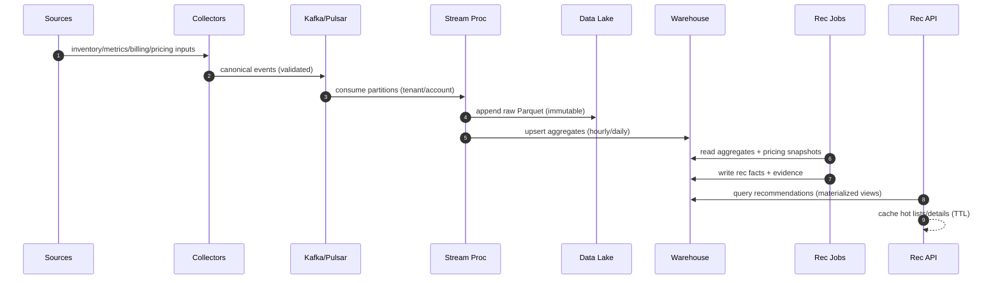

# Cloud Cost Optimization Platform

## Overview

A cloud cost optimization (FinOps) platform continuously ingests infrastructure inventory, utilization telemetry, and billing/pricing dimensions, then produces actionable recommendations (e.g., rightsizing, commitment planning, spot/preemptible adoption) with quantified savings and risk. The core challenge is not “running analytics”; it is building a trustworthy decision system in the presence of incomplete/delayed data, complex pricing rules, spiky workloads, and operational/safety constraints.

A production-grade design separates concerns into:

1. **Ingestion & normalization**: multi-cloud signals (inventory, metrics, billing) normalized into canonical schemas with provenance.
2. **Canonical cost + utilization model**: durable, replayable data foundation (raw + curated) that supports explainability and recomputation.
3. **Recommendation engine**: conservative-by-default algorithms with explicit evidence windows, confidence/risk scoring, and guardrails.
4. **Control plane**: strongly consistent workflows (accept/ignore/snooze/apply), auditability, and tenant isolation.

The system supports **batch** computation (daily/weekly, cost-effective and stable) plus **near-real-time** updates (hourly for high-impact fleets) to balance freshness, cost, and correctness.

---

## Requirements

### Functional Requirements

**Ingestion & integration**
- Connect customer cloud accounts across AWS/Azure/GCP; discover resources (compute, autoscaling groups, K8s node pools, block storage, managed DBs, LBs, etc.).
- Ingest utilization metrics (CPU, memory, disk, network) and events (scales, deployments, interruptions) with attribution to canonical resources, apps, and tags/labels.
- Ingest billing exports (AWS CUR, GCP Billing Export, Azure Cost Management) and map charges to resources/tags where possible.
- Ingest and normalize pricing catalogs (on-demand, spot/preemptible, regional variations) and customer-specific effective pricing where supported (RIs/Savings Plans/CUDs via amortization inputs).

**Optimization recommendations**
- Rightsizing for compute and fleets (instance shapes, min/max, target utilization bands) with estimated savings and impact.
- Commitment planning (RIs/Savings Plans/CUDs): coverage analysis, break-even, and purchase suggestions with horizon.
- Spot/preemptible strategies (mixed-instance policies, diversification, fallback capacity) with interruption risk scoring and rollout guidance.
- Storage optimization (underutilized volumes, tiering, orphaned snapshots) and idle resource cleanup where reliable.

**Explainability & governance**
- UI and API to browse recommendations, filter by org/account/app/tag, and see “why” (evidence window, percentiles, headroom, data coverage, pricing assumptions).
- Workflows: accept/ignore/snooze, bulk actions, export (CSV/BI), and optional “apply via IaC/automation” with approvals and change windows.
- Track recommendation history and outcomes; estimate vs. realized savings with attribution and confidence intervals where feasible.
- Reporting: weekly digest, anomaly flags (spend spikes, idle fleets), and policy checks (e.g., “no public IPs”, “require tags”).

### Non-Functional Requirements

**Scale (define typical + peak)**
- Tenancy: up to **5,000 tenants**, up to **50,000 cloud accounts**.
- Inventory (canonical resources):
  - Typical: **10–30M** total resources, **0.5–2M** active compute instances/nodes.
  - Peak (largest customers + K8s): up to **80M** total resources, **5M** active compute (fleet-level recommendation focus).
- Metrics ingest (post-normalization):
  - Typical: **100k–300k samples/sec** sustained.
  - Peak: **1M samples/sec** during bursts or large tenant onboarding.
  - Raw volume: **2–10 TB/day** compressed (highly tenant-dependent; pod/container metrics can explode cardinality).
- Batch computation:
  - Daily recompute over **30 days** history for most resources.
  - Hourly incremental updates for top fleets/resources (e.g., top 20% by spend).

**Latency & freshness**
- API/UI read paths:
  - “List recommendations” (cached/materialized): **P50 ≤ 120ms**, **P99 ≤ 500ms**.
  - Recommendation detail (“why” with evidence summary): **P50 ≤ 200ms**, **P99 ≤ 800ms**.
- Control-plane writes (actions): **P99 ≤ 300ms**.
- Freshness SLOs:
  - Inventory freshness: **≤ 6 hours** for 99% of accounts (with “as of” shown).
  - Metrics freshness to aggregates: **≤ 2 hours** for hourly updates (best effort per tenant).
  - Billing ingestion: typically **daily** (CUR/billing exports are not real-time); anomaly signals may be hourly if supported.
  - Pricing catalog updates: **≤ 1 hour** from detection to availability (provider changes are rare; internal validation dominates).

**Availability & durability**
- Read APIs/UI: **99.95%** monthly.
- Control-plane write APIs: **99.9%** monthly.
- Data ingestion: **99.9%** monthly (graceful degradation + backfill).
- Durability:
  - Raw telemetry & billing exports in object storage with **11×9s** durability.
  - Control plane RPO **≤ 15 minutes**, RTO **≤ 2 hours**.
  - Analytics can rebuild from lake; target restore **≤ 24 hours**.

**Consistency model**
- Strong consistency: auth/RBAC, recommendation state transitions, idempotency, audit log.
- Eventual consistency: metrics, aggregates, derived recommendations, dashboards.

**Security & compliance**
- Multi-tenant isolation is mandatory (tenant-aware authz everywhere; no cross-tenant joins without explicit admin tooling).
- Encryption in transit/at rest; secret management; least-privileged cloud access; support read-only by default.
- SOC2 Type II controls: audit trails, change management, access reviews, incident response.

### Constraints & Assumptions
- Team size ~8–12 engineers; prefer managed services (managed Kafka, hosted warehouse/TSDB) to reduce ops burden.
- K8s environments produce high-cardinality telemetry; default to **fleet-level** optimization (node pools/ASGs) and retain high-res per-workload only as opt-in.
- Billing exports are delayed; the platform must clearly label timestamps and assumptions.

### Non-Goals (initial scope)
- Fully autonomous “apply” without human approval.
- Per-request real-time cost attribution (this is a separate, latency-sensitive product).
- Perfect mapping of every line-item charge to every resource (many charges are shared/usage-based).

---

## Architecture

### High-Level Diagram

```mermaid
flowchart TB
  %% Control plane
  Client[Web UI / API Clients] --> WAF[WAF / DDoS Protection]
  WAF --> GW[API Gateway]
  GW --> Auth[AuthN/AuthZ (OIDC, RBAC)]
  GW --> RecAPI[Recommendation API]
  GW --> AdminAPI[Admin/Integration API]

  RecAPI --> Cache[(Redis / Cache)]
  RecAPI --> Ctrl[(Postgres: Control Plane)]
  RecAPI --> Wh[(Warehouse: Analytics Serving)]

  AdminAPI --> Ctrl

  %% Data plane
  subgraph DataPlane["Data Plane (Ingestion + Analytics)"]
    direction TB

    subgraph Sources["Sources"]
      CloudAPI[Cloud Provider APIs\nInventory/Tags] 
      Metrics[Metrics\nCloudWatch/Azure Monitor/OTLP/Remote-Write]
      Billing[Billing Exports\nCUR / Billing Export]
      PriceFeeds[Pricing Catalogs\nOn-demand/Spot]
    end

    Collect[Collectors/Connectors] --> Bus[(Event Bus: Kafka/Pulsar)]
    CloudAPI --> Collect
    Metrics --> Collect
    Billing --> Collect
    PriceFeeds --> PriceSvc[Pricing Normalization Service]

    Bus --> Stream[Stream Processor\n(Flink/Streams)]
    Stream --> Lake[(Object Store Data Lake\nParquet + partitions)]
    Stream --> Agg[(Curated Aggregates\nHourly/Daily)]
    Agg --> Wh

    PriceSvc --> Wh

    Wh --> Batch[Batch Recommendation Jobs\n(SQL/dbt/Spark)]
    Batch --> Wh
  end

  %% Cross-plane dependency
  Ctrl --> Batch
```

### Key architectural choices (why)
- **Object store data lake as the source of truth** for replayability, audits, and recomputation.
- **Warehouse for serving** interactive recommendation queries via materialized views and columnar scans.
- **TSDB optional** for short-window, high-resolution debugging charts; keep it bounded by retention and cardinality controls (see Scaling).
- **Control plane separate from analytics** to keep workflows strongly consistent even if the data pipeline is delayed.

---

## Components

### 1) Collectors / Connectors

**Responsibility**
- Discover inventory, ingest telemetry, ingest billing exports, normalize into canonical events.

**Design**
- Provider-specific connectors emit canonical schemas:
  - `ResourceUpsert`, `MetricSample`, `BillingLineItem`, `PricingSnapshotRef`, `IntegrationHealth`.
- Support both pull (cloud APIs) and push (OTLP / Prometheus remote-write).
- Explicit provenance: every record includes `source`, `observed_at`, `ingested_at`, `schema_version`, and `collector_version`.

**Operational safety**
- Per-account rate limiting and quota-aware scheduling.
- Retry with jittered backoff; spool to local disk for transient outages; bounded buffers to avoid unbounded cost.
- “Data freshness” surfaced to users per account and per dataset (inventory/metrics/billing).

**Recommended tech**
- Go-based collectors; OpenTelemetry Collector for metrics ingestion; managed secrets store (KMS + vault service).

---

### 2) Event Bus + Stream Processor

**Responsibility**
- Buffer bursts, validate schemas, deduplicate, enrich events, and compute early aggregates (hourly/daily).

**Design**
- Topics partitioned by `(tenant_id, account_id)` to localize state and simplify tenant-level backpressure.
- Schema registry (Avro/Protobuf) with compatibility checks; reject or route incompatible payloads to a DLQ.
- Exactly-once where it matters (aggregate correctness) via transactional sinks or idempotent upserts; accept at-least-once for raw lake writes.

**Recommended tech**
- Managed Kafka (or Pulsar) + Flink (or Kafka Streams) + Schema Registry.

---

### 3) Storage: Data Lake + Warehouse (+ Optional TSDB)

**Data Lake (immutable)**
- Append-only Parquet; partition by `dt`, `tenant_id`, `event_type`, `account_id`.
- Used for backfills, audits, and pipeline replay.

**Warehouse (curated + serving)**
- Curated tables:
  - `resource_dim`, `metric_hourly`, `cost_daily`, `pricing_snapshot_dim`, `recommendations`.
- Serving patterns:
  - Materialized views for “top savings”, “by tag/app/team”, “open recommendations”.
  - Clustering on `(tenant_id, day)` and `(tenant_id, resource_id)` to minimize scans.

**Optional TSDB**
- Used only for explainability charts (e.g., last 7–14 days per resource/fleet).
- Enforce cardinality controls; default to fleet-level series; allow opt-in high-card debugging with short retention.

---

### 4) Pricing & Cost Attribution Service

**Responsibility**
- Normalize provider price books and compute effective hourly rates used in savings estimates.

**Key concept: versioned pricing snapshots**
- Every recommendation references a `pricing_snapshot_id` so savings estimates are reproducible and auditable.

**Models supported**
- **List price**: on-demand public rates, spot/preemptible history ranges.
- **Amortized effective cost** (where inputs exist): allocate commitment costs across eligible usage (RI/SP/CUD coverage), producing effective rates and confidence labels.
- Clearly label which model is used per estimate (avoid mixing silently).

---

### 5) Recommendation Engine

**Responsibility**
- Generate recommendations with evidence, savings estimates, and risk/confidence scoring.

**Rightsizing (compute/fleet)**
- Use robust statistics to handle spiky workloads:
  - Evidence window: 14–30 days.
  - Compute `P95` (or `P99` for latency-critical tiers) for CPU and memory.
  - Apply headroom: `target = max(P95) * (1 + headroom)` where headroom typically 20–30%.
  - Require minimum evidence: ≥ 7 days, ≥ 90% expected samples, and stability checks (e.g., coefficient of variation below threshold).
- Prefer fleet-level (ASG/MIG/node pool) recommendations:
  - Recommend min/max and instance mix changes rather than single-node changes where autoscaling exists.

**Spot/preemptible**
- Classify suitability:
  - Stateless/batch vs stateful, SLO sensitivity, autoscaling presence, restart time, and disruption budget.
- Provide rollout plan:
  - Start with 5–10% spot, diversify instance families, set fallback on-demand, and enforce interruption handling.
- Risk score inputs:
  - Interruption rates by region/type, historical churn of nodes, and workload disruption tolerance.

**Confidence & risk**
- `confidence` reflects evidence quality and model fit (coverage, stability, mapping quality).
- `risk_score` reflects blast radius and sensitivity (SLO tier, statefulness, workload criticality, change magnitude).

**Output**
- Recommendations are immutable records with status transitions and linked evidence.

---

### 6) Control Plane (API/UI)

**Responsibility**
- Strongly consistent workflows and governance: actions, approvals, audit, exports.

**Design**
- Postgres for metadata, state machine, idempotency, and audit logs.
- Cache hot read paths (dashboards, list pages) in Redis with short TTLs and event-driven invalidation.
- Always show “as of” timestamps and dataset freshness to set expectations.

---

## Data Model

### Control Plane (Postgres)

Core tables (illustrative):
- `tenants(tenant_id PK, name, created_at)`
- `accounts(account_id PK, tenant_id, provider, external_account_id, status, created_at)`
- `integrations(integration_id PK, tenant_id, account_id, type, config_encrypted, last_sync_at, health_status)`
- `recommendation_state(rec_id PK, tenant_id, status, status_reason, updated_at, version)`
- `recommendation_actions(action_id PK, tenant_id, rec_id, actor_id, action, payload_json, idempotency_key, created_at)`
  - `action ∈ {ACCEPT, IGNORE, SNOOZE, APPLY_REQUESTED, APPLY_APPROVED, APPLY_REJECTED, UNSNOOZE}`
- `idempotency_keys(tenant_id, key, request_hash, response_json, created_at, expires_at, PRIMARY KEY(tenant_id, key))`
- `audit_log(event_id PK, tenant_id, actor_id, event_type, payload_json, created_at)`
  - Append-only; consider WORM export to object storage for tamper resistance.

**Isolation**
- Every table includes `tenant_id`.
- Enforce tenant isolation via:
  - application-level query enforcement + automated tests, and
  - row-level security (RLS) where feasible.

---

### Analytics (Warehouse, columnar)

Curated schemas (illustrative):
- `resource_dim(tenant_id, resource_id, provider, account_id, region, service, resource_type, shape, tags_map, first_seen, last_seen)`
- `metric_hourly(tenant_id, resource_id, hour_ts, cpu_p50, cpu_p95, mem_p95, net_p95, samples, expected_samples, coverage)`
- `cost_daily(tenant_id, resource_id, day, list_cost_usd, amortized_cost_usd, shared_cost_usd, currency, attribution_quality)`
- `pricing_snapshot_dim(pricing_snapshot_id, provider, region, sku, purchase_option, price_per_unit, unit, effective_at)`
- `recommendations(rec_id, tenant_id, resource_id, rec_type, created_at, valid_until, pricing_snapshot_id, current_state_json, recommended_state_json, est_savings_monthly_usd, confidence, risk_score, rationale_json)`
- `recommendation_evidence(rec_id, tenant_id, window_start, window_end, coverage, stats_json, generated_at)`
- `savings_realized(tenant_id, resource_id, day, predicted_savings_usd, realized_savings_usd, method, confidence)`

**Notes**
- Keep `recommendations` immutable in the warehouse; status lives in control plane (`recommendation_state`) to keep workflows strongly consistent.
- Store `rationale_json` and `stats_json` as structured JSON with a schema version.

---

### Data Lake (Parquet)

- `raw_events/dt=YYYY-MM-DD/tenant_id=.../event_type=.../account_id=.../*.parquet`
- Minimum columns: `tenant_id`, `event_type`, `observed_at`, `ingested_at`, `schema_version`, `payload`, `collector_version`.

---

## Data Flow

### Event-to-Recommendation Pipeline



### Explainability path (“why this recommendation?”)
- User opens recommendation detail.
- API loads:
  - recommendation facts (what/why), evidence window summary, and pricing snapshot metadata.
- Optional: request short-window charts from TSDB (bounded, tenant-scoped), or render from warehouse pre-aggregates.

---

## API Design

Base: `https://api.costopt.example.com/v1`

### Authentication & authorization
- OIDC/OAuth2 (JWT access tokens).
- All endpoints are tenant-scoped; server enforces `tenant_id` from token + path match.
- RBAC roles: `viewer`, `editor`, `admin` (extendable with fine-grained permissions).

### List recommendations
`GET /tenants/{tenantId}/recommendations?type=RIGHTSIZE&status=OPEN&limit=50&cursor=...&sort=-estSavingsMonthlyUsd`

Response:
```json
{
  "items": [
    {
      "recId": "rec_123",
      "resourceId": "i-abc",
      "type": "RIGHTSIZE",
      "current": {"instanceType": "m6i.4xlarge"},
      "recommended": {"instanceType": "m6i.2xlarge"},
      "estSavingsMonthlyUsd": 412.35,
      "confidence": 0.86,
      "riskScore": 0.22,
      "asOf": "2025-12-01T10:00:00Z",
      "status": "OPEN"
    }
  ],
  "nextCursor": "..."
}
```

### Get recommendation detail (explainability)
`GET /tenants/{tenantId}/recommendations/{recId}`

Includes:
- Evidence window (`windowStart`, `windowEnd`), coverage, percentiles, headroom, and stability checks.
- Pricing snapshot reference (and whether list vs amortized model was used).
- Suggested rollout steps (especially for spot).

### Action a recommendation (idempotent)
`POST /tenants/{tenantId}/recommendations/{recId}/actions`

Headers:
- `Idempotency-Key: <uuid>`

Request:
```json
{ "action": "SNOOZE", "until": "2026-01-15T00:00:00Z", "reason": "Peak season" }
```

Response:
- `202 Accepted` for async workflows (e.g., apply requests).
- `200 OK` if the same idempotency key was already processed.

### Apply workflow (guardrailed)
- `POST /tenants/{tenantId}/changesets` (create a reviewable set of apply actions)
- `POST /tenants/{tenantId}/changesets/{id}/submit` (submit for approval)
- `POST /tenants/{tenantId}/changesets/{id}/approve` (admin approval)
- `GET /tenants/{tenantId}/changesets/{id}` (status + logs)

This keeps “apply” auditable and supports change windows, rollbacks, and integration with IaC (Terraform/CloudFormation) rather than direct mutation.

### Exports
`POST /tenants/{tenantId}/exports/recommendations` → returns job ID; results written to object storage.

### Error handling
- Standard HTTP codes (`400`, `401/403`, `404`, `409`, `429`, `5xx`).
- Stable error format:
```json
{ "code": "REC_STATE_CONFLICT", "message": "Recommendation is EXPIRED", "retryable": false }
```

### Idempotency
- All mutating endpoints require `Idempotency-Key`.
- Store `(tenant_id, key) -> response` for 24 hours (or longer for apply workflows).
- Enforce state machine rules (e.g., cannot ACCEPT an EXPIRED recommendation; cannot APPLY without approval when required).

---

## Scaling & Performance

### Key workload drivers
- **High-cardinality telemetry** (K8s pods/containers): default to node pool / ASG / workload aggregates; allow opt-in high-res debugging with short retention.
- **Warehouse scan cost**: use partition pruning, clustering, materialized views, and precomputed “top savings” tables.
- **Cloud API throttling**: incremental sync, caching, jittered backoff, and quota-aware schedulers.
- **Pricing/discount complexity**: separate list vs amortized models; version snapshots; validate with canaries.

### Partitioning & sharding
- Primary partition key everywhere: `tenant_id`.
- Within tenant:
  - time buckets (`hour_ts`, `day`)
  - `resource_id` for aggregates and recommendation facts
  - `account_id` for ingestion and operational debugging
- Avoid cross-tenant joins; enforce tenant filters at query layer and via automated tests.

### Caching strategy
- Redis caches:
  - dashboards, list pages, top-savings summaries: TTL **30–120s**
  - pricing snapshot lookups: TTL **10–30 minutes** (snapshot ids change infrequently)
- Invalidation:
  - event-driven invalidation on recommendation writes (`rec_updated`)
  - TTL fallback to avoid complex invalidation bugs
- Client caching:
  - ETags for recommendation detail responses.

### Backpressure & cost controls
- Tenant-level rate limits and quotas:
  - ingestion caps (samples/sec)
  - retention caps for high-card series
  - export job concurrency limits
- Pipeline backpressure:
  - slow tenants should not stall fast tenants (partition by tenant/account; isolate consumer groups).
- Storage lifecycle:
  - raw lake retention (e.g., 90–365 days depending on plan)
  - aggregates retention (e.g., 13 months)
  - TSDB high-res retention (e.g., 14–30 days).

---

## Trade-offs & Alternatives

### Key trade-offs (with rationale)
1. **Lake + warehouse + (optional) TSDB**
   - Pros: replayable source of truth, scalable analytics, interactive serving, explainability.
   - Cons: more moving parts and operational complexity than a single database.

2. **Conservative percentile-based sizing + guardrails**
   - Pros: fewer false positives, safer recommendations, faster trust-building.
   - Cons: may leave savings on the table vs aggressive average-based downsizing.

3. **Eventual consistency for analytics**
   - Pros: cost-efficient pipelines; resilient to backfills; avoids coupling UI to ingestion jitter.
   - Cons: users must accept “as of” timestamps and delayed updates.

4. **Fleet-first recommendations (ASG/node pool)**
   - Pros: lower cardinality, higher impact, aligns with real operations (autoscaling/IaC).
   - Cons: less granular; may miss single-instance anomalies.

### Alternative approaches
- **All-in-TSDB** (Prometheus/Influx for everything): simpler ingestion; expensive retention and weak for joins (pricing/billing/tags/history) at scale.
- **All-in-warehouse** (no TSDB): cost-effective for batch and dashboards; weaker for short-window charts and operational debugging.
- **Agent-only telemetry**: best coverage; high adoption friction and security review burden. Best as an optional enhancement.

---

## Failure Modes & Mitigations

### Failure scenarios (examples)

1. **Cloud provider API throttling/outage**
   - Impact: stale inventory; delayed recommendations for affected accounts.
   - Detection: collector error rates, sync lag SLO breach, per-account freshness metrics.
   - Mitigation: quota-aware scheduler, incremental sync, backoff + retry, last-known-good inventory, explicit “data freshness” UI indicators.

2. **Event bus lag / stream processor outage**
   - Impact: delayed aggregates; recommendations stale; dashboards behind.
   - Detection: consumer lag, end-to-end watermark (“observed_at → recommendation_as_of”).
   - Mitigation: autoscale consumers, replay from bus, raw lake as backstop, degrade UI with “as of” timestamps and partial results.

3. **Warehouse incident (degraded performance/unavailable)**
   - Impact: recommendation browsing slow/unavailable; exports fail.
   - Detection: query latency SLOs, error rates, saturation metrics.
   - Mitigation: serve cached dashboards/lists, circuit breakers, read-only mode, queue exports for retry, fail open on non-critical pages.

4. **Pricing snapshot bug or unexpected change**
   - Impact: incorrect savings estimates across many tenants.
   - Detection: sanity checks (bounds/monotonicity), diff alerts vs previous snapshot, canary recompute on known fixtures.
   - Mitigation: versioned snapshots, rapid rollback to previous snapshot, label estimates with snapshot id and model type (list vs amortized).

5. **Partial metric coverage / missing labels**
   - Impact: incorrect rightsizing confidence; risk of bad recommendations.
   - Detection: coverage metrics, mapping quality scores, abrupt drops in expected samples.
   - Mitigation: minimum evidence thresholds, lower confidence, suppress recommendations when coverage is insufficient, surface data quality issues.

6. **Tenant isolation regression**
   - Impact: data leak (critical).
   - Detection: continuous authz tests, query-layer tenant enforcement tests, audit anomalies.
   - Mitigation: tenant_id required in primary keys, RLS where feasible, separate encryption contexts per tenant, security reviews, least privilege.

### Disaster recovery
- Control plane:
  - Postgres multi-AZ, PITR, and periodic restore tests.
  - Target RPO **15 minutes**, RTO **2 hours**.
- Analytics:
  - Lake is the rebuild source; warehouse restore from snapshots or recompute from lake.
  - Target restore **≤ 24 hours** for full recomputation.
- Failover:
  - Multi-AZ for API and caches; warm standby region for control plane (optional by tier).
  - Rehydrate caches and resume pipelines from bus/lake.

---

## Operations

### Observability (SLIs/SLOs)
**SLIs**
- API: availability, p50/p99 latency, error rate by endpoint, rate limiting.
- Freshness: `inventory_age`, `metrics_watermark_lag`, `billing_age`, `recommendation_as_of`.
- Pipeline: bus lag, DLQ rate, dedupe rate, aggregate upsert failures.
- Quality: coverage distribution, confidence distribution, user action rate, realized vs predicted drift.

**SLO examples**
- `recommendations_list` p99 ≤ 500ms (monthly).
- `control_plane_write` p99 ≤ 300ms (monthly).
- 99% of accounts have inventory age ≤ 6h.

### Deployment & change management
- Canary/blue-green for API, collectors, and stream processors.
- Feature flags for recommendation logic versions; store model/version in each recommendation for auditability.
- Schema evolution:
  - backward-compatible event schemas
  - dual-read/dual-write for migrations where needed.

### Data governance & retention
- Retention by plan (e.g., raw events 90–365 days; aggregates 13 months).
- Tenant deletion:
  - delete control plane data promptly
  - schedule lake/warehouse deletion via partition drops and lifecycle rules (respect compliance requirements).
- Access controls:
  - least privilege for operators
  - break-glass procedures logged and reviewed.

### Runbooks (minimum set)
- Onboarding sync lag: identify throttled accounts, increase backoff, verify credentials/permissions.
- Pipeline lag: scale consumers, inspect DLQ, replay from offsets, validate schema compatibility.
- Pricing snapshot rollback: revert snapshot pointer, recompute canary, re-emit affected recommendations if needed.
- Warehouse degradation: enable read-only/cached mode, postpone exports, communicate “as of” timestamps.

---

## References & Further Reading
- AWS Well-Architected: Cost Optimization Pillar — https://docs.aws.amazon.com/wellarchitected/latest/cost-optimization-pillar/
- Google Cloud Architecture Framework: Cost Optimization — https://cloud.google.com/architecture/framework/cost-optimization
- FinOps Framework — https://www.finops.org/framework/
- Kubernetes Cluster Autoscaler — https://github.com/kubernetes/autoscaler/tree/master/cluster-autoscaler
- Karpenter (spot/mixed instances) — https://karpenter.sh/
- Prometheus remote_write — https://prometheus.io/docs/prometheus/latest/configuration/configuration/#remote_write
- OpenTelemetry Collector — https://opentelemetry.io/docs/collector/
