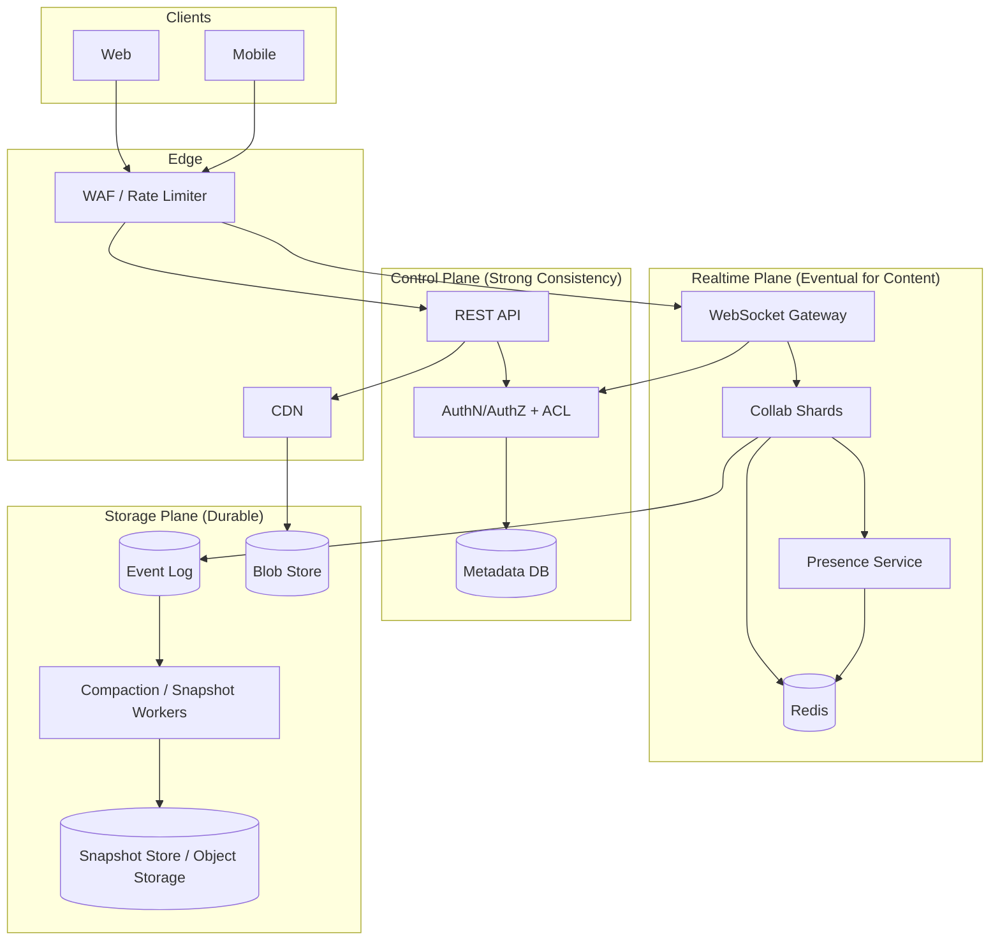
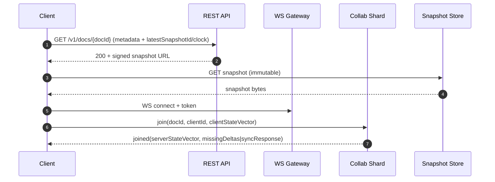
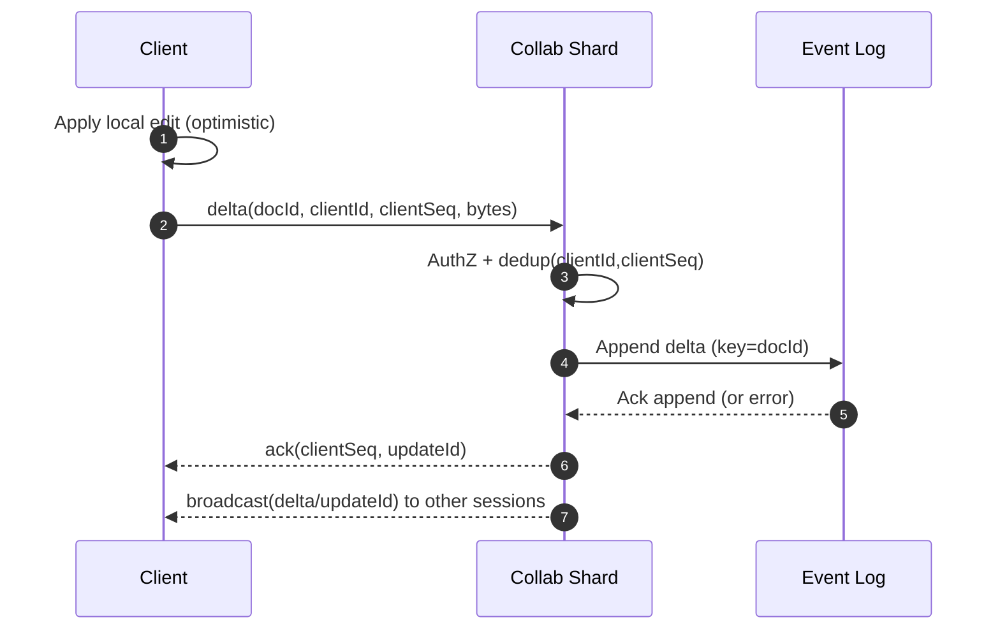

## Overview

Collaborative document editing (Google Docs–like) is challenging because the system must feel instantaneous while multiple users concurrently edit the same content over unreliable networks (retries, disconnects, offline edits, reordering, duplication). The core correctness requirement is **convergence**: every replica (clients and servers) must eventually reach the same document state without blocking users or corrupting intent.

A production-grade solution typically combines:

1. A **real-time collaboration plane** for low-latency fanout (WebSockets, presence, cursors).
2. A **merge model** for concurrent edits (Operational Transformation or CRDTs).
3. A **durable storage plane** for replay, compaction/snapshots, and recovery.

This design uses **delta-based CRDTs** for offline-first operation and simpler multi-region convergence, while keeping **strong consistency** where it matters (auth, ACLs, billing/quotas) and **eventual consistency** for document content and presence.

---

## Requirements

### Functional Requirements
- Document lifecycle: create, rename, delete/restore; folders/projects.
- Real-time multi-user editing: concurrent edits, cursor/selection, presence.
- Convergence under concurrency, reordering, duplication, and partitions.
- Offline editing with background sync and automatic reconciliation on reconnect.
- Version history: view timeline and restore a previous version.
- Fine-grained sharing: owner/editor/commenter/viewer; link sharing; revoke access.
- Comments and suggestions mode; resolve/reopen; anchored to document ranges.
- Import/export (PDF/DOCX/Markdown) with best-effort fidelity.
- Security and audit: access logs and admin visibility into sharing and exports.

### Non-Functional Requirements (Targets)
**Scale (example interview numbers, adjustable)**
- 10M DAU.
- Peak concurrent editors: **300k** (≈3% of DAU concurrently editing).
- Peak active documents: **60k** concurrently “open”.
- Peak edit operations (CRDT deltas): **120k deltas/sec**.
  - Back-of-envelope: 60k open docs × 2 deltas/sec average = 120k/sec (bursty, long tail).
- Peak fanout deliveries: **~500k–1.5M deliveries/sec** (depends on average collaborators per open doc, typically 3–10 for “hot” docs; presence excluded).
- Storage ingestion:
  - Median delta payload: 200–600 bytes (binary CRDT update, compressed).
  - Raw: 120k/sec × 400 B ≈ 48 MB/s ≈ **4.1 TB/day** raw before compaction; with zstd and snapshotting, retained deltas typically far less.

**Latency**
- Local apply: immediate (client-side).
- Remote propagation (same region): P50 **< 100 ms**, P99 **< 300 ms** (edit-to-apply on another client).
- Cross-region propagation: P99 **< 800 ms** (active-active) or “home-region” model where remote users may see higher P99 but still converge.
- Join doc (cold start): P99 **< 2.0 s** to interactive (metadata + snapshot + tail deltas).
- Cursor/presence: best-effort; can be dropped under load.

**Availability**
- 99.99% for `join/read` (serve snapshot and connect).
- 99.9% for realtime fanout/ack (degraded mode allowed: offline queue with later sync).

**Consistency**
- **Strong**: auth, ACL checks, membership, billing/quota enforcement, export permissions.
- **Eventual**: document content convergence, presence/awareness.
- **Causality**: preserve per-client ordering and provide at-least-once delivery; CRDT merge ensures convergence.

**Durability**
- RPO ≤ 1 minute for content (replicated log and/or frequent snapshots).
- RTO ≤ 30 minutes for regional outage.
- No silent data loss: detect gaps/corruption via checksums and sequence tracking.

### Constraints & Assumptions
- Web + mobile clients; WebSockets supported; fallback to SSE/long-polling where needed.
- Documents are “rich text + embeds” (images, tables). Embeds are referenced by ID; binaries stored separately.
- Operate Kafka/Redis/Postgres (or managed equivalents).
- GDPR and audit logging in scope; enterprise controls (KMS per-tenant, DLP) acknowledged but not deeply designed here.

---

## Architecture

### High-Level Design

### Key Architecture Choices (Why)
- **CRDT for content**: allows optimistic local edits, offline-first, and convergence without central serialization of intent.
- **Durable log + snapshots**: gives replay/history/debuggability and fast joins; the log is the “write-ahead” durability layer.
- **Strong control plane**: permissions and billing must not be eventually consistent; access changes must be enforceable immediately on new connections.

---

## Components

### 1) Client (Editor + CRDT Engine)
**Responsibilities**
- Apply local edits instantly and generate CRDT deltas.
- Merge remote deltas; keep a compact summary (state vector / version vector).
- Queue offline updates, retry with backoff, and handle reconnect/resync.
- Throttle presence and cursor updates separately from content deltas.

**Key Decisions**
- Use a battle-tested rich-text CRDT implementation (e.g., Yjs-like model) rather than building from scratch.
- Keep two channels:
  - **Content channel (durable)**: CRDT deltas persisted and replayable.
  - **Awareness channel (ephemeral)**: presence/cursors are best-effort.

**Notes on Rich Text**
- Rich text typically needs:
  - A sequence CRDT for characters/blocks.
  - Attribute maps for formatting.
  - Tombstone/GC strategy to avoid unbounded growth (often snapshot-based).

### 2) WebSocket Gateway
**Responsibilities**
- Terminate WebSockets, authenticate sessions, enforce basic rate limits/quotas.
- Route `docId` connections to the correct shard (consistent hashing / rendezvous hashing).
- Manage protocol version negotiation and reconnect behavior.

**Key Decisions**
- Keep the gateway stateless; push state to shards and Redis where necessary.
- Use short-lived access tokens + refresh to reduce risk on long-lived connections.

### 3) Collaboration Shards (Realtime Fanout + Validation)
**Responsibilities**
- Accept deltas, validate authorization, deduplicate retries, and broadcast to connected sessions.
- Append deltas to the durable log before acknowledging (durability-first ack).
- Apply backpressure and protect the system from slow clients/hot docs.

**Correctness Guarantees**
- **At-least-once ingest** (retries allowed).
- **Idempotency** by `(docId, clientId, clientSeq)`; duplicates are dropped.
- CRDT merge guarantees convergence even if delivery order differs.

**Backpressure Strategy**
- Per-connection send buffers with limits.
- If client falls behind: disconnect and instruct to resync via snapshot + tail deltas.
- Presence is dropped first under load.

### 4) Durable Event Log
**Responsibilities**
- Store the authoritative stream of deltas for replay, auditing, and snapshotting.
- Replicate within region (multi-AZ) and optionally to other regions.

**Partitioning**
- Topic partition by `hash(docId)`.
- Message key `docId` to preserve per-doc ordering within a partition (useful operationally, not strictly required by CRDT).

**Delivery Semantics**
- Exactly-once is not required. Use at-least-once plus idempotent processing.

### 5) Compaction / Snapshotting
**Responsibilities**
- Periodically fold deltas into a compact snapshot for fast joins and bounded replay.
- Produce immutable snapshot blobs with integrity hashes and metadata.

**Snapshot Policy**
- Snapshot on either threshold:
  - `N` deltas since last snapshot (e.g., 5k–20k depending on doc size), or
  - `T` minutes (e.g., 2–10 minutes for hot docs).
- Adaptive policy: hot docs snapshot more frequently; cold docs less frequently.

### 6) Metadata / ACL Service (Strong Consistency)
**Responsibilities**
- Document metadata, ACLs, folder membership, compaction watermarks, snapshot pointers.
- Audit log for shares/exports/deletes and admin investigation.

**Operational Choice**
- Postgres for single-region strong consistency; CockroachDB/Spanner-like systems if you need multi-region strong reads/writes for the control plane.

### 7) Blob Store (Embeds) + CDN
**Responsibilities**
- Store images/attachments separately from the CRDT content.
- Use signed URLs and CDN caching.

---

## Data Model

### Metadata DB (Postgres/CockroachDB)

**documents**
- `doc_id (uuid, pk)`
- `owner_id (uuid, indexed)`
- `title (text)`
- `created_at, updated_at (timestamptz)`
- `latest_snapshot_id (text)`
- `latest_snapshot_clock (jsonb)` — compact state vector summary
- `compaction_watermark (bigint)` — log offset/sequence included in snapshot
- `deleted_at (timestamptz, null)`
- `encryption_key_id (text, null)` — if envelope encryption is used

**document_acl**
- `doc_id (uuid, pk part, indexed)`
- `principal_type (user|group|link)`
- `principal_id (uuid/text, pk part)`
- `role (owner|editor|commenter|viewer)`
- `created_at`
- `updated_at`

**comments**
- `comment_id (uuid, pk)`
- `doc_id (uuid, indexed)`
- `author_id (uuid)`
- `anchor (jsonb)` — position/range anchor in CRDT coordinates
- `body (text)`
- `status (open|resolved)`
- `created_at, updated_at`

**versions (optional, for “named” restores)**
- `version_id (uuid, pk)`
- `doc_id (uuid, indexed)`
- `snapshot_id (text)`
- `snapshot_clock (jsonb)`
- `label (text, null)`
- `created_at`
- `created_by (uuid)`

**audit_log**
- `event_id (uuid, pk)`
- `doc_id (uuid, indexed)`
- `actor_id (uuid, indexed)`
- `action (share|revoke|edit_session|comment|export|delete|restore)`
- `ts (timestamptz, indexed)`
- `metadata (jsonb)`

### Event Log (Kafka)
- Topic: `doc_deltas`
  - Key: `doc_id`
  - Value (conceptual): `{doc_id, update_id, client_id, client_seq, state_vector_hint, delta_bytes, ts, schema_ver}`

### Snapshot Store (Object Storage)
- `snapshots/{doc_id}/{snapshot_id}.bin` — compressed CRDT state
- `snapshots/{doc_id}/{snapshot_id}.meta.json` — `{clock, watermark, size, sha256, created_at}`

### Redis (Ephemeral)
- `presence:{doc_id}` → `{userId, cursor, lastSeen}` (TTL seconds)
- `dedup:{doc_id}:{client_id}` → last seen `client_seq` (TTL hours)
- `routing:{doc_id}` → shard assignment hint (TTL minutes)

---

## Data Flow

### Join + Catch-up

**Catch-up options**
- **Vector-based sync** (preferred): client sends state vector; shard computes and sends only missing updates (often via CRDT library sync protocol).
- **Snapshot + tail deltas**: shard sends deltas after `compaction_watermark` if vector sync is too expensive or state vectors are missing/corrupt.

### Editing (Durable + Fanout)

**Ack policy**
- **Durable-first**: only ACK after the delta is durably appended (prevents “server accepted but lost”).
- Degraded mode may allow best-effort ACK with explicit UI indicator, but must be a conscious product decision.

---

## API

### Transport
- WebSocket: real-time deltas + presence.
- REST: document lifecycle, ACL/share, exports, comments, version history.
- Internal gRPC is optional for gateway↔shard and shard↔metadata.

### REST Endpoints (Examples)
- `POST /v1/docs`
  - Req: `{ "title": "Q4 Plan", "folderId": "..." }`
  - Resp: `{ "docId": "...", "createdAt": "..." }`

- `GET /v1/docs/{docId}`
  - Resp: `{ "docId": "...", "title": "...", "role": "editor", "latestSnapshotId": "...", "latestSnapshotClock": { ... } }`

- `POST /v1/docs/{docId}:share`
  - Headers: `Idempotency-Key: <uuid>`
  - Req: `{ "principalType": "user", "principalId": "...", "role": "commenter" }`
  - Resp: `{ "ok": true }`

- `POST /v1/docs/{docId}:revoke`
  - Req: `{ "principalType": "user", "principalId": "..." }`
  - Resp: `{ "ok": true }`

- `POST /v1/docs/{docId}:export`
  - Req: `{ "format": "pdf" }`
  - Resp: `{ "jobId": "..." }`

- `GET /v1/exports/{jobId}`
  - Resp: `{ "status": "running|done|failed", "downloadUrl": "..." }`

### WebSocket Messages (Conceptual)
- Client → Server: `join`
  - `{ "type": "join", "docId": "...", "clientId": "...", "schemaVer": 3, "stateVector": { ... } }`

- Server → Client: `joined`
  - `{ "type": "joined", "serverVector": { ... }, "sync": { ... } }`

- Client → Server: `delta`
  - `{ "type": "delta", "docId": "...", "clientId": "...", "clientSeq": 42, "bytes": "<binary>" }`
  - Idempotency key: `(docId, clientId, clientSeq)`.

- Server → Client: `ack`
  - `{ "type": "ack", "clientSeq": 42, "updateId": "..." }`

- Server → Client: `delta_broadcast`
  - `{ "type": "delta_broadcast", "updateId": "...", "bytes": "<binary>" }`

- Presence (best-effort, non-durable)
  - `{ "type": "presence", "cursor": { ... }, "selection": { ... }, "state": "active|idle" }`

### Error Handling
Structured errors:
- `{ "type": "error", "code": "FORBIDDEN", "message": "...", "retryable": false }`

Common codes:
- `UNAUTHORIZED`, `FORBIDDEN`, `DOC_NOT_FOUND`, `DOC_GONE`, `RATE_LIMITED`,
  `PAYLOAD_TOO_LARGE`, `SCHEMA_MISMATCH`, `SHARD_MOVED`, `TEMPORARY_UNAVAILABLE`.

---

## Scaling & Performance

### Primary Bottlenecks and Mitigations

**1) Fanout amplification (1 delta → N recipients)**
- Batch deltas (e.g., 20–50 ms window) and compress.
- Separate content and presence; drop/throttle presence first.
- Limit per-connection buffers; disconnect slow clients and force resync.
- For very large rooms, use a tiered broadcast path (shard → regional pub/sub → gateways).

**2) Hot documents**
- Detect hot docs (sessions, deltas/sec, egress) and apply:
  - More aggressive batching.
  - Lower presence frequency.
  - Dedicated shard pool for hot docs.
  - Optional hierarchical fanout (shard publishes to a broker topic; gateways subscribe).
- True “within-doc compute sharding” is hard for rich-text CRDT; treat it as an exceptional case.

**3) Join latency**
- Keep snapshots small and immutable; serve via CDN with signed URLs.
- Maintain snapshot freshness SLO (e.g., snapshot age P99 < 10 minutes for hot docs).
- Prioritize compaction for hot docs and large delta tails.

**4) Compaction backlog**
- Autoscale workers by consumer lag and snapshot age.
- Partition-aligned workers (one consumer group, parallelism = partitions).
- Apply rate limits per partition to avoid saturating object storage.

### Sharding and Partitioning
- **Realtime shards**: partition by `docId` via rendezvous hashing; aim for stable routing and smooth rebalancing.
- **Event log**: partitions keyed by `docId` to preserve per-doc ordering and scale throughput.
- **Metadata DB**: start with a single cluster; add partitioning by `docId` or move to distributed SQL as needed.

### Capacity Planning (Example)
Assume peak:
- 120k deltas/sec, avg 400 B compressed ⇒ ~48 MB/s ingress to log.
- Avg 5 collaborators per open doc receiving edits ⇒ ~240 MB/s fanout egress (content only).
- Presence at 5 Hz, 300k users, 200 B payload ⇒ 300k × 5 × 200 B ≈ 300 MB/s if unthrottled (so presence must be aggressively throttled/coalesced and often dropped).

---

## Trade-offs

### Trade-off 1: CRDT vs OT
- **Chosen**: delta-based CRDT.
- **Pros**: offline-first, convergence without central transform chains, simpler multi-region active-active.
- **Cons**: metadata overhead, tombstone/GC complexity, snapshotting required to bound growth.
- **Why**: correctness and offline behavior are typically the hardest parts; CRDTs reduce risk.

### Trade-off 2: Durable-first ACK vs Low-latency ACK
- **Chosen**: ACK after durable append.
- **Pros**: prevents “server accepted but lost”; simplifies user trust and recovery.
- **Cons**: slightly higher tail latency (log append in the critical path).
- **Why**: collaborative editors are trust-sensitive; silent loss is unacceptable.

### Trade-off 3: Sticky per-doc shard vs Multi-shard per doc
- **Chosen**: one shard “owns” realtime fanout for a doc.
- **Pros**: simpler membership, backpressure, and session management.
- **Cons**: hot-doc hotspots.
- **Why**: multi-shard per doc complicates ordering, state exchange, and operational debugging; treat hot docs as exceptional.

### Alternative Approaches (Brief)
- **OT with centralized ordering**: smaller ops, long history in editors; harder for offline/multi-region rich text.
- **State-based CRDT with full-state sync**: simple merge; too bandwidth-heavy for large docs/mobile.
- **Peer-to-peer (WebRTC)**: reduces server fanout; brittle on enterprise networks and still needs server durability/history.

---

## Failure Modes

### Scenario 1: Collab shard crash mid-session
- **Impact**: WS disconnect; fanout interrupted; clients continue locally.
- **Detection**: elevated disconnect/reconnect rate; shard health failures.
- **Mitigation**: clients reconnect; routing returns a new shard; idempotent ingest drops duplicates; resync via snapshot + missing updates.

### Scenario 2: Event log partition unavailable / log outage
- **Impact**: cannot durably accept edits; risk of accepting updates that can’t be recovered.
- **Detection**: produce errors, under-replicated partitions, rising retries.
- **Mitigation**: fail closed for durable ACK; switch UI to offline-queue mode; optionally allow best-effort realtime with explicit “not saved yet” indicator (product decision).

### Scenario 3: Redis outage
- **Impact**: presence degraded; dedup/routing caches cold.
- **Detection**: Redis error rate/latency alarms.
- **Mitigation**: disable presence; fall back to in-process dedup LRU; compute routing via deterministic hashing; keep system functional for content.

### Scenario 4: Snapshot store/object storage degradation
- **Impact**: slow joins; more load on tail replay; higher reconnect cost.
- **Detection**: snapshot fetch errors/latency, join latency SLO violation.
- **Mitigation**: multi-region bucket replication; CDN caching; fall back to older snapshot + longer tail replay; prioritize compaction once storage recovers.

### Scenario 5: Permission revoked while session is active
- **Impact**: user may keep editing locally; must prevent further server fanout/durable writes.
- **Detection**: ACL change event in control plane.
- **Mitigation**: shards re-check ACL on write (and periodically); revoke triggers session termination or downgrade to read-only; require re-auth on reconnect.

### Scenario 6: Client state corruption / schema mismatch
- **Impact**: cannot compute missing updates; apply errors; potential UI breakage.
- **Detection**: CRDT decode/apply errors; schema negotiation failures.
- **Mitigation**: force reset-from-snapshot; pin protocol versions; roll out schema with backward compatibility and staged migration.

### Disaster Recovery (DR)
- **Targets**: RPO ≤ 1 minute, RTO ≤ 30 minutes.
- **Backups**
  - Metadata DB: PITR + daily full backups.
  - Snapshots: object versioning + cross-region replication.
  - Event log: multi-AZ replication + optional cross-region mirroring (asynchronous).
- **Failover**
  - Route new WS connections to standby region.
  - Clients reconnect and resync from latest replicated snapshot + mirrored deltas.
  - CRDT convergence tolerates delayed cross-region replication.

---

## Operations

### SLOs (Example)
- `Join interactive` P99 < 2.0s (metadata + snapshot + sync).
- `Edit propagation` P99 < 300ms (same region).
- `Durable ACK` P99 < 200ms (log append).
- `Snapshot freshness` P99 age < 10 minutes for hot docs.

### Monitoring & Alerting
**Realtime**
- Active WS connections; reconnect storms; gateway CPU/memory.
- Fanout latency (ingest→broadcast) P99; dropped messages; per-connection buffer utilization.
- Hot doc detection: sessions/doc, deltas/sec/doc, egress/doc.

**Durability**
- Event log produce errors; ISR health; partition skew.
- Consumer lag for compaction; snapshot age distribution.

**Correctness**
- CRDT decode/apply error rate; schema mismatch rate.
- Idempotency metrics: dedup hit rate; duplicate submit rate.
- Divergence sampling: periodic checksum comparisons via synthetic clients on sampled docs.

### Security & Privacy
- TLS everywhere; short-lived tokens; secure WebSocket origin checks.
- Strong ACL enforcement on join and on each durable write; audit share/export/delete.
- Signed URLs for snapshots/blobs with least-privilege and short TTL.
- Data retention policy: log retention bounded by snapshotting needs; redact/delete for GDPR requests (requires careful design for audit vs deletion obligations).

### Deployment Strategy
- Protocol/schema versioning; clients advertise `schemaVer`.
- Canary gateway/shards (1–5%); rollback by routing canary ring back.
- Load tests focus on hot-doc fanout, reconnect storms, and compaction lag.
- Runbooks: log outage (fail closed), redis outage (disable presence), shard crash (reconnect/resync), storage degradation (fallback replay).

---

## References & Further Reading
- Martin Kleppmann — CRDT survey and “Designing Data-Intensive Applications” (logs, replication, consistency).
- Yjs documentation/design notes (updates, state vectors, awareness/presence).
- Automerge documentation and papers (JSON-like CRDTs).
- OT background: Google Wave / Jupiter papers (for comparison and trade-offs).
- Kafka design docs: ordering guarantees, idempotent producers, EOS (and why at-least-once + idempotency is usually sufficient here).