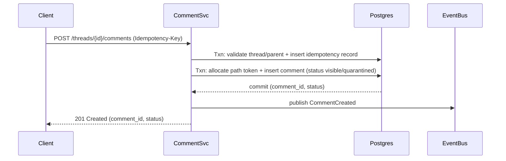
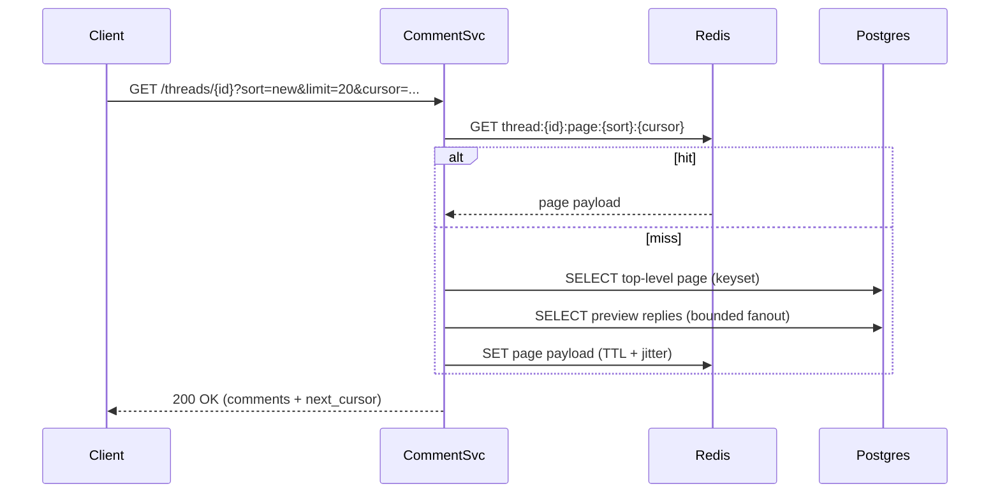
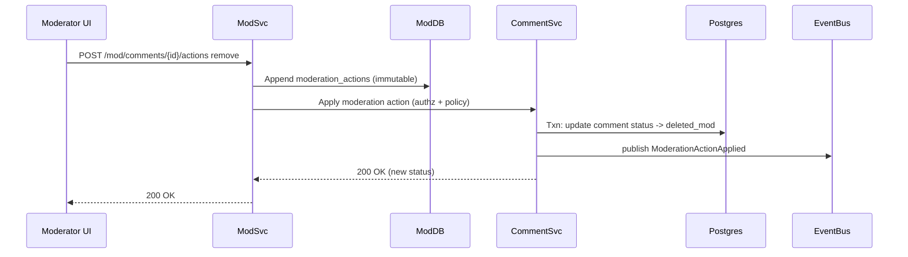

# Comment System

## Overview

A threaded comment system looks simple (“store text and show it”), but becomes difficult at scale when you combine:

- A mutable tree (replies-on-replies) with deep nesting
- Multiple sort modes (`new`, `top`) with stable pagination
- Near-real-time updates
- Safety controls (moderation + anti-spam) with auditability
- Hotspot behavior (a few threads dominate traffic)

This design uses a **strongly consistent write path** for correctness (parent/visibility semantics, idempotency, moderation actions) and a **read-optimized path** (keyset pagination, caching, precomputed metadata) to keep latency predictable during fanout and traffic spikes. Asynchronous enrichment (spam scoring, search indexing, notifications) is decoupled via an event bus so the core UX remains available even when downstream systems degrade.

## Requirements

### Functional Requirements

- Create comments on a thread and replies to any comment (deep nesting).
- Read a thread with pagination:
  - top-level comment pages
  - “load more replies” per subtree (paged)
- Edit and delete comments with clear visibility semantics:
  - soft-delete by author
  - remove/restore by moderator
- Moderation workflows:
  - report/flag
  - review queue
  - remove/restore
  - lock/unlock thread
  - user sanctions (ban, shadow-ban)
- Anti-spam protections:
  - rate limits
  - heuristics
  - ML scoring
  - quarantine for suspicious content
- Sort modes:
  - `new`
  - `top` (score-based, with stable pagination semantics)
- Auditability:
  - immutable moderation log
  - comment revision history
- Near-real-time updates:
  - polling or streaming (SSE/WebSocket)

### Non-Functional Requirements

- **Scale**
  - 50M MAU
  - Peak: ~50K read QPS (thread pages + replies), ~5K write QPS (create/edit/delete/report)
  - Total comments: up to 10B (multi-year retention; includes deleted/quarantined)
  - Hot threads: 1M+ comments, 10K+ RPS bursts
- **Latency (server-side, excluding client network)**
  - Read thread first page: P50 ≤ 40ms, P99 ≤ 150ms
  - Read replies page: P50 ≤ 50ms, P99 ≤ 200ms
  - Create comment (accepted): P50 ≤ 80ms, P99 ≤ 250ms
- **Availability**
  - Reads: 99.99% (graceful degradation allowed)
  - Writes: 99.9%
- **Consistency**
  - Strong consistency for:
    - parent/child relationship correctness
    - comment visibility state (visible/deleted/quarantined)
    - moderation actions and audit logs
    - idempotency (no duplicate creates on retry)
  - Eventual consistency (bounded staleness acceptable) for:
    - spam score, search index, notifications
    - caches and derived aggregates (e.g., reply counts) with “read-your-writes” in create response
- **Durability / DR**
  - RPO ≤ 1 minute
  - RTO ≤ 15 minutes
  - No acknowledged comment lost beyond RPO in regional disaster

### Constraints & Assumptions

- Multi-region deployment with **one primary write region per shard**; global reads via CDN + caches + DB replicas.
- Prefer proven tech and operational simplicity: Postgres + Redis + Kafka (or equivalents).
- PII minimized and owned by a separate user service; comment service stores `author_id` only.
- Basic retention/compliance: immutable audit trail; support user deletion requests via tombstones.

## Architecture

### High-Level

```mermaid
flowchart TB
  Client[Clients (Web/Mobile)] --> CDN[CDN / Edge Cache]
  CDN --> APIGW[API Gateway]
  APIGW --> Auth[AuthN/AuthZ]
  APIGW --> RL[Rate Limiter]

  RL --> CommentSvc[Comment Service]
  RL --> ModSvc[Moderation Service]

  CommentSvc --> Redis[(Redis Cluster)]
  CommentSvc --> DB[(Postgres Shards)]
  ModSvc --> ModDB[(Moderation DB / Audit Store)]

  CommentSvc --> Bus[(Event Bus)]
  ModSvc --> Bus

  Bus --> Spam[Spam Scoring Workers]
  Bus --> Search[Search Indexer]
  Bus --> Notif[Notification Service]
  Bus --> CacheInv[Cache Invalidation Workers]
```

### Responsibilities by Plane

- **Synchronous (user-facing)**
  - Create/edit/delete comment
  - Read thread pages and reply pages
  - Moderation actions that must take effect immediately (remove/restore/lock)
- **Asynchronous (enrichment/side effects)**
  - Spam scoring and reputation updates
  - Search indexing for moderator tools
  - Notifications/subscriptions
  - Best-effort cache invalidation

## Components

### Comment Service

**Owns**
- Comment lifecycle (create/edit/delete)
- Thread reads (paged)
- Visibility evaluation (including quarantined/deleted states)
- Idempotency for create operations
- Emitting domain events

**Key design decisions**
- Store hierarchy using **materialized path** (Postgres `ltree` recommended) scoped by `thread_id`.
- Use **keyset pagination** for all high-QPS lists (no deep `OFFSET`).
- Cache **page-shaped responses** (assembled API payloads), not individual rows, to reduce CPU fanout on hot threads.
- Keep synchronous work minimal; offload spam/search/notification to events.

**Why materialized path**
- Efficient subtree reads and deterministic ordering using prefix scans (`path <@ '...')`.
- Predictable pagination for reply subtrees using `(thread_id, path, comment_id)`.

### Moderation Service

**Owns**
- Report ingestion and triage workflow
- Policy enforcement actions (remove/restore/lock; user sanctions)
- Immutable audit log (append-only)
- Moderator search UX (via search index, not OLTP scans)

**Key design decisions**
- **Append-only audit log** for actions; never mutate past records.
- Separate moderation storage from core comment reads so mod tooling does not regress read SLOs.
- Moderation actions update comment visibility state synchronously (strong consistency), then publish events for downstream consumers.

### Spam Scoring Pipeline

**Owns**
- Layered abuse defense:
  - rate limits and heuristics at the edge
  - stream-based scoring and enrichment
  - ML model inference
- Promotion/demotion between `quarantined` and `visible` based on risk

**Key design decisions**
- Use **quarantine** for high-risk comments to avoid immediate exposure while keeping write latency low.
- Treat the pipeline as eventually consistent; ensure safe defaults when it’s unavailable.

### Caching Layer (Redis + CDN)

**Owns**
- Reduce DB reads for hot pages
- Absorb bursts with edge caching and request coalescing

**Key design decisions**
- CDN caches anonymous “thread first page” responses briefly (e.g., 10–30s) with `stale-while-revalidate`.
- Redis stores assembled pages with TTL (30–120s) and jitter.
- Use singleflight/request coalescing per cache key to prevent stampedes.

### Event Bus (Kafka / equivalent)

**Owns**
- Durable fanout of domain events to downstream systems
- Backpressure isolation and replayability

**Key design decisions**
- Partition by `thread_id` for locality and ordering where needed (cache invalidation, per-thread aggregates).
- Use DLQs for poison messages; expose consumer lag SLOs.

## Data Model

### Comment State Model

- `visible`: publicly readable
- `quarantined`: hidden from general readers; visible to author + mods (configurable)
- `deleted_user`: author-initiated soft delete (tombstone shown)
- `deleted_mod`: moderator removal (tombstone shown; reason optional)

Thread state:
- `open`: normal
- `locked`: no new comments; reads allowed
- `archived`: read-only; reduced cache churn (longer TTL)

### Logical Schema (Postgres)

**threads**
- `thread_id` (PK)
- `content_id` (unique)
- `status` (`open`, `locked`, `archived`)
- `created_at`
- `last_activity_at`
- `visible_comment_count` (optional derived; may be slightly stale)

**comments**
- `comment_id` (PK, UUIDv7 or Snowflake)
- `thread_id` (indexed; shard/partition key)
- `parent_id` (nullable; indexed)
- `author_id` (indexed)
- `path` (`ltree`; indexed with GIST)
- `depth` (smallint)
- `created_at`, `updated_at`
- `edited_at` (nullable)
- `status` (`visible`, `quarantined`, `deleted_user`, `deleted_mod`)
- `body` (text; TOAST compressed)
- `rendered_body` (optional; cached HTML/AST with sanitizer version)
- `score` (int; from votes; optional)
- `rank_top` (numeric/bigint; denormalized ranking key; updated async)
- `version` (int; optimistic concurrency)

**comment_revisions**
- `revision_id` (PK)
- `comment_id` (indexed)
- `editor_id`
- `body`
- `created_at`

**idempotency_keys**
- `user_id`
- `idempotency_key`
- `request_hash`
- `comment_id`
- `created_at`
- PK `(user_id, idempotency_key)`

**reports**
- `report_id` (PK)
- `comment_id` (indexed)
- `thread_id` (indexed)
- `reporter_id`
- `reason`
- `created_at`
- `status` (`open`, `triaged`, `closed`)

**moderation_actions** (append-only)
- `action_id` (PK)
- `actor_id`
- `target_type` (`comment`, `thread`, `user`)
- `target_id`
- `action` (`remove`, `restore`, `lock`, `unlock`, `ban`, `shadow_ban`)
- `metadata` (jsonb)
- `created_at`

### Indexing & Query Shapes

- Top-level page (sort=`new`):
  - index: `(thread_id, parent_id, created_at DESC, comment_id DESC)`
- Reply subtree page:
  - index: `GIST(path)` + btree `(thread_id, path, comment_id)` (often both; validate with `EXPLAIN`)
  - query: `WHERE thread_id=? AND path <@ :parent_path ORDER BY path, comment_id LIMIT ?`
- Moderator “by author” or “recent quarantined”:
  - index: `(status, created_at DESC)` (potentially partial indexes per status)

### Materialized Path Details (Production-Ready)

Use Postgres `ltree`:

- `path = '<rootCommentId>.<childToken>.<childToken>...'` (tokens are short base-N strings)
- Root comment has `path = '<commentId>'` and `parent_id = NULL`
- Replies append a new token to parent path

Token allocation strategies (choose one):
1. **Monotonic counter per parent** (simple, but can hotspot on extremely hot parents)
   - table `comment_children(parent_id, next_seq)`
   - allocate with `SELECT ... FOR UPDATE`, then increment
2. **Time+random token with collision retry** (low contention)
   - token = `base36(timestamp_ms) + base36(rand16)`
   - on rare collision, retry insert

For most systems, (2) yields better tail latency under “reply storms” without requiring parent-row locks.

## API

### Create Comment

`POST /v1/threads/{thread_id}/comments`

Headers:
- `Idempotency-Key: <uuid>` (required)

Request:
```json
{
  "parent_id": "c_01J0...",
  "body": "Text with markdown",
  "client_context": {
    "device_id": "d_...",
    "ip_hash": "h_..."
  }
}
```

Response (201):
```json
{
  "comment": {
    "comment_id": "c_01J0...",
    "thread_id": "t_123",
    "parent_id": "c_01J0...",
    "status": "visible",
    "created_at": "2025-12-17T10:00:00Z"
  },
  "visibility": {
    "is_public": true,
    "reason": "ok"
  }
}
```

Errors:
- `400` invalid payload / parent/thread mismatch
- `401/403` not allowed (banned, thread locked, shadow-banned policy)
- `409` idempotency key reuse with different payload
- `429` rate limited
- `503` overloaded (retryable)

Idempotency:
- Store `(user_id, idempotency_key) -> (request_hash, comment_id)` for 24h.
- On retry:
  - same hash: return original result
  - different hash: `409`

### Edit Comment

`PATCH /v1/comments/{comment_id}`

Request:
```json
{ "body": "Updated text" }
```

Behavior:
- Creates a row in `comment_revisions`
- Updates `comments.body`, `edited_at`, increments `version`
- Publishes `CommentEdited` event (search reindex, cache invalidation)

### Delete Comment (Soft)

`DELETE /v1/comments/{comment_id}`

Behavior:
- Sets `status=deleted_user`
- Preserves placeholder so reply trees remain navigable
- Publishes `CommentDeleted` event

### Get Thread (Top-Level Pagination)

`GET /v1/threads/{thread_id}?sort={new|top}&limit=20&cursor=...`

Response:
```json
{
  "thread": { "thread_id": "t_123", "status": "open" },
  "sort": { "mode": "new", "as_of": "2025-12-17T10:01:00Z" },
  "comments": [
    {
      "comment_id": "c1",
      "parent_id": null,
      "status": "visible",
      "created_at": "2025-12-17T10:00:12Z",
      "reply_count": 120,
      "preview_replies": [ { "comment_id": "c1r1" } ]
    }
  ],
  "next_cursor": "eyJtb2RlIjoibmV3IiwgLi4u"
}
```

Pagination (keyset):
- Cursor encodes `(mode, as_of, last_key, last_comment_id)`
- `as_of` anchors a consistent view for `top` so items don’t reshuffle mid-pagination:
  - `top` ordering uses `rank_top` computed “as of” a timestamp
  - the backend may recompute ranks continuously, but pagination stays stable within the anchored window

### Get Replies (Subtree Pagination)

`GET /v1/comments/{comment_id}/replies?limit=50&cursor=...`

Behavior:
- Returns replies for the subtree in deterministic traversal order.
- Cursor encodes `(thread_id, parent_path, last_path, last_comment_id)`.

### Moderation Action

`POST /v1/mod/comments/{comment_id}/actions`

Request:
```json
{ "action": "remove", "reason": "hate_speech", "note": "policy 3.2" }
```

Behavior:
- Synchronous update of comment visibility state (strong consistency)
- Always appends an audit record
- Publishes `ModerationActionApplied` event (cache invalidation, search index update)

## Data Flows

### Create Comment (Sync + Async)



### Read Thread Page (Cache-First)



### Moderation Remove (Strong + Audited)



## Scaling & Performance

### Capacity Back-of-the-Envelope

Assumptions:
- Average comment body: 200–400 bytes (TOAST compresses; plus metadata/index overhead)
- Effective storage per comment (incl. indexes): ~1–2 KB (varies widely with indexes and path length)

For 10B comments:
- Storage: ~10–20 TB for table + indexes (often higher in practice), requiring:
  - sharding by `thread_id`
  - partitioning by time (optional) and aggressive VACUUM/autovac tuning
  - archival strategy for very old threads (read-only, cheaper replicas)

### Hot Threads & Read Amplification

Primary risks:
- **Cache churn** on fast-moving top pages
- **Fanout** when including reply previews
- **Stampedes** (many clients request same page simultaneously)

Mitigations:
- Cache assembled pages (Redis) and allow short edge caching (CDN) for anonymous traffic.
- Bound reply previews (e.g., at most 2–3 replies and only for first N parents).
- Singleflight request coalescing per cache key.
- Serve stale pages briefly when origin is overloaded (`stale-while-revalidate`, `stale-if-error`).

### Database Sharding Strategy

- Shard/partition key: `thread_id` (keeps subtree and top-level queries local).
- Each shard:
  - primary for writes
  - at least one read replica (regional)
- Use a routing layer (service-level or proxy) to map `thread_id -> shard`.

Operational notes:
- Prefer “many smaller shards” over “few huge shards” to reduce blast radius.
- Rebalancing strategy: consistent hashing with planned migrations for large threads.

### Ranking (`top`) Without Breaking Pagination

Challenge: scores change over time; naive ordering by `score DESC` reshuffles across pages.

Production approach:
- Maintain a denormalized `rank_top` that is updated asynchronously (e.g., `score` + time decay).
- Anchor pagination with `as_of`:
  - first request sets `as_of = now()`
  - cursor carries `as_of` so subsequent pages use a consistent snapshot window
- If strict snapshot isolation is required, compute ranks from an append-only vote stream into time-bucketed materializations (more complex; usually unnecessary).

### Write Path Contention

- Parent token allocation can become a hotspot under extreme “reply storms”.
- Prefer low-contention token allocation (time+random with collision retry) or per-parent sharded counters.
- Use connection pooling (PgBouncer) and short transactions to keep tail latency down.

## Trade-offs & Alternatives

### Key Trade-offs

- **Materialized path (`ltree`) vs adjacency list**
  - Pros: fast subtree reads, deterministic reply pagination
  - Cons: more complex inserts and path management; longer indexes

- **Cache page-shaped payloads vs caching raw rows**
  - Pros: reduces CPU and DB fanout for hot threads; lower tail latency
  - Cons: invalidation complexity; occasional staleness (bounded by TTL)

- **Quarantine-based safety vs always-visible posts**
  - Pros: reduces spam exposure; isolates scoring outages
  - Cons: some legitimate comments delayed or hidden; requires clear UX for authors/mods

### Alternatives

- **Adjacency list + recursive CTE**
  - Simple writes, but unpredictable performance under deep trees and high QPS.
- **Nested set model**
  - Great subtree reads, but inserts are expensive due to range shifts—poor fit for active discussions.
- **Dedicated tree store / graph DB**
  - Natural modeling, but higher operational complexity and often worse latency predictability than Postgres + careful indexing.

## Failure Modes & Mitigations

### Scenario 1: Primary DB shard unavailable

- Impact:
  - Writes fail for threads on that shard
  - Reads may degrade (replicas/cache) depending on topology
- Detection:
  - shard health checks
  - elevated 5xx/write failures
  - replica promotion alarms
- Mitigation:
  - promote standby (cross-AZ/region) and reroute shard
  - serve cached reads when possible
  - return `503` for writes with retry guidance and idempotency protection

### Scenario 2: Redis outage or high error rate

- Impact:
  - cache misses spike; DB load surges; latency increases
- Detection:
  - Redis error/timeout metrics
  - DB QPS/CPU spike correlated with cache misses
- Mitigation:
  - circuit-break Redis calls quickly
  - shed load (rate limits, degrade reply previews)
  - rely on read replicas
  - gradual cache warm-up post-recovery

### Scenario 3: Event bus backlog / consumer lag

- Impact:
  - stale caches linger longer
  - delayed spam decisions
  - delayed search indexing and notifications
- Detection:
  - consumer lag (messages and time)
  - DLQ growth
- Mitigation:
  - autoscale consumers based on lag
  - prioritize critical consumers (cache invalidation, spam)
  - keep TTLs short for hottest keys
  - quarantine risky comments until scoring catches up

### Scenario 4: Spam scoring service down

- Impact:
  - higher spam exposure risk if default is “visible”
  - or increased quarantine if default is “safe”
- Detection:
  - scoring worker errors
  - lag spikes for scoring topics
- Mitigation:
  - fail safe: raise quarantine threshold and tighten heuristics (link caps, rate limits)
  - increase manual review sampling for new accounts
  - degrade gracefully without blocking core writes

### Scenario 5: Hot thread thundering herd

- Impact:
  - cache stampede; DB overload; cascading failures
- Detection:
  - sudden QPS spikes
  - cache miss spikes
  - elevated DB latency/connection saturation
- Mitigation:
  - request coalescing (singleflight)
  - CDN short TTL + serve stale
  - stricter anonymous rate limits
  - temporarily disable reply previews on that thread (feature flag)

## Operations

### Observability (SLO-Oriented)

Golden signals per endpoint (read thread, read replies, create, mod action):
- RPS, error rate, latency (P50/P95/P99), saturation (CPU, queue depth, DB connections)

DB metrics:
- replication lag (seconds)
- lock wait time
- slow query percentile
- bloat/VACUUM effectiveness
- disk growth rate

Eventing metrics:
- consumer lag (count + age)
- DLQ rate
- retry rate and processing time per consumer

Abuse/moderation metrics:
- quarantine rate and time-to-decision
- reports/minute
- mod action throughput
- false positive/negative sampling outcomes (offline evaluation)

Suggested alerts:
- P99 read thread > 200ms for 5m
- 5xx > 1% for 5m (per endpoint)
- DB replica lag > 10s for 5m
- consumer lag age > 5m for critical topics
- create comment `429` rate spike (possible abuse or misconfigured limits)

### Deployment & Migration

- Canary rollout (5% → 25% → 50% → 100%) with automated rollback on SLO regression.
- Backward-compatible DB migrations: expand → backfill → switch reads/writes → contract.
- Feature flags for:
  - ranking model changes
  - reply preview behavior
  - quarantine thresholds
- Runbooks:
  - shard failover and rerouting
  - cache outage playbook
  - “hot thread” mitigation steps (disable previews, raise TTLs, enable stale serving)

### Disaster Recovery

- Backups:
  - continuous WAL archiving + daily full backups per shard
  - periodic restore drills (measure RTO realistically)
- Failover:
  - promote cross-region replica
  - reroute shard mapping via service discovery/config
  - restart consumers from committed offsets
  - rebuild caches opportunistically

## References & Further Reading

- PostgreSQL `ltree`: https://www.postgresql.org/docs/current/ltree.html
- Designing Data-Intensive Applications (Kleppmann): streams, consistency, storage trade-offs
- Kafka consumer scaling and lag: https://kafka.apache.org/documentation/
- Practical discussions of comment threading trade-offs (public engineering blogs/talks by Reddit, Discord, Meta, Google)