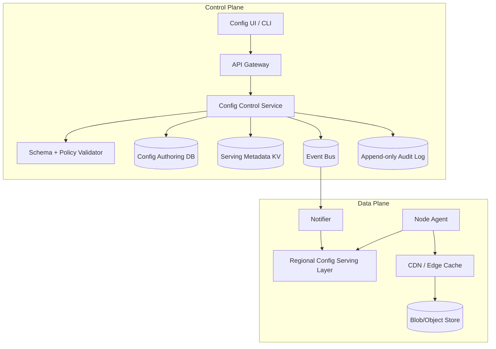

## Overview

A configuration distribution system is the control plane for a fleet: it must reliably deliver the *right* configuration to the *right* targets at the *right* time, while preventing bad pushes from taking down production. The workload is asymmetric:

- **Reads (data plane)**: massive fan-out, latency-sensitive, bursty (deploys/restarts), must remain available even when control-plane systems are degraded.
- **Writes (control plane)**: low QPS but high correctness requirements (validation, approvals, auditability, progressive rollout, fast rollback).

The core design is to separate:

1. **Strongly consistent, small metadata**: “what version should this target run?”, rollout state, approvals, audit pointers.
2. **Highly cacheable, immutable payload distribution**: the actual config blobs, served via object storage + CDN/edge caches.

Critically, do **not** expose a consensus store (e.g., etcd) directly to 200k agents. Use a **read serving layer** (regional) that caches and watches metadata, and let agents fetch payloads via CDN.

---

## Requirements

### Functional Requirements

- Publish config changes with **immutable versions** and **labels** (e.g., `candidate`, `stable`, `prod-approved`).
- Enforce **schema validation** and **policy checks** (size limits, forbidden fields, allow-lists, ownership).
- Support **targeting rules** by service, environment, region, cluster, and (optionally) stable instance attributes.
- Provide **rollout controls**: canary %, progressive steps, regional sequencing, freeze windows, manual approvals.
- Enable **safe rollback** to a previous version in seconds with an audit trail.
- Support **pull** (agents fetch) plus **push notifications** (invalidate/hint) to reduce time-to-converge.
- Provide **status reporting**: agent apply success/failure, version skew, and rollout health signals.
- Provide **RBAC** (viewer/publisher/approver/admin) integrated with SSO and break-glass flows.
- Expose **watch/stream** APIs for UIs and internal automation (pipelines, release controllers).

### Non-Functional Requirements (Concrete Targets)

#### Scale
- Fleet: **200k nodes**, **2k services**, **20 environments**, **3 AZ/region**.
- Steady-state agent resolution traffic: **~30k QPS** (across all regions).
- Burst traffic (restarts/rollouts): **up to 150k QPS** for *metadata resolution* and **very high CDN GETs** for payloads.
- Publish volume: **50–200 publishes/day**, peak **20/min** during incidents.

#### Latency (per region)
- Agent “resolve effective config”:
  - P50 **< 20 ms** (cache hit in serving layer)
  - P99 **< 150 ms** (cross-AZ miss / cold cache)
- Agent “fetch payload” (CDN hit): P99 **< 100 ms** (region-local edge)
- Publish+validate (excluding human approval): P99 **< 2 s**
- Convergence (notification + refresh):
  - **99%** of agents aware of a relevant pointer change within **5 s**
  - **99%** applied (or safely deferred) within **30–60 s** depending on jitter/backoff

#### Availability & Durability
- Read path (resolve + fetch): **99.99%** monthly.
- Write path (publish/release): **99.9%** monthly (degraded publishing must not break serving).
- Metadata RPO **≤ 1 minute**, RTO **≤ 30 minutes**.
- Payload durability: object storage class (e.g., “11 9s”), with checksums and integrity verification.

#### Consistency Model
- **Publishing, approvals, release pointers, rollout state**: strongly consistent within a region (single source of truth per env/service).
- **Serving across regions**: eventual consistency with bounded staleness; agents prefer local region.
- **Monotonic per agent**: agents never apply an older version unless the change is an explicit rollback (signed/authorized) or the agent is recovering from corruption.

### Constraints & Assumptions

- Multi-region active/active for reads; failover must keep serving LKG even during partitions.
- Agents can be intermittently offline; must cache **last-known-good (LKG)** on disk.
- Config sizes: typical **< 64 KB**, but support up to **5 MB** for large routing tables/cert bundles (prefer references for very large artifacts).
- Compliance: audit retention **≥ 1 year**, immutable audit logs, and separation of duties for prod releases.

---

## Architecture

### High-Level Design

- **Control plane**:
  - Validates and versions configs.
  - Writes immutable version records.
  - Advances **release pointers** (what’s active) and manages rollouts.
  - Emits audit events and change notifications.

- **Data plane**:
  - Resolves “effective version” via a **regional serving layer** (cache + watch).
  - Fetches immutable payloads via **CDN/edge caches**.
  - Applies safely with local validation, atomic swaps, and LKG fallback.

### Architecture Diagram



### Key Educational Takeaways

- **Immutable payloads** enable aggressive caching and safe rollback.
- **Mutable pointers** (release state) allow instant rollback without rewriting blobs.
- **Serving layer** prevents a consensus store from becoming the fleet-facing bottleneck.

---

## Components

### 1) Config Control Service (Authoring + Orchestration)

**Responsibilities**
- Authoring APIs, versioning, approvals, rollout orchestration, RBAC, audit emission.
- Computes and persists rollout plans; advances release pointers over time.

**Key Decisions**
- **Immutable versions + mutable release pointers** (`env/service/configKey -> releasePointer`).
- **Idempotent writes** using `Idempotency-Key` and content hashing.
- **Two-phase publish**:
  1. Validate + store blob (content-addressed).
  2. Commit version metadata + (optionally) update release pointer as a separate, auditable action.

**Why**
- Avoids “partial publish” states where a release points to a missing blob.
- Makes rollback a pointer change (fast, audit-friendly).

**Implementation Notes**
- Stateless API replicas behind L7; rollout scheduler as a separate worker pool.
- Strict authorization checks: publishing ≠ releasing to prod.

---

### 2) Validator (Schema + Policy Engine)

**Responsibilities**
- Validate payloads against schemas (JSON Schema, Protobuf, CUE, etc.).
- Enforce policies (size limits, prohibited keys, ownership boundaries, secret handling rules).

**Best Practices**
- Treat “schema-valid” as necessary but not sufficient: enforce *semantic* rules (e.g., deny empty allow-lists, enforce sane timeouts).
- Version schemas and pin configs to schema versions for reproducibility.

---

### 3) Config Authoring DB (Durable History)

**Responsibilities**
- Stores config versions, labels, approval state, rollout definitions, and audit references.
- Supports queries for UI/CLI (history, diffs, who changed what).

**Technology Options**
- PostgreSQL with HA (multi-AZ), or a managed relational DB.
- Keep large blobs out of the DB; store only references and checksums.

**Why Not Only etcd**
- etcd is optimized for small, hot metadata and watches—not long-term history, rich queries, or large records.

---

### 4) Serving Metadata KV (Strong Consistency, Small Hot Set)

**Responsibilities**
- Stores the *currently active* release pointers and compact rollout state needed for serving.
- Provides watch semantics to drive caches and notifications.

**Technology Options**
- etcd/Consul (regional, multi-AZ quorum). Keep records tiny.

**Data Stored Here (Examples)**
- `releasePointer` (active version + generation)
- `rolloutState` (optional compact state)
- No large payloads, no unbounded history.

---

### 5) Blob/Object Store + CDN/Edge Cache (Payload Distribution)

**Responsibilities**
- Durable storage of immutable config payloads.
- Efficient global/regional distribution via CDN caches.

**Key Decisions**
- **Content-addressed** keys: `sha256/{hash}` (or similar).
- Immutable URLs + long TTL; integrity verified with checksums/signatures.

**Operational Notes**
- Multi-region replication for the bucket (or dual-bucket strategy) to reduce origin dependency.
- Support `ETag` / `If-None-Match` and compression (`gzip`, `zstd`) for typical JSON payloads.

---

### 6) Event Bus + Notifier (Fast Convergence)

**Responsibilities**
- Bus: durable change stream for config and release pointer events.
- Notifier: converts events into fan-out notifications (invalidate/hint) to serving layers (and optionally cluster relays).

**Key Decisions**
- Notifications contain **keys** (e.g., `env/service/configKey`) and **new generation/version**, not payloads.
- Backpressure handling: if notifications lag, correctness falls back to polling/TTL refresh.

**Technology Options**
- Kafka/Pulsar for bus; notifier can use SSE/WebSockets to serving layers, or plain HTTP to per-cluster relays.

---

### 7) Regional Config Serving Layer (Fleet-Facing Read API)

**Responsibilities**
- Provides `ResolveEffectiveConfig` to agents with low latency.
- Maintains caches of release pointers via KV watches.
- Performs targeting evaluation and deterministic canary bucketing.
- Enforces rate limits and isolates hot paths from control-plane stores.

**Why This Is Critical**
- 200k agents directly hitting etcd (or any consensus store) is a common anti-pattern; it risks quorum instability and cascading failures during read storms.

**Implementation Notes**
- Cache pointers by `(env, service, configKey)` with a short TTL (e.g., 30s) plus watch-driven invalidation.
- Optional **cluster relay**: a small proxy inside each cluster that maintains one upstream watch and serves thousands of local agents.

---

### 8) Node Agent (Apply + Safety)

**Responsibilities**
- Resolve effective config, fetch payload, verify integrity, apply atomically, and report status.
- Maintain LKG cache and safe fallback behavior.

**Key Decisions**
- **Atomic apply** (write new file + fsync + rename; or transactional update depending on system).
- **Local verification**: checksum/signature verification before apply.
- **Monotonic apply guard**:
  - Track `releaseGeneration` (monotonic integer) and `versionId`.
  - Allow downgrade only if the serving layer marks the change as an **authorized rollback**.

---

## Data Model

### Identifiers (Recommended)
- `versionId`: monotonic integer per `(service, configKey)` or globally unique ID plus a separate monotonic `releaseGeneration`.
- `releaseGeneration`: strictly increasing integer per `(env, service, configKey)` for monotonic apply and cache coherence.
- `blobRef`: `sha256/{hash}` (content-addressed).

### Authoring DB (Relational Example)

**Tables (conceptual)**
- `schemas(schema_id, type, definition_ref, created_by, created_at)`
- `config_versions(service, config_key, version_id, schema_id, blob_ref, checksum, created_by, created_at, description)`
- `version_labels(service, config_key, version_id, label)`
- `releases(env, service, config_key, active_version_id, release_generation, updated_by, updated_at, rollback_of_version_id, change_reason)`
- `rollouts(rollout_id, env, service, config_key, from_version_id, to_version_id, strategy, state, created_by, created_at)`
- `rollout_steps(rollout_id, step_index, percent, region, wait_seconds, health_gate)`
- `approvals(rollout_id, approver, approved_at, decision, comment)`

### Serving Metadata KV (Compact, Hot Data)

**Key space (examples)**
- `release/{env}/{service}/{configKey}`:
  - `activeVersionId`
  - `releaseGeneration`
  - `blobRef`
  - `checksum`
  - `rolloutId` (optional)
  - `rollbackAllowed` (boolean or enum)
  - `updatedAt`

- `rollout/{rolloutId}` (optional compact serving state):
  - `state`, `currentStep`, `cohortRulesDigest`, `pausedReason`

### Targeting & Canary Bucketing

- Prefer stable and explainable dimensions for critical configs:
  - `env`, `region`, `cluster`, `service`, optionally `nodeGroup`.
- Deterministic cohort assignment for canaries:
  - `bucket = hash(nodeId || configKey) % 100`
  - apply `bucket < canaryPercent` for the canary cohort
- Keep targeting rules small, versioned, and auditable.

### Data Flow (Publish + Rollout + Apply)

```mermaid
sequenceDiagram
  autonumber
  participant Dev as UI CLI
  participant Ctrl as Control Service
  participant Val as Validator
  participant Obj as Blob Store
  participant DB as Authoring DB
  participant KV as Serving KV
  participant Bus as Event Bus
  participant Serve as Serving Layer
  participant Ag as Agent
  participant CDN as CDN

  Dev->>Ctrl: POST version(payload, schemaId, Idempotency-Key)
  Ctrl->>Val: Validate schema + policy
  Val-->>Ctrl: OK / errors
  Ctrl->>Obj: PUT sha256/{hash} (immutable)
  Obj-->>Ctrl: blobRef + etag
  Ctrl->>DB: INSERT config_version + labels
  Ctrl-->>Dev: versionId + blobRef + checksum

  Dev->>Ctrl: PUT release(env/service/key -> versionId) (may start rollout)
  Ctrl->>DB: INSERT rollout + steps + approvals (if required)
  Ctrl->>KV: UPDATE release pointer (generation++)
  Ctrl->>Bus: Emit ReleaseChanged(env/service/key, generation)

  Bus-->>Serve: Consume ReleaseChanged
  Serve-->>Serve: Update cache / watch state

  Ag->>Serve: ResolveEffectiveConfig(env, service, configKey, nodeId, attrs)
  Serve-->>Ag: versionId, generation, blobRef, checksum, leaseTtl
  Ag->>CDN: GET blobRef (If-None-Match)
  CDN-->>Ag: payload (or 304)
  Ag-->>Ag: Verify checksum/signature; apply atomically; update LKG
```

---

## API

### Conventions
- Auth: OIDC bearer tokens; service-to-service calls use mTLS + workload identity.
- RBAC roles: `viewer`, `publisher`, `approver`, `admin`.
- All write APIs accept `Idempotency-Key` and return `requestId`.
- All responses include `X-Request-Id`; logs are correlated by `requestId`.

---

### Control Plane APIs (UI/CLI, Pipelines)

#### Create Version
- `POST /v1/services/{service}/configs/{configKey}/versions`
- Request:
  ```json
  {
    "schemaId": "uuid",
    "contentType": "application/json",
    "payload": { "flagA": true, "timeoutMs": 250 },
    "description": "Enable flagA for canary",
    "labels": ["candidate"]
  }
  ```
- Response:
  ```json
  { "versionId": 128, "blobRef": "sha256/…", "checksum": "sha256:…", "createdAt": "…" }
  ```
- Errors: `400` schema errors, `413` too large, `422` policy violation, `409` idempotency conflict.

#### Promote / Label a Version
- `POST /v1/services/{service}/configs/{configKey}/versions/{versionId}:label`
- Request:
  ```json
  { "add": ["stable"], "remove": ["candidate"] }
  ```

#### Start/Update Release (Rollout)
- `PUT /v1/environments/{env}/releases/{service}/{configKey}`
- Request:
  ```json
  {
    "targetVersionId": 128,
    "strategy": "canary",
    "steps": [1, 10, 50, 100],
    "healthGates": ["error_rate", "p99_latency"],
    "freezeWindowBypass": false,
    "reason": "Gradual enablement in prod"
  }
  ```
- Response:
  ```json
  { "rolloutId": "r-91c2", "state": "running", "activeVersionId": 127 }
  ```

#### Approve Rollout (If Required)
- `POST /v1/rollouts/{rolloutId}:approve`
- Request:
  ```json
  { "decision": "approve", "comment": "Looks good" }
  ```

#### Rollback
- `POST /v1/environments/{env}/releases/{service}/{configKey}:rollback`
- Request:
  ```json
  { "toVersionId": 127, "reason": "Error-rate spike after step 2" }
  ```
- Response:
  ```json
  { "state": "completed", "activeVersionId": 127 }
  ```

---

### Data Plane APIs (Agents, Relays)

#### Resolve Effective Config (Single Key)
- `GET /v1/environments/{env}/services/{service}/configs/{configKey}/effective`
- Query: `nodeId`, optional `attributes` (encoded), optional `knownGeneration`
- Response:
  ```json
  {
    "versionId": 128,
    "releaseGeneration": 5531,
    "blobRef": "sha256/…",
    "checksum": "sha256:…",
    "leaseTtlSeconds": 30,
    "rollbackAllowed": false
  }
  ```

#### Resolve Effective Config (Batch)
- `POST /v1/effective-config:batch`
- Request:
  ```json
  {
    "env": "prod",
    "service": "svcA",
    "nodeId": "node-123",
    "configs": ["flags", "routing", "limits"],
    "attributes": { "region": "us-east-1", "cluster": "c7" }
  }
  ```
- Response:
  ```json
  {
    "results": {
      "flags":   { "versionId": 128, "releaseGeneration": 5531, "blobRef": "sha256/…", "checksum": "sha256:…" },
      "routing": { "versionId": 77,  "releaseGeneration": 221,  "blobRef": "sha256/…", "checksum": "sha256:…" },
      "limits":  { "versionId": 9,   "releaseGeneration": 18,   "blobRef": "sha256/…", "checksum": "sha256:…" }
    },
    "leaseTtlSeconds": 30
  }
  ```

#### Watch for Changes (Serving Layer / Relays)
- `GET /v1/watch?env=prod&service=svcA`
- Transport: SSE (or gRPC stream). Events include `releaseGeneration` for ordering.
- Event:
  ```json
  { "configKey": "flags", "releaseGeneration": 5531, "versionId": 128 }
  ```
- Notes:
  - Supports `Last-Event-ID` (or equivalent resume token).
  - Clients must still use TTL refresh as a correctness fallback.

---

## Scaling & Performance

### Capacity Sketch (Sanity Check)

Assume each agent resolves **3 config keys** every **60s** with jitter:
- Steady QPS: `200k * 3 / 60 ≈ 10k QPS` (fits the 30k steady estimate with headroom).
- Restart storm (worst case): if 200k nodes resolve within ~10s without jitter → 60k QPS; with multiple keys/batch, bursts can exceed 150k QPS.

**Design implications**
- Batch resolution is important.
- Serving layer must be horizontally scalable and cache-heavy.
- CDN must absorb payload burst; keep payloads immutable and compressible.

### Hot Spots and Mitigations

- **Read storms**: jittered polling + batch API + serving-layer caches + CDN.
- **Metadata hot keys** (`release/prod/...`): serving-layer watch + cache; avoid per-node targeting stored in KV.
- **Connection fanout**: do not stream to all agents globally; stream to serving layers and (optionally) to per-cluster relays.

### Caching Strategy

- Agent disk cache: keep last N versions per key; LKG pinned; verify checksum before apply.
- Serving layer cache: pointers cached for TTL (e.g., 30s) and updated via watch/events.
- CDN/edge: blobs cached by content hash with long TTL (days). No invalidation required for immutable blobs.

### Backpressure & Rate Limits

- Agents:
  - exponential backoff on errors
  - per-host rate limit
  - fail open to LKG if resolve/fetch fails
- Serving layer:
  - per-service and per-cluster rate limits
  - circuit breakers to KV/DB
  - shed load with 429 + retry-after during severe storms

---

## Trade-offs & Alternatives

### Trade-offs (Explicit)

1. **Regional strong consistency (per env/service) vs global linearizability**
   - Chosen: strong consistency within region; eventual cross-region replication.
   - Cost: a failed region may temporarily serve slightly stale pointers after failover.
   - Benefit: lower latency, simpler operations, avoids cross-region consensus latency.

2. **Push as hint + pull as source of truth**
   - Chosen: notifications accelerate convergence but never gate correctness.
   - Cost: convergence is not “instant” under notifier outages.
   - Benefit: robust under partitions; simpler client correctness model.

3. **Immutable versions + mutable pointers**
   - Chosen: every change creates a new version; “release” moves a pointer.
   - Cost: storage growth and need for GC/retention policies.
   - Benefit: fast rollback, strong auditability, cacheability, and integrity guarantees.

### Alternatives (When to Choose Them)

- **Global strongly consistent DB (Spanner/Cockroach/FoundationDB)**:
  - Pros: simpler global semantics, fewer moving parts.
  - Cons: cost/complexity; risk of read storms hitting the strong store without a serving layer.
- **Fully streaming to every agent (no polling)**:
  - Pros: tight convergence.
  - Cons: hard at 200k+ connections; fragile under disconnects; requires careful sharding and buffering.
- **GitOps-only distribution**:
  - Pros: excellent audit trail and review workflows.
  - Cons: slower incident rollbacks and harder dynamic targeting; often still needs a runtime distribution path.

---

## Failure Modes

### Failure Scenarios & Mitigations (At Least 3)

1. **Harmful config passes schema validation**
   - Impact: service degradation if broadly released.
   - Mitigations:
     - progressive rollout with health gates + automatic pause
     - blast-radius limits (max % per step)
     - instant rollback by moving release pointer
     - “prod freeze” controls and mandatory approvals for risky keys

2. **Serving metadata KV quorum loss (regional)**
   - Impact: pointer updates blocked; serving layer cache may become stale; reads may degrade if cache is cold.
   - Mitigations:
     - multi-AZ quorum and strict resource isolation
     - serving-layer cache + TTL + “stale-while-revalidate”
     - failover to nearest region for cache refresh only (not per-request)
     - agents continue on LKG

3. **CDN/origin degradation (payload fetch 5xx)**
   - Impact: new payloads cannot be fetched; existing cached payloads still usable.
   - Mitigations:
     - multi-region replicated buckets / dual-origin failover
     - agent disk cache + LKG
     - rollout controller pauses advancement when fetch failures rise

4. **Notifier or event bus outage**
   - Impact: slower convergence; no correctness loss.
   - Mitigations: TTL refresh + jittered polling; alert on event lag.

5. **Bad targeting rule / attribute source drift**
   - Impact: wrong cohort receives config.
   - Mitigations:
     - restrict high-risk targeting to stable attributes
     - version and audit targeting rules
     - dry-run cohort estimation (“how many nodes will change?”)
     - require approvals for rules affecting prod

### Disaster Recovery

- **RPO/RTO targets**: metadata RPO **≤ 1 min**, RTO **≤ 30 min**; payloads RPO ~0 (durable object store).
- **Backups**:
  - KV: periodic snapshots + WAL shipping (or managed backups)
  - DB: PITR-enabled backups, cross-region replicas
  - Audit log: append-only, immutable storage, replicated to separate account/project
- **Failover**:
  - promote standby DB/KV if needed
  - repoint serving layer via DNS/service discovery
  - verify release pointers and rollout states before resuming automation

---

## Operations

### Monitoring & Alerting

**Golden signals**
- Serving layer: QPS, error rate, p99 latency, cache hit ratio, watch lag.
- CDN/origin: hit ratio, 4xx/5xx, origin latency, egress.
- Agent: apply success rate, time-to-update, LKG usage rate, checksum/signature failures, resolve/fetch latencies.
- Control plane: publish latency, validation failure rate, rollout transitions, rollback count.

**Example alerts**
- `p99 resolve_effective_config > 300ms` for 5m
- `serve_cache_hit_ratio < 0.8` for 10m during steady-state
- `agent_apply_failures > 1%` for a service over 10m
- `kv_quorum_lost` immediate page
- `cdn_origin_5xx_rate > 0.5%` for 5m
- `event_bus_consumer_lag > threshold` for 5m

### Deployment Strategy

- Control plane: canary (5% → 25% → 100%), backward-compatible migrations, feature flags for protocol changes.
- Serving layer: regional rollouts; protect with autoscaling and load shedding.
- Agent: staged by cluster; supports protocol negotiation and safe downgrade; never auto-delete LKG.

### Security & Compliance

- Encrypt in transit (mTLS) and at rest (KMS-managed keys).
- Sign config payloads (optional but recommended for high-security fleets); agents verify signatures.
- Strictly define whether configs may contain secrets:
  - Preferred: configs contain **references** (e.g., secret IDs) and services fetch secrets from a secrets manager.
  - If secrets must be included: envelope encryption, tight RBAC, short retention, and additional auditing.
- Immutable audit logs with retention ≥ 1 year; separation of duties for prod approvals.

### Retention & Garbage Collection

- Retain:
  - LKG versions indefinitely (or long horizon) per key/env.
  - last N versions (e.g., 50–200) per key plus time-based retention (e.g., 90 days) for non-critical configs.
- GC must respect:
  - active releases in any env
  - rollback windows
  - compliance/audit requirements

---

## References & Further Reading

- Raft consensus: https://raft.github.io/
- etcd: https://etcd.io/
- Consul architecture: https://developer.hashicorp.com/consul/docs/architecture
- ZooKeeper consistency model: https://zookeeper.apache.org/doc/current/zookeeperOver.html
- AWS AppConfig (validators, rollouts): https://docs.aws.amazon.com/appconfig/latest/userguide/what-is-appconfig.html
- Netflix Archaius (historical reference): https://github.com/Netflix/archaius
- LaunchDarkly delivery patterns (feature flags): https://launchdarkly.com/
