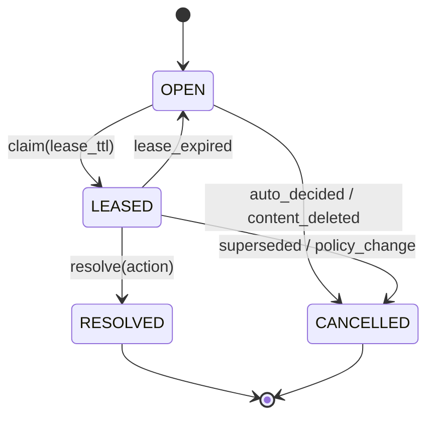
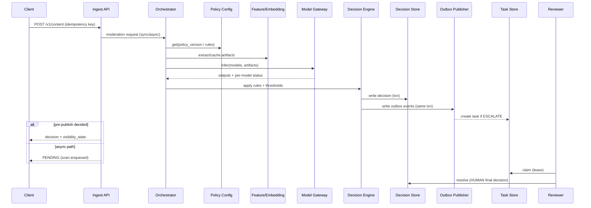

## Overview

A hybrid content moderation system must make fast, defensible decisions under uncertainty. Most user-generated content (UGC) should be automatically allowed or removed with low latency and predictable cost; ambiguous, novel, or high-impact cases must be escalated to human reviewers with consistent policy enforcement and a strong audit trail.

This design uses a **policy-driven routing layer** to orchestrate multi-model inference, produce a **calibrated risk assessment**, and generate an **evidence bundle**. A deterministic decision engine applies policy rules and confidence thresholds to select `ALLOW`, `LIMIT`, `REMOVE`, or `ESCALATE`. Escalations create durable human review tasks with prioritized queues, “four-eyes” options for sensitive categories, and immutable logging. Reviewer outcomes feed back into continuous evaluation, calibration, and retraining to increase automation safely over time.

## Requirements

### Functional Requirements
- Ingest UGC for **text**, **images**, and **video** (including updates/edits); support:
  - **Pre-publish** gating (synchronous decision within a tight latency budget)
  - **Post-publish** scanning (asynchronous enforcement with retroactive actions)
- Execute one or more detectors (e.g., toxicity, self-harm, nudity/sexual content, violence, hate, spam, fraud, CSAM reporting triggers, policy-specific classifiers) and return a unified outcome: `ALLOW | LIMIT | REMOVE | ESCALATE`.
- Apply deterministic **policy logic**:
  - account state (new user, verified, prior violations)
  - blocklists/allowlists
  - jurisdictional rules (locale/country)
  - “high-reach” amplification guardrails (viral content, large audiences)
- Provide a reviewer workflow:
  - task claiming with lease/TTL
  - evidence viewing (content + extracted features + model metadata + matched policies)
  - actioning with **reason codes** and policy references
  - secondary review / quality control (QC), sampling audits, and “four-eyes” workflows
- Support appeals:
  - user appeal submission, re-review queue, and final disposition
- Maintain an immutable audit trail capturing:
  - policy version, model versions, thresholds, and inputs/fingerprints
  - reviewer identity, decision, timing, and rationale
- Enable safe policy updates:
  - versioning, validation, staged rollout, and emergency rollback/kill-switch

### Non-Functional Requirements

#### Scale (example target)
- **Ingestion peak**: 50k requests/sec (all content surfaces)
- **Synchronous pre-publish**: 5k decisions/sec (subset of ingestion)
- **Volume**: 10B items/year (≈317 items/sec average), with bursty diurnal patterns and event-driven spikes
- **Users**: 500M DAU (implies strong emphasis on automation and operational safety)
- **Storage**:
  - media + derived artifacts (thumbnails/frames/embeddings): PB-scale object store
  - metadata + decision/audit logs: large OLTP + append-only streams

#### Latency (SLO targets)
- **Pre-publish (text)**: P50 ≤ 80ms, P99 ≤ 250ms
- **Pre-publish (image)**: P99 ≤ 800ms *for lightweight gating path* (heavy analysis continues asynchronously)
- **Post-publish scanning**: end-to-end P99 ≤ 2 minutes (enqueue + inference + action)
- **Human review**:
  - P1 queues median ≤ 5 minutes, P95 ≤ 60 minutes
  - lower priority queues have explicit SLA tiers (e.g., P95 ≤ 24 hours)

#### Availability & Durability
- **Decision read/write path** (ingest → decision): 99.99% (regional)
- **Reviewer tooling**: 99.9%
- **Durability**:
  - audit logs: RPO ≈ 0 (append-only, replicated, immutable where required)
  - decisions/tasks: RPO ≤ 1 minute (or 0 with synchronous replication for critical flows)
  - media: multi-AZ object-store durability

#### Consistency Model
- **Strong consistency** for:
  - task state transitions (lease, resolve, cancel)
  - finalized decisions for a given `content_id`
- **Eventual consistency** acceptable for:
  - analytics, search indexing, offline training datasets, and dashboards

### Constraints & Assumptions
- Cloud environment with managed Kafka/PubSub, managed SQL, and Kubernetes for services.
- Strict privacy/security requirements (GDPR/CCPA), sensitive content access controls, and retention management.
- Adversarial environment (evasion, probing thresholds, replay, burst attacks).
- Human review is expensive; aim to minimize escalation while maintaining safety and policy correctness.

## Architecture

### High-Level Components

```mermaid
flowchart TB
  %% Clients & Edge
  C[Clients] --> G[API Gateway / Edge Auth]
  G --> I[Ingest API]

  %% Storage for content
  I --> M[(Object Store: media + artifacts)]
  I --> CM[(SQL: content metadata)]

  %% Moderation orchestration
  I -->|sync pre-publish| ORCH[Moderation Orchestrator]
  I -->|async post-publish| BUS[(Event Bus: Kafka/PubSub)]

  BUS --> ORCH

  %% Policy and features
  ORCH --> PC[Policy Config Service]
  ORCH --> FE[Feature/Embedding Service]

  %% Inference
  ORCH --> MG[Model Gateway]
  MG --> MS1[Text Models]
  MG --> MS2[Vision Models]
  MG --> MS3[Specialized Detectors]

  %% Decisioning
  ORCH --> DE[Decision Engine]
  DE --> DS[(Decision Store: strongly consistent)]
  DE --> OUT[Outbox / Event Log]

  %% Side effects
  OUT --> EX[Action Executor<br/>(limit/remove/notify/index)]
  OUT --> TQ[(Task Store / Workflow Engine)]
  OUT --> ANA[(Analytics / Monitoring Stream)]
  OUT --> OL[(Offline Training / Evaluation)]

  %% Human review
  RC[Reviewer Console] --> RAPI[Review API]
  RAPI --> TQ
  RAPI --> DS
  RAPI --> M
  RAPI --> AL[(Immutable Audit Log)]
  DE --> AL
  EX --> AL
```

### Key Concepts
- **Two-lane moderation**:
  - **Synchronous lane** (pre-publish): lightweight checks + fast models + strict timeouts; returns immediate `ALLOW/REMOVE/LIMIT/ESCALATE`.
  - **Asynchronous lane** (post-publish): heavy models, video frame analysis, graph/behavioral signals, and backfills.
- **Evidence bundle**: content pointers + extracted features + model outputs + matched policy rules; stored for replayability and audit.
- **Determinism**: decisions are reproducible by persisting policy/model versions and normalized inputs/fingerprints.

## Component Deep-Dive

### Ingest API
**Responsibilities**
- Authenticate/authorize submission, validate schema, rate-limit by actor/surface.
- Store media to object storage and metadata to SQL.
- Emit moderation requests (sync or async).

**Design**
- **Idempotency** via `client_request_id` scoped to `(owner_user_id, surface)`; guarantees “exactly-once effect” for content creation and moderation initiation.
- **Deduplication** using a fingerprint:
  - text: normalized hash (with privacy-preserving hashing)
  - images/video: perceptual hash + media checksum to reduce repeated processing and abuse

**Failure behavior**
- If pre-publish cannot be decided within deadline: return `PENDING` with safe defaults (surface-dependent), and enforce via async scanning.

### Policy Config Service
**Responsibilities**
- Serve versioned policy bundles (rules + thresholds + queue mapping + SLA classes).
- Support staged rollout (by region/locale/surface/user tier) and emergency rollback.

**Design**
- Policies are immutable, referenced by `policy_version`.
- Router/Orchestrator caches policies locally with:
  - TTL refresh (e.g., 30–60s)
  - push invalidation (optional)
  - last-known-good fallback
- Strong validation: schema checks + unit tests + fixture-based “golden” decisions before rollout.

### Feature/Embedding Service
**Responsibilities**
- Extract or fetch features used by models/rules:
  - text normalization, language detection
  - image embeddings, OCR, perceptual hash
  - video: frame sampling + keyframe embeddings; optional audio transcription pipeline

**Design**
- Separation from model serving isolates feature compute, improves reuse, and enables caching.
- Cache artifacts (embeddings/thumbnails/frames) in object store with strict authorization and retention.

### Model Gateway + Model Serving
**Responsibilities**
- Standardize model inputs/outputs; enforce deadlines and per-model timeouts.
- Support canary, shadow, and A/B evaluation.
- Return per-model status and metadata (version, calibration id, latency).

**Design**
- **Multi-model** strategy:
  - fast filter models (high recall) for gating
  - heavier models for async confirmation and nuanced categories
- **Calibration**:
  - per-model, per-locale (and sometimes per-surface) calibration to produce comparable risk scores
  - track calibration version independently (e.g., `calibration_id`)

**Scaling**
- Autoscale on QPS and GPU utilization.
- Batch inference for async scanning.
- Keep last N model versions warm for rollback.

### Decision Engine
**Responsibilities**
- Aggregate model outputs + deterministic rules into a final outcome.
- Generate a human-readable reason code set and evidence bundle references.
- Persist decisions and emit side effects reliably.

**Design**
- Decision flow:
  1. validate required signals (policy gating)
  2. apply hard rules (legal takedowns, explicit blocklists)
  3. combine calibrated model risks (e.g., max/ensemble + policy weights)
  4. apply thresholds and escalation rules
  5. emit `ALLOW | LIMIT | REMOVE | ESCALATE` with reasons and explainability pointers
- **Replayability**: store `policy_version`, `model_bundle`, and normalized content fingerprints.
- **Transactional outbox** to atomically persist decision + enqueue downstream effects (tasks, notifications, analytics).

### Human Review System
**Responsibilities**
- Task creation, prioritization, assignment/claiming, reviewer UX, QC sampling, and audit.
- Support specialized queues by locale/policy domain and handle sensitive content access controls.

**Design**
- **Lease-based claiming**:
  - claim returns task + lease token, valid until `lease_expires_at`
  - renew lease to continue work; resolve requires a valid token
  - expired leases return task to queue
- **Queueing model**:
  - `queue_key = policy_domain:locale:priority:sensitivity`
  - multiple SLA tiers (P1/P2/P3) with explicit deadlines
- **QC and consistency**:
  - sampling-based audits
  - inter-rater agreement measurement for policy clarity
  - optional “four-eyes” workflow for sensitive queues



## Data Model

### Primary Tables (SQL)

**`content_items`**
- `content_id` (PK, UUID)
- `owner_user_id`
- `content_type` (`TEXT|IMAGE|VIDEO`)
- `media_uri` (nullable)
- `text_body_ref` (nullable; pointer to encrypted blob store if not stored inline)
- `content_fingerprint` (hash; for dedupe/replay; privacy-reviewed)
- `locale`, `country`, `surface`
- `created_at`, `updated_at`
- `visibility_state` (`PENDING|VISIBLE|LIMITED|REMOVED`)
- `risk_tier` (derived from user/account signals)
- Indexes: `(owner_user_id, created_at)`, `(visibility_state)`, `(content_fingerprint)`

**`moderation_decisions`** (append-oriented; latest view derived by query/materialization)
- `decision_id` (PK)
- `content_id` (FK)
- `decision` (`ALLOW|LIMIT|REMOVE|ESCALATE`)
- `reason_codes` (array or join table)
- `policy_version`
- `model_bundle` (JSON: `{name, version, calibration_id, score, latency_ms, status}`)
- `confidence` (0..1; policy-defined meaning)
- `evidence_ref` (pointer to evidence bundle in object store)
- `created_at`
- `finalized_at` (nullable)
- `finalized_by` (`SYSTEM|HUMAN|APPEAL`)
- Indexes: `(content_id, created_at DESC)`, `(policy_version, created_at)`

**`review_tasks`**
- `task_id` (PK)
- `content_id`
- `queue_key`
- `priority` (int)
- `state` (`OPEN|LEASED|RESOLVED|CANCELLED`)
- `lease_owner` (nullable)
- `lease_token_hash` (nullable)
- `lease_expires_at` (nullable)
- `sla_deadline_at`
- `created_at`, `resolved_at` (nullable)
- Indexes: `(queue_key, state, priority, sla_deadline_at)`, `(lease_owner, state)`

**`review_actions`** (append-only)
- `action_id` (PK)
- `task_id`, `content_id`, `reviewer_id`
- `action` (`ALLOW|LIMIT|REMOVE|ESCALATE|REQUEST_MORE_INFO`)
- `reason_codes`
- `notes_redacted_ref` (nullable; avoid raw sensitive text in SQL)
- `created_at`

**`appeals`**
- `appeal_id` (PK)
- `content_id`, `requester_user_id`
- `state` (`OPEN|IN_REVIEW|RESOLVED|REJECTED`)
- `created_at`, `resolved_at` (nullable)
- `resolution` (nullable; mirrors decision enum + reason codes)

**`idempotency_keys`**
- `scope_key` (e.g., `owner_user_id:client_request_id`) (PK)
- `content_id`
- `first_seen_at`, `last_seen_at`
- `response_snapshot` (optional for safe retries)

**`outbox_events`** (transactional outbox)
- `event_id` (PK)
- `aggregate_type` (`content|task|decision`)
- `aggregate_id`
- `event_type`
- `payload`
- `created_at`
- `published_at` (nullable)
- Indexes: `(published_at, created_at)`

**`audit_log`** (append-only; immutable/WORM when required)
- `event_id`, `event_type`, `principal`, `resource_id`, `payload_hash`, `created_at`

### Artifacts (Object Store)
- Original media, thumbnails, extracted frames, embeddings, OCR output, and evidence bundles.
- Retention policies by category (e.g., shorter retention for sensitive previews; longer for audit-required categories).

## Data Flow



## API Design

### Public REST APIs

**Create/Update Content**
- `POST /v1/content`
- Request (JSON):
  - `client_request_id` (string, required)
  - `content_type` (`TEXT|IMAGE|VIDEO`)
  - `text_body` (string, optional)
  - `media_upload_token` (string, optional)
  - `locale` (string), `country` (string), `surface` (string)
  - `mode` (`PRE_PUBLISH|POST_PUBLISH`)
- Response (JSON):
  - `content_id`
  - `visibility_state` (`PENDING|VISIBLE|LIMITED|REMOVED`)
  - `moderation_status` (`DECIDED|PENDING_REVIEW|PENDING_SCAN`)
  - `decision` (optional: `{decision, reason_codes, policy_version, decided_at}`)

**Fetch Moderation Status**
- `GET /v1/content/{content_id}/moderation`
- Response:
  - `latest_decision`
  - `review_state` (optional)
  - `appeal_eligible` (bool)

**Appeal**
- `POST /v1/content/{content_id}/appeal`
- Response: `{appeal_id, status}`

### Internal APIs (gRPC recommended)

**Model Inference**
- `Infer(ContentArtifacts, PolicyContext) -> ModelOutputs`
  - deadline propagated from edge; returns partial results with per-model status

**Task Operations**
- `ClaimTask(queue_key) -> TaskWithLease`
- `RenewLease(task_id, lease_token) -> Lease`
- `ResolveTask(task_id, lease_token, action, reason_codes, notes_ref) -> FinalDecision`

### Error Envelope
- `{code, message, retryable, details}`
- Common codes: `INVALID_ARGUMENT`, `UNAUTHENTICATED`, `PERMISSION_DENIED`, `CONFLICT` (lease lost), `RESOURCE_EXHAUSTED` (backpressure), `DEADLINE_EXCEEDED`.

### Idempotency Guarantees
- `POST /v1/content` is idempotent for a given `(owner_user_id, client_request_id)`.
- Decisions/tasks/events use a transactional outbox to avoid split-brain side effects (e.g., decision stored but task not created).

## Scaling & Performance

### Latency Budget (pre-publish text example)
- Edge auth + routing: 10–20ms
- Ingest validation + metadata: 10–20ms
- Policy fetch (cached): 1–5ms
- Feature extraction: 5–15ms
- Model inference (fast model set): 30–120ms (strict timeout; partial results allowed)
- Decision + store write: 10–30ms
- Total P99 target: ≤ 250ms (requires aggressive timeouts, caching, and small fast models)

### Bottlenecks & Mitigations
- **Inference capacity (GPU/CPU)**:
  - autoscaling, quantization/distillation, tiered models (fast filter → heavy confirm), batching for async scans
- **Human review backlog**:
  - prioritized queues, dynamic thresholds within guardrails, safe temporary `LIMIT` actions, surge staffing playbooks, sampling audits for low-risk categories
- **Hot content / viral amplification**:
  - per-actor rate limits, risk-tiered gating, consistent hashing + salting for partitions, caching embeddings and previously-seen fingerprints
- **Downstream side effects** (feeds/search/notifications):
  - async action executor with retries and idempotent operations; circuit breakers to prevent cascading failures

### Partitioning & Storage Choices
- Kafka/PubSub topics partitioned by `content_id` and by domain (`text`, `image`, `video`) to isolate workloads.
- Decision store:
  - read replicas for read-heavy paths
  - consider horizontally scalable SQL (Spanner/Cockroach) if write throughput exceeds a single-writer cluster’s comfort zone
- Task store:
  - partition by `queue_key` for efficient claim queries and SLA tracking

### Caching
- Policies and model metadata in-process cache (TTL 30–60s + optional push invalidation).
- Embeddings/thumbnails via object store + CDN (short TTL for sensitive previews; authorization enforced server-side).
- Idempotency keys and “fingerprint seen” caches in Redis (TTL hours–days depending on abuse patterns).

## Trade-offs & Alternatives

### Key Trade-offs
1. **Policy router + multi-model decisioning** vs a single end-to-end model  
   - Pros: faster iteration on policy, safer rollouts, clearer explanations, targeted improvements  
   - Cons: more moving parts, calibration complexity, integration overhead

2. **Lease-based task claiming** vs strict exactly-once assignment  
   - Pros: resilient to disconnects, scales well, simple operational model  
   - Cons: requires idempotent resolution and careful lease/token handling

3. **Two-lane (sync + async) moderation** vs uniform moderation semantics  
   - Pros: meets tight UX latency while still running heavy analysis; minimizes harm window via retroactive actions  
   - Cons: complexity in user messaging and surface-specific behaviors

4. **Append-oriented decision logging** vs in-place updates  
   - Pros: auditability, replayability, easier debugging of policy/model rollouts  
   - Cons: larger storage footprint; requires “latest decision” materialization patterns

### Alternatives
- **Fully asynchronous moderation**: simplest posting UX, but larger harm window and more complex retroactive enforcement.
- **Monolithic moderation service**: easier early on, but slower iteration and larger blast radius for failures.
- **Rules-only moderation**: transparent and cheap, but brittle, easy to evade, and poor at nuanced harms.
- **LLM-based reasoning as primary classifier**: flexible, but cost/latency variability and evaluation/audit complexity; often better as a secondary signal or reviewer-assist.

## Failure Modes & Mitigations

### Failure Scenarios
1. **Model serving latency spike/outage**
   - Impact: pre-publish stalls; backlog grows; inconsistent UX
   - Detection: inference P99, timeout rate, per-model error budget burn
   - Mitigation: strict deadlines, circuit breakers, fallback to fast models, safe `LIMIT+ESCALATE` for high-risk, allow low-risk with tighter rate limits, async reprocessing

2. **Review backlog spike (attack/viral event/staffing gap)**
   - Impact: SLA breaches; unsafe content remains visible longer
   - Detection: queue depth, age-of-oldest-task, SLA miss rate, throughput vs arrival rate
   - Mitigation: dynamic thresholds within guardrails, temporary throttles, safe limiting actions, queue reprioritization, surge staffing and escalation runbooks

3. **Policy misconfiguration (bad thresholds/rules)**
   - Impact: mass false positives/negatives, user trust damage
   - Detection: canary metrics, decision distribution shifts, complaint/appeal spikes
   - Mitigation: versioned policies, staged rollout, automatic rollback on SLO guardrails, emergency kill-switch, fixture-based validation

4. **Decision/task store partial outage or partition**
   - Impact: decisions not persisted; tasks not created; inconsistent enforcement
   - Detection: DB errors, replication lag, outbox publish lag
   - Mitigation: transactional outbox, retries with backoff, degrade to `PENDING` + async reprocessing, regional failover, runbooks for reconciliation

5. **Reviewer console compromise / insider abuse**
   - Impact: unauthorized access to sensitive content, malicious actions
   - Detection: anomaly detection (impossible travel, bulk actions, unusual queue access), audit log alerts
   - Mitigation: RBAC/ABAC, just-in-time access, device posture checks, session recording, dual approval for sensitive queues, immutable audit logs, regular access reviews

### Disaster Recovery
- Targets: RTO 30 minutes (core ingestion/decision read), RPO ≈ 0 (audit), RPO ≤ 5 minutes (decisions/tasks) depending on replication mode.
- Backups: continuous PITR for SQL, cross-region replication for object store and audit logs.
- Practice: game days for regional failover and replay-based reconstruction from event logs/outbox.

## Operational Considerations

### SLOs, SLIs, and Guardrails
- SLIs:
  - pre-publish decision latency and availability
  - model inference timeout/error rate per model
  - escalation rate, removal rate, appeal rate (by policy version)
  - queue age-of-oldest by priority, reviewer throughput, lease conflict rate
  - outbox lag, event bus consumer lag
- Guardrails for rollouts:
  - decision distribution shifts beyond baseline bands
  - spike in `ESCALATE` or `REMOVE` without correlated incident
  - appeal rate and revert rate (appeal succeeds) for new policies/models

### Monitoring & Alerting
- Alerts (examples):
  - pre-publish P99 latency > 250ms for 5 minutes
  - model timeout rate > 1% for 5 minutes (per model and aggregate)
  - oldest P1 task age > 10 minutes
  - outbox publish lag > 60 seconds
  - sustained increase in `PENDING` responses (deadline fallback)

### Deployment Strategy
- Services: canary + progressive delivery with auto-rollback on SLO violations.
- Models: shadow traffic, then canary by region/locale/surface; keep last N versions warm.
- Policies: versioned, validated, staged rollout; emergency revert path tested regularly.

### Security & Privacy
- Encrypt sensitive content and artifacts at rest; minimize storing raw content where not required.
- Reviewer access:
  - least privilege (RBAC/ABAC), sensitive queue gating, JIT elevation
  - content redaction and blurred previews where possible
  - strict logging of every view/action (immutable audit)
- Data lifecycle:
  - category-based retention and deletion workflows (GDPR/CCPA)
  - controls for exporting evidence for legal holds where applicable

## References & Further Reading
- Kafka: https://kafka.apache.org/documentation/
- Temporal (workflow engine): https://docs.temporal.io/
- KServe (model serving on Kubernetes): https://kserve.github.io/website/
- Google TFX (training pipelines): https://www.tensorflow.org/tfx
- “Practical Lessons from Predicting Clicks on Ads at Facebook” (production ML themes): https://research.facebook.com/publications/practical-lessons-from-predicting-clicks-on-ads-at-facebook/
- Meta Transparency Center (enforcement at scale): https://transparency.meta.com/
- OWASP API Security Top 10: https://owasp.org/API-Security/