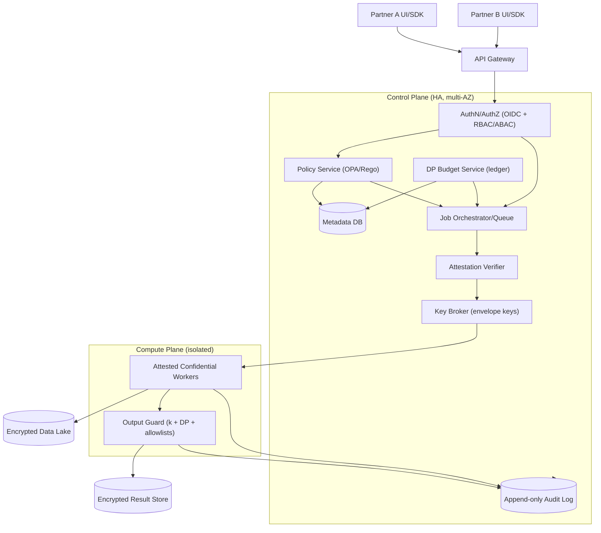
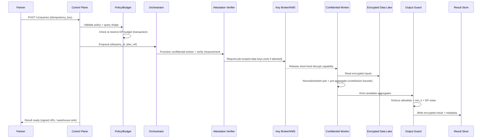

# Data Clean Room

## Overview

A data clean room enables two (or more) parties to join and analyze datasets (e.g., ad impressions and sales) without revealing row-level records to any participant, and ideally without requiring the operator to access plaintext. The hard part is not the join algorithm—it’s preventing privacy leaks that emerge from correlation and repeated querying: small cohorts, differencing attacks, high-cardinality group-bys, and accidental exposure through logs, intermediate files, or misconfigured egress.

A production-grade clean room is an end-to-end governance and privacy system:

- **Constrained query surface** that only permits approved aggregates.
- **Policy enforcement** (allowed joins, dimensions, metrics, minimum cohort sizes).
- **Privacy accounting** (differential privacy budgets with correct composition).
- **Secure execution** (confidential computing with remote attestation and strict egress).
- **Tamper-evident auditability** (who queried what, why it was allowed, and what was released).

Key architectural insight: build two planes:
1. **Control plane** (highly available): identity, metadata, policies, budget accounting, audit, orchestration.
2. **Compute plane** (isolated): executes only approved workloads, produces only approved aggregates, and is cryptographically attested before it can access data.

## Requirements

### Functional Requirements

- Ingest partner datasets (batch; optional incremental) into isolated tenant namespaces.
- Support privacy-safe joins on approved keys (email/phone/device ID) with deterministic normalization and tokenization.
- Provide a constrained query interface (templates or restricted SQL) that returns **aggregates only** (no row export).
- Enforce per-collaboration policies: allowed joins, allowed dimensions, minimum cohort size (`k`), metric allowlist, time windows, retention, and egress destinations.
- Enforce differential privacy (DP) budgeting (epsilon/delta) across queries; block when depleted.
- Deliver results to approved destinations (object storage, warehouse) via signed URLs / short-lived credentials.
- Provide full auditability: identity, policy version/hash, attestation evidence, budget consumption, suppression decisions, and result release.
- Support collaboration workflows: dataset approvals, policy negotiation, time-bounded access grants, and revocation.

### Non-Functional Requirements

**Scale (initial “serious production”, not hyperscale)**
- Tenants (organizations): **100–500**
- Datasets: **10k** total, **1–20** versions each
- Total data under management: **1–5 PB** (object storage)
- Control plane traffic: **100–300 QPS sustained**, **1k QPS burst** (API + UI)
- Compute: **50–200 concurrent jobs typical**, **500 burst**; peak **20k–50k vCPU** depending on job size/SLA

**Latency (realistic for governed batch analytics)**
- Control-plane APIs: **P99 < 300 ms** (authz + metadata + submission)
- Job admission (policy + budget decision): **P99 < 1 s**
- Job start (queue + provisioning + attestation):
  - **P99 < 90 s** with pre-warmed enclaves
  - **P99 < 5 min** cold start (capacity + attestation path)
- Typical job completion:
  - **0.5–2 TB**: **10–40 min**
  - **2–5 TB**: **30–120 min**
  (high variance based on join selectivity, skew, and allowed dimensions)

**Availability**
- Control plane: **99.95%** (multi-AZ, single-region) with optional multi-region DR
- Compute plane: **99.9%** (capacity dependent; degraded modes allowed)

**Consistency**
- Strong consistency for: policies, approvals, budgets, query state transitions, and audit ordering.
- Eventual consistency acceptable for: dataset availability after ingestion (target **< 5 min**).

**Durability**
- Metadata DB: **RPO ≤ 5 min**, **RTO ≤ 60 min** (single-region); faster with multi-region replicas
- Audit log and data artifacts: object storage durability (e.g., **11x9**) after acknowledgment

### Constraints & Assumptions

- Parties do not fully trust each other or the operator; minimize operator access to plaintext.
- Outputs are aggregates only; no raw join keys, no per-user segments, no low-`k` slices.
- Compliance target: SOC2 baseline; optional HIPAA/PCI requires stricter isolation, keying, and access boundaries.
- Threat model includes: differencing attacks, malicious analysts, compromised operator credentials, and accidental leakage. Side-channel resistance is best-effort (hardening + monitoring), not a formal proof.

## Architecture

### High-Level Diagram

### Trust Boundaries (what can see what)

- **Control plane**: sees identities, schemas, policies, query templates/parameters, budgets, and audit metadata. It should not access partner plaintext datasets.
- **Compute plane** (attested confidential workers): can decrypt and process input data **only** after policy approval and attestation. It has no arbitrary egress; it can only write:
  - aggregate outputs through the Output Guard
  - minimal telemetry/audit signals (no raw data)

## Core Concepts (Educational)

### 1) Tokenization for joins (avoid raw identifiers)

To join across parties, both sides must transform join keys into a common representation **without** exposing the raw identifiers. A safe baseline is deterministic tokenization using HMAC with secrets held by the platform:

- Normalize (e.g., email lowercase/trim; phone to E.164).
- Tokenize using **HMAC-SHA256** (not plain hashing) with a secret.
- Prefer **policy-scoped** secrets so tokens are linkable only within a specific collaboration.

Policy-scoped token example:
- `token = HMAC(policy_secret, normalized_identifier)`
- This prevents a token from being reused to correlate identities across unrelated collaborations.

### 2) k-anonymity is necessary but not sufficient

Minimum cohort size (`k`) prevents obvious small-group leaks, but it does not stop differencing attacks (“query twice with slightly different filters”). DP budgeting and query canonicalization address repeated-query leakage.

### 3) Differential privacy requires contribution bounding

DP is only meaningful if you bound each individual’s influence (e.g., max events per user per day, max number of groups contributed to). This often requires a **per-identity pre-aggregation** stage inside the enclave before producing group-level aggregates.

## Components

### Control Plane (Governance + APIs)

**Responsibilities**
- Authentication/authorization (OIDC/SAML, tenant isolation, RBAC/ABAC).
- Dataset registration, schema management, and approvals.
- Policy negotiation and versioning (explicit approvals by all parties).
- Query submission and validation (restricted shapes only).
- Privacy budget accounting and enforcement (strongly consistent).
- Job orchestration and immutable audit metadata.

**Key design decisions**
- **Allowlist query surface**: templates or a restricted SQL grammar that forbids selecting identifiers, raw tokens, or high-cardinality outputs.
- **Idempotent query submission**: required to prevent duplicate budget spending on retries.
- **Budget as a ledger**: avoid “update a counter” races; record debits as immutable entries and compute spent as a sum (with transactional enforcement).

**Implementation notes**
- Metadata DB: Postgres (single-region HA) is sufficient for this scale; Spanner/CockroachDB for multi-region active/active.
- Policy evaluation: OPA/Rego is a good fit, but keep policies small and testable; version + hash every decision.
- Audit: append-only log plus periodic hash-chaining/anchoring for tamper evidence.

### Data Ingestion & Normalization

**Responsibilities**
- Secure ingestion (signed manifests, checksums, malware/DLP scanning where applicable).
- Schema validation and drift detection.
- Key normalization and tokenization.
- Storage layout optimization (columnar, partitioning, optional bucketing).

**Key design decisions**
- Normalize join keys deterministically and record the normalization spec in metadata.
- Tokenization secrets are never exposed to partners; tokenization runs in a controlled environment (ideally inside attested compute, or via a dedicated tokenization service with strict controls).
- Use Parquet/ORC, partition by time (e.g., `event_date`), and optionally bucket by token prefix for join performance.

**Scaling**
- Horizontal ETL workers with per-tenant quotas.
- Backpressure on ingestion to protect the lake and metadata DB.
- Quarantine partitions that fail validation; never “partially accept” a version without recording state.

### Confidential Compute Plane

**Responsibilities**
- Execute approved workloads with plaintext access constrained to an attested environment.
- Enforce strict egress controls.
- Produce only intermediate aggregates that are then validated by the Output Guard.

**Key design decisions**
- **Remote attestation gate**: keys are released only if the enclave proves it is running an approved image/config (measurement, signature, policy).
- **Short-lived data keys**: use envelope encryption and grant decryption capability per job with tight TTLs.
- **No arbitrary egress**: only allow writes to the result store via a controlled sink; block external network by default.

**Technology choices**
- Confidential VMs/containers: AMD SEV-SNP, Intel TDX (depending on cloud).
- Engines: Spark/Trino for TB-scale; DuckDB can be useful for small/medium jobs but is not a TB-scale default.
- Orchestration: Kubernetes + a job queue; separate node pools for confidential workloads.

### Output Guard (Privacy Enforcement)

**Responsibilities**
- Enforce policy constraints on outputs: allowed dimensions/metrics, min cohort size, and retention rules.
- Apply DP noise (when enabled) and account privacy loss.
- Prevent repeated-query leakage via canonicalization and “sticky noise” where appropriate.

**Key design decisions**
- Enforce `k` per output cell and suppress/merge small cells.
- Apply DP with:
  - defined query classes (count, sum, mean, histogram)
  - contribution bounds (per identity)
  - composition rules (advanced composition / RDP where applicable)
- Use **canonical query hashes** to support sticky noise and caching while still charging budget.

**Important caveat**
- Sticky noise reduces “averaging away” noise but can leak if the canonicalization is too granular (e.g., including timestamps or near-unique filters). Canonicalization must be carefully defined and reviewed.

### Audit & Compliance

**Responsibilities**
- Tamper-evident logging for: dataset version acceptance, policy approvals, query submissions, decisions, attestation evidence, key release events, and result releases.
- Support incident investigations and compliance reporting without logging sensitive data.

**Key design decisions**
- Log policy hash, template ID, canonical query hash, and decision ID—never raw identifiers or raw data.
- Store audit logs in WORM-capable object storage, plus a queryable index for investigations.

## Data Model

### Metadata Schema (Relational)

- `tenants(tenant_id, name, created_at, status)`
- `principals(principal_id, tenant_id, type, external_id, created_at, status)`
- `datasets(dataset_id, tenant_id, name, description, created_at, status)`
- `dataset_versions(version_id, dataset_id, schema_json, location_uri, format, row_count, min_event_time, max_event_time, created_at, status)`
- `join_key_specs(spec_id, dataset_id, key_type, normalization_spec, tokenization_scope, key_version, created_at)`
- `policies(policy_id, name, participant_tenants_json, allowed_joins_json, allowed_dims_json, allowed_metrics_json, min_k, dp_config_json, retention_days, created_at, status, policy_hash)`
- `policy_approvals(policy_id, tenant_id, approved_by, approved_at, status)`
- `dp_budget_accounts(account_id, policy_id, epsilon_total, delta, reset_period, created_at, status)`
- `dp_budget_ledger(entry_id, account_id, query_id, epsilon_debit, created_at)`  
  (append-only; spent is derived; enforcement uses a transaction that checks remaining budget)
- `queries(query_id, policy_id, submitted_by, template_id, params_json, canonical_query_hash, status, epsilon_cost, created_at, started_at, finished_at, idempotency_key)`
- `results(result_id, query_id, output_uri, output_schema_json, row_count, suppressed_cells, dp_applied, released_at, expires_at)`
- `audit_events(event_id, tenant_id, type, subject_type, subject_id, payload_json, created_at, prev_hash, event_hash)`  
  (hash-chained for tamper evidence)

### Data Lake Layout (Object Storage, Encrypted)

- `.../tenant={tenant_id}/dataset={dataset_id}/version={version_id}/event_date=YYYY-MM-DD/part-*.parquet`
- Optional: bucketing by `token_prefix` (e.g., first 2–3 bytes of HMAC token) to reduce join shuffle.

### Data Flow (Query Execution)

## API Design

### Conventions

- All mutating endpoints require `Idempotency-Key`.
- Errors use `application/problem+json`.
- Every decision returns `policy_hash` and `decision_id` for audit correlation.

### Control Plane APIs (REST)

**Create dataset**
- `POST /v1/datasets`
- Request:
  - `{"name":"impressions","description":"...","schema":{"fields":[...]}}`
- Response:
  - `{"dataset_id":"...","state":"CREATED"}`
- Errors: `400` invalid schema, `409` name conflict

**Register dataset version (ingestion manifest)**
- `POST /v1/datasets/{dataset_id}/versions`
- Request:
  - `{"location_uri":"s3://.../incoming/...","format":"parquet","join_keys":[{"key_type":"email","normalization":"email_v1","tokenization_scope":"policy_scoped"}],"checksum":"..."}`
- Response:
  - `{"version_id":"...","state":"VALIDATING"}`
- Notes: version transitions are explicit: `VALIDATING -> ACCEPTED|REJECTED`

**Create policy**
- `POST /v1/policies`
- Request:
  - `{"name":"Ads+Sales Clean Room","participants":["tenantA","tenantB"],"allowed_joins":[{"left":"impressions.email_token","right":"sales.email_token"}],"allowed_dimensions":["campaign_id","event_date"],"allowed_metrics":["impressions","clicks","purchases"],"min_k":100,"dp":{"enabled":true,"epsilon_total":10.0,"delta":1e-6,"reset_period":"30d","query_classes":["count","sum"]},"retention_days":30}`
- Response:
  - `{"policy_id":"...","status":"PENDING_APPROVAL"}`
- Approvals:
  - `POST /v1/policies/{policy_id}:approve`

**Submit query**
- `POST /v1/queries`
- Request:
  - `{"policy_id":"...","template_id":"conversion_rate_by_campaign","params":{"start_date":"2025-01-01","end_date":"2025-01-31"},"idempotency_key":"..."}`
- Response:
  - `{"query_id":"...","status":"QUEUED","epsilon_cost":0.2,"policy_hash":"..."}`
- Errors:
  - `403` policy violation
  - `409` insufficient DP budget
  - `422` unsupported query shape/params

**Get query status**
- `GET /v1/queries/{query_id}`
- Response:
  - `{"query_id":"...","status":"RUNNING","created_at":"...","started_at":"...","epsilon_cost":0.2,"policy_hash":"..."}`

**Fetch result**
- `GET /v1/queries/{query_id}/result`
- Response:
  - `{"output_uri":"https://...signed...","expires_at":"...","row_count":1234,"suppressed_cells":12,"dp_applied":true}`
- Notes: results are never streamed inline through the API.

## Scaling & Performance

### Key Bottlenecks (and mitigations)

- **Join skew / hotspots**: popular identifiers or heavy-hitter keys can dominate partitions.
  - Mitigate with skew detection, salting strategies, and limiting allowed join keys/dimensions.
- **Shuffle cost**: TB-scale joins are network-bound.
  - Mitigate with bucketing by token prefix, column pruning, bloom filters, and partition pruning by time.
- **Confidential start latency**: attestation and capacity provisioning add overhead.
  - Use pre-warmed pools, cached attestation verification, and separate queues by job size.
- **Budget contention**: concurrent submissions can race.
  - Use transactional enforcement and ledger-based debits; require idempotency keys.
- **High-cardinality outputs**: even if aggregates-only, “GROUP BY user_agent + zip + timestamp” can create near-row-level leakage.
  - Enforce dimension allowlists, cardinality limits, and minimum `k` per cell.

### Horizontal Scaling Strategy

- API tier: stateless services + autoscaling; tenant-level rate limits.
- Metadata DB: start with Postgres HA + read replicas; partition/shard by tenant if growth demands it.
- Orchestration: durable queue (e.g., managed) with separate lanes (small/medium/large) and per-tenant quotas.
- Compute: autoscaled confidential worker pools; pre-warm for SLA tiers; cap concurrency per collaboration to manage budget and abuse.

### Caching Strategy (safe-by-design)

- Cache compiled policy decisions and template plans (TTL 1–5 minutes).
- Optional result caching for identical canonical queries:
  - Still records a ledger entry (budget debit) to prevent bypass.
  - Uses sticky noise so cached results match recomputed outputs.

## Trade-offs & Alternatives

### Trade-offs Made

- **Confidential compute + governance-first design**
  - Pros: reduces operator trust requirements; strong isolation and provable measurement.
  - Cons: higher cost, operational complexity, and imperfect side-channel story.
- **Templates/restricted SQL instead of “full SQL”**
  - Pros: drastically reduces accidental leakage and makes DP accounting tractable.
  - Cons: less analyst flexibility; more upfront template engineering.
- **DP budgets for repeated queries**
  - Pros: strongest practical defense against differencing at scale.
  - Cons: noisy results; requires contribution bounding and careful UX around interpretation.
- **Data lake + batch-first compute**
  - Pros: cost-effective for heavy joins; clear security boundaries; aligns with governance workflows.
  - Cons: not sub-second; interactive exploration is limited.

### Alternatives (when you might choose them)

- **Private Set Intersection (PSI)**
  - Good for overlap measurement and some restricted joins; less flexible for rich multi-dimensional analytics.
- **Secure MPC without TEEs**
  - Strong cryptographic guarantees but often too slow/expensive for TB-scale joins and complex analytics.
- **Warehouse-native clean rooms (BigQuery/Snowflake)**
  - Strong operational simplicity; may not satisfy “operator cannot access plaintext” depending on platform controls and threat model.

## Failure Modes & Mitigations

### Scenarios

**1) Budget bypass via retries/races**
- Impact: privacy guarantees violated (over-release).
- Detection: ledger anomalies, duplicate idempotency keys, negative remaining budget.
- Mitigation: mandatory idempotency keys, transactional reserve+debit, single source of truth ledger.

**2) Small-cohort leakage (k too small or high-cardinality dimensions)**
- Impact: re-identification risk.
- Detection: suppressed-cell counters, cardinality alarms, query-deny spikes.
- Mitigation: enforce `min_k`, dimension allowlists, cardinality caps, DP with correct contribution bounds.

**3) Attestation failure or unapproved image**
- Impact: potential plaintext exposure.
- Detection: measurement mismatch, signature verification failure, attestation error rates.
- Mitigation: deny key release, signed images + SBOM checks, staged rollouts, emergency revocation.

**4) Data exfiltration via logs/intermediate files**
- Impact: leakage to operator tools or storage.
- Detection: DLP scans, log sampling guards, egress policy violations.
- Mitigation: no-PII logging, encrypted scratch, restricted filesystem mounts, egress allowlists only.

**5) KMS/Key Broker outage**
- Impact: jobs cannot start; degraded availability.
- Detection: key release latency/errors, KMS health checks.
- Mitigation: multi-AZ KMS, retry with jitter, short-lived cached job tokens only if consistent with threat model (often better to fail closed).

**6) Poisoned inputs / DoS through skew or malformed data**
- Impact: degraded performance, failed jobs, misleading analytics.
- Detection: ingestion validation failures, distribution checks, skew and null-rate alarms.
- Mitigation: strict schema validation, quarantine, per-tenant quotas, heavy-hitter handling.

### Disaster Recovery

- Control plane: **RTO ≤ 1 hour**, **RPO ≤ 5 min**
- Compute plane: **RTO ≤ 4 hours** (capacity + image/attestation readiness)
- Backups:
  - metadata DB WAL archiving + daily snapshots
  - audit log replication + WORM retention
  - cross-region replication for result artifacts (optional)
- Failover:
  - restore control plane in DR region, replay orchestration state from durable queue, re-verify enclave images before resuming key release

## Operations

### SLOs (example)

- Control plane API availability: **99.95%** monthly
- Query admission decision latency: **P99 < 1 s**
- Job start latency (pre-warmed tier): **P99 < 90 s**
- Audit event ingestion: **P99 < 5 s** to durable storage
- Security SLO: **0** key releases without valid attestation

### Monitoring & Alerting

- Security: attestation success rate, key release counts, denied key releases, unexpected egress attempts, policy-deny spikes.
- Privacy: budget spend rate, ledger anomalies, suppressed cell counts, DP failures, repeated-query frequency.
- Reliability: job success rate, queue depth, runtime percentiles, worker utilization, lake read throughput.
- Data quality: ingestion failures, schema drift, join-key null rates, skew metrics.
- Critical alerts: budget enforcement failures, output guard errors, attestation verifier failures, audit pipeline stalls.

### Deployment & Change Management

- Control plane: rolling or blue/green; backward-compatible migrations; feature flags for policy rule changes.
- Compute plane: canary confidential images; pin jobs to image hashes; block rollout if attestation verification fails.
- Policy changes: versioned policies requiring explicit re-approval by participants; audit every change and its effective time.
- Incident response: “fail closed” on uncertainty (attestation/keys/budget/output guard); provide runbooks for key rotation, policy revocation, and result takedown.

## References & Further Reading

- Amazon Clean Rooms: https://docs.aws.amazon.com/clean-rooms/
- Google Ads Data Hub (conceptual reference): https://support.google.com/adsdatahub/
- Snowflake Clean Rooms: https://docs.snowflake.com/en/user-guide/cleanrooms
- Confidential Computing Consortium: https://confidentialcomputing.io/
- Intel TDX / SGX overview: https://www.intel.com/content/www/us/en/developer/tools/software-guard-extensions/overview.html
- OpenDP (DP tooling): https://opendp.org/
- Differential Privacy (foundations): https://privacytools.seas.harvard.edu/differential-privacy
- PSI survey: https://eprint.iacr.org/2017/799
- NIST Privacy Engineering (useful background): https://www.nist.gov/privacy-framework