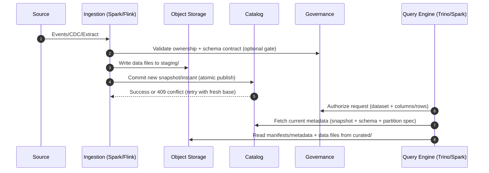

## Overview

A modern data lake must provide warehouse-like reliability (ACID tables, schema evolution, time travel, incremental reads) while retaining the cost and openness benefits of cloud object storage (S3/GCS/ADLS). Object stores are durable and elastic but do not provide database primitives like transactions, indexes, or row-level mutation. The core challenge is building correctness, performance, and governance above immutable blobs without relying on unsafe “list-and-guess” patterns.

This design implements a **governed lakehouse** on object storage using:
- An **open table format** (primarily **Apache Iceberg**, with **Apache Hudi** for CDC/upsert-heavy cases),
- A **transactional catalog** as the source of truth for table metadata and commit concurrency,
- An **optimization plane** (compaction/clustering/metadata cleanup) that runs asynchronously,
- A **governance plane** (authn/z, audit, classification, lineage) enforced consistently across engines.

The document is written to be interview-ready: it emphasizes the “why” behind choices, gives concrete scale/latency targets, and calls out operational and failure-mode realities.

---

## Requirements

### Functional Requirements
- Ingest batch and streaming data into object storage and publish curated tables in Iceberg/Hudi.
- Support ACID semantics at the table level: insert/upsert/delete/merge, schema evolution, partition evolution, and time travel.
- Support incremental consumption:
  - Iceberg: snapshot-based incremental reads and (where enabled) equality deletes / position deletes,
  - Hudi: incremental pulls (timeline) and CDC-style consumption.
- Provide automated maintenance: compaction, clustering/sorting, snapshot/commit retention, metadata cleanup.
- Enable multi-engine access with consistent semantics:
  - Writers: Spark/Flink (and possibly ingestion services),
  - Readers: Trino/Presto/SparkSQL and BI tools.
- Enforce governance centrally with consistent authorization across engines and zones:
  - dataset ownership, PII tagging/classification, row/column-level policies (where required),
  - audit logs, lineage, and policy change workflows.
- Provide lifecycle management:
  - retention by zone, snapshot expiration, orphan file cleanup,
  - GDPR delete workflows (subject deletion requests).
- Expose APIs for discovery and metadata: datasets, schemas, ownership, lineage, and operational state.

### Non-Functional Requirements

#### Scale (Concrete)
- **Ingestion rate**: sustained 5,000 events/sec; peak 50,000 events/sec.
  - If average payload is ~2 KB: peak ingest ≈ 100 MB/sec ≈ 8.6 TB/day raw.
- **Storage growth**: 5–20 PB over 3 years (raw + curated + intermediate + metadata).
- **Metadata cardinality**:
  - up to 20,000 tables,
  - up to 200,000 partitions/day across all tables,
  - target **data file size**: 256–512 MB Parquet (ZSTD), with a strict “small-file budget” per partition.
- **Query concurrency**: up to 2,000 concurrent users (mix of BI + ad hoc + scheduled jobs).
  - Expectation: concurrency is absorbed by a combination of query queues, result caching (optional), and multiple compute pools.

#### Latency Targets
- **Ingestion → curated publish**: P50 2 minutes, P99 10 minutes (including commit + governance checks + initial optimization eligibility).
- **Interactive queries (curated, well-partitioned)**: P50 2–5 seconds, P99 30 seconds.
- **Catalog API (read metadata)**: P99 < 200 ms (hot path: current snapshot + schema + partition spec).
- **Policy evaluation**: P99 < 50 ms for authorization decisions (excluding external IdP latency).

#### Availability & Durability
- **Control plane (catalog + governance)**: 99.95% availability.
- **Ingestion/optimization planes**: 99.9% (jobs can retry; backlog is acceptable within SLAs).
- **Durability**:
  - object storage durability assumed (provider-managed),
  - catalog database with PITR and cross-AZ HA; **RPO ≤ 15 minutes**, **RTO ≤ 2 hours** for full restore.

#### Consistency Model
- **Strong consistency** for:
  - table commits (atomic update of the current table metadata pointer),
  - metadata reads of the “current snapshot” via the catalog.
- **Eventual consistency acceptable** for:
  - search indexing, lineage enrichment, derived metrics, and audit pipeline analytics.
- **Important boundary**: ACID guarantees are **per table**; multi-table transactions require orchestration (two-phase patterns are avoided unless strictly necessary).

### Constraints & Assumptions
- Cloud environment with managed object storage and IAM integration.
- Engines run in private networks (VPC/VNet) and access object storage via private endpoints.
- Compliance: SOC2 + GDPR; least privilege; auditable access; retention controls.
- Team size: ~6–10 engineers; prefer managed components where they reduce on-call risk, but preserve open table formats and interoperability.

---

## Architecture

### High-Level Architecture (Planes and Systems)

```mermaid
flowchart TB
  %% Clients
  U[BI Users / Analysts] --> QG[Query Gateway]
  J[Batch Jobs / Notebooks] --> QG
  CI[CI/CD & Admin Tools] --> APIGW[Control Plane API Gateway]

  %% Query plane
  QG --> TR[Trino/Presto Cluster]
  QG --> SPK[Interactive SparkSQL (optional)]

  %% Ingestion plane
  SRC[Sources: DBs, SaaS, Events] --> BUS[(Kafka / PubSub / Kinesis)]
  BUS --> STR[Flink / Streaming Ingest]
  SRC --> BATCH[Batch Ingest (Spark/DBT/ELT)]

  %% Data plane (zones)
  subgraph OBJ[Object Storage (Data Plane)]
    RAW[(raw/)]
    STG[(staging/)]
    CUR[(curated/)]
    MD[(table-metadata/)]
  end

  %% Control plane
  subgraph CTRL[Control Plane]
    CAT[Transactional Catalog API\n(Iceberg REST / Glue / Nessie)]
    GOV[Governance Service\n(Policy + Audit + Classification)]
    IDX[Metadata Search Index\n(OpenSearch/Elastic)]
    SIEM[Audit Sink / SIEM]
  end

  %% Optimization plane
  subgraph OPT[Optimization Plane]
    ORCH[Workflow Orchestrator\n(Airflow/Argo)]
    OPTJ[Optimize Jobs\n(Compaction/Clustering/Metadata Cleanup)]
    Q[(Work Queue)]
  end

  %% Data access paths
  TR --> CAT
  TR --> CUR
  SPK --> CAT
  SPK --> CUR

  STR --> STG
  STR --> CAT
  BATCH --> STG
  BATCH --> CAT

  %% Optimization paths
  ORCH --> Q
  Q --> OPTJ
  OPTJ --> CUR
  OPTJ --> CAT

  %% Governance paths
  APIGW --> GOV
  APIGW --> CAT
  GOV --> CAT
  GOV --> IDX
  GOV --> SIEM

  %% Publish flow (staging -> curated)
  STG --> CUR
  CAT --> MD
```

### Architectural Principles (Why This Works)
- **Avoid list-based correctness**: engines must read table state from the catalog (current snapshot/instant), not from object listing.
- **Immutable data + atomic metadata pointer**: writers create new data files and then atomically “publish” them by committing new table metadata (Iceberg snapshot metadata or Hudi timeline instants).
- **Asynchronous maintenance**: compaction/clustering runs out-of-band to keep ingestion latency stable and to manage cost/compute separately.
- **Central policy, consistent enforcement**: governance is a single source of truth, but enforcement happens in engines/connectors so all tools apply the same rules.

---

## Components

### 1) Object Storage (Raw, Staging, Curated)

**Responsibilities**
- Durable storage for raw files, staged writes, curated table data files (Parquet/ORC), and table metadata artifacts.

**Key Decisions**
- Separate prefixes/buckets for `raw/`, `staging/`, `curated/`, and optionally `table-metadata/` to apply different IAM, retention, and monitoring.
- Enable:
  - bucket-level encryption (KMS-managed keys),
  - versioning on critical prefixes (especially metadata),
  - explicit lifecycle policies per zone (raw retention is often longer; staging is shortest).

**Operational Notes**
- “Strong read-after-write” exists in many modern object stores, but correctness still must not depend on listing behavior; commits rely on the catalog’s atomic update.
- Object storage throttling is real at high request rates; design for request shaping and predictable concurrency (especially during optimization).

---

### 2) Table Format Layer (Iceberg + Targeted Hudi)

**Responsibilities**
- Provide table-level ACID semantics, schema/partition evolution, time travel, and efficient scans/pruning.

**Primary Choice: Apache Iceberg**
- Broad engine compatibility (Spark, Flink, Trino).
- Predictable metadata model (snapshots + manifests) with well-defined maintenance procedures.
- Strong support for partition evolution and hidden partitioning patterns.

**When to Use Apache Hudi**
- Upsert-heavy workloads needing:
  - incremental consumption with low-latency pull patterns,
  - record-level mutation patterns that align with Hudi’s timeline and file-group model.
- Typically paired with Spark/Flink; ensure the read engines match your chosen table type (COW vs MOR).

**File/Layout Targets**
- Data file size: **256–512 MB** (Parquet + ZSTD).
- Partitioning guideline:
  - default: `dt` (day) or `event_hour` (hour) for high-volume event streams,
  - avoid over-partitioning; use clustering/sorting and bucketing for selective queries on high-cardinality keys.
- Enforce a **small-file budget**: e.g., alert if `> 500` files in a hot partition or average file size `< 64 MB`.

---

### 3) Transactional Catalog (Table Metadata Source of Truth)

**Responsibilities**
- Atomic commits and metadata reads for all engines.
- Concurrency control for writers.
- Uniform view of schemas, partition specs, snapshots, and table properties.

**Key Decisions**
- Use a catalog that supports:
  - atomic update of current metadata pointer,
  - optimistic concurrency with conflict detection,
  - locking where needed (especially in managed catalogs).
- Keep “authoritative metadata” separate from “search/discovery indexing” to protect P99 latency.

**Technology Options**
- Managed:
  - AWS Glue Catalog + Iceberg (with appropriate commit locking),
  - Lake Formation when governance integration is desired.
- Self-managed:
  - Iceberg REST Catalog backed by HA Postgres/MySQL,
  - Project Nessie for branching/versioned workflows (e.g., data product promotion via branches).

**Performance Targets**
- Cache hot metadata (current snapshot pointer + schema) in-process or Redis with TTL 30–120s and event-driven invalidation on commit.

---

### 4) Ingestion Plane (Batch + Streaming)

**Responsibilities**
- Validate, normalize, and write data files; publish commits; maintain exactly-once or effectively-once semantics depending on source.

**Streaming Ingestion Pattern**
- Read from Kafka/PubSub/Kinesis.
- Write files to `staging/`.
- Commit to the table via the catalog:
  - Iceberg: commit new snapshot referencing written files,
  - Hudi: commit a new instant in the timeline.
- Store checkpoint/offset state (e.g., Kafka offsets) so the pipeline can resume without duplication.

**Batch Ingestion Pattern**
- Periodic jobs (Spark/ELT) write data files and commit snapshots.
- Prefer “append + merge” patterns over per-row mutation when possible for throughput.

**Writer Concurrency**
- For high-churn tables, enforce a writer policy:
  - streaming: typically one logical writer per table (or per shard) to reduce conflict rate,
  - batch backfills are isolated (separate branch/table clone or scheduled windows) to avoid commit contention.

---

### 5) Optimization Plane (Compaction, Clustering, Cleanup)

**Responsibilities**
- Rewrite small files, optimize clustering/sorting, rewrite manifests/metadata, expire snapshots, and remove orphan files.

**Key Decisions**
- Run optimization asynchronously, with per-table SLAs and budgets:
  - “hot” tables optimized continuously,
  - “cold” tables optimized on schedule or threshold triggers.
- Treat optimization as a production workload with cost controls:
  - rewrite only when ROI is positive (bytes rewritten vs query savings),
  - cap daily rewrite bytes per table.

**Common Procedures**
- Iceberg: `rewriteDataFiles`, `rewriteManifests`, `expireSnapshots`, `removeOrphanFiles`.
- Hudi: compaction/clustering schedules; carefully control MOR log growth.

---

### 6) Governance, Lineage, and Audit

**Responsibilities**
- Authentication and authorization (dataset access, least privilege).
- Classification/PII tagging and enforcement (masking, row filters where required).
- Audit logging for access and policy changes.
- Lineage collection for pipelines and downstream consumers.

**Key Decisions**
- Central PDP (policy decision point) with distributed enforcement:
  - Trino/Spark/Flink must integrate with the same policy rules.
- Raw zone is **restricted by default**; promotion to curated requires ownership, schema contracts, and policy review.

**Technology Choices**
- Authn: OIDC/SAML via cloud identity provider.
- Policy: Lake Formation / Ranger / OPA-based PDP (depending on ecosystem).
- Lineage: OpenLineage + Marquez/DataHub; propagate dataset identifiers consistently.
- Audit: immutable append-only logs to SIEM; alert on anomalous access patterns.

---

## Data Model

### Dataset and Metadata Entities (Conceptual)
- **Dataset**: business-owned logical object (e.g., `sales.orders`).
- **Table**: physical implementation (Iceberg/Hudi) with location, schema versions, partition specs, and snapshots.
- **Policy**: access rules + masking/row filters; versioned with approvals.
- **Maintenance state**: compaction targets, last optimized, retention policies, cost budgets.

### Catalog/Registry Schema (Relational Example)
**`datasets`**
- `dataset_id` (UUID, PK)
- `name` (string, unique; e.g., `db.table`)
- `owner_team` (string)
- `zone` (enum: raw|curated)
- `table_format` (enum: iceberg|hudi)
- `location` (string; e.g., `s3://bucket/curated/db/table/`)
- `created_at`, `updated_at`

**`schemas`**
- `schema_id` (UUID, PK)
- `dataset_id` (FK)
- `version` (int)
- `avro_json` (text) or `iceberg_schema_json` (text)
- `effective_at` (timestamp)

**`policies`**
- `policy_id` (UUID, PK)
- `dataset_id` (FK)
- `policy_type` (enum: read|write|mask|row_filter)
- `definition` (json)
- `version` (int)
- `updated_by`, `updated_at`

**`maintenance_state`**
- `dataset_id` (FK, PK)
- `target_file_size_mb` (int)
- `compaction_sla_minutes` (int)
- `daily_rewrite_budget_gb` (int)
- `last_optimized_at` (timestamp)
- `last_snapshot_expired_at` (timestamp)

### Table-Format Metadata (Object Storage)
- Iceberg: `metadata/*.json`, manifest lists, manifests, data files.
- Hudi: `.hoodie/` timeline, file groups, log files (MOR), data files (COW).

---

## Data Flow

### Write + Publish (Atomic Commit) and Read



### Maintenance (Asynchronous Optimization)

```mermaid
sequenceDiagram
  autonumber
  participant Or as Orchestrator
  participant Opt as Optimize Job
  participant Obj as Object Storage
  participant Cat as Catalog

  Or->>Opt: Trigger optimize(table, partitions, budget)
  Opt->>Obj: Read candidate files + write rewritten files
  Opt->>Cat: Commit optimized snapshot/instant (atomic)
  Cat-->>Opt: Success or conflict (retry/abort)
```

---

## API Design

### Conventions
- Auth: `Authorization: Bearer <JWT>` (or cloud-signed requests for service principals).
- Idempotency: `Idempotency-Key` required for write APIs.
- Pagination: `limit` + `pageToken`.
- Errors: consistent envelope with `code`, `message`, and `details`.

### Catalog APIs (REST)

**Create table**
- `POST /v1/tables`
- Request:
  ```json
  {
    "name": "db.table",
    "format": "iceberg",
    "location": "s3://lake/curated/db/table/",
    "properties": {
      "write.target-file-size-bytes": "536870912",
      "format-version": "2"
    }
  }
  ```
- Response:
  ```json
  { "tableId": "uuid", "metadataLocation": "s3://lake/table-metadata/db/table/metadata-00001.json" }
  ```
- Errors: `409` name exists, `400` invalid location, `403` unauthorized

**Get table (hot path)**
- `GET /v1/tables/{name}`
- Response:
  ```json
  {
    "name": "db.table",
    "format": "iceberg",
    "schema": { "fields": [] },
    "partitionSpec": { "fields": [] },
    "currentSnapshotId": 123,
    "metadataLocation": "s3://..."
  }
  ```
- Errors: `404` not found, `503` catalog unavailable

**Commit (engine integration)**
- `POST /v1/tables/{name}/commit`
- Notes:
  - Payload is format-specific (Iceberg: snapshot update + base metadata reference; Hudi: instant metadata).
  - Conflicts return `409`; client retries with refreshed base state and a bounded retry budget.

**List tables**
- `GET /v1/tables?prefix=db.&limit=100&pageToken=...`

### Governance APIs

**Set/update a policy**
- `POST /v1/policies`
- Request:
  ```json
  { "dataset": "db.table", "type": "mask", "definition": { "columns": { "ssn": "redact" } } }
  ```
- Response: `{ "policyId": "uuid", "version": 7 }`
- Errors: `422` invalid policy, `403` not owner/admin

**Audit query**
- `GET /v1/audit?dataset=db.table&from=2025-12-01T00:00:00Z&to=2025-12-17T00:00:00Z&limit=1000&pageToken=...`

### Maintenance APIs

**Request optimize**
- `POST /v1/maintenance/optimize`
- Request:
  ```json
  { "dataset": "db.table", "partitions": ["dt=2025-12-17"], "mode": "compact", "maxRewriteGB": 200 }
  ```
- Response: `{ "jobId": "uuid", "status": "queued" }`

---

## Scaling & Performance

### Capacity and Throughput Planning (Back-of-the-Envelope)
- Peak ingest 50k events/sec at 2 KB ≈ 100 MB/sec raw.
- If curated compression achieves ~3–6× reduction depending on schema, curated growth might be ~1.5–3 TB/day for that stream.
- File sizing:
  - at 256 MB target files, 100 MB/sec sustained writes would generate excessive file counts unless micro-batches are aggregated; enforce minimum batch sizes and buffered writers.

### Common Bottlenecks and Mitigations
- **Small files** increase query planning time and manifest/metadata overhead.
  - Mitigation: buffered writes, larger commit intervals where acceptable, async compaction, per-partition file-count alerts.
- **Commit contention** on high-churn tables.
  - Mitigation: writer coordination, isolate backfills, shard tables (or partition writes) where appropriate, bounded retry with jitter.
- **Object store request throttling** during wide scans/rewrites.
  - Mitigation: cap concurrency, use engine request shaping, schedule rewrites off peak, and tune manifest sizing/partitioning to reduce request count.
- **Metastore/catalog latency spikes** under heavy read load.
  - Mitigation: cache hot metadata, rate-limit expensive endpoints (e.g., listing snapshots), separate discovery index.

### Horizontal Scaling Strategy
- **Ingestion**: scale consumers by partitioned streams; isolate “hot” tables into dedicated ingestion fleets.
- **Compute engines**:
  - separate pools for BI vs ETL (and optionally for “trusted” vs “experimental” workloads),
  - query queues and resource groups (e.g., Trino resource groups) to protect latency SLOs.
- **Control plane**:
  - stateless APIs behind L7 load balancer,
  - HA relational DB with read replicas and PITR,
  - Redis/in-memory caching for hot metadata.
- **Optimization**:
  - queue-driven job triggers; isolate optimization compute; enforce rewrite budgets and backpressure.

### Partitioning and Layout Guidelines
- Prefer partitions that match dominant filters (usually time).
- Avoid high-cardinality partitions; use clustering/sorting and bucketing for selective queries.
- Regularly review partition skew and adjust specs via partition evolution (Iceberg) rather than creating new tables.

### Caching
- Metadata cache: 30–120s TTL + invalidation on commit events (best-effort).
- Optional query result cache for BI dashboards with minutes TTL; invalidate on snapshot changes for impacted tables.
- Engine local caches (where supported) for Parquet footers and remote reads.

---

## Trade-offs & Alternatives

### Trade-offs (Explicit)
1) **Open lakehouse (Iceberg/Hudi) vs proprietary warehouse storage**
- Chosen: open formats on object storage.
- Trade-off: more integration work (catalog, governance, optimization) and operational ownership.
- Why: portability across engines, cost control at PB scale, and avoiding vendor lock-in.

2) **Asynchronous optimization vs synchronous perfect layout**
- Chosen: background compaction/clustering.
- Trade-off: newly ingested data may be fragmented until optimized.
- Why: keeps ingestion predictable, reduces tail latency spikes in writers, and allows cost-governed optimization.

3) **Central policy definition + distributed enforcement**
- Chosen: one policy source of truth, enforced by multiple engines.
- Trade-off: requires careful integration testing and consistent semantics across tools.
- Why: avoids “policy drift” and ensures the same dataset has consistent access controls everywhere.

4) **Strong commit consistency vs eventual discovery**
- Chosen: strong consistency for current table state via catalog; eventual indexing for search/lineage.
- Trade-off: discovery/UI may lag behind commits.
- Why: protects correctness and low-latency hot metadata reads.

### Alternatives and When They Win
- **Delta Lake-only**: strong if Spark-centric and governance/engine constraints accept it.
- **Warehouse-first (Snowflake/BigQuery) + external tables**: strong for turnkey ops and fast time-to-value; less control over layout/optimization and can be more expensive at PB scale.
- **HDFS-based lake**: rarely preferred in cloud due to operational overhead and weaker elasticity compared to object storage.

---

## Failure Modes & Mitigations

### Failure Scenarios (At Least 3)

1) **Object storage elevated 5xx / outage**
- Impact: read/write failures; optimization backlogs; query errors.
- Detection: elevated storage error rate, increased request latency, canary reads on critical prefixes.
- Mitigation:
  - exponential backoff with jitter; circuit-break non-critical workloads,
  - prioritize curated reads; pause optimization first,
  - for critical datasets: cross-region replication and documented failover runbook.

2) **Catalog/database outage or severe latency**
- Impact: no commits; readers may fail if they can’t fetch current snapshot; operational tooling degraded.
- Detection: catalog health checks, DB failover alarms, P99 metadata latency alerts.
- Mitigation:
  - HA DB (multi-AZ), PITR, read replicas,
  - degrade to read-only discovery mode if possible,
  - bounded caching for reads (short-lived) with clear “stale metadata” limits.

3) **Commit conflicts from concurrent writers**
- Impact: ingestion retries; publish latency increases; possible backlog.
- Detection: increased `409` rates; commit retry budget exhaustion metrics.
- Mitigation:
  - enforce writer coordination policies,
  - shard hot tables or separate write streams,
  - isolate backfills and schema changes into controlled windows.

4) **Optimization runaway (cost blowup or churn)**
- Impact: excessive bytes rewritten/day; high compute spend; object store request saturation.
- Detection: rewrite bytes/day, cost anomaly alerts, request-rate alarms.
- Mitigation:
  - per-table rewrite budgets, thresholds (min small files/partition), and schedules,
  - stop-the-bleed kill switch for optimization queues.

5) **Governance misconfiguration (over-block or data leak)**
- Impact: outage (blocked access) or compliance incident (unauthorized exposure).
- Detection: policy change audit events, automated policy tests, anomaly detection on access logs.
- Mitigation:
  - approvals/workflows and policy-as-code,
  - break-glass roles with strict auditing,
  - continuous verification (golden queries) for sensitive datasets.

### Disaster Recovery (Control Plane)
- Targets: **Catalog RPO ≤ 15 minutes**, **RTO ≤ 2 hours**.
- Backups: PITR for catalog DB; periodic export of governance metadata; object versioning for metadata prefixes.
- Failover: promote standby DB, redeploy catalog/governance in secondary region, switch engine endpoints, validate with canary queries against curated tables.

---

## Operations

### SLOs and Runbooks
- SLO examples:
  - catalog `GET /v1/tables/{name}` P99 < 200 ms,
  - commit success rate > 99.9% (excluding conflicts),
  - ingestion-to-curated P99 < 10 minutes for Tier-1 tables.
- Runbooks:
  - catalog failover,
  - stop optimization to protect storage,
  - hot-table conflict mitigation,
  - policy rollback and break-glass procedures.

### Monitoring & Alerting (Key Signals)
- Catalog: commit latency, conflict rate, DB CPU/IO/locks, P99 API latency, cache hit rate.
- Object storage: 4xx/5xx, request latency, throttling, bytes read/write, per-prefix request rates.
- Table health: small-file count, average file size, manifest count, snapshot count, partition skew.
- Query engines: queue depth, rejected queries, P95/P99 query latency by resource group, spill-to-disk rates.
- Governance: denied-request rate, policy evaluation latency, audit pipeline lag, anomalous access alerts.

### Deployment and Change Management
- Control plane: blue/green or canary; backward-compatible API contracts.
- Engine upgrades: maintain a compatibility matrix (Iceberg/Hudi versions vs Spark/Flink/Trino); stage in non-prod first.
- Policy changes: versioned, reviewed, and tested; fast rollback path.
- Maintenance jobs: safe to abort; rely on atomic commit semantics to prevent partial publishes.

### Cost Controls
- Separate budgets for:
  - ingestion compute,
  - query compute,
  - optimization compute,
  - storage + requests.
- Track and cap:
  - bytes rewritten/day by table,
  - object store request rate by workload class,
  - “cost per TB scanned” and “cost per successful publish” for Tier-1 datasets.

---

## References & Further Reading
- Apache Iceberg: `https://iceberg.apache.org/`
- Apache Hudi: `https://hudi.apache.org/`
- Project Nessie: `https://projectnessie.org/`
- OpenLineage: `https://openlineage.io/`
- Trino + Iceberg production guidance (Trino docs and community best practices)
- Lakehouse concepts (industry papers/blogs; evaluate vendor-neutral guidance critically)