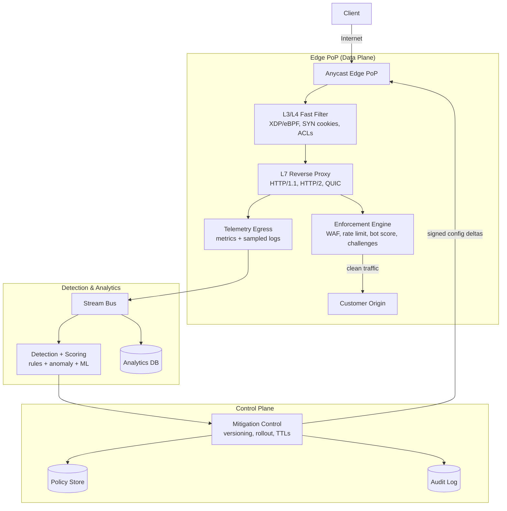
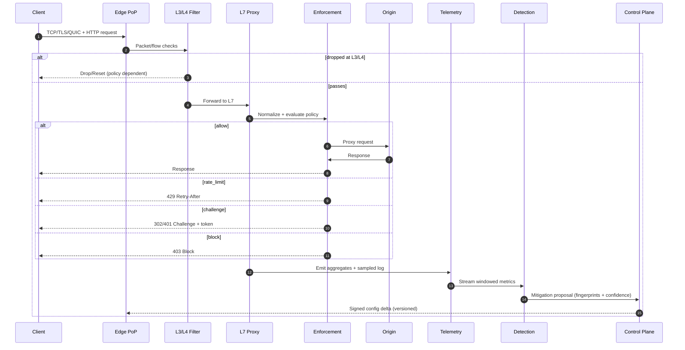

## Overview

A DDoS protection system keeps customer origins reachable by absorbing hostile traffic and enforcing intelligent filtering at Internet scale—without blocking legitimate users. Attacks vary widely (L3/L4 floods, L7 request floods, “low-and-slow”, protocol abuse like HTTP/2 Rapid Reset, botnets that mimic real browsers) and can change faster than humans can respond. Over-filtering is equally dangerous: false positives are user-facing downtime.

This design uses a global Anycast edge that terminates TCP/TLS/QUIC, applies fast-path L3/L4 filtering, and enforces L7 policies (WAF, rate limiting, bot detection, and challenges). A streaming telemetry pipeline continuously builds baselines and detects anomalies, then distributes mitigations back to edges within seconds using a versioned, guarded control plane.

**Key idea**: treat DDoS defense as a closed-loop control system—**observe → decide → act**—with tight feedback, safe rollout, and explicit false-positive controls.

### Goals
- Keep origin services stable under large L3/L4 and L7 attacks.
- Preserve user experience with selective, progressive friction (token → PoW → CAPTCHA).
- Propagate mitigations globally in seconds with rollback and blast-radius controls.
- Provide operator visibility (dashboards, APIs, audit logs) during incidents.

### Non-goals
- Replacing customer application security (authz logic, business abuse prevention).
- Perfect attribution of attackers (IPs and fingerprints are probabilistic).
- Storing raw full-fidelity traffic at all times (telemetry is sampled and bounded).

> Interview note: explicitly separate **data plane** (edge enforcement) from **control plane** (policy + mitigations). The data plane must remain effective even when the control plane is degraded.

---

## Requirements

### Functional Requirements
- Onboard protected properties (domains/IPs), configure origin routing, and define protection policies per property.
- Mitigate:
  - **L3/L4**: SYN floods, UDP floods/amplification, fragmented packets, malformed traffic.
  - **L7**: request floods, cache-bypass floods, slow requests, HTTP/2 abuse (streams/resets), bot scraping, credential stuffing (at the edge level).
- Enforce at the edge:
  - WAF rules (signature + behavioral)
  - Rate limiting (per-IP, per-session, per-fingerprint, per-path)
  - Bot signals and risk scoring
  - Challenge/allow/block decisions
- Adaptive challenges:
  - Token-based proof (cookie/header)
  - Proof-of-Work (PoW)
  - CAPTCHA (third-party optional; internal fallback required)
- Continuously analyze traffic:
  - Build baselines and detect anomalies
  - Produce attack fingerprints (IP/ASN prefix, country, JA4/JA3, UA, path templates, header patterns)
- Push mitigations to edge globally within seconds with staged rollout, TTLs, and rollback.
- Provide real-time dashboards and APIs for attack status, mitigation history, and audit logs.

### Non-Functional Requirements

#### Scale (target design point)
- **Global edge capacity**: 10 Tbps sustained, **50 Tbps burst** (multi-provider), with **>200 PoPs**.
- **Packets/sec**: up to **200 Mpps** aggregate (worst-case small packets during floods).
- **HTTP**: up to **20M RPS** aggregate sustained, **100M RPS burst** during large L7 events.
- **Tenancy**: 10K–100K protected properties; top tenant can see **1M+ RPS** during an attack.
- **Telemetry ingestion**: 1–5M events/sec normally, **5–20M events/sec** during major incidents (after sampling/aggregation).

#### Latency
- **Edge enforcement overhead** (beyond network RTT):
  - +1–3 ms P50, +10–20 ms P99 for L7 decisions under normal load
- **Challenge issuance** (edge-generated response):
  - <50 ms P99 at edge (excluding user interaction / third-party CAPTCHA latency)
- **Mitigation propagation**:
  - <10 s P99 from detection to global edge enforcement (faster for “emergency” operator actions)

#### Availability & Reliability
- **Edge proxy + enforcement**: 99.99% monthly (multi-PoP, multi-provider).
- **Control plane (policy/mitigation distribution)**: 99.9% monthly.
- **Dashboards/analytics**: 99.9% monthly (degraded acceptable during extreme attacks).

#### Consistency
- **Policy updates**: strongly consistent within a property’s configuration domain (monotonic versioning; single-writer per property).
- **Mitigations**: monotonic, versioned, and **eventually consistent across PoPs** (seconds).
- **Analytics**: eventual consistency; aggregates can lag minutes under extreme load.

#### Durability
- **Policy + audit logs**: RPO ≈ 0 (multi-AZ), RTO < 15 minutes.
- **Telemetry**: tolerate sampling loss under extreme attacks; target <1% drop in “aggregate” path.

### Constraints & Assumptions
- Anycast footprint (BGP) with multi-region PoPs; customers onboard via DNS delegation or routed IP prefixes.
- Third-party CAPTCHA is optional; internal fallback must work without external network dependencies.
- Minimal PII: IP addresses treated as sensitive; prefer hashing with keyed salts and strict retention.
- Edge software stack supports high-performance packet filtering (XDP/eBPF) and L7 proxying (Envoy/Nginx/custom).

---

## Architecture

### High-Level Diagram



### Request Path (fast path)
1. **Anycast routing** sends traffic to the nearest/healthy PoP.
2. **L3/L4 filter** drops obvious garbage cheaply (packet-level).
3. **L7 proxy** terminates TLS/QUIC and normalizes HTTP.
4. **Enforcement** applies WAF/rate limits/bot decisions and issues challenges.
5. Clean requests are proxied to the **origin**; optionally served from edge cache.

### Control Loop (slow path, seconds)
- Edge emits aggregates + sampled logs to telemetry.
- Detection computes anomalies, top offenders, and confidence-scored fingerprints.
- Control plane converts detections into **bounded** mitigations (TTL, caps, staged rollout) and distributes deltas to edges.

---

## Components

### 1) Anycast Edge PoP (Proxy + Routing)
**Responsibilities**
- Terminate TCP/TLS/QUIC, protect compute resources, and proxy clean traffic to customer origins.
- Enforce policy locally (no per-request dependency on central systems).

**Key decisions**
- Separate fast L3/L4 filtering from CPU-heavy L7 work.
- Enforce per-stage budgets (PPS/CPS/handshakes/RPS) to prevent resource exhaustion.

**Implementation notes**
- Multi-provider transit + DDoS-aware upstreams; RTBH/FlowSpec support for extreme events.
- Origin protection features: origin IP hiding, mTLS to origin, allowlisted edge egress IPs, and optional origin shielding.

---

### 2) L3/L4 Fast Filter (Packet/Connection Defense)
**Responsibilities**
- Drop/shed volumetric floods before they hit L7.
- Protect against connection exhaustion (SYN floods, UDP floods, reflection).

**Techniques**
- XDP/eBPF for stateless filtering, simple ACLs, and early drops.
- SYN cookies / SYN proxying; connection tracking with strict caps.
- Per-destination and per-source quotas; protocol validation and fragment handling.
- Dedicated handling for QUIC floods (UDP) with coarse filtering and token-based retries.

**Trade-off**
- L3/L4 filtering must be conservative to avoid false positives; rely on L7 signals for fine-grained decisions.

---

### 3) L7 Reverse Proxy
**Responsibilities**
- Parse/normalize HTTP (including HTTP/2), terminate TLS, enforce timeouts, and proxy to origin.
- Provide knobs that matter during attacks: header size limits, body limits, read/write timeouts, concurrency caps.

**Attack-specific hardening**
- HTTP/2 stream concurrency and reset-rate limits; mitigation for Rapid Reset patterns.
- Per-connection and per-IP request rate caps; protect keep-alive pools.
- Strict resource limits for expensive features (decompression, regex rules, large headers).

---

### 4) Enforcement Engine (WAF + Rate Limiting + Bot + Challenges)
**Responsibilities**
- Decide: `ALLOW | BLOCK | CHALLENGE | RATE_LIMIT | LOG_ONLY`.
- Mint and verify challenge tokens with minimal shared state.

**Decision inputs**
- Static policy rules (customer-configured WAF + allow/deny lists).
- Dynamic mitigations (fingerprints, emergency rules).
- Risk signals (JA4/JA3, TLS fingerprint, UA patterns, IP reputation, behavior).

**Challenge design**
- **Progressive**:
  1) Signed token (cookie/header) for low-risk verification
  2) PoW for medium-risk automation
  3) CAPTCHA for high-confidence bot traffic (with accessibility considerations)
- **Stateless verification**:
  - Signed tokens (e.g., PASETO/JWT-style) with short TTL (e.g., 5–30 minutes)
  - Bind token to: `property_id`, token version, issuance timestamp, and a coarse client binding (e.g., /24 or ASN + UA hash) to reduce replay without over-blocking NAT users
- Optional revocation list for incident response (small, TTL-based).

**Rate limiting strategy**
- Token bucket/leaky bucket for predictable behavior.
- Dimensions: IP prefix, session token, fingerprint, path template, method, and “risk tier”.
- Approximate structures (Count-Min Sketch) for high-cardinality dimensions; strict caps for expensive dimensions (full path, header combos).

---

### 5) Telemetry Pipeline (Metrics + Sampled Logs)
**Responsibilities**
- Provide near-real-time aggregates for detection and dashboards.
- Provide sampled forensic logs for investigations and customer reporting.

**Design**
- Dual-path:
  - **Aggregate path**: low-cardinality, high-reliability counters (must survive big attacks)
  - **Sample path**: richer request logs with adaptive sampling
- Adaptive sampling based on load and attack state (e.g., sample 1:10,000 under extreme floods; increase for “new” fingerprints).

**Storage**
- OLAP (ClickHouse/Druid) for queryable analytics.
- Object storage for long-term sampled logs (compressed, partitioned by day/tenant/region).

---

### 6) Detection + Scoring
**Responsibilities**
- Identify attack onset, classify attack type, and generate candidate mitigations with confidence.
- Keep false positives low through guardrails and staged rollouts.

**Approach**
- Hybrid:
  - Rules (known bad: reflection sources, malformed patterns)
  - Anomaly detection (baseline deviations per tenant/property)
  - Supervised scoring (bot likelihood) with explainable features

**Computations**
- Windowed aggregates (1m/5m/1h) to catch bursts and slow attacks.
- Heavy hitters (top-K) per dimension to bound cardinality and speed response.

---

### 7) Mitigation Control Plane (Config Distribution)
**Responsibilities**
- Convert detections and operator actions into safe, bounded mitigations.
- Distribute signed deltas to all PoPs with rollout controls.

**Guardrails**
- TTLs on dynamic mitigations (e.g., 10–60 minutes) with renewal required.
- Cardinality caps per property (e.g., max 5K dynamic rules active).
- Canary rollout (subset of PoPs / fraction of traffic) with automated rollback:
  - rollback triggers: increased 4xx to known-good cohorts, origin error spike, synthetic probe failure, user-reported signals
- “Last-known-good” caching at edge; monotonic version application.

**Consistency model**
- Single-writer per property configuration to provide clear ordering.
- Edges apply config deltas by version; missing versions trigger resync.

---

## Data Model

### Relational (Policy + Audit) — PostgreSQL (or distributed SQL)
- `tenants(id, name, plan, created_at)`
- `properties(id, tenant_id, domain, origin_config, tls_mode, created_at)`
- `policies(id, property_id, name, default_action, created_at)`
- `rules(id, policy_id, priority, match_expr, action, challenge_type, rate_limit, expires_at, created_at)`
- `mitigations(id, property_id, type, fingerprint, action, confidence, rollout_state, expires_at, created_at)`
- `audit_log(id, tenant_id, actor, action, object_ref, diff, created_at)`

**Notes**
- `audit_log` is append-only; tamper-evident hashing chain is recommended for high-trust environments.
- For multi-region: either (a) single primary region for writes + read replicas, or (b) distributed SQL if strict multi-region writes are required.

### Analytics (Sampled Events) — ClickHouse
Example table (sampled):
- `http_events(ts, property_id, pop, ip_hash, asn, country, method, host, path_tpl, status, bytes_in, bytes_out, ua_hash, ja4, tls_fp, risk_score, action, challenge, edge_latency_ms, origin_latency_ms)`

**PII handling**
- Hash IP and UA with a rotating keyed salt; store raw values only if explicitly enabled and legally justified.
- Retention defaults:
  - aggregates: 30–90 days
  - sampled logs: 7–30 days (tiered storage)

### Hot Counters — Redis/KeyDB (per PoP)
- `rl:{property}:{window}:{dimension}:{value}` → count (TTL)
- Optional approximate sketches for high-cardinality dimensions
- `revoked:{jti}` → boolean (TTL)

---

## Data Flow



---

## API Design

### Authentication & Multi-tenancy
- Customer API: OAuth2 (client credentials) or scoped API tokens; per-tenant rate limits.
- Internal edge/control: mTLS with workload identities; signed config bundles.

### Customer APIs (REST)

**Create property**
- `POST /v1/properties`
- Request:
  ```json
  { "domain": "api.example.com", "origin": { "host": "origin.internal", "port": 443 }, "tlsMode": "full" }
  ```
- Response:
  ```json
  { "id": "prop_123" }
  ```
- Errors: `409` domain exists, `400` invalid origin
- Idempotency: `Idempotency-Key`

**Update policy**
- `PUT /v1/properties/{propertyId}/policy`
- Request:
  ```json
  {
    "defaultAction": "allow",
    "rules": [
      { "priority": 10, "match": "path.startsWith('/login') && rpsPerIp(60) > 20", "action": "challenge", "challengeType": "pow" }
    ]
  }
  ```
- Response:
  ```json
  { "version": 42 }
  ```
- Errors: `422` invalid/too-broad rule, `403` forbidden

**Get attack status**
- `GET /v1/properties/{propertyId}/attacks?window=5m`
- Response:
  ```json
  {
    "window": "5m",
    "summary": { "rps": 120000, "blockedRps": 90000, "challengedRps": 20000, "originErrorRate": 0.01 },
    "topFingerprints": [{ "type": "ja4", "value": "t13d...","rps": 45000 }],
    "activeMitigations": [{ "id": "mit_9", "action": "block", "expiresAt": "2025-01-01T00:00:00Z" }]
  }
  ```

**Get audit log**
- `GET /v1/tenants/{tenantId}/audit?since=...`

### Internal APIs (gRPC)

**Config stream**
- `rpc StreamConfig(EdgeIdentity) returns (stream ConfigDelta)`
- Properties:
  - Deltas are signed; edges apply only monotonic versions.
  - Edge ACKs applied version; server can request resync.

**Telemetry ingest (optional direct)**
- `rpc EmitMetrics(stream MetricEvent) returns (Ack)`
- Best-effort and backpressured; never in request critical path.

### Error handling philosophy
- Prefer graceful degradation:
  - Fail-open for non-critical observability features (sampling/logging)
  - For enforcement: default to the configured policy mode (standard vs high-security) with conservative fallbacks to avoid self-inflicted outages.

---

## Scaling & Performance

### Capacity Planning (rough order-of-magnitude)
Assume **200 PoPs**, **50 Tbps burst**:
- Average burst per PoP: 250 Gbps (Anycast won’t balance perfectly; design for hot PoPs).
- Reserve headroom and enforce budgets:
  - PPS and CPS caps before L7
  - TLS handshake rate caps (separate from established connections)
  - HTTP concurrency caps and per-tenant fairness

### Bottlenecks and mitigations
- **TLS handshakes / CPU**: session resumption, handshake rate limits, cheap prefilters, hardware acceleration where available.
- **L7 parsing cost**: limit header sizes, normalize early, disable expensive features under attack mode.
- **Stateful rate limit counters**: per-PoP counters + approximate sketches; avoid cross-PoP coordination on the hot path.
- **High-cardinality analytics**: top-K heavy hitters, path templating, hashed buckets, strict dimension allowlists.
- **Control-plane fanout**: delta distribution, hierarchical rollout, signed bundles, last-known-good caching.

### Partitioning
- Telemetry: `{region}:{tenantBucket}` partitions for locality + parallelism.
- Detection: shard by `property_id` (or tenant) with prioritization for “under attack” properties.
- Analytics: regional ClickHouse clusters; cross-region aggregation is async.

### Caching
- Edge config cache: compiled rules in memory, refreshed via stream; TTL + signature verification.
- Challenge tokens: stateless; rely on expiry; revocation only for high-risk incidents.
- Optional origin shielding and CDN caching for cacheable endpoints to reduce origin load during partial L7 floods.

---

## Trade-offs & Alternatives

### Key trade-offs
1. **Local-first enforcement vs global coordination**
   - Chosen: PoP-local decisions with eventual global convergence.
   - Cost: inconsistent counters across PoPs; some attackers may rotate PoPs.
   - Benefit: low latency and survivability when control plane is degraded.

2. **Hybrid detection (rules + anomaly + ML) vs single approach**
   - Chosen: broader coverage and faster adaptation.
   - Cost: operational complexity (model drift, feature management).
   - Benefit: rules catch known attacks; anomaly catches novel patterns; ML improves precision.

3. **Progressive challenges vs always-on CAPTCHA**
   - Chosen: minimize user friction and accessibility issues.
   - Cost: some bots pass early stages briefly.
   - Benefit: higher conversion for legitimate users while forcing attackers to pay increasing cost.

### Alternatives
- **Centralized scrubbing in one region**: simpler, but higher latency and larger blast radius.
- **Only per-IP rate limiting**: insufficient against distributed botnets; requires multi-signal fingerprints.
- **Hardware-only mitigation**: excellent for L3/L4, but still needs L7 logic and tenant-aware policies.

---

## Failure Modes & Mitigations

### 1) Control plane outage
- **Impact**: no new mitigations; edges run on last-known-good config.
- **Detection**: stream disconnects, failed rollout metrics, version staleness.
- **Mitigation**: edge caching; operator “emergency rules” path; dynamic mitigations auto-expire conservatively.

### 2) False-positive mitigation blocks legitimate users
- **Impact**: tenant-facing outage or conversion drop.
- **Detection**: 4xx spike, synthetic probe failures, cohort comparison (tokened/known-good traffic), customer alerts.
- **Mitigation**: canary rollout; automatic rollback on error-budget breach; allowlist escape hatch; short TTLs.

### 3) Telemetry overload or lag
- **Impact**: reduced visibility; slower detection.
- **Detection**: bus lag, ingestion saturation, drop rate.
- **Mitigation**: prioritize aggregate path; adaptive sampling; drop nonessential fields; prioritize “under attack” tenants.

### 4) Volumetric attack saturates a PoP uplink
- **Impact**: localized packet loss and increased latency.
- **Detection**: interface drops, link utilization, PPS spikes.
- **Mitigation**: Anycast rebalancing; upstream filtering/RTBH/FlowSpec; shift capacity; temporary regional steering.

### 5) Key compromise (token signing or config signing)
- **Impact**: forged tokens or malicious config distribution.
- **Detection**: key usage anomalies, signature audit, config integrity alerts.
- **Mitigation**: key rotation with short token TTL; KMS/HSM-backed signing; dual-control for sensitive actions; emergency global invalidate by key version.

### 6) BGP route leak/hijack affecting Anycast
- **Impact**: traffic misrouted, potential blackholing or interception.
- **Detection**: route monitoring (RPKI/ROA), PoP traffic anomalies, external BGP alerts.
- **Mitigation**: RPKI, prefix filtering with upstreams, rapid announcements/withdrawals, multi-provider failover.

---

## Operations

### SLOs (example)
- Edge availability: 99.99%
- Edge enforcement latency: P99 < 20 ms (excluding Internet RTT)
- Config propagation: P99 < 10 s
- Customer API availability: 99.9%

### Monitoring & Alerting
Key metrics:
- Edge: PPS/RPS, CPS/handshakes, CPU/memory, queue depth, dropped packets, 4xx/5xx, origin latency, upstream saturation.
- Enforcement: rule evaluation latency, rate-limit hits, blocks, challenge rate, token verification failures, false-positive signals.
- Telemetry: ingestion lag, sampling rate, drop rate, top-K computation latency, OLAP query latency.
- Control plane: rollout success rate, version staleness, signature verification failures, delta size/caps.

Example alerts:
- Edge decision P99 > 20 ms for 5 minutes (per PoP)
- Config propagation P99 > 10 s
- Sudden 403/429 increase for a tenant vs baseline + safety thresholds
- Interface drops or transit saturation above threshold
- Kafka/Pulsar lag > 60 s on “under attack” partitions

### Deployment & Rollback
- Edge: canary PoPs → regional rollout → global; connection draining; auto rollback on error/latency regression.
- Detection/control: feature flags; shadow mode for new detectors; tenant-based canaries.
- Rollback: revert config version; edges retain last-known-good; dynamic mitigations expire unless renewed.

### Disaster Recovery
- Control plane RTO < 30 minutes (multi-region active-active with fencing).
- Policies/audit: multi-AZ synchronous durability (RPO ≈ 0).
- Analytics: async replication acceptable; RPO minutes.
- Backups: daily full + continuous WAL (Postgres); OLAP snapshots; stream retention 24–72h for replay.

### Security & Compliance
- mTLS for internal services; least-privilege IAM; KMS/HSM for signing.
- Data minimization and retention controls; tenant-scoped access controls and audit trails.
- Abuse-resistant challenge endpoints (strict quotas, separate capacity pools, no expensive server-side state).

---

## References & Further Reading
- Cloudflare architecture and DDoS mitigation write-ups (blog + product docs)
- AWS Shield Advanced and AWS WAF patterns
- Google QUIC and large-scale traffic engineering resources
- Envoy xDS config distribution patterns
- Streaming heavy hitters and Count-Min Sketch
- HTTP/2 Rapid Reset incident analyses and mitigations