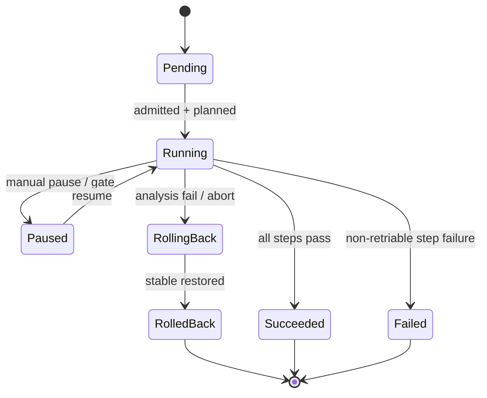
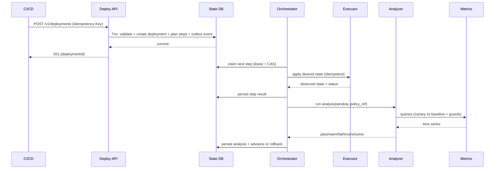

## Overview

Safe deployments are hard because change and risk are inseparable: unknown regressions, noisy signals, partial failures, and distributed dependencies. A production-grade deployment system must shift traffic progressively, evaluate health with statistically meaningful signals, and roll back quickly—without creating a fragile control plane that becomes the single point of failure for shipping.

This design models deployments as **durable workflows**: a **state machine** persisted to a transactional database, driven by an orchestrator that performs **idempotent steps** and gates progression through a **versioned analysis run** (same queries, windows, thresholds, and policy reference every time). It separates **control plane correctness** (workflow, policy, audit, idempotency) from **data plane actions** (traffic shifting, scaling, rollback) via pluggable executors (Kubernetes, Argo Rollouts, service mesh, ingress/LB). Metric analysis is policy-driven and designed to minimize false positives/negatives via minimum sample sizes, relative comparisons, and SLO burn-rate checks.

**Key insight**: treat deployments as **state transitions + an event log**, and treat “execution” as **reconciliation toward desired state** with retries. You can’t guarantee exactly-once side effects in distributed systems, but you can guarantee **exactly-once state transitions** and **effectively-once execution**.

---

## Requirements

### Functional Requirements
- Create deployment plans supporting **canary**, **blue/green**, and **rolling** strategies per service/environment.
- Perform **progressive traffic shifting** (e.g., 1% → 5% → 25% → 50% → 100%) with configurable step durations and max duration caps.
- Run **automated analysis** per step (latency, errors, saturation, and optionally business KPIs) returning `pass|warn|fail|inconclusive`.
- Support **automatic rollback**, and **abort/pause/resume**, plus **manual approval gates** (e.g., “promote to 100%”).
- Enforce **policy-as-config** (per org/team/service/environment) for allowed strategies, blast radius, concurrency limits, and rollback criteria.
- Provide **real-time status** (timeline, current step, analysis results, links to dashboards/logs/traces).
- Emit **auditable events** for every state transition and human action; integrate with ChatOps and ticketing.
- Support **multi-cluster / multi-region** deployments with safe sequencing and concurrency control.

### Non-Functional Requirements
#### Scale (example target)
- Deployments: **5,000/day** average; **peak 30/min** (spiky CI, incident rollbacks, hotfixes).
- Managed entities: **50,000 service+env** pairs; **500 clusters**; **50–200 teams**.
- Orchestration concurrency: **~200 active deployments** (assumes ~60 min max duration, bursty).
- Audit/event volume:
  - State transitions/events: **~10–30 events/deployment** ⇒ **50k–150k events/day**.
  - Bursts: **500–1,000 events/min** during mass rollouts.
- Telemetry queries:
  - Typical step analysis: **10–25 queries** (SLIs + baselines + guards).
  - Peak analysis QPS: **200–1,000 qps** depending on concurrency and query templates.

#### Latency Targets
- Control plane APIs: **P50 50ms**, **P99 300ms** (excluding auth provider tail latencies).
- Orchestrator “decision loop” (event to action enqueue): **P99 < 2s** (bake windows excluded).
- Rollback trigger → traffic reduction:
  - Service mesh/ingress updates applied: **P99 < 30s** (with locality + retries).
  - Full rollback completion (including scale down): **P99 < 5 min** (depends on workload).

#### Availability, Durability, and Safety
- Orchestration API availability: **99.95% monthly**.
- Safety principle: on prolonged control-plane unavailability, deployments **fail-safe** (default to hold, never “auto-promote” blindly).
- RPO/RTO:
  - Deployment state + audit: **RPO 0** (no lost transitions), **RTO 30 min** (full restore).
  - Derived analytics/reporting: **RPO ≤ 5 min**.

#### Consistency Model
- **Strong consistency** for deployment state transitions (no double-promotes, no split-brain step ownership).
- **At-least-once** delivery for events/webhooks; consumers must de-duplicate.
- **Eventual consistency** for telemetry ingestion and dashboards.

### Constraints & Assumptions
- Primary target: Kubernetes + service mesh (Istio/Linkerd) and/or ingress/LB (NGINX/ALB).
- Metrics provider: Prometheus-compatible and/or SaaS (Datadog/New Relic). Logs/traces optional but supported.
- Small platform team (5–8 engineers); prefer managed databases and proven primitives.
- Compliance: strong auditability (SOX-like change tracking); least privilege for cluster credentials.

---

## Architecture

### High-Level Diagram

```mermaid
graph TB
  CI[Developer / CI] -->|OIDC + Idempotency-Key| API[Deploy API]
  API --> DB[(State DB: Postgres)]
  API -->|Outbox event| DB
  DB --> ORCH[Orchestrator Workers]
  ORCH -->|Reconcile step| EXE[Executors / Agents]
  EXE --> K8S[Kubernetes API / Argo Rollouts]
  EXE --> TM[Traffic Manager<br/>(Mesh / Ingress / LB)]
  ORCH --> AN[Metric Analyzer]
  AN --> MP[Metrics Provider]
  DB --> EB[Event Bus / Webhook Dispatcher]
  EB --> CHAT[ChatOps / Ticketing / Webhooks]
  DB --> AUD[Audit Export<br/>(Object Storage / SIEM)]
```

### Core Concepts
- **Deployment**: intent to move a service in an environment from *current* to *desired version* under a strategy and policy.
- **Plan**: ordered steps (traffic shifts, bakes, analyses, gates) generated from strategy + policy.
- **Step execution**: a leased unit of work owned by one orchestrator worker at a time.
- **Analysis run**: immutable record of queries, time windows, thresholds, policy ref, and result.
- **Control plane vs data plane**:
  - Control plane decides *what should happen* and persists it.
  - Data plane enacts changes (traffic weights, replicas). It may fail; retries are expected.

### Deployment State Machine (Simplified)



---

## Components

### 1) Deploy API (Control Plane Edge)

**Responsibilities**
- Accept deployment requests, validate policies, compute initial plan, and expose status and control operations.
- Enforce authentication/authorization and audit every mutating action.
- Provide idempotency guarantees for CI retries and webhook replays.

**Key Design Decisions**
- **Idempotency keys** for all mutating endpoints (`create`, `pause`, `resume`, `abort`, `approve`).
- **Policy validation** at admission and re-validation at critical transitions (e.g., promote-to-100, region expansion).
- **Safe defaults**: if optional fields are missing, choose conservative values (e.g., require gate for prod final promotion unless policy explicitly allows auto).

**Technology**
- Go/Java service with REST or gRPC.
- OIDC (Okta/GitHub) + RBAC/ABAC (team/service/environment scopes).
- Rate limiting at API gateway (Envoy/Kong).

**Scaling**
- Stateless horizontal scaling behind L7 LB.
- Cache read-heavy status responses with `ETag` + short TTL (1–2s), and/or serve from read replica.

---

### 2) Orchestrator (Durable Workflow + Scheduler)

**Responsibilities**
- Drive deployment state transitions and step execution.
- Ensure **exactly-once state transitions** using transactional updates and leases.
- Schedule timers for bake windows and analysis windows.

**Correctness Model**
- **Leased ownership** per step execution (e.g., `lease_expires_at`) to survive worker crashes.
- **Optimistic concurrency** (row version/CAS) to prevent double-advancement.
- **Outbox pattern** to reliably emit events without losing them during partial failures.

**Technology Choices**
- **Option A: Temporal/Cadence**
  - Pros: strong workflow primitives (timers, retries, signals), excellent observability.
  - Cons: operational dependency; requires expertise.
- **Option B: Postgres + queue + timers**
  - Pros: fewer moving parts; easier for small teams.
  - Cons: you must implement invariants carefully (leases, retries, dedupe).
- **Recommendation**: start with **Postgres + queue** unless you already run Temporal; the system is correctness-sensitive, so whichever you choose must be operated well.

**Scaling**
- Partition work by `environment/cluster` or `service_id` (reduces lock contention).
- Multiple orchestrator workers; ensure fairness (avoid starving older deployments).

---

### 3) Executors / Agents (Data Plane Actions)

**Responsibilities**
- Apply rollout actions: create new ReplicaSet/Deployment, set traffic weights, flip blue/green routes, scale up/down, rollback.
- Report back observed state and any errors.

**Idempotency Strategy**
- Always act via **desired-state reconciliation**:
  - Read current state (routes, weights, replica counts, rollout object state).
  - Compute diff.
  - Apply only what’s missing.
- Store an **execution record** keyed by `(deployment_id, step_index)` with an `attempt` counter and last applied observed state.

**Integration Backends**
- Kubernetes native: `Deployment` + `Service` + `Ingress`/Gateway API.
- Argo Rollouts: reuse proven progressive delivery controller.
- Service mesh: Istio `VirtualService`/`DestinationRule` or Linkerd SMI/HTTPRoute.
- Cloud LB: weighted target groups where supported.

**Security**
- Prefer per-cluster agent with **least privilege** and short-lived credentials if networks are constrained.
- If agentless, use tightly scoped kubeconfigs per cluster/namespace and rotate frequently.

**Scaling**
- Shard by cluster; enforce per-cluster rate limits to respect API server quotas.
- Backoff and jitter on `429/5xx` from Kubernetes API or control planes.

---

### 4) Metric Analyzer (Automated Judgment)

**Responsibilities**
- Evaluate health of candidate vs baseline for each analysis step.
- Produce `pass|warn|fail|inconclusive` with details and links.

**Analysis Principles**
- **Minimum sample size** before deciding (requests and/or minutes); otherwise `inconclusive`.
- Prefer **relative comparisons** (canary vs stable) plus **global incident guards** (e.g., baseline also failing).
- Use **SLO burn-rate checks** for reliability signals:
  - Example: fail if 1m and 5m burn rates exceed thresholds during the step window.
- Avoid “magic numbers”: thresholds and windows come from policy tied to service criticality.

**Example Decision Policy (illustrative)**
- Fail if:
  - Canary error rate exceeds baseline by **≥ 1.0% absolute** *and* canary has **≥ 2,000 requests** in window, or
  - Canary latency p95 exceeds baseline by **≥ 20%** for **two consecutive windows**, or
  - SLO burn rate exceeds **14x** over 5m (fast burn) while baseline is not similarly impacted.
- Warn if:
  - Indicators degrade but do not meet fail criteria; require human approval for next promotion.
- Inconclusive if:
  - Metrics unavailable, rate-limited, or insufficient traffic; extend bake up to a policy cap, then require approval or abort.

**Scaling**
- Concurrency limits per deployment and per provider.
- Prefer precomputed SLIs (Prometheus recording rules) to reduce expensive ad-hoc queries.
- Cache results for identical `(query, window)` for 30–60s.

---

### 5) Policy & Audit (Governance)

**Responsibilities**
- Central definition of strategies, thresholds, approvals, concurrency, and environment safety rules.
- Immutable audit trail for all state transitions and user actions.

**Policy-as-Config**
- Policies are **versioned artifacts** (e.g., GitOps) referenced by `policy_ref` for reproducibility.
- Policy evaluation should be deterministic and included in the deployment record.

**Audit**
- Append-only event log with tamper-evidence (hash chain) and periodic export to object storage / SIEM.
- Every transition includes `actor`, `reason`, and `correlation_id` (CI run, incident ticket, etc.).

---

## Data Model

### Primary Storage (Postgres)

**Tables (core)**
- `deployments`
  - `deployment_id` (UUID, PK)
  - `service_id` (text), `environment` (text)
  - `strategy` (enum: `canary|blue_green|rolling`)
  - `desired_version` (text)
  - `status` (enum: `pending|running|paused|succeeded|failed|aborted|rolling_back|rolled_back`)
  - `current_step` (int)
  - `policy_ref` (text, e.g., git sha)
  - `created_by` (text), `created_at`, `updated_at` (timestamptz)
  - `lock_version` (bigint) for optimistic concurrency

- `deployment_steps`
  - `deployment_id` (FK), `step_index` (int)
  - `type` (enum: `set_weight|flip_route|bake|analysis|manual_gate|rollback`)
  - `desired_state` (jsonb)
  - `status` (enum: `pending|running|succeeded|failed|skipped`)
  - `lease_owner` (text, nullable), `lease_expires_at` (timestamptz, nullable)
  - `attempt` (int)
  - `started_at`, `ended_at` (timestamptz)

- `analysis_runs`
  - `analysis_id` (UUID, PK)
  - `deployment_id` (FK), `step_index` (int)
  - `policy_ref` (text)
  - `window_start`, `window_end` (timestamptz)
  - `queries` (jsonb) (templates + resolved queries)
  - `result` (enum: `pass|warn|fail|inconclusive`)
  - `details` (jsonb) (per-metric values, confidence, links)
  - `created_at` (timestamptz)

- `audit_events`
  - `event_id` (UUID, PK)
  - `deployment_id` (FK, nullable)
  - `actor` (text), `action` (text)
  - `payload` (jsonb)
  - `prev_hash` (bytea), `hash` (bytea)
  - `created_at` (timestamptz)

**Reliability Glue**
- `idempotency_keys`
  - `idempotency_key` (text, PK)
  - `request_hash` (bytea)
  - `response_code` (int), `response_body` (jsonb)
  - `created_at`, `expires_at`

- `outbox_events` (transactional outbox)
  - `outbox_id` (UUID, PK)
  - `event_type` (text), `event_key` (text) (for dedupe/partitioning)
  - `payload` (jsonb)
  - `created_at`, `published_at` (nullable)

**Indexing Notes**
- `deployments(environment, service_id, status, created_at)` for listing/ops.
- `deployment_steps(deployment_id, step_index)` unique.
- Partition `audit_events` and `outbox_events` by time (monthly) if volume grows.

---

## Data Flow

### Deployment Execution (Sequence)



---

## API

### Create Deployment
- `POST /v1/deployments`
- Headers:
  - `Authorization: Bearer <token>`
  - `Idempotency-Key: <uuid>`
- Request:
  ```json
  {
    "serviceId": "checkout",
    "environment": "prod",
    "strategy": "canary",
    "version": "checkout:1.42.0",
    "policyRef": "git:policies@a1b2c3d",
    "parameters": {
      "maxDurationMinutes": 60,
      "canarySteps": [1, 5, 25, 50, 100],
      "bakeSeconds": 300
    }
  }
  ```
- Response `201`:
  ```json
  { "deploymentId": "b6b5b5f6-4e6b-4d0f-9d3a-2dbb7c2b2e7a", "status": "pending" }
  ```
- Errors:
  - `409` policy violation (include machine-readable reason)
  - `422` invalid request
  - `429` rate limited
  - `503` accepted but orchestration degraded (request persisted; execution may lag)

### Get Status
- `GET /v1/deployments/{deploymentId}`
- Response includes:
  - overall status, current step, step timeline
  - current traffic weights (as last observed)
  - last analysis result + links
  - policy reference and approvals history
- Consistency: strongly consistent with the State DB; may show `telemetryPending: true` for very recent actions.

### Control Operations (All Idempotent)
- `POST /v1/deployments/{id}:pause`
- `POST /v1/deployments/{id}:resume`
- `POST /v1/deployments/{id}:abort` (triggers rollback per policy)
- `POST /v1/deployments/{id}:approve`
  - Request:
    ```json
    { "gate": "promote_to_100", "comment": "reviewed dashboards; proceed" }
    ```
- Errors:
  - `409` invalid state transition (include current state + allowed transitions)
  - `403` approval permission denied

### Events / Webhooks
- `POST /v1/webhooks/subscriptions`
- Event types:
  - `deployment.started`, `step.changed`, `analysis.completed`, `deployment.rolling_back`, `deployment.rolled_back`, `deployment.succeeded`, `deployment.failed`
- Delivery semantics: **at-least-once**, signed payloads; consumer de-duplicates by `eventId`.

---

## Scaling & Performance

### Capacity Planning (Rule-of-Thumb)
If you have:
- `C` concurrent deployments,
- `S` analysis steps per deployment,
- `Q` queries per analysis step,
- and an analysis cadence of one window per step,

then peak query QPS is roughly:
- `C * Q / window_seconds` (if all windows aligned) plus retries and dashboards.

Example: `C=200`, `Q=20`, `window=60s` ⇒ ~`67 qps` average, but bursts can be far higher if windows align or retries occur. Plan for **5–10x burst headroom**, especially with SaaS rate limits.

### Likely Bottlenecks & Mitigations
- **Metrics provider rate limits / latency**
  - Concurrency caps, query caching, precomputed SLIs, exponential backoff, and `inconclusive` outcomes.
- **Kubernetes API throttling**
  - Per-cluster token buckets, backoff/jitter, prefer controller-based systems (Argo Rollouts) where possible.
- **DB contention (hot rows)**
  - Minimize “chatty” updates; store step progress in `deployment_steps` and keep `deployments` as a compact summary.
  - Use leases + CAS; avoid tight polling by relying on timers/events.

### Horizontal Scaling
- API/orchestrator/analyzer: stateless services scaled behind LBs.
- Executors: sharded by cluster/region; optionally per-cluster agents for locality and network constraints.
- Postgres: HA primary + read replicas; time partition large append-only tables (audit/outbox).

### Caching
- Status endpoints: 1–2s TTL + `ETag` to reduce DB pressure without hiding rapid changes.
- Analysis queries: cache per `(query, window)` for 30–60s.

---

## Trade-offs & Alternatives

### Key Trade-offs
1) **Workflow engine (Temporal) vs custom orchestrator**
- Choice: depends on org maturity.
- Trade-off: Temporal improves correctness/visibility but adds operational overhead; custom is simpler infra but higher correctness burden.
- Why it matters: deployments are long-running, failure-prone workflows where correctness dominates.

2) **Automated rollback vs human-only gates**
- Choice: automated rollback on clear SLO breaches; manual gates for high-risk promotions (e.g., 50%→100% in prod).
- Trade-off: faster incident containment vs occasional false positives and more policy tuning.
- Why it matters: rollback speed is one of the strongest levers on incident severity.

3) **Relative analysis vs absolute thresholds**
- Choice: compare canary to baseline plus global guards.
- Trade-off: more complex queries/logic vs fewer false alarms during traffic shifts, seasonality, and partial incidents.
- Why it matters: absolute thresholds often misfire during rollout-induced traffic changes.

4) **Agentless executors vs per-cluster agents**
- Choice: agentless for simplicity; per-cluster agents for constrained networks/stronger isolation.
- Trade-off: fewer components vs better security boundaries and lower latency to cluster operations.

### Alternatives
- **GitOps-only (Argo CD + Argo Rollouts/Flagger)**: great for Kubernetes-native progressive delivery; may not cover cross-system orchestration, unified audit/approvals, or heterogeneous environments.
- **Spinnaker-style platform**: powerful at scale but operationally heavy and customization-intensive for smaller teams.
- **Service mesh-only delivery**: ideal where mesh is ubiquitous; insufficient when relying on ingress/LB, TCP workloads, or mixed stacks.

---

## Failure Modes

### Failure Scenarios & Mitigations
1) **Metrics provider outage / rate limiting**
- Impact: analysis cannot judge; deployments may stall or risk unsafe promotion.
- Mitigation: mark analysis `inconclusive`, extend bake up to policy cap, then require manual approval or auto-abort (per environment criticality). Use cached/precomputed SLIs and query backoff.

2) **Orchestrator crash mid-step**
- Impact: step may be partially applied; could re-run on restart.
- Mitigation: step leases + retries; executor reconciliation makes replays safe; only advance state via CAS.

3) **Control plane outage while canary is exposed**
- Impact: traffic remains shifted longer than intended.
- Mitigation: “break glass” runbooks (direct mesh/ingress rollback), pre-created stable routes, and independent on-call tooling. Policy can limit max canary exposure (time cap → auto-abort when control plane returns).

4) **DB failover / split-brain risk**
- Impact: potential conflicting transitions if not configured correctly.
- Mitigation: single writable primary, strict transaction isolation, fencing via leases, and careful failover procedures. Treat DB as the source of truth; orchestrators must re-acquire leases after reconnect.

5) **False rollback due to noisy signals**
- Impact: deployment churn, slowed delivery.
- Mitigation: minimum sample sizes, multi-window confirmation, relative/baseline guards, and `warn` state requiring approval.

6) **Over-privileged executor**
- Impact: security/compliance breach.
- Mitigation: per-namespace RBAC, short-lived credentials (STS), scoped service accounts, secret management, and approvals for privileged actions.

### Disaster Recovery
- Postgres: multi-AZ HA, WAL archiving + daily snapshots; regular restore drills.
- Audit: periodic export of hash chain to object storage + SIEM ingestion.
- Recovery behavior: during control-plane downtime, deployments default to **hold**; no automatic promotion without persisted decisions.

---

## Operations

### Observability (for the Deployment System)
**Golden signals**
- API: RPS, P99 latency, 4xx/5xx, auth failures.
- Orchestrator: queue lag, lease expirations, stuck deployments (exceed policy max), CAS conflict rate.
- Analyzer: query latency, error rate, provider `429`, inconclusive rate, analysis duration.
- Executor: apply success rate, Kubernetes throttling, rollback time, drift detected vs desired state.

**Example alerts**
- Orchestrator queue lag P99 > 10s for 5 min.
- Rollback trigger → traffic reduction P99 > 60s for 10 min.
- Inconclusive analyses > 10% of prod steps over 1h.
- Stuck prod deployments > 5.

### Runbooks (Minimum)
- Break-glass rollback via mesh/ingress/LB (no control-plane dependency).
- Metrics provider degraded (reduce query concurrency, switch to precomputed SLIs, force manual gates).
- Kubernetes API throttling (reduce executor concurrency, pause non-critical deployments).
- DB failover procedure and orchestrator re-fencing.

### Safe Rollout of This System (Dogfooding)
- Deploy the deployment system with canary where possible, but keep a fully manual/break-glass path.
- Use backward-compatible schema migrations; feature flags for new analysis logic.
- Keep rollback path for orchestrator binaries; gate irreversible migrations behind pre-prod soak and backups.

---

## References & Further Reading
- Argo Rollouts (progressive delivery for Kubernetes): https://argo-rollouts.readthedocs.io/
- Flagger (canary releases + metrics analysis): https://flagger.app/
- Temporal (durable workflows): https://temporal.io/
- Google SRE Workbook: Canarying Releases: https://sre.google/workbook/canarying-releases/
- Google SRE Workbook: Alerting on SLOs (burn rates): https://sre.google/workbook/alerting-on-slos/
- Spinnaker (continuous delivery platform): https://spinnaker.io/
- Transactional Outbox pattern (reliable event publication): https://microservices.io/patterns/data/transactional-outbox.html