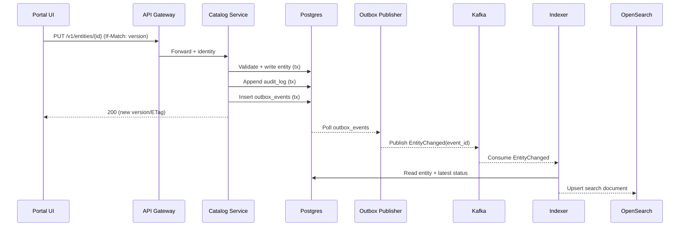
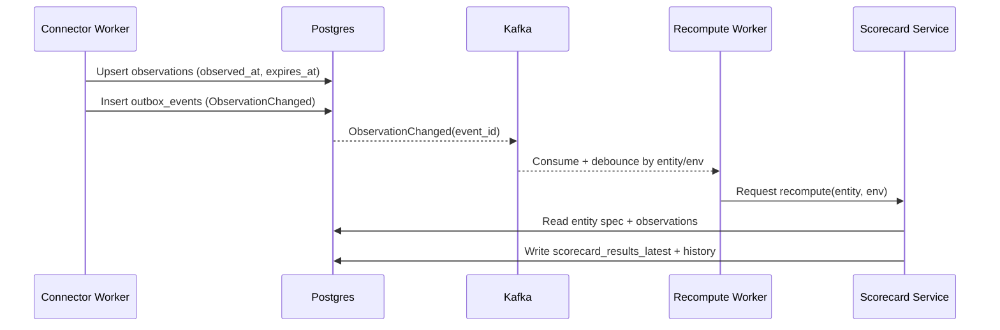

## Overview

A developer portal is an internal **system of record for engineering metadata**: what services and edge workloads exist, who owns them, how to operate them, where they run, and whether they meet organizational expectations (SLOs, on-call, runbooks, security posture, dependency hygiene). The hard problem is not CRUD—it’s **freshness and provenance** across many upstream systems (Git, CI/CD, Kubernetes, IoT registries, observability, incident management) while keeping discovery fast and governance actionable.

A production-grade solution treats the portal as a **metadata platform**:
- **Declared (“spec”) fields**: manually curated, strongly owned, and auditable (ownership, tier, lifecycle, ACL, docs/runbook refs).
- **Observed (“status”) fields**: continuously ingested signals with explicit freshness (deployments, alerts, SLO burn, vulnerabilities, dependency edges).
- **Derived views**: search documents, dependency graphs, and scorecards computed from spec + observed signals and stored with evidence.

Key principle: **every field has a source, refresh policy, and staleness behavior**. This enables reliable discovery, trustworthy scorecards, and safe automation (e.g., blocking production promotion if `owner` or `runbook` is missing).

### Goals
- Make ownership and operational posture **discoverable in seconds**.
- Keep metadata **trustworthy** via provenance, auditing, and freshness indicators.
- Provide **governance that drives action**, not just reporting (scorecards with evidence and trend history).
- Support both **cloud services** and **edge fleets/workloads** with environment- and region-scoped posture.

### Non-goals
- Replacing CI/CD, incident management, or observability systems (the portal links to and summarizes them).
- Storing large document blobs as the primary docs store (docs are sourced from Git/URLs and optionally rendered).
- Real-time dependency correctness guarantees (dependency data is inherently probabilistic and source-dependent).

---

## Requirements

### Functional Requirements
- Entity registration:
  - Manual create/update/archive.
  - “Register from repo” using a descriptor file (e.g., `portal.yaml`) and Git webhooks.
- Ownership & governance:
  - Team ownership, on-call refs, escalation policy refs.
  - RBAC/ABAC controlled edits; restricted entities/namespaces supported.
  - Audit history for critical fields.
- Documentation hub:
  - Link and optionally render versioned docs/runbooks/ADRs from Git (`repo:path@ref`) or URLs.
- Operational scorecards:
  - Configurable checks across environments (SLOs, alerting, security scans, backups, dependency hygiene).
  - Evidence attached to each check (links, queries, metric snapshots, scan IDs).
  - History/trends and org-level rollups.
- Discovery & navigation:
  - Full-text + faceted search (kind, owner, tags, domain, runtime, environment, region/fleet).
  - Browse by taxonomy (domain, platform, lifecycle, tier).
- Dependency mapping:
  - Service-to-service and service-to-edge relationships.
  - Confidence scoring and multiple sources (tracing/mesh/manual).
  - Blast-radius queries and graph visualization.
- Integrations:
  - Git provider, CI/CD, Kubernetes, edge orchestrator/registry, vulnerability scanner, observability, incident management.
  - Support both webhooks (push) and scheduled syncs (pull).
- Freshness & staleness:
  - Per-source last-success, per-field observed timestamps, expiry policies, and UI staleness banners.

### Non-Functional Requirements (Targets)
- Scale (initial):
  - ~10,000 entities (services + edge workloads + libraries + pipelines)
  - ~2,000 teams, ~50,000 engineers
  - Portal traffic: 500–2,000 QPS reads peak; 5–50 QPS writes peak
  - Ingestion: 1,000–10,000 events/min sustained; bursts during deploy windows
- Latency (user-facing, warm cache):
  - Entity page data (catalog): P50 < 50 ms, P99 < 200 ms
  - Search: P50 < 150 ms, P99 < 500 ms
  - Scorecard page render: P99 < 800 ms (parallelized calls; degrade gracefully)
- Availability:
  - 99.9% monthly for core catalog read/write
  - Graceful degradation when search/integrations are unavailable
- Consistency:
  - Strong consistency for declared fields (ownership, tier, ACL, lifecycle) via the catalog DB
  - Eventual consistency for observed signals and derived artifacts (search index, dependency graph, scorecards)
- Data protection:
  - No silent loss of manual edits; audit log for sensitive changes
  - RPO ≤ 15 minutes, RTO ≤ 1 hour for catalog DB

### Constraints & Assumptions
- Enterprise SSO via OIDC/SAML; teams and groups managed in the IdP.
- Portal/platform team of ~6–10 engineers; integrations must be incremental, resilient, and observable.
- Vendor APIs may be rate-limited; ingestion must back off, checkpoint, and avoid thundering herds.
- Multi-environment (dev/stage/prod) plus edge fleets/regions; posture is environment-scoped.

---

## Architecture

### High-Level Diagram

```mermaid
flowchart TB
  U[Engineer] --> UI[Portal UI (SSR + CDN)]
  UI --> GW[API Gateway / BFF]

  GW --> CAT[Catalog Service]
  GW --> SCH[Search API]
  GW --> SC[Scorecard API]
  GW --> DOC[Docs Renderer (optional)]

  CAT --> PG[(Postgres: catalog + audit + observations + deps)]
  SC --> PG

  subgraph Events
    K[(Kafka)]
    OBX[Outbox Publisher]
    IDX[Indexing Worker]
    REC[Recompute Worker]
  end

  CAT --> PG
  PG --> OBX --> K
  K --> IDX --> OS[(OpenSearch: derived index)]
  K --> REC --> SC

  subgraph Integrations
    CONN[Connector Workers]
  end
  CONN --> PG
  CONN --> K
```

### Why this architecture
- **Postgres is the source of truth** for declared data and auditability.
- **Derived systems (OpenSearch, scorecard results)** are rebuilt from events and state; they can be down without losing correctness of manual edits.
- **Outbox pattern** prevents dual-write inconsistencies (write DB + publish event) and supports at-least-once delivery with idempotent consumers.
- **Connectors write observations** with explicit expiry and publish normalized events to trigger recompute/index refresh.

### Consistency model (practical)
- Declared edits: single DB transaction, optimistic concurrency via ETag/version.
- Observations: upsert with `observed_at` and `expires_at`; readers show freshness and degrade behavior.
- Scorecards/search: updated asynchronously; UI displays “last computed” and “data freshness” per source.

---

## Components

### Portal UI
**Responsibilities**
- Entity pages, search/browse, docs rendering view, dependency graph, scorecards, admin/config.

**Key decisions**
- Parallelize calls (entity + latest scorecards + deps) and render partial results with clear “stale/unavailable” states.
- Prefer links to source systems; rendering is an optimization, not a dependency.

**Scaling**
- CDN for static assets; SSR nodes are stateless and horizontally scaled.
- Short TTL caching + ETag revalidation for entity pages.

---

### API Gateway / BFF
**Responsibilities**
- Central authn, request shaping, rate limiting, aggregation for UI, consistent error format.

**Key decisions**
- Keep authorization decisions centralized (shared authz library) to avoid drift.
- Enforce per-user and per-client (mTLS) quotas; protect downstreams from fanout spikes.

---

### Catalog Service
**Responsibilities**
- Entity lifecycle, declared fields, taxonomy, ACLs, audit log, idempotent writes, serving the “golden record”.

**Key decisions**
- Model fields as:
  - `spec`: declared, validated at write time, strongly owned
  - `status`: read-optimized view of latest observations (optional denormalized table/view)
- Emit change events via outbox for reindexing and recompute triggers.

**Scaling**
- Stateless service behind an L7 load balancer.
- Read replicas for heavy reads; Redis for hot entity reads if needed.
- Careful indexing on `(namespace, name)`, `(owner_team_id)`, and `updated_at`.

---

### Connector (Ingestion) Workers
**Responsibilities**
- Integrate with upstream systems (Git, CI, K8s, edge registry/orchestrator, vuln scanners, observability, incident mgmt).
- Normalize signals into a stable internal schema and write observations with freshness metadata.

**Key decisions**
- Connector pattern:
  - Isolated modules per upstream system
  - Rate limiting, retries with jitter, checkpointing (cursor/etag/time windows)
  - Per-source health: `last_success_at`, `last_error`, `backoff_until`
- Prefer webhooks where possible; periodic reconciliation to correct drift.

**Scaling**
- Partition work by `(connector, account, resource_scope)` and scale concurrency per partition.
- Protect upstreams with adaptive backoff; protect the portal with bounded queues.

---

### Indexing Worker + Search API
**Responsibilities**
- Maintain derived search documents in OpenSearch and serve full-text/faceted queries.

**Key decisions**
- Only index **denormalized search documents** derived from catalog + latest observations.
- Use **versioned indices** (e.g., `entity_search_v3`) + alias swap for mapping changes.

**Scaling**
- Scale OpenSearch by shards/replicas; keep mappings stable and explicit.
- Cache top queries (short TTL) and include auth scope in cache keys when filtering differs by user.

---

### Scorecard Service + Recompute Worker
**Responsibilities**
- Define checks, compute results, store history, and expose evidence/explanations.

**Key decisions**
- Declarative scorecards (JSON/YAML) compiled into evaluators; optionally use CEL/OPA for complex policy.
- Persist:
  - latest results per `(entity, environment, scorecard)`
  - historical results for trend charts and governance reporting
- Debounce recomputes (entity-level queue) to prevent storms on bursty ingestion.

**Scaling**
- Event-triggered recompute for relevant changes + periodic backfill (e.g., hourly) for drift.
- Precompute aggregates for dashboards (by team/domain/tier).

---

### Docs Renderer (Optional)
**Responsibilities**
- Fetch and render docs from Git/URLs into safe HTML; cache outputs.

**Key decisions**
- Treat rendering as best-effort; always keep a fallback to source links.
- Sanitize HTML and restrict external fetches to prevent SSRF and content injection.

---

## Data Model

### Entity identity
Use a stable human-readable reference plus an immutable ID:
- `entity_id`: UUID (immutable)
- `entity_ref`: `kind:namespace/name` (unique, used in links and APIs)

### Postgres (System of Record)

**Core tables (recommended minimum)**
- `entities`
  - `entity_id` (UUID PK)
  - `entity_ref` (TEXT UNIQUE)
  - `kind` (ENUM)
  - `namespace` (TEXT)
  - `name` (TEXT)
  - `lifecycle` (ENUM: alpha, beta, prod, deprecated)
  - `tier` (SMALLINT: 0–3)
  - `owner_team_id` (UUID FK)
  - `repo_url` (TEXT)
  - `docs_ref` (TEXT) — URL or `repo:path@ref`
  - `spec` (JSONB) — declared metadata
  - `acl` (JSONB) — view/edit groups, default-deny for restricted namespaces
  - `version` (BIGINT) — optimistic concurrency
  - `deleted_at` (TIMESTAMPTZ NULL) — soft delete
  - `created_at`, `updated_at`

- `teams`
  - `team_id` (UUID PK)
  - `name` (TEXT UNIQUE)
  - `idp_group` (TEXT UNIQUE)
  - `oncall_ref` (TEXT)

- `observations`
  - `obs_id` (UUID PK)
  - `entity_id` (UUID FK)
  - `source` (TEXT) — `k8s`, `prometheus`, `edge_registry`, `vuln_scanner`, ...
  - `environment` (TEXT)
  - `observed_at` (TIMESTAMPTZ)
  - `expires_at` (TIMESTAMPTZ)
  - `data` (JSONB)
  - Index: `(entity_id, source, environment, observed_at DESC)`

- `dependencies`
  - `from_entity_id` (UUID FK)
  - `to_entity_id` (UUID FK)
  - `type` (ENUM: calls, publishes, consumes, depends_on)
  - `source` (TEXT) — `tracing`, `mesh`, `manual`
  - `confidence` (SMALLINT 0–100)
  - `updated_at` (TIMESTAMPTZ)
  - PK/unique: `(from_entity_id, to_entity_id, type, source)`

- `scorecard_definitions`
  - `scorecard_id` (UUID PK)
  - `name` (TEXT UNIQUE)
  - `scope` (JSONB) — kinds, namespaces, tiers
  - `definition` (JSONB) — checks, weights, thresholds, evidence rules
  - `version` (BIGINT)
  - `enabled` (BOOL)

- `scorecard_results_latest`
  - `(entity_id, environment, scorecard_id)` UNIQUE
  - `score` (SMALLINT 0–100)
  - `status` (ENUM: pass, warn, fail)
  - `computed_at` (TIMESTAMPTZ)
  - `details` (JSONB) — per-check results + evidence pointers

- `scorecard_results_history`
  - append-only for trends and audits; partition by month if needed

- `audit_log`
  - `audit_id` (UUID PK)
  - `actor` (TEXT)
  - `action` (TEXT)
  - `entity_id` (UUID NULL)
  - `before` (JSONB), `after` (JSONB)
  - `created_at` (TIMESTAMPTZ)

**Eventing (outbox)**
- `outbox_events`
  - `event_id` (UUID PK)
  - `event_type` (TEXT) — `EntityChanged`, `ObservationChanged`, ...
  - `entity_id` (UUID NULL)
  - `payload` (JSONB)
  - `created_at` (TIMESTAMPTZ)
  - `published_at` (TIMESTAMPTZ NULL)

Outbox publisher reads unpublished rows and publishes to Kafka with idempotent producer semantics; consumers are idempotent using `(event_id)` de-duplication.

### OpenSearch (Derived Index)
- Index: `entity_search_vN` (alias: `entity_search`)
- Document fields (example):
  - `entity_id`, `entity_ref`, `kind`, `namespace`, `name`
  - `owner_team`, `tags[]`, `lifecycle`, `tier`
  - `envs[]`, `runtimes[]`, `regions[]`, `fleets[]`
  - `last_observed_at`, `staleness_flags[]`
  - `text` (full-text composite)

---

## Data Flow

### Manual register/update (declared fields)



### Ingestion → observations → scorecards



### Freshness & staleness behavior
- Each observation has `expires_at`; once expired, it is not deleted immediately but treated as stale.
- UI shows:
  - “Last observed at” per source/environment
  - “Data may be stale” banners when critical sources exceed thresholds (e.g., prod deploy status older than 30 minutes)
- Scorecards distinguish:
  - **Fail** (evidence indicates non-compliance)
  - **Warn** (missing or stale evidence)
  - **Pass** (fresh evidence indicates compliance)

---

## API Design

### Authn/Authz
- **Authn**: OIDC at gateway; JWT with user identity, group claims, and expiry.
- **Authz**: RBAC/ABAC:
  - `acl.view`: groups allowed to view
  - `acl.edit`: groups allowed to edit
  - Default-deny for restricted namespaces; least-privilege by design
- **Admin**: gated by `portal-admin` group and audited.

### Conventions
- Pagination: `limit` + `cursor` (opaque).
- Concurrency: `If-Match` with entity `version` (or ETag).
- Errors: RFC7807 `application/problem+json` including `traceId`.
- Idempotency: `Idempotency-Key` for mutation endpoints; dedupe within a time window (e.g., 24h).

### Endpoints (representative)

**Entities**
- `GET /v1/entities?kind=&ownerTeamId=&tag=&q=&limit=&cursor=`
- `POST /v1/entities`
- `GET /v1/entities/{entityId}`
- `PUT /v1/entities/{entityId}`
- `PATCH /v1/entities/{entityId}` (optional for partial updates)
- `POST /v1/entities/{entityId}:archive`

**Search**
- `GET /v1/search/entities?q=&filters=&limit=&cursor=`

**Docs**
- `GET /v1/entities/{entityId}/docs`
  - Returns rendered HTML when available plus `source` metadata
  - Falls back to safe links if renderer unavailable

**Dependencies**
- `GET /v1/entities/{entityId}/dependencies?direction=up|down&depth=1&minConfidence=60`
- `GET /v1/blast-radius?entityId=&depth=2` (optional convenience)

**Scorecards**
- `GET /v1/entities/{entityId}/scorecards?environment=prod`
- `POST /v1/scorecards:recompute` (admin/automation) → `202 Accepted`

**Integration health**
- `GET /v1/integrations/health` (admin) showing per-connector last success, lag, and error state

---

## Scaling & Performance

### Hot paths and mitigations
- **Entity page** (catalog + latest scorecards + deps):
  - Parallelize calls; cache entity reads (short TTL) with ETag revalidation.
  - Use read replicas and/or Redis for hot entities (e.g., platform-critical services).
- **Search** (facets and filters):
  - Denormalized documents; constrain facet cardinality; cache common queries briefly.
  - Use index aliases for safe migrations and rollbacks.
- **Ingestion spikes** (deploy windows, fleet churn):
  - Debounce recomputes; bound connector concurrency; checkpoint to avoid full rescans.
- **Scorecard recompute storms**:
  - Coalesce events per `(entity, env)`; prioritize by tier; batch recompute for low-tier entities.

### Data layer sizing (sanity check)
- 10k entities is small for Postgres; the larger growth driver is `observations` and scorecard history.
- Assume:
  - 10k entities × 10 sources × 10 envs × 1 observation/hour retained for 30 days
  - ≈ 72M observation rows/month (needs partitioning + retention policies)
- Practical approach:
  - Partition `observations` and scorecard history by time (monthly) and optionally by environment class (prod vs non-prod).
  - Retain high-cardinality raw signals in the source systems; store normalized summaries in the portal.

### Caching (guidelines)
- Catalog entity reads: 30–120s TTL; invalidate on `EntityChanged`.
- Scorecard latest: 30–60s TTL; show `computed_at` to avoid confusing users.
- Docs rendering: cache by `docs_ref` content hash for 5–30 minutes; purge on Git webhook.
- Search query cache: 10–30s for popular queries; include auth scope if result set differs by permissions.

---

## Trade-offs & Alternatives

### Trade-offs made
1. **Postgres as source of truth**
   - Pros: strong consistency for declared fields, simple operations, JSONB flexibility, robust auditing.
   - Cons: large time-series tables require partitioning/retention discipline.
   - Why: entity count is modest; correctness and auditability dominate.

2. **Derived OpenSearch index for discovery**
   - Pros: fast full-text + faceting; excellent UX at read scale.
   - Cons: derived-index pipeline complexity; eventual consistency.
   - Why: search is a primary portal feature; keeping OS derived avoids correctness risk.

3. **Event-driven scorecards**
   - Pros: decouples UI latency from upstream slowness; responsive updates; enables history.
   - Cons: recompute control is needed; results are eventually consistent.
   - Why: evidence sources are asynchronous and sometimes unavailable.

4. **Outbox pattern for eventing**
   - Pros: avoids dual-write bugs; supports replay and rebuild.
   - Cons: adds operational moving parts (publisher, idempotent consumers).
   - Why: portal trust depends on not losing or mis-ordering critical changes.

### Alternatives
- **Backstage-based portal**
  - Pros: ecosystem, plugins, fast initial delivery.
  - Cons: plugin maintenance, customization constraints, provenance/scorecard rigor may require substantial backend work.
  - Fit: great if you can align to Backstage’s model and leverage existing plugins; otherwise consider Backstage UI + custom backend.

- **Graph database for dependencies (Neo4j)**
  - Pros: rich traversals and graph analytics.
  - Cons: additional datastore and duplication; ingestion complexity.
  - Fit: upgrade path if deep graph queries become core (beyond simple blast-radius and visualization).

- **Monolith**
  - Pros: fastest to start, fewer deployments.
  - Cons: search/indexing and ingestion dominate complexity; scaling and blast radius worsen over time.
  - Fit: acceptable early only if strict boundaries are maintained internally.

---

## Failure Modes & Mitigations

### 1) OpenSearch outage
- **Impact**: Search degraded/unavailable; entity pages still load via catalog.
- **Detection**: OS health, search error rate, indexing lag.
- **Mitigation**:
  - Circuit breaker in search API
  - Fallback to catalog browse (recent by team/namespace)
  - Buffer index events for replay; rebuild index from DB if needed

### 2) Upstream integration rate limiting / outage
- **Impact**: Observed fields stale; scorecards may downgrade to warn due to missing evidence.
- **Detection**: Connector last-success age, error budgets per connector, backlog growth.
- **Mitigation**:
  - Adaptive backoff + jitter, checkpointed incremental sync
  - UI staleness indicators and “data source unhealthy” banners
  - Expire observations via `expires_at` (avoid hard deletes that hide the problem)

### 3) Bad scorecard rule rollout
- **Impact**: False org-wide failures; teams lose trust and start ignoring the portal.
- **Detection**: Canary evaluation, anomaly detection on pass/fail distribution, admin review.
- **Mitigation**:
  - Versioned definitions, staged rollout by namespace/tier
  - Instant rollback to previous version
  - Require evidence links for failing checks to speed triage

### 4) Authorization bug (ACL bypass)
- **Impact**: Sensitive metadata exposure internally.
- **Detection**: Audit log review, access log anomaly detection, security testing.
- **Mitigation**:
  - Default-deny ACL for restricted namespaces
  - Centralized authz library + integration tests for a permission matrix
  - Separate “restricted” indices or per-doc security filtering if using OpenSearch security features

### 5) Kafka / eventing disruption
- **Impact**: Index and scorecard updates lag; catalog remains correct.
- **Detection**: Consumer lag, outbox backlog, publish failures.
- **Mitigation**:
  - Outbox retains events until published; consumers resume from offsets
  - Provide “last indexed” / “last computed” timestamps in UI
  - Rebuild derived views from DB on recovery

### 6) Postgres primary failure
- **Impact**: Writes unavailable; reads may continue on replicas (depending on topology).
- **Detection**: DB health checks, failover alarms, replication lag.
- **Mitigation**:
  - Managed Postgres with automated failover (multi-AZ)
  - Short TTL caches and graceful “read-only mode” messaging
  - Idempotency keys for safe client retries

### Disaster Recovery
- **Targets**: RPO ≤ 15 min, RTO ≤ 1 hr.
- **Backups**: continuous WAL archiving + daily snapshots; monthly restore drills.
- **Rebuild strategy**: after DB restore, replay outbox/Kafka to rebuild OpenSearch and backfill scorecard latest/history as needed.

---

## Operations

### SLOs (portal itself)
- Catalog read availability: 99.9% monthly
- Catalog write availability: 99.9% monthly
- P99 latency: entity read < 200 ms, search < 500 ms
- Data freshness SLI: % of tier-0/1 entities with non-expired prod observations for critical sources (deploy status, on-call ref, vuln scan) within defined windows

### Monitoring & alerting (examples)
- API golden signals: RPS, error rate, P95/P99 latency, saturation
- Catalog correctness: validation failures, optimistic-concurrency conflicts, audit append errors
- Outbox/eventing: outbox backlog age, publish failures, consumer lag, dedupe rate
- Ingestion: per-connector last-success age, retry counts, rate-limit events, checkpoint drift
- Search: query latency, error rate, indexing throughput, cluster health
- Scorecards: recompute queue depth, compute latency, evaluation errors, “missing evidence” rates

### Deployment & change management
- Canary/blue-green for stateless services; feature flags for UI and scorecard definition rollout.
- DB migrations: expand/contract; avoid long locks; backfill asynchronously.
- OpenSearch: versioned index + alias swap; keep N-1 index for quick rollback.
- Runbooks: documented procedures for reindex, recompute backfill, connector disablement, and incident response.

### Security operations
- Secrets in Vault/KMS; rotate connector tokens; least privilege per integration.
- Audit logs retained with access controls; periodically reviewed for admin actions.
- Regular permission-matrix tests and static analysis for authz code paths.

---

## Security & Compliance

- **Data classification**: treat some namespaces/entities as restricted; require explicit `acl.view` grants.
- **Transport security**: TLS everywhere; mTLS for worker-to-API credentials where practical.
- **Input safety**: sanitize rendered docs; restrict outbound fetches (allowlist domains) to reduce SSRF risk.
- **Least privilege**: per-connector service accounts with scoped permissions; separate credentials per environment.
- **Auditability**: immutable audit log entries for ownership, tier, lifecycle, ACL, and scorecard definition changes.

---

## References & Further Reading
- Spotify Backstage (service catalogs): https://backstage.io/
- Google SRE Book (SLIs/SLOs, error budgets): https://sre.google/sre-book/table-of-contents/
- OpenSearch documentation: https://opensearch.org/docs/
- “Designing Data-Intensive Applications”: https://dataintensive.net/
- CNCF TAG App Delivery – Platform Engineering: https://tag-app-delivery.cncf.io/
- Transactional Outbox pattern (concept overview): https://microservices.io/patterns/data/transactional-outbox.html