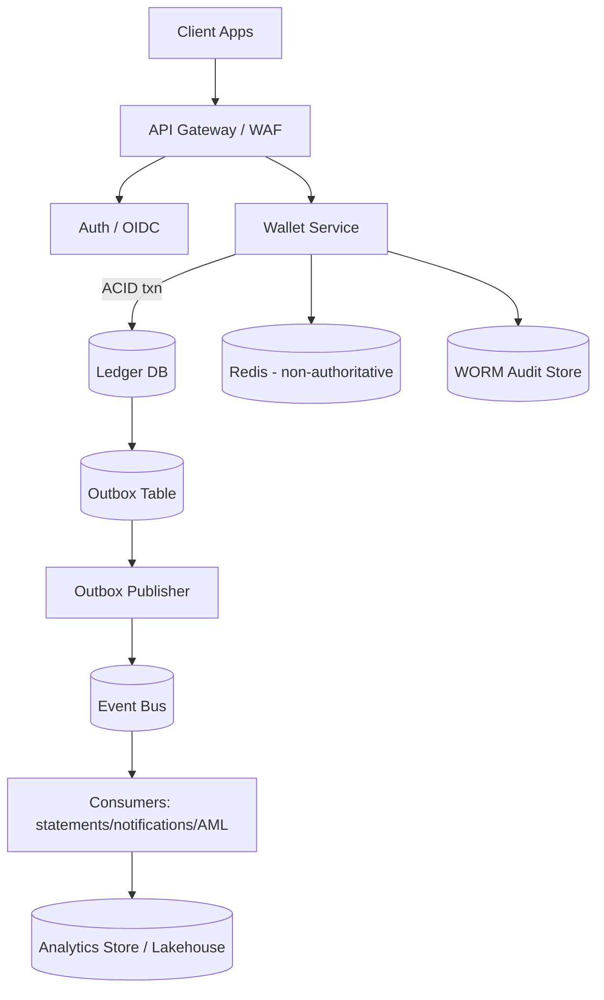
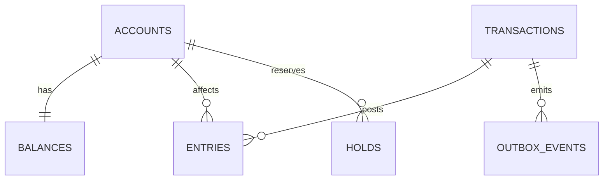

## Overview

A digital wallet maintains user balances while supporting high-throughput peer-to-peer transfers, preventing double-spends/overdraft, and producing an immutable audit trail suitable for investigations and compliance.

The core idea is to make the **ledger** the source of truth using **double-entry accounting** and an **append-only journal**:
- Every money movement posts **balanced debit/credit entries** (sum of legs per currency equals 0) in a single ACID transaction.
- “Balances” are **derived** from the journal and optionally **materialized** for fast reads (updated transactionally with journal writes).
- Auditability comes from **immutability**, **tamper-evidence** (hash chaining + signatures), and **reconciliation** between materialized views and the journal.

This design is interview-friendly because it makes correctness explicit: the balance is not a number you update; it’s a verifiable consequence of a complete, ordered history.

## Requirements

### Functional Requirements
- Create and manage wallet accounts per user and currency.
- Support peer-to-peer transfers with atomic debit/credit posting.
- Prevent double-spend and overdraft (unless explicitly allowed via credit line).
- Provide transaction history and downloadable statements.
- Support idempotent transfer submission (safe retries from clients).
- Support holds/reservations (e.g., pending card authorization), plus capture/release/expiry.
- Support admin operations: adjustments, reversals, and account freezing.
- Provide audit trails and reconciliation reports.

### Non-Functional Requirements (Targets)
**Scale (illustrative)**
- Users: 10M
- Accounts: 50M (multi-currency)
- Transfers: peak 5,000/sec, sustained 1,000/sec during busy hours
- Balance reads: peak 50,000/sec
- History/statement reads: 200,000/day
- Ledger writes: typical transfer = 2 entries (plus optional fees); plan for **10–30B journal entries/year** depending on sustained throughput, holds, and fee legs.

**Latency (single-region strong consistency)**
- Balance read: P50 20ms, P99 100ms
- Transfer submit (posted): P50 80ms, P99 250ms

**Availability**
- Transfers + balance reads: 99.99% (monthly)
- Statements/reporting: 99.9% (monthly)

**Consistency**
- Transfers/holds: **linearizable** (no double-spend; exactly-once effect via idempotency)
- Balance reads: strong by default; optional bounded-stale for non-critical UI refresh
- Reporting/analytics: eventual consistency

**Durability**
- RPO 0 for committed ledger entries
- RTO 30 minutes (regional failover)
- Retention: ledger entries retained 7–10 years (regulatory/business), with immutable exports

### Constraints & Assumptions
- Single legal entity wallet (not a full bank core), but must be audit-ready.
- Monetary amounts stored as integer **minor units** (e.g., cents); no floats anywhere in the ledger path.
- No FX inside a transfer; cross-currency flows are separate products (quote/convert/settle).
- Team can operate distributed SQL + Kafka/PubSub; budget supports multi-zone and (optionally) multi-region.

## Architecture

### High-Level Diagram



### Key Architectural Principles
- **Single writer of invariants**: the Wallet Service is the only component allowed to mutate ledger state.
- **ACID for money movement**: ledger write path is transactional end-to-end (journal entries + balance materialization + idempotency + outbox row).
- **Asynchronous side effects**: statements, notifications, AML/risk, and analytics consume committed events; they never affect correctness of balances.

## Core Concepts (What Interviewers Look For)

### Double-Entry Accounting
Each transfer creates at least two entries:
- Debit the sender’s account.
- Credit the receiver’s account.

Optionally add more legs (fees, interchange, platform revenue) as additional accounts. The invariant is always:
- For each `txn_id` and `currency`: `sum(credits) - sum(debits) == 0`

### Append-Only Journal
Journal entries are immutable. Corrections are made via:
- **Reversal transaction** (negating/compensating entries) or
- **Adjustments** with explicit admin attribution and reason codes

### Materialized Balances
To serve fast balance reads:
- Maintain a `balances` table updated in the **same transaction** as journal inserts.
- Periodically reconcile `balances` against `entries` to detect drift, corruption, or bugs.

### Idempotency (Exactly-Once Effect at the API Boundary)
Clients retry on timeouts and 5xx/503. The system must ensure a retry does not duplicate money movement by using:
- Required `Idempotency-Key`
- Request hashing to detect key reuse with different payload
- Stored canonical response

## Components

### API Gateway
**Responsibilities**
- TLS termination, routing, WAF, rate limiting, request size limits
- Enforce idempotency header on mutating endpoints

**Notes**
- Apply global and per-user throttles to protect the ledger from retry storms.
- Use consistent request IDs (`X-Request-Id`) for tracing.

### Auth / Authorization
**Responsibilities**
- Token validation (OIDC JWT/PASETO), scopes/roles
- Step-up auth for sensitive operations (high-value transfers, device changes)
- Fine-grained authorization: user owns account, account not frozen, policy checks

**Notes**
- Prefer short-lived access tokens and continuous risk signals (device, velocity).

### Wallet Service (Money Movement)
**Responsibilities**
- Transfers, holds, captures/releases, adjustments, reversals
- Enforce invariants: no overdraft (unless configured), currency match, account state
- Transaction history and balance reads (from authoritative DB)

**Correctness techniques**
- Deterministic lock ordering (e.g., lock `balances` rows by increasing `account_id`) to avoid deadlocks.
- Use serializable transactions or explicit row locks depending on the DB.

### Ledger DB (Source of Truth)
**Responsibilities**
- Accounts, balances (materialized), transactions, journal entries
- Idempotency keys and outbox rows

**Technology**
- Distributed SQL with strong consistency (e.g., Spanner/CockroachDB/YugabyteDB).
- For smaller deployments: single-region Postgres can work if TPS/availability needs are lower and HA is handled carefully.

### Outbox Publisher + Event Bus
**Responsibilities**
- Publish domain events for committed ledger changes without coupling the write path to Kafka/PubSub availability.

**Notes**
- Outbox publisher polls `outbox_events` and marks rows published.
- Consumers build statements, notifications, AML/risk signals, and analytics projections.

### WORM Audit Store
**Responsibilities**
- Immutable exports (e.g., daily/hourly journal slices), tamper-evident proofs, access-controlled retrieval

**Notes**
- Implement as object storage with WORM/retention locks (e.g., S3 Object Lock) plus KMS.
- Store signed manifests to prove completeness (e.g., list of exported `txn_id`s + hashes).

## Data Model

### Relational Schema (Authoritative)

**accounts**
- `account_id` (UUID, PK)
- `user_id` (UUID, indexed)
- `currency` (CHAR(3))
- `status` (ENUM: active, frozen, closed)
- `created_at` (TIMESTAMP)

**balances** (materialized, authoritative for reads; reconciled against journal)
- `account_id` (UUID, PK, FK accounts)
- `posted_balance_minor` (BIGINT)
- `held_balance_minor` (BIGINT)
- `available_balance_minor` (BIGINT)
- `updated_at` (TIMESTAMP)
- Constraint (if no overdraft): `available_balance_minor >= 0`

**transactions** (business object; immutable after posting except status transitions)
- `txn_id` (UUID, PK)
- `type` (ENUM: p2p, hold_place, hold_capture, hold_release, adjust, reversal)
- `status` (ENUM: pending, posted, voided)
- `request_scope` (STRING) — e.g., `user_id:client_id:endpoint`
- `idempotency_key` (STRING)
- `created_at` (TIMESTAMP)
- `posted_at` (TIMESTAMP, nullable)
- `metadata` (JSONB)
- Unique: `(request_scope, idempotency_key)`

**entries** (append-only journal)
- `entry_id` (UUID, PK)
- `txn_id` (UUID, indexed)
- `account_id` (UUID, indexed)
- `amount_minor` (BIGINT, > 0)
- `currency` (CHAR(3))
- `direction` (ENUM: debit, credit)
- `posted_at` (TIMESTAMP)
- `entry_hash` (BYTES) — `H(entry_fields || prev_hash)`
- `prev_entry_hash` (BYTES, nullable)

Invariant: for each `txn_id` and `currency`, debits equal credits.

**holds** (reservation state; not posted funds yet)
- `hold_id` (UUID, PK)
- `account_id` (UUID, indexed)
- `amount_minor` (BIGINT, > 0)
- `currency` (CHAR(3))
- `status` (ENUM: active, captured, released, expired)
- `idempotency_key` (STRING)
- `request_scope` (STRING)
- `created_at` (TIMESTAMP)
- `expires_at` (TIMESTAMP)
- Unique: `(request_scope, idempotency_key)`

**idempotency_keys** (optional if folded into `transactions`/`holds`; keep if you want cached responses)
- `request_scope` (STRING)
- `key` (STRING)
- `request_hash` (BYTES)
- `response_blob` (BYTES)
- `status` (ENUM: in_progress, completed)
- `created_at` (TIMESTAMP)
- `expires_at` (TIMESTAMP)
- PK: `(request_scope, key)`

**outbox_events**
- `event_id` (UUID, PK)
- `aggregate_id` (UUID) — commonly `account_id` or `txn_id`
- `type` (STRING)
- `payload` (JSONB)
- `created_at` (TIMESTAMP)
- `published_at` (TIMESTAMP, nullable)

### Entity Relationships



## Data Flows

### Transfer Write Path (Strongly Consistent)

```mermaid
sequenceDiagram
  autonumber
  participant C as Client
  participant W as Wallet Service
  participant D as Ledger DB
  participant O as Outbox Publisher
  participant B as Event Bus

  C->>W: POST /v1/transfers (Idempotency-Key)
  W->>D: BEGIN
  W->>D: Upsert idempotency (in_progress)
  W->>D: Lock balances rows (from,to) in stable order
  W->>D: Validate currency/status/available >= amount
  W->>D: Insert transactions (status=posted) + entries (debit/credit)
  W->>D: Update balances (posted/available for both accounts)
  W->>D: Insert outbox_events
  W->>D: Store canonical response; mark idempotency completed
  W->>D: COMMIT
  W-->>C: 200 {txn_id,status,posted_at}

  O->>D: Poll unpublished outbox_events
  O->>B: Publish events
  O->>D: Mark published_at
```

### Balance Read Path
- Default: strong read of `balances` from the Ledger DB.
- Optional: bounded-stale reads for non-critical UI, clearly labeled (e.g., “Updated a few seconds ago”).
- Cache is allowed only as a **best-effort** optimization (never the source of truth).

## API Design

### Conventions
- Monetary amounts in integer minor units.
- All mutating endpoints require `Idempotency-Key`.
- Standard error envelope:

```json
{
  "error": {
    "code": "insufficient_funds",
    "message": "Available balance is insufficient.",
    "request_id": "string"
  }
}
```

### Create Transfer
`POST /v1/transfers`

Headers:
- `Authorization: Bearer <token>`
- `Idempotency-Key: <opaque-string>` (required)

Request:
```json
{
  "from_account_id": "uuid",
  "to_account_id": "uuid",
  "amount_minor": 2500,
  "currency": "USD",
  "client_reference": "string",
  "metadata": { "note": "rent" }
}
```

Response:
```json
{
  "txn_id": "uuid",
  "status": "posted",
  "posted_at": "2025-12-17T12:34:56Z"
}
```

Errors (HTTP status → `error.code`)
- `400` → `invalid_argument` (amount <= 0, malformed IDs)
- `401` → `unauthenticated`
- `403` → `forbidden` (not owner/not permitted)
- `409` → `currency_mismatch`
- `409` → `insufficient_funds`
- `409` → `idempotency_conflict` (same key, different payload)
- `423` → `account_frozen`
- `429` → `rate_limited`
- `500/503` → `transient` (safe to retry with same idempotency key)

**Idempotency semantics**
- If `(scope, key)` repeats with identical `request_hash`, return the stored response (including `txn_id`).
- If payload differs, return `409 idempotency_conflict`.

### Get Balance
`GET /v1/accounts/{account_id}/balance?consistency=strong|bounded_stale`

Response:
```json
{
  "account_id": "uuid",
  "currency": "USD",
  "posted_balance_minor": 100000,
  "held_balance_minor": 5000,
  "available_balance_minor": 95000,
  "as_of": "2025-12-17T12:35:01Z",
  "consistency": "strong"
}
```

### List Transactions
`GET /v1/accounts/{account_id}/transactions?limit=50&cursor=...`

Response items include:
- `txn_id`, `type`, `status`, `posted_at`
- `amount_minor`, `currency`
- `direction` (from the account’s perspective)
- `metadata`

### Holds
- `POST /v1/holds` (place hold; decreases available, increases held)
- `POST /v1/holds/{hold_id}/capture` (convert hold into posted debit transaction)
- `POST /v1/holds/{hold_id}/release` (release reservation; decreases held, increases available)

Hold operations are transactional and require idempotency keys. Holds should have `expires_at` and automatic expiry processing.

## Consistency Model (Explicit)

### What Must Be Strongly Consistent
- Posting transfers (journal entries + balance updates)
- Holds that affect `available_balance_minor`
- Idempotency dedupe state
- Reads used for authorization decisions (e.g., “do I have funds?”)

### What Can Be Eventually Consistent
- Statements/exports built from events
- Analytics dashboards, aggregates, cohort reporting
- Notifications and email receipts

### Read-Your-Writes
- For user-facing flows (submit transfer → refresh balance), default to strong reads in the same region.
- If offering bounded-stale reads, make it an explicit opt-in and never use it for correctness decisions.

## Scaling & Performance

### Primary Bottlenecks
- **Hot accounts**: high concurrency on a single `balances` row increases lock waits and tail latency.
  - Mitigate with per-account throttles, queueing, and clear error semantics (`429` with retry-after).
- **History queries**: scanning `entries` becomes expensive as the journal grows.
  - Mitigate with clustered indexes `(account_id, posted_at DESC, entry_id)`, pagination by cursor, and offloading statements to reporting stores.
- **Distributed transaction cost**: cross-partition transfers increase commit latency.
  - Mitigate with co-location strategies (place `balances` and most account data by `account_id`) and partition-aware routing.

### Partitioning / Sharding
- Primary keyspace: `account_id` (accounts/balances/holds/entries clustered by account).
- Transfer writes typically touch two accounts; distributed SQL handles this, but co-location still reduces contention and latency.
- Keep write-path secondary indexes minimal; build read-heavy projections asynchronously when possible.

### Caching
- Cache non-authoritative data (profile, FX quotes, token introspection).
- Avoid caching balances as truth. If using a short TTL balance cache:
  - TTL 1–3 seconds
  - Invalidate on new posted events
  - Keep a strong read path available and default for “confirm funds” flows

## Trade-offs & Alternatives

### Trade-offs Made (and Why)
1. **Strongly consistent DB for posting**
   - Pros: simpler correctness story, prevents double-spends, atomic cross-account moves
   - Cons: higher p99 latency and operational complexity than eventual consistency
2. **Double-entry journal + materialized balances**
   - Pros: auditability and fast reads; balances can be reconstructed and verified
   - Cons: write amplification (entries + balance updates) and storage growth
3. **Outbox + async consumers**
   - Pros: isolates correctness path from downstream outages; enables scalable reporting
   - Cons: more moving parts; requires monitoring outbox lag and consumer correctness

### Alternatives (When You’d Choose Them)
- **Single-region Postgres + strict locking**
  - Good for early stage or moderate TPS; simpler ops; cheaper.
  - Harder to meet 99.99% and sustained thousands of TPS without careful HA and scaling.
- **Kafka/event log as system of record**
  - Great replayability; but multi-entity atomicity and strong balance reads require additional consensus/serialization layers.
- **Two-phase settlement (authorize then settle)**
  - Improves availability during partial outages; introduces “pending” UX and more complex reconciliation.

## Failure Modes & Mitigations

### Scenarios (At Least 3)
1. **Client retries after timeout**
   - Risk: duplicate posting
   - Mitigation: mandatory idempotency keys + request hashing + stored canonical response
2. **DB commit succeeds, event publish fails**
   - Risk: missing statements/notifications while ledger is correct
   - Mitigation: transactional outbox + retrying publisher; alert on outbox lag
3. **Zone/node failure during posting**
   - Risk: elevated latency or partial unavailability
   - Mitigation: multi-zone quorum replication + automatic failover; retries with idempotency
4. **Data corruption/tampering attempt**
   - Risk: loss of audit trust
   - Mitigation: append-only permissions, hash chaining, signed exports to WORM, periodic reconciliation
5. **Hot account contention**
   - Risk: p99 latency breach for some users
   - Mitigation: per-account rate limits, queue/serialize on hot keys, degrade non-critical endpoints first

## Operations

### SLOs and Error Budgets
- Transfers success rate: 99.99%
- Transfer latency: P99 ≤ 250ms (in-region)
- Balance reads: P99 ≤ 100ms
- Outbox publish lag: P99 ≤ 30s (reporting path)

### Monitoring & Alerting (Minimum)
- **Ledger path**: `transfer_success_rate`, `p99_transfer_latency`, `db_lock_wait_p99`, `commit_latency_p99`
- **Correctness**: `negative_available_balance_count` (must be 0), `unbalanced_txn_count` (must be 0), reconciliation mismatch counts
- **Idempotency**: conflict rate, in-progress stuck keys, dedupe hit rate
- **Outbox**: unpublished rows, publish lag, event bus consumer lag
- **Security/fraud**: velocity anomalies, unusual device/location patterns, admin actions audit logs

### Reconciliation
- Daily job recomputes balances from journal for a sample and for flagged accounts; weekly full reconciliation as capacity allows.
- Reconcile:
  - `sum(entries)` vs `balances.posted_balance_minor`
  - Holds state vs `balances.held_balance_minor`
  - Export completeness checks (manifest hashes)

### Deployment & Migrations
- Canary releases for Wallet Service with automated rollback (error rate + p99 latency).
- Schema migrations: expand/contract; forward-only migrations preferred for ledger tables.
- Backward-compatible event versioning for consumers.

### Security & Compliance Baseline
- Encrypt at rest with KMS; consider HSM-backed keys for signing audit manifests.
- Strict RBAC/ABAC for admin endpoints; all admin actions are journaled and exported.
- Separate duties: production write access tightly limited; break-glass access fully audited.

### Disaster Recovery
- Targets: RTO 30 minutes; RPO 0 for committed entries.
- Strategy:
  - Multi-zone quorum replication for the ledger.
  - Multi-region: active-passive or multi-region strong consistency depending on DB and latency appetite.
  - During uncertainty: freeze transfers first; allow balance reads only if they are known-safe and consistent.

## References & Further Reading
- Double-entry accounting in software: https://martinfowler.com/articles/accounting.html
- Transactional outbox pattern: https://microservices.io/patterns/data/transactional-outbox.html
- *Designing Data-Intensive Applications* (transactions, logs, consistency): https://dataintensive.net/
- Spanner external consistency / TrueTime: https://cloud.google.com/spanner/docs/true-time-external-consistency
- Payments reliability themes (Stripe engineering): https://stripe.com/blog/engineering